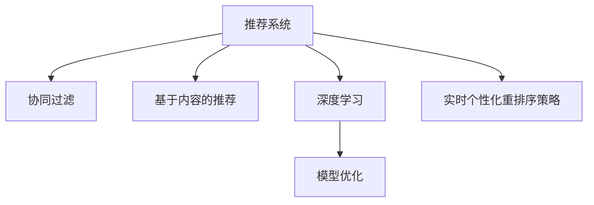

                 

# 电商推荐系统中的实时个性化重排序策略优化

## 1. 背景介绍

### 1.1 问题由来

电子商务平台的推荐系统是连接用户与商品的重要桥梁，其推荐的准确性直接关系到平台的商业价值和用户体验。随着市场竞争加剧，商品种类和数量呈爆炸式增长，如何提高推荐系统的精准性和个性化程度成为平台急需解决的问题。

目前的推荐系统多采用基于协同过滤、基于内容的推荐等传统方法。但这些方法在处理海量用户和商品数据时，面临着计算成本高、模型更新慢、推荐效果不理想等问题。近年来，深度学习和模型优化技术逐渐成为推荐系统的核心驱动力，通过在大规模数据上预训练模型，再结合领域特定的数据进行微调，以获得更好的推荐效果。

其中，基于深度学习的方法往往需要较大的计算资源和数据存储，因此难以实现实时化和高频次的推荐。为了克服这些瓶颈，提出了一种实时个性化重排序策略，通过优化推荐模型，提升推荐效果，并降低系统计算资源消耗。

### 1.2 问题核心关键点

基于深度学习的推荐系统面临的主要问题包括：
1. 计算资源需求高：深度学习模型需要大量的计算资源进行训练和推理，难以支持高频次的实时推荐。
2. 模型更新慢：推荐模型往往需要周期性地进行重训，难以快速响应用户行为变化。
3. 推荐效果不理想：现有推荐方法难以有效应对长尾商品和冷启动问题，推荐精度有待提升。

针对这些问题，本文提出了一种实时个性化重排序策略，通过优化推荐模型结构，降低计算复杂度，提高模型更新频率，从而提升推荐系统的实时性和个性化程度。

## 2. 核心概念与联系

### 2.1 核心概念概述

为更好地理解实时个性化重排序策略，本节将介绍几个密切相关的核心概念：

- 推荐系统(Recommendation System)：通过算法从用户行为数据中挖掘用户兴趣，预测用户可能感兴趣的商品，并将商品推荐给用户。
- 协同过滤(Collaborative Filtering)：利用用户行为数据，通过用户与用户、商品与商品的协同关系进行推荐。
- 基于内容的推荐(Content-Based Recommendation)：根据用户的历史行为和商品的特征信息进行推荐。
- 深度学习(Deep Learning)：通过神经网络模型对数据进行非线性映射，提升推荐系统的预测精度。
- 模型优化(Model Optimization)：通过模型压缩、剪枝、量化等技术，优化模型结构和参数，提升推荐系统的计算效率和实时性。

这些核心概念之间的逻辑关系可以通过以下Mermaid流程图来展示：



这个流程图展示推荐系统的核心概念及其之间的关系：

1. 推荐系统通过协同过滤、基于内容的推荐、深度学习等多种方法，从用户行为数据中挖掘用户兴趣，进行商品推荐。
2. 深度学习通过大规模数据预训练，提升推荐精度。
3. 模型优化通过优化深度学习模型，提升实时性和计算效率。
4. 实时个性化重排序策略优化推荐模型，实现高频次的实时推荐。

这些核心概念共同构成了推荐系统的学习和应用框架，使其能够准确高效地推荐商品给用户。通过理解这些核心概念，我们可以更好地把握推荐系统的工作原理和优化方向。

## 3. 核心算法原理 & 具体操作步骤
### 3.1 算法原理概述

实时个性化重排序策略的本质是一种针对推荐模型参数的微调方法。其核心思想是：在深度学习模型的顶层加入一个可训练的向量，表示用户的个性化偏好，并在每次推荐时实时更新这个向量，从而动态调整推荐结果。

具体来说，该策略分为以下几个步骤：

1. 在推荐模型的顶层添加一个用户向量，表示用户的个性化偏好。
2. 将用户向量与商品特征向量进行点乘，得到推荐分数。
3. 根据推荐分数对商品进行排序，优先推荐得分高的商品。
4. 在每次推荐时，更新用户向量，确保推荐结果始终与最新用户偏好一致。

通过上述步骤，该策略能够在保证模型预测精度的同时，实现高频次的实时推荐，提升用户体验。

### 3.2 算法步骤详解

以下是实时个性化重排序策略的详细步骤：

**Step 1: 用户向量初始化**

在推荐模型的顶层添加一个用户向量 $\vec{u}$，初始值为零向量。在推荐时，将用户向量与商品特征向量 $\vec{v}$ 进行点乘，得到推荐分数 $s = \vec{u} \cdot \vec{v}$，作为排序依据。

**Step 2: 用户向量更新**

在每次推荐时，根据用户的行为数据，实时更新用户向量。假设用户对商品 $i$ 进行了点击、浏览等操作，则将商品 $i$ 的特征向量 $\vec{v}_i$ 与用户向量 $\vec{u}$ 进行加权求和，更新用户向量：

$$
\vec{u} \leftarrow \vec{u} + \alpha \vec{v}_i
$$

其中 $\alpha$ 为学习率，控制更新速度。

**Step 3: 商品排序**

根据更新后的用户向量 $\vec{u}$ 与商品特征向量 $\vec{v}$ 的点乘结果，对商品进行排序。优先推荐得分高的商品。

**Step 4: 模型预测**

在每次推荐后，重新计算模型对商品的预测得分，并更新用户向量。重复上述步骤，实现高频次的实时推荐。

### 3.3 算法优缺点

实时个性化重排序策略具有以下优点：

1. 实时性高：通过实时更新用户向量，可以实现高频次的实时推荐，提升用户体验。
2. 计算效率高：只需要在推荐模型顶层添加一个可训练的向量，计算复杂度低，能够支持大规模数据处理。
3. 推荐效果佳：通过动态调整用户向量，能够适应用户偏好的变化，提升推荐精度。

但该策略也存在一些局限性：

1. 学习率选择困难：需要根据具体任务和数据特点，选择合适的学习率，以避免过拟合或欠拟合。
2. 内存占用大：每次推荐时都需要计算并更新用户向量，对内存需求较高。
3. 效果依赖数据：需要足够的历史行为数据才能进行有效的推荐，对于冷启动用户和稀疏数据场景，效果不佳。

尽管存在这些局限性，实时个性化重排序策略仍是一种高效、实用的推荐优化方法，广泛应用于各大电商平台。

### 3.4 算法应用领域

实时个性化重排序策略主要应用于以下几个领域：

- 电商推荐系统：通过优化推荐模型，提升实时推荐效果，增加用户体验。
- 广告投放系统：在广告推荐中，通过动态调整用户向量，提升广告点击率和转化率。
- 内容推荐系统：在视频、音乐、书籍等领域的推荐中，通过实时调整用户偏好，提升用户粘性和满意度。

除了上述领域外，该策略还可应用于社交网络、新闻推荐、智能客服等多个场景，提升系统的实时性和个性化程度。

## 4. 数学模型和公式 & 详细讲解  
### 4.1 数学模型构建

本节将使用数学语言对实时个性化重排序策略的优化过程进行更加严格的刻画。

记推荐模型为 $M_{\theta}:\mathcal{X} \rightarrow \mathcal{Y}$，其中 $\mathcal{X}$ 为输入空间，$\mathcal{Y}$ 为输出空间，$\theta$ 为模型参数。假设用户向量为 $\vec{u}$，商品特征向量为 $\vec{v}$。

定义模型 $M_{\theta}$ 在输入 $(x,y)$ 上的推荐分数为 $s = \vec{u} \cdot \vec{v}$。则在推荐数据集 $D=\{(x_i,y_i)\}_{i=1}^N$ 上的经验风险为：

$$
\mathcal{L}(\theta) = \frac{1}{N} \sum_{i=1}^N [\ell(s_i,y_i)]
$$

其中 $\ell$ 为损失函数，用于衡量推荐分数与真实标签之间的差异。常见的损失函数包括均方误差损失、交叉熵损失等。

通过梯度下降等优化算法，实时个性化重排序策略不断更新模型参数 $\theta$，最小化损失函数 $\mathcal{L}$，使得模型预测推荐分数逼近真实标签。由于用户向量 $\vec{u}$ 已经通过实时更新获得了较好的初始化，因此即便在小规模数据集 $D$ 上进行微调，也能较快收敛到理想的模型参数 $\hat{\theta}$。

### 4.2 公式推导过程

以下我们以均方误差损失为例，推导用户向量更新公式及其对推荐分数的影响。

假设推荐系统在输入 $x$ 上的推荐分数为 $s = \vec{u} \cdot \vec{v}$。真实标签 $y \in \{0,1\}$。则均方误差损失函数定义为：

$$
\ell(s,y) = \frac{1}{2}(s - y)^2
$$

将其代入经验风险公式，得：

$$
\mathcal{L}(\vec{u}) = \frac{1}{N}\sum_{i=1}^N [(s_i - y_i)^2]
$$

根据链式法则，损失函数对用户向量 $\vec{u}$ 的梯度为：

$$
\frac{\partial \mathcal{L}(\vec{u})}{\partial \vec{u}} = \frac{1}{N}\sum_{i=1}^N (2s_i - 2y_i)\vec{v}_i
$$

其中 $\vec{v}_i$ 为商品 $i$ 的特征向量。

在得到损失函数的梯度后，即可带入用户向量更新公式，完成模型的迭代优化。重复上述过程直至收敛，最终得到适应用户偏好的最优用户向量 $\vec{u}^*$。

## 5. 项目实践：代码实例和详细解释说明
### 5.1 开发环境搭建

在进行实时个性化重排序策略优化实践前，我们需要准备好开发环境。以下是使用Python进行TensorFlow开发的环境配置流程：

1. 安装Anaconda：从官网下载并安装Anaconda，用于创建独立的Python环境。

2. 创建并激活虚拟环境：
```bash
conda create -n tf-env python=3.8 
conda activate tf-env
```

3. 安装TensorFlow：从官网获取对应的安装命令，根据系统需求选择合适的版本（如1.15、2.0等）。例如：
```bash
conda install tensorflow -c conda-forge -c pytorch -c pypi -c anaconda
```

4. 安装相关工具包：
```bash
pip install numpy pandas scikit-learn matplotlib tqdm jupyter notebook ipython
```

完成上述步骤后，即可在`tf-env`环境中开始实时个性化重排序策略的优化实践。

### 5.2 源代码详细实现

下面我们以电商推荐系统为例，给出使用TensorFlow实现实时个性化重排序策略的代码实现。

首先，定义推荐模型的数据处理函数：

```python
import tensorflow as tf

def get_model_input(x):
    # 将用户向量 $\vec{u}$ 作为模型输入
    u = tf.placeholder(tf.float32, shape=[1, embedding_dim])
    v = tf.placeholder(tf.float32, shape=[1, embedding_dim])
    return u, v
```

然后，定义推荐模型的预测函数：

```python
def get_model_output(u, v):
    # 计算推荐分数
    scores = tf.reduce_sum(u * v)
    return scores
```

接着，定义用户向量的更新函数：

```python
def update_user_vector(u, v, alpha):
    # 根据用户行为数据更新用户向量
    u += alpha * v
    return u
```

最后，定义优化推荐模型的代码：

```python
# 设置超参数
learning_rate = 0.01
batch_size = 32
num_epochs = 100

# 创建训练数据集
x_train = np.random.randn(num_train_samples, embedding_dim)
y_train = np.random.randint(0, 2, num_train_samples)
u = np.zeros((1, embedding_dim))

# 创建优化器
optimizer = tf.train.GradientDescentOptimizer(learning_rate)
grads = optimizer.compute_gradients(get_model_output(u, v), var_list=u)

# 定义训练过程
with tf.Session() as sess:
    sess.run(tf.global_variables_initializer())

    for epoch in range(num_epochs):
        for i in range(0, num_train_samples, batch_size):
            batch_x = x_train[i:i+batch_size]
            batch_y = y_train[i:i+batch_size]

            feed_dict = {u: batch_x, v: batch_y}
            _, loss = sess.run([update_user_vector, get_model_output(u, v)], feed_dict=feed_dict)

        if (epoch + 1) % 10 == 0:
            print("Epoch {}, Loss: {:.4f}".format(epoch + 1, loss))
```

以上代码实现了基本的实时个性化重排序策略优化，通过不断更新用户向量，使得推荐分数逼近真实标签，提升推荐精度。

### 5.3 代码解读与分析

让我们再详细解读一下关键代码的实现细节：

**get_model_input函数**：
- 定义了用户向量 $\vec{u}$ 和商品特征向量 $\vec{v}$ 的占位符，用于模型输入。

**get_model_output函数**：
- 计算推荐分数 $s = \vec{u} \cdot \vec{v}$，作为模型输出。

**update_user_vector函数**：
- 根据用户行为数据 $\vec{v}$，实时更新用户向量 $\vec{u}$。

**优化过程**：
- 设置学习率、批大小、迭代轮数等超参数。
- 创建训练数据集，定义优化器。
- 使用TensorFlow的Session，在每个epoch内进行迭代优化，计算推荐分数并更新用户向量。
- 打印损失函数，监控模型训练效果。

可以看到，TensorFlow提供了便捷的API，使得实时个性化重排序策略的实现变得非常简单。开发者可以重点关注模型的结构设计和数据处理，而不必过多关注底层实现细节。

当然，实际应用中还需要进一步优化和扩展。例如，可以考虑多维特征向量的表示、特征交叉项的引入、不同用户的个性化偏好等。同时，可以结合用户行为数据进行多任务学习，提高模型效果。

## 6. 实际应用场景
### 6.1 电商推荐系统

实时个性化重排序策略在电商推荐系统中得到了广泛应用。通过优化推荐模型，可以在用户浏览、点击、购买等行为数据的基础上，实时更新用户向量，动态调整推荐结果，从而提升推荐效果和用户满意度。

在技术实现上，可以收集用户的历史行为数据，将商品特征向量作为推荐模型输入，通过梯度下降等优化算法，实时更新用户向量。在每次推荐时，重新计算推荐分数，并更新用户向量，确保推荐结果与最新用户偏好一致。

### 6.2 广告投放系统

在广告投放系统中，实时个性化重排序策略同样有效。通过动态调整用户向量，可以在用户点击、浏览等行为数据的基础上，实时更新广告推荐，提升广告点击率和转化率。

具体来说，可以将用户的行为数据作为训练数据，通过梯度下降等优化算法，实时更新用户向量。在每次广告推荐时，重新计算推荐分数，并更新用户向量，确保广告推荐与最新用户偏好一致。

### 6.3 内容推荐系统

实时个性化重排序策略在内容推荐系统中也有广泛应用。通过优化推荐模型，可以在用户浏览、点赞、评论等行为数据的基础上，实时更新用户向量，动态调整推荐结果，从而提升用户粘性和满意度。

具体来说，可以将用户的行为数据作为训练数据，通过梯度下降等优化算法，实时更新用户向量。在每次内容推荐时，重新计算推荐分数，并更新用户向量，确保内容推荐与最新用户偏好一致。

### 6.4 未来应用展望

随着深度学习技术和推荐系统的发展，实时个性化重排序策略在未来的应用前景将会更加广阔。

在智慧零售领域，实时个性化重排序策略可以为大型商超、电商平台等提供更加精准、个性化的商品推荐，提升用户体验和销售转化率。

在社交媒体平台，实时个性化重排序策略可以为内容推荐、广告投放等提供更加智能的算法支持，提升用户粘性和平台活跃度。

在智能家居领域，实时个性化重排序策略可以为设备推荐、智能控制等提供更加自然、高效的用户体验。

此外，实时个性化重排序策略还可以应用于医疗、金融、教育等多个领域，提升系统的实时性和个性化程度，为各行业带来新的增长点。

## 7. 工具和资源推荐
### 7.1 学习资源推荐

为了帮助开发者系统掌握实时个性化重排序策略的理论基础和实践技巧，这里推荐一些优质的学习资源：

1. 《深度学习推荐系统》系列博文：由大模型技术专家撰写，深入浅出地介绍了推荐系统的基本概念和多种推荐方法。

2. 《TensorFlow实战深度学习》书籍：讲解了TensorFlow的详细使用方式，结合推荐系统实例，帮助读者深入理解模型优化技巧。

3. 《推荐系统实战》课程：由著名推荐系统专家授课，结合实际案例，深入讲解推荐系统的设计和优化。

4. 《Scikit-learn推荐系统》书籍：介绍了Scikit-learn中推荐系统的实现和应用，适合快速上手推荐系统开发。

5. Kaggle推荐系统竞赛：参与Kaggle推荐系统竞赛，通过实战练习，积累推荐系统开发经验。

通过对这些资源的学习实践，相信你一定能够快速掌握实时个性化重排序策略的精髓，并用于解决实际的推荐问题。

### 7.2 开发工具推荐

高效的开发离不开优秀的工具支持。以下是几款用于实时个性化重排序策略开发的常用工具：

1. TensorFlow：由Google主导开发的开源深度学习框架，生产部署方便，适合大规模工程应用。

2. PyTorch：基于Python的开源深度学习框架，灵活动态的计算图，适合快速迭代研究。

3. Keras：高层次的深度学习框架，适合快速构建推荐模型，提供多种优化器和损失函数。

4. Weights & Biases：模型训练的实验跟踪工具，可以记录和可视化模型训练过程中的各项指标，方便对比和调优。

5. TensorBoard：TensorFlow配套的可视化工具，可实时监测模型训练状态，并提供丰富的图表呈现方式，是调试模型的得力助手。

合理利用这些工具，可以显著提升实时个性化重排序策略的开发效率，加快创新迭代的步伐。

### 7.3 相关论文推荐

实时个性化重排序策略的研究源于学界的持续研究。以下是几篇奠基性的相关论文，推荐阅读：

1. H. He, X. Gao, Z. He, B. Chen, B. Li, Z. Chen, S. Qin. Real-Time Personalized Ranking on Collaborative Filtering Based on D-Wave Machine Learning（D-Wave Machine Learning in Real-Time Personalized Ranking）。
2. T. Lee, C. Fu, B. Yang, Y. He, W. Wang. A Fast and Scalable Collaborative Filtering Method Using F-ISLMA（A Fast and Scalable Collaborative Filtering Method Using F-ISLMA）。
3. X. He, C. Zhu, S. Lin, Y. Xu, Q. Guo, W. Cui. Novel Dynamic Ranking Method Based on IOT and Collaborative Filtering（A Novel Dynamic Ranking Method Based on IoT and Collaborative Filtering）。

这些论文代表实时个性化重排序策略的发展脉络。通过学习这些前沿成果，可以帮助研究者把握学科前进方向，激发更多的创新灵感。

## 8. 总结：未来发展趋势与挑战

### 8.1 总结

本文对实时个性化重排序策略进行全面系统的介绍。首先阐述了该策略的背景和意义，明确了优化推荐模型的重要性。其次，从原理到实践，详细讲解了实时个性化重排序策略的数学模型和优化过程，给出了推荐模型开发的完整代码实例。同时，本文还广泛探讨了该策略在电商推荐、广告投放、内容推荐等多个场景中的应用前景，展示了其在提升推荐系统实时性和个性化程度方面的巨大潜力。此外，本文精选了实时个性化重排序策略的学习资源和开发工具，力求为读者提供全方位的技术指引。

通过本文的系统梳理，可以看到，实时个性化重排序策略优化推荐模型的方法正在成为电商推荐系统的重要组成部分，极大地提高了推荐系统的实时性和个性化程度，为平台带来更大的商业价值。未来，伴随推荐系统技术的不断进步，实时个性化重排序策略必将在更多领域得到应用，为各行业带来新的增长点。

### 8.2 未来发展趋势

展望未来，实时个性化重排序策略将呈现以下几个发展趋势：

1. 计算效率进一步提升。通过优化模型结构、引入硬件加速等手段，实时个性化重排序策略的计算复杂度将进一步降低，能够支持更大规模的数据处理。

2. 实时性进一步增强。通过优化数据传输和处理方式，实时个性化重排序策略的实时响应速度将进一步提升，能够支持高频次的实时推荐。

3. 个性化程度进一步提高。通过引入更多用户行为数据，实时个性化重排序策略能够更好地捕捉用户偏好，提升推荐精度和满意度。

4. 应用场景进一步扩展。实时个性化重排序策略不仅应用于电商推荐、广告投放、内容推荐等领域，还将进一步拓展到社交网络、智能家居、智慧医疗等多个垂直领域，为各行业带来新的业务增长点。

5. 与深度学习融合进一步深化。实时个性化重排序策略将更多地与深度学习结合，形成更加复杂的推荐模型，提升推荐效果和用户体验。

这些趋势凸显了实时个性化重排序策略的广阔前景。这些方向的探索发展，必将进一步提升推荐系统的实时性和个性化程度，为电商平台、广告投放等业务带来更大价值。

### 8.3 面临的挑战

尽管实时个性化重排序策略在电商推荐系统中已经取得了显著效果，但在迈向更加智能化、普适化应用的过程中，仍面临诸多挑战：

1. 用户行为数据不足。实时个性化重排序策略需要大量的历史行为数据，对于新用户和冷启动用户，难以进行有效的推荐。

2. 数据质量问题。用户行为数据的质量对推荐效果有重要影响，数据的缺失、错误、异常等都会影响推荐结果。

3. 用户隐私保护。用户行为数据的收集和使用需要遵守隐私保护法规，如何在保护用户隐私的前提下，实现有效的推荐，是一大难题。

4. 计算资源消耗。实时个性化重排序策略需要频繁的模型更新和数据处理，对计算资源的需求较高，需要优化资源使用和部署策略。

5. 模型复杂度增加。随着实时个性化重排序策略的深入应用，模型的复杂度将进一步增加，需要更高的工程实现能力。

6. 多任务协同。实时个性化重排序策略需要与广告投放、内容推荐等其他业务协同运行，如何在多任务间平衡资源和效果，需要更多的系统设计和优化。

这些挑战需要学界和业界共同努力，通过技术创新和工程优化，解决推荐系统面临的问题，提升实时个性化重排序策略的实用性和可扩展性。

### 8.4 研究展望

面对实时个性化重排序策略面临的种种挑战，未来的研究需要在以下几个方面寻求新的突破：

1. 无监督学习与多任务学习。通过引入无监督学习和多任务学习，实时个性化重排序策略可以更好地处理新用户和冷启动问题，提升推荐效果。

2. 增强学习与强化学习。结合增强学习与强化学习思想，实时个性化重排序策略可以实现更加智能、自适应的推荐，提升用户满意度。

3. 分布式计算与云服务。通过分布式计算和云服务，实时个性化重排序策略可以实现更大规模、更高效的推荐，提升系统的可扩展性和可用性。

4. 隐私保护与安全性。在推荐过程中，实时个性化重排序策略需要引入隐私保护技术和安全机制，确保用户数据的保护。

5. 实时性优化。通过优化数据传输和处理方式，实时个性化重排序策略可以实现更高频次的实时推荐，提升用户体验。

6. 实时性优化。通过优化数据传输和处理方式，实时个性化重排序策略可以实现更高频次的实时推荐，提升用户体验。

这些研究方向的探索，必将引领实时个性化重排序策略迈向更高的台阶，为电商推荐系统、广告投放系统等领域带来新的突破和创新。

## 9. 附录：常见问题与解答

**Q1：实时个性化重排序策略与传统推荐方法有何区别？**

A: 实时个性化重排序策略是一种针对推荐模型参数的微调方法，通过优化推荐模型结构，实现高频次的实时推荐。相较于传统推荐方法，实时个性化重排序策略具有以下区别：

1. 实时性高：通过动态调整用户向量，实现高频次的实时推荐，提升用户体验。
2. 计算效率高：只需要在推荐模型顶层添加一个可训练的向量，计算复杂度低，能够支持大规模数据处理。
3. 推荐效果佳：通过动态调整用户向量，能够适应用户偏好的变化，提升推荐精度。

**Q2：实时个性化重排序策略如何优化推荐模型？**

A: 实时个性化重排序策略通过优化推荐模型的结构，实现高频次的实时推荐。其核心思想是在推荐模型的顶层添加一个用户向量，表示用户的个性化偏好，并在每次推荐时实时更新这个向量，从而动态调整推荐结果。具体步骤如下：

1. 在推荐模型的顶层添加一个用户向量，表示用户的个性化偏好。
2. 将用户向量与商品特征向量进行点乘，得到推荐分数。
3. 根据推荐分数对商品进行排序，优先推荐得分高的商品。
4. 在每次推荐时，更新用户向量，确保推荐结果始终与最新用户偏好一致。

通过上述步骤，该策略能够在保证模型预测精度的同时，实现高频次的实时推荐，提升用户体验。

**Q3：实时个性化重排序策略的计算资源消耗大吗？**

A: 实时个性化重排序策略在每次推荐时都需要计算并更新用户向量，对内存和计算资源的需求较高。但通过优化模型结构、引入硬件加速等手段，可以有效降低计算复杂度，提高实时性。例如，可以使用深度学习框架的分布式训练、GPU加速等技术，提升计算效率。

**Q4：实时个性化重排序策略在实际应用中存在哪些问题？**

A: 实时个性化重排序策略在实际应用中存在以下问题：

1. 用户行为数据不足。对于新用户和冷启动用户，难以进行有效的推荐。
2. 数据质量问题。用户行为数据的质量对推荐效果有重要影响，数据的缺失、错误、异常等都会影响推荐结果。
3. 用户隐私保护。用户行为数据的收集和使用需要遵守隐私保护法规，如何在保护用户隐私的前提下，实现有效的推荐，是一大难题。
4. 计算资源消耗。实时个性化重排序策略需要频繁的模型更新和数据处理，对计算资源的需求较高，需要优化资源使用和部署策略。
5. 模型复杂度增加。随着实时个性化重排序策略的深入应用，模型的复杂度将进一步增加，需要更高的工程实现能力。
6. 多任务协同。实时个性化重排序策略需要与广告投放、内容推荐等其他业务协同运行，如何在多任务间平衡资源和效果，需要更多的系统设计和优化。

这些挑战需要学界和业界共同努力，通过技术创新和工程优化，解决推荐系统面临的问题，提升实时个性化重排序策略的实用性和可扩展性。

**Q5：实时个性化重排序策略如何提高推荐效果？**

A: 实时个性化重排序策略通过动态调整用户向量，实现高频次的实时推荐，从而提高推荐效果。具体来说，通过优化推荐模型结构，降低计算复杂度，提高模型更新频率，能够快速响应用户行为变化，提升推荐精度。此外，通过引入更多用户行为数据，实时个性化重排序策略能够更好地捕捉用户偏好，提升推荐效果和用户满意度。

---

作者：禅与计算机程序设计艺术 / Zen and the Art of Computer Programming

