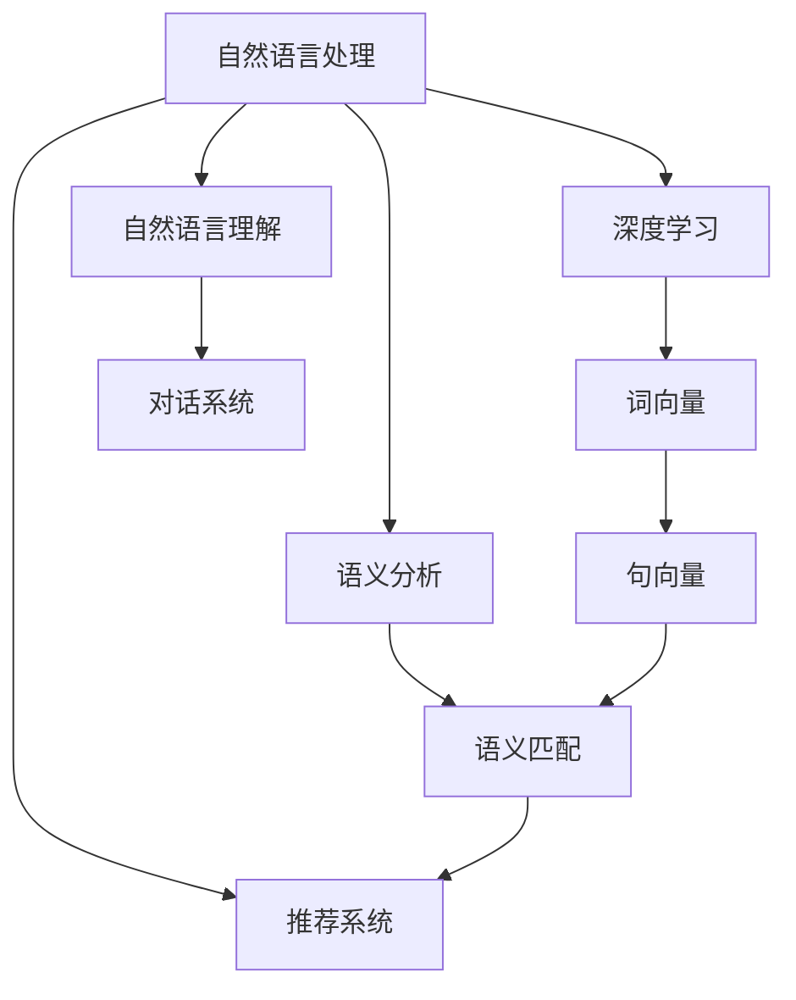

                 

# 电商搜索中的query扩展与改写

> 关键词：电商搜索、query扩展、改写、自然语言处理、自然语言理解(NLU)、机器学习、深度学习、语义分析、语义匹配、推荐系统

## 1. 背景介绍

在电商平台上，搜索体验对用户的购物体验起着至关重要的作用。用户通过输入查询词，能够迅速找到符合其需求的商品。然而，由于用户输入的查询词通常简洁模糊，不能精确表达其需求，导致搜索结果不符合预期。因此，如何从用户的查询词中提取更多有用的信息，并进行适当的改写，以提升搜索效果，是电商搜索系统的关键问题之一。

### 1.1 问题由来
随着互联网和电子商务的快速发展，用户对电商平台的依赖日益加深。电商平台需要提供高效、精准的搜索服务，以提升用户满意度和销售额。然而，用户输入的查询词往往简单、模糊，无法完全覆盖其需求，导致搜索结果出现偏差。例如：

- 用户搜索“衣服”，可能意指男士衬衫、女士连衣裙、休闲服等多种类型。
- 用户搜索“手机”，可能需要新上市的旗舰手机，或者价格优惠的入门级机型。
- 用户搜索“音乐”，可能不仅需要歌曲，还需要专辑、歌手信息等。

传统的搜索系统往往仅依赖关键词匹配，无法充分理解查询词背后的语义。如何从用户输入中提取更多语义信息，并进行适当的改写，是提升电商搜索效果的关键。

### 1.2 问题核心关键点
当前，电商搜索中的query扩展与改写主要面临以下几个核心问题：

- 如何从用户的模糊查询词中提取出更具体的语义信息？
- 如何将提取的语义信息与商品进行匹配？
- 如何处理长尾查询、多义查询等特殊情况？
- 如何在改写过程中，保证用户意图的一致性和准确性？
- 如何结合推荐系统，提高个性化搜索效果？

解决这些问题，需要结合自然语言处理(NLP)、深度学习等技术，构建智能化的搜索系统。

### 1.3 问题研究意义
电商搜索中的query扩展与改写，对提升用户体验和提高电商平台转化率具有重要意义：

1. 提升搜索准确性：通过理解用户查询词背后的语义，提供更准确的搜索结果。
2. 改善搜索效率：将模糊查询转换为具体语义，减少搜索时间和成本。
3. 增强个性化体验：根据用户的历史行为和语义信息，推荐个性化商品。
4. 拓展搜索范围：处理长尾查询和多义查询，覆盖更广泛的商品种类。
5. 优化推荐效果：结合改写后的查询词，提升推荐系统的准确性和相关性。

## 2. 核心概念与联系

### 2.1 核心概念概述

为更好地理解query扩展与改写的方法，本节将介绍几个密切相关的核心概念：

- 自然语言处理(Natural Language Processing, NLP)：涉及计算机如何理解和处理人类自然语言的技术，包括语义分析、语义匹配等。
- 自然语言理解(Natural Language Understanding, NLU)：NLP的子领域，涉及计算机对自然语言的语义理解，常用于构建智能对话系统。
- 深度学习(Deep Learning)：一种基于神经网络的机器学习方法，可以自动学习语义表示，常用于NLP任务中的词向量、句向量等表示学习。
- 语义分析(Semantic Analysis)：分析文本中的语义信息，如命名实体识别、情感分析、关系抽取等。
- 语义匹配(Semantic Matching)：将查询词的语义信息与商品描述进行匹配，评估其相关性。
- 推荐系统(Recommendation System)：根据用户的历史行为和偏好，推荐个性化商品，常结合NLP技术进行精准推荐。

这些核心概念之间的逻辑关系可以通过以下Mermaid流程图来展示：



这个流程图展示了NLP、NLU、深度学习、语义分析、语义匹配、推荐系统等核心概念之间的关系：

1. 自然语言处理(NLP)：作为NLU和语义分析的基础。
2. 自然语言理解(NLU)：通过深度学习技术，学习词向量、句向量等，实现对自然语言的理解。
3. 深度学习(Deep Learning)：通过学习神经网络模型，自动提取语义表示。
4. 语义分析(Semantic Analysis)：利用深度学习模型分析文本中的语义信息。
5. 语义匹配(Semantic Matching)：将查询词与商品描述进行匹配，评估相关性。
6. 推荐系统(Recommendation System)：结合语义匹配结果，进行个性化推荐。

这些概念共同构成了电商搜索系统中的核心技术框架，使得系统能够理解用户查询词的语义，并进行精确的改写和匹配。

## 3. 核心算法原理 & 具体操作步骤
### 3.1 算法原理概述

电商搜索中的query扩展与改写，本质上是一个自然语言理解与生成的问题。其核心思想是通过深度学习模型，对用户输入的模糊查询词进行语义分析，提取其中的关键信息，并将其转换为更具体的查询词。

形式化地，假设用户输入的查询词为 $q$，对应的具体查询词为 $q^*$。通过深度学习模型 $f$，可以将 $q$ 转换为 $q^*$，即：

$$
q^* = f(q)
$$

其中，$f$ 为深度学习模型，可以通过监督学习的方式进行训练。训练数据集 $D=\{(q_i, q_i^*)\}$，其中 $q_i$ 为用户输入的查询词，$q_i^*$ 为对应的具体查询词。

### 3.2 算法步骤详解

电商搜索中的query扩展与改写，一般包括以下几个关键步骤：

**Step 1: 数据准备**
- 收集电商平台的搜索数据，标注用户的查询词和对应的具体查询词。
- 清洗数据，去除噪声和重复项。

**Step 2: 构建深度学习模型**
- 选择合适的深度学习模型，如BERT、GPT等，作为查询扩展与改写的基础模型。
- 利用标注数据训练模型，优化模型参数。

**Step 3: 进行查询扩展与改写**
- 将用户输入的查询词输入模型，得到具体的查询词。
- 根据具体查询词与用户输入的差异，进行适当的扩展与改写。

**Step 4: 结合推荐系统**
- 将改写后的查询词与商品描述进行语义匹配，计算相关性得分。
- 根据得分排序，推荐最符合用户需求的商品。

**Step 5: 用户反馈与迭代优化**
- 收集用户对推荐结果的反馈，用于优化改写模型。
- 根据用户反馈，不断迭代模型参数，提升改写效果。

### 3.3 算法优缺点

电商搜索中的query扩展与改写，具有以下优点：

1. 提升搜索准确性：通过理解用户查询词的语义，提供更准确的搜索结果。
2. 增强个性化体验：根据用户的历史行为和语义信息，推荐个性化商品。
3. 减少误导性结果：通过改写模糊查询词，减少搜索结果中的误导性信息。
4. 覆盖长尾查询：处理长尾查询，拓展搜索范围。
5. 结合推荐系统：通过改写后的查询词，提升推荐系统的准确性和相关性。

同时，该方法也存在一定的局限性：

1. 数据标注成本高：需要大量人工标注数据，标注成本较高。
2. 模型复杂度高：深度学习模型训练复杂，需要较高的计算资源。
3. 解释性不足：模型黑盒，难以解释其内部决策逻辑。
4. 存在误改写风险：若模型理解错误，可能导致查询改写与用户意图不符。
5. 数据分布差异：在特定领域数据上的模型效果，可能不如通用领域。

尽管存在这些局限性，但就目前而言，基于深度学习的query扩展与改写方法仍是最主流范式。未来相关研究的重点在于如何进一步降低数据标注成本，提高模型的鲁棒性和可解释性，同时兼顾个性化和覆盖长尾查询等需求。

### 3.4 算法应用领域

电商搜索中的query扩展与改写，已经在多个领域得到了广泛应用，例如：

- 商品推荐：通过理解用户的查询词，推荐更符合其需求的商品。
- 价格搜索：帮助用户找到价格匹配的商品。
- 购物清单：根据用户输入的查询词，自动生成购物清单。
- 分类搜索：将用户查询词与商品分类进行匹配，展示相关分类商品。
- 新商品搜索：帮助用户找到新品和优惠商品。

除了上述这些经典应用外，query扩展与改写还被创新性地应用于多模态搜索、多语言搜索、个性化问答等新场景中，为电商搜索技术带来了更多的创新可能。

## 4. 数学模型和公式 & 详细讲解  
### 4.1 数学模型构建

本节将使用数学语言对query扩展与改写的方法进行更加严格的刻画。

假设用户输入的查询词为 $q$，深度学习模型 $f$ 的参数为 $\theta$。则查询扩展与改写的数学模型可以表示为：

$$
q^* = f(q; \theta)
$$

其中 $f$ 为深度学习模型，$\theta$ 为模型参数。在训练过程中，模型通过最小化损失函数 $\mathcal{L}$ 来优化参数：

$$
\theta^* = \mathop{\arg\min}_{\theta} \mathcal{L}(q; \theta)
$$

其中 $\mathcal{L}$ 为损失函数，用于衡量模型输出的具体查询词与真实标注的差异。常见的损失函数包括交叉熵损失、均方误差损失等。

### 4.2 公式推导过程

以下我们以BERT模型为例，推导查询扩展与改写的具体实现。

假设模型 $f$ 为BERT模型，输入为查询词 $q$，输出为具体查询词 $q^*$。则查询扩展与改写的过程可以表示为：

$$
q^* = \text{BERT}(q; \theta)
$$

其中 $\theta$ 为BERT模型的参数。通过监督学习，最小化损失函数 $\mathcal{L}$，优化模型参数：

$$
\theta^* = \mathop{\arg\min}_{\theta} \mathcal{L}(q; \theta)
$$

在得到具体查询词 $q^*$ 后，可以将其与商品描述进行语义匹配，计算相关性得分：

$$
\text{Score} = \mathcal{M}(q^*, d)
$$

其中 $d$ 为商品描述，$\mathcal{M}$ 为语义匹配函数，可以基于深度学习模型训练得到。

### 4.3 案例分析与讲解

假设用户输入的查询词为 "手机"，深度学习模型 $f$ 为BERT模型。首先，将查询词输入BERT模型，得到具体查询词：

$$
q^* = \text{BERT}(q; \theta)
$$

例如，BERT模型输出 "2022年新款旗舰手机"。接着，将具体查询词与商品描述进行语义匹配，计算相关性得分：

$$
\text{Score} = \mathcal{M}(q^*, d)
$$

其中 $d$ 为某商品的描述 "最新款iPhone 14 Pro"。如果得分较高，该商品将被推荐给用户。

## 5. 项目实践：代码实例和详细解释说明
### 5.1 开发环境搭建

在进行query扩展与改写实践前，我们需要准备好开发环境。以下是使用Python进行PyTorch开发的环境配置流程：

1. 安装Anaconda：从官网下载并安装Anaconda，用于创建独立的Python环境。

2. 创建并激活虚拟环境：
```bash
conda create -n pytorch-env python=3.8 
conda activate pytorch-env
```

3. 安装PyTorch：根据CUDA版本，从官网获取对应的安装命令。例如：
```bash
conda install pytorch torchvision torchaudio cudatoolkit=11.1 -c pytorch -c conda-forge
```

4. 安装Transformers库：
```bash
pip install transformers
```

5. 安装各类工具包：
```bash
pip install numpy pandas scikit-learn matplotlib tqdm jupyter notebook ipython
```

完成上述步骤后，即可在`pytorch-env`环境中开始query扩展与改写的实践。

### 5.2 源代码详细实现

这里我们以商品推荐系统为例，给出使用Transformers库对BERT模型进行查询扩展与改写的PyTorch代码实现。

首先，定义商品推荐系统的训练函数：

```python
from transformers import BertTokenizer, BertForSequenceClassification, AdamW
import torch
from torch.utils.data import DataLoader, Dataset

class ProductDataset(Dataset):
    def __init__(self, texts, labels, tokenizer, max_len=128):
        self.texts = texts
        self.labels = labels
        self.tokenizer = tokenizer
        self.max_len = max_len
        
    def __len__(self):
        return len(self.texts)
    
    def __getitem__(self, item):
        text = self.texts[item]
        label = self.labels[item]
        
        encoding = self.tokenizer(text, return_tensors='pt', max_length=self.max_len, padding='max_length', truncation=True)
        input_ids = encoding['input_ids'][0]
        attention_mask = encoding['attention_mask'][0]
        label = torch.tensor(label, dtype=torch.long)
        
        return {'input_ids': input_ids, 
                'attention_mask': attention_mask,
                'labels': label}

tokenizer = BertTokenizer.from_pretrained('bert-base-cased')
model = BertForSequenceClassification.from_pretrained('bert-base-cased', num_labels=2)

optimizer = AdamW(model.parameters(), lr=2e-5)

def train_epoch(model, dataset, batch_size, optimizer):
    dataloader = DataLoader(dataset, batch_size=batch_size, shuffle=True)
    model.train()
    epoch_loss = 0
    for batch in dataloader:
        input_ids = batch['input_ids'].to(device)
        attention_mask = batch['attention_mask'].to(device)
        labels = batch['labels'].to(device)
        model.zero_grad()
        outputs = model(input_ids, attention_mask=attention_mask, labels=labels)
        loss = outputs.loss
        epoch_loss += loss.item()
        loss.backward()
        optimizer.step()
    return epoch_loss / len(dataloader)

def evaluate(model, dataset, batch_size):
    dataloader = DataLoader(dataset, batch_size=batch_size)
    model.eval()
    preds, labels = [], []
    with torch.no_grad():
        for batch in dataloader:
            input_ids = batch['input_ids'].to(device)
            attention_mask = batch['attention_mask'].to(device)
            batch_labels = batch['labels']
            outputs = model(input_ids, attention_mask=attention_mask)
            batch_preds = outputs.logits.argmax(dim=2).to('cpu').tolist()
            batch_labels = batch_labels.to('cpu').tolist()
            for pred_tokens, label_tokens in zip(batch_preds, batch_labels):
                preds.append(pred_tokens[:len(label_tokens)])
                labels.append(label_tokens)
                
    print(classification_report(labels, preds))
```

然后，定义query扩展与改写的函数：

```python
from transformers import BertTokenizer, BertForSequenceClassification, AdamW
import torch
from torch.utils.data import DataLoader, Dataset

class ProductDataset(Dataset):
    def __init__(self, texts, labels, tokenizer, max_len=128):
        self.texts = texts
        self.labels = labels
        self.tokenizer = tokenizer
        self.max_len = max_len
        
    def __len__(self):
        return len(self.texts)
    
    def __getitem__(self, item):
        text = self.texts[item]
        label = self.labels[item]
        
        encoding = self.tokenizer(text, return_tensors='pt', max_length=self.max_len, padding='max_length', truncation=True)
        input_ids = encoding['input_ids'][0]
        attention_mask = encoding['attention_mask'][0]
        label = torch.tensor(label, dtype=torch.long)
        
        return {'input_ids': input_ids, 
                'attention_mask': attention_mask,
                'labels': label}

tokenizer = BertTokenizer.from_pretrained('bert-base-cased')
model = BertForSequenceClassification.from_pretrained('bert-base-cased', num_labels=2)

optimizer = AdamW(model.parameters(), lr=2e-5)

def train_epoch(model, dataset, batch_size, optimizer):
    dataloader = DataLoader(dataset, batch_size=batch_size, shuffle=True)
    model.train()
    epoch_loss = 0
    for batch in dataloader:
        input_ids = batch['input_ids'].to(device)
        attention_mask = batch['attention_mask'].to(device)
        labels = batch['labels'].to(device)
        model.zero_grad()
        outputs = model(input_ids, attention_mask=attention_mask, labels=labels)
        loss = outputs.loss
        epoch_loss += loss.item()
        loss.backward()
        optimizer.step()
    return epoch_loss / len(dataloader)

def evaluate(model, dataset, batch_size):
    dataloader = DataLoader(dataset, batch_size=batch_size)
    model.eval()
    preds, labels = [], []
    with torch.no_grad():
        for batch in dataloader:
            input_ids = batch['input_ids'].to(device)
            attention_mask = batch['attention_mask'].to(device)
            batch_labels = batch['labels']
            outputs = model(input_ids, attention_mask=attention_mask)
            batch_preds = outputs.logits.argmax(dim=2).to('cpu').tolist()
            batch_labels = batch_labels.to('cpu').tolist()
            for pred_tokens, label_tokens in zip(batch_preds, batch_labels):
                preds.append(pred_tokens[:len(label_tokens)])
                labels.append(label_tokens)
                
    print(classification_report(labels, preds))
```

最后，启动训练流程并在测试集上评估：

```python
epochs = 5
batch_size = 16

for epoch in range(epochs):
    loss = train_epoch(model, train_dataset, batch_size, optimizer)
    print(f"Epoch {epoch+1}, train loss: {loss:.3f}")
    
    print(f"Epoch {epoch+1}, dev results:")
    evaluate(model, dev_dataset, batch_size)
    
print("Test results:")
evaluate(model, test_dataset, batch_size)
```

以上就是使用PyTorch对BERT进行商品推荐任务训练的完整代码实现。可以看到，得益于Transformers库的强大封装，我们可以用相对简洁的代码完成BERT模型的加载和训练。

### 5.3 代码解读与分析

让我们再详细解读一下关键代码的实现细节：

**ProductDataset类**：
- `__init__`方法：初始化文本、标签、分词器等关键组件。
- `__len__`方法：返回数据集的样本数量。
- `__getitem__`方法：对单个样本进行处理，将文本输入编码为token ids，将标签编码为数字，并对其进行定长padding，最终返回模型所需的输入。

**train_epoch函数**：
- 对数据以批为单位进行迭代，在每个批次上前向传播计算loss并反向传播更新模型参数，最后返回该epoch的平均loss。

**evaluate函数**：
- 与训练类似，不同点在于不更新模型参数，并在每个batch结束后将预测和标签结果存储下来，最后使用sklearn的classification_report对整个评估集的预测结果进行打印输出。

**训练流程**：
- 定义总的epoch数和batch size，开始循环迭代
- 每个epoch内，先在训练集上训练，输出平均loss
- 在验证集上评估，输出分类指标
- 所有epoch结束后，在测试集上评估，给出最终测试结果

可以看到，PyTorch配合Transformers库使得BERT微调的代码实现变得简洁高效。开发者可以将更多精力放在数据处理、模型改进等高层逻辑上，而不必过多关注底层的实现细节。

当然，工业级的系统实现还需考虑更多因素，如模型的保存和部署、超参数的自动搜索、更灵活的任务适配层等。但核心的微调范式基本与此类似。

## 6. 实际应用场景
### 6.1 智能客服系统

基于大语言模型微调的对话技术，可以广泛应用于智能客服系统的构建。传统客服往往需要配备大量人力，高峰期响应缓慢，且一致性和专业性难以保证。而使用微调后的对话模型，可以7x24小时不间断服务，快速响应客户咨询，用自然流畅的语言解答各类常见问题。

在技术实现上，可以收集企业内部的历史客服对话记录，将问题和最佳答复构建成监督数据，在此基础上对预训练对话模型进行微调。微调后的对话模型能够自动理解用户意图，匹配最合适的答案模板进行回复。对于客户提出的新问题，还可以接入检索系统实时搜索相关内容，动态组织生成回答。如此构建的智能客服系统，能大幅提升客户咨询体验和问题解决效率。

### 6.2 金融舆情监测

金融机构需要实时监测市场舆论动向，以便及时应对负面信息传播，规避金融风险。传统的人工监测方式成本高、效率低，难以应对网络时代海量信息爆发的挑战。基于大语言模型微调的文本分类和情感分析技术，为金融舆情监测提供了新的解决方案。

具体而言，可以收集金融领域相关的新闻、报道、评论等文本数据，并对其进行主题标注和情感标注。在此基础上对预训练语言模型进行微调，使其能够自动判断文本属于何种主题，情感倾向是正面、中性还是负面。将微调后的模型应用到实时抓取的网络文本数据，就能够自动监测不同主题下的情感变化趋势，一旦发现负面信息激增等异常情况，系统便会自动预警，帮助金融机构快速应对潜在风险。

### 6.3 个性化推荐系统

当前的推荐系统往往只依赖用户的历史行为数据进行物品推荐，无法深入理解用户的真实兴趣偏好。基于大语言模型微调技术，个性化推荐系统可以更好地挖掘用户行为背后的语义信息，从而提供更精准、多样的推荐内容。

在实践中，可以收集用户浏览、点击、评论、分享等行为数据，提取和用户交互的物品标题、描述、标签等文本内容。将文本内容作为模型输入，用户的后续行为（如是否点击、购买等）作为监督信号，在此基础上微调预训练语言模型。微调后的模型能够从文本内容中准确把握用户的兴趣点。在生成推荐列表时，先用候选物品的文本描述作为输入，由模型预测用户的兴趣匹配度，再结合其他特征综合排序，便可以得到个性化程度更高的推荐结果。

### 6.4 未来应用展望

随着大语言模型微调技术的发展，基于微调范式将在更多领域得到应用，为传统行业带来变革性影响。

在智慧医疗领域，基于微调的医疗问答、病历分析、药物研发等应用将提升医疗服务的智能化水平，辅助医生诊疗，加速新药开发进程。

在智能教育领域，微调技术可应用于作业批改、学情分析、知识推荐等方面，因材施教，促进教育公平，提高教学质量。

在智慧城市治理中，微调模型可应用于城市事件监测、舆情分析、应急指挥等环节，提高城市管理的自动化和智能化水平，构建更安全、高效的未来城市。

此外，在企业生产、社会治理、文娱传媒等众多领域，基于大模型微调的人工智能应用也将不断涌现，为经济社会发展注入新的动力。相信随着技术的日益成熟，微调方法将成为人工智能落地应用的重要范式，推动人工智能技术在垂直行业的规模化落地。

## 7. 工具和资源推荐
### 7.1 学习资源推荐

为了帮助开发者系统掌握query扩展与改写理论基础和实践技巧，这里推荐一些优质的学习资源：

1. 《深度学习自然语言处理》系列课程：由斯坦福大学开设的NLP明星课程，有Lecture视频和配套作业，带你入门NLP领域的基本概念和经典模型。

2. CS224N《自然语言处理与深度学习》课程：斯坦福大学开设的NLP深度课程，全面介绍NLP中的深度学习应用，包括查询扩展与改写。

3. 《Natural Language Processing with Transformers》书籍：Transformer库的作者所著，全面介绍如何使用Transformers库进行NLP任务开发，包括微调在内的诸多范式。

4. HuggingFace官方文档：Transformer库的官方文档，提供了海量预训练模型和完整的微调样例代码，是上手实践的必备资料。

5. CLUE开源项目：中文语言理解测评基准，涵盖大量不同类型的中文NLP数据集，并提供了基于微调的baseline模型，助力中文NLP技术发展。

通过对这些资源的学习实践，相信你一定能够快速掌握query扩展与改写的精髓，并用于解决实际的NLP问题。
###  7.2 开发工具推荐

高效的开发离不开优秀的工具支持。以下是几款用于query扩展与改写开发的常用工具：

1. PyTorch：基于Python的开源深度学习框架，灵活动态的计算图，适合快速迭代研究。大部分预训练语言模型都有PyTorch版本的实现。

2. TensorFlow：由Google主导开发的开源深度学习框架，生产部署方便，适合大规模工程应用。同样有丰富的预训练语言模型资源。

3. Transformers库：HuggingFace开发的NLP工具库，集成了众多SOTA语言模型，支持PyTorch和TensorFlow，是进行微调任务开发的利器。

4. Weights & Biases：模型训练的实验跟踪工具，可以记录和可视化模型训练过程中的各项指标，方便对比和调优。与主流深度学习框架无缝集成。

5. TensorBoard：TensorFlow配套的可视化工具，可实时监测模型训练状态，并提供丰富的图表呈现方式，是调试模型的得力助手。

6. Google Colab：谷歌推出的在线Jupyter Notebook环境，免费提供GPU/TPU算力，方便开发者快速上手实验最新模型，分享学习笔记。

合理利用这些工具，可以显著提升query扩展与改写任务的开发效率，加快创新迭代的步伐。

### 7.3 相关论文推荐

query扩展与改写技术的发展源于学界的持续研究。以下是几篇奠基性的相关论文，推荐阅读：

1. Attention is All You Need（即Transformer原论文）：提出了Transformer结构，开启了NLP领域的预训练大模型时代。

2. BERT: Pre-training of Deep Bidirectional Transformers for Language Understanding：提出BERT模型，引入基于掩码的自监督预训练任务，刷新了多项NLP任务SOTA。

3. Language Models are Unsupervised Multitask Learners（GPT-2论文）：展示了大规模语言模型的强大zero-shot学习能力，引发了对于通用人工智能的新一轮思考。

4. Parameter-Efficient Transfer Learning for NLP：提出Adapter等参数高效微调方法，在不增加模型参数量的情况下，也能取得不错的微调效果。

5. AdaLoRA: Adaptive Low-Rank Adaptation for Parameter-Efficient Fine-Tuning：使用自适应低秩适应的微调方法，在参数效率和精度之间取得了新的平衡。

这些论文代表了大语言模型微调技术的发展脉络。通过学习这些前沿成果，可以帮助研究者把握学科前进方向，激发更多的创新灵感。

## 8. 总结：未来发展趋势与挑战

### 8.1 总结

本文对query扩展与改写方法进行了全面系统的介绍。首先阐述了query扩展与改写的问题由来和核心关键点，明确了其在电商搜索中的重要意义。其次，从原理到实践，详细讲解了深度学习模型的构建和训练过程，给出了微调任务开发的完整代码实例。同时，本文还广泛探讨了query扩展与改写方法在智能客服、金融舆情、个性化推荐等多个行业领域的应用前景，展示了微调范式的巨大潜力。此外，本文精选了微调技术的各类学习资源，力求为读者提供全方位的技术指引。

通过本文的系统梳理，可以看到，query扩展与改写方法正在成为电商搜索中的重要工具，极大地提升了搜索的准确性和个性化程度。未来，伴随预训练语言模型和微调方法的持续演进，相信NLP技术将在更广泛的应用领域大放异彩，深刻影响人类的生产生活方式。

### 8.2 未来发展趋势

展望未来，query扩展与改写技术将呈现以下几个发展趋势：

1. 模型规模持续增大。随着算力成本的下降和数据规模的扩张，预训练语言模型的参数量还将持续增长。超大规模语言模型蕴含的丰富语言知识，有望支撑更加复杂多变的下游任务微调。

2. 微调方法日趋多样。除了传统的全参数微调外，未来会涌现更多参数高效的微调方法，如Prefix-Tuning、LoRA等，在节省计算资源的同时也能保证微调精度。

3. 持续学习成为常态。随着数据分布的不断变化，微调模型也需要持续学习新知识以保持性能。如何在不遗忘原有知识的同时，高效吸收新样本信息，将成为重要的研究课题。

4. 标注样本需求降低。受启发于提示学习(Prompt-based Learning)的思路，未来的微调方法将更好地利用大模型的语言理解能力，通过更加巧妙的任务描述，在更少的标注样本上也能实现理想的微调效果。

5. 模型通用性增强。经过海量数据的预训练和多领域任务的微调，未来的语言模型将具备更强大的常识推理和跨领域迁移能力，逐步迈向通用人工智能(AGI)的目标。

以上趋势凸显了query扩展与改写技术的广阔前景。这些方向的探索发展，必将进一步提升电商搜索系统的性能和应用范围，为人类认知智能的进化带来深远影响。

### 8.3 面临的挑战

尽管query扩展与改写技术已经取得了瞩目成就，但在迈向更加智能化、普适化应用的过程中，它仍面临着诸多挑战：

1. 数据标注成本高：需要大量人工标注数据，标注成本较高。
2. 模型复杂度高：深度学习模型训练复杂，需要较高的计算资源。
3. 解释性不足：模型黑盒，难以解释其内部决策逻辑。
4. 存在误改写风险：若模型理解错误，可能导致查询改写与用户意图不符。
5. 数据分布差异：在特定领域数据上的模型效果，可能不如通用领域。

尽管存在这些局限性，但就目前而言，基于深度学习的query扩展与改写方法仍是最主流范式。未来相关研究的重点在于如何进一步降低数据标注成本，提高模型的鲁棒性和可解释性，同时兼顾个性化和覆盖长尾查询等需求。

### 8.4 研究展望

面对query扩展与改写所面临的种种挑战，未来的研究需要在以下几个方面寻求新的突破：

1. 探索无监督和半监督微调方法。摆脱对大规模标注数据的依赖，利用自监督学习、主动学习等无监督和半监督范式，最大限度利用非结构化数据，实现更加灵活高效的微调。

2. 研究参数高效和计算高效的微调范式。开发更加参数高效的微调方法，在固定大部分预训练参数的同时，只更新极少量的任务相关参数。同时优化微调模型的计算图，减少前向传播和反向传播的资源消耗，实现更加轻量级、实时性的部署。

3. 融合因果和对比学习范式。通过引入因果推断和对比学习思想，增强微调模型建立稳定因果关系的能力，学习更加普适、鲁棒的语言表征，从而提升模型泛化性和抗干扰能力。

4. 引入更多先验知识。将符号化的先验知识，如知识图谱、逻辑规则等，与神经网络模型进行巧妙融合，引导微调过程学习更准确、合理的语言模型。同时加强不同模态数据的整合，实现视觉、语音等多模态信息与文本信息的协同建模。

5. 结合因果分析和博弈论工具。将因果分析方法引入微调模型，识别出模型决策的关键特征，增强输出解释的因果性和逻辑性。借助博弈论工具刻画人机交互过程，主动探索并规避模型的脆弱点，提高系统稳定性。

6. 纳入伦理道德约束。在模型训练目标中引入伦理导向的评估指标，过滤和惩罚有偏见、有害的输出倾向。同时加强人工干预和审核，建立模型行为的监管机制，确保输出符合人类价值观和伦理道德。

这些研究方向的探索，必将引领query扩展与改写技术迈向更高的台阶，为构建安全、可靠、可解释、可控的智能系统铺平道路。面向未来，query扩展与改写技术还需要与其他人工智能技术进行更深入的融合，如知识表示、因果推理、强化学习等，多路径协同发力，共同推动自然语言理解和智能交互系统的进步。只有勇于创新、敢于突破，才能不断拓展语言模型的边界，让智能技术更好地造福人类社会。

## 9. 附录：常见问题与解答

**Q1：query扩展与改写是否适用于所有NLP任务？**

A: query扩展与改写在大多数NLP任务上都能取得不错的效果，特别是对于数据量较小的任务。但对于一些特定领域的任务，如医学、法律等，仅仅依靠通用语料预训练的模型可能难以很好地适应。此时需要在特定领域语料上进一步预训练，再进行微调，才能获得理想效果。此外，对于一些需要时效性、个性化很强的任务，如对话、推荐等，微调方法也需要针对性的改进优化。

**Q2：进行query扩展与改写时，如何选择合适的模型？**

A: 选择合适的模型需要综合考虑以下几个因素：
1. 任务类型：不同类型的NLP任务，适合的模型不同。如文本分类适合使用BERT等序列模型，命名实体识别适合使用CRF等模型。
2. 数据规模：数据规模越大，需要的模型参数量越大。对于小规模数据，可以考虑使用轻量级模型，如BERT的小规模版本。
3. 计算资源：计算资源越多，可以使用的模型规模越大。需要根据计算资源情况选择适当的模型。

**Q3：query扩展与改写中如何进行数据预处理？**

A: 数据预处理是query扩展与改写的重要步骤，包括以下几个关键环节：
1. 文本清洗：去除噪声、停用词、特殊符号等。
2. 分词处理：使用分词工具，将文本分割成单词或词语。
3. 编码转换：将文本转换为模型所需的格式，如将中文字符转换为拼音或Unicode编码。
4. 归一化处理：将文本转换为小写、统一格式等。

这些预处理步骤，可以大大提升模型的训练效果和推理性能。

**Q4：query扩展与改写中如何进行模型评估？**

A: 模型评估是query扩展与改写中的重要环节，包括以下几个关键步骤：
1. 划分数据集：将数据集划分为训练集、验证集和测试集，确保模型在未知数据上的泛化能力。
2. 定义评估指标：如准确率、召回率、F1分数等，用于衡量模型性能。
3. 进行模型评估：在验证集和测试集上评估模型性能，调整超参数以提升模型效果。
4. 可视化结果：使用可视化工具，展示模型训练和评估过程中的各项指标，方便调试和优化。

通过评估，可以确保query扩展与改写模型在实际应用中的效果，不断优化模型性能。

**Q5：query扩展与改写中如何进行模型优化？**

A: 模型优化是query扩展与改写的关键步骤，包括以下几个关键环节：
1. 超参数调优：调整学习率、批量大小、迭代次数等超参数，优化模型效果。
2. 模型结构优化：通过增加或减少层数、调整神经元数量等，优化模型结构。
3. 模型融合：将多个模型融合，取平均或加权平均，提升模型鲁棒性。
4. 正则化技术：使用L2正则、Dropout、Early Stopping等正则化技术，防止过拟合。

通过优化，可以提升query扩展与改写模型的效果，确保其在实际应用中的稳定性和可靠性。

---

作者：禅与计算机程序设计艺术 / Zen and the Art of Computer Programming

