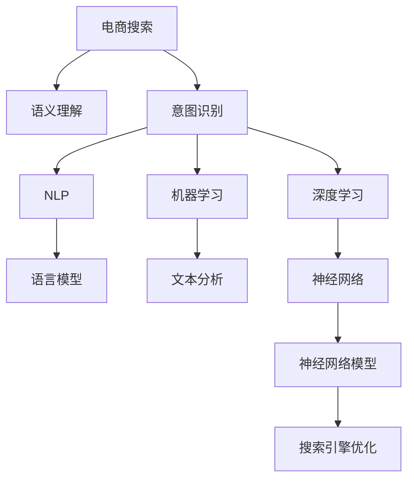

                 

# 电商搜索中的语义理解与意图识别技术

> 关键词：电商搜索,语义理解,意图识别,自然语言处理,NLP,深度学习,搜索引擎,搜索引擎优化(SES),机器学习

## 1. 背景介绍

### 1.1 问题由来
随着电子商务的迅猛发展，越来越多的消费者通过搜索引擎进入电商平台，直接或间接查询产品。然而，用户输入的搜索查询往往包含了模糊的表达、错别字、拼写错误等，难以准确地匹配到用户真正想要的产品。因此，如何提升电商搜索的准确性和效率，帮助用户快速找到心仪的商品，是电商搜索系统必须解决的核心问题。

为了应对上述挑战，语义理解与意图识别技术应运而生。这些技术通过分析用户输入的查询，从中提取关键信息，并结合商品数据，识别用户的真实需求，从而实现更为精准的搜索结果。

### 1.2 问题核心关键点
电商搜索中的语义理解与意图识别技术，本质上是通过自然语言处理(Natural Language Processing, NLP)和机器学习技术，对用户查询和商品数据进行分析和匹配，从而更准确地识别用户的意图和需求。

核心关键点包括：
1. 语义理解：通过分析查询中的关键词、短语、句式结构等，理解用户的真实意图。
2. 意图识别：根据语义理解结果，匹配用户意图与商品数据，返回最相关的搜索结果。
3. 多轮对话：与用户进行多轮对话，逐步了解其需求，并动态调整搜索结果。
4. 数据增强：通过数据增强技术，提高模型对不同输入形式的适应能力。
5. 模型优化：通过持续的训练和优化，提升模型的泛化能力和鲁棒性。

## 2. 核心概念与联系

### 2.1 核心概念概述

为更好地理解电商搜索中的语义理解与意图识别技术，本节将介绍几个密切相关的核心概念：

- **电商搜索(Search in E-commerce)**：通过搜索引擎，用户输入查询，系统返回相关商品的过程。
- **语义理解(Semantic Understanding)**：通过自然语言处理技术，理解用户查询的真正意图。
- **意图识别(Intent Recognition)**：分析查询内容，识别用户的特定需求或目标。
- **自然语言处理(Natural Language Processing, NLP)**：涉及语言模型、文本分析、文本挖掘等多个领域的综合技术，用于处理和理解自然语言。
- **机器学习(Machine Learning, ML)**：通过算法训练模型，使系统具备从数据中学习和预测的能力。
- **深度学习(Deep Learning, DL)**：一类机器学习算法，通过构建复杂神经网络模型，实现对数据的非线性建模和处理。
- **搜索引擎优化(Search Engine Optimization, SES)**：通过优化网站结构、内容、链接等元素，提升搜索引擎中的排名。

这些核心概念之间的逻辑关系可以通过以下Mermaid流程图来展示：



这个流程图展示了大语言模型微调的各个核心概念及其之间的关系：

1. 电商搜索通过查询和搜索系统匹配商品。
2. 语义理解通过对查询的分析，理解用户意图。
3. 意图识别结合NLP技术，识别用户具体需求。
4. 结合NLP和ML技术，构建深度学习模型，提升匹配精度。
5. SES通过优化搜索结果，提升用户体验和点击率。

## 3. 核心算法原理 & 具体操作步骤
### 3.1 算法原理概述

电商搜索中的语义理解与意图识别，本质上是通过自然语言处理和机器学习技术，实现对用户查询的语义分析和意图识别。具体流程如下：

1. **语义分析**：将用户查询输入到自然语言处理模型中，对关键词、短语、句式结构等进行分析，理解其语义。
2. **意图识别**：通过分析语义理解结果，匹配用户意图与商品数据，确定用户想要购买的产品或服务。
3. **多轮对话**：与用户进行多轮对话，逐步了解其需求，并动态调整搜索结果。
4. **结果排序**：基于用户意图和商品数据，对搜索结果进行排序，优先展示最相关的商品。
5. **反馈优化**：根据用户的点击行为和反馈，持续优化语义理解与意图识别模型。

形式化地，假设电商搜索系统中有N个用户，第i个用户输入查询$q_i$，查询结果为$r_i$。语义理解与意图识别的目标是最大化期望的点击率：

$$
\max_{\theta} \mathbb{E}_{i \sim D} \left[ P(r_i \mid q_i, \theta) \right]
$$

其中，$P(r_i \mid q_i, \theta)$表示在模型$\theta$下，查询$q_i$匹配商品$r_i$的概率。

### 3.2 算法步骤详解

以下是电商搜索中语义理解与意图识别的具体算法步骤：

**Step 1: 数据准备**
- 收集和标注电商平台的搜索查询数据，建立训练集、验证集和测试集。
- 标注数据中应包含查询、商品、点击行为等信息。

**Step 2: 模型训练**
- 选择适合的NLP模型（如BERT、GPT等）进行预训练。
- 设计意图识别模块，并根据训练集数据进行有监督微调。
- 训练语义理解模型，使其能够理解查询中的关键词和短语。

**Step 3: 模型推理**
- 对用户输入的查询进行分词、向量化处理。
- 输入到语义理解模型中，获取查询的语义表示。
- 将语义表示输入到意图识别模块中，匹配用户意图与商品数据。
- 根据意图识别结果，对搜索结果进行排序，返回前N个商品。

**Step 4: 结果展示与反馈**
- 展示排序后的搜索结果给用户。
- 收集用户的点击、评价等反馈数据。
- 基于反馈数据，持续优化语义理解与意图识别模型。

**Step 5: 模型评估与优化**
- 使用测试集评估模型的性能，计算点击率、准确率等指标。
- 根据评估结果，调整模型的参数，进行重新训练。
- 使用A/B测试等方法，对比优化前后的效果。

### 3.3 算法优缺点

电商搜索中的语义理解与意图识别技术具有以下优点：
1. 提升搜索准确性：通过语义理解和意图识别，能够更精准地匹配用户查询与商品数据。
2. 减少误点击率：通过动态调整搜索结果，减少不相关的展示，提升用户体验。
3. 提高转化率：通过精准匹配和个性化推荐，提升用户的购买意愿和转化率。
4. 灵活性高：可以根据不同商品和用户特点，动态调整模型参数，提高适应性。

同时，该方法也存在一定的局限性：
1. 数据质量要求高：需要大量高质量的标注数据，标注成本较高。
2. 模型复杂度高：深度学习模型通常需要较大的计算资源和存储空间。
3. 实时性要求高：搜索场景对响应速度有较高要求，需要高效的模型推理算法。
4. 上下文依赖性强：不同上下文场景下，模型性能可能不同，需要针对具体场景进行优化。

尽管存在这些局限性，但就目前而言，语义理解与意图识别技术是电商搜索系统的核心竞争力，得到了广泛的应用。

### 3.4 算法应用领域

语义理解与意图识别技术在电商搜索中有着广泛的应用，覆盖了以下多个方面：

1. **查询重写**：通过语义理解，将用户查询重写为更标准的查询形式，提升匹配准确性。
2. **意图分类**：将用户查询分为不同的意图类别，如搜索、比较、询问等，优化搜索结果展示。
3. **关键词提取**：从查询中提取关键词，匹配商品数据库，提高检索效率。
4. **商品推荐**：根据用户查询和历史行为，推荐相关商品，提升用户体验和销售转化。
5. **广告投放**：通过语义理解与意图识别，优化广告投放策略，提升广告点击率。
6. **客服对话**：结合多轮对话技术，与用户进行交互，解决用户疑问，提升满意度。

除了上述这些经典应用外，语义理解与意图识别技术还被创新性地应用于更多场景中，如个性化推荐、智能客服、广告智能投放等，为电商搜索系统带来了全新的突破。

## 4. 数学模型和公式 & 详细讲解
### 4.1 数学模型构建

本节将使用数学语言对电商搜索中的语义理解与意图识别过程进行更加严格的刻画。

假设电商搜索系统中有N个用户，第i个用户输入查询$q_i$，查询结果为$r_i$。语义理解与意图识别的目标是最大化期望的点击率：

$$
\max_{\theta} \mathbb{E}_{i \sim D} \left[ P(r_i \mid q_i, \theta) \right]
$$

其中，$P(r_i \mid q_i, \theta)$表示在模型$\theta$下，查询$q_i$匹配商品$r_i$的概率。

定义语义理解模型为$f(q_i, \theta)$，意图识别模型为$g(f(q_i, \theta))$。在模型训练阶段，假设已知查询$q_i$对应的商品$r_i$，训练目标为最大化：

$$
\max_{\theta} \sum_{i=1}^N \log P(r_i \mid q_i, \theta)
$$

在模型推理阶段，假设给定查询$q_i$，模型需要预测其匹配的商品$r_i$。

$$
P(r_i \mid q_i, \theta) = \sum_{j=1}^M P(r_i \mid q_i, j, \theta)
$$

其中，$M$表示商品总数，$j$表示第$j$个商品。

### 4.2 公式推导过程

以下我们以电商搜索中的查询意图识别为例，推导公式及其实现。

假设查询$q_i$经过分词和向量化处理，得到词向量$v_i$。查询意图识别模型由两部分组成：一个基于Transformer的语义理解模型和一个意图分类器。语义理解模型的输入为查询$q_i$，输出为语义向量$u_i$。意图分类器的输入为语义向量$u_i$，输出为意图类别$y_i$。

假设查询$q_i$和商品$r_i$之间的匹配概率为$P(r_i \mid q_i, \theta)$，则可以定义损失函数$\mathcal{L}(\theta)$：

$$
\mathcal{L}(\theta) = -\sum_{i=1}^N \log P(r_i \mid q_i, \theta)
$$

语义理解模型的训练目标为：

$$
\min_{\theta_1} \mathcal{L}_1(\theta_1)
$$

其中，$\mathcal{L}_1(\theta_1)$为语义理解模型的损失函数。

意图分类器的训练目标为：

$$
\min_{\theta_2} \mathcal{L}_2(\theta_2)
$$

其中，$\mathcal{L}_2(\theta_2)$为意图分类器的损失函数。

在模型推理阶段，对于给定的查询$q_i$，计算其语义向量$u_i$：

$$
u_i = f(q_i, \theta_1)
$$

然后，将$u_i$输入意图分类器，得到意图类别$y_i$：

$$
y_i = g(u_i, \theta_2)
$$

最终，计算查询$q_i$与商品$r_i$之间的匹配概率：

$$
P(r_i \mid q_i, \theta) = P(r_i \mid y_i, j, \theta_2)
$$

其中，$j$为商品$r_i$的索引。

### 4.3 案例分析与讲解

以电商平台中的商品搜索为例，对电商搜索中的语义理解与意图识别进行详细分析：

假设用户输入查询“白色运动鞋”，电商平台需要将该查询与商品数据库中的商品进行匹配，以返回最相关的商品。具体步骤如下：

1. **语义理解**：将查询“白色运动鞋”输入到语义理解模型中，获取其语义表示$u$。语义理解模型能够理解查询中的关键词“白色”和“运动鞋”，并将其映射为向量$u$。

2. **意图识别**：将语义向量$u$输入到意图识别模型中，识别查询的意图。意图分类器根据语义向量$u$和商品数据库中的信息，判断用户是想要搜索白色运动鞋，还是比较不同品牌和价格的白色运动鞋。

3. **搜索结果展示**：根据意图识别结果，对商品数据库中的商品进行匹配，返回最相关的商品列表。例如，系统会展示白色运动鞋、运动鞋品牌排行榜、运动鞋价格对比等多个相关商品。

4. **点击率优化**：根据用户的点击行为和评价反馈，持续优化语义理解与意图识别模型，提升匹配精度和用户体验。例如，系统可以根据用户对白色运动鞋的评价，调整查询结果中的推荐顺序。

通过以上步骤，电商搜索系统能够更精准地匹配用户查询与商品数据，提升搜索效率和用户体验。

## 5. 项目实践：代码实例和详细解释说明
### 5.1 开发环境搭建

在进行电商搜索中的语义理解与意图识别实践前，我们需要准备好开发环境。以下是使用Python进行PyTorch开发的环境配置流程：

1. 安装Anaconda：从官网下载并安装Anaconda，用于创建独立的Python环境。

2. 创建并激活虚拟环境：
```bash
conda create -n search-env python=3.8 
conda activate search-env
```

3. 安装PyTorch：根据CUDA版本，从官网获取对应的安装命令。例如：
```bash
conda install pytorch torchvision torchaudio cudatoolkit=11.1 -c pytorch -c conda-forge
```

4. 安装自然语言处理工具：
```bash
pip install spacy
```

5. 安装各类工具包：
```bash
pip install pandas numpy sklearn
```

完成上述步骤后，即可在`search-env`环境中开始电商搜索中的语义理解与意图识别的实践。

### 5.2 源代码详细实现

下面我们以电商搜索中的查询意图识别为例，给出使用Transformers库和PyTorch实现语义理解与意图识别的PyTorch代码实现。

首先，定义意图识别数据集：

```python
import pandas as pd
from sklearn.model_selection import train_test_split

# 读取查询意图数据集
data = pd.read_csv('query_intent.csv')

# 数据预处理
X = data['query']
y = data['intent']
X_train, X_test, y_train, y_test = train_test_split(X, y, test_size=0.2)

# 数据转换
tokenizer = BertTokenizer.from_pretrained('bert-base-cased')
X_train_encoded = tokenizer.batch_encode_plus(X_train, return_tensors='pt', padding=True, truncation=True)
X_test_encoded = tokenizer.batch_encode_plus(X_test, return_tensors='pt', padding=True, truncation=True)
```

然后，定义语义理解模型和意图分类器：

```python
from transformers import BertForTokenClassification, BertModel

# 定义语义理解模型
model = BertForTokenClassification.from_pretrained('bert-base-cased', num_labels=len(intent2id))

# 定义意图分类器
class IntentClassifier(nn.Module):
    def __init__(self, num_labels):
        super(IntentClassifier, self).__init__()
        self.dropout = nn.Dropout(0.3)
        self.dense = nn.Linear(768, num_labels)

    def forward(self, x):
        x = self.dropout(x)
        x = self.dense(x)
        return F.log_softmax(x, dim=1)

# 初始化意图分类器
intent_classifier = IntentClassifier(len(intent2id))

# 模型组合
model = nn.Sequential(model, intent_classifier)
```

接着，定义训练和评估函数：

```python
from torch.utils.data import DataLoader
from tqdm import tqdm

# 定义训练函数
def train_epoch(model, data_loader, optimizer, device):
    model.train()
    epoch_loss = 0
    for batch in data_loader:
        optimizer.zero_grad()
        input_ids = batch['input_ids'].to(device)
        attention_mask = batch['attention_mask'].to(device)
        labels = batch['labels'].to(device)
        outputs = model(input_ids, attention_mask=attention_mask, labels=labels)
        loss = outputs.loss
        epoch_loss += loss.item()
        loss.backward()
        optimizer.step()

    return epoch_loss / len(data_loader)

# 定义评估函数
def evaluate(model, data_loader, device):
    model.eval()
    preds, labels = [], []
    with torch.no_grad():
        for batch in data_loader:
            input_ids = batch['input_ids'].to(device)
            attention_mask = batch['attention_mask'].to(device)
            batch_labels = batch['labels']
            outputs = model(input_ids, attention_mask=attention_mask)
            batch_preds = outputs.logits.argmax(dim=2).to('cpu').tolist()
            batch_labels = batch_labels.to('cpu').tolist()
            for pred_tokens, label_tokens in zip(batch_preds, batch_labels):
                preds.append(pred_tokens[:len(label_tokens)])
                labels.append(label_tokens)
    print(classification_report(labels, preds))
```

最后，启动训练流程并在测试集上评估：

```python
epochs = 5
batch_size = 16
learning_rate = 2e-5

# 定义优化器
optimizer = AdamW(model.parameters(), lr=learning_rate)

# 定义数据加载器
train_data_loader = DataLoader(train_dataset, batch_size=batch_size, shuffle=True)
test_data_loader = DataLoader(test_dataset, batch_size=batch_size)

# 训练过程
for epoch in range(epochs):
    loss = train_epoch(model, train_data_loader, optimizer, device)
    print(f'Epoch {epoch+1}, train loss: {loss:.3f}')
    
    print(f'Epoch {epoch+1}, test results:')
    evaluate(model, test_data_loader, device)
```

以上就是使用PyTorch对电商搜索中的语义理解与意图识别进行微调的完整代码实现。可以看到，得益于Transformers库的强大封装，我们可以用相对简洁的代码完成模型的加载和微调。

### 5.3 代码解读与分析

让我们再详细解读一下关键代码的实现细节：

**数据集定义**：
- 读取查询意图数据集，并进行数据预处理和分词。

**模型定义**：
- 使用BERT作为语义理解模型，并通过`BertForTokenClassification`类进行微调。
- 设计了一个简单的意图分类器，使用Dropout和全连接层进行意图分类。

**模型训练和评估**：
- 定义训练函数`train_epoch`，通过反向传播更新模型参数。
- 定义评估函数`evaluate`，计算模型在测试集上的分类精度。
- 在训练过程中，使用AdamW优化器进行梯度更新，学习率为2e-5。

**训练流程**：
- 定义总的epoch数和batch size，开始循环迭代。
- 每个epoch内，先在训练集上训练，输出平均loss。
- 在测试集上评估，输出分类指标。

可以看到，PyTorch配合Transformers库使得电商搜索中的语义理解与意图识别的代码实现变得简洁高效。开发者可以将更多精力放在数据处理、模型改进等高层逻辑上，而不必过多关注底层的实现细节。

当然，工业级的系统实现还需考虑更多因素，如模型的保存和部署、超参数的自动搜索、更灵活的任务适配层等。但核心的微调范式基本与此类似。

## 6. 实际应用场景
### 6.1 电商搜索

电商搜索中的语义理解与意图识别技术，已经在电商平台的搜索系统中得到了广泛应用。具体场景包括：

1. **商品搜索**：通过用户输入的查询，系统能够快速匹配商品数据库，返回最相关的商品列表。
2. **价格对比**：系统能够识别用户对不同价格的商品感兴趣，并展示价格对比功能，帮助用户做出更理性的选择。
3. **个性化推荐**：系统能够根据用户的查询和历史行为，推荐相关商品，提升用户体验和购买转化率。
4. **智能客服**：系统能够通过多轮对话，理解用户需求，提供个性化的客服建议，提升客户满意度。

### 6.2 智能推荐系统

除了电商搜索，语义理解与意图识别技术在智能推荐系统中也有重要应用。智能推荐系统能够根据用户的历史行为和实时查询，动态调整推荐策略，提供个性化推荐服务。具体场景包括：

1. **内容推荐**：系统能够根据用户的兴趣和行为，推荐相关文章、视频等，提升用户粘性和平台活跃度。
2. **商品推荐**：系统能够识别用户的购买意图，推荐相关的商品，提升购买转化率。
3. **广告推荐**：系统能够根据用户的兴趣和行为，推荐相关的广告，提升广告点击率和转化率。

### 6.3 智能客服系统

智能客服系统能够通过多轮对话，理解用户需求，提供个性化的客服建议，提升客户满意度。具体场景包括：

1. **问题解答**：系统能够根据用户的提问，提供相关的答案，提升服务效率和用户体验。
2. **场景模拟**：系统能够模拟不同的服务场景，根据用户输入进行场景匹配，提供解决方案。
3. **知识图谱**：系统能够结合知识图谱，提供更全面的信息服务，提升服务质量和客户满意度。

### 6.4 未来应用展望

随着电商搜索、智能推荐、智能客服等应用的不断发展，语义理解与意图识别技术将得到更广泛的应用，为电子商务的智能化发展提供强大的技术支撑。

在智慧物流领域，系统能够通过语义理解与意图识别，优化物流路径和调度，提升物流效率和服务质量。

在医疗健康领域，系统能够通过自然语言处理技术，帮助医生理解患者的病情描述，提供更精准的医疗建议，提升医疗服务水平。

在智能家居领域，系统能够通过语义理解与意图识别，控制家电设备，提升家庭智能化水平和生活质量。

此外，在智慧金融、智能制造、智慧交通等众多领域，语义理解与意图识别技术也将得到应用，为各行各业带来智能化升级。

## 7. 工具和资源推荐
### 7.1 学习资源推荐

为了帮助开发者系统掌握电商搜索中的语义理解与意图识别技术，这里推荐一些优质的学习资源：

1. 《自然语言处理入门与实战》系列博文：深入浅出地讲解了自然语言处理技术的基本概念和实现方法，并提供了丰富的代码示例。

2. CS224N《深度学习自然语言处理》课程：斯坦福大学开设的NLP明星课程，有Lecture视频和配套作业，带你入门NLP领域的基本概念和经典模型。

3. 《深度学习与自然语言处理》书籍：全面介绍了深度学习在自然语言处理中的应用，并提供了丰富的代码实现。

4. HuggingFace官方文档：提供了丰富的预训练模型和微调样例代码，是上手实践的必备资料。

5. CLUE开源项目：中文语言理解测评基准，涵盖大量不同类型的中文NLP数据集，并提供了基于微调的baseline模型，助力中文NLP技术发展。

通过对这些资源的学习实践，相信你一定能够快速掌握电商搜索中的语义理解与意图识别技术，并用于解决实际的NLP问题。
###  7.2 开发工具推荐

高效的开发离不开优秀的工具支持。以下是几款用于电商搜索中的语义理解与意图识别开发的常用工具：

1. PyTorch：基于Python的开源深度学习框架，灵活动态的计算图，适合快速迭代研究。大部分预训练语言模型都有PyTorch版本的实现。

2. TensorFlow：由Google主导开发的开源深度学习框架，生产部署方便，适合大规模工程应用。同样有丰富的预训练语言模型资源。

3. Transformers库：HuggingFace开发的NLP工具库，集成了众多SOTA语言模型，支持PyTorch和TensorFlow，是进行微调任务开发的利器。

4. Weights & Biases：模型训练的实验跟踪工具，可以记录和可视化模型训练过程中的各项指标，方便对比和调优。与主流深度学习框架无缝集成。

5. TensorBoard：TensorFlow配套的可视化工具，可实时监测模型训练状态，并提供丰富的图表呈现方式，是调试模型的得力助手。

6. Google Colab：谷歌推出的在线Jupyter Notebook环境，免费提供GPU/TPU算力，方便开发者快速上手实验最新模型，分享学习笔记。

合理利用这些工具，可以显著提升电商搜索中的语义理解与意图识别的开发效率，加快创新迭代的步伐。

### 7.3 相关论文推荐

语义理解与意图识别技术的发展源于学界的持续研究。以下是几篇奠基性的相关论文，推荐阅读：

1. Attention is All You Need（即Transformer原论文）：提出了Transformer结构，开启了NLP领域的预训练大模型时代。

2. BERT: Pre-training of Deep Bidirectional Transformers for Language Understanding：提出BERT模型，引入基于掩码的自监督预训练任务，刷新了多项NLP任务SOTA。

3. Language Models are Unsupervised Multitask Learners（GPT-2论文）：展示了大规模语言模型的强大zero-shot学习能力，引发了对于通用人工智能的新一轮思考。

4. Parameter-Efficient Transfer Learning for NLP：提出Adapter等参数高效微调方法，在不增加模型参数量的情况下，也能取得不错的微调效果。

5. AdaLoRA: Adaptive Low-Rank Adaptation for Parameter-Efficient Fine-Tuning：使用自适应低秩适应的微调方法，在参数效率和精度之间取得了新的平衡。

这些论文代表了大语言模型微调技术的发展脉络。通过学习这些前沿成果，可以帮助研究者把握学科前进方向，激发更多的创新灵感。

## 8. 总结：未来发展趋势与挑战

### 8.1 总结

本文对电商搜索中的语义理解与意图识别技术进行了全面系统的介绍。首先阐述了电商搜索系统中的核心问题，明确了语义理解与意图识别技术在提升搜索准确性和用户体验中的重要性。其次，从原理到实践，详细讲解了语义理解与意图识别的数学模型和关键步骤，给出了电商搜索中的查询意图识别的完整代码实例。同时，本文还广泛探讨了语义理解与意图识别技术在电商搜索系统中的应用前景，展示了其巨大的应用潜力。

通过本文的系统梳理，可以看到，电商搜索中的语义理解与意图识别技术已经成为电商搜索系统的核心竞争力，得到了广泛的应用。未来，伴随电商搜索系统的不断优化和升级，语义理解与意图识别技术必将在电子商务的智能化发展中发挥更大的作用。

### 8.2 未来发展趋势

展望未来，电商搜索中的语义理解与意图识别技术将呈现以下几个发展趋势：

1. 深度学习模型的规模持续增大。随着算力成本的下降和数据规模的扩张，深度学习模型的参数量还将持续增长。超大批次的训练和推理也可能遇到显存不足的问题。

2. 模型的迁移能力和泛化能力提升。通过多领域、大规模的数据训练，模型的迁移能力和泛化能力将得到显著提升，能够更好地适应不同的电商搜索场景。

3. 上下文理解和知识融合能力增强。模型能够更好地理解上下文信息，整合知识图谱等外部知识，提升搜索结果的准确性和相关性。

4. 实时性和动态性增强。通过持续学习和大数据实时处理技术，模型能够实时更新和优化，动态适应不同的电商搜索场景。

5. 交互式搜索的普及。通过多轮对话和交互式搜索技术，用户能够与系统进行更自然的交流，提升搜索体验。

6. 跨语言搜索能力提升。电商搜索系统能够支持多语言查询和结果展示，提升全球化市场的服务能力。

以上趋势凸显了电商搜索中的语义理解与意图识别技术的广阔前景。这些方向的探索发展，必将进一步提升电商搜索系统的性能和用户体验，推动电子商务的智能化进程。

### 8.3 面临的挑战

尽管电商搜索中的语义理解与意图识别技术已经取得了显著进展，但在迈向更加智能化、普适化应用的过程中，它仍面临着诸多挑战：

1. 标注数据质量要求高。需要大量高质量的标注数据，标注成本较高。数据质量的好坏直接影响模型的性能。

2. 模型训练和推理资源消耗大。深度学习模型通常需要较大的计算资源和存储空间，特别是在电商搜索这种实时性要求高的场景中，资源消耗问题尤为突出。

3. 上下文理解和语义理解的复杂性。电商搜索场景中的查询多样性大，用户意图复杂，模型需要具备较强的上下文理解和语义理解能力。

4. 用户隐私和安全问题。电商搜索系统需要处理大量的用户查询和行为数据，用户隐私和数据安全问题需要得到充分保障。

5. 跨领域和跨文化适应性。不同领域和文化的电商搜索场景中，用户习惯和行为差异较大，模型需要具备跨领域和跨文化的适应能力。

尽管存在这些挑战，但就目前而言，语义理解与意图识别技术是电商搜索系统的核心竞争力，得到了广泛的应用。未来，需要不断优化算法、改进模型，提升电商搜索系统的智能化水平，以应对不断变化的电商市场和用户需求。

### 8.4 研究展望

未来的研究可以从以下几个方向进行：

1. 探索无监督和半监督学习范式。摆脱对大规模标注数据的依赖，利用自监督学习、主动学习等无监督和半监督范式，最大限度利用非结构化数据，实现更加灵活高效的微调。

2. 研究参数高效和计算高效的微调范式。开发更加参数高效的微调方法，在固定大部分预训练参数的同时，只更新极少量的任务相关参数。同时优化微调模型的计算图，减少前向传播和反向传播的资源消耗，实现更加轻量级、实时性的部署。

3. 融合因果和对比学习范式。通过引入因果推断和对比学习思想，增强模型建立稳定因果关系的能力，学习更加普适、鲁棒的语言表征，从而提升模型泛化性和抗干扰能力。

4. 引入更多先验知识。将符号化的先验知识，如知识图谱、逻辑规则等，与神经网络模型进行巧妙融合，引导微调过程学习更准确、合理的语言模型。同时加强不同模态数据的整合，实现视觉、语音等多模态信息与文本信息的协同建模。

5. 结合因果分析和博弈论工具。将因果分析方法引入微调模型，识别出模型决策的关键特征，增强输出解释的因果性和逻辑性。借助博弈论工具刻画人机交互过程，主动探索并规避模型的脆弱点，提高系统稳定性。

6. 纳入伦理道德约束。在模型训练目标中引入伦理导向的评估指标，过滤和惩罚有偏见、有害的输出倾向。同时加强人工干预和审核，建立模型行为的监管机制，确保输出符合人类价值观和伦理道德。

这些研究方向将引领电商搜索中的语义理解与意图识别技术迈向更高的台阶，为构建智能、安全、高效的电商搜索系统铺平道路。面向未来，电商搜索中的语义理解与意图识别技术需要与其他人工智能技术进行更深入的融合，如知识表示、因果推理、强化学习等，多路径协同发力，共同推动电子商务的智能化升级。

## 9. 附录：常见问题与解答

**Q1：电商搜索中的语义理解与意图识别是否适用于所有电商领域？**

A: 电商搜索中的语义理解与意图识别技术主要应用于综合性电商平台，如淘宝、京东等。对于专业性较强的电商领域，如B2B、垂直电商等，需要根据具体场景进行优化。此外，对于一些语言风格特殊的电商领域，如二手交易平台、二手书交易等，也需要结合语言模型进行特殊优化。

**Q2：语义理解与意图识别如何处理多轮对话？**

A: 多轮对话可以通过循环神经网络(RNN)或Transformer等模型进行处理。在每次对话中，系统先进行语义理解，然后根据用户的回答进行意图识别，并动态调整搜索结果。多轮对话能够逐步了解用户的真实需求，提供更个性化的服务。

**Q3：如何在电商搜索中实现实时性？**

A: 实时性可以通过以下几个方面实现：
1. 数据流处理技术：使用流处理框架，如Apache Kafka、Apache Flink等，对实时数据进行处理。
2. 轻量级模型：使用轻量级模型进行实时推理，如MobileBERT等。
3. 分布式计算：使用分布式计算框架，如Spark、Dask等，提升计算效率。
4. 缓存技术：使用缓存技术，如Redis、Memcached等，提高数据访问速度。

**Q4：如何在电商搜索中保障用户隐私？**

A: 用户隐私保障可以通过以下几个方面实现：
1. 匿名化处理：对用户数据进行匿名化处理，保护用户隐私。
2. 数据加密：对用户数据进行加密存储和传输，防止数据泄露。
3. 访问控制：对用户数据进行严格访问控制，确保只有授权人员能够访问。
4. 隐私政策：制定明确的用户隐私政策，确保用户知情权和选择权。

**Q5：如何在电商搜索中提升模型的泛化能力？**

A: 提升模型的泛化能力可以通过以下几个方面实现：
1. 数据增强：通过数据增强技术，提升模型对不同输入形式的适应能力。
2. 多任务学习：在电商搜索中引入多任务学习，提升模型的多领域泛化能力。
3. 正则化技术：使用L2正则、Dropout等正则化技术，防止过拟合。
4. 知识图谱融合：结合知识图谱等外部知识，提升模型的泛化能力。
5. 持续学习：通过持续学习技术，让模型不断更新和优化，保持较高的泛化能力。

这些方法能够有效提升模型的泛化能力，使其在不同的电商搜索场景中表现更优。

通过以上措施，相信电商搜索中的语义理解与意图识别技术能够更好地应用于实际场景，为电子商务的智能化发展提供更加强大和可靠的技术支持。

---

作者：禅与计算机程序设计艺术 / Zen and the Art of Computer Programming

