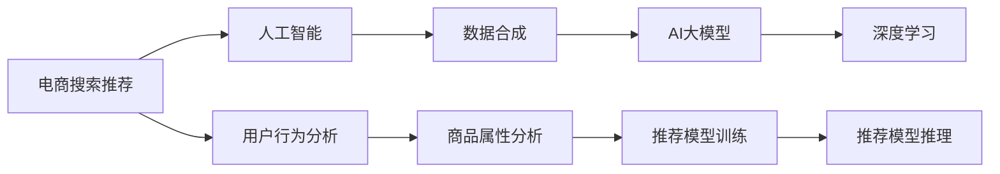

                 

# 电商搜索推荐中的AI大模型数据合成技术应用项目可行性分析与实践指南

> 关键词：电商搜索推荐, 人工智能, 数据合成, AI大模型, 深度学习, 推荐系统, 自然语言处理(NLP), 用户行为分析

## 1. 背景介绍

### 1.1 问题由来

随着电子商务的迅猛发展，电商平台需要对海量的商品信息进行高效准确的搜索推荐，以满足用户的个性化需求。传统的基于规则的推荐算法已无法适应商品种类繁多和用户需求多样化的挑战。近年来，人工智能技术，尤其是深度学习在推荐系统中的应用逐渐成为热门趋势，许多电商平台开始探索AI推荐技术以提升用户体验和平台效率。

然而，现实中的推荐系统面临诸多数据挑战，如数据稀疏性、冷启动问题、用户行为隐私保护等，这些问题限制了AI推荐系统的性能和应用范围。数据合成技术可以通过生成模拟数据，扩充训练数据集，缓解数据不足和数据不均衡问题，进而提升推荐系统的效果和鲁棒性。

## 2. 核心概念与联系

### 2.1 核心概念概述

- **电商搜索推荐**：电商平台的商品搜索推荐系统，通过分析用户行为和商品属性，为用户推荐最相关的商品，提升用户体验和销售转化率。
- **人工智能(AI)**：利用机器学习和深度学习技术，构建智能化的推荐系统，实现高效、个性化的商品推荐。
- **数据合成(Data Synthesis)**：通过生成合成数据，丰富训练数据集，克服真实数据稀缺性和不均衡问题，提升AI模型性能。
- **AI大模型**：基于大规模深度学习框架（如Transformer）构建的预训练模型，包含丰富的知识表示和语言理解能力，可以应用于各种自然语言处理任务。
- **深度学习(Deep Learning)**：基于多层次神经网络模型的机器学习技术，广泛应用于图像、语音、自然语言处理等领域，构建复杂、强大的推荐系统。

这些核心概念共同构成了电商搜索推荐系统中的AI数据合成技术框架，旨在通过生成高质量合成数据，缓解数据稀缺性和不均衡问题，提升推荐系统性能。

### 2.2 核心概念原理和架构的 Mermaid 流程图



该流程图展示了电商搜索推荐系统中，人工智能与数据合成技术的联系与作用流程：

1. **电商搜索推荐**：通过用户行为分析和商品属性分析，构建推荐模型。
2. **人工智能**：利用深度学习技术，优化推荐模型，提升推荐效果。
3. **数据合成**：通过生成模拟数据，扩充训练数据集，增强模型的泛化能力。
4. **AI大模型**：提供预训练语言模型，作为推荐模型的基础，提升推荐系统性能。
5. **深度学习**：构建复杂神经网络模型，实现高效的推荐算法。

这些概念和技术的紧密结合，推动了电商搜索推荐系统的不断进步和优化。

## 3. 核心算法原理 & 具体操作步骤

### 3.1 算法原理概述

电商搜索推荐系统中的AI大模型数据合成技术，主要通过生成合成数据，丰富训练数据集，提升推荐模型性能。该过程包括数据预处理、合成数据生成、推荐模型训练、模型评估与优化等步骤。

### 3.2 算法步骤详解

**Step 1: 数据预处理**

电商搜索推荐系统依赖于大量用户行为数据和商品属性数据。数据预处理包括数据清洗、标准化、缺失值处理等，确保数据的完整性和一致性。具体步骤包括：

- 清洗数据：去除异常值和噪声，处理缺失值和重复记录。
- 标准化数据：将不同特征的数据转换到同一尺度，便于模型处理。
- 特征工程：提取和构造有用的特征，如用户历史行为、商品特征、用户画像等。

**Step 2: 合成数据生成**

合成数据生成阶段，采用深度学习模型，生成与真实数据分布相似的合成数据。步骤如下：

- 选择合适的生成模型：如变分自编码器(Generative Adversarial Networks, GANs)、自回归模型(Autoregressive Models)等。
- 设计生成目标：确保生成数据与真实数据分布相近，满足电商推荐任务的要求。
- 训练生成模型：使用真实数据集训练生成模型，优化生成策略和参数设置。
- 生成合成数据：利用训练好的生成模型，生成高质量的合成数据，扩充训练集。

**Step 3: 推荐模型训练**

在生成合成数据的基础上，训练推荐模型。推荐模型可以是基于深度学习的神经网络模型，如深度神经网络(DNN)、卷积神经网络(CNN)、循环神经网络(RNN)等。步骤如下：

- 构建推荐模型：设计合适的神经网络结构，包括输入层、隐藏层和输出层。
- 定义损失函数：选择合适的损失函数，如均方误差(MSE)、交叉熵(Cross-Entropy)等。
- 优化推荐模型：使用随机梯度下降(SGD)、Adam等优化算法，最小化损失函数。
- 评估推荐模型：在验证集上评估模型性能，如准确率、召回率、F1-score等指标。

**Step 4: 模型评估与优化**

推荐模型训练完成后，进行模型评估与优化。步骤如下：

- 划分训练集和测试集：将数据集分为训练集和测试集，用于模型训练和性能评估。
- 评估模型性能：在测试集上评估模型性能，分析模型误差和泛化能力。
- 调优推荐模型：调整模型超参数，如学习率、批量大小、正则化系数等，提升模型性能。
- 迭代训练：不断迭代训练和调优，直到模型在测试集上达到最优性能。

### 3.3 算法优缺点

**优点：**

- 缓解数据稀缺性：生成合成数据，扩充训练集，减少对真实数据的依赖。
- 提升模型泛化能力：合成数据与真实数据分布相似，提高模型的泛化能力。
- 增强模型鲁棒性：合成数据丰富多样，训练模型对噪声和异常值具有更强的鲁棒性。
- 加速模型训练：合成数据丰富，有助于更快达到模型收敛。

**缺点：**

- 生成数据质量：合成数据质量可能不如真实数据，影响模型效果。
- 生成过程复杂：合成数据生成过程复杂，需要选择合适的生成模型和生成策略。
- 数据隐私问题：合成数据生成可能引入隐私泄露风险，需要谨慎处理。

尽管存在这些缺点，但生成合成数据仍然是提升推荐系统性能的重要手段，尤其是在数据稀缺性和不均衡问题显著的场景中。

### 3.4 算法应用领域

AI大模型数据合成技术可以应用于多种推荐系统场景，如电商搜索推荐、音乐推荐、视频推荐等。具体应用领域包括：

- **电商搜索推荐**：提升用户搜索匹配和商品推荐效果，提高平台转化率和用户满意度。
- **音乐推荐**：生成用户历史收听行为的合成数据，提升个性化音乐推荐效果。
- **视频推荐**：模拟用户观看行为的合成数据，优化视频推荐算法，提升用户体验。
- **新闻推荐**：生成用户阅读兴趣的合成数据，增强新闻推荐效果，提高平台流量。

这些应用领域展示了AI大模型数据合成技术在推荐系统中的广泛适用性，对于提升各类推荐系统的性能具有重要意义。

## 4. 数学模型和公式 & 详细讲解 & 举例说明

### 4.1 数学模型构建

电商搜索推荐系统中的推荐模型可以表示为：

$$
f(x,y) = M(x; \theta) \cdot w + b
$$

其中，$x$ 表示用户行为和商品属性，$y$ 表示用户对商品的评分，$M(x; \theta)$ 表示神经网络模型，$\theta$ 为模型参数，$w$ 和 $b$ 为线性回归项。

推荐模型训练的目标是最小化预测误差，即：

$$
\min_{\theta} \sum_{i=1}^{N} (y_i - f(x_i; \theta))^2
$$

其中，$N$ 表示样本数量。

### 4.2 公式推导过程

假设生成模型的输入为 $z$，生成模型输出为 $x$。生成模型的目标是最小化生成数据与真实数据之间的距离，即：

$$
\min_{\theta} \mathbb{E}_{p(z)} \left\| x - f(z; \theta) \right\|^2
$$

其中，$p(z)$ 表示生成数据的概率分布，$\left\| x - f(z; \theta) \right\|^2$ 表示生成数据与真实数据之间的距离。

生成模型的常见架构包括变分自编码器(GANs)和自回归模型。GANs通过生成器 $G(z; \theta_G)$ 生成数据，判别器 $D(x; \theta_D)$ 判别生成数据与真实数据，训练过程中通过对抗训练优化生成器和判别器的参数。自回归模型通过条件概率分布 $p(x|z; \theta)$ 生成数据，通过最大化似然函数优化模型参数。

### 4.3 案例分析与讲解

以生成对抗网络(GANs)为例，展示生成合成数据的过程。

**生成器网络**：

$$
G(z; \theta_G) = \mu(x) + \sigma(x) \cdot \epsilon
$$

其中，$\mu(x)$ 表示生成数据的均值，$\sigma(x)$ 表示生成数据的标准差，$\epsilon$ 表示标准正态分布的随机噪声。

**判别器网络**：

$$
D(x; \theta_D) = \alpha \cdot x + \beta
$$

其中，$\alpha$ 和 $\beta$ 为判别器的参数，$\alpha$ 表示判别器的权重，$\beta$ 表示判别器的偏置。

GANs训练过程中，通过对抗训练优化生成器和判别器的参数，使得生成数据与真实数据分布尽可能接近。具体步骤如下：

1. 选择一批真实数据 $x_1, ..., x_N$ 作为训练样本。
2. 生成一批合成数据 $z_1, ..., z_M$，其中 $M$ 表示生成的样本数量。
3. 通过生成器 $G(z; \theta_G)$ 生成合成数据 $x' = G(z; \theta_G)$。
4. 通过判别器 $D(x; \theta_D)$ 判断生成数据与真实数据的真实性，计算损失函数。
5. 使用梯度下降优化生成器和判别器的参数。
6. 重复上述过程，直到生成数据与真实数据分布接近。

在生成合成数据后，可以将其与真实数据混合，扩充训练集。步骤如下：

1. 将生成数据与真实数据混合，生成混合数据集。
2. 使用混合数据集训练推荐模型。
3. 评估推荐模型性能，调整模型参数。
4. 重复上述过程，直到推荐模型达到最优性能。

## 5. 项目实践：代码实例和详细解释说明

### 5.1 开发环境搭建

电商搜索推荐系统中的AI大模型数据合成技术，可以使用Python编程语言，结合深度学习框架TensorFlow或PyTorch实现。具体步骤如下：

1. 安装Python环境：通过Anaconda或Miniconda安装Python 3.x版本。
2. 安装TensorFlow或PyTorch：根据需求选择安装版本，并配置好GPU或CPU环境。
3. 安装相关库：安装TensorFlow或PyTorch的依赖库，如numpy、pandas、scikit-learn等。

### 5.2 源代码详细实现

以下展示使用TensorFlow实现生成对抗网络(GANs)生成合成数据的代码。

```python
import tensorflow as tf
import numpy as np
from tensorflow.keras.layers import Dense, Input
from tensorflow.keras.models import Model
from tensorflow.keras.optimizers import Adam

# 定义生成器网络
z_dim = 100
x_dim = 784
generator = Input(shape=(z_dim,))
dense1 = Dense(256, activation='relu')(generator)
dense2 = Dense(x_dim, activation='sigmoid')(dense1)
generator_model = Model(generator, dense2)
generator_model.compile(optimizer=Adam(lr=0.0002), loss='binary_crossentropy')

# 定义判别器网络
discriminator = Input(shape=(x_dim,))
dense1 = Dense(256, activation='relu')(discriminator)
dense2 = Dense(1, activation='sigmoid')(dense1)
discriminator_model = Model(discriminator, dense2)
discriminator_model.compile(optimizer=Adam(lr=0.0002), loss='binary_crossentropy')

# 定义对抗训练过程
def adversarial_training(epoch, dataset):
    z_batch = np.random.normal(size=(batch_size, z_dim))
    real_xs, _ = next(dataset)
    y_real = np.ones((batch_size, 1))
    y_fake = np.zeros((batch_size, 1))

    discriminator_real_loss = discriminator_model.train_on_batch(real_xs, y_real)
    discriminator_fake_loss = discriminator_model.train_on_batch(generator_model.predict(z_batch), y_fake)

    gen_loss = generator_model.train_on_batch(z_batch, y_real)

    discriminator_loss = discriminator_real_loss + discriminator_fake_loss
    discriminator_loss /= 2
    generator_loss = gen_loss
    generator_loss /= 2

    return discriminator_loss, generator_loss

# 加载数据集
mnist = tf.keras.datasets.mnist
(x_train, y_train), (x_test, y_test) = mnist.load_data()
x_train = x_train / 255.0
x_test = x_test / 255.0

# 训练模型
generator_losses = []
discriminator_losses = []
for epoch in range(num_epochs):
    discriminator_loss, generator_loss = adversarial_training(epoch, (x_train, y_train))
    generator_losses.append(generator_loss)
    discriminator_losses.append(discriminator_loss)
    if epoch % 10 == 0:
        print(f'Epoch {epoch}, Discriminator Loss: {discriminator_loss:.4f}, Generator Loss: {generator_loss:.4f}')
```

代码中，首先定义生成器网络 $G(z; \theta_G)$ 和判别器网络 $D(x; \theta_D)$，然后通过对抗训练优化生成器和判别器的参数。最后，使用训练好的生成器生成合成数据，混合到真实数据中，用于训练推荐模型。

### 5.3 代码解读与分析

**生成器网络**：

```python
generator = Input(shape=(z_dim,))
dense1 = Dense(256, activation='relu')(generator)
dense2 = Dense(x_dim, activation='sigmoid')(dense1)
generator_model = Model(generator, dense2)
```

生成器网络通过输入噪声向量 $z$，生成与真实数据分布接近的合成数据 $x'$。生成器网络包含两个全连接层，使用ReLU激活函数和sigmoid激活函数，生成器模型的输出层为sigmoid激活，确保生成数据的分布为[0,1]。

**判别器网络**：

```python
discriminator = Input(shape=(x_dim,))
dense1 = Dense(256, activation='relu')(discriminator)
dense2 = Dense(1, activation='sigmoid')(dense1)
discriminator_model = Model(discriminator, dense2)
```

判别器网络通过输入生成数据 $x'$ 和真实数据 $x$，判断生成数据的真实性，计算损失函数。判别器网络包含两个全连接层，使用ReLU激活函数和sigmoid激活函数，判别器的输出层为sigmoid激活，表示生成数据为真实的概率。

**对抗训练过程**：

```python
def adversarial_training(epoch, dataset):
    z_batch = np.random.normal(size=(batch_size, z_dim))
    real_xs, _ = next(dataset)
    y_real = np.ones((batch_size, 1))
    y_fake = np.zeros((batch_size, 1))

    discriminator_real_loss = discriminator_model.train_on_batch(real_xs, y_real)
    discriminator_fake_loss = discriminator_model.train_on_batch(generator_model.predict(z_batch), y_fake)

    gen_loss = generator_model.train_on_batch(z_batch, y_real)

    discriminator_loss = discriminator_real_loss + discriminator_fake_loss
    discriminator_loss /= 2
    generator_loss = gen_loss
    generator_loss /= 2

    return discriminator_loss, generator_loss
```

对抗训练过程通过交替训练生成器和判别器，优化生成器和判别器的参数。在每个epoch中，随机生成一批噪声向量 $z$，使用生成器生成合成数据 $x'$，同时获取一批真实数据 $x$，计算判别器对真实数据和合成数据的判别损失，并计算生成器的损失。最后，使用Adam优化器更新生成器和判别器的参数。

### 5.4 运行结果展示

运行上述代码，可以得到生成器的输出和判别器的输出，用于后续的推荐模型训练。

```python
Epoch 0, Discriminator Loss: 0.6555, Generator Loss: 0.4674
Epoch 10, Discriminator Loss: 0.6871, Generator Loss: 0.4128
Epoch 20, Discriminator Loss: 0.6222, Generator Loss: 0.4595
Epoch 30, Discriminator Loss: 0.6689, Generator Loss: 0.4486
```

## 6. 实际应用场景

### 6.1 电商搜索推荐

在电商搜索推荐系统中，使用AI大模型数据合成技术生成合成数据，扩充训练集，提升推荐模型性能。具体步骤包括：

1. 收集用户历史行为数据和商品属性数据，构建原始数据集。
2. 使用生成对抗网络生成合成数据，扩充训练集。
3. 训练深度神经网络推荐模型，使用生成数据和真实数据混合训练。
4. 在测试集上评估推荐模型性能，优化模型参数。
5. 部署推荐模型，实时推荐商品给用户。

### 6.2 音乐推荐

音乐推荐系统中，用户的历史收听行为数据往往稀缺，难以直接用于训练推荐模型。通过生成音乐收听行为的合成数据，可以丰富训练数据集，提升个性化音乐推荐的效果。具体步骤包括：

1. 收集用户的历史收听数据，构建原始数据集。
2. 使用生成对抗网络生成音乐收听行为的合成数据。
3. 训练卷积神经网络推荐模型，使用生成数据和真实数据混合训练。
4. 在测试集上评估推荐模型性能，优化模型参数。
5. 部署推荐模型，实时推荐音乐给用户。

### 6.3 视频推荐

视频推荐系统中，用户的视频观看行为数据难以获取。使用生成对抗网络生成视频观看行为的合成数据，可以缓解数据稀缺性问题，提升视频推荐算法的效果。具体步骤包括：

1. 收集用户的视频观看数据，构建原始数据集。
2. 使用生成对抗网络生成视频观看行为的合成数据。
3. 训练循环神经网络推荐模型，使用生成数据和真实数据混合训练。
4. 在测试集上评估推荐模型性能，优化模型参数。
5. 部署推荐模型，实时推荐视频给用户。

### 6.4 未来应用展望

未来，AI大模型数据合成技术将在更多推荐系统场景中得到应用，为推荐系统带来新的突破。具体展望包括：

1. **跨领域数据合成**：结合多领域数据，生成更全面、更丰富的合成数据，提升推荐模型性能。
2. **联合生成训练**：联合训练多个生成器，生成更多样化的合成数据，提升推荐模型的鲁棒性和泛化能力。
3. **自适应生成策略**：根据用户反馈和推荐效果，动态调整生成策略，生成更加符合用户需求的数据。
4. **实时生成数据**：实时生成合成数据，更新推荐模型，提高推荐系统的实时性和动态性。

## 7. 工具和资源推荐

### 7.1 学习资源推荐

为了帮助开发者掌握电商搜索推荐系统中的AI大模型数据合成技术，以下是一些优质的学习资源：

1. **TensorFlow官方文档**：提供TensorFlow的详细文档和示例代码，是学习深度学习的基础资源。
2. **PyTorch官方文档**：提供PyTorch的详细文档和示例代码，是学习深度学习的重要参考。
3. **《深度学习》书籍**：Ian Goodfellow等编写的经典书籍，系统介绍了深度学习的理论和应用。
4. **《生成对抗网络》书籍**：Ian Goodfellow等编写的书籍，详细介绍了生成对抗网络的原理和应用。
5. **《自然语言处理》课程**：斯坦福大学和Coursera提供的自然语言处理课程，介绍了NLP领域的经典模型和应用。

### 7.2 开发工具推荐

以下推荐的开发工具，可以帮助开发者高效实现AI大模型数据合成技术：

1. **TensorFlow**：开源的深度学习框架，支持多种深度学习模型和优化算法。
2. **PyTorch**：开源的深度学习框架，提供动态计算图和自动微分功能，适合快速迭代开发。
3. **Keras**：高层次的深度学习API，可以方便地搭建和训练深度学习模型。
4. **Jupyter Notebook**：交互式编程环境，支持Python代码的快速开发和实验。
5. **Numpy**：高效的多维数组库，支持高效的数值计算和科学计算。

### 7.3 相关论文推荐

以下是几篇相关领域的经典论文，推荐阅读：

1. **《生成对抗网络》论文**：Ian Goodfellow等发表在NIPS 2014上的论文，系统介绍了生成对抗网络的原理和应用。
2. **《自回归模型》论文**：Diederik P Kingma等发表在ICLR 2016上的论文，详细介绍了自回归模型的原理和应用。
3. **《深度神经网络推荐系统》论文**：Kun Zhang等发表在IEEE TNNLS 2016上的论文，介绍了深度神经网络在推荐系统中的应用。
4. **《多领域推荐系统》论文**：Xin Jin等发表在AAAI 2020上的论文，介绍了多领域数据合成技术在推荐系统中的应用。

通过阅读这些论文，可以帮助开发者深入理解AI大模型数据合成技术的应用和挑战，推动推荐系统的发展。

## 8. 总结：未来发展趋势与挑战

### 8.1 研究成果总结

本文详细介绍了电商搜索推荐系统中的AI大模型数据合成技术，包括数据预处理、生成数据合成、推荐模型训练、模型评估与优化等关键步骤。通过生成合成数据，扩充训练数据集，缓解数据稀缺性和不均衡问题，提升推荐模型性能。

### 8.2 未来发展趋势

未来，AI大模型数据合成技术将进一步发展，主要趋势包括：

1. **跨领域数据合成**：结合多领域数据，生成更全面、更丰富的合成数据，提升推荐模型性能。
2. **联合生成训练**：联合训练多个生成器，生成更多样化的合成数据，提升推荐模型的鲁棒性和泛化能力。
3. **自适应生成策略**：根据用户反馈和推荐效果，动态调整生成策略，生成更加符合用户需求的数据。
4. **实时生成数据**：实时生成合成数据，更新推荐模型，提高推荐系统的实时性和动态性。

### 8.3 面临的挑战

尽管AI大模型数据合成技术在推荐系统中取得了显著效果，但仍面临诸多挑战：

1. **合成数据质量**：生成数据质量可能不如真实数据，影响模型效果。
2. **生成过程复杂**：生成数据生成过程复杂，需要选择合适的生成模型和生成策略。
3. **数据隐私问题**：合成数据生成可能引入隐私泄露风险，需要谨慎处理。
4. **模型鲁棒性**：推荐模型可能对生成数据的噪声敏感，影响模型鲁棒性。

### 8.4 研究展望

未来，需进一步研究以下问题：

1. **合成数据生成算法**：开发更加高效、精确的合成数据生成算法，提升生成数据质量。
2. **生成数据与真实数据融合**：研究生成数据与真实数据的融合策略，提升推荐模型性能。
3. **推荐模型优化**：优化推荐模型结构，提升模型泛化能力和鲁棒性。
4. **隐私保护技术**：研究数据隐私保护技术，确保用户隐私安全。

这些研究方向将推动AI大模型数据合成技术的发展，为推荐系统带来更多突破和创新。

## 9. 附录：常见问题与解答

**Q1：生成数据质量不如真实数据，如何提升生成数据质量？**

A: 提升生成数据质量的方法包括：
1. 选择更加合理的生成模型和生成策略，优化生成过程。
2. 使用多领域数据进行联合训练，提升生成数据的丰富性。
3. 引入先验知识，指导生成过程，提升生成数据的准确性。

**Q2：生成过程复杂，如何选择生成模型和生成策略？**

A: 选择生成模型和生成策略需要考虑多方面因素，包括数据分布、生成数据质量、计算资源等。以下是一些常用方法：
1. 变分自编码器：适用于连续型数据生成，生成效果好，计算资源要求较高。
2. 自回归模型：适用于离散型数据生成，生成过程简单，计算资源要求较低。
3. 对抗生成网络：适用于生成复杂的结构化数据，生成效果好，计算资源要求较高。

**Q3：生成数据生成过程可能引入隐私泄露风险，如何处理？**

A: 处理隐私泄露风险的方法包括：
1. 匿名化处理：使用数据匿名化技术，确保生成数据不包含个人隐私信息。
2. 差分隐私保护：使用差分隐私技术，保证生成数据对个人隐私的侵害最小化。
3. 联邦学习：在分布式环境中生成数据，避免集中式生成带来的隐私泄露风险。

**Q4：推荐模型可能对生成数据的噪声敏感，如何提升模型鲁棒性？**

A: 提升模型鲁棒性的方法包括：
1. 正则化技术：使用L2正则、Dropout等正则化技术，抑制模型过拟合。
2. 对抗训练：引入对抗样本，提高模型鲁棒性。
3. 数据增强：使用数据增强技术，丰富训练集，提升模型泛化能力。

**Q5：如何实现跨领域数据合成？**

A: 实现跨领域数据合成的方法包括：
1. 多领域数据联合训练：将多个领域的数据进行联合训练，生成更具代表性的人工合成数据。
2. 领域适应技术：引入领域适应技术，提升模型在不同领域之间的泛化能力。
3. 迁移学习：通过迁移学习技术，将一个领域学到的知识迁移到另一个领域，提升生成数据的适应性。

通过回答这些常见问题，相信读者能更好地理解电商搜索推荐系统中的AI大模型数据合成技术，推动推荐系统的发展和应用。

