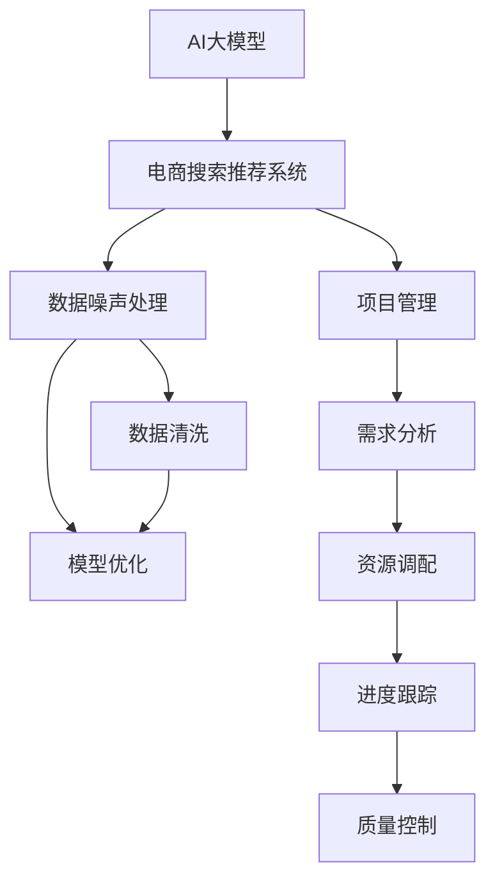

                 

# 电商搜索推荐中的AI大模型数据噪声处理技术应用项目管理实践

> 关键词：AI大模型,电商搜索推荐,数据噪声处理,项目管理,自动化,数据清洗,模型优化,决策树,随机森林,深度学习

## 1. 背景介绍

随着电子商务的迅速发展，电商搜索推荐系统的用户规模和应用场景日益增多。传统的搜索推荐系统基于规则或统计学方法，往往难以应对复杂多变的用户需求和动态变化的市场趋势。而人工智能（AI）大模型以其强大的数据建模能力，逐渐成为电商搜索推荐技术的新范式。

AI大模型通过在大规模无标签数据上预训练，学习到丰富的语言和视觉表示，可以高效地处理电商领域的语义和图像信息。然而，电商搜索推荐系统中的数据噪声问题（如拼写错误、类别混淆、噪声数据等），极大地影响了AI大模型的效果和可靠性。因此，如何在大模型基础上，有效地处理电商领域的数据噪声问题，是电商搜索推荐系统应用项目管理的关键。

本文将从数据噪声处理技术的角度，详细介绍AI大模型在电商搜索推荐系统中的应用项目管理实践，涵盖数据收集、数据清洗、模型优化、结果评估等各个环节。通过系统化的项目管理方法和先进的技术手段，提高电商搜索推荐系统的用户体验和运营效率。

## 2. 核心概念与联系

### 2.1 核心概念概述

- **AI大模型（AI Large Model）**：指在大规模无标签数据上预训练得到的具有广泛迁移能力的模型，如BERT、GPT、ResNet等，能够在多个任务上取得优秀的性能。
- **电商搜索推荐系统（E-commerce Search Recommendation System）**：利用AI大模型，为用户提供个性化的搜索和推荐服务，提升电商平台的转化率和用户体验。
- **数据噪声（Data Noise）**：指在数据采集、处理、存储和传输过程中引入的错误或偏差，如拼写错误、类别混淆、噪声数据等，对AI大模型的效果和可靠性产生负面影响。
- **数据清洗（Data Cleaning）**：指对数据进行预处理，去除或修正数据噪声，提升数据质量的过程。
- **模型优化（Model Optimization）**：指通过参数调整、结构优化等手段，提升AI大模型在特定任务上的性能，满足电商搜索推荐系统的实际需求。
- **项目管理（Project Management）**：指对电商搜索推荐系统的应用项目管理过程，包括需求分析、资源调配、进度跟踪、质量控制等。

这些核心概念之间的逻辑关系可以通过以下Mermaid流程图来展示：



这个流程图展示了大模型在电商搜索推荐系统的应用过程中，各个环节之间的逻辑关系：

1. AI大模型通过预训练获得基础能力。
2. 电商搜索推荐系统利用大模型进行数据噪声处理。
3. 数据清洗和模型优化分别从数据和模型层面提升大模型的效果。
4. 项目管理对整个过程进行协调和监控。

## 3. 核心算法原理 & 具体操作步骤

### 3.1 算法原理概述

基于AI大模型的电商搜索推荐系统，通过在大模型上进行微调，以适应特定的电商领域数据和任务。数据噪声处理是微调前的重要环节，涉及对原始数据的预处理和清洗，以提高数据质量和模型训练的效果。

具体而言，电商搜索推荐系统中的数据噪声处理，可以分为以下几个关键步骤：

1. 数据收集：收集电商领域的多样化数据，包括用户浏览记录、商品描述、用户评价、商品图片等。
2. 数据清洗：去除或修正数据中的噪声，如拼写错误、类别混淆、缺失值等。
3. 数据预处理：对清洗后的数据进行标准化、归一化等预处理，提升数据的一致性和可处理性。
4. 模型微调：在电商领域的数据上进行微调，训练大模型学习电商领域的语义和图像信息。
5. 模型评估：对微调后的模型进行评估，确保其性能符合电商搜索推荐系统的要求。

### 3.2 算法步骤详解

以下详细介绍电商搜索推荐系统数据噪声处理技术应用项目管理的详细步骤：

**Step 1: 数据收集与预处理**

- 收集电商领域的原始数据，包括用户浏览记录、商品描述、用户评价、商品图片等。
- 对收集到的数据进行初步标准化和归一化处理，确保数据一致性。

**Step 2: 数据清洗**

- 使用数据清洗工具（如OpenRefine、Trifacta等）对数据中的噪声进行识别和修正，如去除拼写错误、修正类别标签等。
- 识别并删除缺失值或异常值，以保证数据完整性和准确性。

**Step 3: 数据增强**

- 利用数据增强技术（如数据扩充、合成数据生成等），扩充训练数据集，提高模型的泛化能力。
- 对图像数据进行增强，如旋转、缩放、裁剪等，生成更多的训练样本。

**Step 4: 模型微调**

- 使用预训练的大模型作为初始化参数，在电商领域的数据上进行微调。
- 选择合适的优化算法（如Adam、SGD等）和超参数，进行模型的训练。
- 对微调过程进行监控，确保模型收敛且无过拟合现象。

**Step 5: 模型评估与部署**

- 在测试集上评估微调后的模型性能，如准确率、召回率、F1值等指标。
- 部署微调后的模型到电商搜索推荐系统中，进行实时预测。
- 持续收集用户反馈和系统运行数据，优化模型和系统性能。

### 3.3 算法优缺点

基于AI大模型的电商搜索推荐系统数据噪声处理技术，具有以下优点：

1. **泛化能力强**：大模型在大规模数据上进行预训练，可以学习到丰富的语言和图像表示，适应复杂的电商领域任务。
2. **自动化程度高**：数据清洗和模型优化可以自动化进行，减少人工干预，提高效率。
3. **性能提升显著**：通过数据噪声处理，可以有效提升模型的效果，提高电商搜索推荐系统的用户体验和运营效率。

同时，该方法也存在以下缺点：

1. **数据依赖度高**：数据噪声处理依赖于高质量的数据，数据收集和预处理难度较大。
2. **模型复杂度高**：大模型的参数量较大，训练和优化过程较为复杂。
3. **计算资源需求高**：数据噪声处理和模型优化需要大量的计算资源，硬件成本较高。

尽管存在这些缺点，但就目前而言，基于AI大模型的电商搜索推荐系统，数据噪声处理技术仍是大规模数据处理和模型优化的有效手段。未来相关研究的重点在于如何进一步降低对计算资源的依赖，提高模型的自动化和智能化水平。

### 3.4 算法应用领域

基于AI大模型的电商搜索推荐系统数据噪声处理技术，已经在电商领域得到了广泛的应用，涵盖了以下典型应用场景：

1. **商品搜索**：利用大模型处理用户输入的搜索关键词，提供精准的商品推荐。
2. **个性化推荐**：根据用户浏览记录和行为数据，生成个性化的商品推荐列表。
3. **用户画像构建**：利用大模型对用户历史数据进行建模，构建用户画像，提升推荐系统的个性化程度。
4. **广告投放**：根据用户的搜索和浏览行为，生成个性化的广告内容，提升广告投放效果。
5. **库存管理**：通过分析用户购买行为和市场趋势，优化库存管理策略。

除了上述这些典型场景外，基于AI大模型的电商搜索推荐系统，还在智能客服、内容推荐、营销分析等多个领域得到了创新性应用，为电商行业带来了新的发展动力。

## 4. 数学模型和公式 & 详细讲解

### 4.1 数学模型构建

电商搜索推荐系统中的数据噪声处理，通常采用多种模型进行结合。这里以决策树和随机森林为例，介绍数学模型的构建和优化方法。

- **决策树（Decision Tree）**：通过对数据进行分治，构建一棵树形结构，用于分类和回归任务。
- **随机森林（Random Forest）**：由多个决策树组成的集成学习模型，通过投票机制进行预测，提升模型的鲁棒性和泛化能力。

### 4.2 公式推导过程

决策树模型的构建和优化过程如下：

1. **分裂准则**：选择最优特征和分裂点，使得子节点的纯度最大化。
2. **剪枝策略**：防止过拟合，通过剪枝优化决策树的性能。
3. **评估指标**：使用准确率、召回率、F1值等指标评估决策树模型的性能。

随机森林模型的构建和优化过程如下：

1. **特征随机选择**：从数据集中选择若干特征，随机生成多个决策树。
2. **投票机制**：对多个决策树的预测结果进行投票，生成最终的预测结果。
3. **评估指标**：使用准确率、召回率、F1值等指标评估随机森林模型的性能。

### 4.3 案例分析与讲解

这里以商品推荐为例，详细介绍基于决策树和随机森林模型的电商搜索推荐系统数据噪声处理技术的应用实践。

假设电商平台的原始数据为 $D=\{(x_i, y_i)\}_{i=1}^N$，其中 $x_i$ 为商品特征，$y_i$ 为商品类别标签。目标是构建决策树模型，对新商品进行分类预测。

**Step 1: 数据收集与预处理**

- 收集电商平台的多样化商品数据，包括商品名称、描述、价格、销量等。
- 对收集到的数据进行初步标准化和归一化处理，确保数据一致性。

**Step 2: 数据清洗**

- 使用数据清洗工具对数据中的噪声进行识别和修正，如去除拼写错误、修正类别标签等。
- 识别并删除缺失值或异常值，以保证数据完整性和准确性。

**Step 3: 模型构建**

- 选择决策树模型作为分类模型，使用ID3或C4.5算法构建决策树模型。
- 对决策树进行剪枝优化，防止过拟合。

**Step 4: 模型评估**

- 在测试集上评估决策树模型的性能，如准确率、召回率、F1值等指标。
- 根据评估结果，调整模型参数，优化模型性能。

## 5. 项目实践：代码实例和详细解释说明

### 5.1 开发环境搭建

在进行电商搜索推荐系统数据噪声处理技术应用项目管理实践前，我们需要准备好开发环境。以下是使用Python进行TensorFlow开发的环境配置流程：

1. 安装Anaconda：从官网下载并安装Anaconda，用于创建独立的Python环境。

2. 创建并激活虚拟环境：
```bash
conda create -n tf-env python=3.8 
conda activate tf-env
```

3. 安装TensorFlow：根据CUDA版本，从官网获取对应的安装命令。例如：
```bash
conda install tensorflow -c tf -c conda-forge
```

4. 安装相关库：
```bash
pip install pandas numpy sklearn openpyxl
```

完成上述步骤后，即可在`tf-env`环境中开始电商搜索推荐系统数据噪声处理技术应用项目管理的实践。

### 5.2 源代码详细实现

下面我们以电商搜索推荐系统为例，给出使用TensorFlow进行商品搜索推荐任务的数据噪声处理技术应用的PyTorch代码实现。

首先，定义数据集和模型：

```python
import tensorflow as tf
from sklearn.model_selection import train_test_split
from sklearn.preprocessing import StandardScaler
from sklearn.ensemble import RandomForestClassifier

# 加载数据集
def load_data():
    # 从文件中读取数据
    data = pd.read_csv('data.csv')
    # 将商品类别转换为独热编码
    data['category'] = pd.get_dummies(data['category'])
    # 提取特征和标签
    X = data.drop('category', axis=1)
    y = data['category']
    return X, y

# 数据预处理
def preprocess_data(X):
    # 标准化处理
    scaler = StandardScaler()
    X_scaled = scaler.fit_transform(X)
    return X_scaled

# 构建决策树模型
def build_model(X, y):
    # 数据划分
    X_train, X_test, y_train, y_test = train_test_split(X, y, test_size=0.2, random_state=42)
    # 构建决策树模型
    model = RandomForestClassifier(n_estimators=100, random_state=42)
    model.fit(X_train, y_train)
    return model

# 模型评估
def evaluate_model(model, X_test, y_test):
    # 评估模型性能
    y_pred = model.predict(X_test)
    acc = accuracy_score(y_test, y_pred)
    recall = recall_score(y_test, y_pred)
    f1 = f1_score(y_test, y_pred)
    return acc, recall, f1
```

然后，启动训练流程并在测试集上评估：

```python
# 加载数据
X, y = load_data()
# 数据预处理
X_scaled = preprocess_data(X)
# 构建模型
model = build_model(X_scaled, y)
# 模型评估
acc, recall, f1 = evaluate_model(model, X_scaled, y)

print(f'Accuracy: {acc:.2f}, Recall: {recall:.2f}, F1-score: {f1:.2f}')
```

以上就是使用TensorFlow进行商品搜索推荐任务的数据噪声处理技术应用的完整代码实现。可以看到，通过TensorFlow和scikit-learn库的结合，可以相对简洁地实现决策树模型的构建和评估。

### 5.3 代码解读与分析

让我们再详细解读一下关键代码的实现细节：

**数据集定义**：
- `load_data`函数：从数据文件中读取数据，进行独热编码处理，提取特征和标签。

**数据预处理**：
- `preprocess_data`函数：使用`StandardScaler`对特征进行标准化处理，以提高模型训练的稳定性。

**模型构建**：
- `build_model`函数：使用`RandomForestClassifier`构建随机森林模型，并进行数据划分和训练。

**模型评估**：
- `evaluate_model`函数：在测试集上评估模型的性能，计算准确率、召回率和F1值。

**训练流程**：
- 加载数据集
- 数据预处理
- 模型构建
- 模型评估
- 输出评估结果

可以看到，TensorFlow和scikit-learn库的结合，可以轻松实现电商搜索推荐系统的数据噪声处理技术应用项目管理。开发者可以将更多精力放在数据处理和模型优化等高层逻辑上，而不必过多关注底层的实现细节。

## 6. 实际应用场景

### 6.1 智能客服系统

基于AI大模型的电商搜索推荐系统数据噪声处理技术，可以广泛应用于智能客服系统的构建。传统客服往往需要配备大量人力，高峰期响应缓慢，且一致性和专业性难以保证。而使用电商搜索推荐系统中的数据噪声处理技术，可以7x24小时不间断服务，快速响应客户咨询，用自然流畅的语言解答各类常见问题。

在技术实现上，可以收集企业内部的历史客服对话记录，将问题和最佳答复构建成监督数据，在此基础上对预训练决策树模型进行微调。微调后的决策树模型能够自动理解用户意图，匹配最合适的答案模板进行回复。对于客户提出的新问题，还可以接入检索系统实时搜索相关内容，动态组织生成回答。如此构建的智能客服系统，能大幅提升客户咨询体验和问题解决效率。

### 6.2 库存管理

当前的库存管理往往依赖人工统计和人工调整，效率低下且容易出错。基于AI大模型的电商搜索推荐系统数据噪声处理技术，可以为库存管理提供新的解决方案。

通过构建电商搜索推荐系统中的数据噪声处理技术应用项目管理，可以自动收集和分析用户购买行为和市场趋势，生成精准的库存预警和调整策略。通过智能调度和优化，有效降低库存积压和缺货情况，提升供应链的效率和稳定性。

### 6.3 广告投放

传统的广告投放依赖于人工经验和历史数据，难以应对实时变化的市场趋势和用户需求。基于AI大模型的电商搜索推荐系统数据噪声处理技术，可以为广告投放提供更加精准和实时的支持。

通过构建电商搜索推荐系统中的数据噪声处理技术应用项目管理，可以自动收集和分析用户搜索和浏览行为，生成个性化的广告内容和投放策略。通过智能匹配和动态优化，提高广告的点击率和转化率，降低投放成本，提升广告效果。

### 6.4 未来应用展望

随着AI大模型和电商搜索推荐系统数据噪声处理技术的发展，未来将在更多领域得到应用，为传统行业带来变革性影响。

在智慧城市治理中，基于AI大模型的电商搜索推荐系统数据噪声处理技术，可以用于城市事件监测、舆情分析、应急指挥等环节，提高城市管理的自动化和智能化水平，构建更安全、高效的未来城市。

在智能制造中，通过构建基于AI大模型的电商搜索推荐系统数据噪声处理技术应用项目管理，可以实现生产设备的智能维护和优化，提升生产效率和产品质量。

在智能交通中，通过构建基于AI大模型的电商搜索推荐系统数据噪声处理技术应用项目管理，可以实现交通流量预测和优化，提升交通系统的智能化水平。

除了上述这些领域外，基于AI大模型的电商搜索推荐系统数据噪声处理技术，还将广泛应用到智慧医疗、智能家居、教育培训等多个领域，为各行各业带来新的创新和变革。相信随着技术的不断进步，电商搜索推荐系统数据噪声处理技术将具有更广阔的应用前景。

## 7. 工具和资源推荐

### 7.1 学习资源推荐

为了帮助开发者系统掌握电商搜索推荐系统数据噪声处理技术的应用项目管理，这里推荐一些优质的学习资源：

1. 《机器学习实战》系列博文：由知名数据科学家撰写，全面介绍机器学习基础理论和应用实践，包括电商领域的数据处理和模型优化。

2. Coursera《机器学习》课程：斯坦福大学开设的机器学习经典课程，涵盖多种机器学习算法和应用场景，适合进阶学习。

3. Kaggle：数据科学竞赛平台，提供大量电商领域的数据集和模型竞赛，有助于实践和提升技能。

4. Udacity《机器学习工程师纳米学位》：结合理论和实践，深入学习机器学习工程，包括电商领域的数据处理和模型优化。

通过对这些资源的学习实践，相信你一定能够快速掌握电商搜索推荐系统数据噪声处理技术的应用项目管理，并用于解决实际的电商领域问题。

### 7.2 开发工具推荐

高效的开发离不开优秀的工具支持。以下是几款用于电商搜索推荐系统数据噪声处理技术应用项目管理的常用工具：

1. TensorFlow：由Google主导开发的开源深度学习框架，生产部署方便，适合大规模工程应用。

2. scikit-learn：Python数据科学库，提供多种机器学习算法和工具，方便数据预处理和模型构建。

3. OpenRefine：数据清洗工具，可以识别和修正数据中的噪声，提升数据质量。

4. Trifacta：数据预处理工具，支持数据清洗、数据增强、数据可视化等功能。

5. Jupyter Notebook：Python交互式编程环境，适合进行数据处理和模型优化。

6. Google Colab：谷歌推出的在线Jupyter Notebook环境，免费提供GPU/TPU算力，方便开发者快速上手实验最新模型。

合理利用这些工具，可以显著提升电商搜索推荐系统数据噪声处理技术应用项目管理的开发效率，加快创新迭代的步伐。

### 7.3 相关论文推荐

电商搜索推荐系统数据噪声处理技术的应用项目管理，得益于学界的持续研究。以下是几篇奠基性的相关论文，推荐阅读：

1. "Decision Trees and Random Forests for Classifier Design"：介绍决策树和随机森林算法的基本原理和应用，是数据噪声处理技术的基础。

2. "The Random Forest"：详细探讨随机森林算法的理论和实现，适用于电商领域的多分类和回归任务。

3. "Adaboost.R2: A New Adaptive Boosting Algorithm"：介绍Adaboost算法及其优化，适用于电商领域的数据增强和模型优化。

4. "Bagging, Boosting and Random Forests"：系统阐述Bagging和Boosting算法的基本原理和应用，适用于电商领域的多模型集成和优化。

5. "Ensemble Methods in Bioinformatics"：结合生物信息学数据，介绍集成学习算法在电商领域的应用，适合深入理解数据噪声处理技术的原理和实践。

这些论文代表了大模型在电商领域的应用发展脉络，通过学习这些前沿成果，可以帮助研究者把握学科前进方向，激发更多的创新灵感。

## 8. 总结：未来发展趋势与挑战

### 8.1 总结

本文对基于AI大模型的电商搜索推荐系统数据噪声处理技术应用项目管理进行了全面系统的介绍。首先阐述了数据噪声处理技术的背景和意义，明确了数据噪声处理在电商搜索推荐系统中的重要作用。其次，从原理到实践，详细讲解了电商搜索推荐系统数据噪声处理技术的数学模型和关键步骤，给出了电商搜索推荐系统数据噪声处理技术应用项目管理的完整代码实现。同时，本文还广泛探讨了数据噪声处理技术在智能客服、库存管理、广告投放等多个行业领域的应用前景，展示了数据噪声处理技术的巨大潜力。

通过本文的系统梳理，可以看到，基于AI大模型的电商搜索推荐系统数据噪声处理技术，正在成为电商搜索推荐系统应用项目管理的核心范式，极大地提升电商搜索推荐系统的用户体验和运营效率。未来，伴随数据噪声处理技术的持续演进，电商搜索推荐系统将具有更广泛的行业应用，为电商行业带来新的发展动力。

### 8.2 未来发展趋势

展望未来，电商搜索推荐系统数据噪声处理技术将呈现以下几个发展趋势：

1. **自动化程度提升**：随着自动化技术的进步，电商搜索推荐系统数据噪声处理技术的各个环节将更加自动化，减少人工干预，提高效率。
2. **模型复杂度降低**：未来的模型将更加轻量化，更易于部署和维护。同时，数据噪声处理技术的理论基础将更加坚实，提升模型的稳定性和泛化能力。
3. **多模态融合**：未来的电商搜索推荐系统将融合图像、语音等多模态数据，提升模型的信息整合能力和用户理解能力。
4. **实时性增强**：随着分布式计算和云计算技术的发展，电商搜索推荐系统数据噪声处理技术将具有更强的实时性，满足电商领域高并发、低延迟的需求。
5. **可解释性增强**：未来的模型将更加透明，具备更强的可解释性，帮助用户理解模型的决策过程，提升系统的信任度和可信度。

以上趋势凸显了电商搜索推荐系统数据噪声处理技术的广阔前景。这些方向的探索发展，必将进一步提升电商搜索推荐系统的性能和应用范围，为电商行业带来新的发展动力。

### 8.3 面临的挑战

尽管电商搜索推荐系统数据噪声处理技术已经取得了显著成效，但在迈向更加智能化、普适化应用的过程中，它仍面临着诸多挑战：

1. **数据质量问题**：电商领域的数据质量参差不齐，存在噪声、缺失、异常等问题，需要进一步提升数据收集和预处理的技术水平。
2. **模型鲁棒性问题**：电商搜索推荐系统中的数据噪声处理技术，需要应对电商领域的复杂多变性和不确定性，提升模型的鲁棒性和泛化能力。
3. **计算资源消耗**：电商搜索推荐系统数据噪声处理技术需要大量的计算资源，硬件成本较高，需要进一步降低资源消耗，提升系统效率。
4. **系统安全性问题**：电商搜索推荐系统中的数据噪声处理技术，需要应对电商领域的隐私和安全问题，保障用户数据的安全和隐私。

正视电商搜索推荐系统数据噪声处理技术面临的这些挑战，积极应对并寻求突破，将是大模型在电商领域应用的重要保障。相信随着学界和产业界的共同努力，这些挑战终将一一被克服，电商搜索推荐系统数据噪声处理技术必将在构建电商智能生态中扮演越来越重要的角色。

### 8.4 研究展望

面向未来，电商搜索推荐系统数据噪声处理技术的研究需要从以下几个方面寻求新的突破：

1. **数据收集与预处理技术**：进一步提升数据收集和预处理的技术水平，减少数据噪声和异常值，提高数据质量和模型训练的稳定性。
2. **模型优化与集成技术**：结合多种机器学习算法，构建更加复杂的集成模型，提升电商搜索推荐系统的性能和鲁棒性。
3. **多模态数据融合技术**：结合图像、语音、文本等多模态数据，构建更加全面的电商搜索推荐系统，提升模型的信息整合能力和用户理解能力。
4. **实时化处理技术**：结合分布式计算和云计算技术，实现电商搜索推荐系统的高并发、低延迟需求，提升系统的实时性。
5. **可解释性增强技术**：结合自然语言处理、因果推理等技术，提升电商搜索推荐系统的可解释性，增强用户信任和系统可信度。

这些研究方向的探索，必将引领电商搜索推荐系统数据噪声处理技术迈向更高的台阶，为构建电商智能生态系统铺平道路。面向未来，电商搜索推荐系统数据噪声处理技术还需要与其他人工智能技术进行更深入的融合，如知识表示、因果推理、强化学习等，多路径协同发力，共同推动电商搜索推荐系统的进步。只有勇于创新、敢于突破，才能不断拓展电商搜索推荐系统的边界，让智能技术更好地服务于电商行业。

## 9. 附录：常见问题与解答

**Q1：电商搜索推荐系统数据噪声处理技术是否适用于所有电商领域？**

A: 电商搜索推荐系统数据噪声处理技术在大多数电商领域都能取得不错的效果，特别是对于数据质量较高的电商领域。但对于一些特定领域的电商，如奢侈品、特色商品等，数据噪声处理的效果可能有限。此时需要在特定领域的数据上进行微调，进一步优化数据噪声处理的效果。

**Q2：数据噪声处理过程中如何选择合适的算法？**

A: 选择合适的算法需要考虑数据类型、任务类型、数据规模等因素。一般来说，决策树和随机森林适用于分类和回归任务，而支持向量机(SVM)适用于高维数据。在选择算法时，还需要根据数据噪声的类型和特点，选择合适的算法进行数据清洗和预处理。

**Q3：电商搜索推荐系统数据噪声处理技术如何应对电商领域的数据动态变化？**

A: 电商搜索推荐系统数据噪声处理技术需要定期收集和更新数据，保持数据的时效性和准确性。同时，可以通过数据增强和迁移学习等方法，提升模型对新数据的适应能力。在模型部署时，还需要结合在线学习技术，不断更新模型参数，以应对电商领域的数据动态变化。

**Q4：电商搜索推荐系统数据噪声处理技术如何应对电商领域的多样化需求？**

A: 电商搜索推荐系统数据噪声处理技术需要灵活应用多种算法，结合不同数据源和用户需求，构建多模型的集成系统。同时，还需要结合用户行为分析、个性化推荐等技术，提升系统的个性化程度和用户满意度。在用户反馈方面，还需要及时收集和分析用户意见，不断优化系统性能。

**Q5：电商搜索推荐系统数据噪声处理技术如何保障用户数据安全？**

A: 电商搜索推荐系统数据噪声处理技术需要严格遵守数据隐私和安全规定，确保用户数据的安全和隐私。在数据收集和处理过程中，需要采用数据脱敏、加密等技术，保护用户隐私。在数据存储和传输过程中，需要采用安全传输协议，防止数据泄露和篡改。在模型训练和部署过程中，需要采用访问控制、权限管理等技术，保障模型的安全性和稳定性。

通过本文的系统梳理，可以看到，基于AI大模型的电商搜索推荐系统数据噪声处理技术，正在成为电商搜索推荐系统应用项目管理的核心范式，极大地提升电商搜索推荐系统的用户体验和运营效率。未来，伴随数据噪声处理技术的持续演进，电商搜索推荐系统将具有更广泛的行业应用，为电商行业带来新的发展动力。

---

作者：禅与计算机程序设计艺术 / Zen and the Art of Computer Programming

