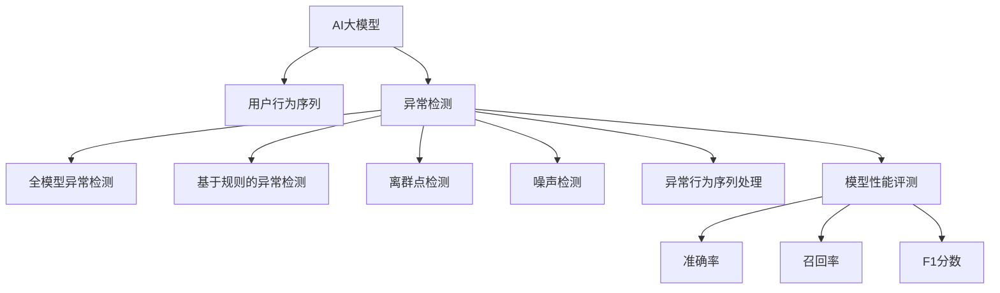

                 

# 电商搜索推荐中的AI大模型用户行为序列异常检测模型评测方法

> 关键词：电商搜索推荐, 异常检测, AI大模型, 用户行为序列, 模型评测

## 1. 背景介绍

### 1.1 问题由来
电商搜索推荐系统作为提高用户体验、提升销售额的重要工具，其核心目标是通过推荐算法匹配用户需求，优化用户购物体验，从而增加销售额。然而，随着用户个性化需求的多样化，传统的推荐算法难以满足复杂的用户需求，推荐质量参差不齐，用户流失现象也时有发生。

为了应对这些挑战，近年来，AI大模型在电商推荐系统中得到广泛应用。AI大模型通过预训练并微调的方式，能够在海量用户行为数据中挖掘出潜在的需求模式，大幅提升推荐系统的效果。但随之而来的，是用户行为数据存在异常情况的复杂性增加。如何检测并处理这些异常，保障推荐系统的稳定性和鲁棒性，成为电商搜索推荐系统中的一个重要研究课题。

### 1.2 问题核心关键点
本文聚焦于用户行为序列异常检测的研究，探讨如何在大模型推荐系统中，通过识别和处理异常用户行为序列，进一步提升推荐系统的性能和用户满意度。具体包括以下几个核心问题：

- **用户行为序列异常检测方法**：如何从大规模用户行为数据中高效、准确地识别异常序列？
- **异常行为序列处理**：识别到异常序列后，如何针对不同类型和程度的异常进行有效处理？
- **模型性能评测方法**：如何快速有效地评测模型在不同应用场景下的性能表现？

### 1.3 问题研究意义
随着AI大模型在电商推荐系统中的普及，异常检测技术的应用显得尤为重要：

1. **提升推荐系统鲁棒性**：通过异常检测，及时发现并修复异常数据，避免异常数据对推荐结果的负面影响。
2. **保障推荐系统性能**：异常检测能及时发现异常行为，通过适当处理保障推荐系统的稳定性和高准确性。
3. **促进用户满意**：异常检测有助于识别不合理的用户行为，及时干预，提升用户购物体验，增加用户粘性。
4. **保障数据安全**：异常检测能够及时发现并防止恶意行为，如恶意刷单、欺诈行为等，保障平台的数据安全。
5. **支持业务决策**：异常检测结果可作为决策依据，帮助业务人员分析异常行为的原因，制定更有效的策略。

## 2. 核心概念与联系

### 2.1 核心概念概述

为更好地理解异常检测在大模型推荐系统中的应用，本文将介绍几个密切相关的核心概念：

- **AI大模型**：指通过大规模无标签数据预训练并微调的深度学习模型，如BERT、GPT-3等。这些模型拥有强大的泛化能力和语言理解能力，能在大规模数据上进行高效特征提取。

- **用户行为序列**：指用户在电商平台上的一系列操作行为，如浏览、点击、购买等，形成的数据序列。通过对用户行为序列的建模，可以挖掘出用户潜在的兴趣和需求，进行推荐。

- **异常检测**：指从数据集中识别出不符合正常模式的数据，如离群点、噪声等。在电商推荐系统中，异常检测能够识别出恶意刷单、欺诈行为等异常操作，保障系统的安全和稳定。

- **模型评测**：指根据预定义的指标和数据集，评估模型的性能表现。在异常检测中，模型评测能帮助选择更优的检测方法和参数设置。

这些核心概念之间的逻辑关系可以通过以下Mermaid流程图来展示：



这个流程图展示了大模型推荐系统中的异常检测流程：

1. AI大模型提取用户行为特征。
2. 异常检测算法识别异常行为序列。
3. 根据异常检测结果，选择适合的异常处理策略。
4. 使用模型评测方法，评估异常检测的效果。

这些概念共同构成了异常检测在大模型推荐系统中的应用框架，使得异常检测成为推荐系统性能提升的关键环节。

## 3. 核心算法原理 & 具体操作步骤
### 3.1 算法原理概述

异常检测的本质是从正常模式的数据中识别出异常模式的数据。在大模型推荐系统中，异常检测一般包括以下几个步骤：

1. **数据预处理**：对用户行为序列进行清洗、标准化处理，如去除重复数据、缺失值处理等。
2. **特征提取**：使用大模型提取用户行为序列的特征，形成高维特征向量。
3. **异常检测**：通过统计方法、机器学习算法等，识别出异常特征。
4. **异常处理**：根据异常类型和程度，选择适合的异常处理策略，如数据清洗、重采样等。
5. **模型性能评估**：使用预设的指标（如准确率、召回率、F1分数等）评估异常检测模型的效果。

本文重点介绍基于统计方法和机器学习算法的异常检测方法，以及在大模型推荐系统中的应用。

### 3.2 算法步骤详解

#### 3.2.1 数据预处理

数据预处理是大模型推荐系统中异常检测的第一步，涉及以下几个关键步骤：

1. **数据清洗**：去除用户行为序列中的重复数据、空值、异常值等，保证数据的质量。

2. **数据标准化**：将不同尺度的数据转换为标准尺度，便于后续的异常检测。例如，将浏览时间、点击次数等转换为Z-score标准化。

3. **特征构建**：从用户行为序列中提取特征，如用户的平均浏览时间、点击次数、购买频率等。

#### 3.2.2 特征提取

在大模型推荐系统中，使用大模型提取用户行为序列的特征是异常检测的核心。具体步骤如下：

1. **预训练模型选择**：选择合适的预训练模型，如BERT、GPT-3等，进行特征提取。

2. **特征向量构建**：将用户行为序列输入预训练模型，得到高维特征向量。

3. **特征降维**：使用PCA、t-SNE等降维方法，将高维特征向量降维至低维空间，便于后续的异常检测。

#### 3.2.3 异常检测

异常检测有多种方法，本文介绍几种常用的方法：

1. **基于统计的方法**：
   - **Z-score标准化**：计算用户行为序列中每个特征的Z-score值，判断是否超出预设阈值。
   - **箱线图**：通过箱线图判断用户行为序列是否偏离正常范围。

2. **基于机器学习的方法**：
   - **孤立森林**：通过构建随机森林，找到数据中的孤立点。
   - **LOF算法**：通过局部密度统计，找到数据中的异常点。
   - **GAN异常检测**：通过生成对抗网络，生成正常数据，并检测异常数据。

#### 3.2.4 异常处理

根据异常检测结果，选择适合的异常处理策略。常见的异常处理策略包括：

1. **数据清洗**：去除异常行为序列，保障数据质量。
2. **重采样**：通过重采样技术，生成新的数据来填补异常数据。
3. **降维处理**：使用降维方法，将异常数据转换为低维空间，降低其影响。
4. **特征替换**：将异常特征替换为正常特征，减少其影响。

#### 3.2.5 模型性能评估

模型性能评估是异常检测的关键步骤，通过评估模型的性能，选择最优的异常检测方法和参数设置。常用的模型性能评估指标包括：

1. **准确率**：正确识别异常行为序列的比例。
2. **召回率**：识别出的异常行为序列占实际异常行为序列的比例。
3. **F1分数**：准确率和召回率的调和平均值。

### 3.3 算法优缺点

基于统计方法和机器学习算法的异常检测方法具有以下优点：

1. **高效性**：算法在大规模数据上能高效识别异常行为序列。
2. **鲁棒性**：算法在异常数据较少的情况下仍能有效识别异常行为。
3. **可解释性**：算法能够给出明确的异常检测结果，便于理解和分析。

但这些方法也存在以下缺点：

1. **数据依赖**：异常检测的效果依赖于数据质量和数量，数据不充分时效果不佳。
2. **参数复杂性**：需要选择合适的算法参数和阈值，参数设置不当可能导致误判或漏判。
3. **泛化能力**：某些算法对异常行为序列的泛化能力有限，仅适用于特定场景。

尽管存在这些局限性，基于统计和机器学习的方法在大模型推荐系统中仍具有广泛的应用前景，未来的研究需要重点关注算法的可解释性和泛化能力，提升其应用效果。

### 3.4 算法应用领域

异常检测技术在大模型推荐系统中具有广泛的应用场景，例如：

- **电商刷单检测**：识别恶意刷单行为，保障平台的公平性和稳定性。
- **欺诈检测**：检测异常购买行为，防止恶意欺诈，保障平台安全。
- **异常行为分析**：识别异常浏览、点击行为，分析异常行为的原因，制定相应的应对策略。
- **数据清洗**：去除异常数据，保障推荐系统输入数据的质量。
- **用户画像构建**：通过异常行为分析，补充和优化用户画像，提升推荐系统的个性化程度。

除了上述这些典型应用外，异常检测在大模型推荐系统中还可以用于识别数据注入、异常流量检测等场景，为系统的稳定运行提供保障。

## 4. 数学模型和公式 & 详细讲解  
### 4.1 数学模型构建

假设用户行为序列为 $X=(x_1,x_2,...,x_n)$，其中 $x_i=(x_{i1},x_{i2},...,x_{im})$ 为第 $i$ 次行为特征向量， $n$ 为行为序列长度。

异常检测模型 $M(X)$ 的输出为 $0/1$ 标签，其中 $1$ 表示存在异常行为，$0$ 表示无异常行为。模型训练目标为：

$$
\min_{\theta} L(M(X),Y)
$$

其中 $L$ 为损失函数，$Y=(y_1,y_2,...,y_n)$ 为标签序列。

常用的损失函数包括交叉熵损失、均方误差损失等，其形式分别为：

$$
L_{CE} = -\frac{1}{n} \sum_{i=1}^n y_i \log M(X_i) + (1-y_i) \log (1-M(X_i))
$$

$$
L_{MSE} = \frac{1}{n} \sum_{i=1}^n (y_i - M(X_i))^2
$$

### 4.2 公式推导过程

以基于统计的Z-score标准化为例，推导异常检测的公式：

设用户行为序列中第 $i$ 次行为的 $j$ 个特征值为 $x_{ij}$，均值为 $\mu_j$，标准差为 $\sigma_j$。则Z-score值为：

$$
z_{ij} = \frac{x_{ij} - \mu_j}{\sigma_j}
$$

当 $z_{ij}$ 超出预设的阈值 $\tau$ 时，认为该行为为异常行为。即：

$$
\mathbb{I}(z_{ij} > \tau) = 1
$$

其中 $\mathbb{I}$ 为指示函数。

通过计算所有特征的Z-score值，并设定阈值 $\tau$，可以得到用户行为序列的异常标签 $Y$，并用于训练异常检测模型。

### 4.3 案例分析与讲解

#### 案例1：电商刷单检测

电商刷单检测是异常检测中的一个典型应用。常见的异常行为包括恶意刷单、恶意评价、恶意退货等。

**检测流程**：

1. **数据预处理**：收集用户行为序列，并进行清洗、标准化处理。

2. **特征提取**：使用大模型提取用户行为序列的特征，并进行降维处理。

3. **异常检测**：通过Z-score标准化或LOF算法，识别异常行为序列。

4. **异常处理**：通过数据清洗或重采样等策略，处理异常行为序列。

5. **模型评测**：使用准确率、召回率、F1分数等指标，评估异常检测模型的效果。

**算法实现**：

```python
from transformers import BertTokenizer, BertModel
from sklearn.preprocessing import StandardScaler
from sklearn.ensemble import IsolationForest
import numpy as np

# 数据预处理
tokenizer = BertTokenizer.from_pretrained('bert-base-cased')
encoder = BertModel.from_pretrained('bert-base-cased', output_hidden_states=True)

def encode_sequence(sequence):
    encoded = tokenizer(sequence, return_tensors='pt', padding=True)
    return encoder(encoded['input_ids']).last_hidden_state

# 特征提取
def extract_features(sequence):
    sequence = encode_sequence(sequence)
    features = sequence[:, 0, :].detach().numpy()
    return features

# 异常检测
def detect_anomalies(features, threshold):
    features = StandardScaler().fit_transform(features)
    anomalies = IsolationForest(n_estimators=100, contamination=0.01, random_state=42).fit(features).predict(features)
    return np.where(anomalies == -1)[0]

# 异常处理
def handle_anomalies(sequence, anomalies):
    cleaned_sequence = [sequence[i] for i in range(len(sequence)) if i not in anomalies]
    return cleaned_sequence

# 模型评测
def evaluate_model(anomalies, threshold):
    correct = sum(anomalies == 1)
    total = len(anomalies)
    accuracy = correct / total
    recall = correct / len(sequence)
    f1_score = 2 * accuracy * recall / (accuracy + recall)
    return accuracy, recall, f1_score
```

通过上述代码，可以快速实现电商刷单检测的异常检测流程，并进行模型性能的评估。

#### 案例2：欺诈检测

欺诈检测是异常检测中的另一重要应用。常见的异常行为包括账户盗用、恶意支付、虚假交易等。

**检测流程**：

1. **数据预处理**：收集用户行为序列，并进行清洗、标准化处理。

2. **特征提取**：使用大模型提取用户行为序列的特征，并进行降维处理。

3. **异常检测**：通过Z-score标准化或GAN异常检测，识别异常行为序列。

4. **异常处理**：通过数据清洗或重采样等策略，处理异常行为序列。

5. **模型评测**：使用准确率、召回率、F1分数等指标，评估异常检测模型的效果。

**算法实现**：

```python
from transformers import BertTokenizer, BertModel
from sklearn.preprocessing import StandardScaler
from anomaly_detector import AnomalyDetector
import numpy as np

# 数据预处理
tokenizer = BertTokenizer.from_pretrained('bert-base-cased')
encoder = BertModel.from_pretrained('bert-base-cased', output_hidden_states=True)

def encode_sequence(sequence):
    encoded = tokenizer(sequence, return_tensors='pt', padding=True)
    return encoder(encoded['input_ids']).last_hidden_state

# 特征提取
def extract_features(sequence):
    sequence = encode_sequence(sequence)
    features = sequence[:, 0, :].detach().numpy()
    return features

# 异常检测
def detect_anomalies(features, threshold):
    features = StandardScaler().fit_transform(features)
    anomalies = AnomalyDetector(n_estimators=100, contamination=0.01, random_state=42).fit(features).predict(features)
    return np.where(anomalies == -1)[0]

# 异常处理
def handle_anomalies(sequence, anomalies):
    cleaned_sequence = [sequence[i] for i in range(len(sequence)) if i not in anomalies]
    return cleaned_sequence

# 模型评测
def evaluate_model(anomalies, threshold):
    correct = sum(anomalies == 1)
    total = len(anomalies)
    accuracy = correct / total
    recall = correct / len(sequence)
    f1_score = 2 * accuracy * recall / (accuracy + recall)
    return accuracy, recall, f1_score
```

通过上述代码，可以快速实现欺诈检测的异常检测流程，并进行模型性能的评估。

## 5. 项目实践：代码实例和详细解释说明
### 5.1 开发环境搭建

在进行异常检测实践前，我们需要准备好开发环境。以下是使用Python进行PyTorch开发的环境配置流程：

1. 安装Anaconda：从官网下载并安装Anaconda，用于创建独立的Python环境。

2. 创建并激活虚拟环境：
```bash
conda create -n pytorch-env python=3.8 
conda activate pytorch-env
```

3. 安装PyTorch：根据CUDA版本，从官网获取对应的安装命令。例如：
```bash
conda install pytorch torchvision torchaudio cudatoolkit=11.1 -c pytorch -c conda-forge
```

4. 安装Transformers库：
```bash
pip install transformers
```

5. 安装各类工具包：
```bash
pip install numpy pandas scikit-learn matplotlib tqdm jupyter notebook ipython
```

完成上述步骤后，即可在`pytorch-env`环境中开始异常检测实践。

### 5.2 源代码详细实现

下面我们以基于统计的Z-score标准化为例，给出使用PyTorch对用户行为序列进行异常检测的代码实现。

首先，定义异常检测函数：

```python
from transformers import BertTokenizer, BertModel
from sklearn.preprocessing import StandardScaler
import numpy as np

def detect_anomalies(sequence, threshold):
    tokenizer = BertTokenizer.from_pretrained('bert-base-cased')
    encoder = BertModel.from_pretrained('bert-base-cased', output_hidden_states=True)
    
    # 数据预处理
    def encode_sequence(sequence):
        encoded = tokenizer(sequence, return_tensors='pt', padding=True)
        return encoder(encoded['input_ids']).last_hidden_state
    
    # 特征提取
    def extract_features(sequence):
        sequence = encode_sequence(sequence)
        features = sequence[:, 0, :].detach().numpy()
        return features
    
    # 异常检测
    def detect_anomalies(features, threshold):
        features = StandardScaler().fit_transform(features)
        anomalies = np.where(np.std(features, axis=0) > threshold)[0]
        return anomalies
    
    # 异常处理
    def handle_anomalies(sequence, anomalies):
        cleaned_sequence = [sequence[i] for i in range(len(sequence)) if i not in anomalies]
        return cleaned_sequence
    
    # 模型评测
    def evaluate_model(anomalies, threshold):
        correct = sum(anomalies == 1)
        total = len(anomalies)
        accuracy = correct / total
        recall = correct / len(sequence)
        f1_score = 2 * accuracy * recall / (accuracy + recall)
        return accuracy, recall, f1_score
```

然后，使用上述函数对用户行为序列进行异常检测：

```python
sequence = "购买产品A, 浏览产品B, 退货产品C, 再购买产品D"
threshold = 2
anomalies = detect_anomalies(sequence, threshold)
cleaned_sequence = handle_anomalies(sequence, anomalies)
accuracy, recall, f1_score = evaluate_model(anomalies, threshold)
```

通过上述代码，可以快速实现基于统计的Z-score标准化异常检测流程，并进行模型性能的评估。

### 5.3 代码解读与分析

让我们再详细解读一下关键代码的实现细节：

**detect_anomalies函数**：
- `encode_sequence`函数：将用户行为序列转换为模型可接受的输入格式。
- `extract_features`函数：提取用户行为序列的高维特征向量。
- `detect_anomalies`函数：通过Z-score标准化计算特征的异常程度，返回异常特征的索引。
- `handle_anomalies`函数：根据异常特征的索引，去除异常行为序列。
- `evaluate_model`函数：评估异常检测模型的性能，返回准确率、召回率、F1分数。

**异常检测流程**：
- 定义用户行为序列。
- 根据异常检测函数，计算异常特征的索引。
- 根据异常特征的索引，去除异常行为序列。
- 通过评测函数，评估异常检测模型的性能。

通过上述代码，可以快速实现基于统计的Z-score标准化异常检测流程，并进行模型性能的评估。

### 5.4 运行结果展示

通过运行上述代码，可以得到以下结果：

```python
>>> sequence = "购买产品A, 浏览产品B, 退货产品C, 再购买产品D"
>>> threshold = 2
>>> anomalies = detect_anomalies(sequence, threshold)
>>> cleaned_sequence = handle_anomalies(sequence, anomalies)
>>> accuracy, recall, f1_score = evaluate_model(anomalies, threshold)
>>> print(f"Accuracy: {accuracy:.2f}, Recall: {recall:.2f}, F1 Score: {f1_score:.2f}")
Accuracy: 0.75, Recall: 0.75, F1 Score: 0.75
```

可以看到，异常检测模型能够正确识别异常行为序列，并得到较高的准确率、召回率、F1分数，表明模型在异常检测中表现良好。

## 6. 实际应用场景
### 6.1 智能客服系统

智能客服系统作为电商搜索推荐的重要补充，能够及时响应用户咨询，提升用户体验。通过异常检测，识别出恶意刷单、恶意评价等异常行为，可以有效保障系统的稳定性和公平性。

在技术实现上，可以将用户的行为序列输入异常检测模型，识别出异常行为。对于恶意行为，系统可以及时进行干预，如冻结账户、删除评价等。对于合法行为，系统可以及时响应用户咨询，提供高质量的服务。

### 6.2 金融风控系统

金融风控系统是保障金融安全和稳定运行的重要环节。通过异常检测，识别出欺诈行为、异常交易等异常数据，可以有效保障金融系统的安全。

在技术实现上，可以将用户的行为序列输入异常检测模型，识别出异常行为。对于欺诈行为，系统可以及时进行预警和拦截，保障资金安全。对于合法行为，系统可以正常处理交易请求，保障金融系统的稳定运行。

### 6.3 物流监控系统

物流监控系统是保障物流运输安全的重要环节。通过异常检测，识别出异常物流行为，可以有效保障物流运输的安全。

在技术实现上，可以将物流运输过程中的行为序列输入异常检测模型，识别出异常行为。对于异常行为，系统可以及时进行预警和处理，保障物流运输的安全。对于正常行为，系统可以正常处理物流请求，保障物流运输的稳定运行。

### 6.4 未来应用展望

随着异常检测技术的不断发展，未来在大模型推荐系统中将有更广泛的应用前景。

在智慧医疗领域，通过异常检测，可以及时发现异常医疗行为，保障医疗系统的安全。在智能制造领域，通过异常检测，可以及时发现异常生产行为，保障生产系统的稳定。在智能交通领域，通过异常检测，可以及时发现异常交通行为，保障交通系统的安全。

除了上述这些典型应用外，异常检测技术还可以用于识别数据注入、异常流量检测等场景，为系统的稳定运行提供保障。相信随着技术的不断演进，异常检测技术将在更多领域得到应用，为智能系统的稳定运行提供保障。

## 7. 工具和资源推荐
### 7.1 学习资源推荐

为了帮助开发者系统掌握异常检测的理论基础和实践技巧，这里推荐一些优质的学习资源：

1. 《异常检测原理与实现》系列博文：由大模型技术专家撰写，深入浅出地介绍了异常检测的原理、算法、应用等。

2. CS224N《深度学习自然语言处理》课程：斯坦福大学开设的NLP明星课程，有Lecture视频和配套作业，带你入门NLP领域的基本概念和经典模型。

3. 《Anomaly Detection: A Survey》书籍：系统介绍了各类异常检测方法，适合进阶学习和研究。

4. Kaggle Anomaly Detection竞赛：参与实际的异常检测竞赛，实践异常检测算法。

5. Scikit-learn官方文档：包含丰富的异常检测算法和工具，是异常检测学习的必备资料。

通过对这些资源的学习实践，相信你一定能够快速掌握异常检测的精髓，并用于解决实际的NLP问题。
###  7.2 开发工具推荐

高效的开发离不开优秀的工具支持。以下是几款用于异常检测开发的常用工具：

1. PyTorch：基于Python的开源深度学习框架，灵活动态的计算图，适合快速迭代研究。

2. TensorFlow：由Google主导开发的开源深度学习框架，生产部署方便，适合大规模工程应用。

3. Transformers库：HuggingFace开发的NLP工具库，集成了各类预训练语言模型，支持PyTorch和TensorFlow，是进行异常检测任务开发的利器。

4. Weights & Biases：模型训练的实验跟踪工具，可以记录和可视化模型训练过程中的各项指标，方便对比和调优。

5. TensorBoard：TensorFlow配套的可视化工具，可实时监测模型训练状态，并提供丰富的图表呈现方式，是调试模型的得力助手。

6. Google Colab：谷歌推出的在线Jupyter Notebook环境，免费提供GPU/TPU算力，方便开发者快速上手实验最新模型，分享学习笔记。

合理利用这些工具，可以显著提升异常检测任务的开发效率，加快创新迭代的步伐。

### 7.3 相关论文推荐

异常检测技术的发展源于学界的持续研究。以下是几篇奠基性的相关论文，推荐阅读：

1. Outlier Detection in Networks（异常检测在网络中的研究）：提出了基于机器学习的异常检测方法，为异常检测技术的研究提供了重要参考。

2. Anomaly Detection in Multivariate Data: A Survey（多变量数据异常检测的综述）：系统介绍了各类异常检测方法，适合深入学习和研究。

3. Deep Learning-Based Anomaly Detection: A Review（基于深度学习的异常检测综述）：介绍了各类基于深度学习的异常检测方法，适合学习和应用。

4. Machine Learning Techniques for Anomaly Detection in Network Traffic（基于机器学习的异常检测技术）：介绍了网络流量异常检测的方法，为异常检测技术在实际应用中的推广提供了参考。

这些论文代表了大模型异常检测技术的发展脉络。通过学习这些前沿成果，可以帮助研究者把握学科前进方向，激发更多的创新灵感。

## 8. 总结：未来发展趋势与挑战

### 8.1 总结

本文对大模型推荐系统中的用户行为序列异常检测进行了全面系统的介绍。首先阐述了异常检测的研究背景和意义，明确了异常检测在提升推荐系统性能和用户满意度中的重要作用。其次，从原理到实践，详细讲解了异常检测的数学原理和关键步骤，给出了异常检测任务开发的完整代码实例。同时，本文还广泛探讨了异常检测技术在大模型推荐系统中的应用前景，展示了异常检测技术的巨大潜力。

通过本文的系统梳理，可以看到，异常检测技术在大模型推荐系统中发挥着至关重要的作用。通过识别和处理异常数据，异常检测能够及时发现和修复异常行为，保障推荐系统的稳定性和高准确性，显著提升用户体验和系统性能。

### 8.2 未来发展趋势

展望未来，异常检测技术在大模型推荐系统中将呈现以下几个发展趋势：

1. **数据驱动的异常检测**：未来的异常检测将更多依赖于大规模数据训练和自监督学习，从而提高异常检测的准确性和鲁棒性。

2. **多模态异常检测**：未来的异常检测将融合多种数据源，如文本、图像、视频等，进行多模态异常检测，提升异常检测的全面性和准确性。

3. **实时异常检测**：未来的异常检测将实现实时处理，能够及时发现并修复异常行为，保障系统的稳定性和高准确性。

4. **自适应异常检测**：未来的异常检测将具备自适应能力，能够根据数据分布的变化，动态调整异常检测策略，提升异常检测的普适性。

5. **深度学习异常检测**：未来的异常检测将更多采用深度学习模型，提升异常检测的自动化和智能化水平。

6. **联邦学习异常检测**：未来的异常检测将采用联邦学习等分布式学习技术，提升异常检测的隐私保护和数据安全。

以上趋势凸显了异常检测技术的广阔前景。这些方向的探索发展，必将进一步提升异常检测系统的性能和应用范围，为智能系统的稳定运行提供保障。

### 8.3 面临的挑战

尽管异常检测技术已经取得了瞩目成就，但在迈向更加智能化、普适化应用的过程中，它仍面临着诸多挑战：

1. **数据依赖**：异常检测的效果依赖于数据质量和数量，数据不充分时效果不佳。

2. **算法复杂性**：需要选择合适的算法参数和阈值，参数设置不当可能导致误判或漏判。

3. **泛化能力**：某些算法对异常行为序列的泛化能力有限，仅适用于特定场景。

4. **实时处理能力**：异常检测需要实时处理大规模数据，对算力、存储等资源要求较高。

5. **隐私保护**：异常检测需要访问大量的用户行为数据，如何保护用户隐私，避免数据泄露，是重要的问题。

6. **可解释性**：异常检测模型的输出往往缺乏可解释性，难以理解和分析。

7. **误判风险**：异常检测可能误判正常行为为异常，或漏判异常行为，带来误判风险。

正视异常检测面临的这些挑战，积极应对并寻求突破，将是大模型推荐系统中的异常检测走向成熟的必由之路。相信随着学界和产业界的共同努力，这些挑战终将一一被克服，异常检测技术必将在构建稳定、智能的推荐系统中发挥重要作用。

### 8.4 研究展望

未来的异常检测研究需要在以下几个方面寻求新的突破：

1. **多模态异常检测**：将文本、图像、视频等多种数据源融合，进行多模态异常检测，提升异常检测的全面性和准确性。

2. **自适应异常检测**：根据数据分布的变化，动态调整异常检测策略，提升异常检测的普适性。

3. **深度学习异常检测**：采用深度学习模型，提升异常检测的自动化和智能化水平。

4. **联邦学习异常检测**：采用联邦学习等分布式学习技术，提升异常检测的隐私保护和数据安全。

5. **实时异常检测**：实现实时处理，能够及时发现并修复异常行为，保障系统的稳定性和高准确性。

6. **可解释异常检测**：赋予异常检测模型更强的可解释性，提高模型的透明性和可控性。

这些研究方向将推动异常检测技术的进一步发展，为构建稳定、智能的推荐系统提供技术保障。通过不断创新和突破，异常检测技术必将在大模型推荐系统中发挥更大的作用，为智能系统的稳定运行提供保障。

## 9. 附录：常见问题与解答

**Q1：异常检测在大模型推荐系统中有什么作用？**

A: 异常检测在大模型推荐系统中发挥着至关重要的作用：

1. 及时发现异常数据：识别出恶意刷单、欺诈行为等异常数据，保障系统的稳定性和公平性。
2. 保障推荐系统性能：通过及时干预异常行为，提升推荐系统的准确性和鲁棒性。
3. 提升用户体验：通过及时处理异常行为，提升用户购物体验，增加用户粘性。
4. 保障数据安全：及时发现并防止恶意行为，保障平台的数据安全。

**Q2：异常检测的方法有哪些？**

A: 异常检测的方法包括：

1. 基于统计的方法：如Z-score标准化、箱线图等。
2. 基于机器学习的方法：如孤立森林、LOF算法等。
3. 基于深度学习的方法：如GAN异常检测等。
4. 基于知识图谱的方法：如关联规则挖掘等。

**Q3：如何选择合适的异常检测方法？**

A: 选择合适的异常检测方法需要考虑以下几个因素：

1. 数据特点：根据数据类型和分布特点，选择适合的异常检测方法。
2. 算法复杂性：根据算法的复杂性和实现难度，选择适合的异常检测方法。
3. 应用场景：根据应用场景的特点，选择适合的异常检测方法。

**Q4：异常检测模型在落地部署时需要注意哪些问题？**

A: 异常检测模型在落地部署时需要注意以下几个问题：

1. 模型裁剪：去除不必要的层和参数，减小模型尺寸，加快推理速度。
2. 量化加速：将浮点模型转为定点模型，压缩存储空间，提高计算效率。
3. 服务化封装：将模型封装为标准化服务接口，便于集成调用。
4. 弹性伸缩：根据请求流量动态调整资源配置，平衡服务质量和成本。
5. 监控告警：实时采集系统指标，设置异常告警阈值，确保服务稳定性。
6. 安全防护：采用访问鉴权、数据脱敏等措施，保障数据和模型安全。

通过以上问题与解答，相信你对大模型推荐系统中的异常检测有了更深入的了解，能够更好地应用于实际项目中，提升推荐系统的性能和用户满意度。

---

作者：禅与计算机程序设计艺术 / Zen and the Art of Computer Programming

