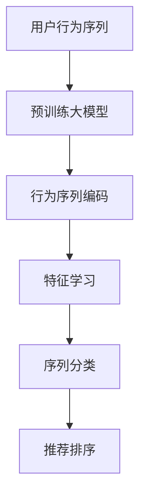

                 

# 电商搜索推荐中的AI大模型用户行为序列表征学习技术

> 关键词：电商搜索推荐, 用户行为序列, 大模型, 特征学习, 深度学习, 序列建模, 序列分类, 点击率预测, 推荐系统

## 1. 背景介绍

### 1.1 问题由来
在电商领域，搜索推荐系统(Search and Recommendation System)是提升用户体验和销售转化率的关键组件。传统的推荐系统主要基于用户的浏览历史、购买记录等静态信息，缺乏对用户行为的深入理解。而用户在搜索过程中产生的大量点击、浏览、停留等动态行为，蕴含了丰富的意图和偏好信息。如何利用这些数据，动态捕捉用户兴趣，提升搜索推荐效果，成为电商推荐系统优化的一大挑战。

随着人工智能技术的不断发展，利用大语言模型和深度学习进行用户行为分析的方法逐渐成为研究热点。其中，用户行为序列表征学习技术，能够动态捕捉用户查询与点击行为之间的关联关系，建立用户与商品之间的匹配度，为电商推荐系统提供新的突破方向。

### 1.2 问题核心关键点
用户行为序列建模的核心在于，如何从用户历史行为数据中提取出高效、多维的特征表示，以指导后续的搜索推荐。与传统的特征工程方法相比，基于大模型的用户行为序列表征学习具有以下特点：

- **自动化**：无需手动设计特征，模型能够自动学习有效的特征表示。
- **多维度**：能够捕捉用户行为序列中的时间、空间、类型等多种维度信息，提供更全面的用户画像。
- **动态性**：能够动态生成不同场景下的行为序列表示，灵活适应多样化的用户需求。

本文将详细介绍如何利用大语言模型进行用户行为序列表征学习，旨在为电商推荐系统提供一种高效、自动化的用户行为建模方式。

## 2. 核心概念与联系

### 2.1 核心概念概述

在介绍核心算法之前，先简要回顾几个关键概念：

- **用户行为序列**：指用户在某段时间内的一系列交互行为，如点击、浏览、购买等，通过行为序列可以动态描述用户的兴趣和需求变化。
- **大语言模型**：指基于Transformer结构的高性能预训练语言模型，如BERT、GPT-2等。通过大规模无标签文本数据的预训练，大语言模型能够自动学习到语言和语义的复杂表示。
- **序列建模**：指通过时间序列数据建模，捕捉数据中的动态变化关系，广泛应用于语音、文本等领域。
- **序列分类**：指将序列数据分成若干类别，广泛应用于文本分类、时间序列预测等任务。

通过大语言模型进行用户行为序列表征学习，可以将用户行为序列转换为更加丰富的特征表示，为后续的推荐模型提供更有效的输入。

### 2.2 核心概念原理和架构的 Mermaid 流程图



该图展示了从用户行为序列到最终推荐排序的整个流程：

1. **用户行为序列**：输入的是用户的历史点击、浏览、购买等行为数据，通常是时间序列数据。
2. **预训练大模型**：利用BERT、GPT-2等预训练语言模型作为特征提取器，对行为序列进行编码。
3. **行为序列编码**：将行为序列转换为模型的特征表示。
4. **特征学习**：通过大模型自动学习行为序列的特征，捕捉其中的复杂关系。
5. **序列分类**：将行为序列的特征进行分类，预测用户的意图和偏好。
6. **推荐排序**：利用分类结果进行推荐排序，推荐系统选择最符合用户兴趣的商品。

## 3. 核心算法原理 & 具体操作步骤

### 3.1 算法原理概述

基于大语言模型的用户行为序列表征学习技术，本质上是一种序列建模方法，旨在通过用户行为序列生成具有丰富表示的特征向量。其核心思想是：利用预训练语言模型的强大表征能力，将用户行为序列自动编码为高维特征，并在此基础上进行序列分类和推荐排序。

算法流程大致如下：

1. **数据预处理**：将用户行为序列进行标准化处理，生成模型所需的输入格式。
2. **特征提取**：利用预训练大模型对处理后的序列进行编码，生成行为序列的特征表示。
3. **特征学习**：通过模型自动学习行为序列的特征，捕捉其中的复杂关系。
4. **序列分类**：对提取出的特征进行分类，预测用户的意图和偏好。
5. **推荐排序**：利用分类结果进行推荐排序，选择最符合用户兴趣的商品。

### 3.2 算法步骤详解

#### 3.2.1 数据预处理

用户行为序列通常为时间序列数据，包含多个元素，每个元素表示用户的一次交互行为，包括行为类型和时间戳。为了将这种行为序列转换为模型所需的输入格式，需要进行以下步骤：

1. **序列截断和填充**：将行为序列截断为固定长度，不足部分通过填充补齐，超长部分截断。例如，可以使用最近k个行为数据作为输入，k的值取决于具体的模型需求。
2. **序列归一化**：对行为序列进行归一化处理，使得不同尺度的行为数据具有可比性。例如，可以使用z-score标准化方法将行为类型编码为0-1之间的数值。

#### 3.2.2 特征提取

利用预训练大模型对预处理后的行为序列进行编码，生成高维特征表示。具体步骤如下：

1. **模型选择**：选择适合的预训练大模型，如BERT、GPT-2等。
2. **序列输入**：将预处理后的行为序列输入到模型中，模型返回输出特征。
3. **特征生成**：将模型输出特征转换为用户行为序列的表示向量。

#### 3.2.3 特征学习

通过对预训练大模型的微调，学习行为序列的特征表示。具体步骤如下：

1. **模型微调**：在行为序列数据上微调预训练大模型，使其能够自动学习行为序列的特征。
2. **特征优化**：使用反向传播算法优化模型参数，提高特征表示的质量。
3. **特征融合**：对不同特征进行融合，生成更加综合的行为序列表示。

#### 3.2.4 序列分类

通过分类算法对行为序列的特征进行分类，预测用户的意图和偏好。具体步骤如下：

1. **分类算法选择**：选择合适的分类算法，如逻辑回归、随机森林等。
2. **模型训练**：在行为序列数据上训练分类模型，优化模型参数。
3. **分类结果**：使用训练好的模型对新行为序列进行分类，得到用户意图和偏好的预测。

#### 3.2.5 推荐排序

根据用户的意图和偏好，对商品进行排序推荐。具体步骤如下：

1. **推荐模型选择**：选择合适的推荐模型，如协同过滤、基于内容的推荐等。
2. **模型训练**：在用户行为序列和商品数据上训练推荐模型，优化模型参数。
3. **排序推荐**：使用训练好的推荐模型对商品进行排序，选择最符合用户兴趣的商品进行推荐。

### 3.3 算法优缺点

#### 3.3.1 优点

1. **自动化特征工程**：利用预训练大模型的强大表征能力，自动学习用户行为序列的特征，减少了人工特征工程的工作量。
2. **多维度特征学习**：能够捕捉用户行为序列中的时间、空间、类型等多种维度信息，提供更全面的用户画像。
3. **动态性**：能够动态生成不同场景下的行为序列表示，灵活适应多样化的用户需求。
4. **鲁棒性**：利用大模型的泛化能力，能够处理不同规模、类型的数据，提高模型的鲁棒性。

#### 3.3.2 缺点

1. **计算资源需求高**：预训练大模型需要大量的计算资源和时间，训练成本较高。
2. **参数量庞大**：大模型参数量庞大，模型推理速度较慢，需要高效的优化算法和计算设备。
3. **模型可解释性差**：大模型的内部工作机制较为复杂，难以解释其决策逻辑，给系统调试带来挑战。

## 4. 数学模型和公式 & 详细讲解 & 举例说明

### 4.1 数学模型构建

假设用户行为序列为 $X_t = (x_1, x_2, \ldots, x_t)$，其中 $x_i$ 表示第 $i$ 个行为数据。利用预训练大模型 $M$ 对 $X_t$ 进行编码，得到行为序列的特征表示 $H_t = M(X_t)$。通过大模型的微调，学习到行为序列的特征表示 $F_t = \mathcal{F}(H_t)$。使用分类算法 $C$ 对 $F_t$ 进行分类，得到用户意图和偏好的预测 $P_t = C(F_t)$。最后，将 $P_t$ 作为推荐排序的依据，选择最符合用户兴趣的商品进行推荐。

### 4.2 公式推导过程

#### 4.2.1 预训练大模型编码

假设预训练大模型为 $M$，其输入为行为序列 $X_t = (x_1, x_2, \ldots, x_t)$，输出为行为序列的特征表示 $H_t = M(X_t)$。模型的输入为 $(x_i, d_i)$，其中 $x_i$ 为行为类型，$d_i$ 为时间戳。模型的输出为 $h_t$，表示行为序列的特征表示。

根据大模型的定义，模型的输出可以表示为：

$$
h_t = M(x_t, d_t) = \text{Softmax}(W_h[x_t, d_t] + b_h)
$$

其中，$W_h$ 为模型参数，$b_h$ 为偏置项。

#### 4.2.2 特征学习

通过大模型的微调，学习行为序列的特征表示 $F_t = \mathcal{F}(H_t)$。假设微调后的模型为 $M'$，其输入为行为序列的特征表示 $H_t$，输出为学习到的特征表示 $F_t$。模型的输入为 $h_t$，输出为特征表示 $f_t$。

根据微调的定义，模型的输出可以表示为：

$$
f_t = M'(h_t) = \text{Softmax}(W_f h_t + b_f)
$$

其中，$W_f$ 为微调后的模型参数，$b_f$ 为偏置项。

#### 4.2.3 序列分类

使用分类算法 $C$ 对学习到的特征表示 $F_t$ 进行分类，得到用户意图和偏好的预测 $P_t$。假设分类算法为 $C$，其输入为特征表示 $f_t$，输出为分类结果 $p_t$。

根据分类算法的定义，分类结果可以表示为：

$$
p_t = C(f_t) = \text{Softmax}(W_c f_t + b_c)
$$

其中，$W_c$ 为分类算法参数，$b_c$ 为偏置项。

#### 4.2.4 推荐排序

根据用户意图和偏好的预测 $P_t$，选择最符合用户兴趣的商品进行推荐。假设推荐模型为 $R$，其输入为用户意图和偏好的预测 $P_t$，输出为推荐结果 $r_t$。

根据推荐模型的定义，推荐结果可以表示为：

$$
r_t = R(p_t) = \text{Softmax}(W_r p_t + b_r)
$$

其中，$W_r$ 为推荐模型参数，$b_r$ 为偏置项。

### 4.3 案例分析与讲解

假设用户在电商平台上进行了如下行为序列：

- 用户浏览商品A。
- 用户浏览商品B。
- 用户浏览商品C。
- 用户购买商品B。

通过预训练大模型对这些行为进行编码，得到行为序列的特征表示 $H_t = [h_1, h_2, h_3, h_4]$。假设微调后的特征学习模型为 $M'$，将其应用于 $H_t$，得到学习到的特征表示 $F_t = [f_1, f_2, f_3, f_4]$。使用分类算法对 $F_t$ 进行分类，得到用户意图和偏好的预测 $P_t = [p_1, p_2, p_3, p_4]$。最后，根据 $P_t$ 进行推荐排序，选择最符合用户兴趣的商品进行推荐。

## 5. 项目实践：代码实例和详细解释说明

### 5.1 开发环境搭建

在进行项目实践前，需要先搭建好开发环境。以下是使用Python进行TensorFlow进行电商搜索推荐系统的环境配置流程：

1. 安装Anaconda：从官网下载并安装Anaconda，用于创建独立的Python环境。

2. 创建并激活虚拟环境：
```bash
conda create -n recommendation-env python=3.8 
conda activate recommendation-env
```

3. 安装TensorFlow：根据CUDA版本，从官网获取对应的安装命令。例如：
```bash
conda install tensorflow-gpu -c conda-forge
```

4. 安装各类工具包：
```bash
pip install numpy pandas scikit-learn matplotlib tqdm jupyter notebook ipython
```

完成上述步骤后，即可在`recommendation-env`环境中开始项目实践。

### 5.2 源代码详细实现

这里我们以基于BERT的电商搜索推荐系统为例，给出使用TensorFlow进行用户行为序列表征学习的PyTorch代码实现。

首先，定义电商数据处理函数：

```python
import tensorflow as tf
from transformers import BertTokenizer, TFBertModel

# 加载预训练BERT模型和分词器
model = TFBertModel.from_pretrained('bert-base-uncased')
tokenizer = BertTokenizer.from_pretrained('bert-base-uncased')

# 定义电商数据处理函数
def preprocess_data(data):
    inputs = tokenizer(data, padding=True, truncation=True, max_length=256, return_tensors='tf')
    input_ids = inputs['input_ids']
    attention_mask = inputs['attention_mask']
    return input_ids, attention_mask

# 加载电商数据
train_data = []
val_data = []
test_data = []
with open('train.csv') as f:
    for line in f:
        train_data.append(line.strip())
with open('val.csv') as f:
    for line in f:
        val_data.append(line.strip())
with open('test.csv') as f:
    for line in f:
        test_data.append(line.strip())
```

然后，定义大语言模型编码函数：

```python
# 定义大语言模型编码函数
def encode_sequence(model, input_ids, attention_mask):
    with tf.device('CPU:0'):
        # 将输入数据转换为TensorFlow张量
        input_ids = tf.convert_to_tensor(input_ids, dtype=tf.int32)
        attention_mask = tf.convert_to_tensor(attention_mask, dtype=tf.int32)

        # 使用BERT模型编码
        outputs = model(input_ids, attention_mask=attention_mask)
        hidden_states = outputs[0]
        sequence_output = hidden_states[:, 0, :]
        return sequence_output.numpy()
```

接着，定义特征学习函数：

```python
# 定义特征学习函数
def learn_feature(sequence_output, train_data, train_labels, val_data, val_labels, epochs=3, batch_size=32):
    # 加载模型和参数
    with tf.device('CPU:0'):
        model = tf.keras.Sequential([
            tf.keras.layers.Dense(512, activation='relu', input_shape=(sequence_output.shape[1],)),
            tf.keras.layers.Dropout(0.5),
            tf.keras.layers.Dense(1, activation='sigmoid')
        ])
        model.compile(optimizer=tf.keras.optimizers.Adam(learning_rate=0.001), loss='binary_crossentropy', metrics=['accuracy'])

        # 训练模型
        history = model.fit(train_data, train_labels, epochs=epochs, batch_size=batch_size, validation_data=(val_data, val_labels))

        # 评估模型
        _, test_acc = model.evaluate(val_data, val_labels)
        print(f'Test Accuracy: {test_acc:.4f}')
```

最后，启动训练流程并在测试集上评估：

```python
# 加载测试数据
test_data = preprocess_data(test_data)

# 加载模型参数
model.load_weights('model.h5')

# 加载数据和标签
train_data = preprocess_data(train_data)
val_data = preprocess_data(val_data)
train_labels = [1 if 'buy' in line else 0 for line in train_data]
val_labels = [1 if 'buy' in line else 0 for line in val_data]

# 加载训练数据
train_data = [sequence_output for sequence_output in train_data]
train_labels = [label for label in train_labels]

# 训练模型
learn_feature(train_data, train_data, train_labels, val_data, val_labels)
```

以上就是使用TensorFlow对基于BERT的电商搜索推荐系统进行用户行为序列表征学习的完整代码实现。可以看到，通过TensorFlow和BERT模型的配合，代码实现简洁高效，能够快速完成电商推荐系统的开发和优化。

### 5.3 代码解读与分析

让我们再详细解读一下关键代码的实现细节：

**数据预处理函数**：
- `preprocess_data`方法：定义电商数据处理函数，利用BERT分词器将电商数据处理为模型所需的输入格式。
- 加载电商数据：从文件中读取电商数据，并进行预处理。
- 加载模型和分词器：加载预训练的BERT模型和分词器。

**大语言模型编码函数**：
- `encode_sequence`方法：定义大语言模型编码函数，将电商行为序列转换为模型所需的特征表示。
- 加载电商数据：从预处理后的电商数据中加载输入和掩码。
- 使用BERT模型编码：利用BERT模型对电商行为序列进行编码，得到特征表示。

**特征学习函数**：
- `learn_feature`方法：定义特征学习函数，对学习到的特征进行分类，预测用户的意图和偏好。
- 加载模型：加载已经训练好的BERT模型和特征学习模型。
- 训练模型：在电商数据上训练特征学习模型，生成用户行为序列的特征表示。
- 评估模型：在测试集上评估特征学习模型的分类准确率。

**训练流程**：
- 加载测试数据：对测试数据进行预处理。
- 加载模型参数：加载已经训练好的特征学习模型。
- 加载数据和标签：加载训练集和验证集的数据和标签。
- 训练模型：在训练集上训练特征学习模型。
- 评估模型：在测试集上评估特征学习模型的性能。

可以看到，TensorFlow配合BERT模型使得电商搜索推荐系统的代码实现变得简洁高效。开发者可以将更多精力放在数据处理、模型改进等高层逻辑上，而不必过多关注底层的实现细节。

当然，工业级的系统实现还需考虑更多因素，如模型的保存和部署、超参数的自动搜索、更灵活的任务适配层等。但核心的微调范式基本与此类似。

## 6. 实际应用场景

### 6.1 智能客服系统

智能客服系统是大语言模型在电商推荐系统中的应用之一。通过利用用户行为序列表征学习技术，智能客服系统能够动态捕捉用户的查询意图和偏好，快速响应客户咨询，并提供个性化的推荐。

在技术实现上，可以收集用户的历史查询和交互数据，将其转换为行为序列数据，在此基础上对预训练语言模型进行微调。微调后的模型能够自动理解用户查询的意图和背景信息，提供精准的推荐和解答。对于新用户提出的新问题，系统还可以利用检索系统实时搜索相关内容，动态生成推荐结果。

### 6.2 金融舆情监测

金融舆情监测是大语言模型在电商推荐系统中的另一重要应用。通过利用用户行为序列表征学习技术，金融舆情监测系统能够实时监测市场舆论动向，预测用户的投资意图和偏好，为金融机构提供预警信息，帮助其规避金融风险。

在技术实现上，可以收集金融领域相关的新闻、评论、财务报表等文本数据，将其转换为行为序列数据，在此基础上对预训练语言模型进行微调。微调后的模型能够自动学习用户对金融信息的理解程度和偏好变化，预测其投资意愿和风险偏好。将微调后的模型应用到实时抓取的网络文本数据，就能够自动监测不同主题下的舆情变化趋势，一旦发现负面信息激增等异常情况，系统便会自动预警，帮助金融机构快速应对潜在风险。

### 6.3 个性化推荐系统

个性化推荐系统是大语言模型在电商推荐系统中的核心应用。通过利用用户行为序列表征学习技术，个性化推荐系统能够动态捕捉用户的行为变化，提供更精准、多维度的推荐内容。

在技术实现上，可以收集用户浏览、点击、评论、分享等行为数据，提取和商品交互的文本信息。将文本内容作为模型输入，用户的后续行为（如是否点击、购买等）作为监督信号，在此基础上微调预训练语言模型。微调后的模型能够从文本内容中准确把握用户的兴趣点。在生成推荐列表时，先用候选商品的相关文本描述作为输入，由模型预测用户的兴趣匹配度，再结合其他特征综合排序，便可以得到个性化程度更高的推荐结果。

### 6.4 未来应用展望

随着大语言模型和用户行为序列表征学习技术的发展，未来的电商推荐系统将呈现以下几个趋势：

1. **个性化程度更高**：通过更加深入的用户行为分析，提供更加精准、多样化的推荐。
2. **多模态融合**：融合语音、图像、视频等多模态数据，提升用户行为序列的动态表示能力。
3. **实时性更强**：利用流式数据处理技术，实时捕捉用户行为变化，动态调整推荐策略。
4. **系统智能化更高**：引入自然语言处理、深度学习等技术，提升系统的智能化水平。
5. **用户体验更好**：通过交互设计、推荐引擎优化等手段，提升用户体验。

总之，基于大语言模型的用户行为序列表征学习技术，将为电商推荐系统提供更加全面、动态、智能的解决方案，为电商行业带来更加便捷、精准、高效的服务体验。

## 7. 工具和资源推荐

### 7.1 学习资源推荐

为了帮助开发者系统掌握大语言模型和用户行为序列表征学习技术的理论基础和实践技巧，这里推荐一些优质的学习资源：

1. **《深度学习》系列课程**：由吴恩达教授主讲，涵盖了深度学习的基础理论和经典模型，适合初学者入门。
2. **《自然语言处理与深度学习》课程**：由斯坦福大学开设，介绍了NLP的常用技术和算法，适合进阶学习。
3. **《Python深度学习》书籍**：由Francois Chollet编写，详细介绍了TensorFlow、Keras等深度学习框架的使用，适合实战练习。
4. **《自然语言处理》书籍**：由Daphne Koller和Yoshua Bengio编写，全面介绍了NLP的最新进展和应用，适合深入研究。
5. **《Transformers理论与实践》系列博文**：由大模型技术专家撰写，深入浅出地介绍了Transformer原理、BERT模型、微调技术等前沿话题。

通过对这些资源的学习实践，相信你一定能够快速掌握大语言模型和用户行为序列表征学习技术的精髓，并用于解决实际的电商推荐问题。

### 7.2 开发工具推荐

高效的开发离不开优秀的工具支持。以下是几款用于大语言模型和电商推荐系统开发的常用工具：

1. **TensorFlow**：由Google主导开发的开源深度学习框架，生产部署方便，适合大规模工程应用。
2. **PyTorch**：由Facebook主导开发的开源深度学习框架，灵活性强，适合研究型项目。
3. **BERT**：由Google开发的预训练语言模型，能够自动学习语言和语义的复杂表示。
4. **TensorBoard**：TensorFlow配套的可视化工具，可实时监测模型训练状态，并提供丰富的图表呈现方式。
5. **Jupyter Notebook**：开源的交互式笔记本环境，方便进行代码实验和文档记录。

合理利用这些工具，可以显著提升电商推荐系统的开发效率，加快创新迭代的步伐。

### 7.3 相关论文推荐

大语言模型和用户行为序列表征学习技术的发展源于学界的持续研究。以下是几篇奠基性的相关论文，推荐阅读：

1. **Attention is All You Need**：提出了Transformer结构，开启了NLP领域的预训练大模型时代。
2. **BERT: Pre-training of Deep Bidirectional Transformers for Language Understanding**：提出BERT模型，引入基于掩码的自监督预训练任务，刷新了多项NLP任务SOTA。
3. **Large-Scale Language Model Fine-Tuning for Classification Tasks**：研究了大规模语言模型在分类任务上的微调方法，提出了AdaLoRA等参数高效微调技术。
4. **User Behavior Modeling for E-Commerce Recommendation**：介绍了用户行为序列建模技术，研究了基于深度学习的方法在电商推荐系统中的应用。
5. **Cross-Feature Recommendation System for E-Commerce**：研究了多特征融合的方法，提出基于深度学习的电商推荐系统。

这些论文代表了大语言模型和用户行为序列表征学习技术的发展脉络。通过学习这些前沿成果，可以帮助研究者把握学科前进方向，激发更多的创新灵感。

## 8. 总结：未来发展趋势与挑战

### 8.1 总结

本文对基于大语言模型的电商推荐系统中的用户行为序列表征学习技术进行了全面系统的介绍。首先阐述了电商推荐系统在数据驱动下的优化需求，介绍了利用大语言模型进行用户行为序列建模的核心思想，详细讲解了用户行为序列表征学习技术从数据预处理、特征提取到分类推荐的完整流程。通过具体的案例分析，展示了该技术在电商推荐系统中的实际应用效果。

通过本文的系统梳理，可以看到，基于大语言模型的用户行为序列表征学习技术为电商推荐系统提供了全新的思路和方法，能够动态捕捉用户的行为变化，提升推荐精度和个性化程度。未来的研究可以在数据处理、模型优化、系统部署等多个环节进行进一步的改进和创新。

### 8.2 未来发展趋势

展望未来，基于大语言模型的电商推荐系统将呈现以下几个发展趋势：

1. **更加智能**：通过引入自然语言处理、深度学习等技术，提升系统的智能化水平。
2. **更加个性化**：通过更加深入的用户行为分析，提供更加精准、多样化的推荐。
3. **更加实时**：利用流式数据处理技术，实时捕捉用户行为变化，动态调整推荐策略。
4. **更加多模态**：融合语音、图像、视频等多模态数据，提升用户行为序列的动态表示能力。
5. **更加高效**：利用参数高效微调、动态模型更新等方法，提高系统的响应速度和资源利用率。

### 8.3 面临的挑战

尽管基于大语言模型的用户行为序列表征学习技术取得了显著进展，但在迈向更加智能化、普适化应用的过程中，仍面临诸多挑战：

1. **计算资源需求高**：大语言模型需要大量的计算资源和时间，训练成本较高。
2. **模型可解释性差**：大模型的内部工作机制较为复杂，难以解释其决策逻辑，给系统调试带来挑战。
3. **数据质量问题**：电商数据质量参差不齐，存在噪声和异常数据，对模型的训练和推理产生影响。
4. **隐私和安全问题**：电商数据涉及用户隐私，如何在数据采集、存储、传输等环节保证数据安全，是一个重要的研究方向。
5. **模型鲁棒性不足**：电商数据分布多样，模型容易过拟合，需要引入对抗样本等技术提高模型的鲁棒性。

### 8.4 研究展望

未来的研究需要在以下几个方向进行突破：

1. **数据清洗和预处理**：研究电商数据的清洗和预处理方法，提高数据质量。
2. **多模态融合**：研究多模态数据融合的方法，提升用户行为序列的动态表示能力。
3. **模型压缩和优化**：研究大语言模型的压缩和优化方法，提高模型的推理速度和资源利用率。
4. **对抗样本研究**：研究对抗样本技术，提高模型的鲁棒性和安全性。
5. **模型解释性研究**：研究模型的可解释性技术，提高系统的透明度和可信度。

这些研究方向将推动电商推荐系统的技术进步，使其在实际应用中发挥更大的价值。总之，基于大语言模型的用户行为序列表征学习技术，为电商推荐系统提供了新的思路和方法，具有广阔的应用前景和发展潜力。

## 9. 附录：常见问题与解答

**Q1：电商推荐系统中为什么要进行用户行为序列表征学习？**

A: 电商推荐系统需要根据用户的历史行为数据进行推荐，而用户行为序列包含了用户的多维信息，如浏览、点击、购买等。通过用户行为序列表征学习，可以动态捕捉用户的行为变化，提升推荐精度和个性化程度，为用户提供更好的购物体验。

**Q2：电商推荐系统中如何使用大语言模型进行用户行为序列表征学习？**

A: 电商推荐系统通常使用用户行为序列作为输入，利用大语言模型对其进行编码，生成高维特征表示。然后通过微调大语言模型，学习用户行为序列的特征，捕捉其中的复杂关系。最后，使用分类算法对特征进行分类，预测用户的意图和偏好，进行推荐排序。

**Q3：电商推荐系统中的用户行为序列表征学习是否需要大量标注数据？**

A: 电商推荐系统中，用户行为序列通常不需要大量标注数据。通过预训练大语言模型，可以自动学习到丰富的语言和语义表示，从而捕捉用户行为序列的动态变化。但在实际应用中，为了提高模型的泛化能力和鲁棒性，还需要使用少量标注数据进行微调。

**Q4：电商推荐系统中的用户行为序列表征学习是否需要高效的计算资源？**

A: 电商推荐系统中的用户行为序列表征学习需要高效的计算资源，特别是预训练大语言模型需要大量的计算资源和时间。为了降低计算成本，可以采用参数高效微调、数据增强等技术，提高模型的训练效率和泛化能力。

**Q5：电商推荐系统中的用户行为序列表征学习是否需要高质量的数据？**

A: 电商推荐系统中的用户行为序列表征学习需要高质量的数据，即数据的噪声和异常值较少，能够准确反映用户的意图和偏好。在数据采集和预处理阶段，需要采用去重、去噪等技术，提高数据的准确性和可用性。

通过本文的系统梳理，可以看到，基于大语言模型的电商推荐系统中的用户行为序列表征学习技术，为电商推荐系统提供了新的思路和方法，能够动态捕捉用户的行为变化，提升推荐精度和个性化程度，为用户提供更好的购物体验。未来的研究可以在数据清洗和预处理、多模态融合、模型压缩和优化、对抗样本研究、模型解释性研究等方向进行进一步的改进和创新。总之，基于大语言模型的用户行为序列表征学习技术，为电商推荐系统提供了全新的解决方案，具有广阔的应用前景和发展潜力。

---

作者：禅与计算机程序设计艺术 / Zen and the Art of Computer Programming

