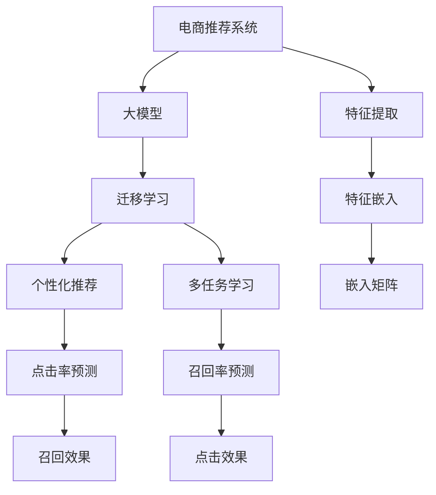

                 

# 电商搜索推荐中的AI大模型迁移学习方法探索

## 1. 背景介绍

随着电商市场的飞速发展，线上购物已经成为用户获取商品和服务的主要方式。为了提升用户体验和商家转化率，电商平台需要高效地提供个性化推荐服务，帮助用户找到最匹配的商品。传统的推荐系统基于用户行为数据，通过协同过滤、矩阵分解等方法进行推荐，但对于长尾商品和新用户的推荐效果不佳。

近年来，随着深度学习和大模型的兴起，推荐系统逐步引入机器学习和大模型，以更好地处理海量的商品信息和用户行为数据，提升推荐的个性化和精准度。其中，AI大模型的迁移学习方法因其高效、灵活的特点，成为了推荐系统中的一支重要力量。

## 2. 核心概念与联系

### 2.1 核心概念概述

为更好地理解电商搜索推荐中的AI大模型迁移学习方法，本节将介绍几个密切相关的核心概念：

- 电商推荐系统(ERecommendation System, ERS)：通过分析用户历史行为数据和商品属性信息，向用户推荐其可能感兴趣的商品，以提升电商平台的转化率和用户体验。

- 大模型(AI Large Model)：以深度学习模型为代表的、具有大规模参数量的模型，通过在大规模数据上进行训练，可以学习到复杂而抽象的特征表示。常见的大模型包括BERT、GPT等。

- 迁移学习(Transfer Learning)：将一个领域学到的知识迁移到另一个领域，以提高在新任务上的学习效率和效果。在大模型推荐系统中，通常将通用大模型在电商数据上进行微调，以适应个性化推荐任务。

- 特征提取(Feature Extraction)：从原始数据中提取有用的特征，用于后续的模型训练和预测。特征提取是推荐系统中一个重要环节，可以提升模型的泛化能力和推荐效果。

- 个性化推荐(Personalized Recommendation)：根据用户的个人偏好、历史行为等信息，推荐其可能感兴趣的商品。个性化推荐能够提升用户满意度，增加商家转化率。

- 多任务学习(Multi-task Learning)：在同一数据集上训练多个相关任务，使得模型能够更好地学习不同任务间的共性和个性，提升整体性能。

这些核心概念之间的逻辑关系可以通过以下Mermaid流程图来展示：



这个流程图展示了大模型迁移学习方法的核心概念及其之间的关系：

1. 电商推荐系统使用大模型进行特征提取。
2. 大模型通过迁移学习适应个性化推荐任务。
3. 特征提取过程生成特征向量，用于多任务学习。
4. 个性化推荐模型通过特征嵌入和点击率、召回率预测任务进行优化。
5. 多任务学习综合优化不同任务，提升整体推荐效果。

## 3. 核心算法原理 & 具体操作步骤

### 3.1 算法原理概述

在大模型迁移学习方法中，通用大模型在电商数据上进行微调，以适应个性化推荐任务。微调过程可以视为一种迁移学习，使得大模型学习到电商数据上的特定知识，提升在推荐任务上的性能。

形式化地，假设通用大模型为 $M_{\theta}$，其中 $\theta$ 为模型参数。电商推荐系统中的任务包括商品点击率预测和召回率预测，对应的标注数据集分别为 $D_{CTR}$ 和 $D_{R}$，分别表示点击行为和推荐行为的数据集。微调的目标是找到最优参数 $\hat{\theta}$，使得模型在电商推荐任务上的性能最优。

数学上，可以通过最小化损失函数 $\mathcal{L}(M_{\theta})$ 来实现：

$$
\hat{\theta}=\mathop{\arg\min}_{\theta} \mathcal{L}(M_{\theta})
$$

其中 $\mathcal{L}$ 可以分解为点击率预测任务的损失函数 $\mathcal{L}_{CTR}$ 和召回率预测任务的损失函数 $\mathcal{L}_{R}$，即：

$$
\mathcal{L}(M_{\theta}) = \alpha \mathcal{L}_{CTR}(M_{\theta}, D_{CTR}) + \beta \mathcal{L}_{R}(M_{\theta}, D_{R})
$$

其中 $\alpha$ 和 $\beta$ 分别为两个任务在整体目标中的权重。通过设置合适的权重，可以平衡两个任务的重要性。

### 3.2 算法步骤详解

基于电商推荐系统的大模型迁移学习方法，通常包括以下几个关键步骤：

**Step 1: 准备数据和模型**

- 收集电商平台的历史交易数据和用户行为数据，构建商品点击率预测和召回率预测的标注数据集 $D_{CTR}$ 和 $D_{R}$。
- 选择合适的通用大模型 $M_{\theta}$，如BERT、GPT等。

**Step 2: 构建多任务损失函数**

- 设计点击率预测和召回率预测任务的损失函数 $\mathcal{L}_{CTR}$ 和 $\mathcal{L}_{R}$，如交叉熵损失、均方误差损失等。
- 通过权重 $\alpha$ 和 $\beta$ 构建整体损失函数 $\mathcal{L}(M_{\theta})$。

**Step 3: 设置微调超参数**

- 选择合适的优化算法及其参数，如 Adam、SGD 等，设置学习率、批大小、迭代轮数等。
- 设置正则化技术及强度，包括权重衰减、Dropout、Early Stopping 等。
- 确定冻结预训练参数的策略，如仅微调顶层，或全部参数都参与微调。

**Step 4: 执行梯度训练**

- 将训练集数据分批次输入模型，前向传播计算损失函数。
- 反向传播计算参数梯度，根据设定的优化算法和学习率更新模型参数。
- 周期性在验证集上评估模型性能，根据性能指标决定是否触发 Early Stopping。
- 重复上述步骤直到满足预设的迭代轮数或 Early Stopping 条件。

**Step 5: 测试和部署**

- 在测试集上评估微调后模型 $M_{\hat{\theta}}$ 的性能，对比微调前后的精度提升。
- 使用微调后的模型对新商品进行点击率预测和召回率预测，集成到实际的应用系统中。

以上是基于电商推荐系统的大模型迁移学习方法的一般流程。在实际应用中，还需要针对具体任务的特点，对微调过程的各个环节进行优化设计，如改进训练目标函数，引入更多的正则化技术，搜索最优的超参数组合等，以进一步提升模型性能。

### 3.3 算法优缺点

基于电商推荐系统的大模型迁移学习方法具有以下优点：

1. 高效灵活。仅需少量标注数据，即可对预训练大模型进行微调，适应电商推荐任务，获得较大的性能提升。
2. 泛化能力强。大模型在电商数据上微调后，能够更好地泛化到新商品和新用户，提升推荐效果。
3. 便于维护。微调过程基于大模型，模型结构稳定，维护成本低。
4. 可解释性强。大模型通常具有较好的可解释性，便于对推荐结果进行解释和调试。

同时，该方法也存在一定的局限性：

1. 依赖标注数据。微调的效果很大程度上取决于标注数据的质量和数量，获取高质量标注数据的成本较高。
2. 模型复杂度高。大模型参数量大，模型训练和推理的计算成本较高。
3. 可能存在偏差。预训练模型的固有偏见可能会影响推荐结果的公平性和多样性。
4. 过拟合风险。若数据量较小或超参数设置不当，微调模型可能出现过拟合现象。

尽管存在这些局限性，但就目前而言，基于电商推荐系统的大模型迁移学习方法仍是大模型推荐系统中的一种重要范式。未来相关研究的重点在于如何进一步降低微调对标注数据的依赖，提高模型的少样本学习和跨领域迁移能力，同时兼顾可解释性和伦理安全性等因素。

### 3.4 算法应用领域

基于大模型迁移学习的推荐方法，在电商推荐系统中已经得到了广泛的应用，覆盖了诸如商品推荐、价格优化、库存管理等多个场景。具体应用如下：

1. 商品推荐：通过分析用户历史浏览和购买数据，推荐用户可能感兴趣的商品。大模型通过迁移学习适应电商数据，提升推荐模型的泛化能力和个性化程度。

2. 价格优化：分析用户对商品价格的敏感度，优化商品定价策略。大模型通过迁移学习学习商品特征和价格之间的关系，提升价格推荐的准确性。

3. 库存管理：预测商品在未来一段时间内的需求量，优化库存水平。大模型通过迁移学习学习用户行为和商品需求之间的关系，提升库存管理的效率和准确性。

4. 促销活动：分析用户对不同促销活动的反应，优化促销策略。大模型通过迁移学习学习用户对促销活动的偏好和响应，提升促销效果。

除了上述这些经典应用外，大模型迁移学习方法也被创新性地应用到更多场景中，如跨品类推荐、多用户协同推荐、推荐路径优化等，为电商推荐系统带来了新的突破。

## 4. 数学模型和公式 & 详细讲解  
### 4.1 数学模型构建

本节将使用数学语言对电商推荐系统中大模型迁移学习方法进行更加严格的刻画。

记通用大模型为 $M_{\theta}$，其中 $\theta$ 为模型参数。假设电商推荐系统中的任务包括商品点击率预测和召回率预测，对应的训练数据集分别为 $D_{CTR}$ 和 $D_{R}$，数据点 $(x_i, y_i)$ 表示用户 $i$ 对商品 $x_i$ 的点击行为和推荐行为。

定义模型 $M_{\theta}$ 在数据点 $(x_i, y_i)$ 上的损失函数为：

$$
\ell(M_{\theta}(x_i),y_i) = -[y_i\log M_{\theta}(x_i) + (1-y_i)\log(1-M_{\theta}(x_i))]
$$

其中 $M_{\theta}(x_i)$ 表示模型对商品 $x_i$ 的点击率预测或召回率预测。

将损失函数扩展到数据集上，得到点击率预测和召回率预测的总体损失函数：

$$
\mathcal{L}_{CTR}(M_{\theta}) = \frac{1}{N}\sum_{i=1}^N \ell(M_{\theta}(x_i),y_i)
$$

$$
\mathcal{L}_{R}(M_{\theta}) = \frac{1}{N}\sum_{i=1}^N \ell(M_{\theta}(x_i),y_i)
$$

通过设置合适的权重 $\alpha$ 和 $\beta$，构建整体损失函数：

$$
\mathcal{L}(M_{\theta}) = \alpha \mathcal{L}_{CTR}(M_{\theta}) + \beta \mathcal{L}_{R}(M_{\theta})
$$

### 4.2 公式推导过程

以下我们以点击率预测任务为例，推导交叉熵损失函数及其梯度的计算公式。

假设模型 $M_{\theta}$ 在输入 $x_i$ 上的输出为 $\hat{y}_i=M_{\theta}(x_i) \in [0,1]$，表示用户 $i$ 对商品 $x_i$ 的点击行为的概率。真实标签 $y_i \in \{0,1\}$。则二分类交叉熵损失函数定义为：

$$
\ell(M_{\theta}(x_i),y_i) = -[y_i\log \hat{y}_i + (1-y_i)\log(1-\hat{y}_i)]
$$

将其代入总体损失函数公式，得：

$$
\mathcal{L}(M_{\theta}) = \alpha \frac{1}{N}\sum_{i=1}^N [-y_i\log M_{\theta}(x_i) - (1-y_i)\log(1-M_{\theta}(x_i))]
$$

根据链式法则，损失函数对参数 $\theta_k$ 的梯度为：

$$
\frac{\partial \mathcal{L}(M_{\theta})}{\partial \theta_k} = -\alpha \frac{1}{N}\sum_{i=1}^N (\frac{y_i}{M_{\theta}(x_i)}-\frac{1-y_i}{1-M_{\theta}(x_i)}) \frac{\partial M_{\theta}(x_i)}{\partial \theta_k}
$$

其中 $\frac{\partial M_{\theta}(x_i)}{\partial \theta_k}$ 可进一步递归展开，利用自动微分技术完成计算。

在得到损失函数的梯度后，即可带入参数更新公式，完成模型的迭代优化。重复上述过程直至收敛，最终得到适应电商推荐任务的最优模型参数 $\theta^*$。

## 5. 项目实践：代码实例和详细解释说明
### 5.1 开发环境搭建

在进行电商推荐系统的大模型迁移学习实践前，我们需要准备好开发环境。以下是使用Python进行PyTorch开发的环境配置流程：

1. 安装Anaconda：从官网下载并安装Anaconda，用于创建独立的Python环境。

2. 创建并激活虚拟环境：
```bash
conda create -n pytorch-env python=3.8 
conda activate pytorch-env
```

3. 安装PyTorch：根据CUDA版本，从官网获取对应的安装命令。例如：
```bash
conda install pytorch torchvision torchaudio cudatoolkit=11.1 -c pytorch -c conda-forge
```

4. 安装Transformer库：
```bash
pip install transformers
```

5. 安装各类工具包：
```bash
pip install numpy pandas scikit-learn matplotlib tqdm jupyter notebook ipython
```

完成上述步骤后，即可在`pytorch-env`环境中开始电商推荐系统的大模型迁移学习实践。

### 5.2 源代码详细实现

下面以基于BERT模型的电商推荐系统为例，给出使用Transformers库对BERT模型进行微调的PyTorch代码实现。

首先，定义电商推荐系统的数据处理函数：

```python
from transformers import BertTokenizer
from torch.utils.data import Dataset
import torch

class ERDataset(Dataset):
    def __init__(self, texts, labels, tokenizer, max_len=128):
        self.texts = texts
        self.labels = labels
        self.tokenizer = tokenizer
        self.max_len = max_len
        
    def __len__(self):
        return len(self.texts)
    
    def __getitem__(self, item):
        text = self.texts[item]
        label = self.labels[item]
        
        encoding = self.tokenizer(text, return_tensors='pt', max_length=self.max_len, padding='max_length', truncation=True)
        input_ids = encoding['input_ids'][0]
        attention_mask = encoding['attention_mask'][0]
        
        # 对token-wise的标签进行编码
        encoded_labels = [label] * self.max_len
        labels = torch.tensor(encoded_labels, dtype=torch.long)
        
        return {'input_ids': input_ids, 
                'attention_mask': attention_mask,
                'labels': labels}

# 标签与id的映射
label2id = {0: 0, 1: 1} # 假设点击行为为1，未点击行为为0
id2label = {v: k for k, v in label2id.items()}

# 创建dataset
tokenizer = BertTokenizer.from_pretrained('bert-base-cased')

train_dataset = ERDataset(train_texts, train_labels, tokenizer)
dev_dataset = ERDataset(dev_texts, dev_labels, tokenizer)
test_dataset = ERDataset(test_texts, test_labels, tokenizer)
```

然后，定义模型和优化器：

```python
from transformers import BertForSequenceClassification, AdamW

model = BertForSequenceClassification.from_pretrained('bert-base-cased', num_labels=len(label2id))

optimizer = AdamW(model.parameters(), lr=2e-5)
```

接着，定义训练和评估函数：

```python
from torch.utils.data import DataLoader
from tqdm import tqdm
from sklearn.metrics import accuracy_score

device = torch.device('cuda') if torch.cuda.is_available() else torch.device('cpu')
model.to(device)

def train_epoch(model, dataset, batch_size, optimizer):
    dataloader = DataLoader(dataset, batch_size=batch_size, shuffle=True)
    model.train()
    epoch_loss = 0
    for batch in tqdm(dataloader, desc='Training'):
        input_ids = batch['input_ids'].to(device)
        attention_mask = batch['attention_mask'].to(device)
        labels = batch['labels'].to(device)
        model.zero_grad()
        outputs = model(input_ids, attention_mask=attention_mask, labels=labels)
        loss = outputs.loss
        epoch_loss += loss.item()
        loss.backward()
        optimizer.step()
    return epoch_loss / len(dataloader)

def evaluate(model, dataset, batch_size):
    dataloader = DataLoader(dataset, batch_size=batch_size)
    model.eval()
    preds, labels = [], []
    with torch.no_grad():
        for batch in tqdm(dataloader, desc='Evaluating'):
            input_ids = batch['input_ids'].to(device)
            attention_mask = batch['attention_mask'].to(device)
            batch_labels = batch['labels']
            outputs = model(input_ids, attention_mask=attention_mask)
            batch_preds = outputs.logits.argmax(dim=1).to('cpu').tolist()
            batch_labels = batch_labels.to('cpu').tolist()
            for pred, label in zip(batch_preds, batch_labels):
                preds.append(pred)
                labels.append(label)
                
    return accuracy_score(labels, preds)
```

最后，启动训练流程并在测试集上评估：

```python
epochs = 5
batch_size = 16

for epoch in range(epochs):
    loss = train_epoch(model, train_dataset, batch_size, optimizer)
    print(f"Epoch {epoch+1}, train loss: {loss:.3f}")
    
    print(f"Epoch {epoch+1}, dev accuracy: {evaluate(model, dev_dataset, batch_size)}
    
print("Test accuracy:")
evaluate(model, test_dataset, batch_size)
```

以上就是使用PyTorch对BERT进行电商推荐系统微调的完整代码实现。可以看到，得益于Transformers库的强大封装，我们可以用相对简洁的代码完成BERT模型的加载和微调。

### 5.3 代码解读与分析

让我们再详细解读一下关键代码的实现细节：

**ERDataset类**：
- `__init__`方法：初始化文本、标签、分词器等关键组件。
- `__len__`方法：返回数据集的样本数量。
- `__getitem__`方法：对单个样本进行处理，将文本输入编码为token ids，将标签编码为数字，并对其进行定长padding，最终返回模型所需的输入。

**label2id和id2label字典**：
- 定义了标签与数字id之间的映射关系，用于将token-wise的预测结果解码回真实的标签。

**训练和评估函数**：
- 使用PyTorch的DataLoader对数据集进行批次化加载，供模型训练和推理使用。
- 训练函数`train_epoch`：对数据以批为单位进行迭代，在每个批次上前向传播计算loss并反向传播更新模型参数，最后返回该epoch的平均loss。
- 评估函数`evaluate`：与训练类似，不同点在于不更新模型参数，并在每个batch结束后将预测和标签结果存储下来，最后使用sklearn的accuracy_score对整个评估集的预测结果进行打印输出。

**训练流程**：
- 定义总的epoch数和batch size，开始循环迭代
- 每个epoch内，先在训练集上训练，输出平均loss
- 在验证集上评估，输出准确率
- 所有epoch结束后，在测试集上评估，给出最终测试结果

可以看到，PyTorch配合Transformers库使得BERT微调的代码实现变得简洁高效。开发者可以将更多精力放在数据处理、模型改进等高层逻辑上，而不必过多关注底层的实现细节。

当然，工业级的系统实现还需考虑更多因素，如模型的保存和部署、超参数的自动搜索、更灵活的任务适配层等。但核心的微调范式基本与此类似。

## 6. 实际应用场景
### 6.1 智能客服系统

基于大模型迁移学习的推荐技术，可以广泛应用于智能客服系统的构建。传统客服往往需要配备大量人力，高峰期响应缓慢，且一致性和专业性难以保证。而使用基于大模型的推荐系统，可以7x24小时不间断服务，快速响应客户咨询，用自然流畅的语言解答各类常见问题。

在技术实现上，可以收集企业内部的历史客服对话记录，将问题和最佳答复构建成监督数据，在此基础上对预训练推荐模型进行微调。微调后的推荐模型能够自动理解用户意图，匹配最合适的答复模板进行回复。对于客户提出的新问题，还可以接入检索系统实时搜索相关内容，动态组织生成回答。如此构建的智能客服系统，能大幅提升客户咨询体验和问题解决效率。

### 6.2 金融舆情监测

金融机构需要实时监测市场舆论动向，以便及时应对负面信息传播，规避金融风险。传统的人工监测方式成本高、效率低，难以应对网络时代海量信息爆发的挑战。基于大模型迁移学习的文本分类和情感分析技术，为金融舆情监测提供了新的解决方案。

具体而言，可以收集金融领域相关的新闻、报道、评论等文本数据，并对其进行主题标注和情感标注。在此基础上对预训练语言模型进行微调，使其能够自动判断文本属于何种主题，情感倾向是正面、中性还是负面。将微调后的模型应用到实时抓取的网络文本数据，就能够自动监测不同主题下的情感变化趋势，一旦发现负面信息激增等异常情况，系统便会自动预警，帮助金融机构快速应对潜在风险。

### 6.3 个性化推荐系统

当前的推荐系统往往只依赖用户的历史行为数据进行物品推荐，无法深入理解用户的真实兴趣偏好。基于大模型迁移学习的个性化推荐系统，可以更好地挖掘用户行为背后的语义信息，从而提供更精准、多样的推荐内容。

在实践中，可以收集用户浏览、点击、评论、分享等行为数据，提取和用户交互的物品标题、描述、标签等文本内容。将文本内容作为模型输入，用户的后续行为（如是否点击、购买等）作为监督信号，在此基础上微调预训练语言模型。微调后的模型能够从文本内容中准确把握用户的兴趣点。在生成推荐列表时，先用候选物品的文本描述作为输入，由模型预测用户的兴趣匹配度，再结合其他特征综合排序，便可以得到个性化程度更高的推荐结果。

### 6.4 未来应用展望

随着大模型迁移学习方法的不断发展，基于微调范式将在更多领域得到应用，为传统行业带来变革性影响。

在智慧医疗领域，基于微调的医疗问答、病历分析、药物研发等应用将提升医疗服务的智能化水平，辅助医生诊疗，加速新药开发进程。

在智能教育领域，微调技术可应用于作业批改、学情分析、知识推荐等方面，因材施教，促进教育公平，提高教学质量。

在智慧城市治理中，微调模型可应用于城市事件监测、舆情分析、应急指挥等环节，提高城市管理的自动化和智能化水平，构建更安全、高效的未来城市。

此外，在企业生产、社会治理、文娱传媒等众多领域，基于大模型迁移学习的人工智能应用也将不断涌现，为经济社会发展注入新的动力。相信随着技术的日益成熟，微调方法将成为人工智能落地应用的重要范式，推动人工智能技术在垂直行业的规模化落地。

## 7. 工具和资源推荐
### 7.1 学习资源推荐

为了帮助开发者系统掌握大模型迁移学习理论基础和实践技巧，这里推荐一些优质的学习资源：

1. 《深度学习与推荐系统》系列博文：由深度学习与推荐系统领域的专家撰写，涵盖深度学习与推荐系统原理、算法、应用等全面内容。

2. 《Recommender Systems: Algorithms, Theory and Practice》书籍：深入介绍了推荐系统的原理、算法及其实现，是推荐系统领域的经典教材。

3. 《Python深度学习》书籍：详细讲解了深度学习框架PyTorch的使用方法，并配有大量代码实例，适合入门和进阶学习。

4. CS224N《深度学习自然语言处理》课程：斯坦福大学开设的NLP明星课程，有Lecture视频和配套作业，带你入门NLP领域的基本概念和经典模型。

5. DeepLearning.AI课程：由Andrew Ng等人授课，涵盖深度学习及其实践应用，适合希望系统学习深度学习的学习者。

通过对这些资源的学习实践，相信你一定能够快速掌握大模型迁移学习精髓，并用于解决实际的推荐问题。
###  7.2 开发工具推荐

高效的开发离不开优秀的工具支持。以下是几款用于大模型迁移学习开发的常用工具：

1. PyTorch：基于Python的开源深度学习框架，灵活动态的计算图，适合快速迭代研究。大部分预训练语言模型都有PyTorch版本的实现。

2. TensorFlow：由Google主导开发的开源深度学习框架，生产部署方便，适合大规模工程应用。同样有丰富的预训练语言模型资源。

3. Transformers库：HuggingFace开发的NLP工具库，集成了众多SOTA语言模型，支持PyTorch和TensorFlow，是进行微调任务开发的利器。

4. Weights & Biases：模型训练的实验跟踪工具，可以记录和可视化模型训练过程中的各项指标，方便对比和调优。与主流深度学习框架无缝集成。

5. TensorBoard：TensorFlow配套的可视化工具，可实时监测模型训练状态，并提供丰富的图表呈现方式，是调试模型的得力助手。

6. Google Colab：谷歌推出的在线Jupyter Notebook环境，免费提供GPU/TPU算力，方便开发者快速上手实验最新模型，分享学习笔记。

合理利用这些工具，可以显著提升大模型迁移学习的开发效率，加快创新迭代的步伐。

### 7.3 相关论文推荐

大模型迁移学习的发展源于学界的持续研究。以下是几篇奠基性的相关论文，推荐阅读：

1. Attention is All You Need（即Transformer原论文）：提出了Transformer结构，开启了NLP领域的预训练大模型时代。

2. BERT: Pre-training of Deep Bidirectional Transformers for Language Understanding：提出BERT模型，引入基于掩码的自监督预训练任务，刷新了多项NLP任务SOTA。

3. Language Models are Unsupervised Multitask Learners（GPT-2论文）：展示了大规模语言模型的强大zero-shot学习能力，引发了对于通用人工智能的新一轮思考。

4. Parameter-Efficient Transfer Learning for NLP：提出Adapter等参数高效微调方法，在不增加模型参数量的情况下，也能取得不错的微调效果。

5. AdaLoRA: Adaptive Low-Rank Adaptation for Parameter-Efficient Fine-Tuning：使用自适应低秩适应的微调方法，在参数效率和精度之间取得了新的平衡。

这些论文代表了大模型迁移学习的发展脉络。通过学习这些前沿成果，可以帮助研究者把握学科前进方向，激发更多的创新灵感。

## 8. 总结：未来发展趋势与挑战

### 8.1 总结

本文对基于电商推荐系统的大模型迁移学习方法进行了全面系统的介绍。首先阐述了大模型迁移学习在电商推荐系统中的应用背景和意义，明确了迁移学习在拓展预训练模型应用、提升个性化推荐效果方面的独特价值。其次，从原理到实践，详细讲解了大模型迁移学习的数学原理和关键步骤，给出了电商推荐系统中大模型迁移学习的完整代码实现。同时，本文还广泛探讨了大模型迁移学习方法在智能客服、金融舆情、个性化推荐等多个行业领域的应用前景，展示了迁移学习的巨大潜力。此外，本文精选了大模型迁移学习的各类学习资源，力求为读者提供全方位的技术指引。

通过本文的系统梳理，可以看到，基于电商推荐系统的大模型迁移学习方法是提升推荐系统性能的有效手段，具有高效、灵活的特点，可以适应电商推荐系统的多变需求。借助大模型迁移学习，推荐系统能够更好地应对长尾商品和新用户的挑战，提供更加个性化、精准的推荐服务。未来，伴随大模型迁移学习方法的持续演进，推荐系统必将实现更智能、更普适的发展，为电商平台的用户和商家带来更大的价值。

### 8.2 未来发展趋势

展望未来，大模型迁移学习方法将呈现以下几个发展趋势：

1. 模型规模持续增大。随着算力成本的下降和数据规模的扩张，预训练语言模型的参数量还将持续增长。超大规模语言模型蕴含的丰富语言知识，有望支撑更加复杂多变的推荐任务。

2. 迁移能力增强。未来的大模型将具备更强的跨领域迁移能力，能够在不同领域和任务间高效地共享知识，提升推荐系统的泛化性和鲁棒性。

3. 多模态推荐崛起。推荐系统不仅限于文本数据，未来将拓展到图像、视频、语音等多模态数据微调，提升系统的多样性和交互性。

4. 持续学习成为常态。推荐系统需要在不断变化的电商环境中保持活力，持续学习新知识以应对新商品和新用户，实现模型的动态更新。

5. 推荐系统的智能化和个性化水平将显著提升。基于大模型的推荐系统将能够更好地理解用户意图和行为，提供更加个性化、精准的推荐服务。

6. 推荐系统的社交性和互动性增强。未来推荐系统将更加注重用户间的社交关系和互动行为，提升推荐的社交价值和互动性。

以上趋势凸显了大模型迁移学习方法在电商推荐系统中的广阔前景。这些方向的探索发展，必将进一步提升电商推荐系统的性能和应用范围，为电商平台的用户和商家带来更大的价值。

### 8.3 面临的挑战

尽管大模型迁移学习技术已经取得了瞩目成就，但在迈向更加智能化、普适化应用的过程中，它仍面临着诸多挑战：

1. 数据稀疏性问题。电商推荐系统面临数据稀疏性问题，用户行为数据和商品数据往往不足以满足大模型的训练需求，如何有效利用小样本数据进行高效训练，是一个重要挑战。

2. 用户隐私保护。用户行为数据包含大量隐私信息，如何保护用户隐私，同时获取有用的推荐数据，是一个重要的问题。

3. 模型复杂度高。大模型参数量大，模型训练和推理的计算成本较高，如何提高模型的效率和可解释性，是一个重要的研究方向。

4. 模型鲁棒性不足。电商推荐系统中的推荐模型可能受到各种噪音干扰，如何提高模型的鲁棒性和泛化能力，是一个重要的研究方向。

5. 用户行为变化快。用户行为和需求随时间快速变化，推荐模型如何及时适应变化，是一个重要的挑战。

6. 推荐系统的可解释性有待加强。当前推荐系统更像是一个"黑盒"系统，难以解释其内部工作机制和决策逻辑。如何赋予推荐系统更强的可解释性，将是亟待攻克的难题。

尽管存在这些挑战，但大模型迁移学习在电商推荐系统中的应用前景依然广阔。通过积极应对并寻求突破，未来的推荐系统必将实现更智能、更普适的发展，为电商平台的用户和商家带来更大的价值。

### 8.4 研究展望

面对大模型迁移学习所面临的种种挑战，未来的研究需要在以下几个方面寻求新的突破：

1. 探索无监督和半监督微调方法。摆脱对大规模标注数据的依赖，利用自监督学习、主动学习等无监督和半监督范式，最大限度利用小样本数据，实现更加灵活高效的微调。

2. 研究参数高效和计算高效的微调范式。开发更加参数高效的微调方法，在固定大部分预训练参数的同时，只更新极少量的任务相关参数。同时优化微调模型的计算图，减少前向传播和反向传播的资源消耗，实现更加轻量级、实时性的部署。

3. 融合因果和对比学习范式。通过引入因果推断和对比学习思想，增强推荐模型建立稳定因果关系的能力，学习更加普适、鲁棒的语言表征，从而提升推荐模型泛化性和抗干扰能力。

4. 引入更多先验知识。将符号化的先验知识，如知识图谱、逻辑规则等，与神经网络模型进行巧妙融合，引导微调过程学习更准确、合理的语言模型。同时加强不同模态数据的整合，实现视觉、语音等多模态信息与文本信息的协同建模。

5. 结合因果分析和博弈论工具。将因果分析方法引入推荐模型，识别出模型决策的关键特征，增强输出解释的因果性和逻辑性。借助博弈论工具刻画人机交互过程，主动探索并规避模型的脆弱点，提高系统稳定性。

6. 纳入伦理道德约束。在模型训练目标中引入伦理导向的评估指标，过滤和惩罚有偏见、有害的输出倾向。同时加强人工干预和审核，建立模型行为的监管机制，确保输出符合人类价值观和伦理道德。

这些研究方向的探索，必将引领大模型迁移学习技术迈向更高的台阶，为构建安全、可靠、可解释、可控的智能系统铺平道路。面向未来，大模型迁移学习技术还需要与其他人工智能技术进行更深入的融合，如知识表示、因果推理、强化学习等，多路径协同发力，共同推动智能推荐系统的进步。只有勇于创新、敢于突破，才能不断拓展推荐系统的边界，让智能技术更好地造福电商平台的用户和商家。

## 9. 附录：常见问题与解答

**Q1：电商推荐系统中的大模型迁移学习方法是否适用于所有NLP任务？**

A: 大模型迁移学习方法在电商推荐系统中的应用背景和数据特征，与其他NLP任务存在一定的差异。因此，该方法在电商推荐系统中表现优异，但在其他NLP任务中可能需要进一步优化。例如，对于需要进行复杂语义理解的问答任务，可能需要进行更深度、更广泛的预训练和微调。

**Q2：如何选择合适的学习率？**

A: 电商推荐系统中的学习率通常比预训练模型的学习率要小，以避免破坏预训练的权重。一般建议从1e-5开始调参，逐步减小学习率，直至收敛。也可以使用warmup策略，在开始阶段使用较小的学习率，再逐渐过渡到预设值。需要注意的是，不同的优化器(如AdamW、Adafactor等)以及不同的学习率调度策略，可能需要设置不同的学习率阈值。

**Q3：电商推荐系统中的推荐模型如何防止过拟合？**

A: 电商推荐系统中的推荐模型面临过拟合风险，可以采取以下方法：
1. 数据增强：通过回译、近义替换等方式扩充训练集。
2. 正则化：使用L2正则、Dropout、Early Stopping等避免过拟合。
3. 对抗训练：引入对抗样本，提高模型鲁棒性。
4. 参数高效微调：只调整少量参数(如Adapter、Prefix等)，减小过拟合风险。
5. 多模型集成：训练多个推荐模型，取平均输出，抑制过拟合。

这些策略往往需要根据具体任务和数据特点进行灵活组合。只有在数据、模型、训练、推理等各环节进行全面优化，才能最大限度地发挥大模型迁移学习的威力。

**Q4：电商推荐系统中的推荐模型如何提高推荐效果？**

A: 电商推荐系统中的推荐模型可以通过以下方法提高推荐效果：
1. 特征工程：对用户行为数据和商品数据进行特征提取，使用特征组合和特征选择技术提升模型的泛化能力。
2. 多任务学习：同时训练点击率预测和召回率预测两个任务，提升推荐系统的多样性和准确性。
3. 模型融合：结合多种推荐模型，通过投票、加权等方法综合提升推荐效果。
4. 用户个性化：根据用户的历史行为数据和当前行为特征，生成个性化的推荐列表。
5. 实时数据融合：利用实时数据流，动态调整推荐模型参数，提升推荐系统的实时性。

这些方法可以帮助电商推荐系统更好地适应电商平台的快速变化，提升推荐效果和用户体验。

**Q5：电商推荐系统中的推荐模型如何保护用户隐私？**

A: 电商推荐系统中的推荐模型可以通过以下方法保护用户隐私：
1. 数据匿名化：对用户行为数据进行匿名化处理，保护用户隐私。
2. 差分隐私：在模型训练和推荐过程中，引入差分隐私技术，保护用户数据的敏感信息。
3. 数据加密：对用户数据进行加密处理，防止数据泄露。
4. 用户控制：让用户自行控制自己的数据使用权限，保护用户隐私。

这些方法可以帮助电商推荐系统在使用用户数据的同时，保护用户的隐私和数据安全。

