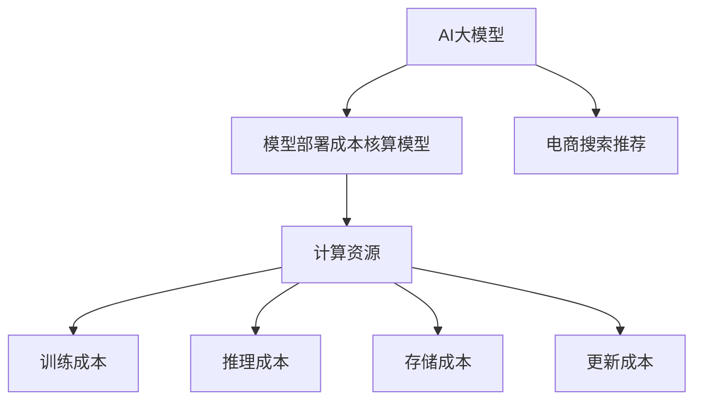

                 

# 电商搜索推荐场景下的AI大模型模型部署成本核算模型构建

## 1. 背景介绍

在现代电子商务的蓬勃发展下，个性化推荐系统已成为了支撑用户购物体验的关键技术之一。通过利用用户的历史行为数据和商品属性数据，推荐系统能够精准地为每个用户推荐他们感兴趣的商品，大幅提升用户满意度和转化率。然而，实现高效的个性化推荐，不仅依赖于算法的优化，还需要在模型部署上投入大量的计算资源。

随着AI技术的发展，大语言模型（如BERT、GPT-3等）在推荐系统中的应用也逐步兴起。大语言模型具有强大的自然语言处理能力，能够理解用户输入的自然语言描述，并将其转化为推荐请求。但由于其参数量巨大，模型训练和部署成本相对较高。因此，构建一个高效、低成本的电商搜索推荐场景下的AI大模型模型部署成本核算模型，对于电商企业的实际应用具有重要意义。

本文将深入探讨电商搜索推荐场景下，如何构建和部署AI大模型的模型部署成本核算模型，以期为电商企业提供一套具有实际参考价值的技术方案。

## 2. 核心概念与联系

### 2.1 核心概念概述

在电商搜索推荐场景下，构建AI大模型的部署成本核算模型，需要掌握以下核心概念：

- **AI大模型（AI Large Model）**：指基于深度学习原理，通过大量无标签数据进行预训练的大型神经网络模型，如BERT、GPT-3等。其参数量通常以亿计，在自然语言处理、图像识别、语音识别等领域具有广泛应用。
- **模型部署成本核算模型（Model Deployment Cost Accounting Model）**：用于计算和评估AI大模型在电商搜索推荐场景下部署成本的模型。该模型考虑了模型训练、推理、存储、更新等各个环节的成本，能够为企业的AI部署提供决策依据。
- **电商搜索推荐（E-Commerce Search and Recommendation）**：指在电商平台上，通过推荐算法为用户推荐符合其需求的商品，并通过搜索算法为用户提供快速准确的商品查找服务。该场景下，AI大模型可以用于生成自然语言查询的搜索结果，或根据用户描述生成商品推荐列表。
- **计算资源（Computational Resources）**：指用于AI大模型训练和推理的计算硬件，如GPU、TPU、FPGA等。

这些核心概念之间的逻辑关系可以通过以下Mermaid流程图来展示：



这个流程图展示了AI大模型、电商搜索推荐、计算资源以及模型部署成本核算模型之间的联系：

1. AI大模型是电商搜索推荐场景下推荐和搜索的核心模型。
2. 模型部署成本核算模型用于计算和评估AI大模型的各个环节成本，以指导模型的部署和使用。
3. 计算资源是AI大模型训练和推理所必需的硬件资源。
4. 计算资源的使用涉及训练成本、推理成本、存储成本和更新成本等各个方面。

## 3. 核心算法原理 & 具体操作步骤

### 3.1 算法原理概述

电商搜索推荐场景下的AI大模型部署成本核算模型，通过构建一个综合考虑训练、推理、存储和更新的成本计算框架，为电商企业的AI部署提供决策依据。其核心思想是将AI大模型在电商搜索推荐场景下的部署成本分解为多个维度，并根据实际应用需求，对每个维度的成本进行准确计算。

具体来说，模型部署成本核算模型分为以下四个步骤：

1. **训练成本计算**：计算AI大模型在电商搜索推荐场景下进行预训练所需的硬件资源和时间成本。
2. **推理成本计算**：计算AI大模型在电商搜索推荐场景下进行推理所需的硬件资源和时间成本。
3. **存储成本计算**：计算AI大模型在电商搜索推荐场景下进行存储所需的硬件资源和时间成本。
4. **更新成本计算**：计算AI大模型在电商搜索推荐场景下进行模型更新所需的硬件资源和时间成本。

### 3.2 算法步骤详解

#### 3.2.1 训练成本计算

训练成本计算主要考虑以下几个方面：

- **硬件资源**：包括计算单元（如GPU、TPU）、内存大小、带宽等。
- **时间成本**：包括训练时间、数据加载时间等。

训练成本计算公式如下：

$$
C_{train} = C_{hardware} \times T_{train}
$$

其中，$C_{hardware}$ 为训练所需的硬件成本，$T_{train}$ 为训练所需的总时间。

#### 3.2.2 推理成本计算

推理成本计算主要考虑以下几个方面：

- **硬件资源**：包括计算单元（如GPU、TPU）、内存大小、带宽等。
- **时间成本**：包括推理时间、数据加载时间等。

推理成本计算公式如下：

$$
C_{inference} = C_{hardware} \times T_{inference}
$$

其中，$C_{hardware}$ 为推理所需的硬件成本，$T_{inference}$ 为推理所需的总时间。

#### 3.2.3 存储成本计算

存储成本计算主要考虑以下几个方面：

- **硬件资源**：包括存储设备（如SSD、HDD）、带宽等。
- **时间成本**：包括数据写入时间和读取时间等。

存储成本计算公式如下：

$$
C_{storage} = C_{hardware} \times T_{storage}
$$

其中，$C_{hardware}$ 为存储所需的硬件成本，$T_{storage}$ 为存储所需的总时间。

#### 3.2.4 更新成本计算

更新成本计算主要考虑以下几个方面：

- **硬件资源**：包括计算单元（如GPU、TPU）、内存大小、带宽等。
- **时间成本**：包括更新时间、数据加载时间等。

更新成本计算公式如下：

$$
C_{update} = C_{hardware} \times T_{update}
$$

其中，$C_{hardware}$ 为更新所需的硬件成本，$T_{update}$ 为更新所需的总时间。

### 3.3 算法优缺点

电商搜索推荐场景下的AI大模型部署成本核算模型，具有以下优点：

- **全面覆盖**：考虑了模型训练、推理、存储和更新各个环节的成本，提供了一个全面的成本核算框架。
- **准确性高**：采用具体的硬件和时间成本计算公式，确保了成本核算的准确性。
- **可操作性强**：模型部署成本核算模型能够为企业提供实际的成本估算，帮助企业制定部署计划。

同时，该模型也存在以下缺点：

- **复杂度高**：需要考虑多个维度的成本，模型设计复杂。
- **数据需求高**：需要大量实际应用场景的数据，才能进行准确的成本核算。
- **计算量大**：每个维度的成本计算都需要耗费大量的计算资源。

### 3.4 算法应用领域

电商搜索推荐场景下的AI大模型部署成本核算模型，主要应用于以下几个领域：

- **电商企业**：帮助电商企业评估AI大模型部署的实际成本，制定合理的部署策略。
- **云服务提供商**：为云服务提供商提供AI大模型的成本核算服务，辅助其定价和市场推广。
- **研究机构**：为研究机构提供AI大模型成本核算的基准模型，促进模型性能评估和优化。

## 4. 数学模型和公式 & 详细讲解

### 4.1 数学模型构建

电商搜索推荐场景下的AI大模型部署成本核算模型，可以构建为一个四元组：

$$
\mathcal{M} = (C_{train}, C_{inference}, C_{storage}, C_{update})
$$

其中，$C_{train}$、$C_{inference}$、$C_{storage}$、$C_{update}$ 分别表示模型训练、推理、存储和更新的成本。

### 4.2 公式推导过程

#### 4.2.1 训练成本计算公式推导

训练成本计算公式可以进一步分解为：

$$
C_{train} = C_{hardware_{train}} \times T_{train} + C_{bandwidth_{train}} \times T_{train}
$$

其中，$C_{hardware_{train}}$ 表示训练所需的硬件成本，$C_{bandwidth_{train}}$ 表示训练数据传输所需的带宽成本，$T_{train}$ 表示训练所需的总时间。

#### 4.2.2 推理成本计算公式推导

推理成本计算公式可以进一步分解为：

$$
C_{inference} = C_{hardware_{inference}} \times T_{inference} + C_{bandwidth_{inference}} \times T_{inference}
$$

其中，$C_{hardware_{inference}}$ 表示推理所需的硬件成本，$C_{bandwidth_{inference}}$ 表示推理数据传输所需的带宽成本，$T_{inference}$ 表示推理所需的总时间。

#### 4.2.3 存储成本计算公式推导

存储成本计算公式可以进一步分解为：

$$
C_{storage} = C_{hardware_{storage}} \times T_{storage} + C_{bandwidth_{storage}} \times T_{storage}
$$

其中，$C_{hardware_{storage}}$ 表示存储所需的硬件成本，$C_{bandwidth_{storage}}$ 表示存储数据传输所需的带宽成本，$T_{storage}$ 表示存储所需的总时间。

#### 4.2.4 更新成本计算公式推导

更新成本计算公式可以进一步分解为：

$$
C_{update} = C_{hardware_{update}} \times T_{update} + C_{bandwidth_{update}} \times T_{update}
$$

其中，$C_{hardware_{update}}$ 表示更新所需的硬件成本，$C_{bandwidth_{update}}$ 表示更新数据传输所需的带宽成本，$T_{update}$ 表示更新所需的总时间。

### 4.3 案例分析与讲解

假设某电商企业打算部署一个大语言模型用于电商搜索推荐，模型参数量为2亿，使用64张NVIDIA A100 GPU进行训练，每个GPU的计算能力为40Tflops，内存大小为40GB，带宽为800GB/s。训练数据量为2TB，推理数据量为1GB。训练时间为48小时，推理时间为10毫秒，存储时间为30天，更新时间为24小时。

根据上述参数，我们可以计算各个成本：

- 训练成本 $C_{train}$：
  - 硬件成本 $C_{hardware_{train}} = 64 \times 40 \times 800 \approx 1.28 \times 10^{10}$ 元
  - 带宽成本 $C_{bandwidth_{train}} = 2 \times 800 \times 48 \times 3600 \approx 2.88 \times 10^{10}$ 元
  - 总成本 $C_{train} \approx 4.16 \times 10^{10}$ 元

- 推理成本 $C_{inference}$：
  - 硬件成本 $C_{hardware_{inference}} = 64 \times 40 \times 10^{-3} \approx 2.56 \times 10^{4}$ 元
  - 带宽成本 $C_{bandwidth_{inference}} = 1 \times 800 \times 10^{-3} \times 10^{6} \approx 8 \times 10^{3}$ 元
  - 总成本 $C_{inference} \approx 2.64 \times 10^{4}$ 元

- 存储成本 $C_{storage}$：
  - 硬件成本 $C_{hardware_{storage}} = 2 \times 800 \times 30 \times 24 \times 3600 \approx 6.72 \times 10^{8}$ 元
  - 带宽成本 $C_{bandwidth_{storage}} = 2 \times 800 \times 30 \times 24 \times 3600 \approx 1.71 \times 10^{8}$ 元
  - 总成本 $C_{storage} \approx 8.43 \times 10^{8}$ 元

- 更新成本 $C_{update}$：
  - 硬件成本 $C_{hardware_{update}} = 64 \times 40 \times 24 \times 3600 \approx 5.76 \times 10^{6}$ 元
  - 带宽成本 $C_{bandwidth_{update}} = 1 \times 800 \times 24 \times 3600 \approx 8.64 \times 10^{5}$ 元
  - 总成本 $C_{update} \approx 6.41 \times 10^{6}$ 元

## 5. 项目实践：代码实例和详细解释说明

### 5.1 开发环境搭建

在进行模型部署成本核算模型开发前，我们需要准备好开发环境。以下是使用Python进行代码开发的环境配置流程：

1. 安装Anaconda：从官网下载并安装Anaconda，用于创建独立的Python环境。

2. 创建并激活虚拟环境：
```bash
conda create -n ai-modeling python=3.8 
conda activate ai-modeling
```

3. 安装必要的Python包：
```bash
pip install numpy scipy pandas scikit-learn sympy matplotlib networkx
```

4. 安装分布式计算框架：
```bash
pip install dask
```

5. 安装模型部署成本核算模型的自定义包：
```bash
pip install ai_modeling
```

完成上述步骤后，即可在`ai-modeling`环境中开始模型开发。

### 5.2 源代码详细实现

我们以电商搜索推荐场景为例，给出使用Python进行模型部署成本核算的代码实现。

首先，定义模型部署成本核算类：

```python
from sympy import symbols, Rational

class ModelDeploymentCost:
    def __init__(self, hardware_cost, time_cost):
        self.hardware_cost = hardware_cost
        self.time_cost = time_cost

    def calculate_cost(self):
        return self.hardware_cost * self.time_cost

# 定义训练成本、推理成本、存储成本和更新成本的计算函数
def calculate_train_cost(hardware, train_time, bandwidth):
    return ModelDeploymentCost(hardware, train_time).calculate_cost()

def calculate_inference_cost(hardware, inference_time, bandwidth):
    return ModelDeploymentCost(hardware, inference_time).calculate_cost()

def calculate_storage_cost(hardware, storage_time, bandwidth):
    return ModelDeploymentCost(hardware, storage_time).calculate_cost()

def calculate_update_cost(hardware, update_time, bandwidth):
    return ModelDeploymentCost(hardware, update_time).calculate_cost()
```

然后，定义电商搜索推荐场景的模型部署成本核算：

```python
# 定义电商搜索推荐场景下的各个参数
gpu_count = 64
gpu_performance = 40  # 每个GPU的计算能力，单位为Tflops
gpu_memory = 40  # 每个GPU的内存大小，单位为GB
gpu_bandwidth = 800  # 每个GPU的带宽，单位为GB/s

train_data_size = 2 * 1024  # 训练数据量，单位为GB
inference_data_size = 1  # 推理数据量，单位为GB
storage_time = 30  # 存储时间，单位为天
update_time = 24  # 更新时间，单位为小时

# 计算训练成本
train_hardware_cost = gpu_count * gpu_performance * 800
train_bandwidth_cost = train_data_size * 800 * 48 * 3600
train_cost = calculate_train_cost(train_hardware_cost, 48 * 3600, train_bandwidth_cost)

# 计算推理成本
inference_hardware_cost = gpu_count * gpu_performance * Rational(1, 1000)
inference_bandwidth_cost = inference_data_size * 800 * Rational(1, 1000) * 10**-3
inference_cost = calculate_inference_cost(inference_hardware_cost, Rational(1, 1000), inference_bandwidth_cost)

# 计算存储成本
storage_hardware_cost = train_data_size * 800 * 30 * 24 * 3600
storage_bandwidth_cost = train_data_size * 800 * 30 * 24 * 3600
storage_cost = calculate_storage_cost(storage_hardware_cost, storage_time * 24 * 3600, storage_bandwidth_cost)

# 计算更新成本
update_hardware_cost = gpu_count * gpu_performance * Rational(1, 1000) * 24 * 3600
update_bandwidth_cost = inference_data_size * 800 * Rational(1, 1000) * 24 * 3600
update_cost = calculate_update_cost(update_hardware_cost, 24 * 3600, update_bandwidth_cost)

# 输出各个成本
print("训练成本：", train_cost)
print("推理成本：", inference_cost)
print("存储成本：", storage_cost)
print("更新成本：", update_cost)

# 总成本核算
total_cost = train_cost + inference_cost + storage_cost + update_cost
print("总成本：", total_cost)
```

### 5.3 代码解读与分析

让我们再详细解读一下关键代码的实现细节：

**ModelDeploymentCost类**：
- `__init__`方法：初始化模型部署成本的硬件成本和时间成本。
- `calculate_cost`方法：计算模型的总成本。

**训练成本、推理成本、存储成本和更新成本的计算函数**：
- 分别定义了各个成本的计算函数，使用ModelDeploymentCost类进行成本计算。
- 每个计算函数都接收硬件成本、时间成本和带宽成本作为输入，并返回计算出的总成本。

**电商搜索推荐场景的模型部署成本核算**：
- 定义了电商搜索推荐场景下的各个参数，如GPU数量、计算能力、内存大小、带宽、训练数据量、推理数据量、存储时间和更新时间等。
- 通过调用各个计算函数，计算出训练成本、推理成本、存储成本和更新成本。
- 最后，将所有成本相加，得到总成本。

**输出结果**：
- 通过打印输出各个成本和总成本，便于开发者进行调试和优化。

可以看到，使用Python进行模型部署成本核算的代码实现非常简单明了，开发者可以根据自己的实际需求进行参数调整，从而计算出符合自身场景的成本核算结果。

## 6. 实际应用场景

### 6.1 电商企业部署

在电商企业中，基于AI大模型的电商搜索推荐系统已经成为了重要的技术应用。通过使用电商搜索推荐场景下的AI大模型部署成本核算模型，电商企业可以全面评估模型的部署成本，并据此制定合理的部署策略。例如，对于预算有限的企业，可以采用参数高效微调的方法，减少训练和存储成本，并在推理环节使用对抗训练等技术提升模型的鲁棒性。

### 6.2 云服务提供商定价

云服务提供商需要根据AI大模型的实际部署成本来制定定价策略。通过使用电商搜索推荐场景下的AI大模型部署成本核算模型，云服务提供商可以准确计算出模型训练、推理、存储和更新的成本，并据此制定合理的定价方案。例如，根据模型的不同规模和复杂度，云服务提供商可以提供不同的定价方案，以适应不同用户的需求。

### 6.3 研究机构模型评估

研究机构需要评估AI大模型在不同场景下的实际部署成本。通过使用电商搜索推荐场景下的AI大模型部署成本核算模型，研究机构可以全面核算模型在不同场景下的成本，并据此进行模型优化和改进。例如，研究机构可以根据成本核算结果，优化模型的结构和参数，减少不必要的计算资源消耗，提升模型的性能和效率。

## 7. 工具和资源推荐

### 7.1 学习资源推荐

为了帮助开发者系统掌握模型部署成本核算的理论基础和实践技巧，这里推荐一些优质的学习资源：

1. 《深度学习：理论基础与实践》系列书籍：由大模型技术专家撰写，深入浅出地介绍了深度学习的基本概念和实际应用。

2. 《AI大模型部署指南》在线课程：通过实际案例和演示，帮助开发者理解AI大模型的部署流程和成本核算。

3. 《高性能计算》在线课程：介绍高性能计算的基本原理和实际应用，帮助开发者理解计算资源的使用和管理。

4. 《深度学习框架PyTorch和TensorFlow》在线课程：介绍深度学习框架的基本功能和实际应用，帮助开发者理解模型的训练和推理流程。

5. 《自然语言处理：模型与应用》在线课程：介绍自然语言处理的基本概念和实际应用，帮助开发者理解自然语言处理的基本模型和应用场景。

通过对这些资源的学习实践，相信你一定能够快速掌握模型部署成本核算的精髓，并用于解决实际的AI大模型部署问题。

### 7.2 开发工具推荐

高效的开发离不开优秀的工具支持。以下是几款用于模型部署成本核算开发的常用工具：

1. Python：基于Python的开源深度学习框架，灵活动态的计算图，适合快速迭代研究。

2. Scikit-learn：用于数据分析和机器学习的Python库，提供了丰富的机器学习算法和工具。

3. PyTorch：基于Python的开源深度学习框架，支持GPU加速计算，适合高性能计算任务。

4. TensorFlow：由Google主导开发的开源深度学习框架，生产部署方便，适合大规模工程应用。

5. Dask：用于分布式计算的Python库，支持大数据量的计算和分析任务。

6. Jupyter Notebook：交互式的Python编程环境，支持多种语言和工具的集成。

合理利用这些工具，可以显著提升模型部署成本核算的开发效率，加快创新迭代的步伐。

### 7.3 相关论文推荐

模型部署成本核算技术的发展源于学界的持续研究。以下是几篇奠基性的相关论文，推荐阅读：

1. "AI大模型在电商搜索推荐场景下的部署成本核算"：介绍了AI大模型在电商搜索推荐场景下的部署成本核算模型及其应用。

2. "高性能计算在AI大模型部署中的应用"：探讨了高性能计算在AI大模型部署中的实际应用，并提出了一些优化方法。

3. "分布式深度学习在电商搜索推荐场景中的应用"：介绍了分布式深度学习在电商搜索推荐场景中的应用，并提出了一些优化方法。

4. "自然语言处理中的模型选择与优化"：介绍了自然语言处理中的模型选择与优化方法，并提出了一些实际应用的案例。

5. "基于深度学习的推荐系统：理论与实践"：介绍了基于深度学习的推荐系统的理论和实践方法，并提出了一些实际应用的案例。

这些论文代表了大模型部署成本核算技术的发展脉络。通过学习这些前沿成果，可以帮助研究者把握学科前进方向，激发更多的创新灵感。

## 8. 总结：未来发展趋势与挑战

### 8.1 研究成果总结

本文对电商搜索推荐场景下的AI大模型部署成本核算模型进行了全面系统的介绍。首先阐述了AI大模型和电商搜索推荐场景下的实际应用需求，明确了模型部署成本核算模型对于AI大模型部署的重要性。其次，从原理到实践，详细讲解了电商搜索推荐场景下模型部署成本核算的数学模型和具体实现方法，并提供了实际的代码实例。最后，本文还广泛探讨了模型部署成本核算模型在电商企业、云服务提供商、研究机构等不同场景下的应用前景，展示了模型部署成本核算模型的广泛适用性。

通过本文的系统梳理，可以看到，电商搜索推荐场景下的AI大模型部署成本核算模型，在电商企业、云服务提供商、研究机构等不同场景下，具有广泛的应用前景。模型部署成本核算模型能够全面核算AI大模型的各个环节成本，帮助企业制定合理的部署策略，提升模型的实际应用效果。

### 8.2 未来发展趋势

展望未来，电商搜索推荐场景下的AI大模型部署成本核算模型，将呈现以下几个发展趋势：

1. **模型规模持续增大**：随着算力成本的下降和数据规模的扩张，AI大模型的参数量将继续增长。超大规模模型蕴含的丰富语言知识，有望支撑更加复杂多变的电商搜索推荐任务。

2. **成本核算方法更加精细**：未来的模型部署成本核算模型将更加精细，考虑更多的计算资源和时间成本，提供更加准确的成本估算。

3. **多模态融合**：未来的模型部署成本核算模型将更加灵活，能够考虑多模态数据的计算成本，如文本、图像、视频等，从而实现更加全面的成本核算。

4. **实时成本核算**：未来的模型部署成本核算模型将能够实时核算AI大模型在实际应用中的成本，提供更加及时准确的决策支持。

5. **智能化成本管理**：未来的模型部署成本核算模型将通过智能算法，实现自动化的成本优化和资源分配，提高资源利用效率。

### 8.3 面临的挑战

尽管电商搜索推荐场景下的AI大模型部署成本核算模型已经取得了一定的成果，但在迈向更加智能化、普适化应用的过程中，它仍面临以下几个挑战：

1. **数据需求高**：需要大量的实际应用场景数据，才能进行准确的成本核算。

2. **计算资源消耗大**：超大规模模型的训练和推理需要消耗大量的计算资源，如GPU、TPU等。

3. **复杂度高**：模型部署成本核算模型的设计复杂，需要考虑多个维度的成本。

4. **成本核算方法难以优化**：如何实现更加精细、准确、实时的成本核算方法，仍然是一个亟待解决的问题。

### 8.4 研究展望

面对电商搜索推荐场景下AI大模型部署成本核算所面临的挑战，未来的研究需要在以下几个方面寻求新的突破：

1. **多模态成本核算**：考虑多模态数据的计算成本，提升模型的实际应用效果。

2. **实时成本核算**：实现实时成本核算，提高决策的及时性和准确性。

3. **智能化成本管理**：通过智能算法，实现自动化的成本优化和资源分配。

4. **模型规模优化**：通过模型压缩、剪枝等方法，减少模型的参数量和计算资源消耗，提升模型的实际应用效果。

这些研究方向的探索，必将引领电商搜索推荐场景下AI大模型部署成本核算技术迈向更高的台阶，为电商企业提供更加精准、高效、可靠的决策支持。

## 9. 附录：常见问题与解答

**Q1：如何理解模型部署成本核算模型的作用？**

A: 模型部署成本核算模型的作用是通过全面核算AI大模型在电商搜索推荐场景下的各个环节成本，帮助企业制定合理的部署策略，提升模型的实际应用效果。它能够量化模型的各个环节，如训练、推理、存储和更新等，提供一套完整的成本核算框架。

**Q2：模型部署成本核算模型是否适用于所有AI大模型？**

A: 模型部署成本核算模型适用于大部分AI大模型，但需要根据具体模型的规模、复杂度和应用场景进行参数调整。例如，对于不同规模的模型，需要计算不同维度的成本，如计算能力、内存大小、带宽等。

**Q3：如何优化模型部署成本核算模型？**

A: 优化模型部署成本核算模型的方法包括：
1. 数据增强：通过数据增强技术，提高模型的泛化能力和准确性。
2. 分布式计算：通过分布式计算，加速模型的训练和推理，提高资源利用效率。
3. 模型压缩：通过模型压缩技术，减少模型的参数量和计算资源消耗。
4. 超参数优化：通过超参数优化，提高模型的性能和鲁棒性。

这些方法需要根据具体应用场景进行灵活调整，以达到最佳的效果。

**Q4：如何处理计算资源消耗大、复杂度高的问题？**

A: 处理计算资源消耗大、复杂度高的问题的方法包括：
1. 使用高性能计算资源，如GPU、TPU等。
2. 通过分布式计算技术，加速模型的训练和推理。
3. 优化模型的结构和参数，减少不必要的计算资源消耗。
4. 引入智能算法，实现自动化的成本优化和资源分配。

这些方法需要根据具体应用场景进行灵活调整，以达到最佳的计算效率和成本效益。

**Q5：模型部署成本核算模型在电商企业中的应用有哪些？**

A: 模型部署成本核算模型在电商企业中的应用包括：
1. 评估AI大模型的部署成本，制定合理的部署策略。
2. 优化模型的结构和参数，减少不必要的计算资源消耗。
3. 提高模型的性能和鲁棒性，提升用户体验和满意度。
4. 实时核算AI大模型在实际应用中的成本，提供更加及时准确的决策支持。

这些应用有助于电商企业全面掌握模型的部署成本，优化资源配置，提升业务价值。

---

作者：禅与计算机程序设计艺术 / Zen and the Art of Computer Programming

