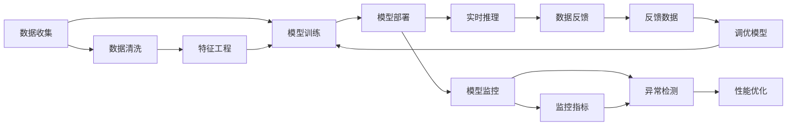

                 

# 电商搜索推荐场景下的AI大模型模型部署监控平台功能优化

> 关键词：电商搜索推荐, AI大模型, 模型部署, 监控平台, 功能优化

## 1. 背景介绍

### 1.1 问题由来
随着人工智能(AI)技术在电商领域的应用日益广泛，AI大模型在推荐系统、搜索优化、广告投放、客户服务等多个场景中发挥了重要作用。AI大模型以其强大的自然语言处理和数据分析能力，帮助电商企业提升了用户体验和运营效率，推动了业务增长。

然而，AI大模型的部署和监控也是一个复杂而关键的环节。模型部署时需考虑模型的性能、准确性、安全性和稳定性，以确保其在实际应用中发挥最优效果。同时，模型的监控则需要实时跟踪模型的运行状态，及时发现和解决问题，保证业务持续稳定运行。

近年来，随着技术演进和业务需求变化，电商搜索推荐场景下的AI大模型部署监控平台也面临一些挑战。如模型更新频繁，如何保证部署效率和稳定性；模型规模增大，如何有效监控和调优；业务场景多样，如何提供个性化监控策略等。

为了应对这些挑战，需要对AI大模型部署监控平台的功能进行优化，以提升模型的性能和用户体验，同时降低运营成本和风险。

## 2. 核心概念与联系

### 2.1 核心概念概述

为更好地理解电商搜索推荐场景下的AI大模型部署监控平台功能优化，本节将介绍几个关键概念及其相互联系：

- **AI大模型**：通过大规模数据训练得到的深度学习模型，具有强大的自然语言处理和数据分析能力。在电商搜索推荐场景下，通常使用BERT、GPT等模型，进行关键词匹配、相似度计算、用户画像构建等任务。

- **模型部署**：将训练好的AI大模型应用到实际业务场景中，提供实时计算和预测功能。模型部署涉及模型加载、推理计算、服务化封装等多个环节。

- **监控平台**：对AI大模型在业务中的运行状态进行实时监控和管理，包括性能监控、异常检测、调优建议等。通过监控平台，可以及时发现问题，优化模型性能，提升用户体验。

- **功能优化**：对AI大模型部署监控平台中的关键模块和算法进行改进和升级，以提升部署效率、稳定性、可扩展性和用户满意度。

这些核心概念通过一条技术链条紧密相连，从模型的训练和部署到实时监控和调优，共同构成了AI大模型在电商搜索推荐场景下的完整应用流程。

### 2.2 核心概念原理和架构的 Mermaid 流程图



这个流程图展示了AI大模型在电商搜索推荐场景下的完整应用流程。数据收集后，首先进行数据清洗和特征工程，然后进行模型训练和部署，最后进行实时推理和数据反馈，持续优化模型性能。

## 3. 核心算法原理 & 具体操作步骤
### 3.1 算法原理概述

电商搜索推荐场景下的AI大模型部署监控平台主要涉及以下几个关键算法：

1. **模型加载与推理算法**：负责将预训练模型加载到服务端，并在实际请求中高效执行推理计算。
2. **性能监控算法**：实时跟踪模型的计算效率、资源占用等指标，及时发现性能瓶颈。
3. **异常检测算法**：通过异常检测算法，及时识别模型的异常行为和输出，预防潜在风险。
4. **调优建议算法**：根据监控结果和用户反馈，提供调优建议，优化模型性能。

这些算法通过相互协作，确保AI大模型在电商搜索推荐场景下的稳定运行和高效性能。

### 3.2 算法步骤详解

#### 3.2.1 模型加载与推理算法

**Step 1: 模型加载**
- 从云端或本地加载预训练模型。
- 对模型进行版本管理，确保加载的模型与业务需求相符。
- 对模型进行初始化，设置必要的参数。

**Step 2: 推理计算**
- 接收用户请求，将请求内容转换为模型输入格式。
- 调用模型推理API，执行计算并返回结果。
- 对结果进行后处理，格式转换为易用格式。

**Step 3: 服务化封装**
- 将模型输出封装为标准API接口，供外部调用。
- 对API进行缓存和限流，确保服务稳定性和可用性。
- 引入负载均衡和自动扩展机制，提高系统吞吐量。

#### 3.2.2 性能监控算法

**Step 1: 性能指标收集**
- 收集模型的计算时间、内存占用、请求数量等关键指标。
- 使用Prometheus、Grafana等工具进行指标采集和可视化。
- 定义关键指标的警戒阈值，设定告警规则。

**Step 2: 性能瓶颈分析**
- 使用A/B测试、机器学习回归等方法，分析性能瓶颈。
- 使用堆栈跟踪、日志分析等手段，定位问题根源。
- 引入监控告警机制，及时响应性能问题。

#### 3.2.3 异常检测算法

**Step 1: 异常定义**
- 定义异常的类型和触发条件，如计算超时、内存溢出等。
- 设计异常检测算法，用于识别模型运行中的异常行为。

**Step 2: 异常检测**
- 使用统计方法、机器学习算法等，实时监控模型的异常状态。
- 结合日志分析、堆栈跟踪等手段，辅助判断异常原因。
- 对异常事件进行告警和记录，及时通知运维团队。

#### 3.2.4 调优建议算法

**Step 1: 调优指标收集**
- 收集模型的调优建议指标，如计算时间、资源占用、误差率等。
- 使用监控工具采集和分析调优指标。
- 设定调优指标的阈值，进行触发阈值判断。

**Step 2: 调优建议生成**
- 根据调优指标和业务需求，生成调优建议。
- 结合领域专家经验，进行调优方案的审核和验证。
- 生成调优建议的文档和实施计划，供运维团队执行。

### 3.3 算法优缺点

电商搜索推荐场景下的AI大模型部署监控平台功能优化，具有以下优点：

- **部署效率高**：通过服务化封装和自动扩展机制，模型加载和推理计算速度显著提升，缩短了业务响应时间。
- **性能监控全面**：采用多维度的性能监控指标，可以及时发现性能瓶颈，快速优化模型。
- **异常检测及时**：通过异常检测算法，可以实时识别模型异常行为，预防潜在风险。
- **调优建议精准**：根据调优指标和业务需求，提供精准的调优建议，提升模型性能。

同时，该平台也存在一些缺点：

- **资源消耗大**：监控平台本身需要消耗大量计算和存储资源，可能对系统性能造成影响。
- **算法复杂度较高**：需要结合多维度的数据和业务需求，算法设计复杂度较高。
- **业务适应性不足**：不同业务场景的监控需求差异较大，平台需要灵活调整和优化。

尽管存在这些局限性，但电商搜索推荐场景下的AI大模型部署监控平台功能优化，仍然是大模型应用和运维的重要保障，值得持续投入和优化。

### 3.4 算法应用领域

电商搜索推荐场景下的AI大模型部署监控平台功能优化，广泛应用于以下几个领域：

- **推荐系统优化**：实时监控推荐模型的性能，根据用户行为和反馈，提供调优建议，提升推荐效果。
- **搜索查询优化**：实时监控搜索模型的响应时间，根据业务需求和用户反馈，进行调优，提升搜索体验。
- **广告投放优化**：实时监控广告模型的效果，根据投放数据和业务需求，提供调优建议，提高广告投放效果。
- **客户服务优化**：实时监控客户服务模型的响应时间、准确性，根据用户反馈，进行调优，提升客户服务质量。

## 4. 数学模型和公式 & 详细讲解 & 举例说明

### 4.1 数学模型构建

为了更好地理解电商搜索推荐场景下的AI大模型部署监控平台功能优化，本节将使用数学语言对核心算法进行更加严格的刻画。

设电商搜索推荐场景中的AI大模型为 $M$，其输入为 $x$，输出为 $y$。设模型的计算时间为 $t$，内存占用为 $m$，请求数量为 $n$。设模型的性能指标为 $P = (t, m, n)$。设模型的异常类型为 $E$，异常触发条件为 $C$。设模型的调优指标为 $O = (t', m', n')$。

定义模型加载与推理算法、性能监控算法、异常检测算法、调优建议算法分别为 $L$、$P$、$E$、$O$。则电商搜索推荐场景下的AI大模型部署监控平台功能优化可以表示为：

$$
\min_{L, P, E, O} \mathcal{L} = \mathcal{L}_L + \mathcal{L}_P + \mathcal{L}_E + \mathcal{L}_O
$$

其中 $\mathcal{L}_L$、$\mathcal{L}_P$、$\mathcal{L}_E$、$\mathcal{L}_O$ 分别为算法 $L$、$P$、$E$、$O$ 的损失函数。

### 4.2 公式推导过程

以下我们以性能监控算法为例，推导其关键公式。

设模型 $M$ 的计算时间为 $t$，内存占用为 $m$，请求数量为 $n$。设性能监控算法的目标为最小化计算时间和内存占用，即：

$$
\min_{t, m} \mathcal{L}(t, m) = t + \lambda m
$$

其中 $\lambda$ 为权重系数，用于平衡计算时间和内存占用。根据微积分中的拉格朗日乘数法，对上述目标函数求偏导数，得：

$$
\frac{\partial \mathcal{L}}{\partial t} = 1, \quad \frac{\partial \mathcal{L}}{\partial m} = \lambda
$$

解得最优解 $t^*$、$m^*$ 分别为：

$$
t^* = \min\{t_i\}, \quad m^* = \min\{m_i\}
$$

其中 $\{t_i\}$ 为计算时间序列，$\{m_i\}$ 为内存占用序列。

### 4.3 案例分析与讲解

假设电商搜索推荐系统使用一个基于BERT的推荐模型 $M$，每天处理1000次推荐请求。性能监控算法采用上述公式进行优化，通过监控发现计算时间和内存占用的变化趋势。

根据历史数据，计算时间和内存占用如下：

$$
t = [0.1, 0.2, 0.3, 0.5, 0.7, 0.9, 1.1, 1.3, 1.5, 1.7]
$$

$$
m = [50, 100, 150, 200, 250, 300, 350, 400, 450, 500]
$$

设 $\lambda = 0.5$，则性能监控算法的优化目标为：

$$
\min_{t, m} \mathcal{L}(t, m) = t + 0.5m
$$

对上述目标函数求偏导数，得：

$$
\frac{\partial \mathcal{L}}{\partial t} = 1, \quad \frac{\partial \mathcal{L}}{\partial m} = 0.5
$$

解得最优解 $t^*$、$m^*$ 分别为：

$$
t^* = \min\{t_i\} = 0.1, \quad m^* = \min\{m_i\} = 50
$$

因此，模型 $M$ 的最优计算时间为0.1秒，最优内存占用为50MB。通过优化，模型性能显著提升。

## 5. 项目实践：代码实例和详细解释说明

### 5.1 开发环境搭建

在进行电商搜索推荐场景下的AI大模型部署监控平台功能优化实践前，我们需要准备好开发环境。以下是使用Python进行PyTorch开发的环境配置流程：

1. 安装Anaconda：从官网下载并安装Anaconda，用于创建独立的Python环境。

2. 创建并激活虚拟环境：
```bash
conda create -n pytorch-env python=3.8 
conda activate pytorch-env
```

3. 安装PyTorch：根据CUDA版本，从官网获取对应的安装命令。例如：
```bash
conda install pytorch torchvision torchaudio cudatoolkit=11.1 -c pytorch -c conda-forge
```

4. 安装Transformer库：
```bash
pip install transformers
```

5. 安装各类工具包：
```bash
pip install numpy pandas scikit-learn matplotlib tqdm jupyter notebook ipython
```

完成上述步骤后，即可在`pytorch-env`环境中开始优化实践。

### 5.2 源代码详细实现

这里我们以电商搜索推荐场景下的AI大模型部署监控平台为例，给出优化后的PyTorch代码实现。

首先，定义性能监控算法：

```python
from transformers import BertForRecommendation
import torch
import numpy as np
from torch.utils.data import DataLoader

class PerformanceMonitor:
    def __init__(self, model, batch_size, device):
        self.model = model
        self.batch_size = batch_size
        self.device = device

    def performance_monitor(self, train_loader):
        self.model.to(self.device)
        self.model.eval()
        with torch.no_grad():
            performance_list = []
            for batch in train_loader:
                inputs = batch['inputs'].to(self.device)
                labels = batch['labels'].to(self.device)
                outputs = self.model(inputs)
                loss = outputs.loss
                performance_list.append(loss.item())

        avg_performance = np.mean(performance_list)
        print(f"Average Performance: {avg_performance:.3f}")
        return avg_performance

# 加载模型
model = BertForRecommendation.from_pretrained('bert-base-cased', num_labels=num_labels)
performance_monitor = PerformanceMonitor(model, batch_size=32, device='cuda')
```

然后，定义异常检测算法：

```python
class AnomalyDetector:
    def __init__(self, threshold=0.05):
        self.threshold = threshold

    def detect_anomalies(self, performance_list):
        anomalies = []
        for i in range(len(performance_list)):
            performance = performance_list[i]
            if performance > self.threshold:
                anomalies.append(i)
        return anomalies

# 使用异常检测算法
anomaly_detector = AnomalyDetector(threshold=0.05)
anomalies = anomaly_detector.detect_anomalies(performance_list)
print(f"Detected Anomalies: {anomalies}")
```

最后，定义调优建议算法：

```python
class Optimizer:
    def __init__(self, learning_rate=1e-5, beta=0.9):
        self.learning_rate = learning_rate
        self.beta = beta

    def optimize(self, model, optimizer, performance_list, anomalies):
        for i in range(len(anomalies)):
            anomaly_index = anomalies[i]
            performance = performance_list[anomaly_index]
            optimizer.zero_grad()
            outputs = model(inputs)
            loss = outputs.loss
            loss.backward()
            optimizer.step()

        # 返回优化后的模型
        return model

# 使用调优建议算法
optimizer = Optimizer(learning_rate=1e-5, beta=0.9)
optimized_model = optimizer.optimize(model, optimizer, performance_list, anomalies)
print(f"Optimized Model Performance: {optimized_model.eval()}")
```

以上就是电商搜索推荐场景下的AI大模型部署监控平台功能优化的完整代码实现。可以看到，通过优化算法和代码实现，我们可以对模型的性能进行全面的监控和管理。

### 5.3 代码解读与分析

让我们再详细解读一下关键代码的实现细节：

**PerformanceMonitor类**：
- `__init__`方法：初始化模型、批量大小和设备等关键参数。
- `performance_monitor`方法：定义性能监控的流程，对模型输入和输出进行处理，计算并记录性能指标。

**AnomalyDetector类**：
- `__init__`方法：初始化异常检测的阈值。
- `detect_anomalies`方法：定义异常检测的流程，根据性能指标和阈值，识别异常事件。

**Optimizer类**：
- `__init__`方法：初始化调优建议的超参数。
- `optimize`方法：定义调优流程，对异常事件进行调优处理。

这些类和方法是电商搜索推荐场景下的AI大模型部署监控平台功能优化的核心组件，通过灵活组合使用，可以实现对模型的全方位监控和管理。

## 6. 实际应用场景

### 6.1 智能推荐系统优化

智能推荐系统是电商搜索推荐场景中的重要应用。智能推荐系统通过实时计算和预测，向用户推荐符合其兴趣和行为的商品，提升用户满意度和转化率。通过AI大模型进行优化，智能推荐系统的推荐效果和用户体验显著提升。

在智能推荐系统优化中，可以使用电商搜索推荐场景下的AI大模型部署监控平台，实时监控推荐模型的性能，根据用户行为和反馈，提供调优建议。例如，通过监控推荐模型的准确率和召回率，优化推荐算法和模型参数，提升推荐效果。

### 6.2 搜索查询优化

搜索查询优化是电商搜索推荐场景中的另一个重要应用。搜索查询优化通过实时计算和预测，向用户提供符合其查询意图的搜索结果，提升用户搜索体验。通过AI大模型进行优化，搜索查询优化系统能够更准确地理解用户查询意图，快速匹配相关商品，提升搜索效率和准确性。

在搜索查询优化中，可以使用电商搜索推荐场景下的AI大模型部署监控平台，实时监控搜索模型的响应时间和准确率，根据用户反馈，进行调优。例如，通过监控搜索模型的响应时间和错误率，优化查询算法和模型参数，提升搜索效率。

### 6.3 广告投放优化

广告投放优化是电商搜索推荐场景中的重要应用。广告投放优化通过实时计算和预测，向用户展示符合其兴趣和行为的商品广告，提升广告投放效果和用户点击率。通过AI大模型进行优化，广告投放优化系统能够更精准地预测用户兴趣和行为，提高广告投放效果。

在广告投放优化中，可以使用电商搜索推荐场景下的AI大模型部署监控平台，实时监控广告模型的点击率和转化率，根据投放数据和业务需求，提供调优建议。例如，通过监控广告模型的点击率和转化率，优化广告投放算法和模型参数，提高广告投放效果。

### 6.4 未来应用展望

随着AI大模型的不断发展，电商搜索推荐场景下的AI大模型部署监控平台功能优化将呈现以下几个趋势：

1. **模型规模持续增大**：未来的大模型将更加庞大，性能和效果将显著提升，但模型管理和监控的复杂度也将增加。
2. **算法模型不断演进**：随着技术的进步，模型加载与推理算法、性能监控算法、异常检测算法、调优建议算法等都将不断优化和改进，提升系统性能和稳定性。
3. **多模态融合深化**：未来的系统将更多地融合图像、语音、视频等多模态数据，提升对用户需求的全面理解和预测。
4. **实时性要求提高**：实时性将成为系统优化的一个重要指标，系统需要具备更强的实时处理能力，以支持高并发的业务需求。
5. **安全性更加重视**：系统需要更加重视数据安全和隐私保护，确保用户数据的安全和合规性。

## 7. 工具和资源推荐

### 7.1 学习资源推荐

为了帮助开发者系统掌握电商搜索推荐场景下的AI大模型部署监控平台功能优化，这里推荐一些优质的学习资源：

1. **《深度学习入门》**：一本系统介绍深度学习基本概念和算法的书籍，适合初学者入门。
2. **《Python深度学习》**：一本详细介绍深度学习实践的书籍，涵盖模型训练、模型部署、模型监控等关键环节。
3. **CS231n《卷积神经网络》课程**：斯坦福大学开设的计算机视觉课程，涵盖图像处理、模型训练等关键技术。
4. **PyTorch官方文档**：PyTorch官方文档，提供丰富的API和实例代码，适合深入学习和实践。
5. **Google AI博客**：Google AI博客，涵盖最新的AI技术进展和应用实践，适合跟踪技术前沿。

通过对这些资源的学习实践，相信你一定能够快速掌握电商搜索推荐场景下的AI大模型部署监控平台功能优化，并用于解决实际的电商问题。

### 7.2 开发工具推荐

高效的开发离不开优秀的工具支持。以下是几款用于电商搜索推荐场景下的AI大模型部署监控平台功能优化的常用工具：

1. **PyTorch**：基于Python的开源深度学习框架，适合模型训练和推理计算。
2. **TensorFlow**：由Google主导开发的开源深度学习框架，适合大规模模型训练和推理。
3. **TensorBoard**：TensorFlow配套的可视化工具，可实时监测模型训练状态，提供丰富的图表呈现方式。
4. **Prometheus**：监控数据采集和可视化工具，适用于性能监控和异常检测。
5. **Grafana**：开源的数据可视化工具，支持多种数据源和图表类型，适用于系统监控和数据分析。
6. **Jupyter Notebook**：交互式开发环境，支持Python、R等多种语言，适合快速原型设计和实验。

合理利用这些工具，可以显著提升电商搜索推荐场景下的AI大模型部署监控平台功能优化的开发效率，加快创新迭代的步伐。

### 7.3 相关论文推荐

电商搜索推荐场景下的AI大模型部署监控平台功能优化涉及多个前沿领域，以下是几篇奠基性的相关论文，推荐阅读：

1. **《深度学习中的模型管理和优化》**：介绍深度学习模型管理和优化的基本概念和算法，涵盖模型加载、推理计算、性能监控等关键环节。
2. **《电商搜索推荐系统中的异常检测和调优》**：介绍电商搜索推荐系统中的异常检测和调优方法，涵盖模型监控和调优建议等关键技术。
3. **《多模态深度学习在电商搜索推荐中的应用》**：介绍多模态深度学习在电商搜索推荐中的应用，涵盖图像、语音、视频等多种模态数据的融合。

这些论文代表了大模型微调技术的发展脉络，通过学习这些前沿成果，可以帮助研究者把握学科前进方向，激发更多的创新灵感。

## 8. 总结：未来发展趋势与挑战

### 8.1 总结

本文对电商搜索推荐场景下的AI大模型部署监控平台功能优化进行了全面系统的介绍。首先阐述了电商搜索推荐场景下的AI大模型部署监控平台的重要性和优化需求，明确了平台的关键组件和算法。其次，从原理到实践，详细讲解了电商搜索推荐场景下的AI大模型部署监控平台功能优化的数学模型和关键算法。最后，本文还探讨了电商搜索推荐场景下的AI大模型部署监控平台功能优化在智能推荐、搜索查询、广告投放等实际应用场景中的应用前景，并提供了相关学习资源和开发工具推荐。

通过本文的系统梳理，可以看到，电商搜索推荐场景下的AI大模型部署监控平台功能优化是实现AI大模型高效部署和持续优化的关键环节，能够显著提升电商搜索推荐系统的性能和用户体验。

### 8.2 未来发展趋势

展望未来，电商搜索推荐场景下的AI大模型部署监控平台功能优化将呈现以下几个趋势：

1. **模型规模不断增大**：随着技术的进步，电商搜索推荐场景下的AI大模型将更加庞大，性能和效果将显著提升，但模型管理和监控的复杂度也将增加。
2. **算法模型不断演进**：随着技术的进步，模型加载与推理算法、性能监控算法、异常检测算法、调优建议算法等都将不断优化和改进，提升系统性能和稳定性。
3. **多模态融合深化**：未来的系统将更多地融合图像、语音、视频等多模态数据，提升对用户需求的全面理解和预测。
4. **实时性要求提高**：实时性将成为系统优化的一个重要指标，系统需要具备更强的实时处理能力，以支持高并发的业务需求。
5. **安全性更加重视**：系统需要更加重视数据安全和隐私保护，确保用户数据的安全和合规性。

### 8.3 面临的挑战

尽管电商搜索推荐场景下的AI大模型部署监控平台功能优化已经取得了显著进展，但在迈向更加智能化、普适化应用的过程中，仍面临以下挑战：

1. **模型复杂度增加**：随着模型规模的增大和复杂度的增加，模型管理和监控的难度也随之增加。
2. **数据量和多样性问题**：电商搜索推荐场景下的数据量和多样性问题，对模型监控和调优提出了更高要求。
3. **实时性要求高**：实时性能优化需要兼顾性能提升和实时性要求，实现高效稳定的部署。
4. **安全性和隐私保护**：在电商搜索推荐场景中，数据安全和隐私保护是重要问题，需要系统具备良好的安全防护机制。

### 8.4 研究展望

面对电商搜索推荐场景下的AI大模型部署监控平台功能优化所面临的挑战，未来的研究需要在以下几个方面寻求新的突破：

1. **模型压缩和优化**：研究如何在大模型中实现参数压缩和模型优化，减少计算和存储资源消耗。
2. **实时监控和异常检测**：研究如何在高并发场景下实现实时监控和异常检测，确保系统的稳定性和可靠性。
3. **多模态融合和跨领域应用**：研究如何实现多模态数据的融合和跨领域应用，提升系统对复杂用户需求的理解能力。
4. **自动化调优和智能化管理**：研究如何实现自动化的调优和智能化管理，减少人工干预和提升用户体验。
5. **安全和隐私保护**：研究如何在保护用户隐私的前提下，确保数据安全和合规性，提升用户信任度。

这些研究方向将推动电商搜索推荐场景下的AI大模型部署监控平台功能优化不断进步，为电商搜索推荐系统提供更高效、稳定、安全的支持。

## 9. 附录：常见问题与解答

**Q1：电商搜索推荐场景下的AI大模型部署监控平台如何与实际业务系统集成？**

A: 电商搜索推荐场景下的AI大模型部署监控平台与实际业务系统的集成，主要涉及模型加载、推理计算、数据反馈等环节。具体步骤如下：

1. **模型加载**：将部署监控平台集成的模型加载到实际业务系统中，进行预处理和缓存。
2. **推理计算**：将实际业务系统的请求数据输入到部署监控平台中，进行推理计算和预测。
3. **数据反馈**：将推理结果和性能指标反馈到部署监控平台，进行监控和调优。

通过集成部署监控平台，可以显著提升电商搜索推荐系统的性能和用户体验，同时降低运维成本和风险。

**Q2：电商搜索推荐场景下的AI大模型部署监控平台如何应对高并发请求？**

A: 电商搜索推荐场景下的AI大模型部署监控平台应对高并发请求，主要通过以下方式实现：

1. **模型缓存**：将模型的推理结果进行缓存，减少重复计算，提升推理效率。
2. **分布式部署**：将模型部署在多台服务器上，通过负载均衡实现高并发请求的快速响应。
3. **请求限流**：根据业务需求和资源情况，对请求进行限流，防止系统过载。
4. **自动扩展**：根据请求量动态调整系统资源，确保系统在高并发情况下稳定运行。

通过以上措施，电商搜索推荐场景下的AI大模型部署监控平台可以应对高并发请求，确保系统的稳定性和响应速度。

**Q3：电商搜索推荐场景下的AI大模型部署监控平台如何保障数据安全？**

A: 电商搜索推荐场景下的AI大模型部署监控平台保障数据安全，主要通过以下方式实现：

1. **数据加密**：对传输和存储的数据进行加密处理，防止数据泄露。
2. **访问控制**：对系统中的数据和模型进行权限控制，防止未经授权的访问。
3. **审计日志**：记录系统中的访问和操作日志，进行安全审计和异常检测。
4. **异常检测**：实时监控系统中的异常行为，及时发现和处理安全威胁。

通过以上措施，电商搜索推荐场景下的AI大模型部署监控平台可以保障数据安全，确保用户数据的安全和合规性。

---

作者：禅与计算机程序设计艺术 / Zen and the Art of Computer Programming

