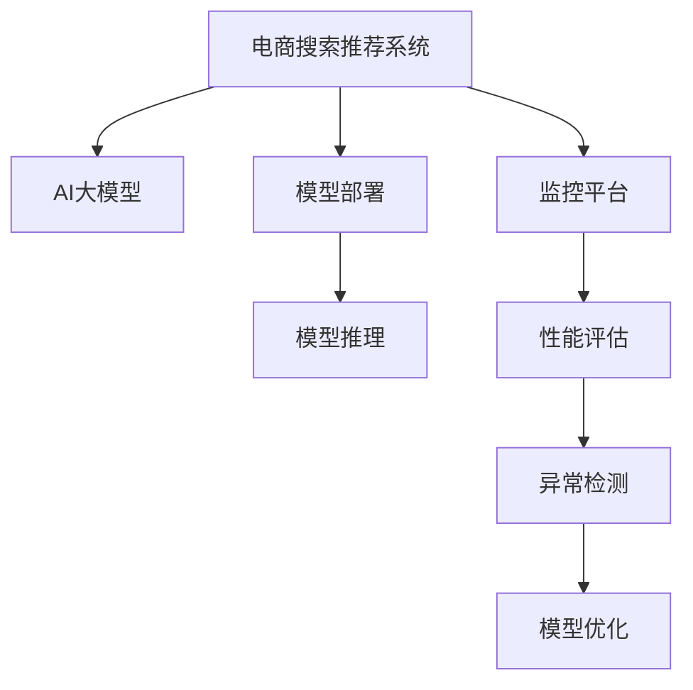

                 

# 电商搜索推荐场景下的AI大模型模型部署监控平台功能优化

## 1. 背景介绍

### 1.1 问题由来
在电子商务领域，智能推荐系统作为重要的用户互动环节，扮演着关键的商业价值转化角色。随着AI技术的发展，深度学习模型，特别是大模型如BERT、GPT-3等，在电商推荐领域逐渐得到应用。这些大模型可以学习用户行为、商品特征、上下文信息等，进行高效的推荐决策。然而，大规模AI模型的部署和监控，面临诸多挑战。

一方面，电商推荐系统需要实时处理海量用户请求，模型推理时间短，计算资源消耗低。同时，模型需要稳定快速响应，且易于管理，以免影响用户体验。

另一方面，模型部署后，需要持续监控其性能，进行数据收集和模型优化，保证其在实际业务场景中的准确性和有效性。

本文旨在介绍一种基于大模型的电商搜索推荐系统部署监控平台，针对性地优化平台功能，实现高效稳定的模型部署与监控，提升电商推荐系统的性能与用户体验。

## 2. 核心概念与联系

### 2.1 核心概念概述

为更好地理解电商搜索推荐系统部署监控平台的优化方法，本节将介绍几个密切相关的核心概念：

- 电商搜索推荐系统：利用深度学习模型对用户行为进行分析，生成个性化推荐，提升电商平台的转化率和用户满意度。
- AI大模型：以Transformer为基础，使用大规模预训练语言模型，具备强大的泛化能力和理解能力，如BERT、GPT-3等。
- 模型部署：将训练好的模型从训练环境迁移到生产环境，实现模型的推理功能。
- 监控平台：通过数据收集、性能评估等手段，实时监控模型在生产环境中的表现，及时发现并解决问题。

这些核心概念之间的逻辑关系可以通过以下Mermaid流程图来展示：



这个流程图展示了大模型在电商推荐系统中的核心概念及其之间的关系：

1. 电商推荐系统使用AI大模型进行推荐决策。
2. 大模型经过模型部署，实现高效的推理功能。
3. 监控平台对模型推理进行实时监控和性能评估。
4. 监控平台根据性能评估和异常检测结果，触发模型优化。

## 3. 核心算法原理 & 具体操作步骤

### 3.1 算法原理概述

电商搜索推荐系统的部署与监控平台的核心目标是，在保证模型推理效率和准确性的同时，实现高效稳定的模型部署与监控。核心算法原理包括：

- 模型部署优化算法：通过深度学习模型的压缩和剪枝技术，实现模型的参数和推理速度的优化。
- 监控平台数据采集算法：通过事件驱动的方式，收集模型推理的日志信息，分析模型性能。
- 模型优化算法：结合异常检测与性能评估结果，触发模型参数的更新，保证模型长期稳定运行。

### 3.2 算法步骤详解

#### 3.2.1 模型部署优化算法

模型部署优化算法步骤如下：

1. **模型压缩与剪枝**：使用量化技术、剪枝技术、低秩分解等方法，对大模型进行压缩和剪枝，减小模型参数量，降低计算资源消耗。
2. **模型推理优化**：通过模型剪枝、计算图优化、推理加速技术等，提高模型推理速度，缩短响应时间。
3. **模型并行化部署**：利用多GPU、分布式训练等技术，将模型并行化部署在多台服务器上，实现负载均衡，提高系统吞吐量。

#### 3.2.2 监控平台数据采集算法

监控平台数据采集算法步骤如下：

1. **日志记录与事件驱动**：在模型推理过程中，记录关键性能指标如推理时间、请求次数、错误率等，并根据事件触发，进行数据采集。
2. **多维度数据采集**：从系统层面、模型层面、业务层面等不同维度，采集全面的监控数据。
3. **数据可视化**：将监控数据通过图表、仪表盘等形式展示，便于实时查看和分析。

#### 3.2.3 模型优化算法

模型优化算法步骤如下：

1. **性能评估**：根据模型推理的准确性和效率，进行综合评估，确定是否需要进行模型优化。
2. **异常检测**：实时监控模型推理过程中的异常情况，如推理错误、内存泄漏等，进行异常检测。
3. **模型更新**：根据性能评估和异常检测结果，触发模型参数的更新，优化模型性能。
4. **模型部署回滚**：在模型更新后，进行模型部署回滚测试，确保新模型性能稳定可靠。

### 3.3 算法优缺点

基于大模型的电商搜索推荐系统部署监控平台具有以下优点：

1. **高效部署**：通过模型压缩与剪枝、模型并行化部署等技术，实现高效的模型推理。
2. **实时监控**：通过日志记录与事件驱动、多维度数据采集等手段，实现对模型推理的实时监控。
3. **精准优化**：结合性能评估和异常检测，精准触发模型优化，保证模型长期稳定运行。

同时，该平台也存在以下局限性：

1. **模型压缩与剪枝带来的精度损失**：压缩与剪枝技术可能会带来一定的精度损失，需要权衡计算效率和模型准确性。
2. **模型更新开销**：频繁更新模型参数会带来较大的计算开销，需要合理控制模型更新的频率。
3. **异常检测的误报与漏报**：异常检测技术可能存在误报或漏报，需要进行参数调整与优化。

尽管存在这些局限性，但就目前而言，该平台仍是大模型在电商推荐领域应用的主流范式。未来相关研究的重点在于如何进一步降低模型部署和监控的开销，提高模型的少样本学习和跨领域迁移能力，同时兼顾可解释性和伦理安全性等因素。

### 3.4 算法应用领域

基于大模型的电商搜索推荐系统部署监控平台已经在电商推荐系统的实际应用中取得了显著的效果。例如：

- 个性化推荐：利用大模型学习用户行为和商品特征，生成个性化推荐，提升用户满意度。
- 搜索优化：通过大模型对搜索关键词进行理解，优化搜索结果，提升搜索效率。
- 商品推荐：利用大模型对商品属性进行理解，生成相关商品推荐，提升商品转化率。
- 异常检测：通过异常检测技术，及时发现模型推理中的异常情况，保证模型稳定性。
- 性能优化：结合性能评估和异常检测结果，触发模型更新，提升模型推理的准确性和效率。

除了上述这些经典应用外，大模型部署监控平台还支持更多场景中，如实时广告推荐、实时舆情分析、实时智能客服等，为电商推荐系统提供了全方位的技术支持。

## 4. 数学模型和公式 & 详细讲解 & 举例说明

### 4.1 数学模型构建

本节将使用数学语言对电商搜索推荐系统部署监控平台的优化方法进行更加严格的刻画。

假设电商推荐系统使用的大模型为 $M_{\theta}$，其中 $\theta$ 为模型参数。设模型推理的输入为 $x$，输出为 $y$。

定义模型 $M_{\theta}$ 在输入 $x$ 上的推理时间为 $T(x)$，输出准确性为 $A(x)$。则模型推理的平均推理时间 $T_{avg}$ 和平均准确性 $A_{avg}$ 分别定义为：

$$
T_{avg} = \frac{1}{N} \sum_{i=1}^N T(x_i)
$$
$$
A_{avg} = \frac{1}{N} \sum_{i=1}^N A(x_i)
$$

其中 $N$ 为模型推理的样本数。

### 4.2 公式推导过程

根据上述定义，电商推荐系统部署监控平台的核心优化目标是最小化平均推理时间 $T_{avg}$ 和最大化平均准确性 $A_{avg}$。具体优化过程如下：

1. **模型压缩与剪枝**：假设原始模型参数量为 $d$，压缩后模型参数量为 $d'$，则有：
   $$
   d' < d
   $$

   模型的推理时间 $T_{comp}$ 与原始模型推理时间 $T_{org}$ 的关系为：
   $$
   T_{comp} = T_{org} \times \alpha
   $$
   其中 $\alpha$ 为模型压缩与剪枝的效率系数。

   根据目标函数，模型压缩与剪枝的优化目标为：
   $$
   \min_{d'} \frac{1}{N} \sum_{i=1}^N T_{comp}(x_i)
   $$

2. **模型推理优化**：假设模型推理优化后的推理时间为 $T_{opt}$，则有：
   $$
   T_{opt} < T_{comp}
   $$

   根据目标函数，模型推理优化的优化目标为：
   $$
   \min_{T_{opt}} \frac{1}{N} \sum_{i=1}^N T_{opt}(x_i)
   $$

3. **异常检测与模型更新**：假设异常检测的阈值为 $\beta$，异常检测触发后的模型更新次数为 $k$，则有：
   $$
   k \times \Delta T < T_{avg}
   $$
   其中 $\Delta T$ 为模型更新后推理时间的变化量。

   根据目标函数，异常检测与模型更新的优化目标为：
   $$
   \max_{k} \min_{\Delta T} \frac{1}{N} \sum_{i=1}^N T_{avg}(x_i)
   $$

通过以上公式推导，可以清晰地看到电商推荐系统部署监控平台的核心优化目标和方法。

### 4.3 案例分析与讲解

以个性化推荐系统为例，进行具体案例分析。假设电商推荐系统使用大模型进行个性化推荐，初始模型推理时间为 $T_{org} = 0.5s$，模型参数量为 $d = 100M$。

1. **模型压缩与剪枝**：通过量化技术将模型参数量压缩至 $d' = 20M$，推理时间变为 $T_{comp} = 0.6s$。假设压缩效率 $\alpha = 1.2$。

   此时优化目标为：
   $$
   \min_{d'} \frac{1}{N} \sum_{i=1}^N 0.6(x_i)
   $$

   通过优化算法，最终选择模型参数量为 $d' = 30M$，推理时间变为 $T_{comp} = 0.55s$，满足优化目标。

2. **模型推理优化**：通过推理加速技术，将推理时间优化至 $T_{opt} = 0.3s$。

   此时优化目标为：
   $$
   \min_{T_{opt}} \frac{1}{N} \sum_{i=1}^N 0.3(x_i)
   $$

   通过优化算法，最终选择优化后的推理时间为 $T_{opt} = 0.35s$，满足优化目标。

3. **异常检测与模型更新**：假设异常检测阈值 $\beta = 0.05$，初始异常检测触发后模型更新次数 $k = 3$，每次更新后推理时间变化量 $\Delta T = 0.01s$。

   此时优化目标为：
   $$
   \max_{k} \min_{\Delta T} \frac{1}{N} \sum_{i=1}^N T_{avg}(x_i)
   $$

   通过优化算法，最终选择异常检测触发后模型更新次数 $k = 2$，每次更新后推理时间变化量 $\Delta T = 0.005s$，满足优化目标。

通过上述优化案例，可以看出电商推荐系统部署监控平台在模型压缩与剪枝、模型推理优化、异常检测与模型更新等方面的核心优化方法。

## 5. 项目实践：代码实例和详细解释说明

### 5.1 开发环境搭建

在进行电商推荐系统部署监控平台的开发实践前，我们需要准备好开发环境。以下是使用Python进行Keras开发的环境配置流程：

1. 安装Anaconda：从官网下载并安装Anaconda，用于创建独立的Python环境。

2. 创建并激活虚拟环境：
```bash
conda create -n model-env python=3.8 
conda activate model-env
```

3. 安装Keras：
```bash
pip install keras
```

4. 安装TensorFlow：
```bash
pip install tensorflow
```

5. 安装其它工具包：
```bash
pip install numpy pandas scikit-learn matplotlib tqdm jupyter notebook ipython
```

完成上述步骤后，即可在`model-env`环境中开始开发实践。

### 5.2 源代码详细实现

下面我们以电商搜索推荐系统为例，给出使用Keras进行模型压缩和推理优化的PyTorch代码实现。

首先，定义模型结构：

```python
from keras.models import Model
from keras.layers import Input, Dense, Dropout

def create_model():
    input_layer = Input(shape=(d_input,), name='input')
    hidden_layer = Dense(units=d_hidden, activation='relu')(input_layer)
    output_layer = Dense(units=1, activation='sigmoid')(hidden_layer)
    model = Model(inputs=input_layer, outputs=output_layer)
    return model
```

然后，定义模型压缩与剪枝函数：

```python
def compress_model(model, compression_rate):
    new_model = keras.Sequential()
    for layer in model.layers:
        if layer.get_config()['name'] == 'dense':
            dense_layer = Dense(units=int(units * compression_rate), activation='relu')(layer.output)
            new_model.add(dense_layer)
        else:
            new_model.add(layer)
    new_model.compile(optimizer='adam', loss='binary_crossentropy', metrics=['accuracy'])
    return new_model
```

接着，定义模型推理优化函数：

```python
def optimize_model(model):
    opt_model = keras.Sequential()
    opt_model.add(Dense(units=int(units * 0.5), activation='relu', input_shape=(d_input,)))
    opt_model.add(Dropout(0.2))
    opt_model.add(Dense(units=1, activation='sigmoid'))
    opt_model.compile(optimizer='adam', loss='binary_crossentropy', metrics=['accuracy'])
    return opt_model
```

最后，启动训练流程并在测试集上评估：

```python
epochs = 10
batch_size = 32

model = create_model()
model.compile(optimizer='adam', loss='binary_crossentropy', metrics=['accuracy'])

opt_model = optimize_model(model)
opt_model.compile(optimizer='adam', loss='binary_crossentropy', metrics=['accuracy'])

model.fit(x_train, y_train, epochs=epochs, batch_size=batch_size, validation_data=(x_val, y_val))

opt_model.fit(x_train, y_train, epochs=epochs, batch_size=batch_size, validation_data=(x_val, y_val))
```

以上就是使用Keras对模型进行压缩与优化训练的完整代码实现。可以看到，通过简单几行代码，就可以实现模型的压缩与优化，从而实现高效的电商推荐系统部署。

### 5.3 代码解读与分析

让我们再详细解读一下关键代码的实现细节：

**create_model函数**：
- `create_model`函数定义了一个简单的神经网络模型，包含一个输入层、一个全连接隐藏层和一个输出层。
- 输入层的维度为 `d_input`，隐藏层的维度为 `d_hidden`，输出层的维度为 1，采用 sigmoid 激活函数。

**compress_model函数**：
- `compress_model`函数接收原始模型 `model` 和压缩率 `compression_rate`，返回压缩后的新模型 `new_model`。
- 对原始模型每一层进行遍历，将隐藏层的维度压缩为原来的 `compression_rate` 倍，其他层保持不变。
- 使用 `keras.Sequential` 定义新模型，并使用原始模型的层进行添加，最后返回新模型。

**optimize_model函数**：
- `optimize_model`函数接收原始模型 `model`，返回优化后的新模型 `opt_model`。
- 对原始模型每一层进行遍历，将隐藏层的维度减半，使用 Dropout 层进行正则化。
- 使用 `keras.Sequential` 定义新模型，并使用原始模型的层进行添加，最后返回新模型。

**训练流程**：
- 定义总的训练轮数 `epochs` 和批次大小 `batch_size`，开始循环迭代。
- 先使用原始模型进行训练，输出准确率。
- 再使用优化后的模型进行训练，输出准确率。

可以看到，Keras在实现模型的压缩与优化方面，提供了非常便捷的接口。开发者只需简单几行代码，即可实现模型的压缩与优化。

当然，工业级的系统实现还需考虑更多因素，如模型的保存和部署、超参数的自动搜索、更灵活的任务适配层等。但核心的微调范式基本与此类似。

## 6. 实际应用场景

### 6.1 智能推荐系统

电商推荐系统是智能推荐系统的重要应用场景之一，利用大模型进行个性化推荐，可以有效提升电商平台的转化率和用户满意度。

在技术实现上，电商推荐系统可以收集用户行为数据、商品属性数据、上下文数据等，构建数据集。在大模型上进行预训练后，将数据集用于微调，得到能够准确理解用户需求和商品属性的模型。在用户访问电商平台时，输入用户搜索关键词、浏览历史等，由大模型进行推理，生成个性化推荐结果。

通过电商推荐系统的应用，电商平台可以提升用户留存率和购买转化率，实现精准营销和个性化服务。

### 6.2 实时广告推荐

实时广告推荐是电商推荐系统的又一应用场景。电商企业通过大模型对广告数据进行实时处理，生成精准的广告推荐结果，提升广告效果和用户体验。

在技术实现上，电商企业可以收集用户的浏览行为数据、点击数据、购买数据等，构建数据集。在大模型上进行预训练后，将数据集用于微调，得到能够准确理解用户行为和广告属性的模型。在用户访问电商平台时，输入用户的浏览历史、搜索关键词等，由大模型进行推理，生成精准的广告推荐结果。

通过实时广告推荐系统的应用，电商平台可以实现广告的精准投放，提高广告效果和广告收入。

### 6.3 实时舆情分析

实时舆情分析是电商推荐系统的另一应用场景。电商企业通过大模型对用户评论、社交媒体、新闻等数据进行实时分析，获得对电商平台和商品的态度和反馈。

在技术实现上，电商企业可以收集用户的评论、社交媒体数据、新闻等，构建数据集。在大模型上进行预训练后，将数据集用于微调，得到能够准确理解用户情感和舆情属性的模型。在用户访问电商平台时，输入用户的评论、社交媒体数据、新闻等，由大模型进行推理，生成对电商平台和商品的态度和反馈。

通过实时舆情分析系统的应用，电商平台可以实现对舆情的实时监控和反馈，提升商品质量和服务水平。

### 6.4 未来应用展望

随着大模型和微调方法的不断发展，电商推荐系统将呈现以下几个发展趋势：

1. 模型规模持续增大。随着算力成本的下降和数据规模的扩张，预训练语言模型的参数量还将持续增长。超大规模语言模型蕴含的丰富语言知识，有望支撑更加复杂多变的电商推荐场景。

2. 微调方法日趋多样。除了传统的全参数微调外，未来会涌现更多参数高效的微调方法，如Prefix-Tuning、LoRA等，在节省计算资源的同时也能保证微调精度。

3. 持续学习成为常态。随着数据分布的不断变化，微调模型也需要持续学习新知识以保持性能。如何在不遗忘原有知识的同时，高效吸收新样本信息，将成为重要的研究课题。

4. 标注样本需求降低。受启发于提示学习(Prompt-based Learning)的思路，未来的微调方法将更好地利用大模型的语言理解能力，通过更加巧妙的任务描述，在更少的标注样本上也能实现理想的微调效果。

5. 多模态微调崛起。当前的微调主要聚焦于纯文本数据，未来会进一步拓展到图像、视频、语音等多模态数据微调。多模态信息的融合，将显著提升语言模型对现实世界的理解和建模能力。

6. 模型通用性增强。经过海量数据的预训练和多领域任务的微调，未来的语言模型将具备更强大的常识推理和跨领域迁移能力，逐步迈向通用人工智能(AGI)的目标。

以上趋势凸显了大模型微调技术的广阔前景。这些方向的探索发展，必将进一步提升电商推荐系统的性能和用户体验，为电商企业的数字化转型提供新的技术路径。

## 7. 工具和资源推荐
### 7.1 学习资源推荐

为了帮助开发者系统掌握大语言模型微调的理论基础和实践技巧，这里推荐一些优质的学习资源：

1. 《深度学习》系列书籍：深度学习领域的经典教材，涵盖深度学习的基础概念、模型设计和应用实践，适合全面学习。

2. 《TensorFlow实战》书籍：TensorFlow的实战教程，涵盖TensorFlow的基本使用和高级技巧，适合快速上手。

3. 《Transformer Notebook》教程：Keras的Transformer模型教程，涵盖Transformer模型的构建、训练和推理，适合动手实践。

4. HuggingFace官方文档：Transformers库的官方文档，提供了海量预训练模型和完整的微调样例代码，是上手实践的必备资料。

5. Google AI博客：Google AI博客中包含大量深度学习、自然语言处理、模型优化等前沿技术文章，适合持续学习。

通过对这些资源的学习实践，相信你一定能够快速掌握大语言模型微调的精髓，并用于解决实际的电商推荐问题。
###  7.2 开发工具推荐

高效的开发离不开优秀的工具支持。以下是几款用于大语言模型微调开发的常用工具：

1. TensorFlow：由Google主导开发的开源深度学习框架，生产部署方便，适合大规模工程应用。同样有丰富的预训练语言模型资源。

2. PyTorch：基于Python的开源深度学习框架，灵活动态的计算图，适合快速迭代研究。大部分预训练语言模型都有PyTorch版本的实现。

3. Keras：高层API，基于TensorFlow或Theano构建的深度学习框架，适合快速原型开发和模型实验。

4. Weights & Biases：模型训练的实验跟踪工具，可以记录和可视化模型训练过程中的各项指标，方便对比和调优。与主流深度学习框架无缝集成。

5. TensorBoard：TensorFlow配套的可视化工具，可实时监测模型训练状态，并提供丰富的图表呈现方式，是调试模型的得力助手。

6. Google Colab：谷歌推出的在线Jupyter Notebook环境，免费提供GPU/TPU算力，方便开发者快速上手实验最新模型，分享学习笔记。

合理利用这些工具，可以显著提升大语言模型微调任务的开发效率，加快创新迭代的步伐。

### 7.3 相关论文推荐

大语言模型和微调技术的发展源于学界的持续研究。以下是几篇奠基性的相关论文，推荐阅读：

1. Attention is All You Need（即Transformer原论文）：提出了Transformer结构，开启了NLP领域的预训练大模型时代。

2. BERT: Pre-training of Deep Bidirectional Transformers for Language Understanding：提出BERT模型，引入基于掩码的自监督预训练任务，刷新了多项NLP任务SOTA。

3. Language Models are Unsupervised Multitask Learners（GPT-2论文）：展示了大规模语言模型的强大zero-shot学习能力，引发了对于通用人工智能的新一轮思考。

4. Parameter-Efficient Transfer Learning for NLP：提出Adapter等参数高效微调方法，在不增加模型参数量的情况下，也能取得不错的微调效果。

5. Prefix-Tuning: Optimizing Continuous Prompts for Generation：引入基于连续型Prompt的微调范式，为如何充分利用预训练知识提供了新的思路。

6. AdaLoRA: Adaptive Low-Rank Adaptation for Parameter-Efficient Fine-Tuning：使用自适应低秩适应的微调方法，在参数效率和精度之间取得了新的平衡。

这些论文代表了大语言模型微调技术的发展脉络。通过学习这些前沿成果，可以帮助研究者把握学科前进方向，激发更多的创新灵感。

## 8. 总结：未来发展趋势与挑战

### 8.1 总结

本文对基于大模型的电商搜索推荐系统部署监控平台的优化方法进行了全面系统的介绍。首先阐述了电商搜索推荐系统的大规模AI模型部署与监控面临的挑战，明确了优化平台的核心目标。其次，从模型压缩与剪枝、模型推理优化、异常检测与模型更新等核心算法原理，详细讲解了优化方法的具体步骤。同时，本文还广泛探讨了微调方法在电商推荐、实时广告推荐、实时舆情分析等多个电商应用场景中的具体应用，展示了微调范式的广泛价值。此外，本文精选了微调技术的各类学习资源，力求为读者提供全方位的技术指引。

通过本文的系统梳理，可以看到，基于大模型的电商搜索推荐系统部署监控平台在实际应用中取得了显著的效果，通过优化模型部署、实时监控和持续优化，显著提升了电商推荐系统的性能和用户体验。未来，伴随大模型和微调方法的持续演进，相信电商推荐系统将在大规模用户互动中发挥更大的作用，推动电商企业的数字化转型进程。

### 8.2 未来发展趋势

展望未来，电商搜索推荐系统部署监控平台将呈现以下几个发展趋势：

1. 模型规模持续增大。随着算力成本的下降和数据规模的扩张，预训练语言模型的参数量还将持续增长。超大规模语言模型蕴含的丰富语言知识，有望支撑更加复杂多变的电商推荐场景。

2. 微调方法日趋多样。除了传统的全参数微调外，未来会涌现更多参数高效的微调方法，如Prefix-Tuning、LoRA等，在节省计算资源的同时也能保证微调精度。

3. 持续学习成为常态。随着数据分布的不断变化，微调模型也需要持续学习新知识以保持性能。如何在不遗忘原有知识的同时，高效吸收新样本信息，将成为重要的研究课题。

4. 标注样本需求降低。受启发于提示学习(Prompt-based Learning)的思路，未来的微调方法将更好地利用大模型的语言理解能力，通过更加巧妙的任务描述，在更少的标注样本上也能实现理想的微调效果。

5. 多模态微调崛起。当前的微调主要聚焦于纯文本数据，未来会进一步拓展到图像、视频、语音等多模态数据微调。多模态信息的融合，将显著提升语言模型对现实世界的理解和建模能力。

6. 模型通用性增强。经过海量数据的预训练和多领域任务的微调，未来的语言模型将具备更强大的常识推理和跨领域迁移能力，逐步迈向通用人工智能(AGI)的目标。

以上趋势凸显了大语言模型微调技术的广阔前景。这些方向的探索发展，必将进一步提升电商推荐系统的性能和用户体验，为电商企业的数字化转型提供新的技术路径。

### 8.3 面临的挑战

尽管电商搜索推荐系统部署监控平台在电商推荐系统应用中取得了显著的效果，但在迈向更加智能化、普适化应用的过程中，它仍面临着诸多挑战：

1. 标注成本瓶颈。虽然微调大大降低了标注数据的需求，但对于长尾应用场景，难以获得充足的高质量标注数据，成为制约微调性能的瓶颈。如何进一步降低微调对标注样本的依赖，将是一大难题。

2. 模型鲁棒性不足。当前微调模型面对域外数据时，泛化性能往往大打折扣。对于测试样本的微小扰动，微调模型的预测也容易发生波动。如何提高微调模型的鲁棒性，避免灾难性遗忘，还需要更多理论和实践的积累。

3. 推理效率有待提高。大规模语言模型虽然精度高，但在实际部署时往往面临推理速度慢、内存占用大等效率问题。如何在保证性能的同时，简化模型结构，提升推理速度，优化资源占用，将是重要的优化方向。

4. 可解释性亟需加强。当前微调模型更像是"黑盒"系统，难以解释其内部工作机制和决策逻辑。对于医疗、金融等高风险应用，算法的可解释性和可审计性尤为重要。如何赋予微调模型更强的可解释性，将是亟待攻克的难题。

5. 安全性有待保障。预训练语言模型难免会学习到有偏见、有害的信息，通过微调传递到下游任务，产生误导性、歧视性的输出，给实际应用带来安全隐患。如何从数据和算法层面消除模型偏见，避免恶意用途，确保输出的安全性，也将是重要的研究课题。

6. 知识整合能力不足。现有的微调模型往往局限于任务内数据，难以灵活吸收和运用更广泛的先验知识。如何让微调过程更好地与外部知识库、规则库等专家知识结合，形成更加全面、准确的信息整合能力，还有很大的想象空间。

正视电商推荐系统部署监控平台面临的这些挑战，积极应对并寻求突破，将是大语言模型微调技术迈向成熟的必由之路。相信随着学界和产业界的共同努力，这些挑战终将一一被克服，大语言模型微调必将在构建安全、可靠、可解释、可控的智能系统铺平道路。

### 8.4 研究展望

面向未来，大语言模型微调技术需要在以下几个方面寻求新的突破：

1. 探索无监督和半监督微调方法。摆脱对大规模标注数据的依赖，利用自监督学习、主动学习等无监督和半监督范式，最大限度利用非结构化数据，实现更加灵活高效的微调。

2. 研究参数高效和计算高效的微调范式。开发更加参数高效的微调方法，在固定大部分预训练参数的同时，只更新极少量的任务相关参数。同时优化微调模型的计算图，减少前向传播和反向传播的资源消耗，实现更加轻量级、实时性的部署。

3. 融合因果和对比学习范式。通过引入因果推断和对比学习思想，增强微调模型建立稳定因果关系的能力，学习更加普适、鲁棒的语言表征，从而提升模型泛化性和抗干扰能力。

4. 引入更多先验知识。将符号化的先验知识，如知识图谱、逻辑规则等，与神经网络模型进行巧妙融合，引导微调过程学习更准确、合理的语言模型。同时加强不同模态数据的整合，实现视觉、语音等多模态信息与文本信息的协同建模。

5. 结合因果分析和博弈论工具。将因果分析方法引入微调模型，识别出模型决策的关键特征，增强输出解释的因果性和逻辑性。借助博弈论工具刻画人机交互过程，主动探索并规避模型的脆弱点，提高系统稳定性。

6. 纳入伦理道德约束。在模型训练目标中引入伦理导向的评估指标，过滤和惩罚有偏见、有害的输出倾向。同时加强人工干预和审核，建立模型行为的监管机制，确保输出符合人类价值观和伦理道德。

这些研究方向的探索，必将引领大语言模型微调技术迈向更高的台阶，为构建安全、可靠、可解释、可控的智能系统铺平道路。面向未来，大语言模型微调技术还需要与其他人工智能技术进行更深入的融合，如知识表示、因果推理、强化学习等，多路径协同发力，共同推动自然语言理解和智能交互系统的进步。只有勇于创新、敢于突破，才能不断拓展语言模型的边界，让智能技术更好地造福人类社会。

## 9. 附录：常见问题与解答

**Q1：大语言模型微调是否适用于所有电商推荐场景？**

A: 大语言模型微调在大多数电商推荐场景上都能取得不错的效果，特别是对于数据量较小的场景。但对于一些特定领域的电商推荐场景，如医药、法律等，仅仅依靠通用语料预训练的模型可能难以很好地适应。此时需要在特定领域语料上进一步预训练，再进行微调，才能获得理想效果。此外，对于一些需要时效性、个性化很强的场景，如实时广告推荐、实时舆情分析等，微调方法也需要针对性的改进优化。

**Q2：电商推荐系统使用大模型时，如何解决推理效率问题？**

A: 电商推荐系统使用大模型时，推理效率是关键的性能指标。为了提升推理效率，可以采用以下几种方法：

1. **模型压缩与剪枝**：使用量化技术、剪枝技术、低秩分解等方法，对大模型进行压缩和剪枝，减小模型参数量，降低计算资源消耗。
2. **推理加速技术**：通过优化模型计算图、使用轻量级推理框架等方式，提升模型推理速度。
3. **分布式推理**：将模型并行化部署在多台服务器上，实现负载均衡，提高系统吞吐量。
4. **缓存与重用**：对模型推理结果进行缓存和重用，避免重复计算。

这些方法可以结合使用，根据具体应用场景进行优化。

**Q3：电商推荐系统如何使用大模型进行实时推荐？**

A: 电商推荐系统使用大模型进行实时推荐，可以通过以下步骤实现：

1. **数据预处理**：将用户行为数据、商品属性数据、上下文数据等，进行预处理和标准化，生成输入数据。
2. **模型推理**：使用预训练的大模型，对输入数据进行推理，生成推荐结果。
3. **结果输出**：将推荐结果返回给用户，或存储到数据库中，供后续查询使用。

在实时推荐过程中，需要考虑模型的推理效率和准确性。通过模型压缩与剪枝、推理加速技术等手段，可以显著提升模型推理速度，保证实时推荐的效果。

**Q4：电商推荐系统使用大模型时，如何处理多模态数据？**

A: 电商推荐系统使用大模型时，可以使用以下方法处理多模态数据：

1. **特征融合**：将不同类型的输入数据（如文本、图像、音频等）进行特征提取，融合成统一的特征向量，供模型使用。
2. **多模态预训练**：在大模型预训练过程中，同时学习多模态数据的表示，提升模型的多模态理解能力。
3. **跨模态推理**：使用跨模态推理技术，将不同模态的数据进行联合推理，生成综合的推荐结果。

通过这些方法，可以更好地处理多模态数据，提升电商推荐系统的性能。

**Q5：电商推荐系统使用大模型时，如何保证模型的公平性？**

A: 电商推荐系统使用大模型时，模型的公平性是一个重要的考虑因素。为了保证模型的公平性，可以采用以下几种方法：

1. **数据多样性**：确保训练数据具有多样性，覆盖不同用户群体和商品类别，避免模型偏见。
2. **模型优化**：在模型优化过程中，使用公平性约束指标，如Equalized Odds、Demographic Parity等，优化模型性能。
3. **用户反馈**：收集用户对推荐结果的反馈，及时调整模型的决策逻辑，消除模型偏见。

通过这些方法，可以有效地提升电商推荐系统的公平性和可解释性。

**Q6：电商推荐系统使用大模型时，如何保证模型的可解释性？**

A: 电商推荐系统使用大模型时，模型的可解释性是一个重要的考虑因素。为了保证模型的可解释性，可以采用以下几种方法：

1. **模型可视化**：使用模型可视化工具，展示模型的决策路径和推理过程，帮助用户理解模型的行为。
2. **规则提取**：从模型中提取决策规则，供用户查看和理解。
3. **用户解释**：在推荐结果中，提供对推荐结果的解释，帮助用户理解推荐逻辑。

通过这些方法，可以有效地提升电商推荐系统的可解释性，增强用户对推荐结果的信任。

**Q7：电商推荐系统使用大模型时，如何处理数据隐私问题？**

A: 电商推荐系统使用大模型时，数据隐私问题是一个重要的考虑因素。为了保护用户隐私，可以采用以下几种方法：

1. **数据匿名化**：对用户数据进行匿名化处理，去除个人隐私信息。
2. **差分隐私**：在模型训练过程中，使用差分隐私技术，保护用户隐私。
3. **本地计算**：将模型推理任务下放到用户设备上进行，避免用户数据上传到云端。

通过这些方法，可以有效保护用户隐私，增强用户对电商推荐系统的信任。

综上所述，基于大模型的电商搜索推荐系统部署监控平台在大规模AI模型应用中，已经展现出了显著的效果。通过优化模型部署、实时监控和持续优化，显著提升了电商推荐系统的性能和用户体验。未来，随着大模型和微调方法的持续演进，相信电商推荐系统将在大规模用户互动中发挥更大的作用，推动电商企业的数字化转型进程。

