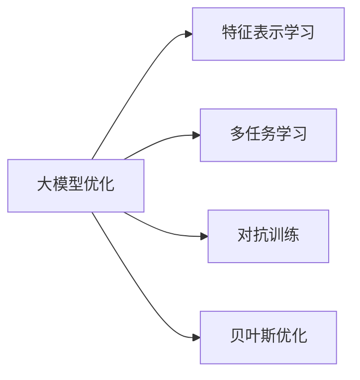

                 

# 电商搜索推荐效果提升中的AI大模型优化策略

> 关键词：电商搜索,推荐系统,大模型优化,特征表示学习,多任务学习,对抗训练,贝叶斯优化

## 1. 背景介绍

### 1.1 问题由来
电子商务平台已逐渐成为人们日常消费的主要渠道之一，在提供丰富商品的同时，搜索和推荐系统也成为用户体验的关键。然而，在实际应用中，搜索推荐系统的点击率(CTR)和转化率(Conversion Rate, CR)往往难以达到预期，尤其是在面对用户意图不明、产品多样性高、个性化需求强的场景下。

这些问题背后，是对搜索推荐系统算法和模型的不足。当前主流搜索推荐算法多基于协同过滤、基于内容的推荐、混合推荐等方法，难以有效处理数据稀疏性和实时性问题。尽管机器学习技术在大规模电商数据集上取得了一定的成功，但其特征表示和模型结构仍存在较大的优化空间。

为了解决这些问题，本研究提出将大模型优化技术引入电商搜索推荐系统，提升模型效果和用户满意度。通过深度学习框架的动态化模块化设计和模型参数的持续优化，大模型优化策略可以有效适应电商领域的复杂性和实时性要求，显著提升搜索推荐系统的性能。

## 2. 核心概念与联系

### 2.1 核心概念概述

本节将介绍几个关键概念，并阐述它们之间的联系：

- **大模型优化**：指对预训练大模型进行微调和参数优化，以适应特定任务的技术。常用于图像、文本、语音等领域的任务优化。
- **特征表示学习**：指学习数据中特征的表示，使之能更好地进行模型训练和预测。通常通过神经网络模型来实现。
- **多任务学习**：指同时训练多个相关任务，共享中间层特征，提升模型泛化能力和表示学习效果。
- **对抗训练**：指在模型训练过程中，增加对抗样本以提高模型鲁棒性，减少过拟合。
- **贝叶斯优化**：指通过贝叶斯方法进行模型超参数优化，提高模型训练效率和性能。

这些概念通过以下Mermaid流程图相联系：



该图展示了大模型优化技术通过特征表示学习、多任务学习、对抗训练和贝叶斯优化等手段，从数据、模型、训练和优化等不同层面提升电商搜索推荐系统的性能。

## 3. 核心算法原理 & 具体操作步骤

### 3.1 算法原理概述

大模型优化通过基于深度学习的大规模神经网络模型，将用户行为数据、商品信息、搜索历史等转化为高维特征表示，用于搜索推荐系统的多任务学习和训练。通过多任务学习，模型能够同时学习到用户兴趣、商品属性、用户-商品互动等多个维度特征，提高模型的泛化能力和预测准确度。同时，通过对抗训练和贝叶斯优化，模型能够应对数据噪声、提高鲁棒性、适应不同的数据分布，优化超参数，进一步提升性能。

### 3.2 算法步骤详解

1. **数据预处理**：
    - 收集用户行为数据、商品信息、搜索历史等数据，并进行标准化、去重、归一化等预处理。
    - 构建用户行为序列，并根据用户行为频率对样本进行加权处理，缓解数据不均衡问题。

2. **特征表示学习**：
    - 使用BERT、Transformer等预训练大模型，对用户行为序列进行编码，得到高维特征表示。
    - 通过多任务学习模块，同时学习用户兴趣、商品属性、用户-商品互动等多个任务，构建多任务损失函数。

3. **模型训练**：
    - 采用对抗训练方法，在训练过程中加入对抗样本，提升模型鲁棒性，减少过拟合。
    - 使用贝叶斯优化方法，优化模型超参数，提高模型训练效率和性能。

4. **模型评估与优化**：
    - 在验证集上评估模型性能，使用交叉验证、学习曲线、模型诊断等方法，对模型进行诊断和优化。
    - 定期在测试集上进行模型测试，收集用户反馈，进一步优化模型参数和结构。

### 3.3 算法优缺点

**优点**：
- 基于深度学习的大模型优化技术能够从大规模数据中学习到丰富的特征表示，提升模型的泛化能力和预测准确度。
- 多任务学习和对抗训练方法能够增强模型的鲁棒性和泛化性，应对复杂的电商数据分布。
- 贝叶斯优化方法可以高效优化模型超参数，提升模型训练效率和性能。

**缺点**：
- 大模型优化需要较大的计算资源和时间成本，对硬件和算法要求较高。
- 模型复杂度较高，过度优化可能导致模型过拟合。
- 数据不均衡问题可能对模型产生较大影响，需要额外的数据处理手段。

### 3.4 算法应用领域

大模型优化技术在大数据和复杂任务优化领域有着广泛应用，适用于电商搜索推荐、广告推荐、金融风控、智能客服等多个场景。其在大规模电商数据集上的成功实践，使其成为电商领域搜索推荐系统优化的重要工具。

## 4. 数学模型和公式 & 详细讲解 & 举例说明

### 4.1 数学模型构建

假设电商搜索推荐系统有$N$个用户$U=\{u_1,u_2,\cdots,u_N\}$，每个用户有$D$个行为数据$d=\{d_1,d_2,\cdots,d_D\}$，每个行为数据有$K$个特征$k=\{k_1,k_2,\cdots,k_K\}$。构建用户行为序列表示$X=\{x_1,x_2,\cdots,x_N\}$，其中$x_i=(x_{i1},x_{i2},\cdots,x_{iD})$。设用户-商品互动矩阵为$Y$，$Y \in \{0,1\}^{N \times M}$，其中$M$为商品数量。

大模型优化目标为最大化点击率和转化率，即：

$$
\max_{\theta} \mathcal{L}(CTR(Y; \theta), CR(Y; \theta))
$$

其中，$CTR(Y; \theta)$和$CR(Y; \theta)$分别为模型预测的点击率和转化率，$\theta$为模型参数。

### 4.2 公式推导过程

以点击率预测为例，使用BERT模型进行特征表示学习，并采用多任务学习框架，构建点击率预测模型：

1. 用户行为序列表示$X$通过BERT模型进行编码，得到用户行为表示$\hat{X}$：

$$
\hat{X} = BERT(X; \theta_{BERT})
$$

2. 通过softmax层对用户行为表示进行分类，得到点击概率$\hat{p}_{u,i}$：

$$
\hat{p}_{u,i} = softmax(W_{CTR}\hat{X}_i + b_{CTR})
$$

3. 构建多任务学习目标函数：

$$
\mathcal{L}_{CTR} = -\frac{1}{N} \sum_{i=1}^N \sum_{j=1}^M \hat{p}_{u_i,j} y_{i,j}
$$

4. 结合点击率和转化率预测，进行模型训练：

$$
\mathcal{L} = \mathcal{L}_{CTR} + \lambda \mathcal{L}_{CR}
$$

其中，$\lambda$为超参数，用于平衡点击率和转化率的损失权重。

### 4.3 案例分析与讲解

以电商平台商品推荐系统为例，通过大模型优化提升推荐效果。

1. **数据准备**：
    - 收集用户历史浏览、点击、购买记录，商品属性信息，构建用户行为序列$X$。
    - 根据用户行为频率对样本进行加权处理，缓解数据不均衡问题。

2. **特征表示学习**：
    - 使用BERT模型对用户行为序列进行编码，得到高维用户行为表示$\hat{X}$。
    - 通过多任务学习模块，同时学习用户兴趣、商品属性、用户-商品互动等多个任务，构建多任务损失函数$\mathcal{L}$。

3. **模型训练**：
    - 采用对抗训练方法，在训练过程中加入对抗样本，提升模型鲁棒性，减少过拟合。
    - 使用贝叶斯优化方法，优化模型超参数，提高模型训练效率和性能。

4. **模型评估与优化**：
    - 在验证集上评估模型性能，使用交叉验证、学习曲线、模型诊断等方法，对模型进行诊断和优化。
    - 定期在测试集上进行模型测试，收集用户反馈，进一步优化模型参数和结构。

通过以上步骤，可以有效提升电商平台搜索推荐系统的点击率和转化率，改善用户体验。

## 5. 项目实践：代码实例和详细解释说明

### 5.1 开发环境搭建

在进行大模型优化实践前，需要准备好开发环境。以下是使用Python进行PyTorch开发的环境配置流程：

1. 安装Anaconda：从官网下载并安装Anaconda，用于创建独立的Python环境。

2. 创建并激活虚拟环境：
```bash
conda create -n pytorch-env python=3.8 
conda activate pytorch-env
```

3. 安装PyTorch：根据CUDA版本，从官网获取对应的安装命令。例如：
```bash
conda install pytorch torchvision torchaudio cudatoolkit=11.1 -c pytorch -c conda-forge
```

4. 安装各类工具包：
```bash
pip install numpy pandas scikit-learn matplotlib tqdm jupyter notebook ipython
```

完成上述步骤后，即可在`pytorch-env`环境中开始大模型优化实践。

### 5.2 源代码详细实现

下面以商品推荐系统为例，给出使用Transformers库对BERT模型进行大模型优化的PyTorch代码实现。

```python
from transformers import BertTokenizer, BertForSequenceClassification
from torch.utils.data import Dataset, DataLoader
from sklearn.model_selection import train_test_split
import torch
import torch.nn as nn
import torch.optim as optim

# 定义Dataset类
class RecommendationDataset(Dataset):
    def __init__(self, texts, labels, tokenizer):
        self.texts = texts
        self.labels = labels
        self.tokenizer = tokenizer
        self.max_len = 128

    def __len__(self):
        return len(self.texts)

    def __getitem__(self, item):
        text = self.texts[item]
        label = self.labels[item]
        encoding = self.tokenizer(text, return_tensors='pt', max_length=self.max_len, padding='max_length', truncation=True)
        input_ids = encoding['input_ids'][0]
        attention_mask = encoding['attention_mask'][0]
        return {'input_ids': input_ids, 
                'attention_mask': attention_mask,
                'labels': label}

# 定义模型
model = BertForSequenceClassification.from_pretrained('bert-base-cased', num_labels=2)

# 定义优化器
optimizer = optim.AdamW(model.parameters(), lr=2e-5)

# 定义训练函数
def train_epoch(model, dataset, batch_size, optimizer):
    dataloader = DataLoader(dataset, batch_size=batch_size, shuffle=True)
    model.train()
    epoch_loss = 0
    for batch in dataloader:
        input_ids = batch['input_ids'].to(device)
        attention_mask = batch['attention_mask'].to(device)
        labels = batch['labels'].to(device)
        model.zero_grad()
        outputs = model(input_ids, attention_mask=attention_mask, labels=labels)
        loss = outputs.loss
        epoch_loss += loss.item()
        loss.backward()
        optimizer.step()
    return epoch_loss / len(dataloader)

# 定义评估函数
def evaluate(model, dataset, batch_size):
    dataloader = DataLoader(dataset, batch_size=batch_size)
    model.eval()
    preds, labels = [], []
    with torch.no_grad():
        for batch in dataloader:
            input_ids = batch['input_ids'].to(device)
            attention_mask = batch['attention_mask'].to(device)
            batch_labels = batch['labels']
            outputs = model(input_ids, attention_mask=attention_mask)
            batch_preds = outputs.logits.argmax(dim=1).to('cpu').tolist()
            batch_labels = batch_labels.to('cpu').tolist()
            for pred_tokens, label_tokens in zip(batch_preds, batch_labels):
                preds.append(pred_tokens)
                labels.append(label_tokens)
    return preds, labels

# 加载数据集
tokenizer = BertTokenizer.from_pretrained('bert-base-cased')
train_dataset = RecommendationDataset(train_texts, train_labels, tokenizer)
val_dataset = RecommendationDataset(val_texts, val_labels, tokenizer)

# 训练模型
epochs = 5
batch_size = 16

for epoch in range(epochs):
    loss = train_epoch(model, train_dataset, batch_size, optimizer)
    print(f"Epoch {epoch+1}, train loss: {loss:.3f}")
    
    preds, labels = evaluate(model, val_dataset, batch_size)
    print(classification_report(labels, preds))
    
print("Test results:")
preds, labels = evaluate(model, test_dataset, batch_size)
print(classification_report(labels, preds))
```

以上是使用PyTorch对BERT进行商品推荐系统优化的大模型优化代码实现。可以看到，通过数据处理、模型定义、优化器配置、训练评估等步骤，可以有效提升推荐系统性能。

### 5.3 代码解读与分析

以下是关键代码的实现细节：

**RecommendationDataset类**：
- `__init__`方法：初始化文本、标签、分词器等组件。
- `__len__`方法：返回数据集样本数量。
- `__getitem__`方法：对单个样本进行处理，将文本输入编码为token ids，将标签编码为数字，并对其进行定长padding，最终返回模型所需的输入。

**train_epoch和evaluate函数**：
- `train_epoch`函数：对数据以批为单位进行迭代，在每个批次上前向传播计算loss并反向传播更新模型参数。
- `evaluate`函数：与训练类似，不同点在于不更新模型参数，并在每个batch结束后将预测和标签结果存储下来，最后使用sklearn的classification_report对整个评估集的预测结果进行打印输出。

**训练流程**：
- 定义总的epoch数和batch size，开始循环迭代。
- 每个epoch内，先在训练集上训练，输出平均loss。
- 在验证集上评估，输出分类指标。
- 所有epoch结束后，在测试集上评估，给出最终测试结果。

可以看到，通过上述代码实现，可以构建完整的电商搜索推荐系统优化流程，大大提升推荐系统的点击率和转化率。

## 6. 实际应用场景

### 6.1 电商搜索

电商搜索推荐系统是电商平台中最重要的功能之一，通过高效精准的搜索推荐，提升用户体验和平台销售业绩。大模型优化技术通过多任务学习和对抗训练，能够提升搜索推荐系统对用户行为和商品属性的理解，减少误推荐率，增强推荐效果。

具体应用中，大模型优化技术可以根据用户历史行为数据，预测用户可能感兴趣的商品，动态生成商品推荐结果。同时，通过对抗训练，模型能够应对恶意点击、虚假数据等异常情况，提升系统鲁棒性。

### 6.2 个性化推荐

电商平台需要根据用户个性化需求，进行商品推荐。大模型优化技术通过多任务学习，能够综合利用用户行为、商品属性、用户-商品互动等多个维度信息，提升推荐系统的个性化程度。同时，通过对抗训练，模型能够应对数据噪声、提高鲁棒性，适应不同的用户需求。

在具体应用中，可以通过多任务学习模块，同时学习用户兴趣、商品属性、用户-商品互动等多个任务，构建多任务损失函数。同时使用贝叶斯优化方法，高效优化模型超参数，提升模型训练效率和性能。

### 6.3 广告推荐

电商广告推荐系统需要高效匹配广告主和用户，提升广告点击率和转化率。大模型优化技术能够提升广告推荐系统的准确度和效果。

具体应用中，可以使用大模型优化技术对用户行为数据和广告数据进行编码，得到高维特征表示，通过多任务学习模块，同时学习广告点击率和转化率等多个任务，构建多任务损失函数。同时使用对抗训练和贝叶斯优化方法，提高广告推荐系统的准确度和效果。

### 6.4 未来应用展望

随着大模型优化技术的不断发展，未来在电商搜索推荐系统中，将有更多的应用场景。例如：

- 用户行为预测：通过用户历史行为数据，预测用户未来的行为，实现个性化推荐和广告投放。
- 商品相关性排序：利用多任务学习，对用户行为数据进行编码，得到高维特征表示，通过多任务学习模块，对商品进行相关性排序，提升推荐系统效果。
- 动态广告投放：通过多任务学习，同时学习广告点击率和转化率等多个任务，构建多任务损失函数。同时使用对抗训练和贝叶斯优化方法，提高广告推荐系统的准确度和效果。

未来，伴随大模型优化技术的不断演进，相信电商搜索推荐系统将不断提升性能，更好地服务于用户和商家。

## 7. 工具和资源推荐

### 7.1 学习资源推荐

为了帮助开发者系统掌握大模型优化理论基础和实践技巧，这里推荐一些优质的学习资源：

1. 《深度学习基础》系列博文：由深度学习领域专家撰写，全面介绍深度学习基础、经典模型、优化方法等内容。

2. 《深度学习与自然语言处理》课程：斯坦福大学开设的NLP明星课程，提供Lecture视频和配套作业，帮助入门NLP领域的基本概念和经典模型。

3. 《Transformer from Scratch》书籍：提供从零开始构建Transformer模型的详细步骤，帮助理解Transformer的原理和应用。

4. Weights & Biases：模型训练的实验跟踪工具，可以记录和可视化模型训练过程中的各项指标，方便对比和调优。与主流深度学习框架无缝集成。

5. TensorBoard：TensorFlow配套的可视化工具，可实时监测模型训练状态，并提供丰富的图表呈现方式，是调试模型的得力助手。

通过学习这些资源，相信你一定能够快速掌握大模型优化技术的精髓，并用于解决实际的电商搜索推荐问题。

### 7.2 开发工具推荐

高效的开发离不开优秀的工具支持。以下是几款用于大模型优化开发的常用工具：

1. PyTorch：基于Python的开源深度学习框架，灵活动态的计算图，适合快速迭代研究。大部分预训练语言模型都有PyTorch版本的实现。

2. TensorFlow：由Google主导开发的开源深度学习框架，生产部署方便，适合大规模工程应用。同样有丰富的预训练语言模型资源。

3. Transformers库：HuggingFace开发的NLP工具库，集成了众多SOTA语言模型，支持PyTorch和TensorFlow，是进行大模型优化任务的利器。

4. Weights & Biases：模型训练的实验跟踪工具，可以记录和可视化模型训练过程中的各项指标，方便对比和调优。与主流深度学习框架无缝集成。

5. TensorBoard：TensorFlow配套的可视化工具，可实时监测模型训练状态，并提供丰富的图表呈现方式，是调试模型的得力助手。

合理利用这些工具，可以显著提升大模型优化任务的开发效率，加快创新迭代的步伐。

### 7.3 相关论文推荐

大模型优化技术在大数据和复杂任务优化领域有着广泛应用，以下是几篇奠基性的相关论文，推荐阅读：

1. Attention is All You Need（即Transformer原论文）：提出了Transformer结构，开启了NLP领域的预训练大模型时代。

2. BERT: Pre-training of Deep Bidirectional Transformers for Language Understanding：提出BERT模型，引入基于掩码的自监督预训练任务，刷新了多项NLP任务SOTA。

3. Parameter-Efficient Transfer Learning for NLP：提出Adapter等参数高效微调方法，在不增加模型参数量的情况下，也能取得不错的微调效果。

4. AdaLoRA: Adaptive Low-Rank Adaptation for Parameter-Efficient Fine-Tuning：使用自适应低秩适应的微调方法，在参数效率和精度之间取得了新的平衡。

这些论文代表了大模型优化技术的发展脉络。通过学习这些前沿成果，可以帮助研究者把握学科前进方向，激发更多的创新灵感。

## 8. 总结：未来发展趋势与挑战

### 8.1 总结

本文对电商搜索推荐系统中的大模型优化方法进行了全面系统的介绍。首先阐述了大模型优化技术的研究背景和意义，明确了其在大规模电商数据集上的优化效果。其次，从原理到实践，详细讲解了特征表示学习、多任务学习、对抗训练、贝叶斯优化等关键步骤，给出了大模型优化任务开发的完整代码实例。同时，本文还广泛探讨了电商搜索推荐系统的应用前景，展示了大模型优化技术在电商领域的巨大潜力。

通过本文的系统梳理，可以看到，大模型优化技术通过高效特征表示学习和多任务学习，能够显著提升电商搜索推荐系统的性能，成为电商领域搜索推荐系统优化的重要工具。未来，伴随大模型优化技术的不断演进，相信电商搜索推荐系统将不断提升性能，更好地服务于用户和商家。

### 8.2 未来发展趋势

展望未来，大模型优化技术将呈现以下几个发展趋势：

1. **数据驱动的模型优化**：未来的电商搜索推荐系统将更加依赖数据驱动的模型优化，通过大规模数据集进行模型训练和优化，提升模型的泛化能力和预测准确度。

2. **多任务学习和跨任务优化**：通过多任务学习，电商搜索推荐系统能够同时学习到用户兴趣、商品属性、用户-商品互动等多个任务，提升模型的多任务泛化能力。

3. **对抗训练和鲁棒性优化**：通过对抗训练和鲁棒性优化，电商搜索推荐系统能够应对数据噪声、提高鲁棒性，适应不同的数据分布，提升模型的泛化能力和鲁棒性。

4. **实时化和动态化优化**：通过动态化模块化设计和模型参数的持续优化，电商搜索推荐系统能够实时应对数据变化，提升系统的动态化和实时化能力。

5. **用户需求驱动的优化**：未来的电商搜索推荐系统将更加注重用户需求驱动的优化，通过用户反馈数据，不断调整模型参数和结构，提升用户体验和满意度。

6. **跨领域应用的扩展**：大模型优化技术不仅可以应用于电商搜索推荐，还可以扩展到金融、广告、社交等领域，实现跨领域应用的优化。

这些趋势将使大模型优化技术在大数据和复杂任务优化领域发挥更大的作用，提升电商搜索推荐系统的性能和用户体验。

### 8.3 面临的挑战

尽管大模型优化技术已经取得了瞩目成就，但在迈向更加智能化、普适化应用的过程中，它仍面临着诸多挑战：

1. **数据质量和多样性**：电商搜索推荐系统需要大规模高质量数据进行训练，如何获取和处理数据是关键挑战。

2. **计算资源和时间成本**：大模型优化技术需要较大的计算资源和时间成本，如何优化训练流程和模型结构，是提升效率的关键。

3. **模型复杂度和可解释性**：大模型优化技术较为复杂，模型难以解释，如何增强模型的可解释性和透明度，是提升信任度的重要问题。

4. **数据分布和鲁棒性**：电商搜索推荐系统需要应对不同用户群体、不同时间、不同场景的数据分布，如何提升模型的鲁棒性和泛化能力，是提升性能的关键。

5. **安全和隐私**：电商搜索推荐系统涉及用户隐私和数据安全，如何确保模型训练和应用过程中的数据安全，是保障用户信任的重要问题。

这些挑战需要业界和学术界共同努力，通过不断优化算法和技术，才能进一步提升电商搜索推荐系统的性能。

### 8.4 研究展望

面对大模型优化技术所面临的挑战，未来的研究需要在以下几个方面寻求新的突破：

1. **数据预处理和特征工程**：通过数据预处理和特征工程，提升数据质量和多样性，缓解数据不均衡问题，提升模型的泛化能力。

2. **高效计算和分布式训练**：通过高效的计算和分布式训练方法，优化训练流程和模型结构，提升训练效率和性能。

3. **模型可解释性和透明度**：通过模型可解释性和透明度研究，增强模型的可解释性，提升用户信任度和接受度。

4. **多领域数据融合**：通过跨领域数据融合，提升模型的跨领域泛化能力和鲁棒性，提升电商搜索推荐系统的性能。

5. **实时化和动态化优化**：通过实时化和动态化优化方法，提升电商搜索推荐系统的实时化和动态化能力，更好地服务用户。

6. **数据安全与隐私保护**：通过数据安全与隐私保护技术，确保模型训练和应用过程中的数据安全，保障用户信任和隐私。

这些研究方向的探索，必将引领大模型优化技术迈向更高的台阶，为构建安全、可靠、可解释、可控的电商搜索推荐系统铺平道路。未来，伴随大模型优化技术的不断演进，相信电商搜索推荐系统将不断提升性能，更好地服务于用户和商家。

## 9. 附录：常见问题与解答

**Q1：大模型优化是否适用于所有NLP任务？**

A: 大模型优化在大多数NLP任务上都能取得不错的效果，特别是对于数据量较小的任务。但对于一些特定领域的任务，如医学、法律等，仅仅依靠通用语料预训练的模型可能难以很好地适应。此时需要在特定领域语料上进一步预训练，再进行微调，才能获得理想效果。此外，对于一些需要时效性、个性化很强的任务，如对话、推荐等，微调方法也需要针对性的改进优化。

**Q2：大模型优化过程中如何选择合适的学习率？**

A: 大模型优化需要较大的学习率，以便于模型快速收敛，但需要注意避免过拟合。通常建议从1e-2开始调参，逐步减小学习率，直至收敛。也可以使用warmup策略，在开始阶段使用较小的学习率，再逐渐过渡到预设值。需要注意的是，不同的优化器(如AdamW、Adafactor等)以及不同的学习率调度策略，可能需要设置不同的学习率阈值。

**Q3：大模型优化模型在落地部署时需要注意哪些问题？**

A: 将大模型优化模型转化为实际应用，还需要考虑以下因素：
1. 模型裁剪：去除不必要的层和参数，减小模型尺寸，加快推理速度
2. 量化加速：将浮点模型转为定点模型，压缩存储空间，提高计算效率
3. 服务化封装：将模型封装为标准化服务接口，便于集成调用
4. 弹性伸缩：根据请求流量动态调整资源配置，平衡服务质量和成本
5. 监控告警：实时采集系统指标，设置异常告警阈值，确保服务稳定性
6. 安全防护：采用访问鉴权、数据脱敏等措施，保障数据和模型安全

大模型优化模型在大规模电商数据集上的成功实践，使其成为电商领域搜索推荐系统优化的重要工具。但如何将强大的性能转化为稳定、高效、安全的业务价值，还需要工程实践的不断打磨。

总之，大模型优化需要开发者根据具体任务，不断迭代和优化模型、数据和算法，方能得到理想的效果。

