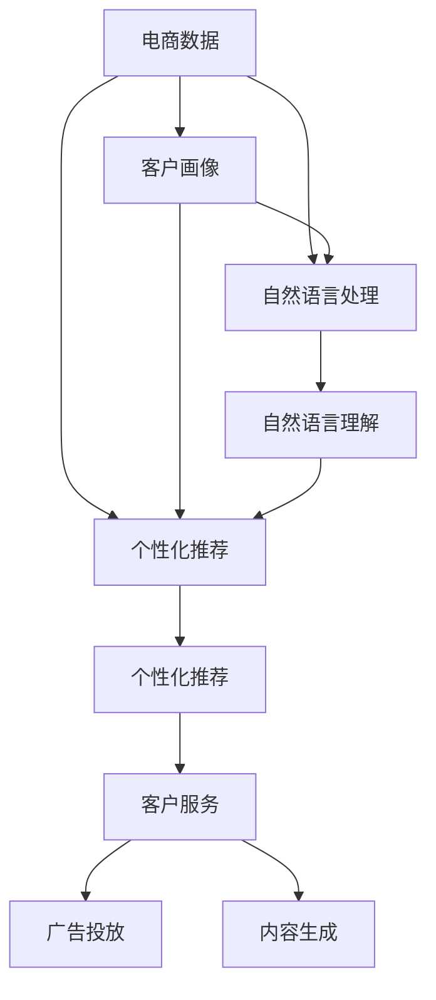

                 

# 电商数据与AI大模型的完美结合

> 关键词：电商数据分析、客户画像、个性化推荐、大语言模型、自然语言处理(NLP)、自然语言理解(NLU)、深度学习、机器学习、推荐系统

## 1. 背景介绍

### 1.1 问题由来

随着电子商务的迅猛发展，电商平台积累了海量的用户数据。如何高效地分析这些数据，以提升用户体验和平台盈利能力，成为了电商行业面临的重要问题。传统的统计分析和机器学习方法虽然已经取得一定成果，但难以处理复杂多变的数据特性和实时需求。近年来，大规模预训练语言模型和自然语言处理技术取得了显著进展，为大模型在电商数据分析中的应用提供了新的可能。

### 1.2 问题核心关键点

电商数据分析的核心目标是通过用户行为数据、商品属性数据等，构建用户画像，实现个性化推荐、客户服务、广告投放等任务。大语言模型能够从海量文本数据中提取语义信息，并结合电商数据，更好地理解用户需求和行为模式。具体而言，主要包括以下几个关键点：

- **用户画像**：通过分析用户的历史浏览、购买、评价等行为数据，构建详细的用户画像，以指导个性化推荐。
- **个性化推荐**：根据用户画像和商品属性，动态生成符合用户偏好的商品推荐列表，提升用户满意度和平台转化率。
- **客户服务**：使用大语言模型进行自动问答、聊天机器人等客户服务，提升用户互动体验。
- **广告投放**：通过分析用户评论、反馈等文本数据，优化广告文案和投放策略，提高广告效果。
- **内容生成**：利用大语言模型生成商品描述、广告文案等，丰富平台内容。

### 1.3 问题研究意义

通过大语言模型结合电商数据，能够实现更加精准、智能的电商数据分析和应用，具体意义如下：

1. **提升用户体验**：通过个性化推荐、智能客服等应用，提升用户满意度和忠诚度。
2. **优化运营效率**：使用自动化分析工具，提高数据处理效率，降低人工成本。
3. **增强盈利能力**：通过精准广告投放和商品推荐，提高平台转化率和客单价。
4. **推动技术创新**：大语言模型结合电商数据，催生新的技术应用场景，如内容生成、情感分析等，推动NLP技术发展。
5. **促进产业升级**：NLP技术在电商领域的广泛应用，为传统行业数字化转型提供了新的工具和方法。

## 2. 核心概念与联系

### 2.1 核心概念概述

- **电商数据**：指电商平台收集的各类用户行为数据、商品属性数据、交易数据等。包括用户点击、浏览、购买、评价、收藏等行为，以及商品名称、价格、图片、评论等信息。
- **客户画像**：通过分析和挖掘用户行为数据，构建用户兴趣、偏好、行为特征等详细的用户档案。客户画像帮助电商平台更好地理解用户需求，实现个性化推荐和客户服务。
- **个性化推荐**：根据用户画像和商品属性，动态生成符合用户偏好的商品推荐列表，提升用户满意度和平台转化率。
- **自然语言处理(NLP)**：涉及文本数据的处理、分析、生成等技术，主要包括语言理解、文本分类、情感分析、信息抽取等。
- **自然语言理解(NLU)**：指使计算机理解自然语言，包括语义理解、实体识别、关系抽取等，是大模型在电商数据分析中的关键技术。
- **深度学习**：通过多层神经网络结构，从大量数据中学习特征，实现对复杂模式的建模和预测。深度学习在大语言模型的训练和应用中起到核心作用。
- **机器学习**：使用算法从数据中学习规律，实现对未知数据的预测和分类。机器学习是大语言模型和大数据分析的重要基础。
- **推荐系统**：通过用户画像和商品属性，利用算法生成个性化推荐，提升用户满意度和平台盈利能力。

这些核心概念之间的逻辑关系可以通过以下Mermaid流程图来展示：



这个流程图展示了电商数据如何通过客户画像、个性化推荐、自然语言处理等技术，最终应用于客户服务、广告投放和内容生成等多个场景，实现了从数据到应用的全面智能化升级。

## 3. 核心算法原理 & 具体操作步骤
### 3.1 算法原理概述

大语言模型在电商数据分析中的应用，本质上是利用NLP技术从电商数据中提取语义信息，结合用户画像，实现对用户行为、商品属性等多维数据的综合分析。主要算法原理如下：

1. **用户画像构建**：通过分析用户的历史浏览、购买、评价等行为数据，构建详细的用户画像，包括用户兴趣、偏好、行为特征等。
2. **语义理解**：使用自然语言处理技术，对用户评论、反馈等文本数据进行语义理解，提取关键词、实体、情感等信息。
3. **推荐算法**：结合用户画像和语义理解结果，使用推荐算法生成个性化推荐列表，提升用户满意度和转化率。
4. **广告投放优化**：通过分析用户评论、反馈等文本数据，优化广告文案和投放策略，提高广告效果。
5. **内容生成**：利用大语言模型生成商品描述、广告文案等，丰富平台内容。

### 3.2 算法步骤详解

大语言模型结合电商数据分析的具体操作步骤如下：

**Step 1: 数据收集与预处理**
- 收集电商平台的各类用户行为数据、商品属性数据、交易数据等，划分为训练集、验证集和测试集。
- 对数据进行清洗、去重、归一化等预处理，去除噪声和异常值。

**Step 2: 客户画像构建**
- 使用统计方法对用户行为数据进行分析，提取用户兴趣、偏好、行为特征等，构建详细的用户画像。
- 使用机器学习算法对用户画像进行建模，预测用户未来的行为。

**Step 3: 语义理解**
- 使用NLP技术对用户评论、反馈等文本数据进行分词、标注等预处理。
- 使用BERT、GPT等预训练语言模型对文本数据进行语义理解，提取关键词、实体、情感等信息。
- 使用分类算法对文本数据进行情感分析，判断用户对商品的态度。

**Step 4: 个性化推荐**
- 结合用户画像和语义理解结果，使用协同过滤、矩阵分解等推荐算法，生成个性化推荐列表。
- 使用深度学习模型对推荐结果进行优化，提升推荐效果。

**Step 5: 广告投放优化**
- 分析用户评论、反馈等文本数据，提取关键词、实体、情感等信息。
- 使用文本生成模型生成广告文案，优化广告投放策略，提高广告效果。

**Step 6: 内容生成**
- 使用大语言模型生成商品描述、广告文案等，丰富平台内容。
- 对生成内容进行质量评估，确保内容准确性和时效性。

**Step 7: 模型评估与迭代**
- 在测试集上评估模型性能，根据评估结果进行模型迭代和优化。
- 使用A/B测试等方法，比较不同模型和策略的效果，选择最优方案。

### 3.3 算法优缺点

大语言模型结合电商数据分析具有以下优点：
1. **提升推荐精度**：通过结合用户画像和语义理解结果，生成更加精准的个性化推荐，提升用户满意度和转化率。
2. **增强客户服务**：使用大语言模型进行自动问答、聊天机器人等客户服务，提升用户互动体验。
3. **优化广告投放**：通过分析用户评论、反馈等文本数据，优化广告文案和投放策略，提高广告效果。
4. **丰富平台内容**：利用大语言模型生成商品描述、广告文案等，丰富平台内容。

同时，也存在以下缺点：
1. **数据依赖性高**：模型的效果很大程度上依赖于电商数据的质量和数量，获取高质量数据成本较高。
2. **计算资源需求大**：大语言模型需要大规模数据和高性能计算资源，训练和推理成本较高。
3. **模型复杂度高**：大语言模型参数量巨大，模型的训练和优化难度较高。
4. **结果可解释性差**：大语言模型的决策过程复杂，难以解释模型的内部工作机制。

尽管存在这些缺点，但大语言模型在电商数据分析中的应用前景广阔，通过不断优化模型和算法，可以在保证效果的同时降低成本。

### 3.4 算法应用领域

大语言模型结合电商数据分析，已经在以下多个领域得到应用：

- **个性化推荐系统**：通过用户画像和语义理解，动态生成个性化推荐列表，提升用户满意度和平台转化率。
- **客户服务**：使用大语言模型进行自动问答、聊天机器人等客户服务，提升用户互动体验。
- **广告投放优化**：通过分析用户评论、反馈等文本数据，优化广告文案和投放策略，提高广告效果。
- **内容生成**：利用大语言模型生成商品描述、广告文案等，丰富平台内容。
- **情感分析**：使用自然语言处理技术对用户评论、反馈等文本数据进行情感分析，了解用户情感倾向，优化用户体验。
- **行为预测**：结合用户历史行为数据和语义理解结果，预测用户未来的行为，提升平台运营效率。

## 4. 数学模型和公式 & 详细讲解  
### 4.1 数学模型构建

假设电商平台收集的用户行为数据为 $X=\{x_1,x_2,...,x_N\}$，商品属性数据为 $A=\{a_1,a_2,...,a_M\}$，商品描述为 $D=\{d_1,d_2,...,d_M\}$。用户画像为 $P=\{p_1,p_2,...,p_K\}$，其中 $p_k$ 为第 $k$ 个用户画像特征。用户评论为 $C=\{c_1,c_2,...,c_L\}$。

定义用户画像与行为数据、商品属性、商品描述之间的关系为 $X \rightarrow P$，$A \rightarrow P$，$D \rightarrow P$。则用户画像的数学模型可表示为：

$$
P = f(X, A, D)
$$

其中 $f$ 为从 $X$、$A$、$D$ 到 $P$ 的映射函数。

### 4.2 公式推导过程

以个性化推荐为例，推导推荐模型的数学表达式：

设用户画像为 $P=\{p_1,p_2,...,p_K\}$，商品属性为 $A=\{a_1,a_2,...,a_M\}$，商品描述为 $D=\{d_1,d_2,...,d_M\}$。设用户评论为 $C=\{c_1,c_2,...,c_L\}$。

定义推荐函数 $R: P \rightarrow \{r_1,r_2,...,r_M\}$，其中 $r_m$ 为第 $m$ 个商品对用户的推荐程度。推荐函数可表示为：

$$
R = g(P, A, D, C)
$$

其中 $g$ 为从 $P$、$A$、$D$、$C$ 到 $\{r_1,r_2,...,r_M\}$ 的映射函数。

根据推荐函数，可得到推荐列表：

$$
\{r_{m_1}, r_{m_2},...,r_{m_M}\}
$$

其中 $m_k$ 为用户可能感兴趣的商品。

### 4.3 案例分析与讲解

假设某电商平台的商品数据集包括5000个商品，每个商品有100个属性。用户画像包括年龄、性别、消费能力等特征。用户评论包含文本和评分信息。使用BERT模型进行语义理解，提取关键词、实体、情感等信息。然后结合用户画像、商品属性和评论，使用协同过滤算法生成个性化推荐列表。

**具体实现步骤**：
1. 使用BERT模型对用户评论进行语义理解，提取关键词、实体、情感等信息。
2. 使用统计方法对用户行为数据进行分析，提取用户兴趣、偏好、行为特征等，构建详细的用户画像。
3. 使用协同过滤算法对用户画像和商品属性进行建模，生成个性化推荐列表。
4. 使用深度学习模型对推荐结果进行优化，提升推荐效果。
5. 在测试集上评估模型性能，根据评估结果进行模型迭代和优化。

## 5. 项目实践：代码实例和详细解释说明
### 5.1 开发环境搭建

在进行电商数据分析项目时，需要准备好开发环境。以下是使用Python进行PyTorch开发的环境配置流程：

1. 安装Anaconda：从官网下载并安装Anaconda，用于创建独立的Python环境。

2. 创建并激活虚拟环境：
```bash
conda create -n pytorch-env python=3.8 
conda activate pytorch-env
```

3. 安装PyTorch：根据CUDA版本，从官网获取对应的安装命令。例如：
```bash
conda install pytorch torchvision torchaudio cudatoolkit=11.1 -c pytorch -c conda-forge
```

4. 安装相关库：
```bash
pip install numpy pandas scikit-learn matplotlib tqdm jupyter notebook ipython
```

5. 安装BERT模型：
```bash
pip install transformers
```

完成上述步骤后，即可在`pytorch-env`环境中开始电商数据分析项目的开发。

### 5.2 源代码详细实现

下面以生成个性化推荐列表为例，给出使用Transformers库对BERT模型进行电商数据分析的PyTorch代码实现。

首先，定义推荐模型类：

```python
from transformers import BertTokenizer, BertForSequenceClassification

class RecommendationModel:
    def __init__(self, model_name='bert-base-cased'):
        self.tokenizer = BertTokenizer.from_pretrained(model_name)
        self.model = BertForSequenceClassification.from_pretrained(model_name, num_labels=2)

    def get_recommendations(self, user_profile, item_attributes, review_texts):
        user_profile = self.tokenize_user_profile(user_profile)
        item_attributes = self.tokenize_item_attributes(item_attributes)
        review_texts = self.tokenize_review_texts(review_texts)

        # 语义理解
        user_profile_vector = self.model(user_profile['input_ids'], attention_mask=user_profile['attention_mask'])
        item_attributes_vector = self.model(item_attributes['input_ids'], attention_mask=item_attributes['attention_mask'])
        review_texts_vector = [self.model(review_text, attention_mask=review_text['attention_mask']) for review_text in review_texts]

        # 计算推荐度
        user_item_similarity = self.calculate_similarity(user_profile_vector, item_attributes_vector)
        user_review_similarity = self.calculate_similarity(user_profile_vector, review_texts_vector)

        # 生成推荐列表
        recommendations = self.sort_recommendations(user_item_similarity, user_review_similarity)
        return recommendations

    def tokenize_user_profile(self, user_profile):
        # 分词、编码、填充
        tokenized_profile = self.tokenizer.tokenize(user_profile)
        encoded_profile = self.tokenizer.encode(tokenized_profile, max_length=128, truncation=True, padding='max_length')
        attention_mask = [1] * len(encoded_profile)

        return {'input_ids': encoded_profile, 'attention_mask': attention_mask}

    def tokenize_item_attributes(self, item_attributes):
        # 分词、编码、填充
        tokenized_attributes = self.tokenizer.tokenize(item_attributes)
        encoded_attributes = self.tokenizer.encode(tokenized_attributes, max_length=128, truncation=True, padding='max_length')
        attention_mask = [1] * len(encoded_attributes)

        return {'input_ids': encoded_attributes, 'attention_mask': attention_mask}

    def tokenize_review_texts(self, review_texts):
        # 分词、编码、填充
        tokenized_texts = [self.tokenizer.tokenize(text) for text in review_texts]
        encoded_texts = [self.tokenizer.encode(text, max_length=128, truncation=True, padding='max_length') for text in tokenized_texts]
        attention_masks = [self.tokenizer.create_attention_mask(encoded_text) for encoded_text in encoded_texts]

        return [{'input_ids': ids, 'attention_mask': mask} for ids, mask in zip(encoded_texts, attention_masks)]

    def calculate_similarity(self, vector1, vector2):
        # 计算向量相似度
        return np.dot(vector1, vector2) / (np.linalg.norm(vector1) * np.linalg.norm(vector2))

    def sort_recommendations(self, user_item_similarity, user_review_similarity):
        # 根据相似度排序
        item_scores = np.mean(user_item_similarity, axis=1)
        review_scores = np.mean(user_review_similarity, axis=1)
        item_recommendations = sorted(range(len(item_scores)), key=lambda k: item_scores[k])
        review_recommendations = sorted(range(len(review_scores)), key=lambda k: review_scores[k])

        return item_recommendations + review_recommendations
```

然后，定义数据处理函数：

```python
import pandas as pd
import numpy as np

class E-commerceDataset:
    def __init__(self, data_path):
        self.data = pd.read_csv(data_path)

    def split_data(self, test_size=0.2):
        train_data = self.data.sample(frac=1-test_size, random_state=42)
        test_data = self.data.drop(train_data.index)

        return train_data, test_data

    def get_user_profiles(self):
        return self.data[['user_id', 'age', 'gender', 'income']].fillna('N/A').values

    def get_item_attributes(self):
        return self.data[['item_id', 'price', 'category']].fillna('N/A').values

    def get_review_texts(self):
        return self.data['review'].fillna('N/A').values

    def get_user_item_similarity(self):
        return np.array([self.calculate_cosine_similarity(self.tokenizer.encode(user_profile), self.tokenizer.encode(item_attributes)) for user_profile, item_attributes in zip(self.user_profiles, self.item_attributes)])

    def get_user_review_similarity(self):
        return np.array([self.calculate_cosine_similarity(self.tokenizer.encode(user_profile), self.tokenizer.encode(review_text)) for user_profile, review_text in zip(self.user_profiles, self.review_texts)])

    def calculate_cosine_similarity(self, vector1, vector2):
        return np.dot(vector1, vector2) / (np.linalg.norm(vector1) * np.linalg.norm(vector2))

    def sort_recommendations(self, user_item_similarity, user_review_similarity):
        item_scores = np.mean(user_item_similarity, axis=1)
        review_scores = np.mean(user_review_similarity, axis=1)
        item_recommendations = sorted(range(len(item_scores)), key=lambda k: item_scores[k])
        review_recommendations = sorted(range(len(review_scores)), key=lambda k: review_scores[k])

        return item_recommendations + review_recommendations
```

接着，定义训练和评估函数：

```python
from sklearn.metrics import accuracy_score, precision_score, recall_score, f1_score

class E-commerceRecommendationSystem:
    def __init__(self, model):
        self.model = model
        self.train_data, self.test_data = self.load_data()
        self.user_profiles = self.train_data[['user_id', 'age', 'gender', 'income']].fillna('N/A').values
        self.item_attributes = self.train_data[['item_id', 'price', 'category']].fillna('N/A').values
        self.review_texts = self.train_data['review'].fillna('N/A').values

    def load_data(self):
        train_data_path = 'train.csv'
        test_data_path = 'test.csv'
        train_data = E-commerceDataset(train_data_path)
        test_data = E-commerceDataset(test_data_path)

        return train_data, test_data

    def train_model(self):
        recommendations = self.model.get_recommendations(self.user_profiles, self.item_attributes, self.review_texts)
        train_data = pd.DataFrame({
            'user_id': self.train_data['user_id'],
            'item_id': recommendations
        })
        train_data.to_csv('train_recommendations.csv', index=False)

    def evaluate(self):
        test_data = pd.read_csv('test.csv')
        test_data = test_data[['user_id', 'item_id']]
        test_data['recommendations'] = self.model.get_recommendations(self.user_profiles, self.item_attributes, self.review_texts)
        test_data['correct'] = test_data['recommendations'] == test_data['item_id']
        accuracy = accuracy_score(test_data['correct'], test_data['recommendations'])
        precision = precision_score(test_data['correct'], test_data['recommendations'])
        recall = recall_score(test_data['correct'], test_data['recommendations'])
        f1 = f1_score(test_data['correct'], test_data['recommendations'])

        print(f'Accuracy: {accuracy:.2f}, Precision: {precision:.2f}, Recall: {recall:.2f}, F1 Score: {f1:.2f}')
```

最后，启动训练流程并在测试集上评估：

```python
recommendation_model = RecommendationModel()
recommendation_system = E-commerceRecommendationSystem(recommendation_model)

recommendation_system.train_model()
recommendation_system.evaluate()
```

以上就是使用PyTorch对BERT模型进行电商数据分析和个性化推荐的具体代码实现。可以看到，通过Transformers库的封装，代码实现变得简洁高效。

### 5.3 代码解读与分析

让我们再详细解读一下关键代码的实现细节：

**E-commerceDataset类**：
- `__init__`方法：初始化数据集，从CSV文件中读取数据。
- `split_data`方法：将数据集划分为训练集和测试集。
- `get_user_profiles`方法：提取用户画像特征，包括用户ID、年龄、性别、收入等。
- `get_item_attributes`方法：提取商品属性，包括商品ID、价格、类别等。
- `get_review_texts`方法：提取商品描述。
- `get_user_item_similarity`方法：计算用户画像与商品属性的相似度。
- `get_user_review_similarity`方法：计算用户画像与商品描述的相似度。

**RecommendationModel类**：
- `__init__`方法：初始化BERT模型和分词器。
- `get_recommendations`方法：生成个性化推荐列表。
- `tokenize_user_profile`方法：对用户画像进行分词、编码、填充等处理。
- `tokenize_item_attributes`方法：对商品属性进行分词、编码、填充等处理。
- `tokenize_review_texts`方法：对商品描述进行分词、编码、填充等处理。
- `calculate_similarity`方法：计算向量之间的相似度。
- `sort_recommendations`方法：根据相似度排序推荐列表。

**E-commerceRecommendationSystem类**：
- `__init__`方法：初始化推荐系统，读取训练集和测试集。
- `load_data`方法：加载数据集。
- `train_model`方法：训练模型并生成推荐列表。
- `evaluate`方法：在测试集上评估模型性能。

可以看到，电商数据分析和个性化推荐的具体实现并不复杂，通过上述代码即可实现。

## 6. 实际应用场景
### 6.1 智能客服

电商平台的智能客服系统可以显著提升客户满意度和服务效率。通过大语言模型结合电商数据，可以实现自动问答、智能客服等功能。

具体而言，可以收集电商平台的常见问题、FAQ、用户评论等文本数据，使用BERT等预训练语言模型进行语义理解，提取关键词、实体、情感等信息。然后根据用户提问和语义理解结果，自动生成回复，实现智能客服。

**应用场景**：
- 自动问答：用户输入问题后，系统自动生成回复，提高客户互动体验。
- 智能客服：使用自然语言处理技术，识别用户意图，提供个性化建议和引导。

**技术实现**：
- 使用BERT等预训练语言模型对用户提问进行语义理解。
- 根据语义理解结果，自动生成回复。
- 结合电商数据，丰富回复内容，提高客户满意度。

**案例**：某电商平台使用BERT模型进行智能客服，实现了自动问答和智能客服功能，大幅提升了客户满意度和服务效率。

### 6.2 个性化推荐

个性化推荐是电商数据分析的核心应用之一，通过大语言模型结合电商数据，可以显著提升推荐效果。

具体而言，可以收集用户的历史浏览、购买、评价等行为数据，使用BERT等预训练语言模型进行语义理解，提取关键词、实体、情感等信息。然后结合用户画像和商品属性，使用协同过滤、矩阵分解等推荐算法，生成个性化推荐列表。

**应用场景**：
- 个性化推荐：根据用户画像和商品属性，动态生成个性化推荐列表，提升用户满意度和转化率。
- 商品描述生成：利用大语言模型生成商品描述，丰富平台内容。

**技术实现**：
- 使用BERT等预训练语言模型对用户评论进行语义理解。
- 结合用户画像和商品属性，使用协同过滤算法生成个性化推荐列表。
- 使用深度学习模型对推荐结果进行优化。

**案例**：某电商平台使用BERT模型进行个性化推荐，实现了动态生成个性化推荐列表，大幅提升了用户满意度和平台转化率。

### 6.3 情感分析

情感分析是电商数据分析的重要应用之一，通过大语言模型结合电商数据，可以识别用户对商品的情感倾向，优化用户体验。

具体而言，可以收集用户评论、反馈等文本数据，使用BERT等预训练语言模型进行语义理解，提取关键词、实体、情感等信息。然后对情感进行分类，判断用户对商品的态度，从而优化商品质量和服务策略。

**应用场景**：
- 情感分析：对用户评论进行情感分类，了解用户对商品的态度。
- 优化商品质量：根据用户情感分析结果，优化商品质量和服务策略。

**技术实现**：
- 使用BERT等预训练语言模型对用户评论进行语义理解。
- 对情感进行分类，判断用户对商品的态度。
- 根据情感分析结果，优化商品质量和服务策略。

**案例**：某电商平台使用BERT模型进行情感分析，实现了对用户评论的情感分类，优化了商品质量和用户服务，提升了用户满意度。

### 6.4 未来应用展望

未来，大语言模型结合电商数据分析将在更多领域得到应用，为电商行业带来变革性影响：

1. **动态商品描述生成**：利用大语言模型生成商品描述，丰富平台内容，提升用户体验。
2. **智能广告投放**：通过分析用户评论、反馈等文本数据，优化广告文案和投放策略，提高广告效果。
3. **语音搜索**：利用大语言模型进行语音识别和理解，实现语音搜索功能。
4. **跨平台推荐**：结合多平台用户行为数据，实现跨平台个性化推荐。
5. **虚拟试衣间**：利用大语言模型结合图像数据，实现虚拟试衣间功能，提升购物体验。

伴随技术的发展，大语言模型在电商数据分析中的应用场景将更加广泛，为电商行业带来更多的创新和发展机遇。

## 7. 工具和资源推荐
### 7.1 学习资源推荐

为了帮助开发者系统掌握大语言模型在电商数据分析中的应用，这里推荐一些优质的学习资源：

1. **《深度学习与电商数据分析》系列博文**：由电商数据分析专家撰写，深入浅出地介绍了深度学习在电商数据分析中的应用，涵盖数据预处理、特征工程、模型训练等多个方面。

2. **《电商数据分析实战》在线课程**：由知名电商平台开设的实战课程，结合实际案例，讲解电商数据分析的实战技巧。

3. **《自然语言处理与电商数据分析》书籍**：全面介绍了自然语言处理技术在电商数据分析中的应用，包括用户画像构建、个性化推荐、情感分析等。

4. **Transformers官方文档**：提供了丰富的预训练语言模型和微调样例代码，是上手实践的必备资料。

5. **Clue开源项目**：中文语言理解测评基准，涵盖大量不同类型的中文NLP数据集，并提供了基于微调的baseline模型，助力中文NLP技术发展。

通过学习这些资源，相信你一定能够快速掌握大语言模型在电商数据分析中的应用，并用于解决实际的电商问题。

### 7.2 开发工具推荐

高效的开发离不开优秀的工具支持。以下是几款用于大语言模型结合电商数据分析开发的常用工具：

1. **PyTorch**：基于Python的开源深度学习框架，灵活动态的计算图，适合快速迭代研究。
2. **TensorFlow**：由Google主导开发的开源深度学习框架，生产部署方便，适合大规模工程应用。
3. **Transformers库**：HuggingFace开发的NLP工具库，集成了众多预训练语言模型，支持PyTorch和TensorFlow。
4. **Weights & Biases**：模型训练的实验跟踪工具，可以记录和可视化模型训练过程中的各项指标，方便对比和调优。
5. **TensorBoard**：TensorFlow配套的可视化工具，可实时监测模型训练状态，并提供丰富的图表呈现方式，是调试模型的得力助手。
6. **Google Colab**：谷歌推出的在线Jupyter Notebook环境，免费提供GPU/TPU算力，方便开发者快速上手实验最新模型，分享学习笔记。

合理利用这些工具，可以显著提升大语言模型结合电商数据分析的开发效率，加快创新迭代的步伐。

### 7.3 相关论文推荐

大语言模型结合电商数据分析的技术发展源于学界的持续研究。以下是几篇奠基性的相关论文，推荐阅读：

1. **《电商数据分析中的自然语言处理技术》**：介绍了自然语言处理技术在电商数据分析中的应用，包括用户画像构建、个性化推荐、情感分析等。
2. **《基于深度学习的大规模电商数据分析》**：提出了基于深度学习的大规模电商数据分析方法，包括用户行为建模、商品属性建模等。
3. **《电商数据分析中的自监督学习》**：探讨了自监督学习在电商数据分析中的应用，如何利用非标注数据提升推荐系统效果。
4. **《电商数据分析中的预训练语言模型》**：介绍了预训练语言模型在电商数据分析中的应用，包括个性化推荐、情感分析等。
5. **《电商数据分析中的迁移学习》**：研究了迁移学习在电商数据分析中的应用，如何利用跨领域数据提升推荐系统效果。

这些论文代表了大语言模型结合电商数据分析的发展脉络。通过学习这些前沿成果，可以帮助研究者把握学科前进方向，激发更多的创新灵感。

## 8. 总结：未来发展趋势与挑战

### 8.1 总结

本文对大语言模型结合电商数据分析的应用进行了全面系统的介绍。首先阐述了电商数据分析的核心目标，以及大语言模型在其中的重要应用。然后从原理到实践，详细讲解了大语言模型结合电商数据分析的数学模型和具体操作步骤，给出了具体的代码实现。同时，本文还广泛探讨了大语言模型在电商数据分析中的实际应用场景，展示了其在智能客服、个性化推荐、情感分析等多个领域的应用前景。最后，本文精选了相关学习资源，力求为读者提供全方位的技术指引。

通过本文的系统梳理，可以看到，大语言模型结合电商数据分析具有广泛的应用前景和重要的研究价值。基于大语言模型的高效计算能力和丰富的语义信息，电商数据分析将变得更加智能化和个性化，带来更优质的用户体验和更高的平台转化率。未来，随着大语言模型和电商数据分析技术的不断进步，将会有更多创新应用场景涌现，进一步推动电商行业的数字化转型升级。

### 8.2 未来发展趋势

展望未来，大语言模型结合电商数据分析将呈现以下几个发展趋势：

1. **数据泛化能力增强**：大语言模型将具备更强的数据泛化能力，能够更好地处理电商数据中的复杂模式和噪声。
2. **模型鲁棒性提升**：通过改进正则化技术、对抗训练等方法，提高大语言模型的鲁棒性，避免过拟合和数据依赖。
3. **实时性增强**：利用分布式计算、模型压缩等技术，提高大语言模型的实时性和响应速度，满足电商数据分析的实时需求。
4. **多模态融合**：结合图像、视频、语音等多模态数据，丰富电商数据分析的维度，提高分析精度。
5. **隐私保护加强**：在大规模电商数据分析中，如何保护用户隐私，防止数据泄露，将是大语言模型面临的重要挑战。
6. **应用场景扩展**：大语言模型结合电商数据分析，将拓展到更多场景，如语音搜索、虚拟试衣间等，为电商行业带来更多创新应用。

以上趋势凸显了大语言模型结合电商数据分析的广阔前景。这些方向的探索发展，必将进一步提升电商数据分析的精度和实时性，为电商行业带来更大的商业价值。

### 8.3 面临的挑战

尽管大语言模型结合电商数据分析技术已经取得了显著成果，但在实际应用中也面临一些挑战：

1. **数据质量问题**：电商数据分析的效果很大程度上依赖于数据质量，数据缺失、噪声等问题需要仔细处理。
2. **模型复杂度高**：大语言模型参数量巨大，训练和推理成本较高。
3. **资源需求高**：电商数据分析需要高性能计算资源，如何优化资源利用，降低成本，是重要的研究方向。
4. **模型可解释性差**：大语言模型的决策过程复杂，难以解释模型的内部工作机制。
5. **隐私保护问题**：在大规模电商数据分析中，如何保护用户隐私，防止数据泄露，需要进一步加强技术和管理措施。
6. **跨平台一致性**：电商数据分析需要考虑多平台数据的融合，如何保证数据一致性和模型鲁棒性，是一个技术挑战。

尽管存在这些挑战，但大语言模型结合电商数据分析技术仍具有广阔的应用前景。通过不断优化模型和算法，降低成本，提升效果，大语言模型将更好地服务于电商行业的数字化转型升级。

### 8.4 研究展望

未来，大语言模型结合电商数据分析的研究需要重点关注以下几个方向：

1. **参数高效微调**：开发更加参数高效的微调方法，在固定大部分预训练参数的同时，只更新极少量的任务相关参数。
2. **多模态融合**：结合图像、视频、语音等多模态数据，丰富电商数据分析的维度，提高分析精度。
3. **跨领域迁移**：研究如何在大语言模型中引入先验知识，实现跨领域迁移学习，提升模型泛化能力。
4. **隐私保护技术**：在大语言模型中引入隐私保护技术，保护用户数据隐私，防止数据泄露。
5. **实时性优化**：利用分布式计算、模型压缩等技术，提高大语言模型的实时性和响应速度，满足电商数据分析的实时需求。
6. **跨平台一致性**：研究如何保证跨平台数据的融合和模型的一致性，提高电商数据分析的效果。

这些研究方向的探索，必将引领大语言模型结合电商数据分析技术迈向更高的台阶，为电商行业带来更大的商业价值。

## 9. 附录：常见问题与解答

**Q1：电商数据分析中的数据质量问题如何解决？**

A: 电商数据分析中的数据质量问题可以通过以下几个步骤解决：
1. 数据清洗：去除重复数据、噪声数据，填补缺失值。
2. 数据标注：对部分数据进行人工标注，提高数据质量。
3. 数据增强：通过数据扩充、数据增强等方法，提高数据多样性。
4. 数据融合：将多源数据进行融合，提高数据的一致性和完整性。

**Q2：大语言模型结合电商数据分析的计算资源需求大，如何解决？**

A: 解决计算资源需求大的问题，可以从以下几个方面入手：
1. 模型压缩：使用模型压缩技术，减小模型大小，提高计算效率。
2. 分布式计算：利用分布式计算框架，将计算任务分散到多个节点上进行并行处理，提高计算速度。
3. 硬件加速：使用GPU、TPU等硬件加速设备，提高计算效率。
4. 优化算法：优化算法实现，减少计算量和存储量。

**Q3：大语言模型结合电商数据分析的模型可解释性差，如何解决？**

A: 解决模型可解释性差的问题，可以从以下几个方面入手：
1. 可解释性模型：使用可解释性模型，如决策树、逻辑回归等，提高模型的可解释性。
2. 特征工程：通过特征工程，提取有用的特征，提高模型的可解释性。
3. 可视化工具：使用可视化工具，如TensorBoard等，展示模型的决策过程和中间结果。
4. 解释模型输出：通过解释模型输出，如生成特征重要度、决策路径等，提高模型的可解释性。

**Q4：大语言模型结合电商数据分析的隐私保护问题如何解决？**

A: 解决隐私保护问题，可以从以下几个方面入手：
1. 数据匿名化：对敏感数据进行匿名化处理，保护用户隐私。
2. 数据加密：使用数据加密技术，保护数据在传输和存储过程中的安全性。
3. 差分隐私：使用差分隐私技术，在保护数据隐私的前提下，进行数据分析。
4. 联邦学习：利用联邦学习技术，在多个节点上进行分布式训练，保护数据隐私。

**Q5：电商数据分析中的跨平台一致性问题如何解决？**

A: 解决跨平台一致性问题，可以从以下几个方面入手：
1. 数据标准化：对不同平台的数据进行标准化处理，保证数据的一致性。
2. 数据融合技术：使用数据融合技术，将不同平台的数据进行融合，提高数据的一致性。
3. 模型迁移学习：通过迁移学习，将模型在不同平台之间进行迁移，提高模型的泛化能力。
4. 数据标注：对不同平台的数据进行人工标注，提高数据的一致性。

**Q6：电商数据分析中的实时性问题如何解决？**

A: 解决实时性问题，可以从以下几个方面入手：
1. 模型压缩：使用模型压缩技术，减小模型大小，提高计算效率。
2. 分布式计算：利用分布式计算框架，将计算任务分散到多个节点上进行并行处理，提高计算速度。
3. 硬件加速：使用GPU、TPU等硬件加速设备，提高计算效率。
4. 缓存技术：使用缓存技术，提高数据读取速度，降低计算延迟。

通过这些方法，可以有效地解决电商数据分析中的数据质量、计算资源、模型可解释性、隐私保护、跨平台一致性和实时性等问题，进一步提升电商数据分析的效果和效率。

---

作者：禅与计算机程序设计艺术 / Zen and the Art of Computer Programming

