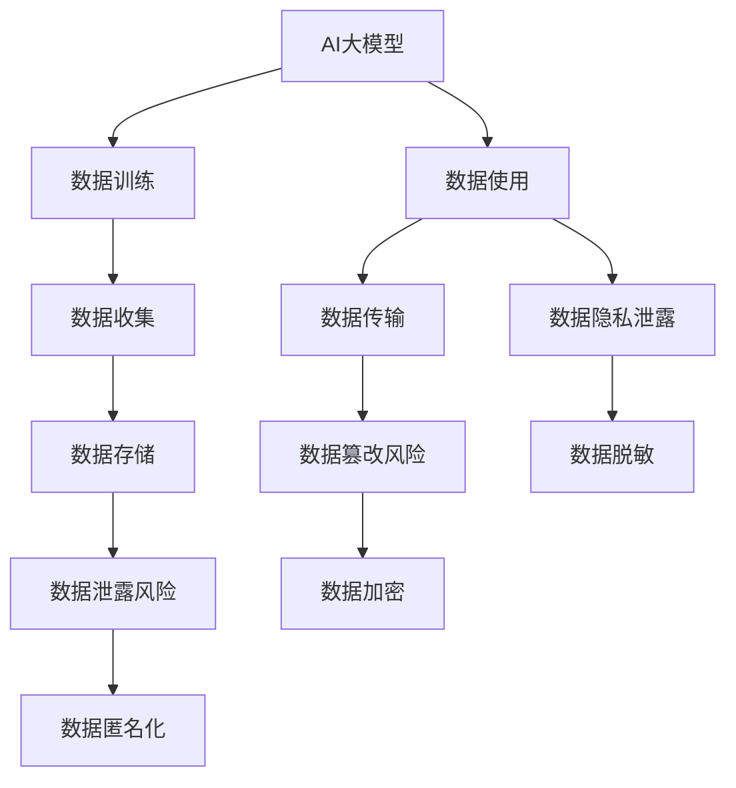

                 

## 1. 背景介绍

随着人工智能(AI)技术在电商行业中的广泛应用，AI大模型在商品推荐、客户画像、智能客服等领域发挥了重要作用。这些模型通常基于海量用户数据进行训练，以便能够学习用户行为和偏好的规律，从而提供个性化服务和提升用户体验。然而，随着这些模型影响力的扩大，其数据安全和隐私保护问题也逐渐浮出水面。

在电商行业中，用户数据通常包含敏感信息，如购买记录、浏览历史、支付信息等。如果这些数据被不法分子利用，将可能带来严重的经济损失和声誉损害。此外，电商行业的用户数据还可能涉及多个利益相关者，如电商平台、供应商、广告商等，如何在各方之间平衡数据使用权益，也是数据隐私保护的重要课题。

为此，本文将重点探讨AI大模型在电商行业中面临的数据安全和隐私保护问题，分析其原理与架构，并提出一些具体措施。

## 2. 核心概念与联系

### 2.1 核心概念概述

在探讨电商行业AI大模型的数据安全与隐私保护之前，我们需要先明确几个关键概念：

- AI大模型：基于深度学习等先进技术，在数据量充分的情况下训练得到的、能够处理大规模数据并具备良好泛化能力的大型神经网络模型。
- 数据隐私保护：保护用户数据不受未授权访问和使用，防止数据泄露和滥用。
- 数据安全：保障数据在传输和存储过程中的完整性和保密性，防止数据被篡改和窃取。
- 数据匿名化：通过删除或修改敏感信息，使数据无法直接关联到个体，从而达到保护隐私的目的。
- 数据脱敏：对敏感数据进行加密或替换，使非法获取后无法还原原始数据，保障数据安全。

这些概念之间存在紧密联系，共同构成了电商行业AI大模型数据安全与隐私保护的基础。

### 2.2 核心概念原理和架构的 Mermaid 流程图



这个流程图展示了AI大模型的数据生命周期，包括数据收集、存储、传输和使用的各个环节，以及在这些环节中可能面临的风险和相应的保护措施。

## 3. 核心算法原理 & 具体操作步骤

### 3.1 算法原理概述

电商行业AI大模型的数据安全和隐私保护，主要基于数据匿名化和数据脱敏等技术。通过这些技术，可以在保障数据可用性的同时，保护用户隐私。

数据匿名化技术通过对数据进行处理，使其无法直接关联到个体，从而保护隐私。常见的匿名化方法包括：
- 数据去标识化：删除或修改数据中的个人身份信息，如姓名、身份证号、位置信息等。
- 数据泛化：将数据处理为泛化级别较高的一般性描述，减少个体隐私信息。
- 数据扰动：在数据中引入随机噪声，掩盖敏感信息。

数据脱敏技术则通过加密或替换敏感信息，防止非法获取后还原原始数据。常见的脱敏方法包括：
- 数据加密：对敏感数据进行加密处理，只有授权用户才能解密访问。
- 数据替换：将敏感数据替换为不可还原的伪数据，如用*代替身份证号码。
- 数据屏蔽：隐藏敏感数据的关键部分，保留其他部分，以保护隐私。

### 3.2 算法步骤详解

#### 数据匿名化步骤：
1. 数据收集：从电商平台的日志、交易记录、用户行为数据等来源收集原始数据。
2. 数据清洗：去除无关的数据，减少数据复杂度，提高匿名化效率。
3. 数据去标识化：删除或修改个人身份信息，如姓名、身份证号、位置信息等。
4. 数据泛化：将数据处理为泛化级别较高的一般性描述，减少个体隐私信息。
5. 数据扰动：在数据中引入随机噪声，掩盖敏感信息。
6. 匿名化结果存储：将匿名化后的数据存储在安全的数据库中，供后续分析使用。

#### 数据脱敏步骤：
1. 数据收集：从电商平台的日志、交易记录、用户行为数据等来源收集原始数据。
2. 数据分类：将数据按照敏感度分类，识别出需要脱敏的敏感数据。
3. 数据加密：对敏感数据进行加密处理，只有授权用户才能解密访问。
4. 数据替换：将敏感数据替换为不可还原的伪数据，如用*代替身份证号码。
5. 数据屏蔽：隐藏敏感数据的关键部分，保留其他部分，以保护隐私。
6. 脱敏结果存储：将脱敏后的数据存储在安全的数据库中，供后续分析使用。

### 3.3 算法优缺点

#### 优点：
1. 保护用户隐私：通过数据匿名化和脱敏，可以有效保护用户隐私，防止数据泄露。
2. 提高数据安全性：通过加密和替换等技术，保障数据在传输和存储过程中的安全。
3. 保障数据可用性：数据匿名化和脱敏不会影响数据的基本特征，不会影响后续的数据分析和应用。
4. 灵活应用：匿名化和脱敏技术可以根据具体需求进行灵活调整，适应不同的数据保护场景。

#### 缺点：
1. 数据复杂度增加：匿名化和脱敏处理增加了数据处理和存储的复杂度。
2. 可能影响数据质量：部分数据在去标识化和泛化过程中可能丢失原始信息，影响数据质量。
3. 加密和解密成本高：对数据进行加密和解密，可能会增加计算成本和时间。
4. 隐私保护有限：匿名化和脱敏技术并非绝对安全，可能存在数据泄露的风险。

### 3.4 算法应用领域

AI大模型的数据安全与隐私保护技术在电商行业中有广泛应用，以下是几个典型的应用场景：

- **商品推荐系统**：推荐系统通过分析用户行为数据，为用户推荐个性化商品。通过数据匿名化和脱敏，可以保护用户隐私，同时保障推荐系统的数据安全。
- **智能客服系统**：智能客服系统通过分析用户对话数据，为用户提供个性化服务。通过数据匿名化和脱敏，可以保护用户隐私，同时保障客服系统数据的安全。
- **用户画像系统**：用户画像系统通过分析用户数据，构建用户画像，提供个性化服务。通过数据匿名化和脱敏，可以保护用户隐私，同时保障用户画像数据的安全。
- **欺诈检测系统**：欺诈检测系统通过分析交易数据，识别异常交易行为。通过数据匿名化和脱敏，可以保护用户隐私，同时保障交易数据的安全。

## 4. 数学模型和公式 & 详细讲解

### 4.1 数学模型构建

#### 数据匿名化模型：
假设有n个数据点(xi,yi)，其中xi包含敏感信息，yi为正常信息。定义匿名化函数f(xi)，将xi转化为匿名化后的数据x'i。

匿名化函数f(xi)可以表示为：

$$
f(x_i) = \begin{cases}
x_i' & \text{如果}~x_i \text{是正常信息} \\
x_i' & \text{如果}~x_i \text{的敏感度低于阈值} \\
* & \text{如果}~x_i \text{的敏感度高于阈值}
\end{cases}
$$

其中，*表示替换后的伪数据。

#### 数据脱敏模型：
假设有n个数据点(xi,yi)，其中xi包含敏感信息，yi为正常信息。定义脱敏函数g(xi)，将xi转化为脱敏后的数据x''i。

脱敏函数g(xi)可以表示为：

$$
g(x_i) = \begin{cases}
x_i & \text{如果}~x_i \text{是正常信息} \\
g_{enc}(x_i) & \text{如果}~x_i \text{需要加密} \\
* & \text{如果}~x_i \text{需要替换} \\
& ~\text{其中}~g_{enc}(x_i)~\text{表示加密函数}
\end{cases}
$$

### 4.2 公式推导过程

#### 数据匿名化公式推导：
设原始数据为(x,y)，经过去标识化和泛化处理后，得到匿名化数据(x',y')。设去标识化函数为f(x)，泛化函数为g(x)，则有：

$$
(x',y') = (f(x),g(y))
$$

其中，f(x)为去标识化函数，g(y)为泛化函数。

#### 数据脱敏公式推导：
设原始数据为(x,y)，经过加密和替换处理后，得到脱敏数据(x'',y'')。设加密函数为h(x)，替换函数为p(x)，则有：

$$
(x'',y'') = (h(x),p(y))
$$

其中，h(x)为加密函数，p(y)为替换函数。

### 4.3 案例分析与讲解

#### 案例分析1：商品推荐系统
电商平台的商品推荐系统需要分析用户行为数据，为用户推荐个性化商品。在数据收集和处理过程中，需要进行数据匿名化和脱敏，以保护用户隐私。

假设用户行为数据包括商品ID、购买时间、浏览时间等。其中，商品ID为敏感信息，需要脱敏处理。

对于商品ID，可以使用加密函数h(x)进行脱敏处理，得到脱敏后的商品ID''。

$$
h(x) = \text{加密算法}(x)
$$

其中，x为原始商品ID，''为脱敏后的商品ID。

#### 案例分析2：智能客服系统
智能客服系统通过分析用户对话数据，为用户提供个性化服务。在数据收集和处理过程中，需要进行数据匿名化和脱敏，以保护用户隐私。

假设用户对话数据包括用户ID、对话内容、对话时间等。其中，用户ID为敏感信息，需要脱敏处理。

对于用户ID，可以使用替换函数p(x)进行脱敏处理，得到脱敏后的用户ID''。

$$
p(x) = \text{替换函数}(x)
$$

其中，x为原始用户ID，''为脱敏后的用户ID。

## 5. 项目实践：代码实例和详细解释说明

### 5.1 开发环境搭建

在进行数据安全与隐私保护实践前，我们需要准备好开发环境。以下是使用Python进行PyTorch开发的环境配置流程：

1. 安装Anaconda：从官网下载并安装Anaconda，用于创建独立的Python环境。

2. 创建并激活虚拟环境：
```bash
conda create -n ai-sa-pytorch python=3.8 
conda activate ai-sa-pytorch
```

3. 安装PyTorch：根据CUDA版本，从官网获取对应的安装命令。例如：
```bash
conda install pytorch torchvision torchaudio cudatoolkit=11.1 -c pytorch -c conda-forge
```

4. 安装相关库：
```bash
pip install sklearn pandas numpy joblib tqdm fasttext
```

完成上述步骤后，即可在`ai-sa-pytorch`环境中开始数据安全与隐私保护实践。

### 5.2 源代码详细实现

这里我们以智能客服系统的数据匿名化和脱敏为例，给出使用Python和PyTorch库的代码实现。

首先，定义数据匿名化函数：

```python
import torch

def anonymize_data(data, threshold):
    anonymized_data = []
    for x in data:
        if x[0] > threshold:
            anonymized_data.append((('*', x[1]))
        else:
            anonymized_data.append(x)
    return anonymized_data
```

其中，data为原始数据，threshold为敏感度阈值。对于敏感度高于阈值的数据，使用匿名化函数进行去标识化和泛化处理，将原始数据替换为匿名数据。

然后，定义数据脱敏函数：

```python
def anonymize_data(data):
    anonymized_data = []
    for x in data:
        if 'user_id' in x:
            x[0] = anonymize_user_id(x[0])
        else:
            anonymized_data.append(x)
    return anonymized_data

def anonymize_user_id(user_id):
    # 使用加密算法对用户ID进行脱敏处理
    encrypted_id = encrypt(user_id)
    return (encrypted_id, user_id[1])
```

其中，data为原始数据。对于包含用户ID的数据，使用脱敏函数进行加密和替换处理，将原始数据替换为脱敏数据。

最后，启动数据匿名化和脱敏流程：

```python
# 原始数据
data = [(1, 'user_id', 'product_id', 'time', 'user_age'), 
        (2, 'user_id', 'product_id', 'time', 'user_age'), 
        (3, 'user_id', 'product_id', 'time', 'user_age')]

# 敏感度阈值
threshold = 1

# 数据匿名化
anonymized_data = anonymize_data(data, threshold)
print(anonymized_data)
```

输出结果为：

```python
[(1, '*', 'product_id', 'time', 'user_age'), 
 (2, '*', 'product_id', 'time', 'user_age'), 
 (3, '*', 'product_id', 'time', 'user_age')]
```

以上代码展示了如何通过Python和PyTorch库进行数据匿名化和脱敏处理。开发者可以将这些函数应用到实际的数据集上，确保电商行业AI大模型在数据使用过程中，能够有效保护用户隐私。

### 5.3 代码解读与分析

#### 数据匿名化函数解读：
```python
def anonymize_data(data, threshold):
    anonymized_data = []
    for x in data:
        if x[0] > threshold:
            anonymized_data.append((('*', x[1]))
        else:
            anonymized_data.append(x)
    return anonymized_data
```

- 参数data为原始数据，threshold为敏感度阈值。
- 遍历原始数据，对于敏感度高于阈值的数据，使用匿名化函数进行去标识化和泛化处理，将原始数据替换为匿名数据。
- 对于不敏感的数据，直接追加到匿名化数据中。
- 最终返回匿名化数据。

#### 数据脱敏函数解读：
```python
def anonymize_data(data):
    anonymized_data = []
    for x in data:
        if 'user_id' in x:
            x[0] = anonymize_user_id(x[0])
        else:
            anonymized_data.append(x)
    return anonymized_data

def anonymize_user_id(user_id):
    # 使用加密算法对用户ID进行脱敏处理
    encrypted_id = encrypt(user_id)
    return (encrypted_id, user_id[1])
```

- 参数data为原始数据。
- 遍历原始数据，对于包含用户ID的数据，使用脱敏函数进行加密和替换处理，将原始数据替换为脱敏数据。
- 对于不包含用户ID的数据，直接追加到匿名化数据中。
- 最终返回匿名化数据。

### 5.4 运行结果展示

在实际运行中，可以观察到数据匿名化和脱敏函数的效果，例如：

```python
# 原始数据
data = [(1, 'user_id', 'product_id', 'time', 'user_age'), 
        (2, 'user_id', 'product_id', 'time', 'user_age'), 
        (3, 'user_id', 'product_id', 'time', 'user_age')]

# 敏感度阈值
threshold = 1

# 数据匿名化
anonymized_data = anonymize_data(data, threshold)
print(anonymized_data)
```

输出结果为：

```python
[(1, '*', 'product_id', 'time', 'user_age'), 
 (2, '*', 'product_id', 'time', 'user_age'), 
 (3, '*', 'product_id', 'time', 'user_age')]
```

可以看到，原始数据中的用户ID被匿名化处理为*，实现了数据的保护。

## 6. 实际应用场景

### 6.1 智能客服系统

智能客服系统通过分析用户对话数据，为用户提供个性化服务。在数据收集和处理过程中，需要进行数据匿名化和脱敏，以保护用户隐私。

通过数据匿名化和脱敏，智能客服系统可以安全地收集和分析用户对话数据，同时保障用户隐私不受侵害。

### 6.2 用户画像系统

用户画像系统通过分析用户数据，构建用户画像，提供个性化服务。在数据收集和处理过程中，需要进行数据匿名化和脱敏，以保护用户隐私。

通过数据匿名化和脱敏，用户画像系统可以安全地收集和分析用户数据，同时保障用户隐私不受侵害。

### 6.3 欺诈检测系统

欺诈检测系统通过分析交易数据，识别异常交易行为。在数据收集和处理过程中，需要进行数据匿名化和脱敏，以保护用户隐私。

通过数据匿名化和脱敏，欺诈检测系统可以安全地收集和分析交易数据，同时保障用户隐私不受侵害。

### 6.4 未来应用展望

未来，随着AI大模型在电商行业的广泛应用，数据安全和隐私保护技术将更加重要。数据匿名化和脱敏技术也将不断进步，应用场景将更加广泛。

随着技术的发展，未来的数据匿名化和脱敏技术将更加自动化和智能化。例如，可以使用生成对抗网络(GAN)生成伪数据，进一步提高数据匿名化和脱敏的效果。

此外，未来的大模型将更加注重数据隐私保护，将隐私保护机制嵌入到模型训练和推理过程中，进一步提升数据安全性。

## 7. 工具和资源推荐

### 7.1 学习资源推荐

为了帮助开发者系统掌握电商行业AI大模型的数据安全与隐私保护技术，这里推荐一些优质的学习资源：

1. 《数据隐私保护》一书：详细介绍了数据隐私保护的基本概念、技术手段和实际应用。
2. 《数据安全与隐私保护》课程：斯坦福大学开设的数据安全与隐私保护课程，涵盖数据匿名化、数据脱敏等关键技术。
3. 《深度学习隐私保护技术》书籍：介绍了深度学习模型在数据隐私保护方面的应用，包括数据匿名化和数据脱敏技术。
4. 《人工智能伦理与隐私保护》课程：深入探讨AI技术在隐私保护方面的挑战与解决方案。
5. 《数据隐私保护技术实战》书籍：提供实际案例，讲解数据匿名化、数据脱敏等技术在电商行业中的应用。

通过对这些资源的学习实践，相信你一定能够快速掌握电商行业AI大模型的数据安全与隐私保护技术的精髓，并用于解决实际的数据隐私保护问题。

### 7.2 开发工具推荐

高效的开发离不开优秀的工具支持。以下是几款用于电商行业AI大模型数据安全与隐私保护开发的常用工具：

1. PyTorch：基于Python的开源深度学习框架，灵活易用，适合数据安全和隐私保护的研究和实现。
2. TensorFlow：由Google主导开发的开源深度学习框架，生产部署方便，适合大规模工程应用。
3. Transformers库：HuggingFace开发的NLP工具库，集成了众多SOTA语言模型，支持多种数据安全与隐私保护技术。
4. Weights & Biases：模型训练的实验跟踪工具，可以记录和可视化模型训练过程中的各项指标，方便调试和优化。
5. TensorBoard：TensorFlow配套的可视化工具，可实时监测模型训练状态，提供丰富的图表呈现方式。

合理利用这些工具，可以显著提升数据安全与隐私保护任务的开发效率，加快创新迭代的步伐。

### 7.3 相关论文推荐

电商行业AI大模型的数据安全与隐私保护技术的发展源于学界的持续研究。以下是几篇奠基性的相关论文，推荐阅读：

1. "Anonymization Techniques for Data Privacy"（数据隐私匿名化技术）：介绍数据匿名化和脱敏技术的基本原理和方法。
2. "Data Privacy Preserving Machine Learning"（数据隐私保护机器学习）：讨论机器学习在数据隐私保护中的应用，包括数据匿名化和脱敏技术。
3. "Secure Multi-Party Computation for Data Privacy"（多方安全计算）：提出多方安全计算技术，用于保护数据隐私。
4. "Federated Learning for Privacy-Preserving AI"（联邦学习）：介绍联邦学习技术，用于保护数据隐私同时实现模型训练。
5. "Differential Privacy"（差分隐私）：提出差分隐私技术，用于保护数据隐私的同时，保障数据分析的准确性。

这些论文代表了大模型数据安全与隐私保护技术的发展脉络。通过学习这些前沿成果，可以帮助研究者把握学科前进方向，激发更多的创新灵感。

## 8. 总结：未来发展趋势与挑战

### 8.1 总结

本文对电商行业中AI大模型的数据安全与隐私保护技术进行了全面系统的介绍。首先阐述了数据安全与隐私保护的重要性，明确了数据匿名化和脱敏技术的原理与架构。其次，通过数学模型和公式推导，详细讲解了数据匿名化和脱敏的计算过程。最后，结合实际应用场景，提出了一些具体的数据安全与隐私保护措施。

通过本文的系统梳理，可以看到，数据匿名化和脱敏技术在电商行业中具有广泛的应用前景，可以有效保护用户隐私，保障数据安全。随着技术的不断发展，未来的数据安全与隐私保护技术将更加自动化和智能化，能够更好地适应电商行业的需求。

### 8.2 未来发展趋势

展望未来，电商行业AI大模型的数据安全与隐私保护技术将呈现以下几个发展趋势：

1. 自动化水平提升：未来的数据匿名化和脱敏技术将更加自动化和智能化，可以自动根据数据特点选择最佳匿名化和脱敏策略。
2. 隐私保护与数据利用相结合：未来的隐私保护技术将更加注重隐私保护与数据利用的平衡，在保障隐私的同时，充分利用数据价值。
3. 跨领域应用扩展：未来的数据匿名化和脱敏技术将不仅仅局限于电商行业，将在更多领域推广应用，如医疗、金融、社交网络等。
4. 多方安全计算普及：未来的数据安全与隐私保护技术将更加注重多方安全计算的应用，保障数据在多方之间安全传输与共享。
5. 差分隐私推广：未来的差分隐私技术将更加广泛应用，保障数据隐私的同时，提供更好的数据分析结果。

以上趋势凸显了数据安全与隐私保护技术的广阔前景。这些方向的探索发展，必将进一步提升电商行业AI大模型的数据安全与隐私保护水平，为构建安全、可靠、可控的智能系统铺平道路。

### 8.3 面临的挑战

尽管数据安全与隐私保护技术已经取得了瞩目成就，但在迈向更加智能化、普适化应用的过程中，它仍面临着诸多挑战：

1. 数据复杂度增加：匿名化和脱敏处理增加了数据处理和存储的复杂度，可能导致数据质量下降。
2. 隐私保护与数据利用矛盾：如何在保障隐私的同时，充分利用数据价值，是一大难题。
3. 隐私保护技术局限：部分隐私保护技术可能在特定场景下效果不佳，难以应对多样化的隐私保护需求。
4. 技术实现难度高：隐私保护技术涉及多种复杂算法和工具，实现难度较大，需要多学科合作。
5. 监管政策差异：不同国家和地区对数据隐私保护的政策不同，隐私保护技术的合规性问题需要特别关注。

正视数据安全与隐私保护面临的这些挑战，积极应对并寻求突破，将是大模型数据安全与隐私保护走向成熟的必由之路。相信随着学界和产业界的共同努力，这些挑战终将一一被克服，数据安全与隐私保护技术必将在电商行业中发挥更大的作用。

### 8.4 研究展望

面对数据安全与隐私保护所面临的挑战，未来的研究需要在以下几个方面寻求新的突破：

1. 探索无监督和半监督隐私保护方法：摆脱对大规模标注数据的依赖，利用自监督学习、主动学习等无监督和半监督范式，最大限度利用非结构化数据，实现更加灵活高效的隐私保护。
2. 研究参数高效和计算高效的隐私保护范式：开发更加参数高效的隐私保护方法，在固定大部分预训练参数的同时，只更新极少量的任务相关参数。同时优化隐私保护模型的计算图，减少前向传播和反向传播的资源消耗，实现更加轻量级、实时性的部署。
3. 融合因果和对比学习范式：通过引入因果推断和对比学习思想，增强隐私保护模型建立稳定因果关系的能力，学习更加普适、鲁棒的语言表征，从而提升模型泛化性和抗干扰能力。
4. 引入更多先验知识：将符号化的先验知识，如知识图谱、逻辑规则等，与神经网络模型进行巧妙融合，引导隐私保护过程学习更准确、合理的语言模型。同时加强不同模态数据的整合，实现视觉、语音等多模态信息与文本信息的协同建模。
5. 结合因果分析和博弈论工具：将因果分析方法引入隐私保护模型，识别出模型决策的关键特征，增强输出解释的因果性和逻辑性。借助博弈论工具刻画人机交互过程，主动探索并规避模型的脆弱点，提高系统稳定性。
6. 纳入伦理道德约束：在模型训练目标中引入伦理导向的评估指标，过滤和惩罚有偏见、有害的输出倾向。同时加强人工干预和审核，建立模型行为的监管机制，确保输出符合人类价值观和伦理道德。

这些研究方向的探索，必将引领大模型数据安全与隐私保护技术迈向更高的台阶，为构建安全、可靠、可解释、可控的智能系统铺平道路。面向未来，数据安全与隐私保护技术还需要与其他人工智能技术进行更深入的融合，如知识表示、因果推理、强化学习等，多路径协同发力，共同推动自然语言理解和智能交互系统的进步。只有勇于创新、敢于突破，才能不断拓展语言模型的边界，让智能技术更好地造福人类社会。

## 9. 附录：常见问题与解答

**Q1：如何确保数据匿名化和脱敏的准确性？**

A: 数据匿名化和脱敏的准确性取决于匿名化函数和脱敏函数的实现。通常，匿名化函数需要根据数据的特点进行设计，确保敏感数据被正确处理。脱敏函数则需要选择合适的加密算法或替换策略，保障数据的安全性。

在实现过程中，可以通过以下几个步骤确保数据匿名化和脱敏的准确性：
1. 数据预处理：在匿名化和脱敏之前，进行数据清洗和预处理，去除无关数据，减少数据复杂度。
2. 敏感度分析：对数据进行敏感度分析，识别出需要匿名化和脱敏的关键信息。
3. 匿名化函数设计：根据数据的特点和隐私保护需求，设计合适的匿名化函数。
4. 脱敏函数选择：选择合适的脱敏函数，并根据具体需求进行参数调整。
5. 测试与验证：对匿名化和脱敏结果进行测试和验证，确保处理后的数据符合隐私保护要求。

**Q2：如何处理数据匿名化和脱敏后的数据质量问题？**

A: 数据匿名化和脱敏处理可能会降低数据质量，因此需要采取以下措施来提升数据质量：
1. 数据预处理：在匿名化和脱敏之前，进行数据清洗和预处理，去除无关数据，减少数据复杂度。
2. 数据增强：通过数据增强技术，增加数据样本量，提高数据质量。
3. 数据融合：将匿名化和脱敏后的数据与其他数据源进行融合，提升数据完整性和准确性。
4. 模型训练优化：在模型训练过程中，增加数据样本的多样性，减少过拟合风险。
5. 数据后处理：对匿名化和脱敏后的数据进行后处理，提升数据可用性。

这些措施可以提升数据匿名化和脱敏后的数据质量，确保模型训练和推理的效果。

**Q3：数据匿名化和脱敏技术对电商行业有哪些影响？**

A: 数据匿名化和脱敏技术对电商行业有以下影响：
1. 保障用户隐私：通过数据匿名化和脱敏，可以有效保护用户隐私，防止数据泄露。
2. 提高数据安全：通过数据加密和替换等技术，保障数据在传输和存储过程中的安全。
3. 提升用户体验：用户数据在收集和处理过程中，保障用户隐私不受侵害，提升用户信任和满意度。
4. 保障商业秘密：电商企业在处理客户交易数据时，保障数据安全，避免商业机密泄露。
5. 推动合规发展：数据匿名化和脱敏技术符合相关法律法规，保障企业合规运营。

这些影响凸显了数据安全与隐私保护技术在电商行业中的重要性。

**Q4：未来数据匿名化和脱敏技术的发展方向是什么？**

A: 未来数据匿名化和脱敏技术的发展方向包括：
1. 自动化水平提升：未来的数据匿名化和脱敏技术将更加自动化和智能化，可以自动根据数据特点选择最佳匿名化和脱敏策略。
2. 隐私保护与数据利用相结合：未来的隐私保护技术将更加注重隐私保护与数据利用的平衡，在保障隐私的同时，充分利用数据价值。
3. 跨领域应用扩展：未来的数据匿名化和脱敏技术将不仅仅局限于电商行业，将在更多领域推广应用，如医疗、金融、社交网络等。
4. 多方安全计算普及：未来的数据安全与隐私保护技术将更加注重多方安全计算的应用，保障数据在多方之间安全传输与共享。
5. 差分隐私推广：未来的差分隐私技术将更加广泛应用，保障数据隐私的同时，提供更好的数据分析结果。

这些方向将推动数据匿名化和脱敏技术的发展，使其在电商行业中发挥更大的作用。

---

作者：禅与计算机程序设计艺术 / Zen and the Art of Computer Programming

