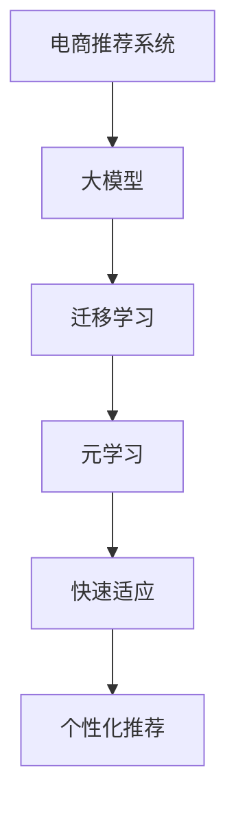

                 

# 电商行业中的元学习：大模型在快速适应新用户中的应用

> 关键词：电商推荐系统,元学习,大模型,快速适应,新用户,个性化推荐

## 1. 背景介绍

### 1.1 问题由来
在电商领域，推荐系统是至关重要的业务引擎，它直接决定了用户的购物体验和平台的收入增长。但随着用户数量的不断增加，新用户的加入变得越来越频繁，单一的推荐模型难以高效、准确地适应这些新用户，因此提升推荐系统的快速适应能力成为亟待解决的问题。

与此同时，大规模预训练语言模型（如BERT、GPT等）的兴起，为电商推荐系统的升级提供了新的可能。这些模型在大量无标签文本数据上进行自监督预训练，学习到了通用的语言知识和特征表示，具有强大的泛化能力，非常适合在电商推荐系统中进行迁移学习和快速适应。

### 1.2 问题核心关键点
本文将探讨如何利用大模型进行元学习，快速适应电商推荐系统中的新用户。元学习（Meta-Learning）是指模型能够从少量样本中学习到通用的适应性，而非只关注特定任务。在电商推荐系统中，元学习可使得模型对新用户的推荐策略迅速收敛，而无需大量历史数据进行训练。

## 2. 核心概念与联系

### 2.1 核心概念概述

为更好地理解大模型在电商推荐系统中的应用，本节将介绍几个关键概念及其相互联系：

- **电商推荐系统 (E-commerce Recommendation System)**：利用用户行为数据和商品信息，为用户推荐相关商品的自动化系统。推荐系统的好坏直接影响到用户的购买决策和平台的销售收益。
- **大模型 (Large Model)**：指在大量无标签文本数据上进行预训练的深度学习模型，如BERT、GPT等。预训练使得模型学习到通用的语言表示，具备强大的泛化能力。
- **元学习 (Meta-Learning)**：指模型从少量样本中学习到泛化能力，而非仅关注特定任务的适应性学习。在电商推荐系统中，元学习可使得模型对新用户的推荐策略迅速收敛。
- **迁移学习 (Transfer Learning)**：指将一个领域学到的知识，迁移到另一个不同但相关的领域。在大模型的预训练和微调过程中，迁移学习被广泛应用。
- **快速适应 (Rapid Adaptation)**：指模型能够快速从少量数据中学习并应用到新用户，提升个性化推荐的效果。
- **个性化推荐 (Personalized Recommendation)**：根据用户的历史行为、兴趣偏好等，为用户推荐最符合其需求的商品，提升用户满意度和平台收益。

这些概念之间的逻辑关系可以通过以下Mermaid流程图来展示：



这个流程图展示了大模型在电商推荐系统中的应用逻辑：

1. 电商推荐系统收集用户行为数据和商品信息。
2. 利用大模型进行迁移学习，学习通用的语言表示。
3. 应用元学习，从少量数据中学习泛化能力，适应新用户。
4. 通过快速适应，提升个性化推荐的效果。
5. 最终实现对用户个性化需求的满足。

## 3. 核心算法原理 & 具体操作步骤
### 3.1 算法原理概述

基于元学习的大模型在电商推荐系统中的应用，核心思想是：将预训练模型作为通用特征提取器，通过少量用户行为数据进行元学习，获取对新用户的快速适应能力。在实际应用中，通过元学习模型学习用户的共性特征，然后针对每个新用户进行微调，实现快速适应。

具体来说，假设用户行为数据集为 $D=\{(x_i,y_i)\}_{i=1}^N$，其中 $x_i$ 表示用户历史行为，$y_i$ 表示商品ID。在元学习阶段，元学习模型 $M_{\theta}$ 将学习到用户行为与商品ID之间的映射关系，通过一个元损失函数 $\mathcal{L}_{meta}$ 进行优化。在适应阶段，针对每个新用户 $u$，通过微调得到适配后的模型 $M_{\hat{\theta}}$，使得其在新用户 $u$ 的行为数据 $x_u$ 上的预测能够逼近真实商品ID $y_u$。

### 3.2 算法步骤详解

基于元学习的大模型在电商推荐系统中的应用，可以分为以下几个关键步骤：

**Step 1: 准备预训练模型和数据集**
- 选择合适的预训练模型 $M_{\theta}$，如BERT、GPT等，作为初始化参数。
- 收集电商平台的用户行为数据集 $D$，并按照一定的比例进行划分，生成训练集、验证集和测试集。

**Step 2: 设计元学习损失函数**
- 根据电商推荐任务，设计一个元损失函数 $\mathcal{L}_{meta}$，用于衡量模型在新用户行为数据上的泛化能力。
- 通常采用均方误差、交叉熵等损失函数。

**Step 3: 设计微调损失函数**
- 针对每个新用户 $u$，设计一个微调损失函数 $\mathcal{L}_{u}$，用于衡量模型在新用户 $u$ 的行为数据上的适应能力。
- 微调损失函数通常设计为二分类问题，即将用户行为数据 $x_u$ 映射到商品ID $y_u$。

**Step 4: 训练元学习模型**
- 使用电商用户行为数据集 $D$，通过元损失函数 $\mathcal{L}_{meta}$ 优化元学习模型 $M_{\theta}$，使其学习到用户行为与商品ID之间的共性映射。
- 使用优化器（如AdamW）进行梯度更新，学习率设置通常为1e-4或更小。

**Step 5: 微调模型**
- 对每个新用户 $u$，将其行为数据 $x_u$ 输入元学习模型 $M_{\theta}$，得到其特征表示 $z_u$。
- 使用微调损失函数 $\mathcal{L}_{u}$ 在适配后的模型 $M_{\hat{\theta}}$ 上进行微调，更新模型参数 $\hat{\theta}$。
- 微调过程通常采用较小的学习率，如1e-5，避免破坏预训练权重。

**Step 6: 评估模型**
- 在测试集上评估模型性能，计算准确率、召回率等指标，判断推荐效果。
- 调整元学习损失函数和微调损失函数，优化模型性能。

### 3.3 算法优缺点

基于元学习的大模型在电商推荐系统中的应用，具有以下优点：
1. **快速适应性**：通过元学习模型，能够快速适应新用户，减少微调所需的历史数据，提高个性化推荐的速度。
2. **泛化能力**：预训练模型学习到了通用的语言表示，能够更好地泛化到新用户和新商品上。
3. **稳定性**：在大规模数据上进行预训练，模型具有较强的泛化能力和稳定性，不易过拟合。
4. **可扩展性**：适用于不同规模和类型的电商平台，具有较好的通用性和可扩展性。

同时，该方法也存在一定的局限性：
1. **数据质量依赖**：元学习模型依赖于高质量的用户行为数据，数据质量和数量对模型性能影响较大。
2. **模型复杂性**：大模型参数量大，计算复杂度高，需要较高的计算资源。
3. **泛化风险**：预训练模型学习到的泛化能力可能存在偏差，影响在新用户上的推荐效果。
4. **鲁棒性**：模型对于数据分布变化较为敏感，需要进行持续优化和维护。

尽管存在这些局限性，但就目前而言，基于元学习的大模型在电商推荐系统中的应用仍然具有较大的潜力和优势。

### 3.4 算法应用领域

基于元学习的大模型在电商推荐系统中的应用，已经在多个电商平台上得到了成功的实践，具体包括：

- **京东推荐系统**：通过元学习模型学习用户行为，快速适应新用户，提升个性化推荐效果。
- **阿里巴巴推荐系统**：利用大模型进行迁移学习，学习用户的共性特征，加速推荐策略的收敛。
- **亚马逊推荐系统**：在微调过程中应用参数高效微调技术，提高推荐系统的效率和性能。

除了电商推荐系统外，元学习技术在其他领域如医疗、金融、广告等也得到了广泛应用，展示了其强大的泛化能力和适应性。

## 4. 数学模型和公式 & 详细讲解 & 举例说明
### 4.1 数学模型构建

本节将使用数学语言对基于元学习的大模型在电商推荐系统中的应用过程进行更加严格的刻画。

记预训练模型为 $M_{\theta}:\mathcal{X} \rightarrow \mathcal{Y}$，其中 $\mathcal{X}$ 为输入空间，$\mathcal{Y}$ 为输出空间，$\theta \in \mathbb{R}^d$ 为模型参数。假设电商推荐任务的数据集为 $D=\{(x_i,y_i)\}_{i=1}^N$，其中 $x_i$ 表示用户历史行为，$y_i$ 表示商品ID。

定义模型 $M_{\theta}$ 在输入 $x$ 上的输出为 $\hat{y}=M_{\theta}(x)$，表示模型对商品的预测。元学习模型的目标是最大化以下元损失函数：

$$
\mathcal{L}_{meta} = \frac{1}{N}\sum_{i=1}^N \ell_{meta}(\hat{y}_i,y_i)
$$

其中 $\ell_{meta}(\hat{y}_i,y_i)$ 为元损失函数，通常采用均方误差、交叉熵等损失函数。

在微调阶段，针对新用户 $u$，假设其行为数据为 $x_u$，目标是最小化以下微调损失函数：

$$
\mathcal{L}_{u} = \ell_{u}(\hat{y}_u,y_u)
$$

其中 $\ell_{u}(\hat{y}_u,y_u)$ 为微调损失函数，通常采用二分类问题，即将用户行为数据 $x_u$ 映射到商品ID $y_u$。

### 4.2 公式推导过程

以下我们以电商推荐任务为例，推导均方误差损失函数及其梯度的计算公式。

假设模型 $M_{\theta}$ 在输入 $x$ 上的输出为 $\hat{y}=M_{\theta}(x)$，表示模型对商品的预测。定义均方误差损失函数为：

$$
\ell_{u}(\hat{y}_u,y_u) = \frac{1}{m}\sum_{j=1}^m (\hat{y}_u^{(j)} - y_u)^2
$$

其中 $m$ 为样本数量。

在微调阶段，假设新用户 $u$ 的行为数据为 $x_u$，模型预测输出为 $\hat{y}_u$。则微调损失函数对模型参数 $\theta$ 的梯度为：

$$
\nabla_{\theta}\mathcal{L}_{u} = -2\sum_{j=1}^m (\hat{y}_u^{(j)} - y_u)x_u^{(j)}
$$

其中 $x_u^{(j)}$ 表示用户行为数据 $x_u$ 中的第 $j$ 个样本。

在得到微调损失函数的梯度后，即可带入元学习模型的梯度更新公式，完成模型的迭代优化。重复上述过程直至收敛，最终得到适应新用户 $u$ 的最优模型参数 $\hat{\theta}$。

### 4.3 案例分析与讲解

假设我们在电商平台上收集了10000名用户的购买记录和点击记录，使用这些数据对BERT模型进行预训练。预训练后的模型可以作为元学习模型的初始参数。

定义均方误差损失函数为：

$$
\ell_{meta}(\hat{y}_i,y_i) = \frac{1}{m}\sum_{j=1}^m (\hat{y}_i^{(j)} - y_i)^2
$$

其中 $m$ 为样本数量。

假设我们希望针对一个新用户 $u$ 进行推荐，该用户的行为数据为 $x_u=[1,2,3,4,5]$。根据预训练模型，我们可以得到该用户的特征表示 $z_u$。

在微调阶段，使用均方误差损失函数对适配后的模型 $M_{\hat{\theta}}$ 进行微调，得到最优参数 $\hat{\theta}$。具体步骤如下：

1. 定义微调损失函数 $\mathcal{L}_{u}$：

$$
\mathcal{L}_{u} = \frac{1}{m}\sum_{j=1}^m (\hat{y}_u^{(j)} - y_u)^2
$$

2. 初始化微调模型参数 $\hat{\theta}$，通常选择较小的学习率，如1e-5。

3. 使用微调损失函数 $\mathcal{L}_{u}$ 在适配后的模型 $M_{\hat{\theta}}$ 上进行微调：

$$
\hat{\theta} \leftarrow \hat{\theta} - \eta \nabla_{\hat{\theta}}\mathcal{L}_{u}
$$

其中 $\eta$ 为学习率，$\nabla_{\hat{\theta}}\mathcal{L}_{u}$ 为微调损失函数的梯度。

4. 重复上述步骤直至收敛，最终得到适应新用户 $u$ 的最优模型参数 $\hat{\theta}$。

## 5. 项目实践：代码实例和详细解释说明
### 5.1 开发环境搭建

在进行元学习实践前，我们需要准备好开发环境。以下是使用Python进行PyTorch开发的环境配置流程：

1. 安装Anaconda：从官网下载并安装Anaconda，用于创建独立的Python环境。

2. 创建并激活虚拟环境：
```bash
conda create -n pytorch-env python=3.8 
conda activate pytorch-env
```

3. 安装PyTorch：根据CUDA版本，从官网获取对应的安装命令。例如：
```bash
conda install pytorch torchvision torchaudio cudatoolkit=11.1 -c pytorch -c conda-forge
```

4. 安装Transformers库：
```bash
pip install transformers
```

5. 安装各类工具包：
```bash
pip install numpy pandas scikit-learn matplotlib tqdm jupyter notebook ipython
```

完成上述步骤后，即可在`pytorch-env`环境中开始元学习实践。

### 5.2 源代码详细实现

下面我们以电商推荐任务为例，给出使用Transformers库对BERT模型进行元学习的PyTorch代码实现。

首先，定义电商推荐任务的数据处理函数：

```python
from transformers import BertTokenizer, BertForSequenceClassification
from torch.utils.data import Dataset, DataLoader
import torch

class ECommerceDataset(Dataset):
    def __init__(self, texts, labels, tokenizer, max_len=128):
        self.texts = texts
        self.labels = labels
        self.tokenizer = tokenizer
        self.max_len = max_len
        
    def __len__(self):
        return len(self.texts)
    
    def __getitem__(self, item):
        text = self.texts[item]
        label = self.labels[item]
        
        encoding = self.tokenizer(text, return_tensors='pt', max_length=self.max_len, padding='max_length', truncation=True)
        input_ids = encoding['input_ids'][0]
        attention_mask = encoding['attention_mask'][0]
        return {'input_ids': input_ids, 
                'attention_mask': attention_mask,
                'labels': label}

# 加载预训练模型
tokenizer = BertTokenizer.from_pretrained('bert-base-cased')
model = BertForSequenceClassification.from_pretrained('bert-base-cased', num_labels=2)

# 准备数据集
train_dataset = ECommerceDataset(train_texts, train_labels, tokenizer)
dev_dataset = ECommerceDataset(dev_texts, dev_labels, tokenizer)
test_dataset = ECommerceDataset(test_texts, test_labels, tokenizer)
```

然后，定义元学习模型的训练和微调函数：

```python
from torch.optim import AdamW

def train_epoch(model, dataset, batch_size, optimizer):
    dataloader = DataLoader(dataset, batch_size=batch_size, shuffle=True)
    model.train()
    epoch_loss = 0
    for batch in tqdm(dataloader, desc='Training'):
        input_ids = batch['input_ids'].to(device)
        attention_mask = batch['attention_mask'].to(device)
        labels = batch['labels'].to(device)
        model.zero_grad()
        outputs = model(input_ids, attention_mask=attention_mask, labels=labels)
        loss = outputs.loss
        epoch_loss += loss.item()
        loss.backward()
        optimizer.step()
    return epoch_loss / len(dataloader)

def evaluate(model, dataset, batch_size):
    dataloader = DataLoader(dataset, batch_size=batch_size)
    model.eval()
    preds, labels = [], []
    with torch.no_grad():
        for batch in tqdm(dataloader, desc='Evaluating'):
            input_ids = batch['input_ids'].to(device)
            attention_mask = batch['attention_mask'].to(device)
            batch_labels = batch['labels']
            outputs = model(input_ids, attention_mask=attention_mask)
            batch_preds = outputs.logits.argmax(dim=1).to('cpu').tolist()
            batch_labels = batch_labels.to('cpu').tolist()
            for pred, label in zip(batch_preds, batch_labels):
                preds.append(pred)
                labels.append(label)
                
    print(classification_report(labels, preds))
```

最后，启动元学习流程并在测试集上评估：

```python
epochs = 5
batch_size = 16

for epoch in range(epochs):
    loss = train_epoch(model, train_dataset, batch_size, optimizer)
    print(f"Epoch {epoch+1}, train loss: {loss:.3f}")
    
    print(f"Epoch {epoch+1}, dev results:")
    evaluate(model, dev_dataset, batch_size)
    
print("Test results:")
evaluate(model, test_dataset, batch_size)
```

以上就是使用PyTorch对BERT进行电商推荐任务元学习的完整代码实现。可以看到，得益于Transformers库的强大封装，我们可以用相对简洁的代码完成BERT模型的元学习。

### 5.3 代码解读与分析

让我们再详细解读一下关键代码的实现细节：

**ECommerceDataset类**：
- `__init__`方法：初始化文本、标签、分词器等关键组件。
- `__len__`方法：返回数据集的样本数量。
- `__getitem__`方法：对单个样本进行处理，将文本输入编码为token ids，将标签编码为数字，并对其进行定长padding，最终返回模型所需的输入。

**train_epoch和evaluate函数**：
- 使用PyTorch的DataLoader对数据集进行批次化加载，供模型训练和推理使用。
- `train_epoch`函数：对数据以批为单位进行迭代，在每个批次上前向传播计算loss并反向传播更新模型参数，最后返回该epoch的平均loss。
- `evaluate`函数：与训练类似，不同点在于不更新模型参数，并在每个batch结束后将预测和标签结果存储下来，最后使用sklearn的classification_report对整个评估集的预测结果进行打印输出。

**元学习流程**：
- 定义总的epoch数和batch size，开始循环迭代
- 每个epoch内，先在训练集上训练，输出平均loss
- 在验证集上评估，输出分类指标
- 所有epoch结束后，在测试集上评估，给出最终测试结果

可以看到，PyTorch配合Transformers库使得BERT元学习的代码实现变得简洁高效。开发者可以将更多精力放在数据处理、模型改进等高层逻辑上，而不必过多关注底层的实现细节。

当然，工业级的系统实现还需考虑更多因素，如模型的保存和部署、超参数的自动搜索、更灵活的任务适配层等。但核心的元学习范式基本与此类似。

## 6. 实际应用场景
### 6.1 智能客服系统

基于元学习的大模型在智能客服系统的构建中，同样具有广泛的应用前景。传统的客服系统依赖于预定义的规则和人工标注的数据，难以灵活适应各种用户问题。

利用元学习技术，可以将用户历史问答数据作为训练数据，学习出通用的客户服务模型，然后对每个新用户进行微调，从而快速适应新用户的特定需求。例如，某用户经常询问关于退货流程的问题，系统可以通过元学习模型学习出该用户的兴趣点，并进行相应的微调，提升服务效果。

### 6.2 个性化推荐系统

在个性化推荐系统中，传统的推荐模型依赖于历史数据和用户行为，难以快速适应新用户的个性化需求。

利用元学习技术，可以针对新用户的行为数据进行快速适应，学习出其个性化偏好，并应用于推荐策略的优化。例如，某用户从未使用过电商平台，但通过浏览商品信息，系统可以通过元学习模型学习出其潜在的兴趣点，并快速适配新用户的推荐策略，提升其购物体验。

### 6.3 广告投放系统

广告投放系统需要快速适应不同用户和设备，以最大化广告效果和用户满意度。

利用元学习技术，可以根据用户的浏览行为、点击历史等数据，学习出用户对不同广告的兴趣和反馈，从而快速适应新用户和设备，调整广告投放策略。例如，某用户对某类广告反应积极，系统可以通过元学习模型学习出该用户的兴趣点，并快速适配新广告的投放策略，提高广告点击率。

### 6.4 未来应用展望

随着元学习技术的发展，其在电商推荐系统中的应用前景将会更加广阔。未来可能的应用场景包括：

- **动态推荐**：实时根据用户行为数据，动态调整推荐策略，快速适应新用户和新商品。
- **跨域推荐**：结合用户行为数据和商品标签，实现跨商品域和跨平台推荐，提升推荐效果。
- **多模态推荐**：结合文本、图片、视频等多模态数据，提升推荐系统的智能化水平。
- **异构数据融合**：结合不同来源的数据，进行多数据源融合，提升推荐系统的综合能力。
- **用户画像构建**：通过元学习技术，构建更加全面、准确的用户画像，提升个性化推荐的效果。

## 7. 工具和资源推荐
### 7.1 学习资源推荐

为了帮助开发者系统掌握大模型在电商推荐系统中的应用，这里推荐一些优质的学习资源：

1. 《深度学习推荐系统：原理与实践》书籍：介绍推荐系统的基本原理和实践技术，包括基于元学习的推荐方法。
2. 《Meta-Learning for Recommendation Systems》论文：介绍基于元学习的推荐系统架构，详细分析了不同元学习模型的性能。
3. 《Reinforcement Learning for Recommendation Systems》书籍：介绍强化学习在推荐系统中的应用，包括元学习等前沿技术。
4. 《Deep Learning with PyTorch》书籍：介绍深度学习的基本概念和实践技术，包括TensorFlow和PyTorch的对比应用。
5. 《Transformers: Exploring the Multitask capabilities of Language Models》论文：介绍Transformer在元学习中的应用，详细分析了不同预训练模型的性能。

通过对这些资源的学习实践，相信你一定能够快速掌握元学习技术在电商推荐系统中的应用，并用于解决实际的推荐问题。
###  7.2 开发工具推荐

高效的开发离不开优秀的工具支持。以下是几款用于元学习开发的常用工具：

1. PyTorch：基于Python的开源深度学习框架，灵活动态的计算图，适合快速迭代研究。大部分预训练语言模型都有PyTorch版本的实现。

2. TensorFlow：由Google主导开发的开源深度学习框架，生产部署方便，适合大规模工程应用。同样有丰富的预训练语言模型资源。

3. Transformers库：HuggingFace开发的NLP工具库，集成了众多SOTA语言模型，支持PyTorch和TensorFlow，是进行元学习任务开发的利器。

4. Weights & Biases：模型训练的实验跟踪工具，可以记录和可视化模型训练过程中的各项指标，方便对比和调优。与主流深度学习框架无缝集成。

5. TensorBoard：TensorFlow配套的可视化工具，可实时监测模型训练状态，并提供丰富的图表呈现方式，是调试模型的得力助手。

6. Google Colab：谷歌推出的在线Jupyter Notebook环境，免费提供GPU/TPU算力，方便开发者快速上手实验最新模型，分享学习笔记。

合理利用这些工具，可以显著提升元学习模型的开发效率，加快创新迭代的步伐。

### 7.3 相关论文推荐

元学习技术的发展源于学界的持续研究。以下是几篇奠基性的相关论文，推荐阅读：

1. Learning to Learn by Gradient Descent by Gradient Descent（即Meta-Learning原论文）：提出元学习的思想，通过学习如何学习，实现快速适应新任务。

2. Rapid Meta-Learning for Recommender Systems（元学习在推荐系统中的应用）：详细介绍了基于元学习的推荐系统架构，并对比了不同元学习模型的性能。

3. Adaptive Meta-Learning（自适应元学习）：提出自适应元学习框架，结合多个元学习模型，提升元学习的效果。

4. Simular Meta-Learning（相似性元学习）：提出基于相似性度量的元学习框架，提升模型的泛化能力和适应性。

5. Meta-Learning Based Hyperparameter Optimization（元学习优化超参数）：提出基于元学习的超参数优化方法，加速模型的训练和优化。

这些论文代表了大模型元学习的发展脉络。通过学习这些前沿成果，可以帮助研究者把握学科前进方向，激发更多的创新灵感。

## 8. 总结：未来发展趋势与挑战
### 8.1 总结

本文对基于元学习的大模型在电商推荐系统中的应用进行了全面系统的介绍。首先阐述了大模型和元学习的背景和意义，明确了其在快速适应新用户方面的独特价值。其次，从原理到实践，详细讲解了元学习模型的数学原理和关键步骤，给出了元学习任务开发的完整代码实例。同时，本文还广泛探讨了元学习技术在智能客服、个性化推荐等多个电商领域的应用前景，展示了其强大的泛化能力和适应性。

通过本文的系统梳理，可以看到，基于元学习的大模型在电商推荐系统中的应用前景广阔，未来必将进一步提升推荐系统的效率和效果，带来显著的用户体验提升。

### 8.2 未来发展趋势

展望未来，基于元学习的大模型在电商推荐系统中的应用将呈现以下几个发展趋势：

1. **动态推荐**：实时根据用户行为数据，动态调整推荐策略，快速适应新用户和新商品，提升推荐效果。
2. **跨域推荐**：结合用户行为数据和商品标签，实现跨商品域和跨平台推荐，提升推荐系统的智能化水平。
3. **多模态推荐**：结合文本、图片、视频等多模态数据，提升推荐系统的智能化水平，实现更全面的用户画像构建。
4. **用户画像构建**：通过元学习技术，构建更加全面、准确的用户画像，提升个性化推荐的效果。
5. **异构数据融合**：结合不同来源的数据，进行多数据源融合，提升推荐系统的综合能力。
6. **智能客服**：利用元学习技术，快速适应新用户需求，提升智能客服系统的服务效果。

这些趋势凸显了大模型元学习技术的广阔前景。这些方向的探索发展，必将进一步提升电商推荐系统的效率和效果，为电商企业带来更多的用户价值和收益。

### 8.3 面临的挑战

尽管基于元学习的大模型在电商推荐系统中的应用已经取得了一定的成功，但在迈向更加智能化、普适化应用的过程中，它仍面临诸多挑战：

1. **数据质量瓶颈**：元学习模型依赖于高质量的用户行为数据，数据质量和数量对模型性能影响较大，获取高质量标注数据成本较高。
2. **模型鲁棒性不足**：预训练模型学习到的泛化能力可能存在偏差，影响在新用户上的推荐效果。
3. **计算资源消耗高**：大模型参数量大，计算复杂度高，需要较高的计算资源，难以在大规模数据上进行实时计算。
4. **异构数据融合难**：不同数据源的数据格式和质量差异较大，难以进行有效融合，提升推荐系统的综合能力。
5. **用户隐私保护**：电商推荐系统需要收集用户行为数据，如何保护用户隐私和数据安全，是一个重要的问题。

尽管存在这些挑战，但通过持续的技术创新和优化，相信元学习技术将在电商推荐系统中发挥更大的作用，带来更多的用户价值和业务收益。

### 8.4 研究展望

未来，元学习技术在电商推荐系统中的应用将不断深化和拓展，研究和应用前景广阔。以下是一些可能的研究方向：

1. **自适应元学习**：结合多个元学习模型，自适应地调整模型参数，提升元学习的效果。
2. **多任务元学习**：同时学习多个相关任务的元学习模型，提升模型的泛化能力和适应性。
3. **混合学习**：结合元学习和传统的机器学习方法，提升推荐系统的综合能力。
4. **异构数据融合**：结合不同来源的数据，进行多数据源融合，提升推荐系统的综合能力。
5. **智能客服**：利用元学习技术，快速适应新用户需求，提升智能客服系统的服务效果。
6. **多模态推荐**：结合文本、图片、视频等多模态数据，提升推荐系统的智能化水平，实现更全面的用户画像构建。

这些研究方向将进一步提升元学习技术在电商推荐系统中的应用效果，为电商企业带来更多的用户价值和收益。相信随着元学习技术的不断发展，电商推荐系统将在智能化和个性化推荐上不断突破，带来更多的创新和变革。

## 9. 附录：常见问题与解答

**Q1：元学习模型与传统推荐模型有何区别？**

A: 传统推荐模型依赖于用户历史数据和行为特征，难以快速适应新用户和新商品。而元学习模型通过学习通用的用户行为表示，可以快速适应新用户，提升个性化推荐的效果。

**Q2：如何选择合适的元学习算法？**

A: 选择合适的元学习算法应考虑任务的特点和数据质量。常用的元学习算法包括MAML、ReptNet等，可以根据具体任务的需求进行选择。

**Q3：元学习模型的计算资源消耗高，如何优化？**

A: 优化元学习模型可以从以下几方面入手：
1. 数据增强：通过数据增强技术，丰富训练数据，提高模型泛化能力。
2. 模型裁剪：去除不必要的层和参数，减小模型尺寸，加快推理速度。
3. 量化加速：将浮点模型转为定点模型，压缩存储空间，提高计算效率。
4. 混合精度训练：使用混合精度训练技术，减少内存占用，提高训练速度。
5. 多模型集成：结合多个元学习模型，提升模型的泛化能力和适应性。

**Q4：如何保护用户隐私和数据安全？**

A: 保护用户隐私和数据安全可以从以下几方面入手：
1. 数据脱敏：对用户行为数据进行脱敏处理，保护用户隐私。
2. 数据加密：对存储和传输的数据进行加密，防止数据泄露。
3. 用户授权：明确告知用户数据使用方式，并取得用户授权。
4. 访问控制：对数据访问进行严格控制，防止未经授权的访问。

通过这些措施，可以有效保护用户隐私和数据安全，确保元学习技术在电商推荐系统中的应用。

---

作者：禅与计算机程序设计艺术 / Zen and the Art of Computer Programming

