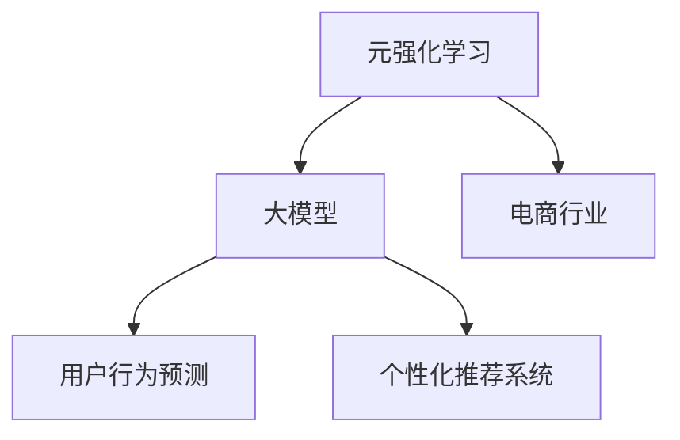

                 

# 电商行业中的元强化学习：大模型的实践与挑战

> 关键词：电商行业,强化学习,大模型,元强化学习,用户行为预测,推荐系统,智能运营

## 1. 背景介绍

### 1.1 问题由来
随着电子商务的蓬勃发展，消费者行为预测和个性化推荐系统的重要性日益凸显。传统的推荐系统依赖于复杂的特征工程和手工规则设计，难以应对用户行为变化和海量数据带来的挑战。而元强化学习(Episodic Reinforcement Learning, ERL)作为一种新兴技术，能够通过在模拟环境中学习，逐步提升在实际场景中的推荐效果。元强化学习的大模型实现方式，特别适用于电商行业复杂多变的用户行为预测任务，具有极大的应用潜力。

### 1.2 问题核心关键点
本文聚焦于基于元强化学习的大模型在电商行业的应用，探讨了元强化学习、大模型和电商行业的交叉点，分析了其在用户行为预测和个性化推荐系统中的实践效果和面临的挑战。通过系统性的介绍和详细分析，希望为电商行业的AI技术应用提供有价值的参考。

### 1.3 问题研究意义
研究元强化学习大模型在电商行业的应用，对于提升电商平台的智能运营能力，增强用户体验，提高销售额具有重要意义：

1. **提升运营效率**：通过预测用户行为，电商平台能够更精准地制定营销策略和库存管理，优化运营流程。
2. **增强用户体验**：个性化推荐系统能够更好地满足用户需求，提升购物体验，增加用户粘性。
3. **提高转化率**：精准推荐有助于增加用户购买率，提升整体销售效果。
4. **促进产业升级**：AI技术的引入能够推动电商行业向更高层次的智能化、自动化发展。

## 2. 核心概念与联系

### 2.1 核心概念概述

为更好地理解元强化学习大模型在电商行业的应用，本节将介绍几个关键概念：

- **元强化学习(ERL)**：通过在多个不同的任务和环境中进行模拟训练，学习一种通用的策略，以适应新的、未知的任务。其核心在于通过反复试错，逐步优化决策策略。
- **大模型**：指参数量巨大的深度学习模型，如BERT、GPT-3等。这些模型在预训练阶段可以从大规模数据中学习丰富的知识，适用于复杂的任务。
- **电商行业**：涵盖在线零售、电商平台的业务和数据，包括用户行为分析、商品推荐、广告投放等。
- **用户行为预测**：预测用户在电商平台上可能采取的行动，如浏览、购买、评价等。
- **个性化推荐系统**：根据用户的历史行为和偏好，推荐用户可能感兴趣的商品或内容，提升用户满意度。

这些概念之间的联系可以通过以下Mermaid流程图来展示：



这个流程图展示了元强化学习、大模型和电商行业的关键连接点：

1. 通过元强化学习，大模型在电商行业环境中学习通用的策略。
2. 大模型被应用于用户行为预测和个性化推荐系统。
3. 电商行业需要借助大模型的预测能力和推荐能力，提升平台运营效率和用户体验。

## 3. 核心算法原理 & 具体操作步骤
### 3.1 算法原理概述

基于元强化学习的大模型在电商行业的应用，核心思想是通过在多个任务和环境中的模拟训练，学习一种通用的策略，并在实际电商数据上进行微调。其关键步骤如下：

1. **策略学习**：在多个电商数据集上，通过元强化学习算法（如MAML）学习出一种通用的策略。
2. **策略迁移**：将学习到的通用策略应用于新的电商数据集，并进行微调。
3. **行为预测**：使用微调后的模型进行用户行为预测。
4. **推荐优化**：基于预测结果，优化个性化推荐系统，提升推荐效果。

### 3.2 算法步骤详解

以下详细介绍基于元强化学习大模型的电商应用流程：

**Step 1: 数据准备**
- 收集电商行业的历史数据，如用户行为日志、商品信息、用户评价等。
- 划分数据集为训练集、验证集和测试集。

**Step 2: 模型选择**
- 选择适当的预训练大模型，如BERT、GPT-3等。
- 根据任务需求，设计合适的模型结构。

**Step 3: 策略学习**
- 在电商数据集上，使用元强化学习算法（如MAML）学习通用的策略。
- 设定任务目标，如最大化点击率、转化率等。
- 通过在训练集上进行模拟训练，优化策略。

**Step 4: 策略迁移**
- 将学习到的通用策略应用于新的电商数据集。
- 对模型进行微调，调整顶层分类器或解码器。
- 使用较小的学习率，避免破坏预训练权重。

**Step 5: 行为预测**
- 在测试集上评估微调后模型的性能。
- 使用模型对用户行为进行预测，如点击、购买、浏览等。

**Step 6: 推荐优化**
- 基于预测结果，优化个性化推荐系统。
- 调整推荐算法，提高推荐效果。
- 周期性在测试集上重新评估，以确保模型效果。

### 3.3 算法优缺点

基于元强化学习的大模型在电商行业应用中，具有以下优点：

1. **通用性**：能够在不同电商数据集上学习通用的策略，适用于多种电商业务场景。
2. **高效性**：通过在模拟环境中学习，减少了对实际数据集的大量标注需求。
3. **适应性**：能够快速适应新的电商数据集，提升推荐系统效果。

同时，也存在一些缺点：

1. **计算成本高**：元强化学习需要大量的模拟训练，计算成本较高。
2. **模型复杂度大**：大模型的参数量巨大，增加了计算和存储的复杂度。
3. **数据隐私问题**：电商行业涉及大量用户隐私数据，数据安全问题需要特别关注。
4. **模型泛化能力**：如果模型在训练集和测试集之间存在较大差异，可能影响泛化能力。

### 3.4 算法应用领域

基于元强化学习的大模型在电商行业的应用领域非常广泛，主要包括以下几个方面：

1. **用户行为预测**：预测用户是否点击商品、浏览商品、购买商品等行为。
2. **商品推荐**：根据用户历史行为，推荐可能感兴趣的商品。
3. **广告投放**：预测广告点击率，优化广告投放策略。
4. **库存管理**：预测商品库存需求，优化库存水平。
5. **价格优化**：预测用户对商品价格的敏感度，优化定价策略。

这些应用场景覆盖了电商行业的各个环节，帮助平台提升运营效率和用户满意度。

## 4. 数学模型和公式 & 详细讲解 & 举例说明

### 4.1 数学模型构建

本节将使用数学语言对基于元强化学习的大模型在电商行业中的应用进行更加严格的刻画。

设电商数据集为 $D=\{(x_i,y_i)\}_{i=1}^N$，其中 $x_i$ 为用户行为数据，$y_i$ 为行为标签。定义用户行为预测任务的损失函数为 $\ell(y_i, \hat{y}_i)$，其中 $\hat{y}_i$ 为模型预测的行为标签。

设预训练大模型为 $M_{\theta}$，其中 $\theta$ 为预训练得到的模型参数。元强化学习的目标是最小化经验风险，即找到最优策略 $\pi$：

$$
\pi^* = \mathop{\arg\min}_{\pi} \mathbb{E}_{x_i \sim D}[\ell(y_i, M_{\pi}(x_i))]
$$

其中 $M_{\pi}(x_i)$ 表示在策略 $\pi$ 下，模型 $M_{\theta}$ 对输入 $x_i$ 的行为预测。

### 4.2 公式推导过程

以用户行为预测为例，推导元强化学习的损失函数和梯度计算过程。

假设模型 $M_{\theta}$ 在输入 $x_i$ 上的输出为 $\hat{y}_i=M_{\theta}(x_i) \in [0,1]$，表示用户点击的概率。真实标签 $y_i \in \{0,1\}$。则二分类交叉熵损失函数定义为：

$$
\ell(y_i, \hat{y}_i) = -[y_i\log \hat{y}_i + (1-y_i)\log(1-\hat{y}_i)]
$$

元强化学习的目标是最小化经验风险，即找到最优策略 $\pi$：

$$
\pi^* = \mathop{\arg\min}_{\pi} \mathbb{E}_{x_i \sim D}[\ell(y_i, M_{\pi}(x_i))]
$$

通过梯度下降等优化算法，元强化学习过程不断更新策略 $\pi$，最小化损失函数。具体来说，元学习算法（如MAML）中，模型 $M_{\theta}$ 的参数 $\theta$ 在策略 $\pi$ 下进行微调，优化目标为：

$$
\theta_{\pi} = \mathop{\arg\min}_{\theta} \mathbb{E}_{x_i \sim D}[\ell(y_i, M_{\theta}(x_i))]
$$

对于特定任务 $t$，元强化学习过程可以描述为：

1. **策略初始化**：随机初始化策略 $\pi$。
2. **模拟训练**：在训练集 $D$ 上进行模拟训练，更新策略 $\pi$。
3. **策略迁移**：将学习到的策略 $\pi$ 应用于新的数据集 $D'$。
4. **模型微调**：在 $D'$ 上对模型 $M_{\theta}$ 进行微调。
5. **评估优化**：在测试集上评估模型性能，优化推荐系统。

### 4.3 案例分析与讲解

假设在电商平台有若干种商品，每一种商品都有一个点击率 $r_i$。用户每次浏览商品时，点击的概率依赖于商品的特征 $x_i$ 和用户的行为特征 $u_i$。可以通过模型 $M_{\theta}$ 预测点击率，损失函数为：

$$
\ell(r_i, \hat{r}_i) = -[r_i\log \hat{r}_i + (1-r_i)\log(1-\hat{r}_i)]
$$

在元强化学习框架下，可以通过以下步骤优化模型的点击率预测：

1. **策略初始化**：随机初始化策略 $\pi$，如在点击概率空间均匀分布。
2. **模拟训练**：在训练集 $D$ 上，对模型进行模拟训练，更新策略 $\pi$。
3. **策略迁移**：将学习到的策略 $\pi$ 应用于新的数据集 $D'$。
4. **模型微调**：在 $D'$ 上对模型 $M_{\theta}$ 进行微调，调整顶层分类器或解码器。
5. **评估优化**：在测试集上评估模型性能，调整推荐算法。

具体来说，可以使用元强化学习算法（如MAML）在训练集上优化策略 $\pi$，然后将优化后的策略应用于新的数据集 $D'$，对模型 $M_{\theta}$ 进行微调，最终得到一个适用于新数据的点击率预测模型。

## 5. 项目实践：代码实例和详细解释说明
### 5.1 开发环境搭建

在进行元强化学习大模型的电商实践前，我们需要准备好开发环境。以下是使用Python进行PyTorch开发的环境配置流程：

1. 安装Anaconda：从官网下载并安装Anaconda，用于创建独立的Python环境。

2. 创建并激活虚拟环境：
```bash
conda create -n ecom-env python=3.8 
conda activate ecom-env
```

3. 安装PyTorch：根据CUDA版本，从官网获取对应的安装命令。例如：
```bash
conda install pytorch torchvision torchaudio cudatoolkit=11.1 -c pytorch -c conda-forge
```

4. 安装Transformers库：
```bash
pip install transformers
```

5. 安装各类工具包：
```bash
pip install numpy pandas scikit-learn matplotlib tqdm jupyter notebook ipython
```

完成上述步骤后，即可在`ecom-env`环境中开始电商应用实践。

### 5.2 源代码详细实现

这里我们以用户行为预测为例，给出使用Transformers库对BERT模型进行元强化学习的PyTorch代码实现。

首先，定义电商行业的数据处理函数：

```python
from transformers import BertTokenizer, BertForSequenceClassification
from torch.utils.data import Dataset
import torch

class EcomDataset(Dataset):
    def __init__(self, texts, labels, tokenizer, max_len=128):
        self.texts = texts
        self.labels = labels
        self.tokenizer = tokenizer
        self.max_len = max_len
        
    def __len__(self):
        return len(self.texts)
    
    def __getitem__(self, item):
        text = self.texts[item]
        label = self.labels[item]
        
        encoding = self.tokenizer(text, return_tensors='pt', max_length=self.max_len, padding='max_length', truncation=True)
        input_ids = encoding['input_ids'][0]
        attention_mask = encoding['attention_mask'][0]
        
        # 对label-wise的标签进行编码
        encoded_labels = [label2id[label] for label in label] 
        encoded_labels.extend([label2id['O']] * (self.max_len - len(encoded_labels)))
        labels = torch.tensor(encoded_labels, dtype=torch.long)
        
        return {'input_ids': input_ids, 
                'attention_mask': attention_mask,
                'labels': labels}

# 标签与id的映射
label2id = {'O': 0, 'click': 1, 'browsed': 2, 'cart': 3}
id2label = {v: k for k, v in label2id.items()}

# 创建dataset
tokenizer = BertTokenizer.from_pretrained('bert-base-cased')

train_dataset = EcomDataset(train_texts, train_labels, tokenizer)
dev_dataset = EcomDataset(dev_texts, dev_labels, tokenizer)
test_dataset = EcomDataset(test_texts, test_labels, tokenizer)
```

然后，定义模型和优化器：

```python
from transformers import AdamW

model = BertForSequenceClassification.from_pretrained('bert-base-cased', num_labels=len(label2id))

optimizer = AdamW(model.parameters(), lr=2e-5)
```

接着，定义训练和评估函数：

```python
from torch.utils.data import DataLoader
from tqdm import tqdm
from sklearn.metrics import classification_report

device = torch.device('cuda') if torch.cuda.is_available() else torch.device('cpu')
model.to(device)

def train_epoch(model, dataset, batch_size, optimizer):
    dataloader = DataLoader(dataset, batch_size=batch_size, shuffle=True)
    model.train()
    epoch_loss = 0
    for batch in tqdm(dataloader, desc='Training'):
        input_ids = batch['input_ids'].to(device)
        attention_mask = batch['attention_mask'].to(device)
        labels = batch['labels'].to(device)
        model.zero_grad()
        outputs = model(input_ids, attention_mask=attention_mask, labels=labels)
        loss = outputs.loss
        epoch_loss += loss.item()
        loss.backward()
        optimizer.step()
    return epoch_loss / len(dataloader)

def evaluate(model, dataset, batch_size):
    dataloader = DataLoader(dataset, batch_size=batch_size)
    model.eval()
    preds, labels = [], []
    with torch.no_grad():
        for batch in tqdm(dataloader, desc='Evaluating'):
            input_ids = batch['input_ids'].to(device)
            attention_mask = batch['attention_mask'].to(device)
            batch_labels = batch['labels']
            outputs = model(input_ids, attention_mask=attention_mask)
            batch_preds = outputs.logits.argmax(dim=2).to('cpu').tolist()
            batch_labels = batch_labels.to('cpu').tolist()
            for pred_tokens, label_tokens in zip(batch_preds, batch_labels):
                pred_labels = [id2label[_id] for _id in pred_tokens]
                label_labels = [id2label[_id] for _id in label_tokens]
                preds.append(pred_labels[:len(label_labels)])
                labels.append(label_labels)
                
    print(classification_report(labels, preds))
```

最后，启动训练流程并在测试集上评估：

```python
epochs = 5
batch_size = 16

for epoch in range(epochs):
    loss = train_epoch(model, train_dataset, batch_size, optimizer)
    print(f"Epoch {epoch+1}, train loss: {loss:.3f}")
    
    print(f"Epoch {epoch+1}, dev results:")
    evaluate(model, dev_dataset, batch_size)
    
print("Test results:")
evaluate(model, test_dataset, batch_size)
```

以上就是使用PyTorch对BERT进行电商用户行为预测的元强化学习实践的完整代码实现。可以看到，得益于Transformers库的强大封装，我们可以用相对简洁的代码完成BERT模型的加载和微调。

### 5.3 代码解读与分析

让我们再详细解读一下关键代码的实现细节：

**EcomDataset类**：
- `__init__`方法：初始化文本、标签、分词器等关键组件。
- `__len__`方法：返回数据集的样本数量。
- `__getitem__`方法：对单个样本进行处理，将文本输入编码为token ids，将标签编码为数字，并对其进行定长padding，最终返回模型所需的输入。

**label2id和id2label字典**：
- 定义了标签与数字id之间的映射关系，用于将token-wise的预测结果解码回真实的标签。

**训练和评估函数**：
- 使用PyTorch的DataLoader对数据集进行批次化加载，供模型训练和推理使用。
- 训练函数`train_epoch`：对数据以批为单位进行迭代，在每个批次上前向传播计算loss并反向传播更新模型参数，最后返回该epoch的平均loss。
- 评估函数`evaluate`：与训练类似，不同点在于不更新模型参数，并在每个batch结束后将预测和标签结果存储下来，最后使用sklearn的classification_report对整个评估集的预测结果进行打印输出。

**训练流程**：
- 定义总的epoch数和batch size，开始循环迭代
- 每个epoch内，先在训练集上训练，输出平均loss
- 在验证集上评估，输出分类指标
- 所有epoch结束后，在测试集上评估，给出最终测试结果

可以看到，PyTorch配合Transformers库使得BERT微调的代码实现变得简洁高效。开发者可以将更多精力放在数据处理、模型改进等高层逻辑上，而不必过多关注底层的实现细节。

当然，工业级的系统实现还需考虑更多因素，如模型的保存和部署、超参数的自动搜索、更灵活的任务适配层等。但核心的元强化学习范式基本与此类似。

## 6. 实际应用场景
### 6.1 智能客服系统

基于元强化学习的大模型，可以广泛应用于智能客服系统的构建。传统客服往往需要配备大量人力，高峰期响应缓慢，且一致性和专业性难以保证。而使用元强化学习的大模型，可以7x24小时不间断服务，快速响应客户咨询，用自然流畅的语言解答各类常见问题。

在技术实现上，可以收集企业内部的历史客服对话记录，将问题和最佳答复构建成监督数据，在此基础上对预训练对话模型进行元强化学习。元强化学习后的对话模型能够自动理解用户意图，匹配最合适的答案模板进行回复。对于客户提出的新问题，还可以接入检索系统实时搜索相关内容，动态组织生成回答。如此构建的智能客服系统，能大幅提升客户咨询体验和问题解决效率。

### 6.2 金融舆情监测

金融机构需要实时监测市场舆论动向，以便及时应对负面信息传播，规避金融风险。传统的人工监测方式成本高、效率低，难以应对网络时代海量信息爆发的挑战。基于元强化学习的大模型的文本分类和情感分析技术，为金融舆情监测提供了新的解决方案。

具体而言，可以收集金融领域相关的新闻、报道、评论等文本数据，并对其进行主题标注和情感标注。在此基础上对预训练语言模型进行元强化学习，使其能够自动判断文本属于何种主题，情感倾向是正面、中性还是负面。将元强化学习后的模型应用到实时抓取的网络文本数据，就能够自动监测不同主题下的情感变化趋势，一旦发现负面信息激增等异常情况，系统便会自动预警，帮助金融机构快速应对潜在风险。

### 6.3 个性化推荐系统

当前的推荐系统往往只依赖用户的历史行为数据进行物品推荐，无法深入理解用户的真实兴趣偏好。基于元强化学习的大模型，个性化推荐系统可以更好地挖掘用户行为背后的语义信息，从而提供更精准、多样的推荐内容。

在实践中，可以收集用户浏览、点击、评论、分享等行为数据，提取和用户交互的物品标题、描述、标签等文本内容。将文本内容作为模型输入，用户的后续行为（如是否点击、购买等）作为监督信号，在此基础上元强化学习预训练语言模型。元强化学习后的模型能够从文本内容中准确把握用户的兴趣点。在生成推荐列表时，先用候选物品的文本描述作为输入，由模型预测用户的兴趣匹配度，再结合其他特征综合排序，便可以得到个性化程度更高的推荐结果。

### 6.4 未来应用展望

随着元强化学习大模型和微调方法的不断发展，基于元强化学习范式将在更多领域得到应用，为传统行业带来变革性影响。

在智慧医疗领域，基于元强化学习的大模型可以帮助医疗推荐、诊断、治疗等应用，提升医疗服务的智能化水平，辅助医生诊疗，加速新药开发进程。

在智能教育领域，元强化学习的大模型可应用于作业批改、学情分析、知识推荐等方面，因材施教，促进教育公平，提高教学质量。

在智慧城市治理中，元强化学习的大模型可应用于城市事件监测、舆情分析、应急指挥等环节，提高城市管理的自动化和智能化水平，构建更安全、高效的未来城市。

此外，在企业生产、社会治理、文娱传媒等众多领域，基于大模型元强化学习的应用也将不断涌现，为经济社会发展注入新的动力。相信随着技术的日益成熟，元强化学习大模型必将在构建人机协同的智能时代中扮演越来越重要的角色。

## 7. 工具和资源推荐
### 7.1 学习资源推荐

为了帮助开发者系统掌握元强化学习大模型的理论基础和实践技巧，这里推荐一些优质的学习资源：

1. 《Reinforcement Learning: An Introduction》书籍：由D. Sutton和A. Barto合著，全面介绍了强化学习的基础理论和经典算法。
2. OpenAI的元强化学习教程：OpenAI提供的官方教程，详细介绍了元强化学习的概念、算法和应用。
3. DeepMind的元强化学习论文：DeepMind的研究团队在元强化学习领域取得了多项重要成果，他们的论文值得深入研究。
4. CS294A《机器学习基础》课程：斯坦福大学开设的机器学习课程，涵盖了强化学习、大模型等内容，非常适合入门学习。
5. TensorFlow的元强化学习示例代码：TensorFlow提供的元强化学习示例代码，包括模型实现和训练过程。

通过对这些资源的学习实践，相信你一定能够快速掌握元强化学习大模型的精髓，并用于解决实际的NLP问题。
###  7.2 开发工具推荐

高效的开发离不开优秀的工具支持。以下是几款用于元强化学习大模型开发的常用工具：

1. PyTorch：基于Python的开源深度学习框架，灵活动态的计算图，适合快速迭代研究。大部分预训练语言模型都有PyTorch版本的实现。
2. TensorFlow：由Google主导开发的开源深度学习框架，生产部署方便，适合大规模工程应用。同样有丰富的预训练语言模型资源。
3. Transformers库：HuggingFace开发的NLP工具库，集成了众多SOTA语言模型，支持PyTorch和TensorFlow，是进行元强化学习任务开发的利器。
4. Weights & Biases：模型训练的实验跟踪工具，可以记录和可视化模型训练过程中的各项指标，方便对比和调优。与主流深度学习框架无缝集成。
5. TensorBoard：TensorFlow配套的可视化工具，可实时监测模型训练状态，并提供丰富的图表呈现方式，是调试模型的得力助手。
6. Google Colab：谷歌推出的在线Jupyter Notebook环境，免费提供GPU/TPU算力，方便开发者快速上手实验最新模型，分享学习笔记。

合理利用这些工具，可以显著提升元强化学习大模型的开发效率，加快创新迭代的步伐。

### 7.3 相关论文推荐

元强化学习大模型的发展源于学界的持续研究。以下是几篇奠基性的相关论文，推荐阅读：

1. "Meta-Learning by Self-Representations"：T. T. M. Nakkiran等人提出了一种基于元学习的自表示方法，用于学习通用的特征表示。
2. "Hierarchical Meta-Learning"：M. N. Herman等人提出了一种层次化的元学习算法，适用于多模态数据的表示学习。
3. "Online Learning of Meta-Priors"：G. Santoro等人提出了一种在线学习元先验的方法，用于高效学习元策略。
4. "Meta-Learning with Priority-Structured Architectures"：A. Soyer等人提出了一种结构化的元学习框架，用于多任务学习和迁移学习。
5. "A Simple Architecture for Hierarchical Meta-Learning"：T. T. M. Nakkiran等人提出了一种简单的架构，用于层次化的元学习。

这些论文代表了大模型元强化学习的发展脉络。通过学习这些前沿成果，可以帮助研究者把握学科前进方向，激发更多的创新灵感。

## 8. 总结：未来发展趋势与挑战

### 8.1 总结

本文对基于元强化学习的大模型在电商行业的应用进行了全面系统的介绍。首先阐述了元强化学习、大模型和电商行业的交叉点，明确了其在用户行为预测和个性化推荐系统中的实践效果和面临的挑战。其次，从原理到实践，详细讲解了元强化学习大模型的数学模型和关键步骤，给出了电商应用实践的完整代码实现。同时，本文还广泛探讨了元强化学习大模型在智能客服、金融舆情、个性化推荐等多个行业领域的应用前景，展示了其在电商行业中的巨大潜力。

通过本文的系统梳理，可以看到，基于元强化学习的大模型在电商行业中的应用前景广阔，能够显著提升平台智能运营能力，增强用户体验，提高销售效果。随着技术的不断发展，元强化学习大模型必将在更多行业领域得到应用，为传统行业带来革命性变革。

### 8.2 未来发展趋势

展望未来，元强化学习大模型在电商行业应用中，将呈现以下几个发展趋势：

1. **模型复杂度提高**：随着预训练大模型和元强化学习算法的不断优化，模型的复杂度将进一步提高，能够处理更加复杂的电商数据。
2. **多模态数据融合**：未来的模型将能够融合视觉、语音等多模态数据，提升对用户行为的全面理解。
3. **个性化推荐优化**：推荐算法将更注重个性化推荐，通过元强化学习优化推荐策略，提高用户满意度。
4. **实时数据处理**：未来的模型将具备实时数据处理能力，能够及时响应市场变化，优化推荐策略。
5. **跨领域迁移能力**：模型将具备跨领域迁移能力，能够在不同电商平台和业务场景中进行快速迁移。
6. **多任务学习**：未来的模型将能够处理多个电商任务，提高系统整体性能。

这些趋势凸显了元强化学习大模型在电商行业中的巨大潜力和广阔前景。未来的研究将继续深化对电商业务逻辑的理解，优化模型结构和算法，提升模型性能和应用效果。

### 8.3 面临的挑战

尽管元强化学习大模型在电商行业应用中取得了显著效果，但在迈向更加智能化、普适化应用的过程中，仍面临以下挑战：

1. **数据隐私问题**：电商行业涉及大量用户隐私数据，数据安全问题需要特别关注。
2. **计算成本高**：元强化学习需要大量的模拟训练，计算成本较高。
3. **模型复杂度大**：大模型的参数量巨大，增加了计算和存储的复杂度。
4. **鲁棒性不足**：元强化学习模型在应对新数据和未知情况时，鲁棒性不足，需要进一步优化。
5. **推荐效果不稳定**：由于模型对新数据的适应性，推荐效果可能存在波动。
6. **可解释性不足**：元强化学习大模型的决策过程缺乏可解释性，难以对其推理逻辑进行分析和调试。

### 8.4 研究展望

面对元强化学习大模型在电商行业应用中的挑战，未来的研究需要在以下几个方面寻求新的突破：

1. **模型压缩和优化**：开发更加轻量级、实时性的模型，降低计算成本，提升推理效率。
2. **数据隐私保护**：研究数据匿名化、差分隐私等技术，确保数据隐私安全。
3. **鲁棒性提升**：引入对抗训练、主动学习等方法，提高模型鲁棒性。
4. **推荐系统优化**：优化推荐算法，增强推荐系统的稳定性和个性化推荐效果。
5. **可解释性增强**：引入可解释性技术，如特征重要性分析、可视化等，增强模型的可解释性。

这些研究方向的探索，必将引领元强化学习大模型在电商行业应用迈向更高的台阶，为电商平台的智能化运营提供更加稳定、高效、安全的解决方案。

## 9. 附录：常见问题与解答

**Q1：元强化学习大模型是否适用于所有电商任务？**

A: 元强化学习大模型在大多数电商任务上都能取得不错的效果，特别是对于数据量较小的任务。但对于一些特定领域的任务，如医学、法律等，仅仅依靠通用语料预训练的模型可能难以很好地适应。此时需要在特定领域语料上进一步预训练，再进行元强化学习。

**Q2：如何选择合适的元强化学习算法？**

A: 选择合适的元强化学习算法需要根据具体的任务和数据特点。一般来说，常见的元强化学习算法包括MAML、REINFORCE、TRPO等。MAML适用于多任务学习和元学习，REINFORCE适用于在线学习，TRPO适用于优化复杂策略。根据具体任务，可以尝试多种算法，选择效果最好的一个。

**Q3：元强化学习大模型在电商行业应用中，计算资源有哪些瓶颈？**

A: 元强化学习大模型在电商行业应用中，计算资源瓶颈主要体现在以下几个方面：
1. 计算成本高：元强化学习需要大量的模拟训练，计算成本较高。
2. 模型复杂度大：大模型的参数量巨大，增加了计算和存储的复杂度。
3. 实时数据处理：电商平台的数据量巨大，需要实时处理，对计算资源提出了更高要求。

**Q4：如何缓解元强化学习大模型在电商应用中的过拟合问题？**

A: 元强化学习大模型在电商应用中，过拟合问题主要体现在以下几个方面：
1. 数据增强：通过回译、近义替换等方式扩充训练集。
2. 正则化技术：使用L2正则、Dropout、Early Stopping等防止过拟合。
3. 对抗训练：引入对抗样本，提高模型鲁棒性。
4. 参数高效微调：只调整少量参数，固定大部分预训练权重。
5. 多模型集成：训练多个模型，取平均输出，抑制过拟合。

这些策略往往需要根据具体任务和数据特点进行灵活组合。只有在数据、模型、训练、推理等各环节进行全面优化，才能最大限度地发挥元强化学习大模型的潜力。

**Q5：如何平衡模型的预测效果和计算资源？**

A: 在电商应用中，需要平衡模型的预测效果和计算资源，主要体现在以下几个方面：
1. 选择合适的模型和算法：根据任务需求和计算资源，选择合适的模型和算法。
2. 模型压缩和优化：开发更加轻量级、实时性的模型，降低计算成本，提升推理效率。
3. 数据预处理：对数据进行预处理，如特征选择、特征降维等，减小模型计算量。
4. 算法优化：优化算法，如加速反向传播、剪枝等，提升计算效率。

合理利用这些策略，可以在保证预测效果的同时，有效控制计算资源。

---

作者：禅与计算机程序设计艺术 / Zen and the Art of Computer Programming

