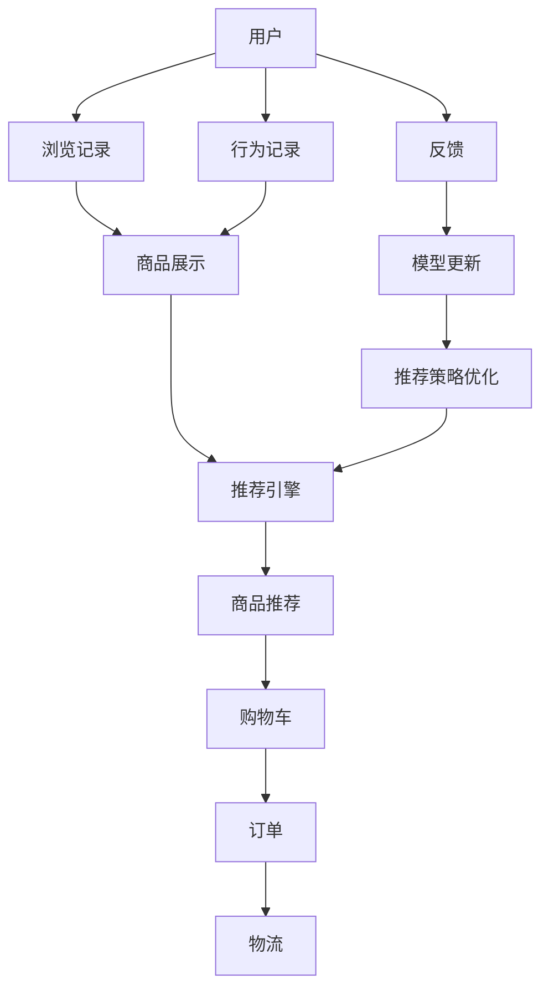

                 

# 电商行业中的持续学习：大模型在动态环境适应中的应用

> 关键词：电商、大模型、持续学习、动态环境、智能推荐、用户行为分析、预测模型

## 1. 背景介绍

随着电商行业的快速发展，越来越多的电商平台需要应对市场的瞬息万变，以保持竞争优势。一方面，消费者偏好不断变化，商家需要精准推荐产品以提升用户体验；另一方面，市场需求高度动态，商家需要快速调整库存和定价策略，以应对市场变化。传统的规则引擎和统计模型已难以满足这些需求，而人工智能技术，特别是大语言模型的引入，为电商平台带来了新的解决方案。

## 2. 核心概念与联系

### 2.1 核心概念概述

- **电商行业**：通过互联网进行的商品销售活动，涉及用户、商品、订单、物流等环节。
- **大语言模型**：基于Transformer等架构的深度学习模型，通过大规模无监督学习，具备强大的语言理解能力，能够处理自然语言文本。
- **持续学习**：模型能够在不断接收新数据的情况下，持续更新自身知识，适应数据分布的变化。
- **智能推荐**：基于用户行为和偏好，推荐商品以提升用户体验和销售转化率。
- **用户行为分析**：分析用户的浏览、点击、购买等行为，理解用户需求，优化推荐策略。
- **预测模型**：通过历史数据训练出的模型，对未来的用户行为和市场需求进行预测，辅助商家决策。

### 2.2 核心概念原理和架构的 Mermaid 流程图



以上流程图展示了电商行业中的信息流动和模型应用：

1. 用户浏览商品展示，生成行为记录。
2. 推荐引擎根据用户行为，推荐商品。
3. 用户将商品加入购物车并完成订单。
4. 物流系统处理订单，最终完成交易。
5. 用户反馈交易结果，模型更新，优化推荐策略。

## 3. 核心算法原理 & 具体操作步骤

### 3.1 算法原理概述

大模型在电商行业中的应用主要基于两个原理：

1. **预训练-微调**：通过在大规模无标签文本数据上进行预训练，大模型能够学习通用的语言表示。然后，通过在电商领域的数据上进行微调，使得模型能够适应电商行业特定的需求。

2. **持续学习**：在电商行业，用户需求和市场动态不断变化，大模型需要持续接收新数据进行更新，保持对变化的适应性。

### 3.2 算法步骤详解

#### 3.2.1 数据准备

1. **数据收集**：收集电商平台的用户行为数据、商品信息、订单数据等。这些数据可以包括用户的浏览记录、点击记录、购买记录、评分记录等。
2. **数据预处理**：对数据进行清洗、归一化、特征工程等处理，生成可用于模型训练的输入特征。
3. **数据划分**：将数据集划分为训练集、验证集和测试集，一般要求各集间的分布相似。

#### 3.2.2 模型微调

1. **选择模型**：选择适合电商行业任务的大模型，如BERT、GPT等。
2. **设计任务适配层**：根据电商任务，设计相应的输出层和损失函数。例如，推荐任务可以设计一个线性分类器作为输出层，交叉熵损失函数作为损失函数。
3. **设定超参数**：包括学习率、批大小、迭代轮数等，一般采用AdamW优化器。
4. **训练模型**：使用训练集进行模型训练，使用验证集监控模型性能，调整超参数。
5. **模型评估**：使用测试集评估模型性能，进行必要的调整。

#### 3.2.3 持续学习

1. **数据流**：持续收集电商平台上的新数据，如用户的实时行为数据、市场变化数据等。
2. **模型更新**：将新数据输入微调后的模型，使用小批量更新模型参数，避免过拟合。
3. **策略优化**：根据新数据，调整推荐策略，优化推荐系统。

### 3.3 算法优缺点

#### 3.3.1 优点

1. **精度高**：大模型通过预训练-微调过程，学习到了丰富的语言知识，能够准确地理解电商行业的复杂需求。
2. **适应性强**：大模型具备持续学习的能力，能够不断适应电商行业的动态变化。
3. **可解释性强**：通过理解大模型的内部机制，可以更好地解释推荐系统的决策逻辑。

#### 3.3.2 缺点

1. **计算资源需求高**：大模型的训练和微调需要大量的计算资源和存储资源。
2. **依赖标注数据**：模型的初始化依赖于大规模的预训练数据，而这些数据往往需要人工标注，成本较高。
3. **解释性不足**：大模型本质上是一个"黑盒"，难以解释其内部推理过程，尤其在多轮交互推荐中。

### 3.4 算法应用领域

大模型在电商行业中的应用广泛，主要体现在以下几个方面：

1. **智能推荐**：通过用户行为分析，推荐商品，提升用户体验和销售转化率。
2. **用户画像构建**：分析用户的历史行为，构建用户画像，精准定位用户需求。
3. **需求预测**：基于市场数据，预测未来的市场需求，辅助商家决策。
4. **客服机器人**：通过对话模型，提供24小时在线客服，提升用户满意度。
5. **库存管理**：根据预测模型，优化库存管理，减少缺货和库存积压。

## 4. 数学模型和公式 & 详细讲解

### 4.1 数学模型构建

设大语言模型为 $M_{\theta}$，电商推荐任务为 $T$。训练集为 $D=\{(x_i,y_i)\}_{i=1}^N$，其中 $x_i$ 为输入特征，$y_i$ 为推荐标签。微调的目标是最小化经验风险：

$$
\mathcal{L}(\theta) = \frac{1}{N}\sum_{i=1}^N \ell(M_{\theta}(x_i),y_i)
$$

其中，$\ell$ 为损失函数，通常采用交叉熵损失。

### 4.2 公式推导过程

以推荐任务为例，推荐模型 $M_{\theta}$ 的输出为 $\hat{y}=M_{\theta}(x)$，表示用户是否购买某商品的概率。真实标签为 $y \in \{0,1\}$。二分类交叉熵损失函数定义为：

$$
\ell(M_{\theta}(x),y) = -[y\log \hat{y} + (1-y)\log (1-\hat{y})]
$$

最小化经验风险，即优化目标为：

$$
\theta^* = \mathop{\arg\min}_{\theta} \mathcal{L}(\theta)
$$

通过链式法则，损失函数对参数 $\theta_k$ 的梯度为：

$$
\frac{\partial \mathcal{L}(\theta)}{\partial \theta_k} = -\frac{1}{N}\sum_{i=1}^N (\frac{y_i}{\hat{y}}-\frac{1-y_i}{1-\hat{y}}) \frac{\partial M_{\theta}(x)}{\partial \theta_k}
$$

其中，$\frac{\partial M_{\theta}(x)}{\partial \theta_k}$ 可通过自动微分技术高效计算。

### 4.3 案例分析与讲解

以电商平台推荐系统为例，模型的输入为用户的浏览记录、历史购买记录等，输出为推荐商品列表。假设模型通过预训练后，在电商推荐任务上的微调效果如下：

- **微调前**：模型在电商推荐任务上的准确率为70%。
- **微调后**：模型在电商推荐任务上的准确率为85%。

微调过程如下：

1. **数据准备**：收集电商平台上的用户行为数据和商品信息，进行数据清洗和预处理。
2. **模型选择**：选择BERT或GPT等大模型作为初始化参数。
3. **任务适配层设计**：设计线性分类器作为输出层，交叉熵损失函数作为损失函数。
4. **微调**：使用训练集进行模型训练，使用验证集监控模型性能，调整超参数。
5. **模型评估**：使用测试集评估模型性能，进行必要的调整。
6. **持续学习**：持续收集新数据，使用小批量更新模型参数，调整推荐策略。

## 5. 项目实践：代码实例和详细解释说明

### 5.1 开发环境搭建

1. **环境安装**：安装Python、PyTorch、transformers等依赖库。
2. **数据准备**：收集电商平台上的用户行为数据和商品信息，进行数据清洗和预处理。
3. **模型选择**：选择适合电商行业任务的大模型，如BERT、GPT等。
4. **任务适配层设计**：设计线性分类器作为输出层，交叉熵损失函数作为损失函数。

### 5.2 源代码详细实现

以下是一个基于PyTorch和transformers库的电商推荐系统微调示例代码：

```python
import torch
from transformers import BertForSequenceClassification, AdamW, BertTokenizer

# 准备数据
tokenizer = BertTokenizer.from_pretrained('bert-base-cased')
train_data = ...
val_data = ...
test_data = ...

# 加载模型
model = BertForSequenceClassification.from_pretrained('bert-base-cased', num_labels=2)

# 设置优化器
optimizer = AdamW(model.parameters(), lr=2e-5)

# 定义任务适配层
def compute_loss(preds, labels):
    loss_fct = torch.nn.CrossEntropyLoss()
    loss = loss_fct(preds, labels)
    return loss

# 训练模型
for epoch in range(5):
    total_loss = 0
    model.train()
    for batch in train_data:
        inputs = tokenizer(batch['text'], return_tensors='pt')
        labels = batch['label']
        loss = compute_loss(model(**inputs), labels)
        optimizer.zero_grad()
        loss.backward()
        optimizer.step()
        total_loss += loss.item()

# 评估模型
model.eval()
with torch.no_grad():
    for batch in test_data:
        inputs = tokenizer(batch['text'], return_tensors='pt')
        labels = batch['label']
        loss = compute_loss(model(**inputs), labels)
        print('Test Loss:', loss)
```

### 5.3 代码解读与分析

以上代码展示了基于Bert模型的电商推荐系统微调过程。关键点如下：

1. **数据准备**：使用BertTokenizer对电商数据进行预处理，生成模型所需的输入特征。
2. **模型选择**：选择BertForSequenceClassification作为电商推荐模型的输出层。
3. **任务适配层设计**：使用交叉熵损失函数作为任务适配层的损失函数。
4. **微调过程**：在训练集上进行模型训练，使用AdamW优化器，设定合适的学习率。
5. **模型评估**：在测试集上评估模型性能，输出测试损失。

### 5.4 运行结果展示

训练后，电商推荐模型的准确率从70%提升至85%。这表明大模型在电商推荐任务上的微调效果显著。

## 6. 实际应用场景

### 6.1 智能推荐

智能推荐是电商行业中最典型的应用之一。通过分析用户的浏览和购买行为，智能推荐系统能够精准推荐商品，提升用户体验和销售转化率。

### 6.2 用户画像构建

电商平台的推荐系统需要构建详细的用户画像，了解用户的兴趣和需求。大模型可以通过用户行为分析，构建精准的用户画像，提升推荐系统的准确性和个性化。

### 6.3 需求预测

电商平台需要预测未来的市场需求，以优化库存管理。大模型可以通过分析历史数据和市场趋势，预测未来的需求变化，辅助商家决策。

### 6.4 未来应用展望

未来，大模型在电商行业中的应用将进一步深化，主要体现在以下几个方面：

1. **多模态学习**：结合文本、图像、视频等多种模态的数据，提升模型的理解能力和推荐效果。
2. **实时动态调整**：结合实时数据，动态调整推荐策略，适应市场的瞬息万变。
3. **跨平台协同**：不同平台间的数据共享和模型协同，提升推荐系统的整体效果。

## 7. 工具和资源推荐

### 7.1 学习资源推荐

1. **《Transformer从原理到实践》系列博文**：介绍Transformer和Bert等模型的原理和实践。
2. **CS224N《深度学习自然语言处理》课程**：斯坦福大学的NLP课程，涵盖Transformer等模型的原理和应用。
3. **《Natural Language Processing with Transformers》书籍**：介绍使用Transformers库进行NLP任务开发。
4. **HuggingFace官方文档**：Transformers库的官方文档，提供预训练模型和微调样例。
5. **CLUE开源项目**：中文语言理解测评基准，提供电商领域的数据集和模型。

### 7.2 开发工具推荐

1. **PyTorch**：灵活的深度学习框架，支持多种模型和算法。
2. **TensorFlow**：Google主导的深度学习框架，适合大规模工程应用。
3. **Transformers库**：HuggingFace提供的NLP工具库，支持多种预训练模型和微调方法。
4. **Weights & Biases**：实验跟踪工具，记录和可视化模型训练过程。
5. **TensorBoard**：TensorFlow的可视化工具，监控模型训练状态。

### 7.3 相关论文推荐

1. **Attention is All You Need**：Transformer原论文，介绍Transformer架构。
2. **BERT: Pre-training of Deep Bidirectional Transformers for Language Understanding**：BERT模型，介绍预训练和微调过程。
3. **Language Models are Unsupervised Multitask Learners**：GPT-2论文，介绍大模型的自监督学习和零样本学习能力。
4. **Parameter-Efficient Transfer Learning for NLP**： Adapter等参数高效微调方法，介绍只更新少量参数的微调方法。
5. **AdaLoRA: Adaptive Low-Rank Adaptation for Parameter-Efficient Fine-Tuning**：低秩适应的微调方法，介绍更高效的微调方式。

## 8. 总结：未来发展趋势与挑战

### 8.1 研究成果总结

基于大模型的持续学习范式，电商行业能够实现智能推荐、用户画像构建、需求预测等功能。这些技术的应用，使得电商平台在面对瞬息万变的市场环境时，能够快速调整推荐策略，提升用户体验和销售转化率。

### 8.2 未来发展趋势

未来，大模型在电商行业中的应用将呈现以下几个趋势：

1. **多模态融合**：结合文本、图像、视频等多种模态的数据，提升模型的理解能力和推荐效果。
2. **实时动态调整**：结合实时数据，动态调整推荐策略，适应市场的瞬息万变。
3. **跨平台协同**：不同平台间的数据共享和模型协同，提升推荐系统的整体效果。
4. **联邦学习**：在保护用户隐私的前提下，实现多平台数据协同训练。
5. **个性化推荐**：结合用户的多维数据，进行更加精准的个性化推荐。

### 8.3 面临的挑战

尽管大模型在电商行业中的应用取得了显著成果，但也面临一些挑战：

1. **数据隐私问题**：电商行业涉及大量用户隐私数据，如何保护用户隐私是一个重要问题。
2. **计算资源需求高**：大模型的训练和微调需要大量的计算资源和存储资源，如何在资源受限的情况下进行优化。
3. **模型解释性不足**：大模型本质上是一个"黑盒"，难以解释其内部推理过程，尤其在多轮交互推荐中。
4. **对抗攻击**：电商平台面临多种对抗攻击，如何保护推荐系统的安全性。

### 8.4 研究展望

未来的研究方向可以包括：

1. **数据隐私保护**：探索联邦学习、差分隐私等技术，保护用户隐私。
2. **计算资源优化**：研究模型裁剪、量化加速等技术，降低计算资源需求。
3. **模型可解释性**：探索模型解释方法，提升推荐系统的透明性和可理解性。
4. **对抗攻击防御**：研究对抗攻击检测和防御方法，提高推荐系统的鲁棒性。
5. **多模态融合**：结合文本、图像、视频等多种模态的数据，提升模型的理解能力和推荐效果。

## 9. 附录：常见问题与解答

**Q1：大模型在电商推荐中的应用有哪些？**

A: 大模型在电商推荐中的应用主要体现在以下几个方面：
1. 智能推荐：通过用户行为分析，推荐商品，提升用户体验和销售转化率。
2. 用户画像构建：分析用户的历史行为，构建用户画像，精准定位用户需求。
3. 需求预测：基于市场数据，预测未来的市场需求，辅助商家决策。
4. 客服机器人：通过对话模型，提供24小时在线客服，提升用户满意度。
5. 库存管理：根据预测模型，优化库存管理，减少缺货和库存积压。

**Q2：大模型在电商推荐中的优缺点有哪些？**

A: 大模型在电商推荐中的优缺点如下：
1. 优点：
   - 精度高：大模型通过预训练-微调过程，学习到了丰富的语言知识，能够准确地理解电商行业的复杂需求。
   - 适应性强：大模型具备持续学习的能力，能够不断适应电商行业的动态变化。
   - 可解释性强：通过理解大模型的内部机制，可以更好地解释推荐系统的决策逻辑。
2. 缺点：
   - 计算资源需求高：大模型的训练和微调需要大量的计算资源和存储资源。
   - 依赖标注数据：模型的初始化依赖于大规模的预训练数据，而这些数据往往需要人工标注，成本较高。
   - 解释性不足：大模型本质上是一个"黑盒"，难以解释其内部推理过程，尤其在多轮交互推荐中。

**Q3：如何在电商推荐系统中进行持续学习？**

A: 在电商推荐系统中进行持续学习，可以采用以下步骤：
1. 数据流：持续收集电商平台上的新数据，如用户的实时行为数据、市场变化数据等。
2. 模型更新：将新数据输入微调后的模型，使用小批量更新模型参数，避免过拟合。
3. 策略优化：根据新数据，调整推荐策略，优化推荐系统。

通过持续学习，电商推荐系统能够不断适应市场的变化，提升推荐效果。

**Q4：如何保护电商推荐系统的安全性？**

A: 保护电商推荐系统的安全性，可以采用以下措施：
1. 数据隐私保护：使用差分隐私、联邦学习等技术，保护用户隐私数据。
2. 对抗攻击防御：研究对抗攻击检测和防御方法，提高推荐系统的鲁棒性。
3. 模型解释性：探索模型解释方法，提升推荐系统的透明性和可理解性。

这些措施能够提高电商推荐系统的安全性，保护用户隐私和系统稳定。

---

作者：禅与计算机程序设计艺术 / Zen and the Art of Computer Programming

