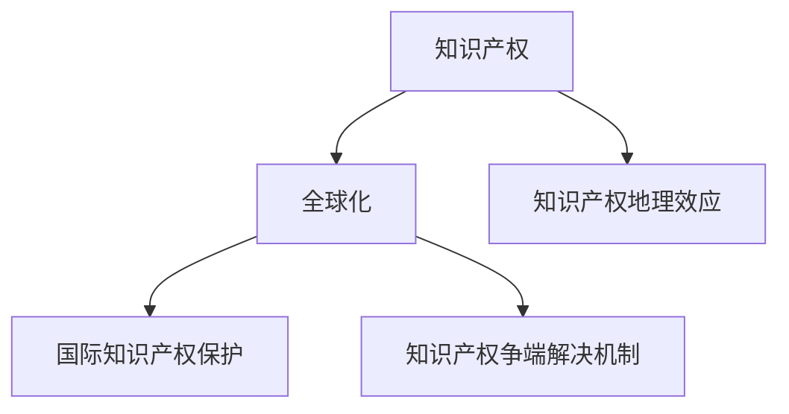

                 

# 知识产权与全球化的互动关系

## 1. 背景介绍

在全球化的大背景下，知识产权（IPR）扮演着日益重要的角色。它不仅保护了创新成果，也促进了全球技术、文化和经济的交流与合作。然而，知识产权的全球化保护与实施，也面临诸多挑战和复杂性。本文将探讨知识产权与全球化之间的互动关系，分析其中的机遇与挑战，并提出相应的应对策略。

## 2. 核心概念与联系

### 2.1 核心概念概述

为更好地理解知识产权与全球化之间的关系，本节将介绍几个密切相关的核心概念：

- **知识产权**：指与创作相关的各种权利，包括著作权、专利权、商标权、工业设计权等。它是保护创作者利益的法律工具，鼓励创新和创意表达。

- **全球化**：指不同国家和地区之间在经济、文化、技术等方面的相互依赖和融合。全球化促进了商品、资本、技术和人才的跨国流动。

- **国际知识产权保护**：指通过多边或双边协定，如《与贸易有关的知识产权协议》(TRIPS)、《专利合作条约》(PCT)等，保护知识产权权利人全球范围内的利益。

- **知识产权争端解决机制**：如世界贸易组织(WTO)、世界知识产权组织(WIPO)等机构，提供国际知识产权纠纷解决的机制和平台。

- **知识产权地理效应**：由于不同国家/地区的法律、文化、经济环境不同，知识产权的保护和实施也存在显著差异。

这些核心概念之间的逻辑关系可以通过以下Mermaid流程图来展示：



这个流程图展示了几者之间的内在联系：

1. 知识产权保护促进了全球化的发展，保障了跨国技术、文化和商品交流的自由和公平。
2. 全球化促进了知识产权的需求和实施，推动了国际知识产权保护的加强。
3. 国际知识产权保护和争端解决机制，保障了全球知识产权的公正、公平和透明度。
4. 知识产权的地理效应，则体现了不同国家/地区的法律和文化差异，影响着全球知识产权的实施。

## 3. 核心算法原理 & 具体操作步骤

### 3.1 算法原理概述

知识产权与全球化的互动关系，可以从以下几个方面进行理解：

- **知识产权保护与国际贸易**：知识产权是国际贸易的重要组成部分，它影响着贸易协定和关税壁垒的设置。同时，国际贸易也促进了全球范围内的知识产权保护和实施。
- **技术转移与全球化**：全球化推动了技术转移，知识产权保护确保了技术的公平分享和创新。
- **知识产权争端与国际贸易**：国际知识产权争端常涉及国际贸易规则，争端解决机制保障了知识产权权利人的利益。
- **知识产权地理效应与全球化**：全球化促进了知识产权地理效应的研究和应对，帮助跨国企业在全球范围内优化知识产权布局。

### 3.2 算法步骤详解

基于上述原理，以下是一般的算法步骤：

**Step 1: 数据收集与分析**
- 收集相关国家/地区的知识产权数据，如专利申请量、授权量、商标注册量等。
- 分析不同国家/地区的知识产权政策和法规，识别知识产权地理效应。

**Step 2: 模型构建**
- 构建知识产权与全球化互动的数学模型，识别关键因素和影响机制。
- 使用机器学习或统计学方法，建立预测和评估模型。

**Step 3: 算法优化**
- 使用不同的算法（如回归分析、聚类分析、神经网络等），对模型进行优化。
- 应用交叉验证等方法，确保模型的泛化能力。

**Step 4: 实施与验证**
- 在选定国家/地区实施模型，进行实证分析。
- 使用案例研究、问卷调查等方法，验证模型的有效性和准确性。

**Step 5: 结果分析**
- 分析模型结果，识别关键影响因素和策略。
- 提出相应的政策建议和应对措施，优化知识产权保护和实施。

### 3.3 算法优缺点

基于知识产权与全球化互动关系的算法具有以下优点：

- **系统性和全面性**：能够综合考虑多个因素，构建复杂的数学模型。
- **数据驱动和实证性**：依赖大量实证数据，能够准确反映知识产权与全球化的实际关系。
- **动态性和适应性**：模型能够适应全球化动态变化，实时更新和优化。

但同时也存在以下缺点：

- **数据获取难度大**：需要收集大量跨国家/地区的知识产权数据，获取难度大。
- **模型复杂度高**：构建复杂的数学模型需要专业知识，对数据质量要求高。
- **模型结果解释性差**：模型输出结果可能缺乏直观的解释和理解。

### 3.4 算法应用领域

基于知识产权与全球化互动关系的算法，在以下领域有着广泛应用：

- **国际贸易与投资**：帮助企业制定知识产权战略，优化国际贸易和投资决策。
- **技术转移与创新**：推动全球技术转移，促进创新。
- **知识产权政策制定**：为各国政府提供知识产权政策制定和调整的依据。
- **知识产权争端解决**：帮助国际机构处理知识产权争端，提供解决方案。
- **全球知识产权地理效应研究**：识别和应对不同国家/地区的知识产权差异，优化全球知识产权布局。

## 4. 数学模型和公式 & 详细讲解 & 举例说明

### 4.1 数学模型构建

构建一个简单的知识产权与全球化互动关系模型，使用回归分析方法。假设输入变量包括：

- 国家GDP（经济实力）
- 人均专利申请量
- 国际专利合作条约（PCT）申请量
- 跨国公司数量

输出变量为：

- 专利授权率

### 4.2 公式推导过程

构建回归模型，假设模型为：

$$
y = \beta_0 + \beta_1 x_1 + \beta_2 x_2 + \beta_3 x_3 + \beta_4 x_4 + \epsilon
$$

其中，$y$为专利授权率，$x_1$到$x_4$分别为GDP、人均专利申请量、PCT申请量和跨国公司数量，$\beta$为回归系数，$\epsilon$为误差项。

使用最小二乘法，求解$\beta$：

$$
\hat{\beta} = (X^TX)^{-1}X^Ty
$$

其中$X$为自变量矩阵，$y$为因变量向量。

### 4.3 案例分析与讲解

以美国和中国的知识产权数据为例，分析两国在全球化背景下的互动关系。

- **数据集**：收集美国和中国的GDP、人均专利申请量、PCT申请量和跨国公司数量。
- **模型构建**：构建回归模型，识别各因素对专利授权率的影响。
- **结果分析**：分析回归系数，识别关键影响因素，提出优化知识产权保护和实施的策略。

## 5. 项目实践：代码实例和详细解释说明

### 5.1 开发环境搭建

在进行项目实践前，我们需要准备好开发环境。以下是Python和R语言的具体配置流程：

1. 安装Anaconda：从官网下载并安装Anaconda，用于创建独立的Python或R环境。

2. 创建并激活虚拟环境：
```bash
conda create -n ipr_env python=3.8 
conda activate ipr_env
```

3. 安装所需的Python包或R包：
```bash
# Python
pip install pandas numpy matplotlib scikit-learn seaborn
# R
install.packages(c("ggplot2", "dplyr", "tidyverse", "caret"))
```

完成上述步骤后，即可在`ipr_env`环境中开始项目实践。

### 5.2 源代码详细实现

以下是一个简单的Python和R代码实例，用于构建和分析知识产权与全球化互动关系模型。

**Python代码**：

```python
import pandas as pd
from sklearn.linear_model import LinearRegression
import matplotlib.pyplot as plt

# 导入数据集
df = pd.read_csv('ipr_data.csv')

# 构建模型
model = LinearRegression()
X = df[['GDP', 'person_patent', 'PCT_patent', 'multinational_comp']]
y = df['patent_grant_rate']
model.fit(X, y)

# 预测结果
prediction = model.predict([[400000000, 10000, 50000, 1000]])

# 可视化结果
plt.scatter(df['GDP'], df['patent_grant_rate'])
plt.plot(df['GDP'], model.predict(X), color='red')
plt.xlabel('GDP')
plt.ylabel('Patent Grant Rate')
plt.title('IPR vs GDP')
plt.show()

# 输出预测结果
print(prediction)
```

**R代码**：

```R
library(tidyverse)
library(caret)

# 导入数据集
df <- read.csv('ipr_data.csv')

# 构建模型
model <- train(patent_grant ~ GDP + person_patent + PCT_patent + multinational_comp, data = df, method = 'lm')

# 预测结果
prediction <- predict(model, newdata = data.frame(GDP = 400000000, person_patent = 10000, PCT_patent = 50000, multinational_comp = 1000))

# 可视化结果
ggplot(df, aes(x = GDP, y = patent_grant)) + 
  geom_point() +
  geom_abline(intercept = model$coefficients[0], slope = model$coefficients[1], color = 'red') +
  labs(x = 'GDP', y = 'Patent Grant Rate', title = 'IPR vs GDP')

# 输出预测结果
print(prediction)
```

### 5.3 代码解读与分析

**Python代码解读**：

1. **数据导入**：使用pandas库导入CSV格式的数据集。
2. **模型构建**：使用scikit-learn库的LinearRegression模型，构建线性回归模型。
3. **预测结果**：使用模型对新的数据点进行预测，并可视化预测结果。
4. **输出结果**：打印预测结果。

**R代码解读**：

1. **数据导入**：使用read.csv函数导入CSV格式的数据集。
2. **模型构建**：使用train函数，选择线性回归模型（lm），构建训练模型。
3. **预测结果**：使用predict函数对新的数据点进行预测，并可视化预测结果。
4. **输出结果**：打印预测结果。

## 6. 实际应用场景

### 6.1 国际贸易与投资

知识产权保护和国际贸易密切相关。例如，TRIPS协议要求成员国必须对药品、医疗器械、计算机软件等给予充分保护。跨国公司在全球范围内的知识产权布局，直接影响其国际贸易和投资决策。

**案例**：某跨国公司在多个国家申请专利，通过构建知识产权与全球化互动模型，分析不同国家知识产权保护强度对公司收益的影响，制定合理的国际投资战略。

### 6.2 技术转移与创新

全球化促进了技术转移和创新。例如，跨国企业通过专利申请和技术授权，将先进的科技成果引入不同国家，促进了技术传播和本地化创新。

**案例**：某国际科技合作项目，通过构建模型分析不同国家/地区技术转移对本地创新的促进作用，提出优化知识产权保护和促进技术转移的策略。

### 6.3 知识产权政策制定

各国政府在制定知识产权政策时，需要综合考虑全球化背景下的国际规则和本地需求。通过分析不同国家/地区知识产权政策的影响，提出针对性的政策建议。

**案例**：某国政府制定新的知识产权保护政策，通过模型分析不同因素对知识产权保护和实施的影响，优化政策制定。

### 6.4 知识产权争端解决

国际知识产权争端常涉及跨国公司和不同国家的法律环境。通过建立知识产权与全球化互动模型，提供解决方案和预测结果，帮助国际机构处理争端。

**案例**：某国际知识产权争端案件，通过构建模型分析双方知识产权优势和法律环境，提出解决方案。

## 7. 工具和资源推荐

### 7.1 学习资源推荐

为了帮助开发者系统掌握知识产权与全球化互动的理论基础和实践技巧，这里推荐一些优质的学习资源：

1. **《知识产权经济学》**：由知名学者撰写，深入浅出地介绍了知识产权与全球化互动的理论和实践。
2. **《国际贸易与知识产权保护》**：介绍了国际贸易中知识产权保护的基本原则和实践。
3. **《全球知识产权法》**：全面介绍了全球范围内的知识产权法律法规和争端解决机制。
4. **在线课程**：如Coursera、edX等平台上的相关课程，深入讲解知识产权与全球化互动的原理和应用。

### 7.2 开发工具推荐

高效的工具支持是实现知识产权与全球化互动关系研究的基础。以下是几款推荐的工具：

1. **Python**：Python是一种强大的编程语言，支持广泛的机器学习和统计分析库。
2. **R语言**：R语言在数据统计和可视化方面具有优势，适用于知识产权数据分析。
3. **Microsoft Excel**：可用于数据分析和简单的回归分析。
4. **Tableau**：支持数据的可视化和探索分析，帮助快速理解知识产权与全球化的互动关系。

### 7.3 相关论文推荐

知识产权与全球化互动研究已经积累了丰富的文献，以下是几篇代表性的论文：

1. **《知识产权保护与全球化：现状与未来》**：分析了全球化背景下知识产权保护的主要问题和挑战。
2. **《国际贸易中的知识产权争端解决》**：探讨了知识产权争端解决机制的作用和效果。
3. **《知识产权地理效应分析》**：研究了不同国家/地区的知识产权保护差异及其影响。
4. **《全球知识产权保护的地理效应》**：分析了全球化对知识产权地理效应的影响。

## 8. 总结：未来发展趋势与挑战

### 8.1 研究成果总结

本文对知识产权与全球化互动关系进行了全面系统的分析。首先阐述了知识产权和全球化之间的互动关系，明确了全球化背景下知识产权保护的重要性。其次，从算法原理到实际操作，详细讲解了模型构建和预测分析的详细步骤。同时，本文还广泛探讨了知识产权与全球化互动关系在多个行业领域的应用前景，展示了其广阔的发展空间。最后，本文精选了相关学习资源、开发工具和经典论文，力求为读者提供全方位的技术指引。

通过本文的系统梳理，可以看到，知识产权与全球化互动关系研究在理论和应用上都具有重要意义。它不仅促进了全球技术、文化和经济的交流与合作，也推动了国际知识产权保护的加强。未来，随着全球化的深入发展，知识产权与全球化互动关系研究将更加重要，需要我们不断探索和优化。

### 8.2 未来发展趋势

展望未来，知识产权与全球化互动关系研究将呈现以下几个发展趋势：

1. **数据驱动的决策支持**：随着大数据和人工智能技术的进步，知识产权与全球化互动关系的预测和决策将更加精准和高效。
2. **跨学科整合**：知识产权与全球化互动关系研究将更多地融入经济学、社会学、法律学等学科，形成更全面的研究视角。
3. **全球合作加强**：各国政府和企业将加强国际合作，共同应对知识产权保护的挑战，推动全球知识产权保护的平衡和公正。
4. **新兴技术的引入**：如区块链、人工智能等新兴技术，将对知识产权与全球化互动关系研究带来新的思路和工具。

### 8.3 面临的挑战

尽管知识产权与全球化互动关系研究取得了一定进展，但在迈向更深入和广泛应用的过程中，仍面临诸多挑战：

1. **数据获取难度大**：不同国家/地区的知识产权数据获取难度较大，需要更多的国际合作和数据共享机制。
2. **模型复杂度高**：构建复杂的数学模型需要专业知识，对数据质量要求高，难以广泛推广。
3. **结果解释性差**：模型输出结果可能缺乏直观的解释和理解，需要进一步简化和优化。
4. **法律和政策差异**：不同国家/地区的知识产权法律和政策差异较大，影响模型在全球范围内的适用性。

### 8.4 研究展望

未来，知识产权与全球化互动关系研究需要在以下几个方面寻求新的突破：

1. **数据整合与共享**：推动不同国家/地区的知识产权数据整合与共享，建立全球统一的数据标准和平台。
2. **模型简化与优化**：简化模型，提高可解释性，降低对专业知识的依赖，提升模型的普适性和实用性。
3. **国际合作加强**：各国政府和企业加强国际合作，共同推动知识产权保护和全球化研究的进步。
4. **新兴技术引入**：引入区块链、人工智能等新兴技术，提升知识产权与全球化互动关系研究的效率和准确性。

这些研究方向的探索，必将引领知识产权与全球化互动关系研究迈向更高的台阶，为全球知识产权保护和实施提供新的思路和工具。面向未来，知识产权与全球化互动关系研究还需要与其他相关领域进行更深入的融合，共同推动全球知识产权保护的进步。

## 9. 附录：常见问题与解答

**Q1：如何平衡知识产权保护和全球化发展？**

A: 平衡知识产权保护和全球化发展，需要综合考虑不同国家和地区的需求和利益。各国政府和企业可以通过国际合作和政策协调，共同制定合理的知识产权保护策略，推动全球化发展。

**Q2：如何应对知识产权地理效应带来的挑战？**

A: 应对知识产权地理效应带来的挑战，可以通过构建跨国家/地区的知识产权数据库，共享数据和研究成果。同时，各国政府和企业可以加强国际合作，制定统一的知识产权保护标准和机制。

**Q3：如何提高知识产权预测模型的准确性？**

A: 提高知识产权预测模型的准确性，需要收集和分析更多的高质量数据，优化模型结构和参数。可以使用机器学习和深度学习技术，构建更复杂的预测模型。

**Q4：如何应对跨国知识产权争端？**

A: 应对跨国知识产权争端，需要建立国际知识产权争端解决机制，提供公正、透明的争端解决平台。同时，企业和政府可以通过谈判和合作，化解争端，推动知识产权保护的平衡和公正。

**Q5：如何优化跨国公司的知识产权布局？**

A: 优化跨国公司的知识产权布局，需要综合考虑不同国家和地区的需求和利益，制定合理的知识产权战略。可以利用知识产权与全球化互动模型，分析不同国家和地区的知识产权保护强度和市场环境，制定最优的知识产权布局策略。

