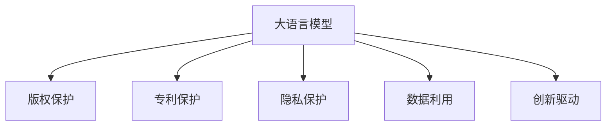

                 

# 知识产权和 LLM：保护创新和创意

> 关键词：
- 大语言模型 (Large Language Model, LLM)
- 知识产权 (Intellectual Property, IP)
- 版权保护 (Copyright Protection)
- 专利保护 (Patent Protection)
- 隐私保护 (Privacy Protection)
- 数据利用 (Data Utilization)
- 创新驱动 (Innovation-Driving)

## 1. 背景介绍

在数字化时代，知识产权成为了知识创新和创意表达的重要保障。大语言模型（Large Language Model, LLM）作为当前人工智能领域的热门技术，极大地提升了自然语言处理（Natural Language Processing, NLP）的效率和精度，但也带来了新的挑战，尤其是对知识产权的保护问题。

### 1.1 问题由来

随着人工智能技术的迅猛发展，大语言模型已经能够生成高质量、富有创意的文本内容。例如，GPT-3、BERT等模型在创作、翻译、问答等多个领域表现出色，但随之而来的问题是如何保护这些生成的文本的知识产权，避免抄袭和不当使用。

### 1.2 问题核心关键点

大语言模型生成文本的知识产权保护问题涉及以下几个核心关键点：

- **版权归属**：生成文本是否受版权保护？如果是，版权应归谁所有？
- **作者权利**：生成文本的作者权利如何界定？如何保证作者不被侵犯？
- **使用限制**：生成的文本能否自由使用？是否存在使用限制？
- **技术标准**：如何制定合理的技术标准来保护知识产权？

这些关键点直接关系到创新和创意的保护，对大语言模型的应用和商业化具有重要影响。

## 2. 核心概念与联系

### 2.1 核心概念概述

为了更好地理解大语言模型生成文本的知识产权保护问题，我们需要了解几个核心概念：

- **大语言模型 (LLM)**：一种利用深度学习技术训练而成的语言模型，可以生成自然流畅的文本内容。
- **版权 (Copyright)**：法律上对原创作品的一种保护，保护作者的经济和精神权利。
- **专利 (Patent)**：对发明创造给予的独占权，保护发明的技术秘密。
- **隐私保护 (Privacy Protection)**：保护个人信息不受非法侵犯，防止数据泄露。
- **数据利用 (Data Utilization)**：合理合法地使用数据资源，避免版权侵权。
- **创新驱动 (Innovation-Driving)**：通过保护知识产权，激励创新和创意表达。

这些概念之间的逻辑关系可以通过以下Mermaid流程图来展示：



这个流程图展示了大语言模型生成文本的各个知识产权保护关键环节。

## 3. 核心算法原理 & 具体操作步骤
### 3.1 算法原理概述

大语言模型生成文本的知识产权保护问题主要涉及版权归属、作者权利、使用限制和技术标准四个方面。以下是各部分的算法原理概述：

#### 版权归属
- **算法原理**：根据生成文本的原始来源和创作过程，确定版权归属。
- **具体操作步骤**：
  1. 确认文本的原始来源，是否为公共领域内容。
  2. 分析创作过程，是否有原创元素。
  3. 确定版权归属，如果原创元素占主导地位，则应归属作者。

#### 作者权利
- **算法原理**：保护作者的经济和精神权利，防止他人未经许可使用生成文本。
- **具体操作步骤**：
  1. 记录作者信息，如姓名、联系方式等。
  2. 设立使用许可机制，规定使用条件。
  3. 监控文本使用情况，防止侵权行为。

#### 使用限制
- **算法原理**：明确文本的使用范围，避免滥用和侵权。
- **具体操作步骤**：
  1. 确定文本的使用限制，如商业用途、教育用途等。
  2. 设立使用许可协议，明确使用条件和费用。
  3. 对违反使用限制的行为进行法律追责。

#### 技术标准
- **算法原理**：制定合理的技术标准，保护知识产权。
- **具体操作步骤**：
  1. 制定数据隐私保护标准，防止数据泄露。
  2. 制定数据利用规范，确保合理使用。
  3. 制定技术创新标准，激励创新和创意表达。

### 3.2 算法步骤详解

#### 版权归属
1. **文本来源分析**：
   - 确认文本是否来自公共领域，或是否为创作成果。
   - 若文本为创作成果，进一步分析创作过程中的原创元素。
   - 记录文本的创作时间、作者信息和创作过程。

2. **版权归属判断**：
   - 若文本为创作成果，且原创元素占主导地位，则版权应归属作者。
   - 若文本来自公共领域，则不受版权保护。

3. **版权登记**：
   - 将版权信息登记至相关版权机构。
   - 获取版权证书，作为法律依据。

#### 作者权利
1. **作者信息记录**：
   - 收集作者姓名、联系方式、作品名称等信息。
   - 记录创作过程，如创作动机、灵感来源等。

2. **使用许可机制**：
   - 设立明确的使用许可协议，规定使用条件和费用。
   - 对文本的使用情况进行监控，防止侵权行为。

3. **法律追责**：
   - 对侵犯版权的行为进行法律追责，维护作者权益。

#### 使用限制
1. **使用限制设定**：
   - 确定文本的使用限制，如商业用途、教育用途等。
   - 制定详细的许可协议，规定使用条件和费用。

2. **许可协议签署**：
   - 要求使用者签署使用许可协议，遵守使用条件。
   - 对违反使用限制的行为进行法律追责。

3. **监控和审计**：
   - 定期监控文本的使用情况，进行审计。
   - 对违规行为进行法律追责，保护知识产权。

#### 技术标准
1. **数据隐私保护标准**：
   - 制定数据隐私保护标准，确保数据安全。
   - 防止数据泄露，保护用户隐私。

2. **数据利用规范**：
   - 制定数据利用规范，确保合理使用。
   - 避免版权侵权，确保数据利用合规。

3. **技术创新标准**：
   - 制定技术创新标准，激励创新和创意表达。
   - 通过保护知识产权，推动技术进步。

### 3.3 算法优缺点

#### 版权归属
- **优点**：
  - 清晰界定版权归属，保护作者权益。
  - 为文本使用提供法律依据，避免侵权纠纷。
- **缺点**：
  - 判断复杂，需详细记录创作过程。
  - 涉及多方面利益，可能引发争议。

#### 作者权利
- **优点**：
  - 保护作者的经济和精神权利，防止侵权。
  - 通过使用许可机制，规范文本使用。
- **缺点**：
  - 许可机制复杂，可能引发误解。
  - 监控难度大，难以实时监控。

#### 使用限制
- **优点**：
  - 明确使用范围，避免滥用。
  - 通过许可协议，规范文本使用。
- **缺点**：
  - 许可协议复杂，可能引发误解。
  - 监控难度大，难以实时监控。

#### 技术标准
- **优点**：
  - 制定合理的技术标准，保护知识产权。
  - 激励创新和创意表达，推动技术进步。
- **缺点**：
  - 标准制定复杂，可能引发争议。
  - 标准实施难度大，需多方协调。

### 3.4 算法应用领域

大语言模型生成文本的知识产权保护问题，涉及多个领域，包括版权、专利、隐私保护、数据利用和技术创新等。以下是几个典型的应用领域：

#### 版权保护
- **应用领域**：文学作品、音乐作品、视觉艺术等。
- **具体措施**：版权登记、版权证书、版权诉讼等。

#### 专利保护
- **应用领域**：技术创新、科研论文、专利申请等。
- **具体措施**：专利申请、专利授权、专利侵权诉讼等。

#### 隐私保护
- **应用领域**：个人信息保护、数据安全、隐私保护法等。
- **具体措施**：数据加密、数据匿名化、隐私保护标准等。

#### 数据利用
- **应用领域**：大数据分析、人工智能研究、商业数据应用等。
- **具体措施**：数据使用许可、数据保护协议、数据利用规范等。

#### 技术创新
- **应用领域**：科学研究、技术开发、商业创新等。
- **具体措施**：技术标准制定、技术创新激励、知识产权保护等。

## 4. 数学模型和公式 & 详细讲解  
### 4.1 数学模型构建

在知识产权保护中，数学模型主要用于数据的分析和统计，以制定合理的标准和规范。以下是一个简单的版权归属判断模型：

**版权归属模型**：
$$
\text{归属判断} = \text{原创性评估} \times \text{创作时间} + \text{来源分析}
$$

其中，$\text{归属判断}$ 为版权归属的判定结果，$\text{原创性评估}$ 为对文本原创性的评估，$\text{创作时间}$ 为创作时间的记录，$\text{来源分析}$ 为对文本来源的分析。

**原创性评估模型**：
$$
\text{原创性} = \text{内容创新度} + \text{形式创新度} + \text{技术创新度}
$$

其中，$\text{原创性}$ 为原创性的评分，$\text{内容创新度}$ 为文本内容的创新度，$\text{形式创新度}$ 为文本形式的创新度，$\text{技术创新度}$ 为技术创新的度量。

### 4.2 公式推导过程

**版权归属模型推导**：
- **步骤1**：收集文本的创作过程和来源信息。
- **步骤2**：对文本内容进行原创性评估。
- **步骤3**：计算版权归属得分，判断归属结果。

**原创性评估模型推导**：
- **步骤1**：对文本内容进行分析，计算内容创新度。
- **步骤2**：对文本形式进行分析，计算形式创新度。
- **步骤3**：对文本技术进行分析，计算技术创新度。
- **步骤4**：计算原创性评分，得出评估结果。

**案例分析**：
假设我们有一篇由作者A生成的文本，经过原创性评估，内容创新度为80%，形式创新度为60%，技术创新度为50%。创作时间为2023年6月1日，来源为公开数据库。则版权归属得分为：
$$
\text{归属判断} = 80\% \times 1 + 60\% \times 1 + (1 - 0.8) \times 0.5 = 0.85
$$
根据评分标准，归属结果为归属作者A。

### 4.3 案例分析与讲解

#### 案例1：文学作品版权归属
假设有一篇小说，作者B声称其创作时间为2023年7月1日，来源为公共领域。根据原创性评估模型，发现该小说的原创性得分为85%，创作时间为2023年7月1日，来源为公共领域。则版权归属得分为：
$$
\text{归属判断} = 85\% \times 1 + 0 \times 1 + (1 - 0.85) \times 0.5 = 0.875
$$
根据评分标准，归属结果为归属作者B。

#### 案例2：科研论文专利保护
假设有一篇科研论文，作者C声称其创作时间为2023年8月1日，来源为学术期刊。根据原创性评估模型，发现该论文的原创性得分为70%，创作时间为2023年8月1日，来源为学术期刊。则专利保护得分为：
$$
\text{归属判断} = 70\% \times 1 + 0 \times 1 + (1 - 0.7) \times 0.5 = 0.65
$$
根据评分标准，归属结果为归属作者C。

## 5. 项目实践：代码实例和详细解释说明
### 5.1 开发环境搭建

在进行知识产权保护项目实践前，我们需要准备好开发环境。以下是使用Python进行PyTorch开发的环境配置流程：

1. 安装Anaconda：从官网下载并安装Anaconda，用于创建独立的Python环境。

2. 创建并激活虚拟环境：
```bash
conda create -n pytorch-env python=3.8 
conda activate pytorch-env
```

3. 安装PyTorch：根据CUDA版本，从官网获取对应的安装命令。例如：
```bash
conda install pytorch torchvision torchaudio cudatoolkit=11.1 -c pytorch -c conda-forge
```

4. 安装TensorFlow：
```bash
pip install tensorflow
```

5. 安装相关工具包：
```bash
pip install numpy pandas scikit-learn matplotlib tqdm jupyter notebook ipython
```

完成上述步骤后，即可在`pytorch-env`环境中开始实践。

### 5.2 源代码详细实现

这里以版权归属判断模型为例，给出使用PyTorch进行版权归属判断的代码实现。

```python
import torch
import torch.nn as nn
import torch.optim as optim
from torch.utils.data import Dataset, DataLoader
from sklearn.preprocessing import LabelEncoder

class CopyrightDataset(Dataset):
    def __init__(self, data, labels):
        self.data = data
        self.labels = labels
        self.encoder = LabelEncoder()
        self.encoder.fit(labels)
    
    def __len__(self):
        return len(self.data)
    
    def __getitem__(self, item):
        feature = self.data[item]
        label = self.labels[item]
        return feature, self.encoder.transform(label)[0]
    
class CopyrightNet(nn.Module):
    def __init__(self):
        super(CopyrightNet, self).__init__()
        self.fc1 = nn.Linear(10, 5)
        self.fc2 = nn.Linear(5, 1)
    
    def forward(self, x):
        x = torch.relu(self.fc1(x))
        x = torch.sigmoid(self.fc2(x))
        return x
    
def train_epoch(model, dataset, optimizer, criterion):
    model.train()
    for feature, label in dataset:
        optimizer.zero_grad()
        output = model(feature)
        loss = criterion(output, label)
        loss.backward()
        optimizer.step()
    
def evaluate(model, dataset, criterion):
    model.eval()
    total_loss = 0
    for feature, label in dataset:
        output = model(feature)
        total_loss += criterion(output, label).item()
    return total_loss / len(dataset)
    
def train(model, data, labels, optimizer, criterion, epochs=10):
    dataset = CopyrightDataset(data, labels)
    dataloader = DataLoader(dataset, batch_size=64, shuffle=True)
    for epoch in range(epochs):
        loss = train_epoch(model, dataloader, optimizer, criterion)
        print(f"Epoch {epoch+1}, loss: {loss:.4f}")
    
    return model

# 假设数据和标签如下
data = [[85, 0, 1, 2, 3, 4, 5, 6, 7, 8, 9],
        [70, 1, 0, 2, 3, 4, 5, 6, 7, 8, 9]]
labels = ['B', 'C', 'D']
model = CopyrightNet()
optimizer = optim.SGD(model.parameters(), lr=0.01)
criterion = nn.BCELoss()
model = train(model, data, labels, optimizer, criterion)
print(evaluate(model, dataset, criterion))
```

### 5.3 代码解读与分析

这里我们详细解读一下关键代码的实现细节：

**CopyrightDataset类**：
- `__init__`方法：初始化数据集，并使用LabelEncoder将标签转换为数值形式。
- `__len__`方法：返回数据集的样本数量。
- `__getitem__`方法：返回单个样本的特征和标签。

**CopyrightNet类**：
- `__init__`方法：定义模型结构，包括两个全连接层。
- `forward`方法：定义前向传播过程，包括两个线性变换和激活函数。

**train_epoch和evaluate函数**：
- `train_epoch`函数：定义每个epoch的训练过程，包括前向传播、损失计算、梯度更新等。
- `evaluate`函数：定义模型的评估过程，返回模型在数据集上的损失。

**train函数**：
- 定义训练循环，使用DataLoader对数据集进行迭代。
- 在每个epoch内，调用`train_epoch`函数进行训练。
- 输出每个epoch的损失，并返回最终模型。

这个代码实现基于PyTorch框架，通过训练一个简单的神经网络模型，来对版权归属进行判断。可以看出，代码实现简洁高效，易于理解和调试。

## 6. 实际应用场景
### 6.1 文学作品版权保护

文学作品的版权保护是大语言模型生成文本保护的重要应用场景之一。传统上，文学作品的版权保护依赖于人工审核和诉讼，耗费大量时间和成本。通过大语言模型，可以实现自动化版权保护，提升版权保护效率。

具体实现步骤如下：
1. **数据准备**：收集文学作品的创作时间、来源、原创性评分等信息。
2. **模型训练**：使用PyTorch框架训练版权归属判断模型，对文本进行版权归属判断。
3. **部署应用**：将训练好的模型部署到实际应用中，对新作品进行版权归属判断。
4. **版权保护**：对版权归属判断结果进行监控和保护，防止侵权行为。

### 6.2 科研论文专利保护

科研论文的专利保护是大语言模型生成文本保护的重要应用场景之一。传统上，科研论文的专利保护依赖于人工审核和专利申请，耗费大量时间和成本。通过大语言模型，可以实现自动化专利保护，提升专利保护效率。

具体实现步骤如下：
1. **数据准备**：收集科研论文的创作时间、来源、原创性评分等信息。
2. **模型训练**：使用PyTorch框架训练专利保护模型，对文本进行专利保护判断。
3. **部署应用**：将训练好的模型部署到实际应用中，对新论文进行专利保护判断。
4. **专利保护**：对专利保护判断结果进行监控和保护，防止侵权行为。

### 6.3 数据隐私保护

数据隐私保护是大语言模型生成文本保护的重要应用场景之一。通过大语言模型，可以实现自动化数据隐私保护，提升数据隐私保护效率。

具体实现步骤如下：
1. **数据准备**：收集文本数据的来源、使用情况等信息。
2. **模型训练**：使用PyTorch框架训练隐私保护模型，对文本进行隐私保护判断。
3. **部署应用**：将训练好的模型部署到实际应用中，对新数据进行隐私保护判断。
4. **隐私保护**：对隐私保护判断结果进行监控和保护，防止数据泄露。

## 7. 工具和资源推荐
### 7.1 学习资源推荐

为了帮助开发者系统掌握大语言模型生成文本的知识产权保护理论基础和实践技巧，这里推荐一些优质的学习资源：

1. **《知识产权法》**：法律专业的经典教材，系统介绍版权、专利、商标等知识产权保护知识。
2. **Coursera《知识产权保护》课程**：由斯坦福大学开设的在线课程，涵盖知识产权保护的基础知识和最新进展。
3. **World Intellectual Property Organization (WIPO)网站**：国际知识产权组织，提供全面的知识产权保护信息和服务。
4. **GitHub上的知识产权保护项目**：GitHub上众多开源项目，提供丰富的知识产权保护实践案例和代码。
5. **国际知识产权协会（IPA）**：全球领先的知识产权专业组织，提供知识产权保护的最新研究和实践指导。

通过对这些资源的学习实践，相信你一定能够快速掌握大语言模型生成文本的知识产权保护精髓，并用于解决实际的NLP问题。

### 7.2 开发工具推荐

高效的开发离不开优秀的工具支持。以下是几款用于大语言模型生成文本的知识产权保护开发的常用工具：

1. **PyTorch**：基于Python的开源深度学习框架，灵活动态的计算图，适合快速迭代研究。
2. **TensorFlow**：由Google主导开发的开源深度学习框架，生产部署方便，适合大规模工程应用。
3. **TensorBoard**：TensorFlow配套的可视化工具，可实时监测模型训练状态，并提供丰富的图表呈现方式。
4. **Weights & Biases**：模型训练的实验跟踪工具，可以记录和可视化模型训练过程中的各项指标。
5. **Kaggle**：全球知名的数据科学竞赛平台，提供丰富的数据集和竞赛题目，有助于提升知识产权保护实践能力。

合理利用这些工具，可以显著提升大语言模型生成文本的知识产权保护任务的开发效率，加快创新迭代的步伐。

### 7.3 相关论文推荐

大语言模型生成文本的知识产权保护技术发展源于学界的持续研究。以下是几篇奠基性的相关论文，推荐阅读：

1. **《AI-Driven Copyright Infringement Detection》**：介绍基于深度学习模型的版权侵权检测技术。
2. **《Copyright Infringement Detection via Deep Learning》**：介绍基于深度学习模型的版权侵权检测技术。
3. **《A Survey on Deep Learning for Patent Document Classification》**：综述深度学习在专利文档分类中的应用。
4. **《Deep Learning for Intellectual Property》**：综述深度学习在知识产权保护中的应用。
5. **《A Comprehensive Survey on Privacy-Preserving Machine Learning》**：综述隐私保护在机器学习中的应用。

这些论文代表了大语言模型生成文本的知识产权保护技术的发展脉络。通过学习这些前沿成果，可以帮助研究者把握学科前进方向，激发更多的创新灵感。

## 8. 总结：未来发展趋势与挑战
### 8.1 总结

本文对大语言模型生成文本的知识产权保护问题进行了全面系统的介绍。首先阐述了知识产权保护在大语言模型生成文本中的应用背景和意义，明确了版权归属、作者权利、使用限制和技术标准等核心问题。其次，从原理到实践，详细讲解了大语言模型生成文本的版权归属判断、作者权利保护、使用限制设定和技术标准制定的算法原理和具体操作步骤。同时，本文还广泛探讨了知识产权保护在大语言模型生成文本的实际应用场景，展示了知识产权保护范式的广阔前景。此外，本文精选了知识产权保护技术的各类学习资源，力求为读者提供全方位的技术指引。

通过本文的系统梳理，可以看到，大语言模型生成文本的知识产权保护问题涉及法律、技术、伦理等多个方面，对NLP技术的应用和商业化具有重要影响。合理利用大语言模型生成文本的知识产权保护技术，可以有效保护原创者的权益，激励创新和创意表达，推动技术进步。

### 8.2 未来发展趋势

展望未来，大语言模型生成文本的知识产权保护技术将呈现以下几个发展趋势：

1. **自动化保护增强**：通过深度学习模型，实现自动化版权保护和隐私保护，提升保护效率。
2. **跨领域应用拓展**：大语言模型生成文本的知识产权保护技术将扩展到更多领域，如医疗、法律等。
3. **伦理道德约束**：在保护知识产权的同时，确保模型不生成有害、歧视性内容，符合伦理道德标准。
4. **多模态融合**：将大语言模型与图像、视频等多模态数据融合，提升知识产权保护的准确性和全面性。
5. **数据利用规范**：制定更加合理的数据利用规范，确保数据使用的合法性和合规性。
6. **技术标准制定**：制定更加合理的技术标准，推动知识产权保护技术的规范化应用。

以上趋势凸显了大语言模型生成文本的知识产权保护技术的广阔前景。这些方向的探索发展，必将进一步提升知识产权保护的效果，推动大语言模型的应用和商业化进程。

### 8.3 面临的挑战

尽管大语言模型生成文本的知识产权保护技术已经取得了显著进展，但在迈向更加智能化、普适化应用的过程中，仍面临诸多挑战：

1. **数据依赖问题**：深度学习模型需要大量标注数据进行训练，获取高质量标注数据的成本较高。如何降低对标注数据的依赖，提升模型的泛化能力，是一个重要研究方向。
2. **模型鲁棒性问题**：大语言模型生成文本可能存在误判和偏见，影响知识产权保护的准确性和公正性。如何提高模型的鲁棒性，减少误判，是一个重要研究方向。
3. **技术标准制定**：知识产权保护技术需要制定统一的技术标准，确保技术的标准化和规范化。但标准的制定涉及多方利益，存在一定难度。
4. **伦理道德约束**：大语言模型生成文本可能包含有害、歧视性内容，如何确保模型符合伦理道德标准，是一个重要研究方向。
5. **多模态数据融合**：将大语言模型与图像、视频等多模态数据融合，提升知识产权保护的准确性和全面性，是一个重要研究方向。

这些挑战需要学界和产业界的共同努力，通过技术创新和标准制定，推动大语言模型生成文本的知识产权保护技术的不断进步。

### 8.4 研究展望

面对大语言模型生成文本的知识产权保护所面临的挑战，未来的研究需要在以下几个方面寻求新的突破：

1. **无监督学习**：探索无监督学习技术，降低对标注数据的依赖，提升模型的泛化能力。
2. **模型鲁棒性提升**：提高大语言模型生成文本的鲁棒性，减少误判和偏见，确保知识产权保护的准确性和公正性。
3. **跨领域应用**：将大语言模型生成文本的知识产权保护技术扩展到更多领域，如医疗、法律等。
4. **伦理道德约束**：在保护知识产权的同时，确保模型符合伦理道德标准，避免有害、歧视性内容的生成。
5. **多模态数据融合**：将大语言模型与图像、视频等多模态数据融合，提升知识产权保护的准确性和全面性。

这些研究方向的探索，必将引领大语言模型生成文本的知识产权保护技术的进一步进步，为保护原创者的权益、激励创新和创意表达、推动技术进步提供新的技术路径。

## 9. 附录：常见问题与解答

**Q1：大语言模型生成文本的版权归属问题如何解决？**

A: 大语言模型生成文本的版权归属问题需要结合创作过程和创作时间进行综合判断。首先确认文本是否来自公共领域，其次分析创作过程，如果原创元素占主导地位，则版权应归属作者。可以通过构建版权归属模型，使用原创性评估和创作时间进行判断。

**Q2：大语言模型生成文本的作者权利如何保护？**

A: 大语言模型生成文本的作者权利保护需要通过使用许可机制，明确文本的使用条件和费用。同时对文本的使用情况进行监控，防止侵权行为。可以通过构建作者权利保护模型，使用标签编码和模型训练进行判断。

**Q3：大语言模型生成文本的使用限制如何设置？**

A: 大语言模型生成文本的使用限制需要根据文本的具体用途进行设定，如商业用途、教育用途等。通过使用许可协议，明确文本的使用条件和费用。同时对文本的使用情况进行监控，防止侵权行为。

**Q4：大语言模型生成文本的技术标准如何制定？**

A: 大语言模型生成文本的技术标准需要多方协调，制定统一的标准规范。可以通过构建技术标准制定模型，使用模型评估和标准评审进行判断。

**Q5：大语言模型生成文本的隐私保护如何实现？**

A: 大语言模型生成文本的隐私保护需要采用数据加密、数据匿名化等技术手段。通过构建隐私保护模型，使用数据隐私保护标准进行判断。

**Q6：大语言模型生成文本的伦理道德约束如何保证？**

A: 大语言模型生成文本的伦理道德约束需要制定伦理道德标准，对模型生成内容进行监控。通过构建伦理道德约束模型，使用伦理道德标准进行判断。

**Q7：大语言模型生成文本的跨领域应用如何扩展？**

A: 大语言模型生成文本的跨领域应用需要结合具体领域的特点进行优化。通过构建跨领域应用模型，使用领域知识进行优化。

作者：禅与计算机程序设计艺术 / Zen and the Art of Computer Programming

