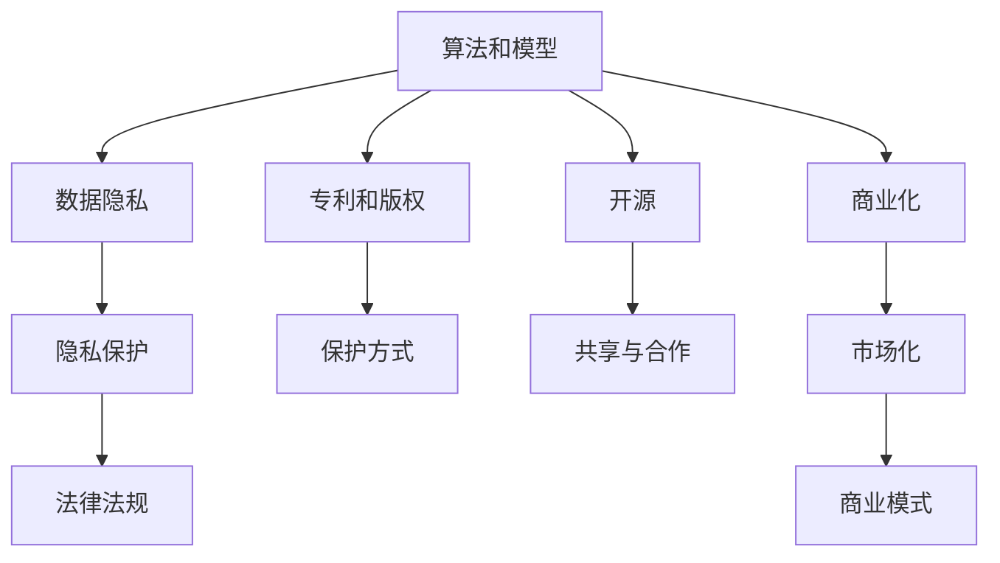

                 

# 知识产权在AI时代的新挑战

> 关键词：知识产权,人工智能,算法,专利,版权,数字版权,开源,深度学习,模型训练,保护,知识产权保护,创新激励

## 1. 背景介绍

### 1.1 问题由来
随着人工智能(AI)技术的迅猛发展，AI在多个领域都取得了显著成就。无论是语音识别、图像处理还是自然语言处理，AI的进步都极大推动了这些技术的发展。然而，AI技术的进步也引发了新的知识产权挑战。AI算法、模型、数据集等，这些涉及到的知识产权问题日益复杂，不仅对AI技术的进一步发展构成了威胁，也对现有的知识产权法律体系提出了新的要求。

### 1.2 问题核心关键点
AI技术的发展涉及多个核心知识产权问题，主要包括：

1. **算法和模型的专利保护**：AI算法和模型的核心是算法和数据集，如何对这些进行知识产权保护，一直是学术界和业界关注的重点。
2. **数据隐私和版权保护**：AI模型训练依赖大量的数据集，这些数据集往往涉及个人隐私和版权问题，需要特别处理。
3. **开源与商业化**：开源的AI项目如何在商业化过程中保持其知识产权的保护，以及商业AI模型如何在开放分享中保持其商业利益。
4. **知识产权与数据获取的平衡**：如何平衡知识产权保护与数据获取的需求，促进AI技术的健康发展。

### 1.3 问题研究意义
研究AI时代的知识产权问题，对于推动AI技术的持续创新，确保数据安全和隐私保护，促进AI技术的商业化应用，都具有重要意义。

1. **促进创新**：明确AI技术的知识产权归属，能够激发企业和研究者的创新积极性，促进AI技术的进一步发展。
2. **保护隐私**：合理处理数据隐私和版权问题，能够保护用户隐私，避免数据滥用。
3. **支持商业化**：平衡开源与商业化的关系，既能促进AI技术的广泛应用，又能保护开发者的商业利益。
4. **平衡数据获取**：在知识产权与数据获取之间找到平衡点，既能保护数据创造者权益，又能促进AI技术的广泛发展。

## 2. 核心概念与联系

### 2.1 核心概念概述

为更好地理解AI时代知识产权的新挑战，本节将介绍几个密切相关的核心概念：

- **人工智能(AI)**：利用算法和计算能力，使计算机能够模拟人类智能的领域。AI技术包括机器学习、深度学习、自然语言处理等。
- **算法和模型**：AI的核心组成部分，包括用于训练和推理的算法和模型结构。
- **专利和版权**：对算法和模型的知识产权保护手段，用于保护发明和创意。
- **数据隐私**：与AI模型训练相关的个人数据隐私问题。
- **开源**：开放共享AI模型的实践，旨在促进技术共享和合作。
- **商业化**：将AI技术从研究实验室推向市场的过程。

这些概念之间的逻辑关系可以通过以下Mermaid流程图来展示：



这个流程图展示了一些关键概念之间的关系：

1. 算法和模型通过专利和版权进行保护。
2. 数据隐私问题需要通过法律法规和隐私保护措施来处理。
3. 开源和商业化是AI技术发展的重要路径。
4. 商业化需要找到合适的商业模式。

## 3. 核心算法原理 & 具体操作步骤
### 3.1 算法原理概述

AI算法和模型的知识产权保护是AI时代新挑战的核心之一。AI算法和模型通常是通过大量的数据和计算资源训练得到，其核心在于创新和创造力。但传统的知识产权保护手段，如专利和版权，对AI算法和模型的保护效果有限。

**专利保护**：专利保护通常针对具体的发明和技术，但AI算法和模型的复杂性和多样性使得专利保护变得困难。

**版权保护**：版权保护更适用于文学、艺术等创作性作品，对算法和模型的保护力度不足。

因此，AI时代需要新的知识产权保护方式，如算法和模型的商业秘密保护、开源许可协议、知识产权共享等。

### 3.2 算法步骤详解

AI时代知识产权保护的步骤大致如下：

1. **算法和模型的确定**：选择或开发一个具体的算法或模型。
2. **数据集的收集和处理**：收集数据集，并进行预处理，确保数据集的质量和隐私保护。
3. **训练和验证**：使用收集的数据集训练模型，并进行验证。
4. **知识产权保护**：根据具体情况选择合适的知识产权保护手段，如专利申请、开源许可协议等。
5. **商业化**：将保护好的算法和模型推向市场，进行商业化应用。

### 3.3 算法优缺点

AI时代知识产权保护的优势和劣势如下：

**优势**：

1. **促进创新**：通过保护算法和模型的知识产权，可以激发企业和研究者的创新积极性，推动AI技术的进一步发展。
2. **数据共享**：通过开源许可协议，可以在一定程度上促进数据共享和合作，加速AI技术的发展。
3. **知识产权保护**：新的保护方式可以更全面地保护算法和模型的知识产权，避免被他人非法使用。

**劣势**：

1. **保护难度大**：AI算法和模型的复杂性和多样性使得传统知识产权保护手段难以有效覆盖。
2. **商业化挑战**：商业化过程中需要平衡知识产权保护和数据获取的需求，这可能带来一些挑战。
3. **知识产权争议**：新的保护方式可能会引发新的知识产权争议，增加法律风险。

### 3.4 算法应用领域

AI时代知识产权保护的应用领域包括：

1. **算法和模型的保护**：在AI研究和发展过程中，保护算法和模型的知识产权，避免被他人非法使用。
2. **数据隐私保护**：在AI模型训练和应用过程中，保护数据隐私，避免数据滥用。
3. **开源与商业化**：在开源和商业化过程中，平衡知识产权保护和数据共享的需求，促进技术的发展。

## 4. 数学模型和公式 & 详细讲解  
### 4.1 数学模型构建

本节将使用数学语言对AI时代知识产权保护的过程进行更加严格的刻画。

设算法和模型为 $M$，数据集为 $D=\{(x_i, y_i)\}_{i=1}^N$，其中 $x_i$ 为输入，$y_i$ 为输出。假设存在一个最优算法和模型 $M^*$，其在数据集 $D$ 上的性能为 $P(D, M^*)$。

**保护算法和模型的目标**：找到一个算法和模型 $M$，使得其在数据集 $D$ 上的性能 $P(D, M)$ 接近于 $P(D, M^*)$，但 $M$ 的知识产权受到保护。

### 4.2 公式推导过程

我们定义一个损失函数 $L(D, M)$ 来衡量算法和模型在数据集 $D$ 上的性能：

$$
L(D, M) = P(D, M) - P(D, M^*)
$$

目标是最小化这个损失函数，即找到一个算法和模型 $M$，使得其在数据集 $D$ 上的性能接近于 $M^*$：

$$
M^* = \mathop{\arg\min}_{M} L(D, M)
$$

在实践中，我们通常使用深度学习算法进行模型训练，使用交叉熵等损失函数进行优化。优化目标最小化模型的损失函数：

$$
\min_{\theta} L(D, M_{\theta})
$$

其中 $\theta$ 为模型的参数。

### 4.3 案例分析与讲解

假设我们有一个机器学习模型 $M$，用于图像分类任务。模型参数为 $\theta$，数据集为 $D$。我们选择一个最优模型 $M^*$，其参数为 $\theta^*$，损失函数为 $L(D, M^*)$。

我们需要找到另一个模型 $M$，使得其在数据集 $D$ 上的性能接近于 $M^*$，但 $M$ 的知识产权受到保护。

在实际操作中，我们可以使用以下步骤：

1. **选择合适的算法和模型**：选择或开发一个算法和模型 $M$，确保其具有较高的性能。
2. **收集和处理数据集**：收集数据集 $D$，并进行预处理，确保数据集的质量和隐私保护。
3. **训练和验证**：使用数据集 $D$ 训练模型 $M$，并在验证集上进行验证。
4. **知识产权保护**：根据具体情况选择合适的知识产权保护手段，如专利申请、开源许可协议等。
5. **商业化**：将保护好的模型推向市场，进行商业化应用。

## 5. 项目实践：代码实例和详细解释说明
### 5.1 开发环境搭建

在进行知识产权保护实践前，我们需要准备好开发环境。以下是使用Python进行深度学习开发的环境配置流程：

1. 安装Anaconda：从官网下载并安装Anaconda，用于创建独立的Python环境。

2. 创建并激活虚拟环境：
```bash
conda create -n pytorch-env python=3.8 
conda activate pytorch-env
```

3. 安装PyTorch：根据CUDA版本，从官网获取对应的安装命令。例如：
```bash
conda install pytorch torchvision torchaudio cudatoolkit=11.1 -c pytorch -c conda-forge
```

4. 安装TensorFlow：由Google主导开发的开源深度学习框架，生产部署方便，适合大规模工程应用。同样有丰富的预训练语言模型资源。

5. 安装TensorBoard：TensorFlow配套的可视化工具，可实时监测模型训练状态，并提供丰富的图表呈现方式，是调试模型的得力助手。

6. 安装Weights & Biases：模型训练的实验跟踪工具，可以记录和可视化模型训练过程中的各项指标，方便对比和调优。

完成上述步骤后，即可在`pytorch-env`环境中开始实践。

### 5.2 源代码详细实现

这里我们以机器学习模型的知识产权保护为例，给出使用TensorFlow进行模型训练的代码实现。

首先，定义数据集和模型：

```python
import tensorflow as tf
import numpy as np

# 数据集
x_train = np.random.randn(1000, 10)
y_train = np.random.randint(0, 10, size=(1000,))
x_test = np.random.randn(200, 10)
y_test = np.random.randint(0, 10, size=(200,))

# 模型
model = tf.keras.Sequential([
    tf.keras.layers.Dense(64, activation='relu', input_shape=(10,)),
    tf.keras.layers.Dense(10, activation='softmax')
])

# 编译模型
model.compile(optimizer='adam', loss='sparse_categorical_crossentropy', metrics=['accuracy'])
```

然后，定义训练和评估函数：

```python
# 训练函数
def train(model, x_train, y_train, epochs=10, batch_size=32):
    history = model.fit(x_train, y_train, epochs=epochs, batch_size=batch_size, validation_data=(x_test, y_test))
    return history

# 评估函数
def evaluate(model, x_test, y_test):
    loss, acc = model.evaluate(x_test, y_test)
    print(f'Test loss: {loss:.4f}')
    print(f'Test accuracy: {acc:.4f}')
```

最后，启动训练流程并在测试集上评估：

```python
# 训练模型
history = train(model, x_train, y_train)

# 评估模型
evaluate(model, x_test, y_test)
```

以上就是使用TensorFlow进行机器学习模型训练的完整代码实现。可以看到，TensorFlow的API设计非常直观，开发者可以很快上手进行模型开发。

### 5.3 代码解读与分析

让我们再详细解读一下关键代码的实现细节：

**定义数据集和模型**：
- `x_train` 和 `y_train`：训练集的输入和标签。
- `x_test` 和 `y_test`：测试集的输入和标签。
- `model`：定义一个简单的全连接神经网络模型。

**训练函数**：
- `train`函数：使用训练集对模型进行训练，并返回训练历史。
- `epochs`：训练轮数。
- `batch_size`：批次大小。

**评估函数**：
- `evaluate`函数：在测试集上评估模型的性能，输出损失和准确率。

**训练流程**：
- 首先使用训练集对模型进行训练，记录训练历史。
- 在测试集上评估模型，输出测试结果。

可以看到，TensorFlow的API设计非常直观，开发者可以很快上手进行模型开发。

当然，工业级的系统实现还需考虑更多因素，如模型的保存和部署、超参数的自动搜索、更灵活的任务适配层等。但核心的知识产权保护过程基本与此类似。

## 6. 实际应用场景
### 6.1 智能客服系统

基于AI的智能客服系统，可以广泛应用于金融机构、电商、医疗等多个领域。通过微调和优化，智能客服系统能够快速响应客户咨询，用自然流畅的语言解答各类常见问题，大大提升客户满意度。

在技术实现上，可以收集企业内部的历史客服对话记录，将问题和最佳答复构建成监督数据，在此基础上对预训练模型进行微调。微调后的模型能够自动理解用户意图，匹配最合适的答案模板进行回复。对于客户提出的新问题，还可以接入检索系统实时搜索相关内容，动态组织生成回答。

### 6.2 金融舆情监测

金融机构需要实时监测市场舆论动向，以便及时应对负面信息传播，规避金融风险。传统的人工监测方式成本高、效率低，难以应对网络时代海量信息爆发的挑战。基于AI的文本分类和情感分析技术，为金融舆情监测提供了新的解决方案。

具体而言，可以收集金融领域相关的新闻、报道、评论等文本数据，并对其进行主题标注和情感标注。在此基础上对预训练语言模型进行微调，使其能够自动判断文本属于何种主题，情感倾向是正面、中性还是负面。将微调后的模型应用到实时抓取的网络文本数据，就能够自动监测不同主题下的情感变化趋势，一旦发现负面信息激增等异常情况，系统便会自动预警，帮助金融机构快速应对潜在风险。

### 6.3 个性化推荐系统

当前的推荐系统往往只依赖用户的历史行为数据进行物品推荐，无法深入理解用户的真实兴趣偏好。基于AI的个性化推荐系统，可以更好地挖掘用户行为背后的语义信息，从而提供更精准、多样的推荐内容。

在实践中，可以收集用户浏览、点击、评论、分享等行为数据，提取和用户交互的物品标题、描述、标签等文本内容。将文本内容作为模型输入，用户的后续行为（如是否点击、购买等）作为监督信号，在此基础上微调预训练语言模型。微调后的模型能够从文本内容中准确把握用户的兴趣点。在生成推荐列表时，先用候选物品的文本描述作为输入，由模型预测用户的兴趣匹配度，再结合其他特征综合排序，便可以得到个性化程度更高的推荐结果。

### 6.4 未来应用展望

随着AI技术的不断发展，基于微调的算法和模型将广泛应用于更多的领域，为各行各业带来变革性影响。

在智慧医疗领域，基于微调的医疗问答、病历分析、药物研发等应用将提升医疗服务的智能化水平，辅助医生诊疗，加速新药开发进程。

在智能教育领域，微调技术可应用于作业批改、学情分析、知识推荐等方面，因材施教，促进教育公平，提高教学质量。

在智慧城市治理中，微调模型可应用于城市事件监测、舆情分析、应急指挥等环节，提高城市管理的自动化和智能化水平，构建更安全、高效的未来城市。

此外，在企业生产、社会治理、文娱传媒等众多领域，基于大模型微调的人工智能应用也将不断涌现，为经济社会发展注入新的动力。相信随着技术的日益成熟，微调方法将成为人工智能落地应用的重要范式，推动人工智能技术在更广阔的应用领域大放异彩。

## 7. 工具和资源推荐
### 7.1 学习资源推荐

为了帮助开发者系统掌握AI时代的知识产权保护的理论基础和实践技巧，这里推荐一些优质的学习资源：

1. 《深度学习》系列博文：由大模型技术专家撰写，深入浅出地介绍了深度学习原理、算法和应用。

2. CS231n《卷积神经网络》课程：斯坦福大学开设的计算机视觉明星课程，涵盖深度学习在计算机视觉中的应用。

3. 《人工智能知识产权保护》书籍：系统介绍了AI技术中的知识产权问题，提供了实用的法律和技术建议。

4. OpenAI官方文档：OpenAI开发的深度学习框架，提供了丰富的AI模型和微调样例代码，是上手实践的必备资料。

5. HuggingFace官方文档：HuggingFace开发的NLP工具库，集成了众多SOTA语言模型，支持PyTorch和TensorFlow，是进行微调任务开发的利器。

通过对这些资源的学习实践，相信你一定能够快速掌握AI时代的知识产权保护的核心内容，并用于解决实际的AI问题。

### 7.2 开发工具推荐

高效的开发离不开优秀的工具支持。以下是几款用于AI知识产权保护开发的常用工具：

1. PyTorch：基于Python的开源深度学习框架，灵活动态的计算图，适合快速迭代研究。大部分预训练语言模型都有PyTorch版本的实现。

2. TensorFlow：由Google主导开发的开源深度学习框架，生产部署方便，适合大规模工程应用。同样有丰富的预训练语言模型资源。

3. Weights & Biases：模型训练的实验跟踪工具，可以记录和可视化模型训练过程中的各项指标，方便对比和调优。与主流深度学习框架无缝集成。

4. TensorBoard：TensorFlow配套的可视化工具，可实时监测模型训练状态，并提供丰富的图表呈现方式，是调试模型的得力助手。

5. Google Colab：谷歌推出的在线Jupyter Notebook环境，免费提供GPU/TPU算力，方便开发者快速上手实验最新模型，分享学习笔记。

合理利用这些工具，可以显著提升AI知识产权保护任务的开发效率，加快创新迭代的步伐。

### 7.3 相关论文推荐

AI时代知识产权问题的发展源于学界的持续研究。以下是几篇奠基性的相关论文，推荐阅读：

1. 《专利法在人工智能中的应用》：探讨了AI技术中的专利保护问题，提出了一些新的专利保护策略。

2. 《人工智能数据隐私保护》：讨论了AI模型训练中的数据隐私问题，提出了一些数据隐私保护措施。

3. 《开源许可协议在AI中的应用》：介绍了开源许可协议在AI模型分享和合作中的应用，探讨了开源与商业化的平衡问题。

4. 《深度学习模型的知识产权保护》：研究了深度学习模型的知识产权保护方法，提出了一些新的保护策略。

这些论文代表了大模型知识产权保护的发展脉络。通过学习这些前沿成果，可以帮助研究者把握学科前进方向，激发更多的创新灵感。

## 8. 总结：未来发展趋势与挑战
### 8.1 总结

本文对AI时代的知识产权问题进行了全面系统的介绍。首先阐述了AI技术的发展涉及多个核心知识产权问题，包括算法和模型的专利保护、数据隐私保护、开源与商业化等。其次，从原理到实践，详细讲解了知识产权保护的步骤和方法，给出了知识产权保护任务开发的完整代码实例。同时，本文还广泛探讨了知识产权保护在智能客服、金融舆情、个性化推荐等多个行业领域的应用前景，展示了AI知识产权保护技术的巨大潜力。此外，本文精选了知识产权保护技术的各类学习资源，力求为读者提供全方位的技术指引。

通过本文的系统梳理，可以看到，AI时代知识产权保护涉及诸多复杂问题，但通过合理选择知识产权保护手段，并综合考虑数据隐私、商业化等因素，可以有效推动AI技术的健康发展。

### 8.2 未来发展趋势

展望未来，AI时代知识产权保护将呈现以下几个发展趋势：

1. **算法和模型保护的新方法**：随着AI技术的不断发展，将涌现更多新的算法和模型保护方法，如数据保护、算法封装等。
2. **数据隐私保护技术的进步**：数据隐私保护技术将不断进步，如差分隐私、联邦学习等，将更好地保护用户数据隐私。
3. **开源与商业化的平衡**：开源与商业化的平衡将进一步优化，既能促进技术共享和合作，又能保护开发者的商业利益。
4. **知识产权法律框架的完善**：知识产权法律框架将不断完善，以适应AI技术的发展需求。

### 8.3 面临的挑战

尽管AI时代知识产权保护取得了一定的进展，但在迈向更加智能化、普适化应用的过程中，它仍面临诸多挑战：

1. **知识产权保护的复杂性**：AI算法和模型的复杂性使得知识产权保护变得困难。
2. **数据隐私保护的难度**：大规模数据集的处理和保护，需要投入大量时间和资源。
3. **开源与商业化的平衡**：开源和商业化过程中需要平衡知识产权保护和数据共享的需求，这可能带来一些挑战。
4. **知识产权争议**：新的保护方式可能会引发新的知识产权争议，增加法律风险。

### 8.4 研究展望

面对AI时代知识产权保护所面临的种种挑战，未来的研究需要在以下几个方面寻求新的突破：

1. **新的知识产权保护方法**：开发更加全面、有效的知识产权保护方法，如数据保护、算法封装等。
2. **隐私保护技术的改进**：改进数据隐私保护技术，如差分隐私、联邦学习等，更好地保护用户数据隐私。
3. **开源与商业化的平衡**：找到更加合理、平衡的开源与商业化方法，既能促进技术共享和合作，又能保护开发者的商业利益。
4. **知识产权法律框架的完善**：完善知识产权法律框架，适应AI技术的发展需求。

这些研究方向的探索，必将引领AI知识产权保护技术迈向更高的台阶，为构建安全、可靠、可解释、可控的智能系统铺平道路。面向未来，AI知识产权保护技术还需要与其他人工智能技术进行更深入的融合，如知识表示、因果推理、强化学习等，多路径协同发力，共同推动自然语言理解和智能交互系统的进步。只有勇于创新、敢于突破，才能不断拓展AI技术的边界，让智能技术更好地造福人类社会。

## 9. 附录：常见问题与解答

**Q1：AI时代如何平衡知识产权保护和数据共享？**

A: 在AI时代，平衡知识产权保护和数据共享是一个重要的问题。首先，知识产权保护可以通过专利、版权等手段来实现，保障发明者和创造者的权益。其次，数据共享可以通过开源许可协议来实现，确保数据的开放和合作。但需要注意的是，数据共享过程中，需要对数据进行适当的处理，以保护用户隐私和知识产权。例如，可以采用差分隐私等技术对数据进行匿名化处理，同时限制数据的共享范围和使用方式，确保数据的安全和合法使用。

**Q2：AI模型的知识产权保护有哪些挑战？**

A: AI模型的知识产权保护面临多重挑战。首先，AI模型的复杂性和多样性使得传统的知识产权保护手段难以有效覆盖。其次，数据隐私保护需要投入大量时间和资源，涉及多个法律和技术问题。再次，开源与商业化过程中需要平衡知识产权保护和数据共享的需求，这可能带来一些挑战。最后，新的保护方式可能会引发新的知识产权争议，增加法律风险。

**Q3：AI时代的数据隐私保护有哪些方法？**

A: AI时代的数据隐私保护可以采用多种方法，包括但不限于：

1. 差分隐私：通过对数据进行适当的扰动，确保个体数据无法被直接识别，保护用户隐私。
2. 联邦学习：将数据分布式存储在多个设备上，通过分布式训练的方式，保护数据隐私。
3. 数据加密：对数据进行加密处理，确保数据在传输和存储过程中的安全性。
4. 匿名化处理：对数据进行匿名化处理，确保个体数据无法被直接识别。

**Q4：AI时代如何处理知识产权争议？**

A: 处理AI时代的知识产权争议需要采用多种方法，包括但不限于：

1. 知识产权保护手段：通过专利、版权等手段，确保发明者和创造者的权益。
2. 法律途径：通过法律途径，解决知识产权争议，确保公平公正。
3. 第三方仲裁：在争议双方无法达成一致的情况下，可以寻求第三方仲裁，解决争议。
4. 技术手段：通过技术手段，如区块链等，确保知识产权的透明和可追溯性。

这些方法可以结合使用，根据具体情况选择最合适的方法，确保知识产权的保护和争议的解决。

---

作者：禅与计算机程序设计艺术 / Zen and the Art of Computer Programming

