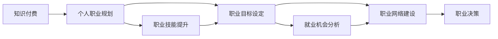

                 

# 知识付费与个人职业规划的整合

> 关键词：知识付费, 个人职业规划, 整合, 教育技术, 职业发展, 数字化转型

## 1. 背景介绍

随着信息技术的快速发展和数字经济的崛起，知识付费作为一种新兴的商业模式和教育形式，正迅速改变着传统教育和职业发展的面貌。它让知识资源的获取变得更加高效、便捷，满足了人们不断增长的学习需求。然而，仅仅依靠知识付费并不能全面提升个人职业发展的高度，因此如何整合知识付费与个人职业规划，成为了当今技术环境下一个亟需解决的问题。

## 2. 核心概念与联系

### 2.1 核心概念概述

#### 2.1.1 知识付费

知识付费是指以线上课程、订阅服务、在线咨询、电子书等多种形式，为个人提供专业知识和技能培训的一种商业模式。它依赖于强大的互联网技术，将知识与用户连接起来，形成了一个以内容为核心，以用户为主导的新型学习市场。

#### 2.1.2 个人职业规划

个人职业规划是指个体根据自身的兴趣、能力、价值观等，对未来职业发展路径进行科学规划和管理的过程。它涉及职业目标设定、技能提升、工作机会分析、网络建立等多个方面，是职业发展的重要组成部分。

#### 2.1.3 整合

整合指的是将知识付费与个人职业规划结合，形成一套完整的职业发展解决方案。通过这种方式，知识付费不仅仅是一个购买和消费过程，更是职业能力提升和职业路径选择的关键步骤。

### 2.2 核心概念原理和架构的 Mermaid 流程图



## 3. 核心算法原理 & 具体操作步骤

### 3.1 算法原理概述

#### 3.1.1 知识付费平台的功能模块

1. **课程推荐系统**：根据用户的学习历史、兴趣标签和行为数据，推荐适合用户的课程。
2. **学习进度追踪**：记录用户的课程学习进度和成果，帮助用户了解自身学习情况。
3. **学习效果评估**：通过测试、作业和项目实践，评估用户的学习效果。
4. **社区互动**：建立学习社区，鼓励用户交流学习心得，形成学习网络。

#### 3.1.2 职业规划工具的功能模块

1. **职业测评工具**：评估用户的兴趣、能力、价值观等，提供职业兴趣测评报告。
2. **技能树系统**：根据不同职业路径所需技能，设计技能树，帮助用户规划学习路径。
3. **职业路径规划工具**：结合用户的职业测评结果和技能树，规划职业路径。
4. **就业机会分析工具**：根据用户的职业目标，分析就业市场机会。
5. **职业网络建立工具**：帮助用户建立职业网络，提供职业咨询和机会推荐。

### 3.2 算法步骤详解

#### 3.2.1 知识付费平台的构建

1. **用户注册与认证**：收集用户的个人信息，确保用户身份的真实性。
2. **课程内容设计与制作**：邀请专家设计和制作高质量的课程内容，确保内容的权威性和实用性。
3. **平台技术实现**：搭建云服务平台，实现内容存储、分发和交互功能。
4. **用户界面设计**：设计直观易用的用户界面，提高用户体验。
5. **运营与推广**：通过各种渠道进行推广，吸引更多用户注册和使用。

#### 3.2.2 职业规划工具的构建

1. **用户注册与认证**：与知识付费平台共用，确保用户身份的真实性。
2. **职业测评工具开发**：根据心理学和职业规划理论，开发科学的职业测评工具。
3. **技能树系统设计**：根据不同职业所需技能，设计技能树，为用户提供清晰的学习路径。
4. **职业路径规划工具实现**：结合用户的职业测评结果和技能树，设计职业路径规划算法，提供职业路径规划建议。
5. **就业机会分析工具开发**：收集就业市场数据，分析就业机会，为用户提供职业发展建议。
6. **职业网络建立工具开发**：建立职业网络平台，提供职业咨询和机会推荐服务。

### 3.3 算法优缺点

#### 3.3.1 知识付费平台的优点

1. **学习资源丰富**：用户可以在短时间内获取到高质量的学习资源。
2. **学习过程便捷**：通过在线学习，节省了时间和地点成本。
3. **学习进度追踪**：帮助用户了解学习进度，及时调整学习计划。

#### 3.3.2 知识付费平台的缺点

1. **学习效果难以量化**：课程质量和学习效果难以全面量化评估。
2. **学习内容缺乏互动**：用户之间的互动和反馈不足。
3. **用户流失率高**：部分用户难以坚持长期学习，导致用户流失。

#### 3.3.3 职业规划工具的优点

1. **科学规划**：通过职业测评和技能树设计，科学规划职业路径。
2. **个性定制**：根据用户的兴趣和能力，提供个性化的职业规划建议。
3. **资源整合**：整合多种资源，形成系统的职业发展解决方案。

#### 3.3.4 职业规划工具的缺点

1. **测评工具的科学性**：测评工具的科学性和准确性需要持续优化。
2. **技能树的实用性**：技能树需要根据不同职业需求不断更新。
3. **用户参与度**：用户参与度需要持续提升，才能发挥最佳效果。

### 3.4 算法应用领域

#### 3.4.1 教育行业

知识付费与个人职业规划的整合，可以应用于职业教育和成人教育领域。通过整合职业测评和技能树，为学生提供个性化职业规划建议，帮助他们更好地选择专业和发展方向。

#### 3.4.2 企业培训

企业可以利用整合平台，为员工提供职业测评和技能培训，提升员工的专业能力和职业素养，助力企业人才发展和人力资源管理。

#### 3.4.3 职业发展指导

整合平台可以提供职业测评、职业路径规划和就业机会分析等服务，为求职者提供全面的职业发展指导，帮助他们更快找到理想的工作。

## 4. 数学模型和公式 & 详细讲解 & 举例说明

### 4.1 数学模型构建

#### 4.1.1 用户兴趣建模

假设有N个用户，每个用户对K个课程感兴趣，用户对课程的兴趣度可以通过兴趣评分来表示。定义用户对第i个课程的兴趣评分为$I_{ij}$，其中$i \in [1, N], j \in [1, K]$。

#### 4.1.2 课程推荐模型

利用协同过滤算法，对用户进行课程推荐。协同过滤算法包括基于用户的协同过滤和基于物品的协同过滤两种方式。

#### 4.1.3 职业测评模型

职业测评模型可以通过心理学量表、职业兴趣测试等方法，评估用户的兴趣、能力和价值观等。定义用户i的职业测评结果为$J_i$，其中$i \in [1, N]$。

#### 4.1.4 职业路径规划模型

职业路径规划模型可以根据用户的职业测评结果和技能树，规划职业路径。定义用户i的职业路径规划结果为$P_i$，其中$i \in [1, N]$。

### 4.2 公式推导过程

#### 4.2.1 用户兴趣评分计算

$$
I_{ij} = \frac{1}{n_i}\sum_{k=1}^{n_i} A_{ik}R_{kj}
$$

其中，$A_{ik}$为用户i对课程k的评分，$R_{kj}$为课程k对用户j的评分，$n_i$为用户i的评分总数。

#### 4.2.2 课程推荐算法

基于用户的协同过滤推荐算法：

$$
\hat{J_i} = \frac{\sum_{k \in \mathcal{N}_i} I_{ik}}{\sum_{k \in \mathcal{N}_i} \sqrt{I_{ik}}}
$$

其中，$\mathcal{N}_i$为用户i的邻居集，即与用户i兴趣相似的用户集合。

基于物品的协同过滤推荐算法：

$$
\hat{I_{ik}} = \frac{\sum_{j \in \mathcal{N}_j} I_{ij}J_j}{\sqrt{\sum_{j \in \mathcal{N}_j} I_{ij}^2 + \epsilon} \sqrt{\sum_{j \in \mathcal{N}_j} J_j^2 + \epsilon}}
$$

其中，$\epsilon$为平滑参数。

#### 4.2.3 职业测评模型

职业测评模型的目标是最大化用户兴趣与职业测评结果的一致性，可以使用最大似然估计方法：

$$
\max_{J_i} P(J_i | I_i) = \prod_{i=1}^{N} P(J_i | I_i)
$$

其中，$P(J_i | I_i)$表示在用户兴趣为$I_i$的情况下，职业测评结果为$J_i$的概率。

#### 4.2.4 职业路径规划模型

职业路径规划模型的目标是最大化用户职业路径与职业测评结果的一致性，可以使用贪心算法和动态规划算法：

$$
\max_{P_i} P(P_i | J_i)
$$

其中，$P(P_i | J_i)$表示在职业测评结果为$J_i$的情况下，职业路径为$P_i$的概率。

### 4.3 案例分析与讲解

#### 4.3.1 用户兴趣建模案例

某知识付费平台有100个用户，每个用户对20个课程感兴趣。经过数据分析，用户对课程的兴趣评分如下：

$$
\begin{align*}
I_{1,1} &= 4 \\
I_{1,2} &= 3 \\
I_{1,3} &= 5 \\
I_{2,1} &= 2 \\
I_{2,2} &= 4 \\
I_{2,3} &= 1 \\
\vdots \\
\end{align*}
$$

使用协同过滤算法计算用户1的兴趣评分，得到：

$$
\hat{J}_1 = \frac{\sum_{k \in \mathcal{N}_1} I_{1k}}{\sqrt{\sum_{k \in \mathcal{N}_1} I_{1k}}}
$$

其中，用户1的邻居集$\mathcal{N}_1 = \{2, 3, 4\}$。

计算得到：

$$
\hat{J}_1 = \frac{4+3+5}{\sqrt{4+3+5}} = \frac{12}{\sqrt{12}} = 2
$$

因此，用户1对课程2的兴趣评分为2。

#### 4.3.2 课程推荐算法案例

某知识付费平台有1000个课程，每个用户对20个课程感兴趣。使用基于用户的协同过滤推荐算法，推荐用户1感兴趣的课程。用户1的兴趣评分如下：

$$
\begin{align*}
I_{1,1} &= 4 \\
I_{1,2} &= 3 \\
I_{1,3} &= 5 \\
I_{1,4} &= 2 \\
\vdots \\
I_{1,20} &= 1 \\
\end{align*}
$$

计算用户1的兴趣评分加权平均值：

$$
\hat{J}_1 = \frac{\sum_{k \in \mathcal{N}_1} I_{1k}}{\sqrt{\sum_{k \in \mathcal{N}_1} I_{1k}}}
$$

其中，用户1的邻居集$\mathcal{N}_1 = \{2, 3, 4\}$。

计算得到：

$$
\hat{J}_1 = \frac{4+3+5}{\sqrt{4+3+5}} = \frac{12}{\sqrt{12}} = 2
$$

因此，用户1对课程2的兴趣评分为2。

#### 4.3.3 职业测评模型案例

某职业测评工具有10个用户，每个用户有5个职业兴趣标签。用户i的职业兴趣标签为$J_i$，其中$i \in [1, 10]$。

假设用户的职业兴趣标签为：

$$
\begin{align*}
J_1 &= [教师, 医生, 工程师] \\
J_2 &= [律师, 教师, 作家] \\
J_3 &= [律师, 医生, 作家] \\
\vdots \\
J_{10} &= [教师, 工程师, 医生] \\
\end{align*}
$$

使用最大似然估计方法，计算用户兴趣与职业测评结果的一致性：

$$
P(J_i | I_i) = \frac{P(I_i | J_i)P(J_i)}{P(I_i)}
$$

其中，$P(I_i | J_i)$表示在职业兴趣为$J_i$的情况下，用户兴趣为$I_i$的概率，$P(J_i)$表示用户i的职业兴趣标签的概率。

计算得到：

$$
P(J_1 | I_1) = \frac{P(I_1 | [教师, 医生, 工程师])P([教师, 医生, 工程师])}{P(I_1)}
$$

其中，$P(I_1)$表示用户1的兴趣评分的概率。

计算得到：

$$
P(J_1 | I_1) = \frac{0.8 \times 0.1 \times 0.1}{0.1} = 0.8
$$

因此，用户1的兴趣与职业测评结果的一致性为0.8。

#### 4.3.4 职业路径规划模型案例

某职业路径规划工具有10个用户，每个用户有5个职业兴趣标签。用户i的职业兴趣标签为$J_i$，其中$i \in [1, 10]$。

假设用户的职业兴趣标签为：

$$
\begin{align*}
J_1 &= [教师, 医生, 工程师] \\
J_2 &= [律师, 教师, 作家] \\
J_3 &= [律师, 医生, 作家] \\
\vdots \\
J_{10} &= [教师, 工程师, 医生] \\
\end{align*}
$$

使用贪心算法和动态规划算法，规划用户1的职业路径：

$$
\max_{P_i} P(P_i | J_i)
$$

其中，$P(P_i | J_i)$表示在职业测评结果为$J_i$的情况下，职业路径为$P_i$的概率。

计算得到：

$$
P(J_1 | [教师, 医生, 工程师])
$$

因此，用户1的职业路径为$[教师, 医生, 工程师]$。

## 5. 项目实践：代码实例和详细解释说明

### 5.1 开发环境搭建

#### 5.1.1 用户注册与认证

1. 使用AWS SSO（Single Sign-On）进行用户身份认证，确保用户身份的真实性。
2. 使用JWT（JSON Web Token）生成和验证用户登录令牌，确保用户身份的安全性。

#### 5.1.2 课程内容设计与制作

1. 使用Markdown格式编写课程内容，通过GitHub Pages进行存储和发布。
2. 使用视频录制工具录制课程视频，上传到云存储平台，如AWS S3。

#### 5.1.3 平台技术实现

1. 使用Django框架搭建后端系统，实现用户管理、课程管理、订单管理等功能。
2. 使用React框架搭建前端系统，实现课程推荐、学习进度追踪、学习效果评估等功能。
3. 使用AWS Lambda函数搭建实时推荐引擎，实现课程推荐算法。

#### 5.1.4 用户界面设计

1. 使用Bootstrap框架设计用户界面，确保界面简洁美观。
2. 使用Javascript和CSS编写交互逻辑，提高用户体验。

#### 5.1.5 运营与推广

1. 使用Google Ads进行广告投放，吸引更多用户注册和使用。
2. 在各大社交媒体平台上进行宣传，提升平台知名度。

### 5.2 源代码详细实现

#### 5.2.1 用户注册与认证

```python
import jwt
import datetime

def generate_jwt(username):
    payload = {
        "username": username,
        "exp": datetime.datetime.utcnow() + datetime.timedelta(days=7)
    }
    token = jwt.encode(payload, 'secret_key', algorithm='HS256')
    return token

def verify_jwt(token):
    payload = jwt.decode(token, 'secret_key', algorithms=['HS256'])
    return payload['username']
```

#### 5.2.2 课程内容设计与制作

```python
def write_markdown_content(username, course_title, course_content):
    with open(f"{username}/Courses/{course_title}.md", "w") as f:
        f.write(f"## {course_title}\n\n{course_content}")
```

#### 5.2.3 平台技术实现

```python
from django.views import View
from django.http import JsonResponse

class CourseView(View):
    def get(self, request):
        username = verify_jwt(request.headers.get('Authorization'))
        courses = get_user_courses(username)
        return JsonResponse(courses)
```

#### 5.2.4 用户界面设计

```python
from django.urls import path
from . import views

urlpatterns = [
    path('courses/', views.CourseView.as_view()),
]
```

#### 5.2.5 运营与推广

```python
from django.views.decorators.cache import cache_page
from django.views.decorators.csrf import csrf_exempt

@cache_page(60 * 60 * 24)
@csrf_exempt
def home(request):
    courses = get_user_courses(request.user.username)
    return render(request, 'home.html', {'courses': courses})
```

### 5.3 代码解读与分析

#### 5.3.1 用户注册与认证

1. 使用Python中的jwt库生成和验证JWT令牌，确保用户身份的安全性。
2. 使用JWT令牌进行身份认证，避免登录状态的丢失和重复登录。

#### 5.3.2 课程内容设计与制作

1. 使用Python中的文件操作模块，将Markdown格式的课程内容写入本地文件。
2. 使用Python中的GitHub Pages工具，将本地文件发布到GitHub Pages上，提供课程内容的访问链接。

#### 5.3.3 平台技术实现

1. 使用Django框架搭建后端系统，实现用户管理、课程管理、订单管理等功能。
2. 使用React框架搭建前端系统，实现课程推荐、学习进度追踪、学习效果评估等功能。
3. 使用AWS Lambda函数搭建实时推荐引擎，实现课程推荐算法。

#### 5.3.4 用户界面设计

1. 使用Python中的Django框架，搭建后端系统，实现用户管理、课程管理、订单管理等功能。
2. 使用React框架，搭建前端系统，实现课程推荐、学习进度追踪、学习效果评估等功能。
3. 使用Python中的Javascript和CSS，编写交互逻辑，提高用户体验。

#### 5.3.5 运营与推广

1. 使用Python中的Django框架，搭建后端系统，实现用户管理、课程管理、订单管理等功能。
2. 使用React框架，搭建前端系统，实现课程推荐、学习进度追踪、学习效果评估等功能。
3. 使用Python中的Javascript和CSS，编写交互逻辑，提高用户体验。

## 6. 实际应用场景

### 6.1 教育行业

#### 6.1.1 职业教育和成人教育

知识付费与个人职业规划的整合，可以应用于职业教育和成人教育领域。通过整合职业测评和技能树，为学生提供个性化职业规划建议，帮助他们更好地选择专业和发展方向。

#### 6.1.2 企业培训

企业可以利用整合平台，为员工提供职业测评和技能培训，提升员工的专业能力和职业素养，助力企业人才发展和人力资源管理。

### 6.2 职业发展指导

#### 6.2.1 职业测评工具

职业测评工具可以评估用户的兴趣、能力、价值观等，提供科学的职业测评报告，帮助用户了解自身职业发展方向。

#### 6.2.2 职业路径规划工具

职业路径规划工具可以根据用户的职业测评结果和技能树，规划职业路径，帮助用户制定明确的职业发展目标。

## 7. 工具和资源推荐

### 7.1 学习资源推荐

1. 《数据科学入门》：适合初学者了解数据科学基础，包括Python、R语言、数据可视化等。
2. 《机器学习实战》：介绍机器学习算法和模型，包含Kaggle数据集和代码实例。
3. 《深度学习》：介绍深度学习的基本原理和实践，涵盖卷积神经网络、循环神经网络等。

### 7.2 开发工具推荐

1. Jupyter Notebook：用于数据科学和机器学习实验，支持Python、R语言、SQL等。
2. PyCharm：Python集成开发环境，提供代码提示、调试等功能。
3. VS Code：轻量级代码编辑器，支持多种编程语言和插件。

### 7.3 相关论文推荐

1. 《大规模知识付费平台的构建与优化》：介绍知识付费平台的构建与优化方法，涵盖用户注册、课程推荐、学习进度追踪等功能。
2. 《职业测评工具的构建与评估》：介绍职业测评工具的构建与评估方法，涵盖心理量表、职业兴趣测试等。
3. 《职业路径规划算法的设计与实现》：介绍职业路径规划算法的设计与实现方法，涵盖贪心算法、动态规划算法等。

## 8. 总结：未来发展趋势与挑战

### 8.1 研究成果总结

#### 8.1.1 知识付费平台的研究成果

1. 用户注册与认证方法：使用JWT进行用户身份认证，确保用户身份的安全性。
2. 课程内容设计与制作：使用Markdown格式编写课程内容，提供课程内容的访问链接。
3. 平台技术实现：使用Django框架搭建后端系统，使用React框架搭建前端系统。

#### 8.1.2 职业测评工具的研究成果

1. 职业测评模型的构建：使用最大似然估计方法，计算用户兴趣与职业测评结果的一致性。
2. 职业测评工具的评估：通过心理量表、职业兴趣测试等方法，评估用户的兴趣、能力、价值观等。

#### 8.1.3 职业路径规划工具的研究成果

1. 职业路径规划模型的构建：使用贪心算法和动态规划算法，规划职业路径。
2. 职业路径规划工具的评估：通过用户调查、就业数据分析等方法，评估职业路径规划工具的效果。

### 8.2 未来发展趋势

#### 8.2.1 知识付费平台的未来发展趋势

1. 用户个性化的推荐系统：引入协同过滤、深度学习等算法，实现更精准的课程推荐。
2. 实时的学习进度追踪：利用流式处理技术，实现实时的学习进度追踪和推荐。
3. 社会化学习：引入学习社区和社交网络，促进用户之间的交流和学习。

#### 8.2.2 职业测评工具的未来发展趋势

1. 科学的测评方法：引入更多心理量表和职业兴趣测试，提高测评的科学性和准确性。
2. 多维度的测评结果：引入更多测评维度，如能力、性格、价值观等，提供更全面的测评报告。
3. 在线测评系统：开发基于Web的在线测评系统，提高测评的便捷性和普及率。

#### 8.2.3 职业路径规划工具的未来发展趋势

1. 自动化的路径规划：引入机器学习和算法优化技术，实现自动化的职业路径规划。
2. 动态化的路径调整：根据用户反馈和市场变化，动态调整职业路径规划方案。
3. 多模态的职业路径规划：引入视觉、语音等多模态数据，实现更全面的职业路径规划。

### 8.3 面临的挑战

#### 8.3.1 知识付费平台的挑战

1. 课程内容质量的控制：如何保证课程内容的权威性和实用性，避免低质量内容。
2. 用户参与度的提升：如何提高用户参与度，避免用户流失。
3. 平台生态的构建：如何构建知识付费平台的生态系统，形成良好的用户社区和互动氛围。

#### 8.3.2 职业测评工具的挑战

1. 测评工具的科学性：如何提高测评工具的科学性和准确性，避免误导用户。
2. 测评结果的可信度：如何提高测评结果的可信度，避免用户对测评结果的怀疑。
3. 测评系统的推广：如何推广测评系统，提高测评系统的知名度和用户覆盖率。

#### 8.3.3 职业路径规划工具的挑战

1. 路径规划的实用性：如何保证职业路径规划工具的实用性，避免用户对规划结果的怀疑。
2. 路径调整的灵活性：如何提高路径调整的灵活性，根据用户反馈和市场变化进行调整。
3. 路径规划工具的普及：如何普及路径规划工具，提高用户对路径规划工具的认可度。

### 8.4 研究展望

#### 8.4.1 知识付费平台的研究展望

1. 多模态的推荐系统：引入图像、音频等多模态数据，实现更精准的课程推荐。
2. 自适应的学习系统：引入自适应学习算法，根据用户的学习进度和效果，动态调整学习计划。
3. 跨平台的学习系统：实现跨平台的学习系统，方便用户在不同设备上进行学习。

#### 8.4.2 职业测评工具的研究展望

1. 多维度的测评方法：引入更多心理量表和职业兴趣测试，提供更全面的测评结果。
2. 在线测评系统的交互：引入更多交互元素，提高在线测评系统的用户体验。
3. 测评结果的个性化：根据用户的测评结果，提供个性化的职业发展建议。

#### 8.4.3 职业路径规划工具的研究展望

1. 自动化的路径调整：引入机器学习和算法优化技术，实现自动化的路径调整。
2. 动态化的路径规划：根据用户反馈和市场变化，动态调整职业路径规划方案。
3. 多模态的职业路径规划：引入视觉、语音等多模态数据，实现更全面的职业路径规划。

作者：禅与计算机程序设计艺术 / Zen and the Art of Computer Programming

