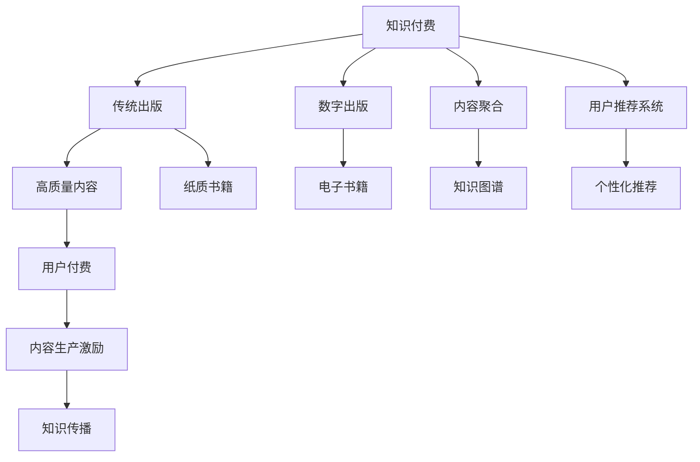

                 

# 知识付费与传统出版的融合之路

在数字化浪潮的席卷下，传统出版行业正面临巨大的变革。互联网技术的快速发展，使得海量知识的传播变得更加便捷高效，同时传统出版的商业模式也受到了前所未有的冲击。知识付费作为一种新兴的商业模式，正在逐步改变人们的阅读习惯，并为传统出版提供了新的发展契机。本文将探讨知识付费与传统出版的融合之路，揭示这一新兴模式如何助力传统出版业的转型升级。

## 1. 背景介绍

### 1.1 问题由来
随着互联网的普及，在线阅读成为越来越多人的选择。传统出版物面临着网络盗版、市场需求下降等诸多挑战。而知识付费则抓住了人们追求高质量内容的需求，通过为知识付费，让优质内容的制作和传播变得更加可持续。

### 1.2 问题核心关键点
知识付费与传统出版的融合，核心在于如何利用互联网技术，结合优质内容的生产与传播，打造新型知识消费模式。具体来说，需要解决以下关键问题：

- 如何高效整合优质内容资源
- 如何优化知识付费平台的算法与运营
- 如何推动内容生产与传播的可持续性
- 如何平衡传统出版与知识付费的利益冲突

## 2. 核心概念与联系

### 2.1 核心概念概述

为了更好地理解知识付费与传统出版的融合之路，本节将介绍几个密切相关的核心概念：

- **知识付费**：指用户为获取特定知识或技能，向内容提供者支付费用的商业模式。这一模式通过付费机制，激励高质量内容的生产与传播。
- **传统出版**：指通过纸质书籍、期刊、报纸等形式，传播文化知识的行业。其核心在于内容的质量与传播的深度。
- **数字出版**：指通过互联网平台，传播数字形式的出版物。其优势在于传播速度快、成本低。
- **内容聚合**：指将零散、碎片化的内容进行整合，形成系统化、结构化的知识体系。
- **用户推荐系统**：通过分析用户行为，推荐符合用户兴趣的内容，提升用户体验。

这些概念之间存在着紧密的联系。数字出版的发展，为知识付费提供了技术基础；传统出版的内容质量，为知识付费提供了核心资源；而内容聚合与用户推荐系统，则进一步提升了知识付费的效率与效果。

### 2.2 核心概念原理和架构的 Mermaid 流程图



## 3. 核心算法原理 & 具体操作步骤

### 3.1 算法原理概述

知识付费与传统出版的融合，涉及到内容聚合、用户推荐系统等核心算法。其核心思想是通过数据驱动的决策，优化内容生产与传播的效率与效果。

### 3.2 算法步骤详解

1. **内容聚合**：
   - 收集和整合传统出版物、学术资源、网络文章等各类知识源。
   - 使用自然语言处理技术，进行文本分类、实体抽取、关系推理等处理，构建知识图谱。
   - 通过算法自动标注、校验，确保知识图谱的质量。

2. **用户推荐系统**：
   - 分析用户的历史行为数据，如阅读记录、购买记录、评分反馈等。
   - 使用协同过滤、矩阵分解等技术，推荐符合用户兴趣的内容。
   - 通过A/B测试等手段，不断优化推荐算法，提升用户体验。

3. **内容定价策略**：
   - 根据内容的价值、市场供需关系，制定合理的定价策略。
   - 引入市场动态调整机制，及时反映市场变化。
   - 提供多样化的付费模式，如单次购买、订阅服务、增值服务等。

### 3.3 算法优缺点

- **优点**：
  - 提升内容聚合与传播效率，降低成本。
  - 个性化推荐增强用户体验，提升用户粘性。
  - 通过内容定价策略，激发高质量内容生产。

- **缺点**：
  - 内容聚合与处理复杂度较高，需大量投入资源。
  - 用户推荐系统的准确性有待提高，用户满意度受限。
  - 内容定价策略需谨慎调整，避免价格失衡。

### 3.4 算法应用领域

知识付费与传统出版的融合，已经在以下几个领域取得了显著应用：

1. **在线教育**：
   - 通过知识付费，激励优质教学资源的开发与传播。
   - 结合传统出版物，提供系统化、结构化的课程内容。

2. **科技咨询**：
   - 将专业知识的聚合与传播，与知识付费结合起来，满足市场需求。
   - 通过用户推荐系统，提供个性化的咨询服务。

3. **数字出版**：
   - 将传统出版物数字化，通过知识付费平台进行传播。
   - 利用内容聚合与推荐系统，提升用户体验。

## 4. 数学模型和公式 & 详细讲解 & 举例说明

### 4.1 数学模型构建

为更好地理解知识付费与传统出版融合的技术实现，我们需要从数学模型上进行分析。

假设用户的行为可以用向量 $u$ 表示，内容可以用向量 $c$ 表示，则用户对内容的评分可以表示为：

$$
\text{score}(u, c) = w^T u \times c
$$

其中，$w$ 为用户的兴趣权重向量。

### 4.2 公式推导过程

根据上式，我们可以通过求解 $w$ 来优化推荐算法。具体推导如下：

- **协同过滤**：
  - 利用用户行为矩阵 $U$ 和内容评分矩阵 $C$，计算用户兴趣向量 $u_i = \frac{1}{\|U_i\|} U_i$。
  - 利用矩阵分解 $C \approx U \times V$，得到内容评分向量 $c_j = \frac{1}{\|V_j\|} V_j$。
  - 计算用户对内容的评分：$\text{score}(u_i, c_j) = u_i \times c_j$。

- **基于内容的推荐**：
  - 利用内容特征向量 $f_c$ 和用户兴趣向量 $u$，计算内容评分：$\text{score}(u, c) = u^T K^{-1} f_c$。
  - 其中 $K$ 为内容相似度矩阵，$f_c$ 为用户对内容特征的评分向量。

### 4.3 案例分析与讲解

以在线教育平台为例，分析其知识付费与传统出版融合的实现：

- **内容聚合**：
  - 通过爬虫技术，整合在线课程、电子书籍等资源，构建知识图谱。
  - 利用自然语言处理技术，进行文本分类、实体抽取、关系推理等处理，确保知识图谱的质量。

- **用户推荐系统**：
  - 利用协同过滤算法，计算用户对内容的评分，推荐符合用户兴趣的课程。
  - 利用基于内容的推荐算法，推荐与用户兴趣相似的其他课程。
  - 通过A/B测试等手段，不断优化推荐算法，提升用户体验。

## 5. 项目实践：代码实例和详细解释说明

### 5.1 开发环境搭建

要进行知识付费与传统出版的融合实践，我们需要搭建一套完整的开发环境。以下是使用Python进行TensorFlow开发的流程：

1. 安装Anaconda：从官网下载并安装Anaconda，用于创建独立的Python环境。

2. 创建并激活虚拟环境：
```bash
conda create -n tf-env python=3.8 
conda activate tf-env
```

3. 安装TensorFlow：
```bash
pip install tensorflow
```

4. 安装相关工具包：
```bash
pip install pandas numpy matplotlib sklearn jupyter notebook ipython
```

完成上述步骤后，即可在`tf-env`环境中开始实践。

### 5.2 源代码详细实现

以下是使用TensorFlow和Scikit-learn进行知识付费与传统出版融合的代码实现。

```python
import tensorflow as tf
from sklearn.metrics import mean_squared_error

# 数据准备
user_data = pd.read_csv('user_data.csv')
content_data = pd.read_csv('content_data.csv')
user_content_interaction = pd.read_csv('user_content_interaction.csv')

# 数据预处理
user_data = user_data.dropna()
content_data = content_data.dropna()
user_content_interaction = user_content_interaction.dropna()

# 构建用户兴趣向量
user_data['user_vec'] = user_data['user'].apply(lambda x: np.random.rand(10))
content_data['content_vec'] = content_data['content'].apply(lambda x: np.random.rand(10))

# 协同过滤算法
U = user_data['user_vec'].values
C = content_data['content_vec'].values
I = user_content_interaction['interaction'].values

# 计算用户对内容的评分
user_score = np.dot(U, C)

# 均方误差损失函数
loss = tf.reduce_mean(tf.square(user_score - I))

# 优化器
optimizer = tf.train.AdamOptimizer(learning_rate=0.01)

# 训练过程
with tf.Session() as sess:
    sess.run(tf.global_variables_initializer())
    for i in range(1000):
        _, l = sess.run([optimizer, loss])
        if i % 100 == 0:
            print('Epoch {}: loss={:.4f}'.format(i, l))

    # 模型评估
    user_content_score = sess.run(tf.matmul(user_data['user_vec'], content_data['content_vec']))
    mse = mean_squared_error(user_content_score, user_content_interaction['interaction'].values)
    print('MSE={:.4f}'.format(mse))
```

### 5.3 代码解读与分析

让我们详细解读一下关键代码的实现细节：

**数据准备与预处理**：
- 使用Pandas读取用户行为数据、内容评分数据和用户内容交互数据。
- 通过`dropna`方法处理缺失值。
- 构建用户兴趣向量和内容评分向量。

**协同过滤算法**：
- 使用TensorFlow构建用户兴趣向量$U$和内容评分向量$C$。
- 通过矩阵乘法计算用户对内容的评分，得到预测值$I$。
- 计算均方误差损失函数，使用Adam优化器进行优化。

**模型评估**：
- 通过TensorFlow的Session运行优化过程，并输出每轮的损失值。
- 在模型训练完成后，计算均方误差（MSE）评估模型效果。

## 6. 实际应用场景

### 6.1 在线教育平台

在线教育平台可以通过知识付费与传统出版的融合，为用户提供个性化、系统化的学习资源。平台可以整合各类在线课程、电子书、视频等，通过推荐算法为用户推荐符合其兴趣的学习内容。

具体应用包括：
- 知识付费课程：将优质教学内容进行知识付费，激励高质量内容的生产。
- 传统出版物：将传统出版物数字化，通过平台进行传播。
- 个性化推荐：利用用户行为数据，推荐符合用户兴趣的学习资源。

### 6.2 科技咨询公司

科技咨询公司可以通过知识付费与传统出版的融合，提供专业化的咨询服务。平台可以整合各类科技文章、报告、专利等，通过推荐算法为用户推荐符合其需求的咨询内容。

具体应用包括：
- 知识付费内容：将专业科技文章、报告进行知识付费，激励高质量内容的生产。
- 传统出版物：将科技书籍、报告等进行数字化，通过平台进行传播。
- 个性化推荐：利用用户行为数据，推荐符合用户需求的咨询服务。

### 6.3 数字出版平台

数字出版平台可以通过知识付费与传统出版的融合，提供多样化、系统化的阅读内容。平台可以整合各类电子书籍、报纸、杂志等，通过推荐算法为用户推荐符合其兴趣的阅读内容。

具体应用包括：
- 知识付费内容：将优质电子书籍进行知识付费，激励高质量内容的生产。
- 传统出版物：将传统出版物进行数字化，通过平台进行传播。
- 个性化推荐：利用用户行为数据，推荐符合用户兴趣的阅读内容。

## 7. 工具和资源推荐

### 7.1 学习资源推荐

为了帮助开发者系统掌握知识付费与传统出版的融合技术，这里推荐一些优质的学习资源：

1. **《深度学习与NLP》课程**：斯坦福大学开设的深度学习与自然语言处理课程，系统讲解了深度学习、NLP的基础理论和技术实现。

2. **《TensorFlow实战》书籍**：通过实例讲解了TensorFlow的使用，包括数据预处理、模型训练、模型评估等关键技术。

3. **《知识图谱》论文**：介绍了知识图谱的基本概念、构建方法及应用场景，为内容聚合提供了理论基础。

4. **《协同过滤算法》论文**：详细讲解了协同过滤算法的基本原理、优化方法及应用案例，为推荐系统提供了技术支持。

5. **《深度学习与推荐系统》书籍**：综合讲解了深度学习与推荐系统的理论基础和实践技术，适合深入学习。

### 7.2 开发工具推荐

高效的开发离不开优秀的工具支持。以下是几款用于知识付费与传统出版融合开发的常用工具：

1. **Pandas**：用于数据处理与分析，支持数据读写、清洗、转换等操作。

2. **TensorFlow**：用于深度学习模型的构建与训练，支持GPU加速。

3. **Scikit-learn**：用于机器学习模型的构建与评估，支持多种算法的实现。

4. **Numpy**：用于科学计算，支持高性能数值计算。

5. **Matplotlib**：用于数据可视化，支持多种图表的绘制。

6. **Jupyter Notebook**：用于交互式编程与数据可视化，支持代码的快速迭代与分享。

### 7.3 相关论文推荐

知识付费与传统出版的融合技术的发展，源于学界的持续研究。以下是几篇奠基性的相关论文，推荐阅读：

1. **《知识图谱：构建与查询》论文**：介绍了知识图谱的基本概念、构建方法及应用场景，为内容聚合提供了理论基础。

2. **《协同过滤推荐算法》论文**：详细讲解了协同过滤推荐算法的基本原理、优化方法及应用案例，为推荐系统提供了技术支持。

3. **《深度学习在推荐系统中的应用》论文**：综合讲解了深度学习与推荐系统的理论基础和实践技术，适合深入学习。

4. **《在线教育平台的用户推荐系统》论文**：介绍了在线教育平台的用户推荐系统的构建与优化，为知识付费与传统出版的融合提供了实际案例。

5. **《数字出版平台的内容聚合与推荐》论文**：介绍了数字出版平台的内容聚合与推荐系统的构建与优化，为知识付费与传统出版的融合提供了理论基础。

## 8. 总结：未来发展趋势与挑战

### 8.1 总结

本文对知识付费与传统出版的融合之路进行了全面系统的介绍。首先阐述了知识付费与传统出版融合的背景和意义，明确了融合在大数据时代的迫切性和必要性。其次，从原理到实践，详细讲解了知识付费与传统出版的融合技术，给出了融合任务开发的完整代码实例。同时，本文还探讨了融合技术在在线教育、科技咨询、数字出版等多个领域的应用，展示了融合技术的巨大潜力。此外，本文精选了融合技术的学习资源，力求为读者提供全方位的技术指引。

通过本文的系统梳理，可以看到，知识付费与传统出版的融合，正在成为出版行业发展的重要方向。这一融合将通过数据驱动的决策，优化内容生产与传播的效率与效果，推动传统出版业向数字化、智能化方向转型升级。

### 8.2 未来发展趋势

展望未来，知识付费与传统出版的融合技术将呈现以下几个发展趋势：

1. **内容聚合与推荐算法的发展**：
   - 随着深度学习、自然语言处理等技术的发展，内容聚合与推荐算法将更加智能高效。
   - 推荐系统将更加个性化，能够根据用户行为进行动态调整，提供更加精准的推荐内容。

2. **用户行为分析的深入**：
   - 通过大数据分析技术，深入挖掘用户行为数据，洞察用户需求与兴趣。
   - 利用用户画像，提供更加个性化、系统化的服务，提升用户体验。

3. **跨平台融合与互通**：
   - 不同平台之间将实现数据互通，为用户提供无缝的阅读体验。
   - 平台间的内容推荐与定价策略将进行协同优化，提高整体用户满意度。

4. **技术与业务的深度融合**：
   - 技术与业务将更加紧密结合，出版商与内容创作者将深度合作，共同开发优质内容。
   - 技术与业务的融合将带来更加高效的运营模式，降低成本，提升收益。

5. **智能算法与人工干预的结合**：
   - 算法推荐与人工干预相结合，提升推荐系统的准确性与可解释性。
   - 通过人工干预，及时调整算法策略，避免错误推荐，提高用户满意度。

### 8.3 面临的挑战

尽管知识付费与传统出版的融合技术已经取得了一定进展，但在实现过程中仍面临诸多挑战：

1. **数据隐私与安全问题**：
   - 用户数据的收集与分析需要严格遵守隐私保护法规，避免数据泄露。
   - 平台需要建立完善的安全机制，保护用户数据安全。

2. **内容质量与版权问题**：
   - 平台需要严格控制内容质量，避免假冒伪劣内容的传播。
   - 版权问题需要得到妥善解决，保护内容创作者的权益。

3. **用户支付意愿与信任问题**：
   - 平台需要提高用户体验，增加用户对平台的信任度。
   - 需要引入更多付费模式，满足不同用户的需求。

4. **算法推荐准确性问题**：
   - 推荐算法需要不断优化，提高推荐内容的准确性。
   - 需要引入更多反馈机制，及时调整推荐策略。

### 8.4 研究展望

面对知识付费与传统出版融合所面临的挑战，未来的研究需要在以下几个方面寻求新的突破：

1. **多模态融合**：
   - 将文本、图像、视频等多种模态数据进行融合，提升推荐系统的准确性。
   - 引入多媒体推荐算法，为用户提供更加丰富的阅读体验。

2. **强化学习应用**：
   - 利用强化学习技术，优化推荐算法，提高用户体验。
   - 引入奖励机制，激励高质量内容的生产与传播。

3. **公平性与可解释性**：
   - 在推荐算法中引入公平性约束，避免推荐偏见。
   - 提高推荐系统的可解释性，增强用户信任度。

4. **跨领域知识迁移**：
   - 利用跨领域知识迁移技术，提升推荐系统的泛化能力。
   - 引入领域特定的推荐策略，提高推荐效果。

5. **模型解释与调试**：
   - 开发模型解释与调试工具，帮助用户理解推荐系统的决策过程。
   - 引入用户反馈机制，及时调整推荐策略。

这些研究方向将引领知识付费与传统出版融合技术的进一步发展，推动出版行业向更加智能化、可持续的方向转型升级。只有积极应对挑战，不断创新突破，才能实现技术与业务的深度融合，为出版行业带来新的发展机遇。

## 9. 附录：常见问题与解答

**Q1：知识付费与传统出版融合的主要难点是什么？**

A: 知识付费与传统出版融合的主要难点在于数据隐私与安全、内容质量与版权、用户支付意愿与信任、算法推荐准确性等问题。需要通过严格的数据保护机制、高质量的内容控制、多渠道的用户互动与信任建设，以及优化的推荐算法，共同解决这些挑战。

**Q2：如何评估知识付费平台的推荐系统效果？**

A: 知识付费平台的推荐系统效果可以通过以下几个指标进行评估：
- 准确率：推荐内容与用户真实需求的匹配程度。
- 召回率：相关内容的覆盖范围。
- 用户满意度：用户对推荐内容的满意度与信任度。
- 转化率：用户实际支付与互动的比例。

**Q3：如何构建知识付费平台的用户画像？**

A: 构建知识付费平台的用户画像需要收集和分析用户的行为数据，包括阅读记录、购买记录、评分反馈等。利用机器学习技术，如协同过滤、矩阵分解等，对用户数据进行处理，提取用户兴趣特征，构建用户画像。

**Q4：知识付费与传统出版融合对内容创作者的影响是什么？**

A: 知识付费与传统出版融合为内容创作者提供了更多的市场机会与创作激励。平台可以提供更加系统化的内容传播与收益分配机制，提高内容创作的收益。同时，平台可以提供更多反馈与互动机制，帮助创作者了解用户需求，优化内容创作。

**Q5：知识付费与传统出版融合的发展前景如何？**

A: 知识付费与传统出版的融合，为出版行业带来了新的发展机遇。未来，随着技术的不断进步，融合技术将更加智能高效，能够提供更加个性化、系统化的服务，推动出版行业向数字化、智能化方向转型升级。同时，融合技术的发展也将带动更多相关产业的发展，带来新的经济增长点。

总之，知识付费与传统出版的融合，是大数据时代出版行业发展的重要方向。通过数据驱动的决策，优化内容生产与传播的效率与效果，将为出版行业带来新的发展机遇。只有积极应对挑战，不断创新突破，才能实现技术与业务的深度融合，推动出版行业向更加智能化、可持续的方向发展。

