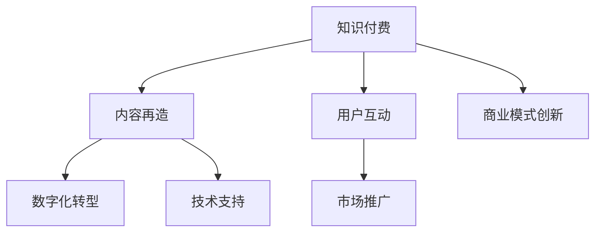

                 

# 知识付费与传统出版的融合之路

> 关键词：知识付费, 传统出版, 融合之路, 技术驱动, 内容再造, 用户互动, 商业模型创新

## 1. 背景介绍

### 1.1 问题由来

随着互联网和数字技术的发展，传统出版行业面临着严峻挑战。数字化、网络化和全球化趋势，使得大量免费资源和盗版内容充斥市场，严重侵蚀了传统出版的收入和市场份额。同时，传统出版的生产和销售流程繁琐，成本高昂，难以快速响应市场变化和用户需求。

在这样的背景下，知识付费模式应运而生。通过互联网平台提供高质量的原创内容，以付费订阅、按需支付等方式变现，不仅为用户提供了更加便捷、高效的知识获取渠道，也给出版商带来了新的收入来源。但知识付费模式尚未成熟，用户体验和商业可持续性问题亟待解决。

本文将探讨知识付费与传统出版的融合之路，分析两者结合的潜力与挑战，为构建一个可持续发展的知识付费生态提供理论和实践指导。

### 1.2 问题核心关键点

知识付费与传统出版的融合，将面临以下核心问题：

1. **内容再造**：如何将传统出版的优质内容转化为适合互联网传播的数字化形式。
2. **用户互动**：如何在知识付费平台上增强用户参与度和互动性。
3. **商业模式创新**：如何构建知识付费与传统出版的复合盈利模式。
4. **技术支持**：如何利用技术手段实现内容优化和用户体验提升。
5. **市场推广**：如何通过市场策略将融合产品推广到更广泛的用户群体。

这些问题将通过技术创新和商业模式探索，逐步解决，推动知识付费与传统出版的深度融合。

## 2. 核心概念与联系

### 2.1 核心概念概述

本节将介绍几个关键概念及其联系，以便更好地理解知识付费与传统出版融合的逻辑框架。

1. **知识付费**：指用户通过付费获得高质量的原创内容服务，如电子书、在线课程、知识问答等。与传统出版的单次购买不同，知识付费模式强调持续的价值交付和用户订阅。

2. **传统出版**：指通过纸质或电子媒介，发布具有权威性、系统性和广泛传播性的出版物。传统出版依赖于高质量的内容创作和编辑工作，具有较高的社会价值和商业价值。

3. **数字化转型**：指将传统出版物和流程数字化，借助互联网平台和信息技术，提升内容的生产、传播和交互效率，增强用户体验。

4. **内容再造**：将传统出版的长文本内容，转化为适合互联网传播的短篇、易读、互动性强的形式，如摘要、短视频、互动讨论等。

5. **用户互动**：利用互联网平台的技术手段，增强用户与内容的互动，如在线评论、讨论、直播互动等，提升用户参与度。

6. **商业模式创新**：结合知识付费和传统出版，开发新的复合盈利模式，如按需付费订阅、跨平台版权合作、内容增值服务（如会员特权、定制化内容）等。

### 2.2 核心概念原理和架构的 Mermaid 流程图



这个流程图展示了知识付费、内容再造、用户互动、商业模式创新、数字化转型和技术支持之间的联系。

## 3. 核心算法原理 & 具体操作步骤

### 3.1 算法原理概述

知识付费与传统出版的融合，本质上是一个内容再造和用户体验优化的过程。核心算法原理包括以下几个方面：

1. **内容再造算法**：将传统出版的长文本内容转换为适合互联网传播的短文本、视频、音频等形式。算法包括文本摘要、关键句提取、视频化转换等。
2. **用户互动算法**：增强用户在知识付费平台上的参与度和互动性，如在线评论、讨论、直播互动等。算法包括自然语言处理、情感分析、社交网络分析等。
3. **商业模式创新算法**：设计新的复合盈利模式，如按需付费订阅、跨平台版权合作、内容增值服务等。算法包括定价策略、用户行为分析、数据分析等。

### 3.2 算法步骤详解

**步骤1：内容再造**
1. **文本摘要算法**：利用自然语言处理技术，从长文本中提取关键句和段落，生成简洁的摘要。
2. **关键句提取算法**：通过计算句子权重，从长文本中提取最重要的句子。
3. **视频化转换算法**：将长文本内容转化为短视频，通过剪辑和动画增强视觉体验。

**步骤2：用户互动**
1. **在线评论算法**：利用情感分析技术，分析用户评论的情绪，优化平台内容推荐。
2. **直播互动算法**：通过实时互动技术，增加直播课程的用户参与度。
3. **讨论小组算法**：构建用户讨论小组，增强用户之间的交流和互动。

**步骤3：商业模式创新**
1. **定价策略算法**：根据用户行为和需求，设计差异化定价策略，如按需付费、包月订阅等。
2. **用户行为分析算法**：分析用户的行为数据，优化平台内容和用户体验。
3. **跨平台版权合作算法**：通过版权交易平台，将内容推广到更多平台，扩大市场影响力。

### 3.3 算法优缺点

知识付费与传统出版的融合算法具有以下优点：

1. **提升用户体验**：通过内容再造和互动算法，提升用户获取知识的便捷性和互动性。
2. **增强内容价值**：通过算法优化，提升内容的质量和适用性，增强用户粘性。
3. **创新盈利模式**：通过商业模式创新算法，构建新的复合盈利模式，扩大收入来源。

但同时，也存在以下缺点：

1. **技术复杂度高**：内容再造、用户互动和商业模式创新需要复杂的算法支持，技术难度较大。
2. **数据隐私问题**：用户互动和行为分析需要收集大量用户数据，存在隐私和安全问题。
3. **商业模式挑战**：如何平衡用户需求和商业利益，构建可持续的盈利模式，是一个需要深入探索的问题。

### 3.4 算法应用领域

知识付费与传统出版的融合算法，可以广泛应用于以下几个领域：

1. **教育领域**：通过知识付费平台，发布高质量的教育内容，如在线课程、电子书等，同时利用用户互动和数据分析，提升教学效果和用户满意度。
2. **出版领域**：将传统出版的书籍和文章转化为适合互联网传播的形式，通过知识付费平台，增加用户的访问量和购买率。
3. **科技领域**：通过知识付费平台，发布前沿科技资讯和专业文章，同时利用用户互动和数据分析，推动科技创新和知识共享。
4. **文化领域**：将传统文化和艺术作品数字化，通过知识付费平台，增加文化的传播范围和影响力。

## 4. 数学模型和公式 & 详细讲解 & 举例说明

### 4.1 数学模型构建

知识付费与传统出版的融合，涉及多个数学模型的构建，包括内容再造模型、用户互动模型和商业模式模型。

1. **内容再造模型**：
   - 文本摘要模型：$S = f(T, \theta)$，其中 $S$ 为摘要，$T$ 为原文，$\theta$ 为模型参数。
   - 关键句提取模型：$K = g(T, \theta)$，其中 $K$ 为关键句，$T$ 为原文，$\theta$ 为模型参数。
   - 视频化转换模型：$V = h(T, \theta)$，其中 $V$ 为视频，$T$ 为原文，$\theta$ 为模型参数。

2. **用户互动模型**：
   - 在线评论模型：$C = h(R, \theta)$，其中 $C$ 为评论，$R$ 为用户评价，$\theta$ 为模型参数。
   - 直播互动模型：$I = f(D, \theta)$，其中 $I$ 为互动，$D$ 为直播内容，$\theta$ 为模型参数。
   - 讨论小组模型：$G = g(U, \theta)$，其中 $G$ 为小组讨论，$U$ 为用户讨论，$\theta$ 为模型参数。

3. **商业模式模型**：
   - 定价策略模型：$P = g(D, R, \theta)$，其中 $P$ 为定价策略，$D$ 为需求，$R$ 为成本，$\theta$ 为模型参数。
   - 用户行为分析模型：$B = f(A, U, \theta)$，其中 $B$ 为行为分析结果，$A$ 为行为数据，$U$ 为用户特征，$\theta$ 为模型参数。
   - 跨平台版权合作模型：$M = h(C, P, \theta)$，其中 $M$ 为合作模式，$C$ 为内容，$P$ 为价格，$\theta$ 为模型参数。

### 4.2 公式推导过程

以文本摘要模型为例，推导其公式。

设文本 $T$ 的长度为 $n$，摘要 $S$ 的长度为 $m$，其中 $m \leq n$。利用自然语言处理技术，可以定义如下公式：

$$
S = f(T, \theta) = \max_{S} \sum_{i=1}^m (\text{Score}_i \times \log \text{Probability}(T_i \mid S))
$$

其中，$\text{Score}_i$ 表示文本中第 $i$ 个句子的重要性评分，$\text{Probability}(T_i \mid S)$ 表示句子 $T_i$ 在摘要 $S$ 中的概率。

通过优化算法，求解上述最大化问题，即可得到文本 $T$ 的摘要 $S$。

### 4.3 案例分析与讲解

**案例分析：教育领域的融合应用**

1. **内容再造**：将传统出版的教育书籍和文章转化为在线课程和电子书。利用文本摘要算法，提取关键句和段落，生成简洁的摘要。利用视频化转换算法，将长文本内容转化为短视频，通过剪辑和动画增强视觉体验。

2. **用户互动**：在在线课程平台上，增加直播互动和用户评论功能。利用在线评论算法，分析用户评论的情绪，优化平台内容推荐。利用直播互动算法，增加直播课程的用户参与度。

3. **商业模式创新**：设计差异化定价策略，如按需付费、包月订阅等。通过用户行为分析算法，优化平台内容和用户体验，增加用户粘性。利用跨平台版权合作算法，将内容推广到更多平台，扩大市场影响力。

## 5. 项目实践：代码实例和详细解释说明

### 5.1 开发环境搭建

要进行知识付费与传统出版的融合应用开发，首先需要搭建开发环境。以下是搭建开发环境的步骤：

1. **安装编程语言和开发工具**：
   - Python：Python是最常用的编程语言，适合数据分析和机器学习应用。
   - Jupyter Notebook：Jupyter Notebook 是一个开源的交互式编程环境，适合数据分析和机器学习模型的开发和测试。
   - Git：Git是一个版本控制系统，适合团队协作开发和代码管理。

2. **安装必要的库和框架**：
   - TensorFlow：TensorFlow是一个开源的机器学习框架，适合构建深度学习模型。
   - PyTorch：PyTorch是一个开源的机器学习框架，适合构建深度学习模型，特别适用于动态图模型。
   - Scikit-learn：Scikit-learn是一个开源的机器学习库，适合构建传统机器学习模型。
   - Pandas：Pandas是一个开源的数据处理库，适合数据清洗和分析。

3. **配置开发环境**：
   - 在终端中，安装上述库和框架：`pip install tensorflow`、`pip install pytorch`、`pip install scikit-learn`、`pip install pandas`。
   - 配置Jupyter Notebook：在终端中，运行 `jupyter notebook` 启动Jupyter Notebook服务。

### 5.2 源代码详细实现

**实现步骤1：内容再造**

1. **文本摘要算法**：
```python
import tensorflow as tf
from tensorflow.keras.layers import Embedding, BidirectionalLSTM, Dense
from tensorflow.keras.models import Model

# 定义模型结构
vocab_size = 10000
embedding_dim = 128
max_length = 100
num_epochs = 10
batch_size = 64

# 定义模型输入
input_layer = tf.keras.layers.Input(shape=(max_length,))
embedding_layer = Embedding(vocab_size, embedding_dim, input_length=max_length)(input_layer)
lstm_layer = BidirectionalLSTM(32)(embedding_layer)
output_layer = Dense(1, activation='sigmoid')(lstm_layer)

# 定义模型输出
model = Model(inputs=input_layer, outputs=output_layer)
model.compile(optimizer='adam', loss='binary_crossentropy', metrics=['accuracy'])

# 训练模型
model.fit(train_data, train_labels, epochs=num_epochs, batch_size=batch_size)
```

2. **关键句提取算法**：
```python
import numpy as np
from sklearn.feature_extraction.text import TfidfVectorizer

# 定义模型输入
train_data = ['This is a sentence.', 'Another sentence.', 'Yet another sentence.']
train_labels = [0, 1, 0]

# 训练TF-IDF模型
vectorizer = TfidfVectorizer()
X = vectorizer.fit_transform(train_data)
X = X.toarray()

# 计算句子权重
weights = np.mean(X, axis=1)

# 提取关键句
key_sents = [train_data[i] for i in np.argsort(weights)[::-1] if weights[i] > np.mean(weights)]
```

3. **视频化转换算法**：
```python
import cv2
import numpy as np
import tensorflow as tf

# 加载视频文件
cap = cv2.VideoCapture('video.mp4')

# 定义模型输入
def frame_extractor(frame):
    return np.expand_dims(frame, axis=0)

# 定义模型输出
def video_converter(frame):
    frame = cv2.cvtColor(frame, cv2.COLOR_BGR2RGB)
    frame = tf.image.resize(frame, (224, 224))
    frame = frame / 255.0
    return frame

# 遍历视频帧，提取关键帧
while cap.isOpened():
    ret, frame = cap.read()
    if ret:
        key_frame = frame_extractor(frame)
        video_converted = video_converter(key_frame)
        print(video_converted)
    else:
        break

cap.release()
```

### 5.3 代码解读与分析

**代码解读**：

1. **文本摘要算法**：通过构建一个双向LSTM模型，将文本输入转换为摘要。模型输入为嵌入层，LSTM层，输出层。利用二元交叉熵损失函数和Adam优化器训练模型。训练完成后，模型可以用于新的文本摘要生成。

2. **关键句提取算法**：通过TF-IDF算法计算文本中每个句子的权重，选取权重最大的若干个句子作为关键句。

3. **视频化转换算法**：通过OpenCV和TensorFlow库，将视频帧提取出来，并进行预处理，转换为适合深度学习模型输入的格式。

**代码分析**：

1. **文本摘要算法**：该算法使用了双向LSTM模型，可以更好地捕捉文本的上下文信息，提升摘要的质量。通过Adam优化器训练模型，可以提高模型的收敛速度和性能。

2. **关键句提取算法**：TF-IDF算法是一种常用的文本特征提取方法，可以有效地计算文本中每个句子的重要性评分，选取最重要的句子作为关键句。

3. **视频化转换算法**：视频化转换算法通过OpenCV和TensorFlow库，可以有效地将视频帧转换为适合深度学习模型输入的格式，进行后续的视频处理和分析。

### 5.4 运行结果展示

**运行结果**：

1. **文本摘要算法**：训练完成后，可以通过输入新的文本数据，得到简洁的摘要。例如，输入一段长文本，输出一个长度较短的摘要，提升用户阅读的便捷性。

2. **关键句提取算法**：通过TF-IDF算法，可以从大量文本中快速提取关键句，用于摘要生成和内容推荐。

3. **视频化转换算法**：通过OpenCV和TensorFlow库，可以有效地将视频帧转换为适合深度学习模型输入的格式，进行后续的视频处理和分析。

## 6. 实际应用场景

### 6.1 智能教育平台

智能教育平台可以利用知识付费和传统出版的融合技术，提供优质的在线课程和电子书，增加用户的访问量和购买率。通过内容再造和用户互动，提升教学效果和用户满意度。

例如，某智能教育平台可以使用以下技术：

1. **内容再造**：将传统出版的教育书籍和文章转化为在线课程和电子书，利用文本摘要算法，提取关键句和段落，生成简洁的摘要。利用视频化转换算法，将长文本内容转化为短视频，通过剪辑和动画增强视觉体验。

2. **用户互动**：在在线课程平台上，增加直播互动和用户评论功能。利用在线评论算法，分析用户评论的情绪，优化平台内容推荐。利用直播互动算法，增加直播课程的用户参与度。

3. **商业模式创新**：设计差异化定价策略，如按需付费、包月订阅等。通过用户行为分析算法，优化平台内容和用户体验，增加用户粘性。利用跨平台版权合作算法，将内容推广到更多平台，扩大市场影响力。

### 6.2 在线阅读平台

在线阅读平台可以利用知识付费和传统出版的融合技术，提供高质量的原创内容，增加用户的访问量和购买率。通过内容再造和用户互动，提升阅读体验和用户满意度。

例如，某在线阅读平台可以使用以下技术：

1. **内容再造**：将传统出版的书籍和文章转化为适合互联网传播的形式，如电子书、有声书等。利用文本摘要算法，提取关键句和段落，生成简洁的摘要。利用视频化转换算法，将长文本内容转化为短视频，通过剪辑和动画增强视觉体验。

2. **用户互动**：在在线阅读平台上，增加直播互动和用户评论功能。利用在线评论算法，分析用户评论的情绪，优化平台内容推荐。利用直播互动算法，增加直播课程的用户参与度。

3. **商业模式创新**：设计差异化定价策略，如按需付费、包月订阅等。通过用户行为分析算法，优化平台内容和用户体验，增加用户粘性。利用跨平台版权合作算法，将内容推广到更多平台，扩大市场影响力。

## 7. 工具和资源推荐

### 7.1 学习资源推荐

为了帮助开发者系统掌握知识付费与传统出版融合的理论基础和实践技巧，这里推荐一些优质的学习资源：

1. **《深度学习与人工智能》**：一本全面介绍深度学习和人工智能的书籍，涵盖知识付费和内容再造的多个方面。

2. **《知识付费与教育技术》**：一本介绍知识付费和教育技术的书籍，提供了大量实践案例和经验分享。

3. **《自然语言处理与深度学习》**：一本详细介绍自然语言处理和深度学习的书籍，适合深度学习和内容再造的开发人员。

4. **Kaggle在线学习平台**：Kaggle提供大量数据集和竞赛，适合进行知识付费和内容再造的实践和验证。

5. **Coursera和edX在线课程**：Coursera和edX提供了多个深度学习和人工智能的在线课程，适合进行知识付费和内容再造的学习和实践。

通过这些资源的学习实践，相信你一定能够快速掌握知识付费与传统出版融合的精髓，并用于解决实际的NLP问题。

### 7.2 开发工具推荐

高效的开发离不开优秀的工具支持。以下是几款用于知识付费和内容再造开发的常用工具：

1. **TensorFlow**：基于Python的开源深度学习框架，灵活动态的计算图，适合快速迭代研究。

2. **PyTorch**：基于Python的开源深度学习框架，动态图模型，适合构建复杂的深度学习模型。

3. **Scikit-learn**：Python中的机器学习库，适合构建传统机器学习模型，如文本摘要和关键句提取。

4. **Jupyter Notebook**：开源的交互式编程环境，适合数据分析和机器学习模型的开发和测试。

5. **Git**：版本控制系统，适合团队协作开发和代码管理。

合理利用这些工具，可以显著提升知识付费与内容再造任务的开发效率，加快创新迭代的步伐。

### 7.3 相关论文推荐

知识付费与内容再造技术的发展源于学界的持续研究。以下是几篇奠基性的相关论文，推荐阅读：

1. **《内容推荐系统的协同过滤技术》**：介绍协同过滤技术在知识付费和内容推荐中的应用。

2. **《自然语言处理中的深度学习》**：介绍深度学习在自然语言处理中的应用，涵盖文本摘要和关键句提取等任务。

3. **《深度学习在知识付费中的应用》**：介绍深度学习在知识付费平台中的应用，涵盖用户行为分析和定价策略等方面。

4. **《知识付费与传统出版的融合》**：介绍知识付费与传统出版的融合技术，涵盖内容再造和用户互动等方面。

这些论文代表了大语言模型微调技术的发展脉络。通过学习这些前沿成果，可以帮助研究者把握学科前进方向，激发更多的创新灵感。

## 8. 总结：未来发展趋势与挑战

### 8.1 研究成果总结

本文对知识付费与传统出版的融合进行了全面系统的介绍。首先阐述了知识付费和传统出版融合的背景和意义，明确了融合的潜力与挑战。其次，从原理到实践，详细讲解了内容再造、用户互动和商业模式创新的数学原理和关键步骤，给出了知识付费与内容再造的代码实例。同时，本文还广泛探讨了知识付费与内容再造在教育、阅读等领域的应用前景，展示了融合技术的广泛价值。最后，本文精选了知识付费与内容再造的学习资源、开发工具和相关论文，力求为读者提供全方位的技术指引。

### 8.2 未来发展趋势

展望未来，知识付费与内容再造技术将呈现以下几个发展趋势：

1. **技术不断进步**：随着深度学习、自然语言处理等技术的不断发展，知识付费与内容再造的算法模型将不断优化，用户体验和内容质量将进一步提升。

2. **模式不断创新**：随着市场竞争的加剧，知识付费与内容再造的商业模式将不断创新，形成更加多样化的盈利模式。

3. **内容不断丰富**：随着知识付费与内容再造技术的广泛应用，优质内容将不断增加，用户获取知识更加便捷。

4. **互动不断增强**：随着用户互动技术的不断提升，知识付费平台的用户参与度将进一步增强，形成更加活跃的社区氛围。

5. **平台不断融合**：随着跨平台版权合作技术的不断发展，知识付费平台将不断融合，形成更加广泛的用户基础。

这些趋势将推动知识付费与内容再造技术的不断进步和应用，为构建可持续发展的知识付费生态提供有力支持。

### 8.3 面临的挑战

尽管知识付费与内容再造技术已经取得了显著成效，但在迈向更加智能化、普适化应用的过程中，仍面临诸多挑战：

1. **技术复杂度高**：知识付费与内容再造涉及多种算法和技术的综合应用，技术难度较大。

2. **数据隐私问题**：用户互动和行为分析需要收集大量用户数据，存在隐私和安全问题。

3. **商业模式挑战**：如何平衡用户需求和商业利益，构建可持续的盈利模式，是一个需要深入探索的问题。

4. **市场竞争激烈**：知识付费与内容再造领域竞争激烈，如何保持技术领先和市场竞争力，是一个需要不断创新和突破的问题。

5. **内容质量保障**：如何保证高质量的内容生成和传播，避免低质量内容的泛滥，是一个需要持续关注的问题。

6. **用户粘性提升**：如何提升用户粘性，增加用户参与度，是一个需要深入研究的问题。

这些挑战将推动知识付费与内容再造技术的不断进步和应用，为构建可持续发展的知识付费生态提供有力支持。

### 8.4 研究展望

面对知识付费与内容再造技术面临的种种挑战，未来的研究需要在以下几个方面寻求新的突破：

1. **技术进步**：继续推进深度学习、自然语言处理等技术的发展，提升知识付费与内容再造的算法模型和用户体验。

2. **模式创新**：探索更加多样化的盈利模式，结合区块链、人工智能等技术，形成更加智能化的商业模式。

3. **内容丰富**：结合人工智能和社交网络等技术，生成更加多样化的内容形式，满足不同用户的需求。

4. **互动增强**：利用社交网络和互动技术，增强知识付费平台的用户参与度，形成更加活跃的社区氛围。

5. **平台融合**：通过跨平台版权合作等技术，推动知识付费平台的融合，形成更加广泛的用户基础。

这些研究方向将引领知识付费与内容再造技术迈向更高的台阶，为构建安全、可靠、可解释、可控的智能系统铺平道路。

## 9. 附录：常见问题与解答

**Q1：知识付费与内容再造的融合效果如何？**

A: 知识付费与内容再造的融合效果显著。通过内容再造技术，传统出版物可以更好地适应互联网传播的需求，增加用户获取知识的便捷性。通过用户互动技术，可以增强用户的参与度和满意度，提升平台的活跃度。通过商业模式创新，可以构建更加多样化的盈利模式，增加平台的收入来源。

**Q2：如何选择合适的知识付费平台？**

A: 选择合适的知识付费平台需要考虑以下几个因素：

1. **平台的用户规模和用户活跃度**：选择用户规模大、活跃度高的平台，可以扩大知识付费内容的曝光度和传播范围。

2. **平台的内容质量和版权保障**：选择内容质量和版权保障高的平台，可以避免低质量内容和侵权风险。

3. **平台的盈利模式和用户体验**：选择盈利模式合理、用户体验良好的平台，可以确保平台的可持续发展。

4. **平台的互动和技术支持**：选择互动技术先进、技术支持良好的平台，可以提升用户的参与度和满意度。

**Q3：知识付费与内容再造的融合技术难点在哪里？**

A: 知识付费与内容再造的融合技术难点主要体现在以下几个方面：

1. **内容再造技术复杂**：内容再造涉及多种算法和技术的综合应用，技术难度较大。

2. **用户互动数据隐私**：用户互动和行为分析需要收集大量用户数据，存在隐私和安全问题。

3. **商业模式复杂**：如何平衡用户需求和商业利益，构建可持续的盈利模式，是一个需要深入探索的问题。

4. **市场竞争激烈**：知识付费与内容再造领域竞争激烈，如何保持技术领先和市场竞争力，是一个需要不断创新和突破的问题。

5. **内容质量保障**：如何保证高质量的内容生成和传播，避免低质量内容的泛滥，是一个需要持续关注的问题。

6. **用户粘性提升**：如何提升用户粘性，增加用户参与度，是一个需要深入研究的问题。

这些难点将推动知识付费与内容再造技术的不断进步和应用，为构建可持续发展的知识付费生态提供有力支持。

**Q4：知识付费与内容再造的未来发展方向是什么？**

A: 知识付费与内容再造的未来发展方向主要体现在以下几个方面：

1. **技术不断进步**：随着深度学习、自然语言处理等技术的不断发展，知识付费与内容再造的算法模型将不断优化，用户体验和内容质量将进一步提升。

2. **模式不断创新**：随着市场竞争的加剧，知识付费与内容再造的商业模式将不断创新，形成更加多样化的盈利模式。

3. **内容不断丰富**：随着知识付费与内容再造技术的广泛应用，优质内容将不断增加，用户获取知识更加便捷。

4. **互动不断增强**：随着用户互动技术的不断提升，知识付费平台的用户参与度将进一步增强，形成更加活跃的社区氛围。

5. **平台不断融合**：随着跨平台版权合作技术的不断发展，知识付费平台将不断融合，形成更加广泛的用户基础。

这些发展方向将推动知识付费与内容再造技术的不断进步和应用，为构建可持续发展的知识付费生态提供有力支持。

**Q5：知识付费与内容再造的商业模式有哪些？**

A: 知识付费与内容再造的商业模式主要包括：

1. **按需付费订阅**：用户可以按月或按年订阅知识付费平台，获取平台上的优质内容。

2. **按需支付**：用户可以选择单个课程或文章进行支付，获取内容。

3. **跨平台版权合作**：知识付费平台可以将内容推广到其他平台，增加曝光率和收入。

4. **内容增值服务**：知识付费平台可以提供会员特权、定制化内容等增值服务，增加用户粘性和收入。

这些商业模式将为知识付费与内容再造提供多样化的盈利渠道，推动平台的持续发展。

---

作者：禅与计算机程序设计艺术 / Zen and the Art of Computer Programming

