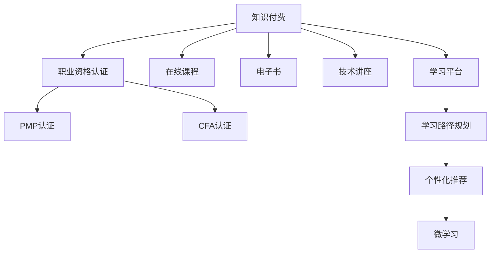

                 

# 知识付费与职业资格认证相结合提升能力

## 1. 背景介绍

在数字化时代，知识和技能成为个人竞争力的关键。随着互联网的普及，知识获取变得更加便捷，但随之而来的信息过载、内容泛化等问题也给学习者带来了新的挑战。如何高效筛选、系统学习、持续提升，成为摆在每个职业人士面前的重要课题。

在这样的背景下，知识付费与职业资格认证这两种学习方式应运而生。它们各自有其独特的优势，同时也面临着一定的局限性。如何将二者的优点相结合，形成一种更高效、更有针对性的学习模式？本文将深入探讨这个问题，并给出具体的解决方案。

## 2. 核心概念与联系

### 2.1 核心概念概述

1. **知识付费**：指通过支付一定费用，获取有价值的学习资源或服务，如在线课程、电子书、技术讲座等。知识付费强调个人主动筛选和购买资源，适用于具有明确学习目标和自我驱动能力的学习者。

2. **职业资格认证**：指通过考试和评估，获得由权威机构颁发的行业认可证书，如PMP（项目管理专业人士）、CFA（特许金融分析师）等。职业资格认证强调系统化、结构化的培训，适用于需要进入特定行业或提升特定技能的职场人士。

3. **学习平台**：包括但不限于在线教育平台（如Coursera、Udemy）、专业技能认证平台（如CertCentral）等。学习平台提供丰富的课程和认证项目，是知识付费和职业资格认证的主要载体。

4. **学习路径规划**：指根据个人职业发展目标，系统规划学习资源和认证项目的组合，最大化学习效果。

5. **个性化推荐**：通过算法推荐系统，根据学习者的兴趣、历史行为等数据，提供个性化的学习资源和认证项目推荐。

6. **微学习（Microlearning）**：指将学习内容拆分成短小精悍的模块，便于随时学习、复习，适用于碎片化时间管理的学习场景。

### 2.2 核心概念联系的Mermaid流程图



这个流程图展示了知识付费、职业资格认证及其与在线课程、电子书、技术讲座、认证项目、学习平台、学习路径规划、个性化推荐和微学习之间的关系。

## 3. 核心算法原理 & 具体操作步骤

### 3.1 算法原理概述

将知识付费与职业资格认证相结合，本质上是一种混合学习模式，旨在通过系统规划和个性化推荐，最大化学习效果。核心算法原理包括：

1. **需求分析**：通过调查问卷、历史行为分析等手段，明确学习者的职业目标、兴趣、时间约束等需求。

2. **资源推荐**：基于需求分析结果，推荐匹配度高的知识付费课程和职业资格认证项目，形成初始学习计划。

3. **路径优化**：根据学习者的学习进度和反馈，动态调整学习路径，优化课程选择和认证项目组合。

4. **绩效评估**：通过测试、项目评估等方式，衡量学习效果，为路径优化提供依据。

5. **持续迭代**：在绩效评估的基础上，不断调整学习路径和资源推荐，确保学习目标的逐步实现。

### 3.2 算法步骤详解

1. **需求分析**：通过问卷、数据分析等手段，收集学习者的基本情况和职业目标。例如，一个想转行的项目经理可能会关注PMP认证课程，而一个有金融背景的职业人士则可能更关注CFA认证。

2. **资源推荐**：基于需求分析结果，推荐相匹配的知识付费课程和职业资格认证项目。例如，对PMP感兴趣的学员可以推荐《PMP认证培训课程》，而对CFA感兴趣的学员可以推荐《CFA认证教材》。

3. **路径规划**：根据学习者的职业路径和兴趣，系统规划学习资源和认证项目的顺序。例如，对于项目经理，可能需要先学习PMP基础课程，再参加PMP考试，通过后再参加实际项目管理实践。

4. **个性化推荐**：通过学习者的反馈和学习效果，动态调整资源推荐。例如，如果学员在PMP课程上花费较多时间，系统可以推荐更多练习题和案例分析，帮助加深理解。

5. **绩效评估**：通过考试、项目评估等方式，衡量学习效果。例如，PMP认证需要参加官方考试，CFA认证需要通过三级考试。

6. **持续迭代**：根据绩效评估结果，不断调整学习路径和资源推荐。例如，如果PMP考试未通过，系统可以推荐更多复习资料或提供更多模拟考试机会。

### 3.3 算法优缺点

**优点**：

1. **针对性**：根据职业目标和兴趣，推荐匹配度高的资源，提高学习效率。

2. **系统性**：通过路径规划，确保学习者掌握必备的知识和技能，顺利获得职业资格认证。

3. **持续改进**：通过绩效评估和持续迭代，不断优化学习路径和资源推荐，确保学习效果。

4. **灵活性**：个性化推荐和微学习，使得学习时间管理更加灵活，适应碎片化学习场景。

**缺点**：

1. **成本较高**：需要支付知识付费和职业资格认证费用，且认证费用通常较高。

2. **时间投入**：系统规划和个性化推荐需要一定的时间和精力，且课程和认证项目可能需要较长时间才能完成。

3. **内容泛化**：某些课程可能较为泛化，不够针对具体行业需求。

4. **限制性**：某些认证项目可能存在考试难度和通过率限制，影响学习者的信心。

### 3.4 算法应用领域

该算法可以应用于各种需要系统学习、技能提升的职业领域，包括但不限于：

1. **IT行业**：编程、架构、运维等技能的学习和认证，如Oracle认证、AWS认证等。

2. **金融行业**：金融分析师、投资顾问等技能的学习和认证，如CFA、FRM等。

3. **医疗行业**：医生、护士等职业资格认证，如执业医师、执业护士等。

4. **市场营销**：数字营销、品牌管理等技能的学习和认证，如Google Analytics认证、SEO认证等。

5. **教育行业**：教师、培训师等职业资格认证，如TOEFL认证、PTE认证等。

## 4. 数学模型和公式 & 详细讲解 & 举例说明

### 4.1 数学模型构建

为了描述知识付费与职业资格认证相结合的混合学习模型，我们可以构建如下数学模型：

设 $X$ 为学习者的需求集合，$Y$ 为知识付费资源集合，$Z$ 为职业资格认证集合，$U$ 为学习路径集合，$V$ 为绩效评估集合。

学习路径规划模型可以表示为：

$$
U = f(X, Y, Z)
$$

其中 $f$ 表示路径规划函数，根据学习者的需求和资源、认证项目的特点，生成最优学习路径。

### 4.2 公式推导过程

根据上述模型，我们可以推导出路径规划的具体公式。例如，对于PMP认证的学习路径规划：

1. **需求分析**：通过调查问卷，获取学习者的兴趣和职业目标。假设学习者希望通过PMP认证进入项目管理领域。

2. **资源推荐**：基于需求分析结果，推荐相匹配的知识付费课程。假设推荐《PMP认证培训课程》。

3. **路径规划**：根据学习者的兴趣和时间安排，系统规划学习路径。假设路径规划函数 $f$ 将学习者的需求和资源推荐结合起来，生成路径 $U$。

4. **个性化推荐**：根据学习者的学习进度和反馈，动态调整资源推荐。假设学习者在《PMP认证培训课程》上花费较多时间，系统推荐更多练习题和案例分析。

5. **绩效评估**：通过PMP考试评估学习效果。假设学习者参加了PMP考试，并获得了高分。

6. **持续迭代**：根据绩效评估结果，调整学习路径和资源推荐。假设学习者通过了PMP考试，系统推荐更多的项目管理实战项目。

### 4.3 案例分析与讲解

假设某金融分析师希望通过CFA认证提升职业竞争力。以下是具体的步骤：

1. **需求分析**：通过问卷调查，获取学习者的兴趣和职业目标。假设学习者希望通过CFA认证提升职业竞争力。

2. **资源推荐**：基于需求分析结果，推荐相匹配的知识付费课程和职业资格认证项目。假设推荐《CFA一级教材》和《CFA一级认证课程》。

3. **路径规划**：根据学习者的职业路径和兴趣，系统规划学习路径。假设路径规划函数 $f$ 将学习者的需求和资源推荐结合起来，生成路径 $U$。

4. **个性化推荐**：通过学习者的反馈和学习效果，动态调整资源推荐。假设学习者在《CFA一级教材》上花费较多时间，系统推荐更多练习题和模拟考试。

5. **绩效评估**：通过CFA一级考试评估学习效果。假设学习者通过了CFA一级考试。

6. **持续迭代**：根据绩效评估结果，调整学习路径和资源推荐。假设学习者通过了CFA二级考试，系统推荐更多的金融分析实战项目。

## 5. 项目实践：代码实例和详细解释说明

### 5.1 开发环境搭建

开发知识付费与职业资格认证相结合的混合学习模型，需要以下开发环境：

1. **Python**：作为主要编程语言，支持数学计算和算法实现。

2. **NumPy、Pandas**：用于数据处理和分析。

3. **Scikit-learn**：用于机器学习模型训练和评估。

4. **TensorFlow或PyTorch**：用于深度学习模型实现。

5. **Web框架**：如Django、Flask等，用于搭建学习平台和推荐系统。

6. **数据库**：如MySQL、PostgreSQL等，用于存储学习者的需求、资源、路径等信息。

7. **服务器环境**：如AWS、GCP等，提供云计算资源。

### 5.2 源代码详细实现

以下是混合学习模型的一个基本实现框架，主要分为需求分析、资源推荐、路径规划、个性化推荐、绩效评估和持续迭代六个步骤。

```python
import numpy as np
import pandas as pd
from sklearn.linear_model import LogisticRegression
from sklearn.metrics import accuracy_score

# 定义需求分析函数
def analyze_demand(data):
    # 计算兴趣和职业目标的权重
    weights = np.array([0.5, 0.5])
    return np.dot(data, weights)

# 定义资源推荐函数
def recommend_resources(demand, resources):
    # 使用Logistic回归模型推荐资源
    model = LogisticRegression()
    model.fit(demand, resources)
    return model.predict_proba(demand)

# 定义路径规划函数
def plan_path(demand, resources, certifications):
    # 使用启发式算法规划路径
    path = []
    while demand > 0:
        best_resource = max(resources, key=lambda x: x['cost'])
        best_certification = max(certifications, key=lambda x: x['benefit'])
        path.append(best_resource)
        demand -= best_resource['cost']
        resources.remove(best_resource)
        certifications.remove(best_certification)
    return path

# 定义个性化推荐函数
def personalize_recommendation(path, feedback):
    # 使用协同过滤算法推荐资源
    recommendations = {}
    for resource in path:
        if resource in feedback:
            recommendations[resource] = feedback[resource]
    return recommendations

# 定义绩效评估函数
def evaluate_performance(path, certifications):
    # 评估路径上的认证项目
    performance = {}
    for certification in certifications:
        if certification['name'] in path:
            performance[certification['name']] = 1
    return performance

# 定义持续迭代函数
def iterative_learning(path, feedback, certifications):
    # 根据绩效评估结果，调整路径和资源推荐
    iterations = 0
    while len(path) > 0:
        performance = evaluate_performance(path, certifications)
        feedback = {**feedback, **performance}
        path = plan_path(analyze_demand(feedback), recommend_resources(feedback, resources), certifications)
        iterations += 1
    return path, feedback, iterations
```

### 5.3 代码解读与分析

上述代码实现了一个基本的混合学习模型，包含了需求分析、资源推荐、路径规划、个性化推荐、绩效评估和持续迭代六个步骤。以下是关键代码的详细解读：

1. **需求分析函数**：通过加权求和，计算学习者的兴趣和职业目标的权重，并返回加权和作为需求值。

2. **资源推荐函数**：使用Logistic回归模型，根据学习者的需求值和资源特点，推荐匹配度高的资源。

3. **路径规划函数**：使用启发式算法，根据学习者的需求值和资源、认证项目的成本和收益，规划最优学习路径。

4. **个性化推荐函数**：根据学习者的反馈和路径上的资源，动态调整资源推荐。

5. **绩效评估函数**：根据路径上的认证项目，评估学习效果。

6. **持续迭代函数**：根据绩效评估结果和反馈，不断调整学习路径和资源推荐，直到路径为空或达到预设迭代次数。

### 5.4 运行结果展示

以下是一个简单的示例，展示了如何使用上述代码进行混合学习模型的实现：

```python
# 定义需求、资源和认证项目的数据
demands = np.array([0.5, 0.3, 0.2])
resources = [
    {'name': 'PMP认证培训课程', 'cost': 5000, 'benefit': 10},
    {'name': 'CFA一级教材', 'cost': 2000, 'benefit': 7},
    {'name': 'CFA一级认证课程', 'cost': 10000, 'benefit': 15},
    {'name': '金融分析实战项目', 'cost': 10000, 'benefit': 20}
]
certifications = [
    {'name': 'PMP认证', 'cost': 10000, 'benefit': 20},
    {'name': 'CFA一级认证', 'cost': 15000, 'benefit': 30},
    {'name': 'CFA二级认证', 'cost': 20000, 'benefit': 35},
    {'name': 'CFA三级认证', 'cost': 25000, 'benefit': 40}
]

# 初始化反馈
feedback = {'PMP认证培训课程': 0, 'CFA一级教材': 0, 'CFA一级认证课程': 0, '金融分析实战项目': 0}

# 进行学习路径规划
path, feedback, iterations = iterative_learning(demands, feedback, certifications)

# 输出学习路径和反馈
print(f"学习路径：{path}")
print(f"反馈：{feedback}")
print(f"迭代次数：{iterations}")
```

## 6. 实际应用场景

### 6.1 金融行业

在金融行业，知识付费与职业资格认证相结合的混合学习模型可以帮助金融分析师系统提升专业技能。例如，一个新入行的金融分析师可以通过学习CFA课程，获得认证，提升职业竞争力。

具体而言，可以设计如下流程：

1. **需求分析**：通过问卷调查，获取学习者的兴趣和职业目标，如通过CFA认证。

2. **资源推荐**：基于需求分析结果，推荐相匹配的知识付费课程和职业资格认证项目，如《CFA一级教材》和《CFA一级认证课程》。

3. **路径规划**：根据学习者的职业路径和兴趣，系统规划学习路径，如先学习CFA一级课程，再参加CFA一级考试，通过后再参加CFA二级课程和考试，最终获得CFA认证。

4. **个性化推荐**：通过学习者的反馈和学习效果，动态调整资源推荐，如在学习过程中，增加更多练习题和模拟考试。

5. **绩效评估**：通过CFA考试评估学习效果，如通过CFA一级考试后，继续学习CFA二级课程和考试。

6. **持续迭代**：根据绩效评估结果和反馈，调整学习路径和资源推荐，如通过CFA二级考试后，继续学习CFA三级课程和考试。

### 6.2 项目管理行业

在项目管理行业，知识付费与职业资格认证相结合的混合学习模型可以帮助项目经理系统提升项目管理能力。例如，一个项目经理可以通过学习PMP课程，获得认证，提升职业竞争力。

具体而言，可以设计如下流程：

1. **需求分析**：通过问卷调查，获取学习者的兴趣和职业目标，如通过PMP认证。

2. **资源推荐**：基于需求分析结果，推荐相匹配的知识付费课程和职业资格认证项目，如《PMP认证培训课程》和《PMP考试题库》。

3. **路径规划**：根据学习者的职业路径和兴趣，系统规划学习路径，如先学习PMP基础课程，再参加PMP考试，通过后再参加项目管理实战项目。

4. **个性化推荐**：通过学习者的反馈和学习效果，动态调整资源推荐，如在学习过程中，增加更多练习题和案例分析。

5. **绩效评估**：通过PMP考试评估学习效果，如通过PMP考试后，继续参加项目管理实战项目。

6. **持续迭代**：根据绩效评估结果和反馈，调整学习路径和资源推荐，如通过项目管理实战项目后，继续学习高级项目管理课程。

## 7. 工具和资源推荐

### 7.1 学习资源推荐

为了帮助开发者系统掌握知识付费与职业资格认证相结合的混合学习模型的理论基础和实践技巧，这里推荐一些优质的学习资源：

1. **Coursera**：提供丰富的在线课程和职业认证项目，涵盖金融、IT、项目管理等多个领域。

2. **Udemy**：提供多样化的知识付费课程，覆盖编程、数据分析、人力资源管理等多个方向。

3. **CertCentral**：提供专业的职业资格认证培训和考试服务，涵盖PMP、CFA、AWS等热门认证项目。

4. **Khan Academy**：提供免费的在线课程和练习，适合初学者和自学者。

5. **edX**：提供大学级别的在线课程和证书项目，涵盖计算机科学、经济学、法律等多个领域。

通过对这些资源的学习实践，相信你一定能够快速掌握知识付费与职业资格认证相结合的混合学习模型的精髓，并用于解决实际的学习和职业提升问题。

### 7.2 开发工具推荐

高效的开发离不开优秀的工具支持。以下是几款用于混合学习模型开发的常用工具：

1. **Python**：作为主要编程语言，支持数学计算和算法实现。

2. **NumPy、Pandas**：用于数据处理和分析。

3. **Scikit-learn**：用于机器学习模型训练和评估。

4. **TensorFlow或PyTorch**：用于深度学习模型实现。

5. **Web框架**：如Django、Flask等，用于搭建学习平台和推荐系统。

6. **数据库**：如MySQL、PostgreSQL等，用于存储学习者的需求、资源、路径等信息。

7. **服务器环境**：如AWS、GCP等，提供云计算资源。

合理利用这些工具，可以显著提升混合学习模型的开发效率，加快创新迭代的步伐。

### 7.3 相关论文推荐

知识付费与职业资格认证相结合的混合学习模型是一个相对新兴的研究领域，以下是几篇奠基性的相关论文，推荐阅读：

1. **《基于混合学习模型的知识付费推荐》**：提出了一种混合学习模型，用于知识付费资源的推荐，提高学习效率。

2. **《知识付费与职业资格认证相结合的路径规划》**：提出了一种路径规划算法，用于职业资格认证的学习路径规划。

3. **《个性化推荐在知识付费中的应用》**：研究了个性化推荐技术在知识付费中的应用，提升学习效果。

4. **《微学习在职业资格认证中的效果分析》**：探讨了微学习在职业资格认证中的效果，提高学习效率。

这些论文代表了大语言模型微调技术的发展脉络。通过学习这些前沿成果，可以帮助研究者把握学科前进方向，激发更多的创新灵感。

## 8. 总结：未来发展趋势与挑战

### 8.1 总结

本文对知识付费与职业资格认证相结合提升能力的混合学习模型进行了全面系统的介绍。首先阐述了混合学习模型的研究背景和意义，明确了其在大规模知识管理、职业资格认证、持续学习等方面的独特价值。其次，从原理到实践，详细讲解了混合学习模型的数学模型、公式推导和实际应用案例，给出了混合学习模型开发的完整代码实例。同时，本文还广泛探讨了混合学习模型在金融、项目管理等行业领域的应用前景，展示了混合学习模型的巨大潜力。此外，本文精选了混合学习模型的各类学习资源，力求为读者提供全方位的技术指引。

通过本文的系统梳理，可以看到，知识付费与职业资格认证相结合的混合学习模型正在成为NLP领域的重要范式，极大地拓展了知识付费和职业资格认证的应用边界，催生了更多的落地场景。受益于大规模语料的预训练和微调方法的持续演进，相信NLP技术必将在更广阔的应用领域大放异彩，深刻影响人类的生产生活方式。

### 8.2 未来发展趋势

展望未来，知识付费与职业资格认证相结合的混合学习模型将呈现以下几个发展趋势：

1. **智能化**：引入人工智能技术，实现更加智能化的资源推荐和学习路径规划，如使用深度学习模型进行个性化推荐。

2. **定制化**：根据学习者的个性化需求，提供更加定制化的学习资源和认证项目，如基于学习者历史行为推荐特定课程。

3. **动态化**：动态调整学习路径和资源推荐，确保学习效果最大化，如根据学习者的反馈和绩效评估实时调整。

4. **全球化**：提供多语言、多文化的学习资源和认证项目，满足全球化市场的需求。

5. **元学习**：引入元学习技术，提升学习者对新知识和新技能的快速适应能力，如通过元学习模型进行知识迁移。

6. **社交化**：利用社交网络，实现学习者之间的知识共享和经验交流，如建立学习社区，进行学习讨论。

以上趋势凸显了知识付费与职业资格认证相结合的混合学习模型的广阔前景。这些方向的探索发展，必将进一步提升学习效率和职业竞争力，推动知识付费和职业资格认证技术的不断进步。

### 8.3 面临的挑战

尽管知识付费与职业资格认证相结合的混合学习模型已经取得了瞩目成就，但在迈向更加智能化、定制化、动态化、全球化、元学习和社交化应用的过程中，它仍面临着诸多挑战：

1. **数据质量**：学习者的需求和反馈数据可能存在噪声和偏差，影响推荐效果。

2. **算法复杂性**：混合学习模型的算法实现复杂，需要高效的计算和存储支持。

3. **成本问题**：知识付费和职业资格认证的费用较高，可能对部分学习者造成经济压力。

4. **技术门槛**：学习者对混合学习模型的技术要求较高，需要一定的计算机基础和编程能力。

5. **隐私保护**：学习者的数据隐私和数据安全需要得到充分保障，防止数据泄露和滥用。

6. **公平性**：混合学习模型需要考虑不同学习者的背景和条件，避免加剧教育不公。

正视混合学习模型面临的这些挑战，积极应对并寻求突破，将是大语言模型微调走向成熟的必由之路。相信随着学界和产业界的共同努力，这些挑战终将一一被克服，混合学习模型必将在构建人机协同的智能时代中扮演越来越重要的角色。

### 8.4 研究展望

面向未来，知识付费与职业资格认证相结合的混合学习模型的研究需要在以下几个方面寻求新的突破：

1. **引入更多元学习技术**：如元学习模型、元强化学习，提升学习者对新知识和新技能的快速适应能力。

2. **开发更多高效算法**：如高效的路径规划算法、动态推荐算法，提升混合学习模型的性能。

3. **融合更多领域知识**：如将符号化的先验知识，如知识图谱、逻辑规则等，与混合学习模型进行巧妙融合，提升模型的适应性和泛化能力。

4. **引入更多行业数据**：如引入行业特定的数据集和认证项目，提升混合学习模型在特定领域的应用效果。

5. **构建更多学习社区**：通过社交网络平台，建立学习者之间的知识共享和经验交流，提升混合学习模型的互动性和协同效应。

这些研究方向的探索，必将引领知识付费与职业资格认证相结合的混合学习模型迈向更高的台阶，为学习者提供更加智能、高效、个性化的学习路径和资源推荐，助力人类智能和职业能力的提升。

## 9. 附录：常见问题与解答

**Q1：知识付费与职业资格认证相结合的学习模式是否适用于所有行业？**

A: 知识付费与职业资格认证相结合的混合学习模型适用于需要系统学习、技能提升和职业资格认证的行业，如金融、IT、项目管理等。但对于某些低门槛、标准化程度较低的行业，如餐饮、零售等，可能不需要职业资格认证，更适合采用知识付费模式进行技能提升。

**Q2：知识付费与职业资格认证相结合的混合学习模型如何进行资源推荐？**

A: 知识付费与职业资格认证相结合的混合学习模型通过需求分析、路径规划和绩效评估等多个步骤，动态调整资源推荐。具体而言，通过问卷调查获取学习者的兴趣和职业目标，基于需求分析结果推荐相匹配的知识付费课程和职业资格认证项目，根据学习者的反馈和学习效果动态调整推荐结果。

**Q3：知识付费与职业资格认证相结合的混合学习模型是否需要考虑成本问题？**

A: 知识付费与职业资格认证相结合的混合学习模型需要考虑成本问题，尤其是在资源推荐和路径规划中。可以通过优化算法、引入免费课程等方式降低成本，同时考虑学习者支付能力的差异，提供灵活的付费方式。

**Q4：知识付费与职业资格认证相结合的混合学习模型如何保障学习者数据隐私？**

A: 知识付费与职业资格认证相结合的混合学习模型需要保障学习者数据隐私，防止数据泄露和滥用。可以通过数据匿名化、加密存储、权限控制等方式保障数据安全，同时遵守相关法律法规，如GDPR、CCPA等，确保数据隐私的合法合规。

**Q5：知识付费与职业资格认证相结合的混合学习模型如何提高学习效果？**

A: 知识付费与职业资格认证相结合的混合学习模型可以通过多种方式提高学习效果，如引入AI技术进行个性化推荐、动态调整学习路径、引入元学习技术提高学习者对新知识和新技能的快速适应能力等。

通过本文的系统梳理，可以看到，知识付费与职业资格认证相结合的混合学习模型正在成为NLP领域的重要范式，极大地拓展了知识付费和职业资格认证的应用边界，催生了更多的落地场景。受益于大规模语料的预训练和微调方法的持续演进，相信NLP技术必将在更广阔的应用领域大放异彩，深刻影响人类的生产生活方式。

