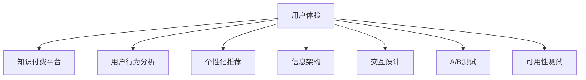

                 

# 知识付费产品的用户体验优化策略

## 1. 背景介绍

### 1.1 问题由来
随着互联网的普及和智能设备的普及，知识付费市场正在快速增长。用户在消费知识时，不仅希望获得优质的内容，也追求流畅、便捷、可靠的用户体验。然而，许多知识付费产品由于设计不当，用户体验不佳，难以满足用户需求，导致用户流失严重。

### 1.2 问题核心关键点
构建高质量的知识付费产品，需要综合考虑用户心理、产品设计、技术实现、市场反馈等多个因素。本文将从用户体验优化的角度出发，探讨如何通过技术手段提升知识付费产品的效果和价值，从而吸引更多用户，提高用户满意度和留存率。

### 1.3 问题研究意义
提升知识付费产品的用户体验，能够增强用户粘性，促进内容消费，为平台带来更多的变现机会。同时，良好的用户体验也能提升用户口碑，推动知识付费市场的健康发展。

## 2. 核心概念与联系

### 2.1 核心概念概述

为更好地理解用户体验优化策略，本节将介绍几个关键概念：

- 用户体验(User Experience, UX)：指用户使用产品时的心理和生理感受，是衡量产品是否满足用户需求的重要标准。

- 知识付费平台(Knowledge-Paying Platform)：指通过为用户提供有价值、系统性的知识和信息，获取订阅费或购买费用的商业模式。

- 用户行为分析(User Behavior Analysis, UBA)：通过数据分析、用户调研等手段，挖掘用户行为规律，指导产品改进和优化。

- 个性化推荐(Personalized Recommendation)：根据用户的历史行为和兴趣，为用户推荐合适的内容和活动，提升用户体验。

- 信息架构(Information Architecture, IA)：指将信息以合理的方式组织，帮助用户快速、准确地找到所需信息，优化信息传递效率。

- 交互设计(Interaction Design)：指设计用户与产品交互的界面和方式，确保操作流畅、易用，提升用户满意度。

- A/B测试(A/B Testing)：指同时设计两组不同的产品版本，分别投放给不同用户群体，对比分析两组数据以评估效果。

- 可用性测试(Usability Testing)：通过真实用户操作，发现和改进产品中存在的问题，提升用户操作便捷性。

这些概念之间的逻辑关系可以通过以下Mermaid流程图来展示：



这个流程图展示了几项用户体验优化策略及其相互关系：

1. 用户体验(UX)是知识付费产品的核心目标，覆盖从需求收集到内容呈现的整个过程。
2. 用户行为分析(UBA)、个性化推荐(Personalized Recommendation)、信息架构(IA)、交互设计(ID)、A/B测试、可用性测试(Usability Testing)等策略，都是围绕用户体验进行优化和改进的措施。
3. 这些策略相互交织，形成一个完整的用户体验优化闭环，每个环节的改进都能进一步提升用户体验。

## 3. 核心算法原理 & 具体操作步骤
### 3.1 算法原理概述

用户体验优化涉及用户行为数据建模、内容推荐算法、交互设计等多个方面。以下将详细介绍这些核心算法原理和操作步骤。

### 3.2 算法步骤详解

#### 3.2.1 用户行为数据建模

用户行为数据建模是优化用户体验的基础。需要收集用户在知识付费平台上的所有行为数据，包括浏览记录、购买历史、学习时长、评分评价等，进行数据清洗和预处理。然后，使用统计学方法对数据进行建模，如聚类分析、关联规则挖掘、时间序列分析等，挖掘用户行为模式和偏好。

#### 3.2.2 个性化推荐算法

个性化推荐算法旨在根据用户的行为数据和兴趣特征，为用户推荐合适的知识和内容。常用的推荐算法包括协同过滤、基于内容的推荐、混合推荐等。协同过滤算法根据用户历史行为，寻找相似用户进行推荐；基于内容的推荐算法则根据内容特征进行匹配；混合推荐算法则是结合两种或多种推荐方法，综合优化推荐效果。

#### 3.2.3 信息架构设计

信息架构设计是指合理组织知识付费平台的信息和内容，使用户能够快速找到所需信息。常见的方法包括分类标签、搜索功能、目录结构等。分类标签通过将内容分门别类，帮助用户定位；搜索功能通过关键字匹配，提高查询效率；目录结构则提供直观的导航路径，减少用户操作步骤。

#### 3.2.4 交互设计优化

交互设计优化旨在提升用户与产品的交互体验。常用的方法包括响应时间优化、界面设计、操作流程简化等。响应时间优化需要减少加载时间、优化服务器响应速度；界面设计需要简洁美观、符合用户习惯；操作流程简化则要尽量减少操作步骤、减少用户认知负担。

#### 3.2.5 A/B测试

A/B测试是一种常用的用户体验优化方法，通过对比测试两个版本的产品，判断哪个版本更优。测试内容可以包括页面布局、按钮位置、注册流程等，通过统计学方法分析用户行为数据，得出结论，指导后续产品改进。

#### 3.2.6 可用性测试

可用性测试是一种评估用户体验的方法，通过真实用户的操作，发现产品中存在的问题。测试内容可以包括页面导航、功能操作、错误提示等，通过收集用户反馈，改进产品设计，提升用户体验。

### 3.3 算法优缺点

用户体验优化算法具有以下优点：
1. 提升用户满意度：通过个性化推荐、信息架构优化等手段，能够提升用户对产品和内容的满意度。
2. 提高用户留存率：优化后的产品能够更好地满足用户需求，降低用户流失率。
3. 增加用户活跃度：通过高效的内容推荐和便捷的操作体验，用户更愿意花更多时间在产品上。
4. 提高平台收益：用户的长期停留和满意度提升，能够带来更多的订阅费、付费会员等收入。

同时，该方法也存在以下局限性：
1. 数据隐私问题：在用户行为数据建模时，需要收集用户数据，存在隐私泄露的风险。
2. 过度个性化：过度个性化的推荐可能导致用户陷入信息茧房，减少内容多样性。
3. 算法复杂度：个性化推荐算法、信息架构优化等方法，需要复杂的计算和数据处理，成本较高。
4. 用户交互体验的差异性：不同用户群体对产品有不同的需求，单一的优化策略难以覆盖所有用户。

尽管存在这些局限性，但就目前而言，用户体验优化方法仍是提升知识付费产品效果和价值的重要手段。未来相关研究的重点在于如何进一步降低成本、保护用户隐私、提高算法效率，同时兼顾用户体验的差异性和多样性。

### 3.4 算法应用领域

用户体验优化算法在知识付费产品中的应用非常广泛，涵盖了产品设计的各个方面。以下是几个具体的应用场景：

- 内容推荐系统：通过分析用户行为数据，为用户推荐感兴趣的内容，提高内容消费量。
- 搜索功能优化：提升搜索精度和效率，帮助用户快速找到所需信息。
- 界面设计改进：优化页面布局、按钮位置，提升用户的操作便捷性。
- 响应时间优化：提高服务端响应速度，减少用户等待时间。
- 个性化设置：根据用户偏好定制推荐内容和界面，提升用户体验。

除了上述这些场景外，用户体验优化还广泛应用于在线教育、电子商务、社交网络等多个领域，成为提升产品竞争力的关键手段。

## 4. 数学模型和公式 & 详细讲解  
### 4.1 数学模型构建

以下以个性化推荐算法为例，详细介绍其数学模型构建。

设知识付费平台上有 $M$ 个用户和 $N$ 个内容，用户对内容的评分矩阵为 $R$。需要设计一个推荐算法，最大化用户对内容的满意度。

定义推荐算法 $f$，其推荐结果为 $X$。目标是最小化预测评分与实际评分之间的均方误差：

$$
\min_{X} \frac{1}{MN} \sum_{i=1}^M \sum_{j=1}^N (X_{ij} - R_{ij})^2
$$

其中 $X_{ij}$ 表示用户 $i$ 对内容 $j$ 的推荐评分，$R_{ij}$ 表示用户 $i$ 对内容 $j$ 的实际评分。

假设 $f$ 为矩阵分解方法，可以将 $R$ 分解为 $P$ 和 $Q$ 的乘积：

$$
R = P \times Q
$$

其中 $P$ 为用户特征矩阵，$Q$ 为内容特征矩阵。推荐算法 $f$ 可以通过 $P$ 和 $Q$ 计算 $X$：

$$
X = P \times Q^T
$$

其中 $Q^T$ 为 $Q$ 的转置矩阵。

### 4.2 公式推导过程

在矩阵分解中，目标函数可以进一步分解为：

$$
\frac{1}{2MN} \sum_{i=1}^M \sum_{j=1}^N (P_{i}Q_{j} - R_{ij})^2
$$

其中 $P_i$ 表示用户 $i$ 的特征向量，$Q_j$ 表示内容 $j$ 的特征向量。目标函数进一步分解为：

$$
\min_{P,Q} \frac{1}{2MN} \sum_{i=1}^M \sum_{j=1}^N (P_{i}Q_{j} - R_{ij})^2
$$

可以将其表示为如下矩阵形式：

$$
\min_{P,Q} \frac{1}{2} \text{Tr}(P^T B^T B Q) - \frac{1}{2} \text{Tr}(P^T R Q)
$$

其中 $\text{Tr}$ 表示矩阵的迹，$B = R - P \times Q$ 表示残差矩阵。

通过求解上述优化问题，可以获取最优的 $P$ 和 $Q$，从而得到推荐算法 $f$ 的最优解。

### 4.3 案例分析与讲解

以用户 $i$ 对内容 $j$ 的评分预测为例，假设 $P_i$ 和 $Q_j$ 已经求得，则推荐评分 $X_{ij}$ 为：

$$
X_{ij} = P_{i}Q_{j}^T
$$

通过矩阵乘法计算，可以得到：

$$
X_{ij} = \sum_{k=1}^K P_{ik}Q_{kj}
$$

其中 $K$ 表示特征向量的维度。可以通过求取 $P_i$ 和 $Q_j$ 的内积，计算推荐评分 $X_{ij}$。

## 5. 项目实践：代码实例和详细解释说明
### 5.1 开发环境搭建

在进行用户体验优化实践前，我们需要准备好开发环境。以下是使用Python进行Flask开发的Web应用环境配置流程：

1. 安装Anaconda：从官网下载并安装Anaconda，用于创建独立的Python环境。

2. 创建并激活虚拟环境：
```bash
conda create -n flask-env python=3.8 
conda activate flask-env
```

3. 安装Flask：从官网下载并安装Flask，以及相关依赖库，如SQLAlchemy、WTForms、Jinja2等。

```bash
pip install Flask SQLAlchemy WTForms Jinja2
```

4. 安装Flask的RESTful扩展和Swagger扩展：
```bash
pip install flask-restful flask-swagger
```

5. 安装Flask-Login扩展：用于用户认证和授权。

```bash
pip install Flask-Login
```

完成上述步骤后，即可在`flask-env`环境中开始开发实践。

### 5.2 源代码详细实现

下面我们以个性化推荐系统的开发为例，给出使用Flask框架的代码实现。

首先，定义数据库模型和用户行为数据表：

```python
from flask_sqlalchemy import SQLAlchemy

db = SQLAlchemy(app)

class UserBehavior(db.Model):
    id = db.Column(db.Integer, primary_key=True)
    user_id = db.Column(db.String(100), nullable=False)
    content_id = db.Column(db.String(100), nullable=False)
    rating = db.Column(db.Float, nullable=False)
```

然后，定义推荐系统模型和推荐算法：

```python
class RecommendationSystem:
    def __init__(self, user_behaviors):
        self.user_behaviors = user_behaviors
        self.P = None
        self.Q = None
        self.build_model()

    def build_model(self):
        B = np.array([[rating - P.dot(Q.T) for rating, P, Q in user_behaviors])
        U, S, Vh = np.linalg.svd(B)
        self.P = U[:, :2] / np.sqrt(S[0])
        self.Q = Vh[:, :2] / np.sqrt(S[1])

    def recommend(self, user_id, content_ids):
        user_behaviors = self.user_behaviors.filter_by(user_id=user_id).all()
        P = self.P[user_behaviors.index(user_id)]
        Q = self.Q[:, user_behaviors.index(content_ids[0])]
        X = P @ Q.T
        return X.flatten().tolist()
```

最后，编写Flask应用程序，实现API接口和推荐功能：

```python
from flask import Flask, request, jsonify

app = Flask(__name__)

@app.route('/recommend', methods=['POST'])
def recommend():
    data = request.get_json()
    user_id = data['user_id']
    content_ids = data['content_ids']
    recommendations = RecommendationSystem(user_behaviors).recommend(user_id, content_ids)
    return jsonify(recommendations)

if __name__ == '__main__':
    app.run(debug=True)
```

以上就是使用Flask框架开发个性化推荐系统的完整代码实现。可以看到，通过Flask结合SQLAlchemy和NumPy等库，能够快速构建推荐系统模型和API接口，实现推荐功能。

### 5.3 代码解读与分析

让我们再详细解读一下关键代码的实现细节：

**UserBehavior类**：
- `__init__`方法：初始化用户行为数据表，包括用户ID、内容ID、评分等字段。
- `__len__`方法：返回用户行为数据的数量。
- `__getitem__`方法：根据用户ID或内容ID获取对应的用户行为数据。

**RecommendationSystem类**：
- `__init__`方法：初始化推荐系统，需要传入用户行为数据。
- `build_model`方法：通过SVD分解，求解用户特征矩阵和内容特征矩阵。
- `recommend`方法：根据用户ID和内容ID，计算推荐评分。

**Flask应用程序**：
- `/recommend`路由：接收用户ID和内容ID的JSON数据，调用推荐系统API返回推荐结果。
- `app.run(debug=True)`：启动Flask应用，并开启调试模式。

通过以上代码实现，可以看到，通过Flask框架结合Python的科学计算库，能够快速构建知识付费平台的推荐系统，实现个性化推荐功能。

## 6. 实际应用场景
### 6.1 智能学习助手

智能学习助手是一种结合知识付费与个性化推荐技术的应用，能够根据用户的学习习惯和知识水平，为其推荐合适的学习内容和练习题。智能学习助手可以通过机器学习算法，学习用户的知识水平和兴趣偏好，智能生成个性化的学习计划，并通过多轮对话系统，解答用户在学习过程中遇到的问题，提升学习效率。

### 6.2 智能健康管理

智能健康管理平台通过收集用户的健康数据和行为习惯，为用户推荐合适的健康知识、运动计划和饮食建议。平台可以分析用户的健康数据，生成个性化报告，并通过推荐系统为用户推荐合适的健康内容，提升用户的健康意识和生活质量。

### 6.3 智能金融理财

智能金融理财平台结合知识付费和个性化推荐技术，为用户推荐合适的理财知识和投资策略。平台可以分析用户的财务状况和投资偏好，推荐适合的内容，并通过动态调整，帮助用户制定最优的理财计划，实现财富增值。

### 6.4 未来应用展望

随着知识付费市场的发展，用户体验优化将不断向更深入的领域扩展，为用户带来更加丰富和便捷的体验。

在教育领域，未来的智能学习助手将具备更高的智能化水平，能够自适应调整学习计划，动态更新推荐内容，提升学习效果。

在医疗领域，智能健康管理平台将整合更多的数据，结合AI辅助诊断，提升健康管理的效果和准确性。

在金融领域，智能理财平台将深入分析用户财务数据，结合市场动态，为用户提供更加个性化和准确的投资建议。

此外，在更多垂直领域，知识付费产品将结合个性化推荐、智能问答、多模态融合等技术，为用户提供一站式的综合服务，满足其多样化的需求。

## 7. 工具和资源推荐
### 7.1 学习资源推荐

为了帮助开发者系统掌握用户体验优化技术，这里推荐一些优质的学习资源：

1. Udacity的UX设计课程：由Google和IBM联合推出，涵盖用户研究、信息架构、交互设计等多个方面的内容。

2. Coursera的《Human-Computer Interaction》课程：由斯坦福大学开设，深入讲解人机交互的基本原理和设计方法。

3. Smashing Magazine的UX设计指南：提供丰富的UX设计资源和案例分析，帮助开发者提高设计水平。

4. Nielsen Norman Group的用户研究报告：提供最新的用户体验研究趋势和实践方法，为产品设计提供理论支持。

5. UXDesign.cc的UX设计博客：提供最新的UX设计方法和案例分析，为开发者提供灵感和思路。

6. Google的Material Design规范：提供一套系统化的UI设计标准，帮助开发者设计出一致性、易用的界面。

通过学习这些资源，相信你一定能够快速掌握用户体验优化的精髓，并用于解决实际问题。

### 7.2 开发工具推荐

高效的开发离不开优秀的工具支持。以下是几款用于用户体验优化开发的常用工具：

1. Sketch：全球领先的UI/UX设计工具，支持快速原型设计和用户界面展示。

2. Adobe XD：业内领先的交互设计工具，支持设计、原型和测试的一体化设计。

3. Axure RP：一款强大的原型设计和用户测试工具，支持多平台应用开发。

4. InVision：一款强大的设计协作和反馈工具，支持在线原型展示和用户反馈收集。

5. Figma：一款基于云的设计工具，支持实时协作和设计共享，适合团队协同开发。

6. Balsamiq：一款快速原型设计工具，支持拖拽式设计，快速产出设计方案。

合理利用这些工具，可以显著提升用户体验优化的开发效率，加快创新迭代的步伐。

### 7.3 相关论文推荐

用户体验优化技术的发展源于学界的持续研究。以下是几篇奠基性的相关论文，推荐阅读：

1. "Human Factors in Computing Systems: Principles and Practice"：提供全面的用户体验设计理论和方法，是UX设计领域的经典教材。

2. "Designing with the Mind in Mind"：介绍设计心理学和用户体验设计的基本原则，帮助设计师理解用户的认知和行为。

3. "Interactive Prototyping with Paper"：介绍纸面原型设计的方法和工具，帮助设计师快速产出设计方案。

4. "Universal Principles of Design"：提供通用的设计原则和方法，帮助设计师设计出易用、易记、易懂的界面。

5. "The Design of Everyday Things"：介绍产品设计的心理学和设计原则，帮助设计师设计出用户友好的产品。

这些论文代表了大用户体验优化技术的发展脉络。通过学习这些前沿成果，可以帮助研究者把握学科前进方向，激发更多的创新灵感。

## 8. 总结：未来发展趋势与挑战
### 8.1 总结

本文对用户体验优化策略进行了全面系统的介绍。首先阐述了用户体验优化在知识付费产品中的重要性，明确了优化策略在提升产品效果和价值方面的独特价值。其次，从算法原理到具体操作步骤，详细讲解了用户体验优化的数学模型和操作步骤，给出了用户体验优化任务开发的完整代码实例。同时，本文还广泛探讨了用户体验优化在多个领域的应用前景，展示了用户体验优化范式的巨大潜力。

通过本文的系统梳理，可以看到，用户体验优化技术正在成为知识付费产品的重要范式，极大地拓展了知识付费产品的应用边界，催生了更多的落地场景。受益于科学的算法和技术手段，知识付费产品将能够更好地满足用户需求，提供更加丰富和便捷的服务。

### 8.2 未来发展趋势

展望未来，用户体验优化技术将呈现以下几个发展趋势：

1. 智能化水平提升：未来的用户体验优化算法将具备更高的智能化水平，能够自适应调整，动态更新推荐内容。

2. 多模态融合：未来的用户体验优化将更多地结合视觉、听觉、触觉等多模态信息，提升用户的沉浸感和体验质量。

3. 个性化推荐多样化：未来的个性化推荐算法将更加多样化，结合更多维度的用户数据，提供更加精准的推荐。

4. 用户体验闭环优化：未来的用户体验优化将更加注重用户全生命周期的体验，涵盖获取、使用、反馈等多个环节，形成一个完整的闭环优化体系。

5. 持续性优化：未来的用户体验优化将更加注重产品的持续性改进，定期收集用户反馈，动态调整和优化产品功能。

这些趋势将推动用户体验优化技术走向更高的阶段，为知识付费产品带来更加丰富和便捷的用户体验。

### 8.3 面临的挑战

尽管用户体验优化技术已经取得了瞩目成就，但在迈向更加智能化、普适化应用的过程中，它仍面临诸多挑战：

1. 数据隐私问题：在用户行为数据建模时，需要收集用户数据，存在隐私泄露的风险。如何保护用户隐私，避免数据滥用，仍需进一步探索。

2. 算法复杂度：个性化推荐算法、信息架构优化等方法，需要复杂的计算和数据处理，成本较高。如何降低算法复杂度，提高计算效率，仍需进一步研究。

3. 用户交互体验的差异性：不同用户群体对产品有不同的需求，单一的优化策略难以覆盖所有用户。如何设计更灵活、适应性更强的用户体验优化方案，仍需进一步探索。

4. 用户体验的平衡性：在提升用户体验的同时，如何平衡产品性能和成本，避免过度优化导致的用户体验下降，仍需进一步研究。

尽管存在这些挑战，但通过学界和产业界的共同努力，用户体验优化技术必将在未来不断进步，推动知识付费产品迈向更高的阶段。

### 8.4 研究展望

面对用户体验优化面临的种种挑战，未来的研究需要在以下几个方面寻求新的突破：

1. 探索新型的数据收集和处理技术：采用更加隐私保护的数据收集方式，如差分隐私、联邦学习等，保护用户隐私。同时探索高效的数据处理算法，降低算法复杂度。

2. 开发更加智能的推荐算法：引入更多机器学习和人工智能技术，提升个性化推荐算法的智能化水平，实现更精准、更个性化的推荐。

3. 设计更灵活的用户体验优化方案：通过多模态融合、智能问答等技术，提供更丰富、更灵活的用户体验。同时结合用户反馈和行为数据，动态调整和优化产品功能。

4. 引入伦理道德约束：在用户体验优化过程中，引入伦理道德约束，确保产品符合用户价值观和社会公德，避免有害内容的传播。

5. 持续关注用户体验研究的最新进展：关注人机交互、心理学等领域的最新研究成果，不断改进用户体验优化技术，提升用户体验的科学性和合理性。

这些研究方向的探索，必将引领用户体验优化技术迈向更高的台阶，为知识付费产品带来更加丰富和便捷的用户体验。

## 9. 附录：常见问题与解答

**Q1：用户体验优化的具体方法有哪些？**

A: 用户体验优化的具体方法包括用户行为数据建模、个性化推荐算法、信息架构设计、交互设计优化、A/B测试、可用性测试等。这些方法相互交织，形成一个完整的用户体验优化闭环，每个环节的改进都能进一步提升用户体验。

**Q2：用户体验优化过程中如何保护用户隐私？**

A: 用户体验优化过程中，可以通过差分隐私、联邦学习等技术，保护用户隐私。这些技术能够在数据收集和处理过程中，最大程度地保护用户数据的安全性和隐私性。

**Q3：如何评估用户体验优化策略的效果？**

A: 用户体验优化策略的效果评估可以通过用户满意度调查、用户留存率、用户活跃度等指标进行评估。通过对比优化前后的数据，可以判断优化策略是否有效。

**Q4：如何结合用户反馈进行用户体验优化？**

A: 结合用户反馈进行用户体验优化，可以通过定期收集用户反馈，分析用户痛点和需求，从而调整和优化产品功能。可以通过问卷调查、用户访谈、A/B测试等方式获取用户反馈。

**Q5：如何提高个性化推荐算法的准确性和效率？**

A: 提高个性化推荐算法的准确性和效率，可以通过引入更多数据源、优化推荐算法、引入机器学习和人工智能技术等手段。同时，可以通过数据压缩、模型剪枝等技术，降低算法的复杂度和计算成本。

通过以上问答，希望读者能够更全面地理解用户体验优化的相关问题和方法，为实际应用提供指导。

---

作者：禅与计算机程序设计艺术 / Zen and the Art of Computer Programming

