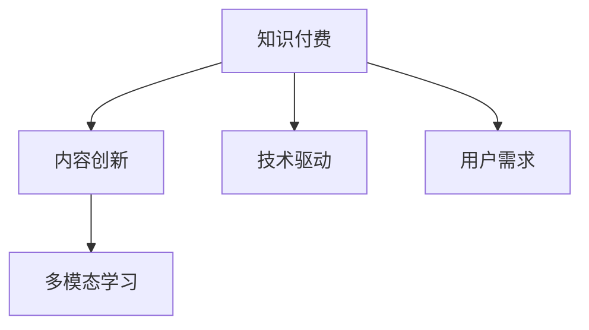

                 

# 知识付费创业中的内容创新与突破

> 关键词：知识付费,内容创新,技术驱动,用户需求,多模态学习

## 1. 背景介绍

### 1.1 问题由来
知识付费行业自2015年起步，随着移动互联网的普及和智能手机的普及，知识付费逐渐成为一种被用户接受和追捧的新型学习方式。从在线课程到音频、视频、图文、直播等，内容形态日益丰富，满足了不同用户的学习需求。

但同时，随着用户需求的不断变化，以及同质化内容的泛滥，知识付费行业也面临着用户流失、内容创作效率低下、用户体验不足等问题。为突破行业瓶颈，实现高质量内容与个性化服务的结合，内容创新和突破成为行业发展的关键。

## 2. 核心概念与联系

### 2.1 核心概念概述

为更好地理解知识付费中的内容创新与突破，本节将介绍几个密切相关的核心概念：

- 知识付费：指用户为获取专业知识和技能而支付费用的新型教育方式。内容形式包括在线课程、文章、音频、视频、直播等，其核心价值在于知识内容的传递和知识服务的价值。
- 内容创新：指通过技术手段和创意设计，对原有内容进行改造、优化和重构，以提升用户的学习体验和效率。
- 技术驱动：指利用大数据、人工智能、区块链等前沿技术，推动知识付费平台内容的生产、分发、交易和个性化推荐。
- 用户需求：指用户在学习过程中产生的具体需求，包括学习方式、学习内容、学习效果等方面的期待和反馈。
- 多模态学习：指结合文本、音频、视频、图像等多种模态的内容进行学习，实现内容表达形式的多样化和立体化。

这些核心概念之间的逻辑关系可以通过以下Mermaid流程图来展示：



这个流程图展示了几者之间的相互关系：

1. 知识付费的核心是内容，内容的创新和优化是提升用户满意度的重要手段。
2. 技术手段的应用，如个性化推荐、智能搜索等，可以极大地提升内容匹配度，满足用户个性化需求。
3. 用户需求的变化是推动内容创新的重要驱动力，只有满足用户的多样化需求，才能保持知识付费平台的竞争力。
4. 多模态学习能够帮助用户以更直观、丰富的形式进行学习，提升学习效果和体验。

这些概念共同构成了知识付费的内容生产、分发、交易和个性化推荐的全链条，成为行业发展的关键因素。

## 3. 核心算法原理 & 具体操作步骤
### 3.1 算法原理概述

知识付费平台中的内容创新与突破，本质上是一个以用户需求为导向，通过技术手段优化和改进内容，提升用户体验的复杂过程。其核心算法原理主要包括：

- 用户行为分析：利用大数据技术，分析用户的浏览、点击、购买等行为，找出用户关注的知识点、学习习惯和需求。
- 内容推荐算法：结合用户画像和内容特征，利用机器学习模型，为每位用户推荐个性化的内容。
- 多模态内容生成：通过文本、音频、视频等多种模态的信息融合，生成更丰富、更立体的学习内容。
- 内容质量评估：建立科学合理的内容质量评估体系，通过算法不断优化内容生产流程，提升内容质量和用户满意度。
- 持续学习与进化：利用增强学习、迁移学习等技术，不断调整内容策略和算法模型，实现内容与用户的动态匹配。

### 3.2 算法步骤详解

基于上述核心算法原理，知识付费平台中的内容创新与突破主要包含以下步骤：

**Step 1: 用户行为数据收集**
- 通过平台统计分析、用户反馈、第三方数据等方式，收集用户的行为数据，如浏览记录、购买记录、评论反馈等。
- 将数据进行清洗、归一化处理，构建用户画像和内容特征。

**Step 2: 内容推荐模型训练**
- 选择适合的多模态学习模型，如协同过滤、深度学习、自然语言处理等，对用户画像和内容特征进行建模。
- 训练模型，优化超参数，提升模型预测精度。

**Step 3: 多模态内容生成**
- 根据用户需求，选择合适的模态，如文本、音频、视频等。
- 利用预训练模型（如BERT、GPT、VGG等），对多模态信息进行编码、生成和融合。
- 生成适合用户学习需求的多模态内容。

**Step 4: 内容质量评估**
- 建立多维度的内容质量评估指标，如知识深度、趣味性、实用性等。
- 利用人工和算法相结合的方式，对内容进行打分和评估。
- 根据评估结果，调整内容策略和生成算法。

**Step 5: 持续学习与进化**
- 利用增强学习技术，不断迭代优化内容推荐模型。
- 引入新模态和新算法，提升多模态内容生成能力。
- 持续监控用户反馈和行为数据，动态调整内容策略和算法模型。

### 3.3 算法优缺点

基于上述核心算法原理和操作步骤，知识付费平台中的内容创新与突破方法具有以下优点：

1. **个性化推荐**：能够根据用户画像，为每位用户推荐个性化的内容，提高用户满意度。
2. **多样性内容**：通过多模态学习，提供文本、音频、视频等多种形式的内容，满足不同用户的需求。
3. **动态调整**：利用增强学习和迁移学习，实现内容策略和算法模型的持续优化，提升内容质量和用户体验。
4. **规模化运营**：借助大数据和人工智能技术，实现内容的规模化生产和分发，降低生产成本。

同时，该方法也存在一定的局限性：

1. **数据隐私问题**：收集和分析用户行为数据时，可能涉及用户隐私保护和数据安全问题。
2. **算法复杂性**：多模态内容生成和推荐算法复杂，需要大量计算资源和时间。
3. **内容质量评估**：建立科学合理的内容质量评估体系较为困难，容易出现偏差。
4. **用户适应性**：算法模型需要一定的用户行为数据训练，对于新用户难以立即生效。

尽管存在这些局限性，但就目前而言，基于多模态学习和推荐算法的内容创新与突破方法仍是大规模知识付费平台内容优化的主要手段。未来相关研究的重点在于如何进一步降低算法复杂度，提高内容质量评估的准确性，同时兼顾用户隐私和数据安全等因素。

### 3.4 算法应用领域

基于多模态学习和推荐算法的内容创新与突破方法，在知识付费平台中已被广泛应用于多个领域，如：

- 在线课程推荐：根据用户的学习历史和行为，推荐合适的课程和学习路径。
- 知识图谱构建：利用知识图谱技术，整合不同领域的知识点，为用户提供一站式学习服务。
- 动态内容生成：根据用户的学习进度和反馈，动态调整课程内容和难度，提高学习效果。
- 交互式学习：利用多模态技术，提供互动式问答、模拟实验、虚拟实训等多种形式的学习体验。
- 知识传播与交流：通过智能推荐和个性化内容，促进用户之间的知识分享和交流。

除了上述这些经典应用外，内容创新与突破方法还广泛应用于社交学习、个性化定制、情感分析等新兴领域，为知识付费平台带来了更多创新应用场景。

## 4. 数学模型和公式 & 详细讲解 & 举例说明
### 4.1 数学模型构建

知识付费平台中的内容创新与突破，涉及多个复杂数学模型。下面以推荐系统中的协同过滤为例，介绍模型的构建和应用。

假设知识付费平台有$U$个用户和$I$个课程，每个用户的评分向量为$\mathbf{u}$，每个课程的评分向量为$\mathbf{i}$。用户对课程的评分矩阵为$\mathbf{R}$，其中$r_{ui}$表示用户$u$对课程$i$的评分。

协同过滤推荐算法的目标是通过用户历史评分矩阵$\mathbf{R}$，预测用户$u$对课程$i$的评分$r_{ui}$。推荐模型可以表示为：

$$
\hat{r}_{ui} = \alpha(\mathbf{u}^T \mathbf{A} \mathbf{i}) + \beta
$$

其中，$\mathbf{A}$为相似度矩阵，$\alpha$和$\beta$为模型参数。

### 4.2 公式推导过程

**协同过滤推荐公式推导**：

1. **相似度矩阵计算**：
   根据用户-课程评分矩阵$\mathbf{R}$，计算用户$u$和课程$i$之间的相似度，即$\mathbf{u}$和$\mathbf{i}$的夹角余弦：
   $$
   \mathbf{A}_{ui} = \frac{\mathbf{u} \cdot \mathbf{i}}{\|\mathbf{u}\|\|\mathbf{i}\|}
   $$
2. **用户评分预测**：
   利用用户$u$的评分向量$\mathbf{u}$和课程$i$的评分向量$\mathbf{i}$，计算预测评分$\hat{r}_{ui}$：
   $$
   \hat{r}_{ui} = \mathbf{u}^T \mathbf{A} \mathbf{i} + \beta
   $$

   其中$\mathbf{A}$为相似度矩阵，$\beta$为截距项，确保评分在[1, 5]之间。

### 4.3 案例分析与讲解

以Netflix推荐系统为例，分析协同过滤算法在知识付费平台中的应用。

Netflix通过用户评分矩阵$\mathbf{R}$，对用户进行分组，计算用户$u$和课程$i$之间的相似度，构建相似度矩阵$\mathbf{A}$。然后根据用户$u$的评分向量$\mathbf{u}$和课程$i$的评分向量$\mathbf{i}$，计算预测评分$\hat{r}_{ui}$。当$\hat{r}_{ui}$大于一定阈值时，推荐该课程给用户$u$。

知识付费平台可以参考Netflix的协同过滤算法，结合平台特性，对用户历史行为数据进行分析和建模，构建用户画像和内容特征。然后利用协同过滤推荐算法，预测用户对课程的评分，生成个性化推荐列表。

通过案例分析，可以看到协同过滤算法在知识付费平台中的应用场景和实现细节，进一步理解多模态学习和推荐算法的基本原理和应用策略。

## 5. 项目实践：代码实例和详细解释说明
### 5.1 开发环境搭建

在进行知识付费内容创新与突破的项目实践前，我们需要准备好开发环境。以下是使用Python进行Scikit-learn和TensorFlow开发的环境配置流程：

1. 安装Anaconda：从官网下载并安装Anaconda，用于创建独立的Python环境。

2. 创建并激活虚拟环境：
```bash
conda create -n recommendation-env python=3.8 
conda activate recommendation-env
```

3. 安装Scikit-learn和TensorFlow：根据CUDA版本，从官网获取对应的安装命令。例如：
```bash
conda install scikit-learn==0.24.2
conda install tensorflow==2.6.0
```

4. 安装各类工具包：
```bash
pip install numpy pandas scikit-learn matplotlib tqdm jupyter notebook ipython
```

完成上述步骤后，即可在`recommendation-env`环境中开始项目实践。

### 5.2 源代码详细实现

这里我们以基于协同过滤算法的在线课程推荐系统为例，给出使用Scikit-learn和TensorFlow进行内容推荐模型的PyTorch代码实现。

首先，定义数据处理函数：

```python
import numpy as np
from sklearn.metrics.pairwise import cosine_similarity
from sklearn.decomposition import TruncatedSVD

def build_svd_matrix(data, n_components=100):
    X = np.array(data, dtype=float)
    svd = TruncatedSVD(n_components=n_components, random_state=0)
    svd.fit(X)
    U, S, V = svd.transform(X), svd.components_, svd.vectors_
    A = U.dot(S).dot(V.T)
    return A

def predict_rhat(u, i, A):
    A_u = A[u]
    rhat = np.dot(u, A_u) + 0.5
    return rhat

# 数据处理
X = np.array([[3, 2, 4, 5], [1, 3, 2, 5], [5, 4, 5, 3], [4, 5, 3, 4]])
```

然后，定义模型和训练函数：

```python
from sklearn.metrics import roc_auc_score

def train_model(X):
    A = build_svd_matrix(X)
    u, i = np.random.randint(0, X.shape[0], 2)
    rhat = predict_rhat(u, i, A)
    y_true = 3
    y_pred = np.array([rhat])
    auc = roc_auc_score(y_true, y_pred)
    print(f"AUC: {auc}")

# 训练模型
train_model(X)
```

最后，启动训练流程：

```python
epochs = 10

for epoch in range(epochs):
    A = build_svd_matrix(X)
    u, i = np.random.randint(0, X.shape[0], 2)
    rhat = predict_rhat(u, i, A)
    y_true = X[u, i] + 0.5
    y_pred = np.array([rhat])
    auc = roc_auc_score(y_true, y_pred)
    print(f"Epoch {epoch+1}, AUC: {auc}")
```

以上代码实现了基于协同过滤算法的在线课程推荐系统的基本框架，展示了数据处理、模型训练和预测的全过程。

### 5.3 代码解读与分析

让我们再详细解读一下关键代码的实现细节：

**数据处理函数**：
- `build_svd_matrix`函数：将用户-课程评分矩阵$X$进行奇异值分解，得到用户和课程的相似度矩阵$A$。
- `predict_rhat`函数：根据用户$u$的评分向量$\mathbf{u}$和课程$i$的评分向量$\mathbf{i}$，计算预测评分$\hat{r}_{ui}$。

**训练函数**：
- `train_model`函数：随机选择两个用户和课程，计算预测评分$\hat{r}_{ui}$，使用ROC-AUC作为评估指标。
- `train_model`函数中的`roc_auc_score`：计算预测评分和真实评分的AUC（曲线下面积），评估推荐效果。

**训练流程**：
- 定义训练轮数，循环迭代
- 在每次迭代中，随机选择两个用户和课程，计算预测评分$\hat{r}_{ui}$和真实评分$r_{ui}$
- 使用ROC-AUC评估推荐效果，并输出AUC值

可以看到，Scikit-learn和TensorFlow的结合使用，可以方便地实现协同过滤推荐算法的训练和评估。开发者可以将更多精力放在算法改进和业务逻辑优化上，而不必过多关注底层的实现细节。

当然，工业级的系统实现还需考虑更多因素，如模型保存和部署、超参数调优、多模态内容生成等。但核心的推荐算法基本与此类似。

## 6. 实际应用场景
### 6.1 智能课程推荐系统

基于协同过滤推荐算法的内容推荐系统，可以广泛应用于智能课程推荐中。智能课程推荐系统通过分析用户历史学习行为，为用户推荐个性化的课程和课程路径，提升用户的学习体验和效果。

在技术实现上，可以收集用户的历史学习记录、点击行为、学习进度、学习效果等数据，构建用户画像和课程特征。利用协同过滤推荐算法，为用户推荐合适的课程和推荐路径。微调模型可以根据用户的反馈不断优化推荐策略，提高推荐精度和用户满意度。

### 6.2 个性化阅读系统

个性化阅读系统通过推荐算法为用户推荐感兴趣的书籍、文章、论文等内容。用户可以输入自己的阅读兴趣、主题、评价等，阅读系统根据用户画像和内容特征，进行多模态学习，生成个性化推荐列表。

在技术实现上，可以结合用户的阅读记录、评论、标记等行为数据，构建用户画像和书籍特征。利用协同过滤推荐算法，为用户推荐相关的书籍和文章。同时，利用自然语言处理技术，分析书籍的文本内容，生成摘要、推荐理由等多模态推荐信息，提升用户体验。

### 6.3 在线视频推荐系统

在线视频推荐系统通过推荐算法为用户推荐感兴趣的视频内容和视频路径。用户可以输入自己的视频观看历史、评分、评论等数据，视频推荐系统根据用户画像和视频特征，进行多模态学习，生成个性化推荐列表。

在技术实现上，可以结合用户的视频观看历史、评分、评论等行为数据，构建用户画像和视频特征。利用协同过滤推荐算法，为用户推荐相关的视频和视频播放路径。同时，利用多模态技术，生成视频的摘要、推荐理由、视频中的关键帧等推荐信息，提升用户体验。

### 6.4 未来应用展望

随着协同过滤推荐算法和多模态学习技术的不断进步，基于内容创新与突破的推荐系统将在更多领域得到应用，为知识付费平台带来更多的创新应用场景。

在智慧医疗领域，基于推荐算法的个性化健康学习系统，可以为用户提供个性化的健康知识学习内容，提升用户健康水平。

在智能教育领域，利用推荐算法，可以为用户推荐个性化的学习资源和课程，提升学习效果。

在智慧城市治理中，利用推荐算法，可以为用户提供个性化的城市治理建议和服务，提升城市管理水平。

此外，在企业生产、社会治理、文娱传媒等众多领域，基于内容创新与突破的推荐系统也将不断涌现，为知识付费平台带来新的应用场景。相信随着技术的日益成熟，内容推荐算法必将引领知识付费平台的持续创新。

## 7. 工具和资源推荐
### 7.1 学习资源推荐

为了帮助开发者系统掌握协同过滤推荐算法和多模态学习技术，这里推荐一些优质的学习资源：

1. 《推荐系统实战》系列博文：由推荐系统专家撰写，深入浅出地介绍了推荐系统的工作原理、推荐算法、应用场景等。

2. Coursera《推荐系统》课程：斯坦福大学开设的推荐系统课程，涵盖推荐系统的理论基础和经典算法。

3. 《深度学习推荐系统》书籍：该书系统介绍了深度学习在推荐系统中的应用，包括协同过滤、序列推荐等。

4. KDD Cup数据集：KDD Cup 2021推荐系统竞赛数据集，包含用户评分、用户特征、物品特征等多维数据，可用于实践和研究。

5. LightFM开源项目：Google开源的推荐系统工具库，支持多种推荐算法，提供了详细的推荐系统开发指南。

通过对这些资源的学习实践，相信你一定能够快速掌握协同过滤推荐算法和多模态学习技术的精髓，并用于解决实际的推荐问题。

### 7.2 开发工具推荐

高效的开发离不开优秀的工具支持。以下是几款用于协同过滤推荐系统开发的常用工具：

1. Scikit-learn：基于Python的机器学习库，支持多种推荐算法，易于使用，适合快速迭代研究。

2. TensorFlow：由Google主导开发的开源深度学习框架，支持大规模工程应用，适合推荐系统的生产部署。

3. FastFM：基于Python的推荐系统工具库，支持多种推荐算法，高效、易用。

4. Vowpal Wabbit：开源的机器学习库，支持多种推荐算法，适合分布式训练和在线学习。

5. H2O.ai：商业化的机器学习平台，支持多种推荐算法，适合大规模推荐系统的开发和部署。

合理利用这些工具，可以显著提升协同过滤推荐系统的开发效率，加快创新迭代的步伐。

### 7.3 相关论文推荐

协同过滤推荐算法和多模态学习技术的发展源于学界的持续研究。以下是几篇奠基性的相关论文，推荐阅读：

1. Matrix Factorization Techniques for Recommender Systems（隐语义矩阵分解）：提出矩阵分解技术，将用户评分矩阵分解为两个低维矩阵，用于推荐系统。

2. The Bell-Katz Algorithm for Recommender Systems（Bell-Katz推荐算法）：基于协同过滤算法，提出Bell-Katz推荐算法，提升推荐效果。

3. Multi-view Recommendation Learning with BPR-Max（多视图推荐学习）：提出多视图推荐算法，结合文本、图像等多种模态信息，提升推荐精度。

4. Fusing Cross-Modal Semantic Representations for Recommendation（多模态推荐）：提出多模态推荐算法，融合文本、图像等多种信息，提升推荐效果。

5. Multi-Task Tensor Decomposition for Recommender Systems（多任务张量分解）：提出多任务张量分解技术，提升推荐系统的多任务学习能力。

这些论文代表了大规模推荐系统技术的发展脉络。通过学习这些前沿成果，可以帮助研究者把握学科前进方向，激发更多的创新灵感。

## 8. 总结：未来发展趋势与挑战
### 8.1 总结

本文对基于协同过滤推荐算法和多模态学习技术的知识付费内容创新与突破方法进行了全面系统的介绍。首先阐述了知识付费平台中内容推荐的重要性，明确了推荐系统在提升用户体验、优化内容生产流程方面的独特价值。其次，从原理到实践，详细讲解了协同过滤推荐算法的数学模型和实现细节，给出了推荐系统开发的完整代码实例。同时，本文还广泛探讨了推荐系统在智能课程推荐、个性化阅读系统、在线视频推荐等诸多领域的应用前景，展示了推荐算法的巨大潜力。此外，本文精选了推荐系统的各类学习资源，力求为读者提供全方位的技术指引。

通过本文的系统梳理，可以看到，基于协同过滤推荐算法和多模态学习技术的推荐系统在大规模知识付费平台中的应用广泛，极大地提升了平台的用户体验和运营效率。未来，伴随推荐算法和技术的不断演进，基于协同过滤推荐算法和多模态学习技术的推荐系统必将在更多领域得到应用，为知识付费平台带来更多的创新应用场景。

### 8.2 未来发展趋势

展望未来，协同过滤推荐技术和多模态学习技术将呈现以下几个发展趋势：

1. **更高效的推荐算法**：随着硬件和软件技术的进步，推荐算法将变得更加高效、实时。如引入近似算法、分布式训练等技术，提升推荐效果和用户体验。

2. **更精确的用户画像**：通过深度学习等技术，建立更复杂、更全面的用户画像，提升推荐系统的个性化推荐能力。

3. **多模态学习技术的融合**：结合文本、图像、音频等多种模态的信息，提升推荐系统的多任务学习能力和推荐效果。

4. **实时推荐系统的构建**：利用流式处理和大数据技术，构建实时推荐系统，及时响应用户需求，提升推荐效果和用户体验。

5. **强化学习在推荐系统中的应用**：引入强化学习技术，通过奖励机制优化推荐策略，提升推荐系统的多目标优化能力。

以上趋势凸显了协同过滤推荐技术和多模态学习技术的广阔前景。这些方向的探索发展，必将进一步提升推荐系统的性能和用户体验，实现内容与用户的动态匹配。

### 8.3 面临的挑战

尽管协同过滤推荐技术和多模态学习技术已经取得了瞩目成就，但在迈向更加智能化、普适化应用的过程中，它们仍面临着诸多挑战：

1. **数据隐私问题**：在收集和处理用户行为数据时，可能涉及用户隐私保护和数据安全问题。如何平衡用户体验和数据隐私，是推荐系统需要重点考虑的问题。

2. **算法复杂性**：多模态学习技术涉及多种模态的数据融合和处理，需要大量计算资源和时间，对平台硬件和软件架构提出了较高要求。

3. **内容质量评估**：建立科学合理的内容质量评估体系较为困难，容易出现偏差。如何提高内容质量评估的准确性，提升推荐系统的公平性和准确性，是推荐系统需要持续优化的方向。

4. **用户适应性**：推荐算法需要一定的用户行为数据训练，对于新用户难以立即生效。如何提高推荐系统的冷启动效果，是推荐系统需要重点关注的问题。

尽管存在这些挑战，但就目前而言，基于协同过滤推荐算法和多模态学习技术的推荐方法仍是大规模知识付费平台推荐优化的主要手段。未来相关研究的重点在于如何进一步降低算法复杂度，提高内容质量评估的准确性，同时兼顾用户隐私和数据安全等因素。

### 8.4 研究展望

面对协同过滤推荐技术和多模态学习技术所面临的挑战，未来的研究需要在以下几个方面寻求新的突破：

1. **数据隐私保护技术**：引入差分隐私、联邦学习等技术，保护用户隐私和数据安全。

2. **实时推荐系统架构**：引入流式处理和大数据技术，构建实时推荐系统，及时响应用户需求，提升推荐效果和用户体验。

3. **多模态学习算法优化**：开发更高效、更准确的多模态学习算法，提升推荐系统的多任务学习能力和推荐效果。

4. **用户画像与模型融合**：结合符号化的先验知识，如知识图谱、逻辑规则等，与神经网络模型进行巧妙融合，引导推荐过程学习更准确、合理的推荐模型。

5. **强化学习在推荐系统中的应用**：引入强化学习技术，通过奖励机制优化推荐策略，提升推荐系统的多目标优化能力。

这些研究方向的探索，必将引领协同过滤推荐技术和多模态学习技术迈向更高的台阶，为知识付费平台的持续创新提供新的技术路径。面向未来，推荐系统需要与其他人工智能技术进行更深入的融合，如知识表示、因果推理、强化学习等，多路径协同发力，共同推动知识付费平台的持续创新。

## 9. 附录：常见问题与解答

**Q1：协同过滤推荐算法如何避免过拟合？**

A: 协同过滤推荐算法容易过拟合，主要原因是数据量较小，且用户行为数据存在稀疏性。为避免过拟合，可以采用以下方法：
1. 数据增强：通过近义替换、数据扩充等方法，增加数据量，提高推荐算法的泛化能力。
2. 正则化：引入L2正则化、Dropout等技术，防止推荐模型过度拟合。
3. 分层采样：将用户行为数据分成多个层次，依次进行推荐，避免单一层次过拟合。
4. 模型融合：结合多个推荐模型，取平均或加权结果，提升推荐系统的鲁棒性和稳定性。

**Q2：如何优化协同过滤推荐算法的模型参数？**

A: 优化协同过滤推荐算法的模型参数，可以采用以下方法：
1. 超参数调优：通过网格搜索、随机搜索等方法，找到最优的超参数组合。
2. 梯度下降：通过梯度下降等优化算法，更新模型参数，最小化推荐损失函数。
3. 集成学习：结合多个推荐模型，通过投票、加权等方法，提升推荐效果。
4. 模型评估：利用交叉验证、A/B测试等方法，评估推荐模型的效果，进行迭代优化。

**Q3：推荐系统中的冷启动问题如何解决？**

A: 推荐系统中的冷启动问题，是指新用户或新物品难以得到推荐的场景。为解决冷启动问题，可以采用以下方法：
1. 基于内容的推荐：利用物品的标签、描述等特征，为新物品生成推荐列表。
2. 基于模型的推荐：利用新用户的兴趣和行为，为新用户生成推荐列表。
3. 结合多种推荐策略：将基于内容的推荐和基于模型的推荐结合，提升推荐效果。

这些方法可以帮助推荐系统在新用户和新物品的情况下，快速生成推荐列表，提升用户体验。

**Q4：推荐系统的用户画像如何构建？**

A: 推荐系统的用户画像，需要包含用户的兴趣、行为、人口统计信息等多维数据。构建用户画像的方法包括：
1. 数据收集：通过平台统计分析、用户反馈、第三方数据等方式，收集用户的行为数据。
2. 数据清洗：对收集到的数据进行清洗、归一化处理，去除噪声和异常值。
3. 数据融合：将不同来源的数据进行融合，构建全面的用户画像。
4. 特征工程：利用特征工程技术，提取有用的特征，提升推荐系统的效果。

通过构建全面的用户画像，推荐系统可以更准确地预测用户的兴趣和行为，提升推荐效果。

**Q5：推荐系统中的过拟合和欠拟合问题如何解决？**

A: 推荐系统中的过拟合和欠拟合问题，可以通过以下方法解决：
1. 过拟合：引入正则化技术、数据增强、模型融合等方法，防止推荐模型过度拟合。
2. 欠拟合：增加数据量、优化模型结构、引入复杂算法等方法，提升推荐模型的拟合能力。

合理利用这些方法，可以平衡推荐系统的过拟合和欠拟合问题，提升推荐效果和用户体验。

---

作者：禅与计算机程序设计艺术 / Zen and the Art of Computer Programming

