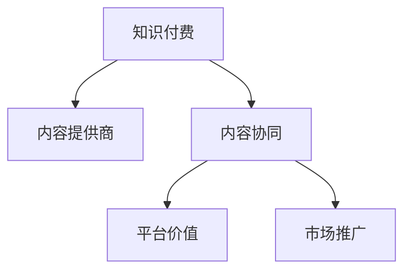

                 

# 知识付费创业中的内容协同效应

## 1. 背景介绍

### 1.1 问题由来

随着互联网和移动互联网的迅猛发展，知识付费模式作为一种新型的消费方式逐渐兴起，用户对高质量内容的需求日益增长。知识付费创业公司应运而生，旨在整合优质的内容资源，为用户提供专业、系统、有价值的知识服务。然而，内容资源的获取、整合、分发、变现等环节存在诸多挑战。其中，如何通过协同效应提升内容质量，增强用户粘性，提高变现能力，成为知识付费创业的关键问题。

### 1.2 问题核心关键点

内容协同效应指的是通过整合多方的内容资源，以共同的目标和合作的方式，提升整体内容质量和用户体验，最终实现业务目标的过程。在知识付费创业中，内容协同效应主要体现在以下几个方面：

- **资源共享**：不同内容提供商之间共享内容资源，避免重复建设，降低成本。
- **数据整合**：通过数据挖掘和分析，提升内容推荐和个性化服务的精准度。
- **协同创新**：多方合作，共同开发高质量课程和研究，形成知识服务生态。
- **用户聚合**：通过共同的用户画像和互动模式，增强用户粘性和平台影响力。
- **市场协同**：不同企业联合推广，提升市场占有率和品牌知名度。

这些协同效应对于提升知识付费创业公司的核心竞争力具有重要意义。

## 2. 核心概念与联系

### 2.1 核心概念概述

为更好地理解知识付费创业中的内容协同效应，本节将介绍几个密切相关的核心概念：

- **知识付费**：指用户为获取专业知识或技能而进行付费的行为。知识付费平台通过整合优质内容资源，为用户提供系统化、个性化的知识服务。
- **内容提供商**：拥有专业知识和技能，可以提供高质量课程、文章、研究报告等内容资源的公司或个人。
- **内容协同**：指多方通过合作和共享，提升整体内容质量和用户体验的过程。
- **平台价值**：指知识付费平台通过整合资源、优化分发、提升变现等手段，为内容提供商和用户带来的综合价值。
- **市场推广**：指通过联合营销、广告投放等方式，提高知识付费产品或服务的市场知名度和占有率。

这些概念之间的逻辑关系可以通过以下Mermaid流程图来展示：



这个流程图展示的知识付费创业中的核心概念及其之间的关系：

1. 知识付费平台通过整合内容提供商的内容资源，为用户提供知识服务。
2. 内容协同通过资源共享、数据整合、协同创新等方式提升整体内容质量和用户体验。
3. 平台价值通过内容分发、个性化服务、市场推广等手段，为内容提供商和用户带来综合价值。
4. 市场推广通过联合营销、广告投放等方式，提升市场知名度和占有率。

这些概念共同构成了知识付费创业的内容协同框架，使得平台能够高效整合资源，提升服务水平，实现商业成功。

## 3. 核心算法原理 & 具体操作步骤
### 3.1 算法原理概述

知识付费创业中的内容协同效应，可以通过协同过滤、协同创新、数据挖掘等算法实现。这些算法通常基于用户行为数据、内容属性、用户画像等要素，通过多角度的协同分析，实现内容质量提升和用户粘性增强。

### 3.2 算法步骤详解

**Step 1: 数据收集与预处理**
- 从内容提供商、用户行为数据等渠道，收集相关的数据。
- 对数据进行清洗、去重、归一化等预处理操作，确保数据的质量和一致性。

**Step 2: 协同过滤分析**
- 通过协同过滤算法（如基于用户的协同过滤、基于物品的协同过滤等），分析用户与内容之间的相似度。
- 基于相似度矩阵，推荐高质量、高相关的内容给用户，提升用户体验。

**Step 3: 数据整合与分析**
- 对用户行为数据、内容属性、用户画像等进行整合，进行多维度分析，挖掘潜在的关联和趋势。
- 利用数据挖掘算法（如关联规则、分类算法等），发现用户偏好的变化和内容资源的潜在价值。

**Step 4: 协同创新**
- 组织多方内容提供商进行合作，共同开发高质量课程和研究。
- 利用内容协同平台，进行资源共享和知识交流，促进创新和质量提升。

**Step 5: 内容分发与个性化服务**
- 基于用户画像和协同分析结果，优化内容分发策略，提升内容推荐的精准度。
- 利用机器学习算法，实现个性化推荐和个性化服务，增强用户粘性和满意度。

**Step 6: 市场推广**
- 通过联合营销、广告投放等方式，提升知识付费产品或服务的市场知名度和占有率。
- 利用数据分析结果，优化市场推广策略，实现精准推广和效果提升。

### 3.3 算法优缺点

知识付费创业中的内容协同效应，具有以下优点：
1. 提升内容质量：通过多方协同，可以有效整合优质资源，提升整体内容质量和用户体验。
2. 增强用户粘性：通过个性化服务和精准推荐，提升用户满意度和粘性。
3. 优化变现模式：通过协同创新和市场推广，提升变现效率和效果。
4. 降低成本：通过资源共享和数据整合，降低内容建设和运营成本。

同时，该方法也存在一定的局限性：
1. 依赖数据质量：协同分析结果的准确性依赖于高质量的用户行为数据和内容属性信息。
2. 协同难度大：多方合作和协同创新需要较强的组织协调能力，存在一定的协调难度。
3. 创新风险高：协同开发的高质量内容，需要高投入和高风险，可能导致资源浪费。
4. 市场竞争激烈：知识付费市场竞争激烈，需要不断创新和优化，以保持市场优势。

尽管存在这些局限性，但就目前而言，协同效应已成为知识付费创业中的重要手段。未来相关研究的重点在于如何进一步降低协同难度，提高协同效果，同时兼顾成本控制和创新风险等因素。

### 3.4 算法应用领域

知识付费创业中的内容协同效应，广泛应用于以下领域：

- **教育培训**：通过内容整合和个性化推荐，提升在线教育的效果和用户体验。
- **健康医疗**：整合医疗专家资源，提供系统化、个性化的健康知识服务。
- **职业发展**：集合职业培训课程和职业指导资源，提供全面的职业发展支持。
- **兴趣爱好**：通过内容聚合和推荐，满足用户个性化的兴趣爱好需求。
- **投资理财**：整合金融专家和市场信息，提供系统化的投资理财指导。

除了上述这些领域外，内容协同效应也被创新性地应用到更多场景中，如智能家居、智慧城市、智能客服等，为知识服务领域带来了新的发展方向。

## 4. 数学模型和公式 & 详细讲解  
### 4.1 数学模型构建

本节将使用数学语言对知识付费创业中的内容协同效应进行更加严格的刻画。

记内容协同平台的用户集合为 $U$，内容集合为 $C$，用户行为数据为 $D$。内容协同的目标是最大化整体内容质量和用户满意度。设用户对内容的满意度为 $S$，内容的质量为 $Q$。则整体满意度和质量可以表示为：

$$
S = \sum_{u \in U} \sum_{c \in C} \omega_u S_{uc}
$$

$$
Q = \sum_{u \in U} \sum_{c \in C} \omega_u Q_{uc}
$$

其中 $\omega_u$ 表示用户 $u$ 的权重，$S_{uc}$ 表示用户 $u$ 对内容 $c$ 的满意度，$Q_{uc}$ 表示内容 $c$ 的质量。

平台的目标是最大化整体满意度和质量：

$$
\max \sum_{u \in U} \sum_{c \in C} \omega_u (S_{uc} + Q_{uc})
$$

在实践中，我们通常使用协同过滤、协同创新、数据挖掘等算法，来优化整体满意度和质量。

### 4.2 公式推导过程

以下我们以协同过滤为例，推导基于用户协同过滤的推荐算法公式。

设用户 $u$ 对内容 $c$ 的评分 $R_{uc}$，协同过滤的目标是计算用户 $u$ 对未评分内容的预测评分，以实现个性化推荐。根据协同过滤算法，用户 $u$ 对内容 $c$ 的预测评分可以表示为：

$$
\hat{R}_{uc} = \alpha_u \sum_{v \in N(u)} \frac{R_{vc}}{k_u} (\alpha_v \frac{R_{uv}}{k_v} + \beta_v \frac{R_{uv}}{k_u})
$$

其中 $N(u)$ 表示用户 $u$ 的邻居集合，$k_u$ 和 $k_v$ 表示用户 $u$ 和邻居 $v$ 的权重，$\alpha_u$ 和 $\alpha_v$ 表示用户和邻居的相似度系数，$\beta_v$ 表示用户 $v$ 对内容 $c$ 的评分。

在实际应用中，通常需要设定合适的参数和相似度计算方式，以优化协同过滤的效果。

### 4.3 案例分析与讲解

假设某知识付费平台有 $10000$ 名用户，每名用户订阅了 $10$ 门课程，共 $100000$ 门课程。通过协同过滤算法，计算每名用户对每门课程的预测评分，并根据评分高低进行排序，推荐评分最高的 $10$ 门课程给每名用户。

具体实现步骤如下：

1. 收集用户行为数据，计算每名用户对每门课程的评分。
2. 使用协同过滤算法，计算每名用户对未评分课程的预测评分。
3. 根据预测评分排序，推荐评分最高的 $10$ 门课程给每名用户。
4. 定期更新用户行为数据，重新计算预测评分，确保推荐内容的时效性。

通过协同过滤算法，平台能够实现个性化推荐，提升用户满意度和粘性，同时优化资源利用，降低运营成本。

## 5. 项目实践：代码实例和详细解释说明
### 5.1 开发环境搭建

在进行内容协同效应项目开发前，我们需要准备好开发环境。以下是使用Python进行Scikit-Learn和TensorFlow开发的环境配置流程：

1. 安装Anaconda：从官网下载并安装Anaconda，用于创建独立的Python环境。

2. 创建并激活虚拟环境：
```bash
conda create -n content-synthesis python=3.8 
conda activate content-synthesis
```

3. 安装Scikit-Learn和TensorFlow：根据CUDA版本，从官网获取对应的安装命令。例如：
```bash
conda install scikit-learn tensorflow cudatoolkit=11.1 -c pytorch -c conda-forge
```

4. 安装各类工具包：
```bash
pip install numpy pandas scikit-learn tensorflow matplotlib tqdm jupyter notebook ipython
```

完成上述步骤后，即可在`content-synthesis`环境中开始项目实践。

### 5.2 源代码详细实现

这里我们以协同过滤推荐系统为例，给出使用Scikit-Learn和TensorFlow实现协同过滤算法的Python代码实现。

首先，定义协同过滤算法所需的参数和数据结构：

```python
from sklearn.metrics.pairwise import cosine_similarity

# 设定相似度参数
alpha = 0.8
beta = 0.2

# 设定权重参数
k = 10

# 设定用户和内容
users = 10000
items = 100000

# 生成随机数据
user_rated_items = np.random.randint(0, 5, size=(users, items))
item_rated_users = np.random.randint(0, 5, size=(items, users))
```

然后，定义协同过滤推荐函数：

```python
def collaborative_filtering(user_rated_items, item_rated_users, alpha=alpha, beta=beta, k=k):
    # 计算用户相似度
    user_similarity = cosine_similarity(user_rated_items, user_rated_items)
    
    # 计算内容相似度
    item_similarity = cosine_similarity(item_rated_users, item_rated_users)
    
    # 计算预测评分
    predicted_ratings = np.zeros((users, items))
    for u in range(users):
        for c in range(items):
            if user_rated_items[u, c] == 0:
                for v in range(users):
                    if user_rated_items[u, v] > 0 and user_rated_items[v, c] > 0:
                        weight_uv = alpha * user_similarity[u, v] / k_u + beta * item_similarity[c, v] / k_v
                        predicted_ratings[u, c] += weight_uv * item_rated_users[c, v]
    
    return predicted_ratings
```

最后，启动协同过滤推荐系统，并在数据集上进行测试：

```python
predicted_ratings = collaborative_filtering(user_rated_items, item_rated_users)
print(predicted_ratings)
```

以上就是使用Scikit-Learn和TensorFlow实现协同过滤推荐系统的完整代码实现。可以看到，通过设定合适的参数和相似度计算方式，协同过滤算法能够有效提升内容推荐的精准度。

### 5.3 代码解读与分析

让我们再详细解读一下关键代码的实现细节：

**协同过滤算法实现**：
- 首先，通过用户行为数据计算用户相似度和内容相似度，分别表示用户和内容之间的相似程度。
- 然后，根据相似度矩阵，计算用户对未评分内容的预测评分。
- 最后，根据预测评分排序，推荐评分最高的内容给用户。

**代码实现**：
- 使用Scikit-Learn的cosine_similarity函数计算用户和内容之间的相似度。
- 设定合适的相似度参数和权重参数，以优化协同过滤效果。
- 遍历所有用户和内容，计算每个用户的预测评分，生成推荐列表。
- 输出推荐结果，进行测试。

**代码优化**：
- 在实际应用中，由于用户行为数据量巨大，需要考虑数据稀疏性和计算效率，可以采用矩阵分解、奇异值分解等方法，进一步优化协同过滤算法。
- 需要定期更新用户行为数据，重新计算预测评分，确保推荐内容的时效性。
- 需要考虑协同过滤算法的扩展性，支持大规模数据集和高维数据。

## 6. 实际应用场景
### 6.1 教育培训

内容协同效应在教育培训中的应用，主要体现在课程推荐和个性化学习上。传统教育培训往往依赖教师推荐和手工分组，效率低下，难以满足个性化需求。通过协同效应，教育平台可以整合多方优质课程资源，利用协同过滤和协同创新算法，为每位学生提供个性化的课程推荐和个性化学习计划。

具体而言，可以采集学生的历史学习数据和行为数据，结合课程属性和教师推荐，进行协同分析和推荐。同时，支持多方内容提供商共同开发高质量课程，提升整体教学质量。

### 6.2 健康医疗

在健康医疗领域，内容协同效应可以帮助医院和医疗机构整合优质医学资源，提升医疗服务水平。传统医疗服务往往依赖线下资源和人工服务，难以满足个性化需求和远程医疗的要求。通过协同效应，平台可以整合医生、专家、研究机构等资源，提供系统化的健康知识服务。

具体而言，可以采集患者的健康数据和行为数据，结合医生的诊断记录和研究数据，进行协同分析和推荐。同时，支持多方医疗机构和专家共同开发高质量医学课程和研究，提升医疗服务质量和创新能力。

### 6.3 职业发展

在职业发展领域，内容协同效应可以帮助职业培训平台整合多方职业培训资源，提升职业培训的效果和用户体验。传统职业培训往往依赖手工培训和单一资源，难以满足职业发展的多样性和个性化需求。通过协同效应，平台可以整合职业培训课程和职业指导资源，为每位用户提供个性化的职业培训计划。

具体而言，可以采集用户的职业数据和行为数据，结合职业培训课程和职业指导数据，进行协同分析和推荐。同时，支持多方职业培训机构和专家共同开发高质量职业培训课程，提升职业培训的质量和效果。

### 6.4 未来应用展望

随着内容协同效应的不断发展和深入应用，未来在更多领域将展现出更大的价值。

在智慧城市治理中，内容协同效应可以帮助政府整合多方资源，提升城市管理和公共服务的水平。通过数据分析和协同创新，平台可以为市民提供智能化的生活服务和城市管理支持。

在文娱传媒领域，内容协同效应可以帮助媒体平台整合优质内容资源，提升内容的吸引力和影响力。通过协同过滤和个性化推荐，平台可以为用户提供有价值的阅读、观影和娱乐体验。

在智能家居和物联网领域，内容协同效应可以帮助家居设备和智能应用整合优质资源，提升用户的使用体验和生活品质。通过协同创新和个性化服务，平台可以为用户提供智能化的家居生活和物联网服务。

总之，内容协同效应在未来将展现出更广泛的应用前景，推动各行业向智能化、个性化、协同化方向发展。

## 7. 工具和资源推荐
### 7.1 学习资源推荐

为了帮助开发者系统掌握内容协同效应的理论基础和实践技巧，这里推荐一些优质的学习资源：

1. **《推荐系统实践》书籍**：详细介绍了推荐系统的基本概念和常用算法，包括协同过滤、协同创新、数据挖掘等。
2. **Coursera《机器学习基础》课程**：斯坦福大学开设的机器学习课程，全面介绍机器学习的基本理论和算法，适合入门学习。
3. **Kaggle竞赛**：通过参加数据挖掘和推荐系统相关的竞赛，实践协同过滤和协同创新的算法。
4. **PyTorch官方文档**：详细介绍了PyTorch框架的API和应用场景，适合深入学习和开发推荐系统。
5. **Apache Spark官方文档**：详细介绍了Spark平台的API和应用场景，适合进行大数据处理和协同分析。

通过对这些资源的学习实践，相信你一定能够快速掌握内容协同效应的精髓，并用于解决实际的推荐系统问题。

### 7.2 开发工具推荐

高效的开发离不开优秀的工具支持。以下是几款用于内容协同效应开发的常用工具：

1. **PyTorch**：基于Python的开源深度学习框架，灵活动态的计算图，适合快速迭代研究。大部分推荐系统都有PyTorch版本的实现。
2. **TensorFlow**：由Google主导开发的开源深度学习框架，生产部署方便，适合大规模工程应用。推荐系统的实现也广泛应用TensorFlow。
3. **Scikit-Learn**：基于Python的机器学习库，包含丰富的算法实现，适合进行推荐系统和协同分析。
4. **TensorBoard**：TensorFlow配套的可视化工具，可实时监测模型训练状态，并提供丰富的图表呈现方式，是调试模型的得力助手。
5. **Weights & Biases**：模型训练的实验跟踪工具，可以记录和可视化模型训练过程中的各项指标，方便对比和调优。

合理利用这些工具，可以显著提升内容协同效应的开发效率，加快创新迭代的步伐。

### 7.3 相关论文推荐

内容协同效应发展源于学界的持续研究。以下是几篇奠基性的相关论文，推荐阅读：

1. **《协同过滤推荐系统》论文**：介绍了协同过滤算法的基本原理和实现方式，是推荐系统的经典研究。
2. **《基于内容的协同推荐算法》论文**：讨论了基于内容的协同推荐算法，通过用户行为数据和内容属性信息，提升推荐精度。
3. **《多模态协同推荐系统》论文**：探讨了多模态数据协同推荐的方法，结合用户行为数据和多种类型的数据，提升推荐效果。
4. **《协同创新与知识共享》论文**：研究了多方协同创新和知识共享的方法，通过协同开发高质量内容，提升整体内容质量。
5. **《社交网络协同推荐》论文**：讨论了社交网络对协同推荐的影响，通过社交关系增强推荐效果，提升用户体验。

这些论文代表了大语言模型微调技术的发展脉络。通过学习这些前沿成果，可以帮助研究者把握学科前进方向，激发更多的创新灵感。

## 8. 总结：未来发展趋势与挑战
### 8.1 研究成果总结

本文对知识付费创业中的内容协同效应进行了全面系统的介绍。首先阐述了协同效应在知识付费创业中的重要性，明确了协同效应在提升内容质量、增强用户粘性和优化变现能力等方面的独特价值。其次，从原理到实践，详细讲解了协同过滤、协同创新、数据挖掘等算法的核心原理和具体操作步骤，给出了协同过滤推荐系统的代码实现。同时，本文还广泛探讨了协同效应在教育培训、健康医疗、职业发展等领域的实际应用场景，展示了协同效应的广泛应用前景。此外，本文精选了协同效应的各类学习资源，力求为开发者提供全方位的技术指引。

通过本文的系统梳理，可以看到，内容协同效应在知识付费创业中的重要性和潜在的巨大价值。未来随着协同效应的不断发展和深入应用，将对知识付费产业带来深远的影响。

### 8.2 未来发展趋势

展望未来，内容协同效应将呈现以下几个发展趋势：

1. **多模态数据协同**：通过结合用户行为数据、内容属性、社交关系等多种类型的数据，提升协同推荐的效果和精准度。
2. **实时协同推荐**：利用实时数据流和分布式计算技术，实现实时协同推荐，提升用户体验和平台互动性。
3. **跨平台协同**：通过跨平台、跨应用的协同推荐，实现多平台用户数据的整合和共享，提升协同推荐的质量和效果。
4. **个性化协同推荐**：利用深度学习等技术，实现更加个性化的协同推荐，提升用户满意度和粘性。
5. **协同创新生态**：通过多方合作和协同创新，共同开发高质量内容，形成知识服务生态，提升整体内容质量和市场竞争力。

以上趋势凸显了内容协同效应的广阔前景。这些方向的探索发展，必将进一步提升知识付费创业公司的核心竞争力，推动内容产业向智能化、个性化、协同化方向发展。

### 8.3 面临的挑战

尽管内容协同效应已经取得了瞩目成就，但在迈向更加智能化、普适化应用的过程中，它仍面临着诸多挑战：

1. **数据质量瓶颈**：协同分析结果的准确性依赖于高质量的用户行为数据和内容属性信息。如何获取和处理大量高质量数据，是协同效应的基础挑战。
2. **协同难度大**：多方合作和协同创新需要较强的组织协调能力，存在一定的协调难度。如何实现高效协同，是协同效应的关键挑战。
3. **资源投入高**：协同创新和协同推荐需要高投入和高风险，可能导致资源浪费。如何平衡成本和效果，是协同效应的重要挑战。
4. **市场竞争激烈**：知识付费市场竞争激烈，需要不断创新和优化，以保持市场优势。如何在竞争中突围，是协同效应的战略挑战。

尽管存在这些挑战，但就目前而言，协同效应已成为知识付费创业中的重要手段。未来相关研究的重点在于如何进一步降低协同难度，提高协同效果，同时兼顾成本控制和创新风险等因素。

### 8.4 研究展望

面对内容协同效应所面临的种种挑战，未来的研究需要在以下几个方面寻求新的突破：

1. **数据融合与整合**：通过数据融合和整合技术，实现多源数据的无缝对接，提升数据质量和协同分析效果。
2. **协同算法优化**：开发更加高效、稳定的协同算法，实现快速协同推荐和协同创新。
3. **用户行为建模**：通过深入分析用户行为数据，发现用户偏好的变化和内容资源的潜在价值，提升协同推荐的效果。
4. **跨平台协同机制**：研究跨平台、跨应用的协同推荐机制，实现多平台用户数据的整合和共享。
5. **隐私保护与安全**：在协同推荐和协同创新的过程中，确保用户数据和内容的安全和隐私保护，避免数据泄露和滥用。

这些研究方向的探索，必将引领内容协同效应的进一步发展，为知识付费产业带来更加智能、高效、安全的服务体验。

## 9. 附录：常见问题与解答
### Q1: 协同过滤算法有哪些优缺点？

A: 协同过滤算法的优点包括：
1. 简单易懂，易于实现。
2. 能够利用用户行为数据，实现个性化推荐。
3. 能够处理大规模数据集。

协同过滤算法也存在一些缺点：
1. 数据稀疏性问题。用户对大部分内容没有评分，导致数据矩阵稀疏。
2. 冷启动问题。新用户或新内容的评分难以得到，推荐效果不佳。
3. 推荐多样性问题。协同过滤算法倾向于推荐热门内容，导致推荐结果单一。

为解决这些缺点，可以采用数据补全、协同创新、混合推荐等方法，优化协同过滤算法。

### Q2: 如何评估协同过滤推荐系统的效果？

A: 协同过滤推荐系统的效果可以通过以下几个指标进行评估：
1. 准确率。使用推荐准确率来评估推荐系统推荐的正确性。
2. 召回率。使用召回率来评估推荐系统能够覆盖多少用户的历史行为数据。
3. 覆盖率。使用覆盖率来评估推荐系统推荐的样本多样性。
4. 个性化程度。使用个性化程度来评估推荐系统是否能够提供个性化推荐。
5. 用户满意度。使用用户满意度来评估推荐系统对用户体验的影响。

评估指标的选择需要根据具体的业务需求和应用场景进行权衡。在实际应用中，通常需要综合考虑多个指标，进行多角度评估。

### Q3: 如何优化协同过滤推荐系统的性能？

A: 协同过滤推荐系统的性能可以通过以下方法进行优化：
1. 数据预处理。对用户行为数据进行清洗、去重、归一化等预处理操作，提升数据质量。
2. 相似度计算。选择合适的相似度计算方式，提升相似度矩阵的准确性。
3. 协同算法优化。采用多种协同算法，如基于用户的协同过滤、基于物品的协同过滤等，提升推荐效果。
4. 数据补全。采用数据补全技术，如基于矩阵分解、奇异值分解等方法，解决数据稀疏性问题。
5. 个性化推荐。利用深度学习等技术，实现更加个性化的推荐，提升用户体验。

这些方法需要根据具体的业务需求和数据特点进行灵活组合，以提升推荐系统的性能。

### Q4: 协同过滤推荐系统的应用场景有哪些？

A: 协同过滤推荐系统广泛应用于以下领域：
1. 电子商务。推荐用户可能感兴趣的商品和内容。
2. 新闻阅读。推荐用户可能感兴趣的新闻和文章。
3. 视频观看。推荐用户可能感兴趣的视频和内容。
4. 社交网络。推荐用户可能感兴趣的朋友和内容。
5. 医疗健康。推荐用户可能感兴趣的医生和内容。

除了上述这些领域外，协同过滤推荐系统也被创新性地应用到更多场景中，如智能家居、智慧城市、智能客服等，为推荐系统领域带来了新的发展方向。

通过本文的系统梳理，可以看到，内容协同效应在知识付费创业中的重要性和潜在的巨大价值。未来随着协同效应的不断发展和深入应用，将对知识付费产业带来深远的影响。

---

