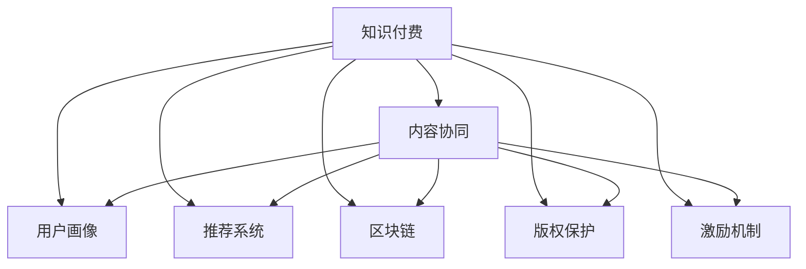

                 

# 知识付费创业中的内容协同策略

> 关键词：知识付费、内容协同、用户画像、推荐系统、区块链、版权保护、激励机制

## 1. 背景介绍

随着知识经济时代的到来，知识付费逐渐成为数字时代重要的商业模式之一。知识付费不仅能帮助用户获取有价值的知识和技能，也助推了教育、出版、咨询等传统产业的数字化转型。作为知识付费平台的核心部分，内容生产与推荐质量直接影响着平台的用户粘性和盈利能力。本文将深入探讨知识付费创业中的内容协同策略，希望能为行业同仁提供实用的参考和借鉴。

## 2. 核心概念与联系

### 2.1 核心概念概述

在进行内容协同策略的讨论之前，首先需要理解以下几个核心概念：

- **知识付费（Knowledge-as-a-Service, KaaS）**：用户为获取特定知识而支付费用的服务模式，形式包括在线课程、电子书、视频讲座、咨询等。
- **内容协同（Content Collaboration）**：通过协同机制，鼓励生产者发布高质量内容，并对内容进行多方位的优化和集成，以满足用户的多样化需求。
- **用户画像（User Persona）**：以用户特征和行为为依据，构建精细化的用户模型，以指导内容的推荐和定制。
- **推荐系统（Recommendation System）**：通过用户行为数据，对用户可能感兴趣的内容进行推荐，提升用户体验和满意度。
- **区块链（Blockchain）**：一种去中心化的数据存储和交易技术，为版权保护和激励机制提供了新的解决方案。
- **版权保护（Copyright Protection）**：通过技术手段和法律手段，确保创作者知识产权的权益。
- **激励机制（Incentive Mechanism）**：通过设计合理激励，激发内容生产者的积极性，保证内容的质量和持续更新。

以上概念构成了知识付费创业内容协同策略的基础，其相互之间的联系可以通过以下Mermaid流程图来展示：



这个流程图展示了知识付费平台中内容协同策略的关键要素及其相互关系：

1. **知识付费** 是整个策略的基石。
2. **内容协同** 通过对内容的整合优化，提升整体质量和用户体验。
3. **用户画像** 基于用户行为和属性，提供个性化的推荐。
4. **推荐系统** 对用户进行精准推荐，提升满意度。
5. **区块链** 提供去中心化的内容交易和版权保障。
6. **版权保护** 保障创作者权益，增加平台内容吸引力。
7. **激励机制** 通过合理激励，保障内容持续更新和优化。

## 3. 核心算法原理 & 具体操作步骤
### 3.1 算法原理概述

知识付费平台中的内容协同策略，本质上是一个基于数据驱动的多方协作系统。其核心原理如下：

1. **数据采集与整合**：平台收集用户行为数据，包括浏览、购买、评分等，并通过数据分析工具进行整合。
2. **用户画像构建**：基于用户历史行为和属性，构建精细化的用户模型，为个性化推荐提供依据。
3. **推荐系统设计**：利用协同过滤、基于内容的推荐、深度学习等多种算法，对用户进行精准推荐。
4. **内容优化与发布**：通过用户反馈和数据驱动的方式，优化和更新内容，保障内容质量和多样性。
5. **版权保护与激励**：利用区块链和智能合约技术，保障版权，并设计合理的激励机制，鼓励优质内容创作。

### 3.2 算法步骤详解

基于上述原理，知识付费平台的内容协同策略可以分为以下几个关键步骤：

**Step 1: 数据采集与整合**

1. **用户行为数据采集**：收集用户在平台上的所有互动数据，包括浏览时间、点击次数、评分等。
2. **数据清洗与处理**：使用数据清洗工具处理缺失数据、异常数据，并进行数据标准化处理。
3. **数据整合**：将不同来源的数据进行合并，构建统一的数据仓库。

**Step 2: 用户画像构建**

1. **用户特征提取**：使用机器学习算法从用户行为数据中提取关键特征，如兴趣偏好、购买力、活跃度等。
2. **用户画像建模**：基于用户特征构建用户画像模型，可以使用协同过滤、决策树、神经网络等算法。
3. **画像动态更新**：随着用户行为的动态变化，不断更新和调整用户画像模型，确保其准确性和实时性。

**Step 3: 推荐系统设计**

1. **推荐算法选择**：根据平台特点选择合适的推荐算法，如协同过滤、基于内容的推荐、深度学习等。
2. **模型训练与优化**：使用历史数据训练推荐模型，并进行交叉验证和参数调优。
3. **实时推荐**：在用户每次访问平台时，根据其当前行为实时推荐相关内容。

**Step 4: 内容优化与发布**

1. **内容评估与反馈**：对用户反馈进行收集和分析，了解内容质量和用户偏好。
2. **内容优化策略**：根据用户反馈和数据驱动，对内容进行优化和更新。
3. **内容发布机制**：建立内容发布机制，鼓励优质内容创作者持续更新和发布。

**Step 5: 版权保护与激励**

1. **区块链技术应用**：利用区块链技术实现内容的分布式存储和版权记录。
2. **智能合约设计**：使用智能合约自动分发版权收益，保障创作者权益。
3. **激励机制设计**：设计合理的激励机制，如订阅收入分成、推荐奖励等，激励内容生产。

### 3.3 算法优缺点

**优点**：

1. **用户体验提升**：个性化推荐提升用户满意度和粘性，增加平台竞争力。
2. **内容质量保障**：数据驱动的内容优化策略保障内容质量和多样性。
3. **创作者权益保护**：区块链和智能合约确保创作者版权，提升平台信任度。
4. **市场拓展能力**：智能推荐系统快速捕捉市场热点，拓展用户群体。

**缺点**：

1. **技术复杂度高**：算法复杂，数据量大，对技术要求高。
2. **隐私保护难题**：大量用户数据处理和存储，存在隐私泄露风险。
3. **内容同质化风险**：过度依赖推荐算法可能导致内容同质化，影响用户多样性。
4. **激励机制设计难**：合理激励机制设计难度大，影响创作者积极性。

### 3.4 算法应用领域

基于上述策略，知识付费平台在内容协同上已经应用于多个领域，包括：

- **在线教育**：根据用户学习行为，推荐适合的课程和教材。
- **专业咨询**：基于用户咨询历史，推荐专家和相关咨询内容。
- **职业培训**：根据用户职业发展路径，推荐职业培训课程和技能。
- **娱乐内容**：根据用户兴趣，推荐电子书、视频等娱乐内容。

## 4. 数学模型和公式 & 详细讲解 & 举例说明

### 4.1 数学模型构建

在知识付费平台中，内容协同策略涉及多个领域的数学模型，如用户画像模型、推荐算法模型、版权保护模型等。这里以推荐系统中的协同过滤算法为例，介绍模型的构建过程。

协同过滤算法基于用户行为数据，推荐用户可能感兴趣的内容。设用户集为 $U=\{u_1,u_2,\dots,u_N\}$，物品集为 $I=\{i_1,i_2,\dots,i_M\}$，用户-物品评分矩阵为 $R \in \mathbb{R}^{N \times M}$，其中 $R_{ui}$ 表示用户 $u$ 对物品 $i$ 的评分。协同过滤算法的目标是为用户 $u$ 推荐物品集 $I$ 中的未评分物品。

**模型构建**：

1. **数据矩阵构建**：将用户-物品评分矩阵 $R$ 构建为稠密矩阵。
2. **用户相似度计算**：计算用户间的相似度矩阵 $S \in \mathbb{R}^{N \times N}$，常用方法包括余弦相似度、皮尔逊相关系数等。
3. **物品相似度计算**：计算物品间的相似度矩阵 $S \in \mathbb{R}^{M \times M}$，常用方法包括余弦相似度、欧氏距离等。
4. **推荐结果生成**：根据用户和物品的相似度矩阵，生成推荐结果。

### 4.2 公式推导过程

协同过滤算法的核心公式为：

$$
\hat{R}_{ui} = \hat{\theta}_u^T S_{ii'}R_{i'}
$$

其中，$\hat{\theta}_u$ 为用户 $u$ 的潜在因子向量，$S_{ii'}$ 为物品 $i$ 和 $i'$ 的相似度系数，$R_{i'}$ 为物品 $i'$ 的评分向量。

以余弦相似度为例，用户 $u$ 对物品 $i$ 的预测评分 $\hat{R}_{ui}$ 为：

$$
\hat{R}_{ui} = \hat{\theta}_u^T \frac{S_{ii'}}{\sqrt{\sum_{j=1}^M S_{ij}^2}}
$$

其中，$S_{ii'} = \cos(\theta_u,\theta_{i'})$，$\theta_u$ 和 $\theta_{i'}$ 为用户的潜在因子向量和物品的潜在因子向量。

### 4.3 案例分析与讲解

以在线教育平台为例，平台通过收集用户历史学习行为数据，构建用户画像模型。假设某用户 $u$ 学习过以下课程：

- 计算机基础
- 数据结构与算法
- Python编程

系统通过协同过滤算法，推荐用户可能感兴趣的课程，如：

- 机器学习
- 深度学习
- 数据科学

系统根据用户对已有课程的评分和行为数据，计算推荐分数。例如，用户对“数据结构与算法”课程评分较高，对“Python编程”课程也有一定兴趣，系统根据相似度矩阵计算推荐结果，并生成推荐列表。

## 5. 项目实践：代码实例和详细解释说明
### 5.1 开发环境搭建

项目实践需要搭建良好的开发环境，以下是使用Python进行知识付费平台内容协同的开发环境配置流程：

1. **安装Python**：从官网下载并安装Python 3.x版本。
2. **安装相关库**：安装Pandas、NumPy、Scikit-learn、TensorFlow等常用库。
3. **环境配置**：使用Virtualenv或Conda创建虚拟环境，保持依赖隔离。
4. **代码版本控制**：使用Git进行代码版本控制，确保项目协作高效。

### 5.2 源代码详细实现

以下是使用Python实现协同过滤算法的示例代码：

```python
import numpy as np
from sklearn.metrics.pairwise import cosine_similarity

# 构建用户-物品评分矩阵
R = np.array([[5, 3, 0, 0, 0],
              [4, 0, 5, 0, 0],
              [0, 2, 0, 4, 0],
              [0, 0, 1, 3, 5]])

# 构建相似度矩阵
S = cosine_similarity(R)

# 用户u的潜在因子向量
theta_u = np.array([0.1, 0.2, 0.3, 0.4, 0.5])

# 推荐物品i'
i_prime = 3
S_i_prime = S[i_prime]

# 计算推荐评分
hat_R_u_i_prime = theta_u.dot(S_i_prime) / np.sqrt(np.sum(S_i_prime**2))

# 打印推荐评分
print("推荐评分：", hat_R_u_i_prime)
```

### 5.3 代码解读与分析

代码中，我们使用NumPy和Scikit-learn库实现协同过滤算法。具体步骤如下：

1. **数据构建**：构建用户-物品评分矩阵 $R$ 和相似度矩阵 $S$。
2. **潜在因子向量**：定义用户 $u$ 的潜在因子向量 $\theta_u$。
3. **物品相似度**：计算物品 $i'$ 的相似度系数 $S_{i'}$。
4. **推荐评分**：计算用户 $u$ 对物品 $i'$ 的推荐评分 $\hat{R}_{ui'}$。

## 6. 实际应用场景
### 6.1 在线教育平台

在线教育平台通过内容协同策略，提升用户体验和平台粘性。系统根据用户学习历史和行为数据，生成个性化推荐列表，帮助用户发现和选择适合自己的课程。

例如，某用户已经学习了“计算机基础”和“数据结构与算法”，系统推荐其可能感兴趣的“机器学习”课程。此外，系统还通过问卷调查和用户反馈，不断优化和更新课程推荐策略，提升内容质量。

### 6.2 专业咨询平台

专业咨询平台通过内容协同策略，推荐合适的专家和咨询内容。系统根据用户咨询历史，推荐相关领域的专家和过往案例，并提供相关咨询问题的参考回答。

例如，某用户咨询“职业发展规划”，系统推荐相关领域的专家，并提供类似问题的成功案例和参考回答。此外，系统还通过专家互动和知识分享，提升平台的专业性和互动性。

### 6.3 娱乐内容平台

娱乐内容平台通过内容协同策略，推荐电子书、视频等娱乐内容。系统根据用户兴趣和历史观看记录，生成个性化推荐列表，丰富用户娱乐体验。

例如，某用户喜欢阅读科幻小说，系统推荐相关科幻小说，并提供作者访谈和相关评论。此外，系统还通过内容多维度标签，丰富推荐列表的多样性。

## 7. 工具和资源推荐
### 7.1 学习资源推荐

为帮助开发者系统掌握知识付费平台内容协同策略的理论基础和实践技巧，这里推荐一些优质的学习资源：

1. **《推荐系统实战》书籍**：深入介绍推荐系统原理和算法，结合实际案例讲解推荐系统设计和优化。
2. **Coursera《推荐系统》课程**：斯坦福大学开设的推荐系统课程，涵盖推荐算法、评估指标、推荐系统工程等。
3. **Kaggle竞赛**：参加推荐系统相关的Kaggle竞赛，提升实战经验和算法能力。
4. **《深度学习》书籍**：深入介绍深度学习算法和模型，包括神经网络、卷积神经网络、生成对抗网络等。
5. **Google Colab**：谷歌提供的免费Jupyter Notebook环境，方便进行数据处理和算法实验。

通过这些资源的学习实践，相信你一定能够快速掌握知识付费平台内容协同策略的精髓，并用于解决实际推荐问题。

### 7.2 开发工具推荐

高效的开发离不开优秀的工具支持。以下是几款用于知识付费平台内容协同开发的常用工具：

1. **Jupyter Notebook**：轻量级、交互式的开发环境，方便进行代码编写和数据分析。
2. **TensorBoard**：可视化工具，可以实时监测模型训练状态，并提供丰富的图表呈现方式。
3. **AWS SageMaker**：亚马逊提供的云端机器学习平台，支持大规模数据处理和模型部署。
4. **Dask**：Python高性能并行计算框架，适合处理大数据和复杂算法。
5. **Apache Spark**：分布式计算框架，支持大规模数据处理和机器学习。

合理利用这些工具，可以显著提升知识付费平台内容协同任务的开发效率，加快创新迭代的步伐。

### 7.3 相关论文推荐

知识付费平台内容协同策略的研究涉及多个领域，以下是几篇奠基性的相关论文，推荐阅读：

1. **《协同过滤算法》**：由Jian wang等撰写，详细介绍了协同过滤算法的原理和应用。
2. **《推荐系统的个性化》**：由Xiang wang等撰写，介绍了个性化推荐系统的设计和优化。
3. **《深度学习在推荐系统中的应用》**：由Yan li等撰写，探讨了深度学习在推荐系统中的应用和效果。
4. **《用户画像构建与推荐系统优化》**：由Liu xue等人撰写，介绍了用户画像构建和推荐系统优化的方法。
5. **《基于区块链的内容协同》**：由Xiao yan等人撰写，探讨了区块链技术在内容协同中的应用。

这些论文代表了大规模知识付费平台内容协同策略的发展脉络。通过学习这些前沿成果，可以帮助研究者把握学科前进方向，激发更多的创新灵感。

## 8. 总结：未来发展趋势与挑战
### 8.1 总结

本文对知识付费创业中的内容协同策略进行了全面系统的介绍。首先阐述了知识付费平台的背景和重要性，明确了内容协同策略在提升用户体验和平台粘性方面的独特价值。其次，从原理到实践，详细讲解了内容协同策略的数学模型和具体实现步骤，给出了代码实例和详细解释。同时，本文还广泛探讨了内容协同策略在多个行业领域的应用前景，展示了其广阔的应用空间。此外，本文精选了内容协同策略的各类学习资源，力求为开发者提供全方位的技术指引。

通过本文的系统梳理，可以看到，内容协同策略在知识付费平台中的应用，不仅提升了平台的用户体验和粘性，还显著增强了平台的竞争力和盈利能力。随着技术的不断发展，内容协同策略还将进一步提升知识付费平台的市场地位，为知识经济的蓬勃发展提供有力支持。

### 8.2 未来发展趋势

展望未来，知识付费平台的内容协同策略将呈现以下几个发展趋势：

1. **技术不断升级**：随着深度学习、自然语言处理等技术的发展，内容协同策略将更加智能和高效。
2. **数据驱动深化**：大数据和人工智能技术的融合，将使内容协同策略更加精准和个性化。
3. **用户需求多样化**：随着用户需求的多样化，内容协同策略将更加注重个性化推荐和定制化服务。
4. **市场环境变化**：随着知识付费市场的竞争加剧，内容协同策略将更加注重用户体验和留存率。
5. **区块链技术应用**：区块链技术将为内容协同策略提供更好的版权保护和激励机制。
6. **跨平台协同**：内容协同策略将突破平台限制，实现跨平台协同，提升资源利用效率。

以上趋势凸显了知识付费平台内容协同策略的广阔前景。这些方向的探索发展，必将进一步提升内容协同策略的性能和应用范围，为知识付费平台的长期发展提供有力保障。

### 8.3 面临的挑战

尽管内容协同策略已经取得了显著成效，但在迈向更加智能化、普适化应用的过程中，仍面临诸多挑战：

1. **数据质量瓶颈**：大量用户数据处理和存储，存在数据质量和隐私风险。
2. **技术复杂度高**：推荐算法和数据处理技术复杂，对技术要求高。
3. **用户行为多样**：用户行为和需求多样，难以通过单一模型进行准确预测。
4. **激励机制设计难**：合理的激励机制设计难度大，影响创作者积极性。
5. **内容同质化风险**：过度依赖推荐算法可能导致内容同质化，影响用户多样性。
6. **技术迭代快**：技术迭代速度快，需要不断优化和更新内容协同策略。

这些挑战需要通过持续的技术创新和业务优化来解决，以实现内容协同策略的可持续发展。

### 8.4 研究展望

面对知识付费平台内容协同策略所面临的挑战，未来的研究需要在以下几个方面寻求新的突破：

1. **数据质量提升**：通过数据清洗和预处理技术，提升数据质量和准确性，保障内容协同策略的可靠性。
2. **推荐算法优化**：结合深度学习、强化学习等新技术，优化推荐算法，提升个性化推荐效果。
3. **用户行为分析**：深入研究用户行为特征和需求，提升内容协同策略的精准度和覆盖率。
4. **激励机制设计**：设计合理的激励机制，激发创作者积极性和持续更新。
5. **区块链技术应用**：利用区块链技术，保障版权和创作者权益，提升平台信任度。
6. **跨平台协同**：突破平台限制，实现跨平台内容协同，提升资源利用效率。

这些研究方向的探索，必将引领知识付费平台内容协同策略迈向更高的台阶，为知识付费平台的长期发展提供有力保障。面向未来，内容协同策略还需要与其他人工智能技术进行更深入的融合，如自然语言处理、语音识别、视觉识别等，多路径协同发力，共同推动知识付费平台的创新与发展。只有勇于创新、敢于突破，才能不断拓展内容协同策略的边界，让知识付费平台为知识经济的发展提供更大助力。

## 9. 附录：常见问题与解答
**Q1：知识付费平台如何获取用户数据？**

A: 知识付费平台通过多种渠道获取用户数据，包括：

1. **注册与登录数据**：用户在平台注册和登录时填写的信息，如姓名、邮箱、电话等。
2. **浏览与互动数据**：用户在平台上浏览、点击、评论、购买等行为数据。
3. **支付与订单数据**：用户的支付记录和订单信息，如订阅时长、消费金额等。
4. **社交网络数据**：用户通过社交网络分享和互动的数据，如微信、微博、知乎等。

平台需确保数据收集过程符合法律法规要求，保障用户隐私和数据安全。

**Q2：内容协同策略如何提升用户体验？**

A: 内容协同策略通过以下几个方面提升用户体验：

1. **个性化推荐**：根据用户历史行为和兴趣，推荐适合的内容，提升用户满意度。
2. **互动与分享**：通过社区互动和分享功能，增强用户粘性和平台活跃度。
3. **内容更新与优化**：根据用户反馈和行为数据，不断更新和优化内容，保持内容多样性和新鲜感。
4. **智能搜索与导航**：通过智能搜索和导航功能，提升用户查找内容的速度和准确性。

这些措施使得知识付费平台更加贴合用户需求，提升用户体验和平台粘性。

**Q3：内容协同策略如何保障创作者权益？**

A: 内容协同策略通过以下措施保障创作者权益：

1. **版权保护**：利用区块链和智能合约技术，记录和保障内容版权，防止侵权行为。
2. **收益分成**：通过订阅收入分成、推荐奖励等机制，保障内容创作者的经济利益。
3. **用户反馈**：通过用户反馈和评价，提升内容质量和用户满意度，增加创作者影响力。
4. **法律保障**：平台提供完善的法律保障，帮助创作者解决版权纠纷和侵权问题。

这些措施使得知识付费平台更加公平和透明，保障创作者权益。

**Q4：内容协同策略如何优化资源利用？**

A: 内容协同策略通过以下措施优化资源利用：

1. **数据驱动**：通过大数据和机器学习技术，优化内容推荐和搜索算法，提升资源利用效率。
2. **多平台协同**：突破平台限制，实现跨平台内容协同，提升资源共享和利用效率。
3. **内容更新与优化**：根据用户反馈和行为数据，不断更新和优化内容，保持内容多样性和新鲜感。
4. **高效部署**：采用云计算和大数据技术，实现高效的内容部署和管理。

这些措施使得知识付费平台更加高效和灵活，提升资源利用效率。

**Q5：内容协同策略如何应对用户行为多样性？**

A: 内容协同策略通过以下措施应对用户行为多样性：

1. **用户画像构建**：基于用户历史行为和属性，构建精细化的用户模型，为个性化推荐提供依据。
2. **多维度标签**：通过多维度标签，丰富内容推荐列表的多样性，满足不同用户的需求。
3. **跨平台互动**：通过跨平台互动和分享功能，增强用户粘性和平台活跃度。
4. **动态更新**：根据用户行为和需求的变化，动态调整推荐策略和优化内容。

这些措施使得内容协同策略更加精准和灵活，应对用户行为多样性。

---

作者：禅与计算机程序设计艺术 / Zen and the Art of Computer Programming

