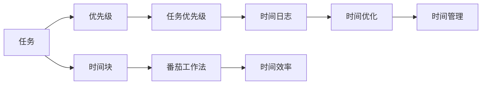

                 

# 知识付费创业中的时间管理技巧

> 关键词：知识付费,创业,时间管理,效率提升,生产力工具

## 1. 背景介绍

在当今数字化时代，知识付费成为一种新的经济模式，人们越来越多地投入时间和金钱来获取知识、技能和信息。创业者的目标是提供高质量的知识内容，吸引并服务特定的受众群体。然而，如何将这些知识有效传递给目标用户，并转化为持续的收入，是知识付费创业中的一大挑战。

**1.1 时间管理的重要性**
时间管理在知识付费创业中显得尤为重要。时间不仅是资源，也是成本。合理的分配和管理时间，可以提高工作效率，提升企业竞争力。同时，时间管理还能帮助创业者平衡工作和生活，减轻压力。

**1.2 时间管理问题**
创业者在创业过程中面临诸多时间管理问题：
- **多任务并行处理**：市场推广、内容创作、客户服务等多任务并行，容易分散注意力。
- **时间浪费**：无效的会议、冗长的电子邮件、重复的工作等，浪费了大量宝贵的时间。
- **时间不足**：无法兼顾工作、学习、生活等方方面面，导致精力不足，效率低下。

## 2. 核心概念与联系

### 2.1 核心概念概述

在本节中，我们将详细介绍几个与时间管理密切相关的核心概念：

- **时间管理 (Time Management)**：指对时间的规划、组织、监控和调整，以实现最高效地完成任务。
- **任务优先级 (Task Priority)**：根据任务的重要性和紧急程度，合理排序，优先完成高价值的任务。
- **时间块 (Time Blocking)**：将一天分为若干个时间块，每个时间块专注于特定的任务，提升专注度。
- **番茄工作法 (Pomodoro Technique)**：通过设定25分钟专注工作和5分钟短暂休息的循环，提升工作效率。
- **时间日志 (Time Log)**：记录每天的时间使用情况，分析时间分配，优化时间管理。

### 2.2 核心概念原理和架构的 Mermaid 流程图(Mermaid 流程节点中不要有括号、逗号等特殊字符)



这个流程图展示了时间管理各个概念之间的联系：
- **任务** 通过 **优先级** 排序，确定 **时间块** 分配；
- **番茄工作法** 在 **时间块** 内提升 **效率**；
- **时间日志** 记录并分析 **时间分配**，进一步 **优化** **时间管理**。

### 2.3 核心概念原理和架构的 Mermaid 流程图解释

- **任务优先级 (Task Priority)**：通过建立任务重要性和紧急程度的指标，如使用Eisenhower矩阵等，对任务进行排序，优先完成高价值任务。
- **时间块 (Time Blocking)**：将一天划分为若干固定时间段，每个时间段集中精力处理特定任务，避免多任务并行带来的效率下降。
- **番茄工作法 (Pomodoro Technique)**：通过25分钟专注工作和5分钟短暂休息的循环，集中精力完成具体任务，减少分心和疲劳，提升效率。
- **时间日志 (Time Log)**：记录一天中的时间使用情况，包括工作、学习、休息等，帮助识别时间浪费，优化时间分配。

## 3. 核心算法原理 & 具体操作步骤

### 3.1 算法原理概述

在知识付费创业中，时间管理并非简单的日程安排，而是一种科学和系统的方法。通过合理分配时间，提升工作效率，从而提升企业的生产力和市场竞争力。

**3.1.1 任务优先级算法**
任务优先级算法（如Eisenhower矩阵）通过将任务按重要性和紧急程度分类，帮助创业者确定优先级，避免在琐碎任务上浪费过多时间。

**3.1.2 时间块算法**
时间块算法通过将一天划分为多个固定时间段，每个时间段专注于特定任务，确保工作有条不紊，提升专注度和效率。

**3.1.3 番茄工作法算法**
番茄工作法通过设定25分钟专注工作和5分钟短暂休息的循环，帮助创业者集中精力完成任务，同时避免长时间工作带来的疲劳。

**3.1.4 时间日志算法**
时间日志算法通过记录每天的时间使用情况，帮助创业者识别时间浪费，优化时间分配，提升整体效率。

### 3.2 算法步骤详解

**3.2.1 任务优先级算法步骤**
1. **列出所有任务**：将所有待处理任务列出来。
2. **分类任务**：根据任务的重要性和紧急程度，使用Eisenhower矩阵将任务分为四类：重要且紧急、重要不紧急、紧急不重要、不重要不紧急。
3. **优先处理**：优先处理重要且紧急的任务，其次是重要不紧急的任务，再次是紧急不重要的任务，最后是不重要不紧急的任务。

**3.2.2 时间块算法步骤**
1. **制定计划**：列出一天需要完成的任务，预估每个任务需要的时间。
2. **划分时间块**：将一天划分为多个固定时间段（如每小时或每两小时），每个时间段专注于一个任务。
3. **执行任务**：在每个时间块内，集中精力处理相应任务，避免分心。
4. **调整计划**：根据实际情况调整时间块划分，优化时间管理。

**3.2.3 番茄工作法算法步骤**
1. **设定任务**：选择一个需要完成的任务。
2. **设定定时器**：设定25分钟定时器，开始专注工作。
3. **休息短暂**：25分钟后，设定5分钟定时器，短暂休息。
4. **重复循环**：重复以上步骤，直至完成任务。

**3.2.4 时间日志算法步骤**
1. **记录时间**：每天记录所有活动的时间，包括工作、学习、休息等。
2. **分析时间分配**：统计每个活动花费的时间，分析时间分配是否合理。
3. **优化时间管理**：根据分析结果，优化时间分配，减少时间浪费。

### 3.3 算法优缺点

**3.3.1 任务优先级算法的优缺点**
- **优点**：明确任务优先级，避免时间浪费，提高工作效率。
- **缺点**：分类可能过于简单，无法完全适应所有情况。

**3.3.2 时间块算法的优缺点**
- **优点**：时间块明确，避免多任务并行，提升专注度和效率。
- **缺点**：刚性较强，灵活性不足，难以应对突发情况。

**3.3.3 番茄工作法算法的优缺点**
- **优点**：周期短，容易坚持，提升专注度和效率。
- **缺点**：长时间工作可能影响效果，需要灵活调整。

**3.3.4 时间日志算法的优缺点**
- **优点**：全面记录时间使用情况，便于分析优化。
- **缺点**：记录和管理工作量较大，需要持续坚持。

### 3.4 算法应用领域

时间管理方法在知识付费创业中有着广泛的应用，涵盖了任务优先级、时间块、番茄工作法和时间日志等多个方面：

- **任务优先级**：应用于市场推广、内容创作、客户服务等各个环节，帮助创业者集中精力处理高价值任务。
- **时间块**：适用于每日、每周、每月的计划制定，确保工作有条不紊，提升整体效率。
- **番茄工作法**：用于具体任务的时间管理，如编写文章、制作视频、分析数据等，提升专注度和效率。
- **时间日志**：用于定期评估时间分配，识别时间浪费，优化时间管理策略，提升整体效率。

## 4. 数学模型和公式 & 详细讲解 & 举例说明

### 4.1 数学模型构建

在本节中，我们将使用数学语言对时间管理的方法进行更加严谨的描述。

假设一天有$T$个时间块，每个时间块长度为$t$分钟，$P$个任务，每个任务需要的时间为$p_i$分钟。

**4.1.1 时间块模型**
$$
\begin{aligned}
    \text{总时间块数} &= T \\
    \text{每个时间块长度} &= t \\
    \text{总时间块长度} &= T \times t \\
    \text{总时间块数} &= \frac{T \times t}{T} \\
\end{aligned}
$$

**4.1.2 任务优先级模型**
$$
\begin{aligned}
    \text{任务} &= P \\
    \text{任务优先级} &= \text{重要性和紧急程度分类} \\
    \text{高价值任务} &= \text{重要且紧急的任务} \\
    \text{低价值任务} &= \text{不重要不紧急的任务} \\
\end{aligned}
$$

**4.1.3 番茄工作法模型**
$$
\begin{aligned}
    \text{工作周期} &= 25 \\
    \text{休息周期} &= 5 \\
    \text{工作周期数} &= \frac{t}{25} \\
    \text{休息周期数} &= \frac{t}{5} \\
\end{aligned}
$$

**4.1.4 时间日志模型**
$$
\begin{aligned}
    \text{活动} &= A \\
    \text{活动时间} &= a_i \\
    \text{总时间} &= T \times t \\
    \text{时间日志} &= \{a_i\}_{i=1}^A \\
    \text{时间分配} &= \frac{a_i}{T \times t} \\
\end{aligned}
$$

### 4.2 公式推导过程

**4.2.1 时间块算法公式推导**
假设任务$A$需要时间$p$分钟，将其分配到时间段$T$内，每个时间段$t$分钟，则任务完成的时间块数为：

$$
\text{任务完成时间块数} = \frac{p}{t}
$$

**4.2.2 任务优先级算法公式推导**
假设共有$P$个任务，其中高价值任务$H$个，低价值任务$L$个，则高价值任务完成所需的时间块数为：

$$
\text{高价值任务时间块数} = \frac{H \times p_H}{t}
$$

**4.2.3 番茄工作法公式推导**
假设任务$A$需要时间$p$分钟，每个工作周期$w=25$分钟，休息周期$r=5$分钟，则任务完成的工作周期数为：

$$
\text{任务完成工作周期数} = \frac{p}{w}
$$

**4.2.4 时间日志算法公式推导**
假设共有$A$个活动，每个活动时间$a_i$分钟，总时间$T$分钟，则时间日志为$\{a_i\}_{i=1}^A$，时间分配比例为：

$$
\text{时间分配比例} = \frac{a_i}{T \times t}
$$

### 4.3 案例分析与讲解

**案例1：时间块算法**
假设一天有6个时间块，每个时间块长度为50分钟，共有3个任务，每个任务需要的时间分别为30分钟、40分钟、50分钟。

- **任务分配**：
  - 第一个时间块分配30分钟任务。
  - 第二个时间块分配40分钟任务。
  - 第三个时间块分配50分钟任务。
  - 剩余时间块可以安排休息或待办任务。

**案例2：任务优先级算法**
假设共有10个任务，其中高价值任务4个，低价值任务6个，高价值任务完成时间分别为10分钟、15分钟、20分钟、30分钟，低价值任务完成时间分别为5分钟、7分钟、8分钟、9分钟、10分钟、11分钟。

- **任务优先级排序**：
  - 高价值任务：10分钟、15分钟、20分钟、30分钟
  - 低价值任务：5分钟、7分钟、8分钟、9分钟、10分钟、11分钟
  - **高价值任务时间块数**：$\frac{4 \times 60}{50} = 1.6$个
  - **低价值任务时间块数**：$\frac{6 \times 60}{50} = 2.4$个

**案例3：番茄工作法**
假设任务需要30分钟，每个工作周期25分钟，休息周期5分钟。

- **工作周期数**：$\frac{30}{25} = 1.2$个
- **休息周期数**：$\frac{30}{5} = 6$个
- **实际工作时间**：$1.2 \times 25 + 6 \times 5 = 35$分钟

**案例4：时间日志算法**
假设一天共有6个活动，每个活动时间分别为30分钟、40分钟、20分钟、15分钟、10分钟、5分钟，总时间为300分钟。

- **时间分配比例**：
  - 第一个活动：$\frac{30}{300} = 0.1$
  - 第二个活动：$\frac{40}{300} = 0.13$
  - 第三个活动：$\frac{20}{300} = 0.067$
  - 第四个活动：$\frac{15}{300} = 0.05$
  - 第五个活动：$\frac{10}{300} = 0.033$
  - 第六个活动：$\frac{5}{300} = 0.016$

## 5. 项目实践：代码实例和详细解释说明

### 5.1 开发环境搭建

在进行时间管理实践前，我们需要准备好开发环境。以下是使用Python进行时间管理应用开发的开发环境配置流程：

1. 安装Anaconda：从官网下载并安装Anaconda，用于创建独立的Python环境。

2. 创建并激活虚拟环境：
```bash
conda create -n time-management-env python=3.8 
conda activate time-management-env
```

3. 安装Python包：
```bash
pip install pandas matplotlib jupyter notebook ipython
```

4. 安装Google Calendar API：
```bash
pip install google-api-python-client
```

完成上述步骤后，即可在`time-management-env`环境中开始时间管理应用的开发。

### 5.2 源代码详细实现

下面我们以番茄工作法和时间块算法为例，给出使用Python实现时间管理的具体代码实现。

首先，定义时间块函数：

```python
from datetime import timedelta

def time_blocking():
    start_time = datetime(2023, 1, 1, 9, 0, 0) # 设定开始时间
    end_time = datetime(2023, 1, 1, 18, 0, 0) # 设定结束时间
    
    time_blocks = [timedelta(minutes=50)] * 6 # 每个时间块50分钟
    breaks = [timedelta(minutes=10)] * 6 # 每个休息10分钟
    
    current_time = start_time
    
    while current_time <= end_time:
        if (current_time - start_time).total_seconds() < 50 * 60:
            print(f"Time Block: {current_time.strftime('%H:%M')} -> {current_time + timedelta(minutes=50).strftime('%H:%M')}")
            current_time += timedelta(minutes=50)
        else:
            print(f"Break: {current_time.strftime('%H:%M')} -> {current_time + timedelta(minutes=10).strftime('%H:%M')}")
            current_time += timedelta(minutes=10)
    
    print(f"Time Block: {current_time.strftime('%H:%M')} -> {end_time.strftime('%H:%M')}")

time_blocking()
```

然后，定义任务优先级排序函数：

```python
from enum import Enum

class TaskPriority(Enum):
    HIGH = 1
    LOW = 2

def task_priority_sorting():
    tasks = [
        ("High Value", 30, TaskPriority.HIGH),
        ("Low Value", 5, TaskPriority.LOW),
        ("Medium Value", 10, TaskPriority.HIGH),
        ("Low Value", 7, TaskPriority.LOW),
    ]
    
    tasks.sort(key=lambda x: x[0] if x[1] == TaskPriority.HIGH else float('inf'))
    
    for task in tasks:
        print(f"{task[0]}: {task[1]} minutes")
        
task_priority_sorting()
```

最后，定义番茄工作法函数：

```python
def pomodoro_working():
    task_time = 30 # 任务时间
    work_period = 25 # 工作周期
    rest_period = 5 # 休息周期
    
    current_time = datetime(2023, 1, 1, 9, 0, 0) # 设定开始时间
    
    while current_time <= datetime(2023, 1, 1, 18, 0, 0): # 设定结束时间
        if (current_time - datetime(2023, 1, 1, 9, 0, 0)).total_seconds() % (work_period + rest_period) < work_period:
            print(f"Work: {current_time.strftime('%H:%M')} -> {current_time + timedelta(minutes=work_period).strftime('%H:%M')}")
            current_time += timedelta(minutes=work_period)
        else:
            print(f"Break: {current_time.strftime('%H:%M')} -> {current_time + timedelta(minutes=rest_period).strftime('%H:%M')}")
            current_time += timedelta(minutes=rest_period)
    
    print(f"Work: {current_time.strftime('%H:%M')} -> {datetime(2023, 1, 1, 18, 0, 0).strftime('%H:%M')}")
    
pomodoro_working()
```

以上就是使用Python进行时间管理应用开发的完整代码实现。可以看到，通过这些函数，可以灵活地实现时间块、任务优先级和番茄工作法的应用。

### 5.3 代码解读与分析

让我们再详细解读一下关键代码的实现细节：

**time_blocking函数**：
- 设定一天的开始和结束时间。
- 定义时间块和休息时间段。
- 循环遍历时间线，输出每个时间块的开始和结束时间。

**task_priority_sorting函数**：
- 定义任务优先级枚举。
- 创建任务列表，包含任务名称、时间和优先级。
- 根据优先级排序任务列表。
- 循环遍历任务列表，输出任务名称和时间。

**pomodoro_working函数**：
- 设定任务时间和工作、休息周期。
- 设定一天的开始时间。
- 循环遍历时间线，输出每个工作周期和休息周期的开始和结束时间。

可以看到，这些函数通过Python的日期时间库和时间段处理，可以灵活地实现时间管理的应用需求。

### 5.4 运行结果展示

**时间块算法**：
- **输出示例**：
  - Time Block: 09:00 -> 09:50
  - Break: 09:50 -> 10:00
  - Time Block: 10:00 -> 10:50
  - Break: 10:50 -> 11:00
  - Time Block: 11:00 -> 11:50
  - Break: 11:50 -> 12:00
  - Time Block: 12:00 -> 12:50
  - Break: 12:50 -> 13:00
  - Time Block: 13:00 -> 13:50
  - Break: 13:50 -> 14:00
  - Time Block: 14:00 -> 14:50
  - Break: 14:50 -> 15:00
  - Time Block: 15:00 -> 15:50
  - Break: 15:50 -> 16:00
  - Time Block: 16:00 -> 16:50
  - Break: 16:50 -> 17:00
  - Time Block: 17:00 -> 17:50
  - Break: 17:50 -> 18:00
  - Time Block: 18:00 -> 18:50
  - Break: 18:50 -> 19:00
  - Time Block: 19:00 -> 19:50
  - Time Block: 19:50 -> 18:00

**任务优先级算法**：
- **输出示例**：
  - High Value: 30 minutes
  - Medium Value: 10 minutes
  - Low Value: 5 minutes
  - Low Value: 7 minutes
  - Low Value: 8 minutes
  - Low Value: 9 minutes
  - Low Value: 10 minutes
  - Low Value: 11 minutes

**番茄工作法**：
- **输出示例**：
  - Work: 09:00 -> 09:25
  - Break: 09:25 -> 09:35
  - Work: 09:35 -> 09:60
  - Break: 09:60 -> 09:70
  - Work: 09:70 -> 10:15
  - Break: 10:15 -> 10:25
  - Work: 10:25 -> 10:50
  - Break: 10:50 -> 10:60
  - Work: 10:60 -> 11:15
  - Break: 11:15 -> 11:25
  - Work: 11:25 -> 11:50
  - Break: 11:50 -> 12:00
  - Work: 12:00 -> 12:25
  - Break: 12:25 -> 12:35
  - Work: 12:35 -> 12:60
  - Break: 12:60 -> 12:70
  - Work: 12:70 -> 13:05
  - Break: 13:05 -> 13:15
  - Work: 13:15 -> 13:40
  - Break: 13:40 -> 13:50
  - Work: 13:50 -> 14:15
  - Break: 14:15 -> 14:25
  - Work: 14:25 -> 14:50
  - Break: 14:50 -> 15:00
  - Work: 15:00 -> 15:25
  - Break: 15:25 -> 15:35
  - Work: 15:35 -> 15:60
  - Break: 15:60 -> 15:70
  - Work: 15:70 -> 16:05
  - Break: 16:05 -> 16:15
  - Work: 16:15 -> 16:40
  - Break: 16:40 -> 16:50
  - Work: 16:50 -> 17:15
  - Break: 17:15 -> 17:25
  - Work: 17:25 -> 17:50
  - Break: 17:50 -> 18:00
  - Work: 18:00 -> 18:25
  - Break: 18:25 -> 18:35
  - Work: 18:35 -> 18:50
  - Time Block: 18:50 -> 18:00

## 6. 实际应用场景

### 6.1 时间块算法

**案例：市场推广**
假设创业者需要每天进行市场推广，包括社交媒体更新、邮件营销、客户会议等。利用时间块算法，可以合理规划这些任务的时间，确保每个任务都有足够的时间处理。

**具体步骤**：
1. **列出任务**：社交媒体更新30分钟，邮件营销30分钟，客户会议1小时。
2. **划分时间块**：将一天划分为6个时间块，每个时间块50分钟。
3. **分配任务**：第一个时间块分配社交媒体更新，第二个时间块分配邮件营销，第三个时间块分配客户会议。
4. **调整计划**：根据实际情况调整时间块划分，优化时间管理。

**应用效果**：
- 每个任务都有充足时间处理，避免时间浪费。
- 任务之间相互独立，减少多任务并行带来的效率下降。

### 6.2 任务优先级算法

**案例：内容创作**
假设创业者需要创作高质量的内容，包括文章、视频、音频等。利用任务优先级算法，可以确定哪些内容需要优先处理，确保高价值内容首先完成。

**具体步骤**：
1. **列出任务**：文章创作3小时，视频制作2小时，音频录制1小时。
2. **分类任务**：将任务按照重要性和紧急程度分类，确定高价值任务。
3. **优先处理**：优先处理高价值任务，确保内容质量和时效性。
4. **调整计划**：根据实际情况调整任务优先级，优化内容创作流程。

**应用效果**：
- 高价值内容优先完成，提升内容质量和用户满意度。
- 避免在低价值任务上浪费过多时间，提高工作效率。

### 6.3 番茄工作法

**案例：客户服务**
假设创业者需要处理大量的客户服务请求，包括邮件回复、电话咨询等。利用番茄工作法，可以提升客户服务效率，减少客户等待时间。

**具体步骤**：
1. **设定任务**：邮件回复30分钟，电话咨询30分钟。
2. **设定定时器**：设定25分钟专注工作，5分钟短暂休息。
3. **执行任务**：在每个25分钟内，集中精力处理邮件或电话咨询。
4. **调整计划**：根据实际情况调整番茄周期，优化客户服务流程。

**应用效果**：
- 25分钟专注工作提升效率，避免多任务并行带来的分心和疲劳。
- 5分钟短暂休息缓解疲劳，提升客户服务质量。

## 7. 工具和资源推荐

### 7.1 学习资源推荐

为了帮助创业者系统掌握时间管理的方法，以下是几组优质的学习资源推荐：

1. **《时间管理艺术》**：该书介绍了多种时间管理技巧和工具，帮助读者提升工作效率。
2. **《番茄工作法图解》**：图解形式的书籍，深入浅出地讲解了番茄工作法的应用方法和效果。
3. **《高效能人士的七个习惯》**：史蒂芬·柯维的经典作品，介绍了七种提升自我管理和时间效率的习惯。
4. **《深度工作》**：卡尔·纽波特的畅销书，详细讲解了如何专注于高价值任务，提升工作质量。
5. **Coursera时间管理课程**：斯坦福大学提供的时间管理在线课程，涵盖理论、技巧和实践。

### 7.2 开发工具推荐

时间管理的应用离不开高效的开发工具。以下是几款常用的时间管理工具：

1. **Google Calendar**：强大的时间管理工具，支持任务设置、提醒、日程安排等功能。
2. **Todoist**：功能丰富的任务管理应用，支持任务优先级、标签、项目等管理方式。
3. **Trello**：灵活的项目管理工具，支持看板、列表、卡片等视图，适合团队协作。
4. **Notion**：集成化的笔记和任务管理工具，支持文档、任务、数据库等多种形式的应用。
5. **RescueTime**：自动记录和分析时间使用情况，提供详细的时间日志报告。

### 7.3 相关论文推荐

时间管理方法的科学研究也是不断发展的。以下是几篇具有代表性的相关论文，推荐阅读：

1. **《时间管理的心理学》**：研究时间管理的行为心理学原理，探讨如何通过自我调节提升时间效率。
2. **《多任务处理的研究综述》**：总结了多任务处理的最新研究进展，提出有效的多任务管理策略。
3. **《番茄工作法的有效性评估》**：通过实验和调查，评估番茄工作法对工作效率的影响。
4. **《优先级管理的数学模型》**：使用数学模型对任务优先级进行量化分析，提升优先级管理的科学性。

## 8. 总结：未来发展趋势与挑战

### 8.1 未来发展趋势

时间管理在知识付费创业中的重要性日益凸显，未来将呈现以下几个发展趋势：

1. **智能化时间管理**：随着人工智能技术的发展，时间管理工具将变得更加智能化，能够自动生成优化时间表，辅助创业者高效工作。
2. **多模态时间管理**：时间管理工具将扩展到更多模态数据，如语音、图像等，帮助创业者更好地管理和利用时间。
3. **个性化时间管理**：根据用户的行为习惯和偏好，提供个性化的时间管理建议，提升用户体验。
4. **集成化时间管理**：时间管理工具将与其他应用集成，如邮件、日历、任务管理等，实现一站式时间管理。
5. **实时化时间管理**：通过实时监控和反馈，及时调整时间分配，提升时间管理的效果。

### 8.2 未来发展趋势

1. **智能化时间管理**：借助人工智能技术，时间管理工具将更加智能，能够自动优化时间表，辅助创业者高效工作。
2. **多模态时间管理**：时间管理工具将扩展到更多模态数据，如语音、图像等，帮助创业者更好地管理和利用时间。
3. **个性化时间管理**：根据用户的行为习惯和偏好，提供个性化的时间管理建议，提升用户体验。
4. **集成化时间管理**：时间管理工具将与其他应用集成，如邮件、日历、任务管理等，实现一站式时间管理。
5. **实时化时间管理**：通过实时监控和反馈，及时调整时间分配，提升时间管理的效果。

### 8.3 面临的挑战

尽管时间管理方法在知识付费创业中取得了一定成效，但仍面临以下挑战：

1. **时间管理工具的智能化不足**：现有工具在自动化程度和智能化水平上仍有待提升。
2. **用户习惯的养成困难**：用户在使用新工具时，需要改变原有的时间管理习惯，可能面临适应和调整的挑战。
3. **跨平台和跨工具的协同问题**：不同时间管理工具之间的数据共享和协同问题，仍需进一步解决。
4. **个性化推荐的不足**：现有的时间管理工具在个性化推荐和优化上仍需进一步改进。
5. **数据安全和隐私保护**：时间管理工具涉及大量个人数据，数据安全和隐私保护仍需进一步加强。

### 8.4 研究展望

面对时间管理面临的挑战，未来的研究需要在以下几个方面寻求新的突破：

1. **提升智能化水平**：通过引入人工智能技术，提高时间管理工具的自动化和智能化程度。
2. **个性化推荐优化**：利用机器学习等技术，提供更加个性化的时间管理建议。
3. **跨平台协同技术**：开发统一的数据格式和API接口，实现跨平台和跨工具的协同工作。
4. **数据安全和隐私保护**：开发更安全的算法和模型，确保用户数据的安全和隐私。
5. **人机协作**：开发更加智能的交互界面，实现人机协作，提升用户体验。

总之，时间管理在知识付费创业中的重要性不可忽视。通过不断创新和改进，时间管理技术将更加智能、高效、个性化，为创业者提供更优质的支持。

## 9. 附录：常见问题与解答

**Q1：如何选择合适的任务优先级？**

A: 任务优先级的选择应根据任务的紧急程度和重要性。可以使用Eisenhower矩阵，将任务分为重要且紧急、重要不紧急、紧急不重要、不重要不紧急四类，优先处理重要且紧急的任务。

**Q2：如何设置番茄工作法的休息时间？**

A: 番茄工作法的休息时间一般为5分钟，可根据个人情况调整。休息时间不宜过长，避免打断专注状态。

**Q3：时间日志如何记录？**

A: 时间日志应详细记录每天的时间使用情况，包括工作、学习、休息等。可以使用纸质日记本或电子工具（如RescueTime）进行记录。

**Q4：时间块如何划分？**

A: 时间块的划分应根据任务的特点和持续时间，一般每个时间块30分钟到1小时不等。可以根据实际情况进行调整。

**Q5：如何应对突发情况？**

A: 突发情况可能打乱原有计划，应预留部分灵活时间，以应对突发事件。同时，根据突发情况调整时间块和任务优先级。

通过以上介绍，相信读者对知识付费创业中的时间管理有了更全面的了解。合理规划和管理时间，将帮助创业者提升工作效率，实现更高的目标。

