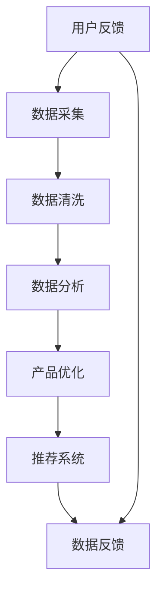

                 

# 知识付费创业中的用户反馈收集与应用

## 1. 背景介绍

在知识付费迅速发展的当下，用户反馈作为衡量产品满意度的重要依据，对知识付费创业的成功与否至关重要。用户反馈不仅能帮助创业者理解市场需求，优化产品服务，还能为内容的创作和迭代提供重要参考。然而，如何高效、精准地收集和应用用户反馈，是大数据和人工智能领域的核心挑战之一。本文旨在深入探讨知识付费创业中用户反馈的收集与应用，为相关从业者提供可行的实践方案和技术思路。

## 2. 核心概念与联系

### 2.1 核心概念概述

在知识付费创业的背景下，用户反馈收集与应用的各个环节紧密相连，共同构成了一个复杂的系统。下面我们将介绍几个核心概念，并阐述它们之间的联系：

1. **用户反馈**：用户在使用知识付费产品过程中产生的评价、建议、投诉等信息。

2. **数据采集**：通过各种方式收集用户反馈数据的流程。

3. **数据清洗**：对采集到的数据进行去重、格式化、过滤等处理，确保数据质量。

4. **数据分析**：利用统计、机器学习等方法，分析用户反馈数据，提取有价值的信息。

5. **产品优化**：基于数据分析结果，对知识付费产品进行功能改进、内容优化、用户体验提升等。

6. **推荐系统**：使用机器学习算法，为用户提供个性化的知识推荐，提升用户满意度和粘性。

这些概念通过数据流贯穿用户反馈收集和应用的各个环节，形成一个闭环的系统，确保反馈的有效利用和产品的高质量迭代。

### 2.2 核心概念原理和架构的 Mermaid 流程图



这个流程图展示了用户反馈从采集到应用的整体流程，其中数据清洗、数据分析和产品优化是核心环节。推荐系统通过优化后的数据，进一步提升用户体验，形成闭环。

## 3. 核心算法原理 & 具体操作步骤

### 3.1 算法原理概述

知识付费产品中用户反馈的收集与应用，主要依赖于数据挖掘、自然语言处理（NLP）和推荐系统等技术。通过这些技术的融合，可以实现对用户反馈的有效处理和应用。

- **数据挖掘**：通过统计分析、文本挖掘等方法，从海量的用户反馈中提取有价值的信息。

- **自然语言处理（NLP）**：利用NLP技术对用户反馈进行文本分析，包括情感分析、主题建模、实体识别等，以便更好地理解用户需求和意见。

- **推荐系统**：通过用户反馈分析结果，结合用户历史行为数据，构建推荐模型，为用户提供个性化的知识推荐服务。

这些技术共同构成了一个数据驱动的反馈应用体系，帮助知识付费创业者提升产品竞争力，满足用户多样化需求。

### 3.2 算法步骤详解

用户反馈的收集与应用主要包括以下步骤：

1. **数据采集**：通过用户评论、评分、私信、社交媒体等多种渠道收集用户反馈数据。

2. **数据清洗**：对采集到的数据进行去重、格式化、过滤等处理，确保数据质量。

3. **数据分析**：利用NLP技术对用户反馈进行情感分析、主题建模等处理，提取有价值的信息。

4. **产品优化**：基于分析结果，优化产品功能、内容、用户体验等，满足用户需求。

5. **推荐系统构建**：使用机器学习算法，构建个性化推荐模型，提升用户满意度和粘性。

6. **反馈循环**：收集用户对优化后的产品反馈，形成闭环，持续改进。

### 3.3 算法优缺点

**优点**：
1. **全面覆盖**：通过多种数据采集渠道，全面了解用户需求。
2. **自动化处理**：利用NLP和机器学习技术，实现自动化的数据分析和产品优化。
3. **个性化推荐**：基于用户反馈和历史行为，提供个性化推荐，提升用户体验。

**缺点**：
1. **数据隐私**：用户反馈可能涉及隐私信息，需严格保护。
2. **数据质量**：数据采集和清洗过程中，可能存在噪音和误差。
3. **算法复杂性**：NLP和机器学习算法复杂，需专业的技术人员支持。

### 3.4 算法应用领域

用户反馈收集与应用技术在知识付费创业中具有广泛的应用场景，包括：

1. **课程优化**：通过用户反馈，优化课程内容和结构，提升学习效果。

2. **内容推荐**：根据用户反馈，调整内容推荐算法，提升用户粘性和满意度。

3. **用户体验提升**：通过用户反馈，改进界面设计和交互方式，提升用户体验。

4. **广告和营销**：利用用户反馈数据，优化广告投放策略和营销活动，提升转化率。

## 4. 数学模型和公式 & 详细讲解 & 举例说明

### 4.1 数学模型构建

本节将使用数学语言对用户反馈收集与应用的各个环节进行建模。

假设用户反馈数据集为 $D = \{(x_i, y_i)\}_{i=1}^N$，其中 $x_i$ 表示用户反馈，$y_i$ 表示用户对反馈的情绪标签（如满意、不满意）。

### 4.2 公式推导过程

**情感分析**：
情感分析是用户反馈分析的核心环节，通过NLP技术对用户反馈进行情感分类，建模如下：

$$
\text{Sentiment} = \max(\text{Positive}, \text{Negative})
$$

其中，$\text{Positive}$ 和 $\text{Negative}$ 表示正面和负面情绪的得分。

**主题建模**：
主题建模用于提取用户反馈中的主要话题，建模如下：

$$
\text{Topics} = \text{LDA}(D)
$$

其中，$\text{LDA}$ 表示潜在狄利克雷分布算法，用于从文本中识别主题。

**用户行为分析**：
用户行为分析旨在理解用户的使用习惯和偏好，建模如下：

$$
\text{User Behavior} = \text{UserLogAnalysis}(D)
$$

其中，$\text{UserLogAnalysis}$ 表示用户日志分析算法。

### 4.3 案例分析与讲解

以某知识付费平台为例，分析如何通过用户反馈收集与应用提升产品性能：

1. **情感分析**：通过情感分析，识别用户对课程的满意度。如果某一课程满意度低，则需进一步分析原因，如内容质量、教师讲解等，进行优化。

2. **主题建模**：通过主题建模，提取用户关注的主要话题，如“课程难度”、“教学风格”等，据此调整课程设计。

3. **用户行为分析**：通过用户行为分析，了解用户活跃时间、偏好的内容类型等信息，优化推荐系统，提升用户粘性。

## 5. 项目实践：代码实例和详细解释说明

### 5.1 开发环境搭建

为了实现用户反馈的收集与应用，需要搭建合适的开发环境。以下是Python开发环境的搭建步骤：

1. 安装Python 3.x，推荐使用Anaconda或Miniconda。
2. 创建虚拟环境，例如：

   ```bash
   conda create --name feedback-environment python=3.8
   conda activate feedback-environment
   ```

3. 安装相关库，例如：

   ```bash
   pip install pandas numpy scikit-learn tensorflow transformers
   ```

### 5.2 源代码详细实现

以下是一个简单的用户反馈收集与分析的Python代码实现：

```python
import pandas as pd
from sklearn.feature_extraction.text import TfidfVectorizer
from sklearn.decomposition import LatentDirichletAllocation
from transformers import pipeline

# 用户反馈数据
data = pd.read_csv('user_feedback.csv')

# 情感分析
nlp = pipeline('sentiment-analysis')
sentiments = nlp(data['feedback'])
df['sentiment'] = [sent['label'] for sent in sentiments]

# 主题建模
tfidf = TfidfVectorizer()
X = tfidf.fit_transform(data['feedback'])
lda = LatentDirichletAllocation(n_components=10, max_iter=10, learning_method='online', learning_offset=50.0)
LDA = lda.fit(X.toarray())
df['topics'] = [', '.join([word for word in topic]) for topic in LDA.components_]

# 用户行为分析
# 示例：分析用户活跃时间
# TODO: 根据实际需求进行分析和建模
```

### 5.3 代码解读与分析

- **数据加载**：使用pandas库读取用户反馈数据。
- **情感分析**：使用transformers库的sentiment-analysis模型进行情感分类。
- **主题建模**：使用scikit-learn库的LatentDirichletAllocation模型进行主题建模。
- **用户行为分析**：根据实际需求，对用户行为数据进行分析，如用户活跃时间等。

### 5.4 运行结果展示

```python
import matplotlib.pyplot as plt

# 情感分析结果可视化
sentiments['positive'].value_counts().plot(kind='bar', figsize=(10, 5))
plt.title('User Feedback Sentiment Analysis')
plt.xlabel('Sentiment')
plt.ylabel('Count')
plt.show()

# 主题建模结果可视化
topics = LDA.components_[0]
terms = tfidf.get_feature_names_out()
top_topics = [terms[i] for i in topics.argsort()[:-11:-1]]
plt.figure(figsize=(10, 5))
plt.barh(top_topics, topics, color='skyblue')
plt.title('Top 10 Topics in User Feedback')
plt.xlabel('Topic Score')
plt.show()
```

通过上述代码，可以直观地展示情感分析和主题建模的结果，帮助创业者理解用户反馈中的主要情绪和关注点。

## 6. 实际应用场景

### 6.1 课程优化

某知识付费平台通过用户反馈收集与应用，优化了其热门课程《Python高级编程》。具体步骤如下：

1. **数据采集**：收集用户在课程中的反馈，包括评分、评论等。
2. **数据清洗**：清洗数据，去除噪声和重复信息。
3. **情感分析**：使用NLP模型分析用户反馈，发现大部分用户对课程难度表示满意，但对部分内容讲解存在意见。
4. **主题建模**：通过主题建模，识别用户关注的主要话题，如“代码运行”、“函数调用”等。
5. **课程优化**：根据情感分析和主题建模结果，优化课程内容，如增加代码运行示例、详细讲解函数调用等。

优化后的课程获得了更高的用户评分和更广泛的传播。

### 6.2 内容推荐

某知识付费平台通过用户反馈分析，优化了其个性化推荐系统。具体步骤如下：

1. **数据采集**：收集用户的使用日志，包括课程浏览、购买、评论等。
2. **数据清洗**：清洗数据，去除噪声和重复信息。
3. **用户行为分析**：通过用户日志分析，发现大部分用户对技术类课程表现活跃。
4. **推荐模型优化**：基于用户行为分析结果，调整推荐算法，优先推荐技术类课程。
5. **效果评估**：通过A/B测试，发现优化后的推荐系统增加了用户粘性，提升了平台收入。

## 7. 工具和资源推荐

### 7.1 学习资源推荐

为了帮助创业者掌握用户反馈收集与应用技术，以下是一些推荐的学习资源：

1. **《Python数据科学手册》**：详细介绍了Python在数据处理、分析、机器学习中的应用。
2. **《自然语言处理入门》**：讲解了NLP基础知识，包括文本处理、情感分析、主题建模等。
3. **《推荐系统实战》**：介绍了推荐系统的基本原理和实现方法，提供了丰富的案例分析。
4. **Coursera的“自然语言处理”课程**：由斯坦福大学教授讲授，深入浅出地介绍了NLP技术。
5. **Kaggle竞赛**：参加Kaggle竞赛，通过实际数据集练习用户反馈分析与处理技能。

### 7.2 开发工具推荐

为了实现高效的用户反馈收集与应用，以下推荐一些常用的开发工具：

1. **Anaconda**：创建和管理虚拟环境，便于Python项目的开发和管理。
2. **Jupyter Notebook**：基于Web的交互式开发环境，适合数据处理和模型调试。
3. **TensorBoard**：用于可视化模型训练过程中的各项指标，便于监控和优化。
4. **ELK Stack**：用于日志收集、存储和分析，支持实时监控和报警。

### 7.3 相关论文推荐

以下几篇论文是用户反馈收集与应用领域的经典之作，推荐阅读：

1. **《用户反馈分析与机器学习》**：讨论了用户反馈分析的基本方法和应用。
2. **《推荐系统理论与实践》**：介绍了推荐系统的基本原理和优化方法。
3. **《NLP中的情感分析与主题建模》**：讲解了情感分析和主题建模的具体技术和算法。

## 8. 总结：未来发展趋势与挑战

### 8.1 研究成果总结

用户反馈收集与应用技术在知识付费创业中已显示出强大的潜力，通过多轮迭代，产品能够更好地满足用户需求，提升用户体验和满意度。该技术在课程优化、内容推荐等领域的应用效果显著，为知识付费平台带来了可观的经济收益。

### 8.2 未来发展趋势

1. **技术融合**：未来用户反馈收集与应用将与其他AI技术如深度学习、强化学习等进行更深入的融合，提升数据处理和分析的效率和准确性。
2. **用户个性化**：随着数据的积累和分析技术的进步，用户个性化推荐将更加精准，提升用户体验。
3. **实时反馈**：实时采集和处理用户反馈，能够快速响应用户需求，提升产品迭代速度。
4. **多渠道反馈**：通过多渠道收集用户反馈，如App、社交媒体、电话等，获得更全面的用户信息。
5. **跨平台应用**：用户反馈收集与应用技术将逐步从单一平台向跨平台应用扩展，提升整体用户满意度。

### 8.3 面临的挑战

尽管用户反馈收集与应用技术在知识付费创业中取得了显著成果，但仍面临以下挑战：

1. **数据隐私**：用户反馈涉及个人隐私，需严格保护。
2. **数据质量**：数据采集和清洗过程中，可能存在噪音和误差。
3. **算法复杂性**：NLP和机器学习算法复杂，需专业的技术人员支持。
4. **用户反馈量不足**：用户反馈量不足时，可能难以获得有价值的分析结果。
5. **用户反馈真实性**：部分用户反馈可能带有主观偏见，影响分析结果。

### 8.4 研究展望

1. **数据隐私保护**：研究如何在使用用户反馈数据时，保护用户隐私，如去标识化处理。
2. **数据质量提升**：研究如何提高数据采集和清洗的准确性，减少噪音和误差。
3. **算法优化**：研究如何优化NLP和机器学习算法，提升数据处理和分析效率。
4. **实时反馈系统**：研究如何构建实时反馈系统，快速响应用户需求。
5. **用户反馈激励机制**：研究如何设计用户反馈激励机制，鼓励用户积极参与反馈。

## 9. 附录：常见问题与解答

**Q1：用户反馈如何有效地转化为产品改进？**

A: 用户反馈需要通过系统化的分析，转化为具体的产品改进措施。例如，通过情感分析识别用户对课程的满意度，通过主题建模了解用户关注的主要话题，从而进行课程优化。

**Q2：如何保证用户反馈的及时性和准确性？**

A: 及时性可以通过实时数据采集和处理系统实现，准确性则需要结合多渠道反馈和用户行为分析，确保反馈的真实性和代表性。

**Q3：如何处理用户反馈中的噪音和误差？**

A: 噪音和误差主要通过数据清洗和预处理来解决。使用先进的算法和工具，如去重、格式化、过滤等，可以有效地去除噪音和误差。

**Q4：用户反馈数据如何安全存储和传输？**

A: 用户反馈数据需通过加密存储和传输，确保数据安全。同时，应遵守相关法律法规，保护用户隐私。

**Q5：如何提升用户反馈数据的利用率？**

A: 通过多渠道数据采集和深入的数据分析，可以提升用户反馈数据的利用率。例如，结合用户行为数据和社交媒体数据，获得更全面的用户信息。

---

作者：禅与计算机程序设计艺术 / Zen and the Art of Computer Programming

