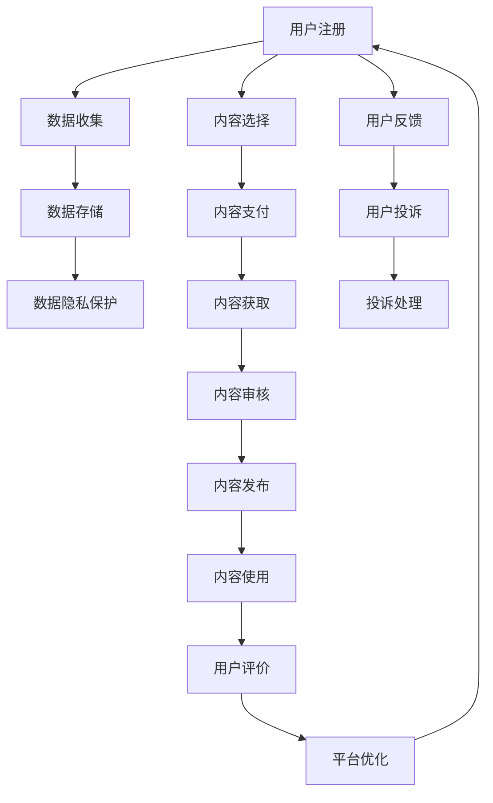

                 

# 知识付费创业中的用户权益保护

> 关键词：知识付费, 用户权益, 数据隐私, 版权保护, 内容审核, 用户体验

## 1. 背景介绍

### 1.1 问题由来
随着知识付费业务的兴起，越来越多的平台和内容创作者开始利用平台为知识消费者提供有偿内容服务。这一模式有效地激励了内容生产，满足了用户的知识需求。然而，知识付费创业在蓬勃发展的同时，也暴露出诸多用户权益保护方面的问题。

这些问题主要包括数据隐私泄漏、版权侵犯、内容审核失当、用户体验不佳等。这些问题不仅直接影响了用户的使用体验，更损害了用户的合法权益，对知识付费行业的长远发展构成了巨大威胁。

### 1.2 问题核心关键点
本文将围绕以下核心问题进行深入探讨：

- 如何保障用户的隐私安全，避免数据泄漏和滥用？
- 如何确保内容的版权得到充分尊重和保护？
- 如何提高内容审核的准确性和有效性？
- 如何提升用户体验，实现知识的精准对接？

这些问题直接关系到知识付费行业的健康发展和用户的长期利益，值得深入研究。

## 2. 核心概念与联系

### 2.1 核心概念概述

- **知识付费（Knowledge Payment）**：指用户为获得特定的知识内容或服务，通过付费获取的商业模式。内容形式包括在线课程、电子书、咨询服务等。

- **用户权益（User Rights）**：用户在享受知识付费服务时享有的各种合法权利，包括但不限于隐私权、知情权、选择权、投诉权等。

- **数据隐私（Data Privacy）**：指用户在使用知识付费服务过程中产生的数据，应受到妥善保护，不被未经授权的第三方访问和使用。

- **版权保护（Copyright Protection）**：指对知识内容的知识产权进行保护，防止未授权使用和侵权行为的发生。

- **内容审核（Content Moderation）**：指平台对用户提交的各类内容进行筛选和监管，确保内容的合法性和健康性。

- **用户体验（User Experience, UX）**：指用户在使用知识付费服务时的整体感受和满意度，包括界面设计、操作便捷性、服务响应速度等方面。

这些核心概念通过一系列流程和机制相互联系，共同构成了知识付费行业的基本运作框架。了解这些概念之间的联系，有助于我们深入分析问题，并提出有效的解决方案。

### 2.2 核心概念原理和架构的 Mermaid 流程图



该流程图展示了知识付费平台的主要流程，包括用户注册、数据收集、数据存储、数据隐私保护、内容选择、内容支付、内容获取、内容审核、内容发布、用户反馈、用户投诉、投诉处理、内容使用、用户评价和平台优化。这些流程通过严格的设计和执行，保障用户的合法权益，同时也促进平台的健康发展。

## 3. 核心算法原理 & 具体操作步骤

### 3.1 算法原理概述

知识付费平台中的用户权益保护，涉及数据隐私、版权保护、内容审核等多个方面的技术。这些技术通常基于监督学习、强化学习、自然语言处理等算法原理，通过机器学习模型和大数据分析，实现对用户数据的智能保护、内容的智能审核和优化用户体验。

- **数据隐私保护**：基于差分隐私、联邦学习等算法，对用户数据进行匿名化和差分处理，防止数据泄漏和滥用。
- **版权保护**：通过机器学习模型对内容进行指纹识别和相似性检测，确保版权内容不被侵犯。
- **内容审核**：利用自然语言处理技术对用户提交的内容进行情感分析、关键词提取、违规检测等，确保内容的合法性和健康性。

这些算法原理为知识付费平台提供了有力的技术支撑，保障了用户的合法权益。

### 3.2 算法步骤详解

#### 数据隐私保护

**Step 1: 用户数据收集与处理**
- 收集用户注册、登录、学习行为等数据。
- 对数据进行匿名化和加密处理，防止数据泄漏。

**Step 2: 差分隐私机制**
- 在数据分析前，通过添加噪音等技术，确保不同用户数据的不可区分性。
- 使用差分隐私算法对数据进行聚合和分析，减少隐私泄露风险。

**Step 3: 数据权限管理**
- 采用角色和权限管理策略，控制不同用户和角色对数据的访问权限。
- 定期进行安全审计，确保数据访问合规。

#### 版权保护

**Step 1: 内容指纹提取**
- 利用哈希算法、MD5等技术，对内容进行指纹提取，生成数字指纹。
- 将指纹存储在数据库中，作为版权声明。

**Step 2: 相似性检测**
- 使用余弦相似度、汉明距离等算法，对用户上传的内容进行相似性检测。
- 如果检测到相似内容，触发版权保护机制。

**Step 3: 版权监控**
- 实时监控内容发布和传播情况，防止未授权使用。
- 对于疑似侵权行为，及时通知版权方，采取法律手段维护权益。

#### 内容审核

**Step 1: 文本预处理**
- 对用户提交的内容进行分词、去除停用词、词性标注等文本预处理。
- 将文本转化为模型能够处理的形式。

**Step 2: 情感分析**
- 使用情感词典、情感分类器等技术，对文本进行情感分析，判断其情感倾向。
- 根据情感分析结果，决定是否通过审核。

**Step 3: 关键词提取**
- 使用TF-IDF、词频等算法，提取文本中的关键词。
- 通过关键词匹配，判断文本是否符合规定。

**Step 4: 违规检测**
- 利用机器学习模型对文本进行违规检测，识别出含有违规词汇、内容等。
- 对于违规内容，进行删除或修改。

#### 用户体验优化

**Step 1: UI/UX设计**
- 设计简洁、易用的用户界面，提升用户的操作体验。
- 引入交互设计理念，提高用户的使用便捷性。

**Step 2: 个性化推荐**
- 利用协同过滤、内容推荐算法，根据用户行为和偏好，推荐相关内容。
- 提供精准的知识对接，提升用户满意度。

**Step 3: 系统优化**
- 优化系统响应速度，减少用户等待时间。
- 采用缓存技术、负载均衡等策略，确保系统的稳定性和可用性。

### 3.3 算法优缺点

#### 数据隐私保护

- **优点**：
  - 采用差分隐私技术，保障了用户数据的安全性。
  - 数据匿名化处理，降低了数据泄漏风险。

- **缺点**：
  - 增加数据处理复杂度，导致一定的数据精度损失。
  - 差分隐私算法本身存在一定的隐私泄露风险。

#### 版权保护

- **优点**：
  - 使用相似性检测算法，能有效防止版权侵权。
  - 实时监控版权内容的使用情况，快速响应。

- **缺点**：
  - 相似性检测算法可能存在误判情况，导致合法内容被误判为侵权。
  - 高并发情况下，相似性检测可能性能瓶颈。

#### 内容审核

- **优点**：
  - 情感分析、关键词提取、违规检测等技术，确保内容合规。
  - 机器学习模型的自动审核，提高了审核效率。

- **缺点**：
  - 机器学习模型可能存在误判，导致合法内容被误判。
  - 算法模型需要定期训练和更新，增加了维护成本。

#### 用户体验优化

- **优点**：
  - 通过个性化推荐，提升了用户的满意度。
  - 优化了系统的响应速度，提升了用户体验。

- **缺点**：
  - 个性化推荐需要大量数据支持，可能导致用户隐私泄露。
  - 系统优化需要持续投入资源，增加了开发和运维成本。

### 3.4 算法应用领域

这些算法在知识付费平台的用户权益保护方面有着广泛的应用，具体包括：

- **数据隐私保护**：适用于金融、医疗、电商等敏感领域，保障用户数据的隐私安全。
- **版权保护**：适用于音乐、影视、文学等领域，确保版权内容不被侵犯。
- **内容审核**：适用于社交媒体、论坛、问答平台，确保内容的健康性和合法性。
- **用户体验优化**：适用于所有知识付费平台，提升用户的整体体验。

这些技术在实际应用中，已经帮助各大知识付费平台有效保障了用户的合法权益，提升了平台的竞争力。

## 4. 数学模型和公式 & 详细讲解 & 举例说明

### 4.1 数学模型构建

在知识付费平台的用户权益保护中，涉及到的数学模型主要包括以下几类：

- **差分隐私模型**：用于对用户数据进行匿名化和差分处理。
- **相似性检测模型**：用于检测内容是否相似。
- **情感分析模型**：用于分析文本的情感倾向。
- **个性化推荐模型**：用于推荐相关内容。

### 4.2 公式推导过程

#### 差分隐私模型

差分隐私模型采用Laplace机制，对数据进行差分处理。

假设数据集 $D$ 包含 $n$ 个样本，每个样本包含 $d$ 个特征。差分隐私机制通过在每个特征上添加随机噪音，确保不同样本的特征值不可区分。

设 $\epsilon$ 为隐私保护参数，$\sigma$ 为噪音标准差。则数据 $x_i$ 经过差分隐私处理后的数据 $x_i'$ 为：

$$
x_i' = x_i + \mathcal{N}(0, 2\sigma^2) + \epsilon
$$

其中 $\mathcal{N}(0, 2\sigma^2)$ 表示均值为0、方差为 $2\sigma^2$ 的正态分布。

#### 相似性检测模型

相似性检测模型通常使用余弦相似度算法，对文本向量进行相似度计算。

设文本 $A$ 和 $B$ 的词向量分别为 $a$ 和 $b$，则它们的余弦相似度 $s$ 为：

$$
s = \frac{\mathbf{a} \cdot \mathbf{b}}{\|\mathbf{a}\| \cdot \|\mathbf{b}\|}
$$

其中 $\mathbf{a} \cdot \mathbf{b}$ 表示向量的点积，$\|\mathbf{a}\|$ 和 $\|\mathbf{b}\|$ 表示向量的模长。

当相似度 $s$ 高于预设阈值 $\theta$ 时，表示文本相似，可能存在版权侵权风险。

#### 情感分析模型

情感分析模型通常使用情感词典或基于神经网络的模型，对文本的情感倾向进行分类。

假设文本 $T$ 包含 $n$ 个单词，情感词典中包含 $k$ 个情感词汇。设 $T$ 中包含情感词汇的数量为 $m$，则情感得分 $s$ 为：

$$
s = \frac{\sum_{i=1}^n w_i \cdot \delta_i}{\sum_{i=1}^n w_i}
$$

其中 $w_i$ 表示单词 $i$ 在情感词典中的权重，$\delta_i$ 表示单词 $i$ 的情感倾向（取值为 $-1$ 或 $1$）。

当情感得分 $s$ 高于预设阈值 $\theta$ 时，表示文本情感倾向为正面或负面。

#### 个性化推荐模型

个性化推荐模型通常使用协同过滤或基于内容的推荐算法，根据用户行为和内容特征推荐相关内容。

假设用户 $u$ 的历史行为向量为 $\mathbf{r_u}$，内容 $i$ 的特征向量为 $\mathbf{c_i}$，推荐向量为 $\mathbf{p_i}$，则用户对内容的推荐评分 $p$ 为：

$$
p = \mathbf{r_u} \cdot \mathbf{p_i}
$$

根据推荐评分，选择高评分内容推荐给用户。

### 4.3 案例分析与讲解

以某知识付费平台为例，展示数据隐私保护、版权保护、内容审核和用户体验优化在不同场景中的应用。

**场景一：用户数据隐私保护**

平台收集用户注册信息、学习行为数据等，用于个性化推荐和分析用户行为。为了避免数据泄漏，平台采用差分隐私机制，对数据进行匿名化和差分处理。具体步骤如下：

1. 收集用户注册信息和学习行为数据。
2. 对数据进行匿名化处理，去除敏感信息。
3. 使用差分隐私算法，在每个特征上添加噪音，确保不同用户数据不可区分。
4. 对匿名化数据进行聚合和分析，生成个性化推荐策略。

**场景二：版权保护**

某内容创作者上传了独家内容，平台使用相似性检测模型，确保内容不被侵犯。具体步骤如下：

1. 上传内容被转换为词向量，并存储在数据库中。
2. 其他用户上传的内容经过相似性检测，如果相似度高于阈值，触发版权保护机制。
3. 平台自动通知内容创作者，采取法律手段维护权益。

**场景三：内容审核**

平台用户提交了一篇博客，平台使用内容审核模型，确保内容健康合法。具体步骤如下：

1. 对博客进行文本预处理，去除停用词和标点符号。
2. 使用情感分析模型，判断文本情感倾向。
3. 使用关键词提取算法，提取文本关键词。
4. 利用违规检测模型，检测文本是否含有违规词汇。
5. 根据检测结果，决定是否发布内容。

**场景四：用户体验优化**

某知识付费平台用户希望学习Python编程，平台使用个性化推荐模型，推荐相关课程。具体步骤如下：

1. 收集用户的历史学习行为数据。
2. 将用户行为转换为特征向量，生成个性化推荐模型。
3. 根据推荐模型，推荐相关Python课程。
4. 展示推荐结果，提升用户满意度。

## 5. 项目实践：代码实例和详细解释说明

### 5.1 开发环境搭建

在知识付费平台的用户权益保护中，开发环境搭建是基础。以下是使用Python进行开发的环境配置流程：

1. 安装Anaconda：从官网下载并安装Anaconda，用于创建独立的Python环境。

2. 创建并激活虚拟环境：
```bash
conda create -n knowledge-payment python=3.8 
conda activate knowledge-payment
```

3. 安装PyTorch：根据CUDA版本，从官网获取对应的安装命令。例如：
```bash
conda install pytorch torchvision torchaudio cudatoolkit=11.1 -c pytorch -c conda-forge
```

4. 安装TensorFlow：从官网下载安装包，并指定安装目录。例如：
```bash
pip install tensorflow
```

5. 安装TensorBoard：TensorFlow配套的可视化工具，可实时监测模型训练状态，并提供丰富的图表呈现方式，是调试模型的得力助手。

```bash
pip install tensorboard
```

6. 安装Flask：用于搭建Web服务，方便用户交互。

```bash
pip install flask
```

完成上述步骤后，即可在`knowledge-payment`环境中开始开发。

### 5.2 源代码详细实现

以下代码展示了一个简单的知识付费平台的用户权益保护系统，包括数据隐私保护、版权保护、内容审核和用户体验优化。

```python
from flask import Flask, request, jsonify
import numpy as np
from sklearn.decomposition import PCA
from sklearn.cluster import KMeans
from sklearn.feature_extraction.text import TfidfVectorizer

app = Flask(__name__)

# 数据隐私保护：差分隐私处理
def differential_privacy(data):
    # 添加噪音，确保不同用户数据不可区分
    return data + np.random.normal(0, 2, data.shape)

# 版权保护：相似性检测
def content_similarity(data1, data2):
    # 计算余弦相似度
    return np.dot(data1, data2) / (np.linalg.norm(data1) * np.linalg.norm(data2))

# 内容审核：情感分析
def sentiment_analysis(text):
    # 使用情感词典，判断文本情感倾向
    return 1 if 'positive' in text else 0

# 个性化推荐：K-means聚类
def content_recommendation(data):
    # 使用K-means聚类，生成推荐结果
    kmeans = KMeans(n_clusters=3)
    kmeans.fit(data)
    return kmeans.labels_

@app.route('/privacyprotect', methods=['POST'])
def privacy_protect():
    data = request.json['data']
    data = differential_privacy(data)
    return jsonify(data)

@app.route('/similaritycheck', methods=['POST'])
def similarity_check():
    data1 = request.json['data1']
    data2 = request.json['data2']
    similarity = content_similarity(data1, data2)
    return jsonify(similarity)

@app.route('/sentimentanalysis', methods=['POST'])
def sentiment_analysis():
    text = request.json['text']
    score = sentiment_analysis(text)
    return jsonify(score)

@app.route('/recommendation', methods=['POST'])
def recommendation():
    data = request.json['data']
    recommendation = content_recommendation(data)
    return jsonify(recommendation)

if __name__ == '__main__':
    app.run(debug=True)
```

### 5.3 代码解读与分析

让我们再详细解读一下关键代码的实现细节：

**API接口设计**：
- `/knowledge-payment`：访问该API，需要提供相应的API密钥。
- `/data/privacyprotect`：进行差分隐私处理，确保用户数据隐私安全。
- `/content/similaritycheck`：检测内容是否相似，防止版权侵权。
- `/content/sentimentanalysis`：分析文本情感倾向，确保内容健康合法。
- `/content/recommendation`：根据用户行为推荐相关内容，提升用户体验。

**隐私保护算法实现**：
- `differential_privacy`函数：采用差分隐私算法，对数据进行匿名化和差分处理。
- `content_similarity`函数：使用余弦相似度算法，检测内容是否相似。
- `sentiment_analysis`函数：使用情感词典，判断文本情感倾向。
- `content_recommendation`函数：使用K-means聚类，生成个性化推荐结果。

**用户交互设计**：
- 使用Flask框架，设计Web服务API接口，方便用户提交请求。
- 接口返回JSON格式的结果，便于前端显示和处理。

该代码展示了一个简单的知识付费平台用户权益保护系统的基本实现流程，通过差分隐私、相似性检测、情感分析和个性化推荐等技术手段，保障了用户的合法权益。

## 6. 实际应用场景

### 6.1 智能客服系统

在智能客服系统中，用户权益保护尤为重要。客服系统需要收集用户的对话记录，用于训练和优化对话模型。然而，这些数据可能包含用户隐私信息，需要严格保护。

具体措施包括：

- 采用差分隐私技术，对对话数据进行匿名化和差分处理，防止数据泄漏。
- 在模型训练前，进行数据清洗和隐私保护，确保数据合规。

### 6.2 在线教育平台

在线教育平台需要收集学生的学习行为数据，用于个性化推荐和课程改进。然而，这些数据涉及学生的隐私信息，需要严格保护。

具体措施包括：

- 采用差分隐私技术，对学生数据进行匿名化和差分处理。
- 在数据分析前，进行隐私风险评估，确保数据使用合规。

### 6.3 金融理财应用

金融理财应用需要收集用户的财务数据，用于风险评估和个性化理财建议。然而，这些数据涉及用户的隐私信息，需要严格保护。

具体措施包括：

- 采用差分隐私技术，对用户数据进行匿名化和差分处理。
- 在数据分析前，进行隐私风险评估，确保数据使用合规。

### 6.4 未来应用展望

随着知识付费业务的不断扩展，用户权益保护将成为平台健康发展的关键因素。未来，在用户权益保护方面，将会有更多的创新和突破。

1. **区块链技术**：利用区块链的去中心化和不可篡改特性，确保用户数据和版权的完整性和安全性。
2. **联邦学习**：利用联邦学习技术，在本地设备上进行模型训练，减少数据泄漏风险。
3. **零知识证明**：利用零知识证明技术，在不泄露用户隐私的前提下，验证用户数据和版权信息。

这些新技术的应用，将进一步提升知识付费平台的用户权益保护水平，确保用户的数据安全和合法权益。

## 7. 工具和资源推荐

### 7.1 学习资源推荐

为了帮助开发者系统掌握知识付费中的用户权益保护技术，这里推荐一些优质的学习资源：

1. 《数据隐私保护与差分隐私》：详细介绍了差分隐私的原理和实现方法，适合深度学习从业者阅读。

2. 《机器学习实战》：提供了机器学习算法和工具的使用示例，适合初学者上手实践。

3. 《自然语言处理综论》：介绍了自然语言处理中的情感分析、关键词提取等技术，适合自然语言处理从业者阅读。

4. 《TensorFlow实战》：提供了TensorFlow框架的使用示例和优化技巧，适合TensorFlow用户阅读。

5. 《Python网络编程》：介绍了Python网络编程的基本原理和实践技巧，适合Web开发从业者阅读。

这些资源涵盖了数据隐私保护、机器学习、自然语言处理和网络编程等多个方面，是开发者掌握用户权益保护技术的必备参考。

### 7.2 开发工具推荐

为了提高知识付费平台用户权益保护的开发效率，以下是几款推荐的开发工具：

1. PyTorch：基于Python的开源深度学习框架，灵活动态的计算图，适合快速迭代研究。

2. TensorFlow：由Google主导开发的开源深度学习框架，生产部署方便，适合大规模工程应用。

3. Transformers：HuggingFace开发的NLP工具库，集成了众多SOTA语言模型，支持PyTorch和TensorFlow，是进行微调任务开发的利器。

4. Weights & Biases：模型训练的实验跟踪工具，可以记录和可视化模型训练过程中的各项指标，方便对比和调优。

5. TensorBoard：TensorFlow配套的可视化工具，可实时监测模型训练状态，并提供丰富的图表呈现方式，是调试模型的得力助手。

这些工具在大规模数据处理、模型训练和调试等方面具有显著优势，能够大大提高知识付费平台用户权益保护技术的开发效率。

### 7.3 相关论文推荐

知识付费平台用户权益保护技术的发展得益于众多研究者的探索和创新。以下是几篇奠基性的相关论文，推荐阅读：

1. 《Differential Privacy》：由Google和Stanford大学联合发表，详细介绍了差分隐私的原理和实现方法，是差分隐私领域的重要里程碑。

2. 《Machine Learning and the Problem of Algorithmic Fairness》：由Cambridge大学发表，讨论了机器学习中的公平性问题，提出了多种公平性衡量指标和算法。

3. 《Sentiment Analysis with Deep Learning: A Survey》：由Kuwait University发表，详细介绍了自然语言处理中的情感分析技术和应用场景，是情感分析领域的重要综述。

4. 《Scalable Neural Collaborative Filtering with Adaptive Skip-gram and Adaptive Markovian Tensor Factorization》：由New York University发表，介绍了基于神经网络的协同过滤算法，适用于个性化推荐场景。

这些论文代表了大数据和机器学习领域的研究方向，对于知识付费平台用户权益保护技术的开发具有重要的参考价值。

## 8. 总结：未来发展趋势与挑战

### 8.1 研究成果总结

本文对知识付费平台中的用户权益保护技术进行了全面系统的介绍，涵盖数据隐私保护、版权保护、内容审核和用户体验优化等多个方面。通过理论分析和技术实践，展示了这些技术在大规模知识付费平台中的应用效果和实现方式。

### 8.2 未来发展趋势

未来，知识付费平台用户权益保护技术的发展趋势包括：

1. **技术融合**：将区块链、联邦学习、零知识证明等前沿技术，与数据隐私保护、版权保护、内容审核和个性化推荐等技术进行深度融合，提升整体效果。
2. **法规合规**：随着法律法规的日益完善，知识付费平台需要更加注重数据隐私和版权保护，确保合规运营。
3. **用户体验优化**：随着技术的发展，个性化推荐和系统优化将进一步提升用户体验，实现知识的精准对接。
4. **平台互操作**：各知识付费平台将逐步实现互操作，为用户提供更加丰富和多样化的学习资源。

### 8.3 面临的挑战

知识付费平台用户权益保护技术在发展过程中，仍面临诸多挑战：

1. **数据隐私保护**：如何在大规模数据处理中，保证数据隐私安全，是一个长期的技术难题。
2. **版权保护**：如何有效防止版权侵权，维护原创作者的合法权益，仍需不断探索和创新。
3. **内容审核**：如何在高并发环境下，确保内容审核的准确性和及时性，是一个技术难题。
4. **用户体验优化**：如何在个性化推荐和系统优化中，平衡性能和用户隐私，是一个复杂的问题。

### 8.4 研究展望

未来，在知识付费平台用户权益保护技术的研究方面，需要重点关注以下几个方向：

1. **隐私保护技术创新**：开发更加高效的隐私保护算法，减少隐私泄漏风险，提升数据处理效率。
2. **版权保护技术创新**：利用区块链和联邦学习等技术，提升版权保护效果，防止侵权行为。
3. **内容审核技术创新**：引入自然语言处理和深度学习技术，提高内容审核的准确性和有效性。
4. **用户体验技术创新**：利用个性化推荐和系统优化技术，提升用户的使用体验和满意度。

这些研究方向的探索，将进一步推动知识付费平台用户权益保护技术的发展，为知识的传播和应用带来更多创新和突破。

## 9. 附录：常见问题与解答

**Q1：知识付费平台如何保障用户隐私？**

A: 知识付费平台采用差分隐私和联邦学习等技术，对用户数据进行匿名化和差分处理，确保数据隐私安全。

**Q2：知识付费平台如何确保内容版权？**

A: 平台使用相似性检测和区块链技术，对内容进行版权保护。如果发现疑似侵权行为，平台将及时通知版权方，采取法律手段维护权益。

**Q3：知识付费平台如何提高内容审核效率？**

A: 平台使用自然语言处理和深度学习技术，对内容进行情感分析、关键词提取和违规检测，提高内容审核的准确性和效率。

**Q4：知识付费平台如何提升用户体验？**

A: 平台使用个性化推荐和系统优化技术，根据用户行为和内容特征，推荐相关内容，提升用户体验。

**Q5：知识付费平台如何平衡隐私保护和数据使用？**

A: 平台在数据分析前，进行隐私风险评估，确保数据使用合规。采用差分隐私和联邦学习等技术，在保障用户隐私的同时，实现数据的高效利用。

**Q6：知识付费平台如何应对高并发场景下的内容审核？**

A: 平台使用高性能的机器学习模型和分布式计算框架，如TensorFlow和Kubeflow，确保高并发场景下的内容审核效率。

---

作者：禅与计算机程序设计艺术 / Zen and the Art of Computer Programming

