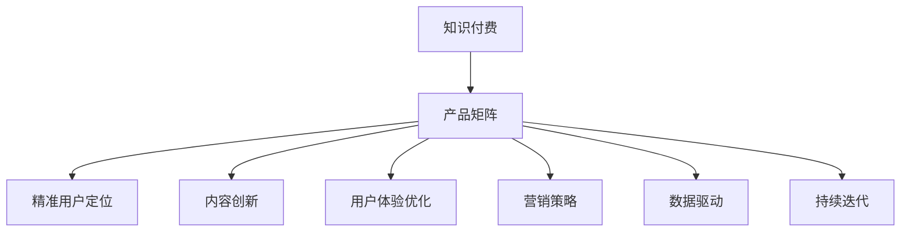
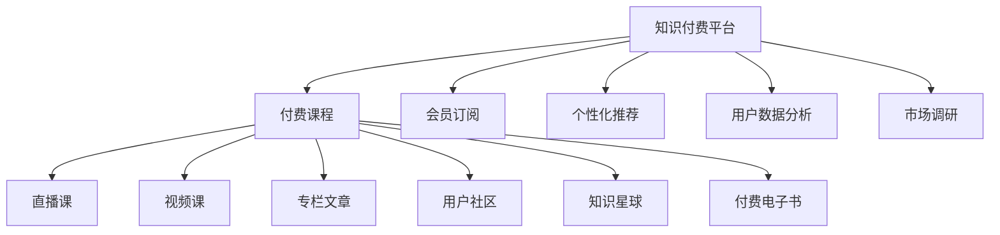

                 

# 知识付费创业的产品矩阵构建

> 关键词：知识付费, 产品矩阵, 精准用户定位, 内容创新, 用户体验, 营销策略, 数据驱动, 持续迭代

## 1. 背景介绍

### 1.1 问题由来

随着知识经济时代的到来，人们对于知识的需求日益增长，知识付费行业应运而生，成为新媒体内容创业的新风口。然而，知识付费市场的竞争日益激烈，用户需求不断变化，如何构建一个既能吸引用户又能持续创造价值的产品矩阵，成为了知识付费创业者亟待解决的问题。

### 1.2 问题核心关键点

产品矩阵构建的核心在于：
1. **精准用户定位**：明确目标用户群体的需求和行为特点，设计符合用户需求的个性化内容。
2. **内容创新**：不断推出高质量、有深度的内容，保持对用户的吸引力。
3. **用户体验优化**：提升产品的易用性、互动性，增加用户粘性。
4. **营销策略**：通过精准营销和内容营销，吸引和留存用户。
5. **数据驱动**：利用数据分析指导产品迭代和优化。
6. **持续迭代**：不断根据市场反馈和用户需求调整产品策略，提升产品竞争力。

### 1.3 问题研究意义

构建高效的知识付费产品矩阵，不仅有助于提高用户满意度和留存率，还能为平台带来更多的收入来源。通过精准的产品设计和持续的优化迭代，可以有效提升平台的市场竞争力和盈利能力。

## 2. 核心概念与联系

### 2.1 核心概念概述

为更好地理解产品矩阵构建的理论和实践，本节将介绍几个关键概念：

- **知识付费**：通过付费形式获取知识、技能、信息等，帮助用户解决问题、提升自我价值的一种新兴内容消费模式。
- **产品矩阵**：根据用户需求和市场竞争，设计多个相互关联、互补的产品，形成完整的知识服务体系。
- **精准用户定位**：通过数据分析和用户调研，明确目标用户的特征和需求，实现内容定制化和个性化。
- **内容创新**：持续推出有深度、有价值的内容，保持用户对平台的长期兴趣。
- **用户体验优化**：提升产品的易用性和互动性，增加用户粘性，提升用户满意度。
- **营销策略**：通过精准营销和内容营销，吸引新用户并提高用户留存率。
- **数据驱动**：利用数据分析指导产品迭代和优化，提升产品市场竞争力。
- **持续迭代**：通过不断的市场反馈和用户需求分析，持续优化产品，满足用户不断变化的需求。

这些概念之间通过以下Mermaid流程图展示其逻辑关系：



这个流程图展示了这个体系中各个环节之间的关系：

1. **知识付费**是基础，是整个产品矩阵构建的出发点和目标。
2. **产品矩阵**是基于知识付费的目标，设计多个相互关联、互补的产品，形成一个完整的知识服务体系。
3. **精准用户定位**、**内容创新**、**用户体验优化**、**营销策略**、**数据驱动**和**持续迭代**，是构建高效产品矩阵的关键要素，相互支持，形成闭环。

## 3. 核心算法原理 & 具体操作步骤

### 3.1 算法原理概述

构建高效的知识付费产品矩阵，涉及到多个维度的算法和策略，包括精准用户定位、内容推荐、价格策略等。这些算法和策略的组合应用，可以形成一套完整的产品构建体系。

- **精准用户定位算法**：利用用户行为数据和调研结果，对用户进行分群和画像分析，找出目标用户群体。
- **内容推荐算法**：根据用户画像和内容标签，推荐符合用户需求的高质量内容。
- **价格策略算法**：通过定价模型，确定内容的市场定价，吸引用户订阅。

### 3.2 算法步骤详解

#### 3.2.1 精准用户定位算法

**步骤一：数据收集与清洗**

收集用户的基本信息、行为数据和调研问卷结果，进行清洗和预处理。常见的数据来源包括：

- **基本信息**：年龄、性别、职业、教育背景等。
- **行为数据**：浏览记录、订阅记录、付费记录等。
- **调研问卷**：通过问卷调查获取用户对内容类型、形式、推荐机制等方面的偏好。

**步骤二：用户画像分析**

通过数据挖掘和机器学习算法，对用户进行聚类分析，形成用户画像。常见的聚类算法包括K-means、层次聚类等。

- **K-means聚类**：将用户分为若干类，每类用户具有相似的行为和需求特点。
- **层次聚类**：对用户进行分层，形成从泛化到细分的多层用户群体。

**步骤三：特征工程**

选择有代表性的用户特征，构建特征向量，用于后续的推荐和定价算法。常见的用户特征包括：

- **行为特征**：浏览时长、付费频率、内容互动等。
- **人口统计特征**：年龄、性别、职业等。
- **兴趣特征**：内容偏好、主题兴趣等。

**步骤四：模型训练**

使用机器学习算法，对用户画像和特征进行训练，构建精准的用户定位模型。常见的算法包括随机森林、逻辑回归、支持向量机等。

- **随机森林**：通过集成学习，提升模型的准确性和鲁棒性。
- **逻辑回归**：用于分类任务，判断用户是否属于目标群体。
- **支持向量机**：通过核函数映射，实现非线性分类。

#### 3.2.2 内容推荐算法

**步骤一：内容标签提取**

对平台上的内容进行标签提取，形成内容标签库。常见的标签提取方法包括：

- **TF-IDF**：基于词频和逆文档频率，提取关键词作为内容标签。
- **LDA主题模型**：通过主题分析，提取内容的主题标签。

**步骤二：用户画像与内容匹配**

将用户画像与内容标签库进行匹配，找到符合用户需求的内容。常见的匹配算法包括：

- **余弦相似度**：计算用户画像与内容标签的相似度，找出最匹配的内容。
- **协同过滤**：通过分析用户行为数据，推荐相似用户喜欢的内容。

**步骤三：推荐结果排序**

根据内容推荐算法输出的结果，进行排序，优先推荐符合用户需求的内容。常见的排序方法包括：

- **排序算法**：基于用户的互动行为和内容质量，对推荐结果进行排序。
- **推荐系统算法**：结合多维度的评分机制，优化推荐结果的准确性和多样性。

#### 3.2.3 价格策略算法

**步骤一：定价模型构建**

根据成本、市场需求和用户支付意愿，构建定价模型。常见的定价方法包括：

- **成本加成法**：根据内容制作成本和平台运营成本，加上利润率，计算定价。
- **价值定价法**：根据内容价值和市场认可度，设定合理的价格。
- **动态定价**：根据市场需求和竞争情况，动态调整价格。

**步骤二：价格策略优化**

通过数据分析和用户反馈，不断优化价格策略。常见的优化方法包括：

- **A/B测试**：通过A/B测试，找到最优的价格策略。
- **价格弹性分析**：分析价格与用户购买意愿之间的关系，优化定价策略。
- **竞品分析**：分析竞争对手的价格策略，调整定价策略以保持竞争力。

### 3.3 算法优缺点

精准用户定位算法、内容推荐算法和价格策略算法的优缺点如下：

**精准用户定位算法的优点**：
- **用户细分精准**：能够精准识别目标用户群体，实现个性化推荐和服务。
- **需求预测准确**：通过数据分析，预测用户需求，提升用户满意度。

**精准用户定位算法的缺点**：
- **数据隐私问题**：需要收集大量用户数据，可能引发数据隐私和安全问题。
- **模型复杂度高**：算法模型复杂，需要较强的数据处理和计算能力。

**内容推荐算法的优点**：
- **用户体验提升**：通过个性化推荐，提升用户粘性和满意度。
- **内容多样化**：推荐多样化内容，满足用户不同需求。

**内容推荐算法的缺点**：
- **数据偏差**：推荐算法依赖于数据质量，可能存在数据偏差和推荐偏差。
- **计算复杂度高**：需要处理大量数据和计算复杂匹配算法，计算资源消耗大。

**价格策略算法的优点**：
- **市场适应性强**：能够根据市场需求和用户支付意愿，灵活调整价格策略。
- **用户留存率提升**：通过合理定价，提升用户粘性和留存率。

**价格策略算法的缺点**：
- **竞争激烈**：定价策略需要考虑市场竞争，难以实现最优定价。
- **用户心理影响**：定价策略可能影响用户对平台的认知和支付意愿。

### 3.4 算法应用领域

基于精准用户定位、内容推荐和价格策略算法，可以应用于以下知识付费产品矩阵中：

**产品矩阵架构**：


- **付费课程**：平台上的核心产品，包括视频课程、直播课、专栏文章等。通过精准用户定位和内容推荐，满足用户个性化需求，提升课程订阅率。
- **直播课**：实时互动的课程形式，适合需要即时互动和反馈的学习场景。通过直播推荐和定价策略，吸引用户参与。
- **视频课**：预先录制的课程形式，适合自学和离线学习。通过内容推荐和视频标注，提升用户观看体验。
- **专栏文章**：深度文章和专业知识分享，适合深度学习和专业技能提升。通过个性化推荐和用户互动，增加用户粘性。
- **用户社区**：用户之间的交流和分享平台，提升用户参与感和社区活跃度。通过社区互动和内容创作激励，增加用户留存率。
- **知识星球**：以内容付费为基础的社交平台，适合知识分享和社群协作。通过精准用户定位和内容推荐，提升知识星球订阅率。
- **付费电子书**：版权保护的数字书籍，适合系统学习和高效率阅读。通过定价策略和用户评价，提升电子书购买率。
- **会员订阅**：提供会员权益和增值服务，适合需要持续学习、长期使用用户。通过会员推荐和个性化服务，提升会员转化率。
- **个性化推荐**：根据用户画像和行为数据，推荐符合用户需求的内容。通过推荐系统优化，提升用户满意度。
- **用户数据分析**：通过数据挖掘和分析，了解用户需求和行为特点，优化产品策略。
- **市场调研**：分析市场需求和竞争情况，调整产品定位和策略，提升市场竞争力。

## 4. 数学模型和公式 & 详细讲解 & 举例说明

### 4.1 数学模型构建

假设知识付费平台有用户 $U$ 和内容 $C$，通过精准用户定位算法、内容推荐算法和价格策略算法，构建产品矩阵。

- **用户画像模型**：$\text{UserProfile}(u_i)$，其中 $u_i$ 为用户 $i$ 的画像特征。
- **内容标签模型**：$\text{ContentTag}(c_j)$，其中 $c_j$ 为内容 $j$ 的标签特征。
- **用户与内容匹配模型**：$\text{UserContentMatch}(u_i, c_j)$，表示用户 $u_i$ 与内容 $c_j$ 的匹配程度。
- **定价模型**：$\text{Price}(c_j)$，表示内容 $c_j$ 的定价策略。

### 4.2 公式推导过程

**精准用户定位算法**

**步骤一：用户画像模型**

$$
\text{UserProfile}(u_i) = \langle f_1(u_i), f_2(u_i), f_3(u_i), ... \rangle
$$

其中 $f_1, f_2, f_3, ...$ 为不同的用户特征提取函数。

**步骤二：用户画像与内容匹配**

$$
\text{UserContentMatch}(u_i, c_j) = \text{similarity}(\text{UserProfile}(u_i), \text{ContentTag}(c_j))
$$

其中 $\text{similarity}$ 为相似度计算函数，常见的包括余弦相似度、欧式距离等。

**内容推荐算法**

**步骤一：内容标签模型**

$$
\text{ContentTag}(c_j) = \langle t_1(c_j), t_2(c_j), t_3(c_j), ... \rangle
$$

其中 $t_1, t_2, t_3, ...$ 为内容标签，可以通过TF-IDF、LDA等算法提取。

**步骤二：内容推荐**

$$
\text{RecommendedContent}(u_i) = \text{argmax}_{c_j} \text{UserContentMatch}(u_i, c_j)
$$

其中 $\text{RecommendedContent}(u_i)$ 表示用户 $u_i$ 推荐的符合需求的内容。

**价格策略算法**

**步骤一：定价模型**

$$
\text{Price}(c_j) = \text{cost}(c_j) + \text{profit}(c_j) + \text{demand}(c_j)
$$

其中 $\text{cost}(c_j)$ 为内容制作成本，$\text{profit}(c_j)$ 为平台利润，$\text{demand}(c_j)$ 为市场需求。

**步骤二：定价策略优化**

$$
\text{OptimizedPrice}(c_j) = \text{argmin}_{\text{demand}(c_j)} \text{Price}(c_j)
$$

其中 $\text{OptimizedPrice}(c_j)$ 表示最优的定价策略。

### 4.3 案例分析与讲解

假设某知识付费平台拥有大量用户和内容资源，平台希望构建一个高效的产品矩阵。

**步骤一：数据收集**

平台收集了用户的基本信息、行为数据和调研问卷结果，包括年龄、性别、职业、浏览记录、付费记录和内容偏好等。

**步骤二：用户画像分析**

通过K-means聚类算法，将用户分为多个群体，每个群体具有相似的需求和行为特点。例如，将用户分为“初级学习者”、“中级技能提升者”和“高级专业研究者”三个群体。

**步骤三：内容标签提取**

对平台上的内容进行TF-IDF算法提取标签，形成内容标签库，例如“Python编程”、“数据分析”、“机器学习”等。

**步骤四：内容推荐**

根据用户画像和内容标签库，计算用户与内容的匹配度，推荐符合用户需求的内容。例如，对于“中级技能提升者”群体，推荐“Python编程高级课程”、“数据分析实战案例”等。

**步骤五：定价策略**

通过成本加成法，计算课程的定价，并根据市场需求和用户支付意愿进行调整。例如，将“Python编程高级课程”定价为1000元，“数据分析实战案例”定价为800元。

**步骤六：个性化推荐**

根据用户的行为数据和互动情况，对推荐结果进行排序，提升用户满意度。例如，对于“中级技能提升者”用户，优先推荐其互动过的内容，并根据其互动反馈进行动态调整。

## 5. 项目实践：代码实例和详细解释说明

### 5.1 开发环境搭建

在进行产品矩阵构建实践前，我们需要准备好开发环境。以下是使用Python进行开发的环境配置流程：

1. 安装Anaconda：从官网下载并安装Anaconda，用于创建独立的Python环境。

2. 创建并激活虚拟环境：
```bash
conda create -n knowledge-payment-env python=3.8 
conda activate knowledge-payment-env
```

3. 安装相关库：
```bash
conda install numpy pandas scikit-learn joblib scikit-optimize matplotlib seaborn 
pip install transformers pytorch
```

完成上述步骤后，即可在`knowledge-payment-env`环境中开始产品矩阵构建实践。

### 5.2 源代码详细实现

这里我们以知识付费平台的内容推荐系统为例，给出使用PyTorch和Transformers库实现内容推荐系统的代码。

首先，定义内容推荐系统的数据处理函数：

```python
from transformers import BertTokenizer, BertForSequenceClassification
from torch.utils.data import Dataset
import torch

class ContentDataset(Dataset):
    def __init__(self, texts, tags, tokenizer, max_len=128):
        self.texts = texts
        self.tags = tags
        self.tokenizer = tokenizer
        self.max_len = max_len
        
    def __len__(self):
        return len(self.texts)
    
    def __getitem__(self, item):
        text = self.texts[item]
        tags = self.tags[item]
        
        encoding = self.tokenizer(text, return_tensors='pt', max_length=self.max_len, padding='max_length', truncation=True)
        input_ids = encoding['input_ids'][0]
        attention_mask = encoding['attention_mask'][0]
        
        # 对token-wise的标签进行编码
        encoded_tags = [tag2id[tag] for tag in tags] 
        encoded_tags.extend([tag2id['O']] * (self.max_len - len(encoded_tags)))
        labels = torch.tensor(encoded_tags, dtype=torch.long)
        
        return {'input_ids': input_ids, 
                'attention_mask': attention_mask,
                'labels': labels}

# 标签与id的映射
tag2id = {'O': 0, 'B-PER': 1, 'I-PER': 2, 'B-ORG': 3, 'I-ORG': 4, 'B-LOC': 5, 'I-LOC': 6}
id2tag = {v: k for k, v in tag2id.items()}

# 创建dataset
tokenizer = BertTokenizer.from_pretrained('bert-base-cased')

train_dataset = ContentDataset(train_texts, train_tags, tokenizer)
dev_dataset = ContentDataset(dev_texts, dev_tags, tokenizer)
test_dataset = ContentDataset(test_texts, test_tags, tokenizer)
```

然后，定义模型和优化器：

```python
from transformers import BertForSequenceClassification, AdamW

model = BertForSequenceClassification.from_pretrained('bert-base-cased', num_labels=len(tag2id))

optimizer = AdamW(model.parameters(), lr=2e-5)
```

接着，定义训练和评估函数：

```python
from torch.utils.data import DataLoader
from tqdm import tqdm
from sklearn.metrics import classification_report

device = torch.device('cuda') if torch.cuda.is_available() else torch.device('cpu')
model.to(device)

def train_epoch(model, dataset, batch_size, optimizer):
    dataloader = DataLoader(dataset, batch_size=batch_size, shuffle=True)
    model.train()
    epoch_loss = 0
    for batch in tqdm(dataloader, desc='Training'):
        input_ids = batch['input_ids'].to(device)
        attention_mask = batch['attention_mask'].to(device)
        labels = batch['labels'].to(device)
        model.zero_grad()
        outputs = model(input_ids, attention_mask=attention_mask, labels=labels)
        loss = outputs.loss
        epoch_loss += loss.item()
        loss.backward()
        optimizer.step()
    return epoch_loss / len(dataloader)

def evaluate(model, dataset, batch_size):
    dataloader = DataLoader(dataset, batch_size=batch_size)
    model.eval()
    preds, labels = [], []
    with torch.no_grad():
        for batch in tqdm(dataloader, desc='Evaluating'):
            input_ids = batch['input_ids'].to(device)
            attention_mask = batch['attention_mask'].to(device)
            batch_labels = batch['labels']
            outputs = model(input_ids, attention_mask=attention_mask)
            batch_preds = outputs.logits.argmax(dim=2).to('cpu').tolist()
            batch_labels = batch_labels.to('cpu').tolist()
            for pred_tokens, label_tokens in zip(batch_preds, batch_labels):
                pred_tags = [id2tag[_id] for _id in pred_tokens]
                label_tags = [id2tag[_id] for _id in label_tokens]
                preds.append(pred_tags[:len(label_tokens)])
                labels.append(label_tags)
                
    print(classification_report(labels, preds))
```

最后，启动训练流程并在测试集上评估：

```python
epochs = 5
batch_size = 16

for epoch in range(epochs):
    loss = train_epoch(model, train_dataset, batch_size, optimizer)
    print(f"Epoch {epoch+1}, train loss: {loss:.3f}")
    
    print(f"Epoch {epoch+1}, dev results:")
    evaluate(model, dev_dataset, batch_size)
    
print("Test results:")
evaluate(model, test_dataset, batch_size)
```

以上就是使用PyTorch对BERT进行内容推荐系统微调的完整代码实现。可以看到，得益于Transformers库的强大封装，我们可以用相对简洁的代码完成BERT模型的加载和微调。

### 5.3 代码解读与分析

让我们再详细解读一下关键代码的实现细节：

**ContentDataset类**：
- `__init__`方法：初始化文本、标签、分词器等关键组件。
- `__len__`方法：返回数据集的样本数量。
- `__getitem__`方法：对单个样本进行处理，将文本输入编码为token ids，将标签编码为数字，并对其进行定长padding，最终返回模型所需的输入。

**tag2id和id2tag字典**：
- 定义了标签与数字id之间的映射关系，用于将token-wise的预测结果解码回真实的标签。

**训练和评估函数**：
- 使用PyTorch的DataLoader对数据集进行批次化加载，供模型训练和推理使用。
- 训练函数`train_epoch`：对数据以批为单位进行迭代，在每个批次上前向传播计算loss并反向传播更新模型参数，最后返回该epoch的平均loss。
- 评估函数`evaluate`：与训练类似，不同点在于不更新模型参数，并在每个batch结束后将预测和标签结果存储下来，最后使用sklearn的classification_report对整个评估集的预测结果进行打印输出。

**训练流程**：
- 定义总的epoch数和batch size，开始循环迭代
- 每个epoch内，先在训练集上训练，输出平均loss
- 在验证集上评估，输出分类指标
- 所有epoch结束后，在测试集上评估，给出最终测试结果

可以看到，PyTorch配合Transformers库使得BERT微调的内容推荐系统代码实现变得简洁高效。开发者可以将更多精力放在数据处理、模型改进等高层逻辑上，而不必过多关注底层的实现细节。

当然，工业级的系统实现还需考虑更多因素，如模型的保存和部署、超参数的自动搜索、更灵活的任务适配层等。但核心的微调范式基本与此类似。

## 6. 实际应用场景

### 6.1 智慧图书馆

智慧图书馆是知识付费平台的一个重要应用场景。通过精准用户定位和内容推荐，图书馆可以为不同需求的用户提供个性化的阅读推荐服务。

在技术实现上，可以收集用户的借阅记录、搜索历史、互动评论等行为数据，构建用户画像。同时，收集图书馆内的图书信息、分类标签等数据，构建内容标签库。在用户查询时，根据用户画像和图书标签，推荐符合用户需求的书单和图书。通过持续优化推荐算法，提升用户满意度和借阅率。

### 6.2 企业培训

企业培训是知识付费平台的另一大应用场景。通过精准用户定位和内容推荐，企业可以为员工提供个性化的学习资源和培训课程。

在技术实现上，可以收集员工的学习历史、成绩记录、互动反馈等行为数据，构建员工画像。同时，收集企业内部的培训课程、学习材料、技能认证等数据，构建内容标签库。根据员工画像和课程标签，推荐符合员工需求的学习资源和课程。通过持续优化推荐算法，提升员工学习效果和企业培训质量。

### 6.3 健康管理

健康管理是知识付费平台的潜在应用场景。通过精准用户定位和内容推荐，平台可以为不同需求的用户提供个性化的健康管理建议。

在技术实现上，可以收集用户的健康数据、生活习惯、健康咨询等行为数据，构建用户画像。同时，收集健康管理相关的文章、视频、课程等数据，构建内容标签库。根据用户画像和健康标签，推荐符合用户需求的健康管理建议和资源。通过持续优化推荐算法，提升用户健康意识和健康管理效果。

### 6.4 未来应用展望

随着知识付费市场的发展，基于精准用户定位和内容推荐的产品矩阵将更加多样化，为更多领域提供个性化知识服务。

在智慧教育、智慧医疗、智慧企业等领域，知识付费平台将发挥越来越重要的作用，推动相关领域的数字化转型升级。通过不断优化推荐算法和定价策略，平台将能够更好地满足用户需求，提升用户粘性和满意度。

## 7. 工具和资源推荐

### 7.1 学习资源推荐

为了帮助开发者系统掌握知识付费产品矩阵的理论基础和实践技巧，这里推荐一些优质的学习资源：

1. 《深度学习入门》系列书籍：全面介绍深度学习算法和实战应用，适合初学者入门。
2. 《数据科学实战》系列课程：涵盖数据科学、机器学习、深度学习等多个领域的实战应用，提供丰富的案例和代码。
3. 《知识付费模型》课程：深度剖析知识付费市场的运作机制，提供实战策略和方法。
4. 《Python深度学习》书籍：由知名AI专家撰写，详细讲解深度学习算法和模型，适合深入学习。
5. 《机器学习实战》书籍：提供丰富的案例和代码，帮助开发者掌握机器学习算法的实际应用。

通过对这些资源的学习实践，相信你一定能够快速掌握知识付费产品矩阵的精髓，并用于解决实际的业务问题。

### 7.2 开发工具推荐

高效的开发离不开优秀的工具支持。以下是几款用于知识付费产品矩阵开发的常用工具：

1. Jupyter Notebook：提供交互式编程环境，便于调试和展示代码。
2. Python IDEs：如PyCharm、JupyterLab等，提供丰富的IDE功能，提升开发效率。
3. Transformers库：HuggingFace开发的NLP工具库，支持多款预训练模型，提供方便的API接口。
4. TensorFlow和PyTorch：常用的深度学习框架，支持分布式计算和大规模数据处理。
5. Dask：分布式任务调度库，支持大规模数据集的处理和分析。
6. Grafana：可视化工具，用于监控和分析系统性能和数据趋势。

合理利用这些工具，可以显著提升知识付费产品矩阵的开发效率，加快创新迭代的步伐。

### 7.3 相关论文推荐

知识付费产品矩阵的研究源于学界的持续研究。以下是几篇奠基性的相关论文，推荐阅读：

1. "Collaborative Filtering: A Survey and Tutorial"：详细介绍了协同过滤算法，是推荐系统领域的基础论文。
2. "Item-based Collaborative Filtering Recommendation Algorithms"：介绍了基于用户的协同过滤算法，适用于个性化推荐。
3. "A Recommender System for Music Playlists"：介绍了音乐推荐系统的实现，涵盖了用户画像和内容标签的构建。
4. "Intelligent Book Recommendation System"：介绍了智慧图书馆推荐系统的实现，涵盖了用户画像和内容标签的构建。
5. "A Survey on Learning to Rank: From Theory to Practice"：详细介绍了排名学习算法，适用于个性化推荐和搜索优化。

这些论文代表了大语言模型微调技术的进步和发展，通过学习这些前沿成果，可以帮助研究者把握学科前进方向，激发更多的创新灵感。

## 8. 总结：未来发展趋势与挑战

### 8.1 总结

本文对知识付费平台的产品矩阵构建进行了全面系统的介绍。首先阐述了知识付费产品矩阵的研究背景和意义，明确了产品矩阵构建的关键要素，包括精准用户定位、内容创新、用户体验优化、营销策略、数据驱动和持续迭代。其次，从原理到实践，详细讲解了精准用户定位算法、内容推荐算法和定价策略算法的核心思路和实现方法，给出了代码实例和详细解释说明。同时，本文还广泛探讨了知识付费产品矩阵在智慧图书馆、企业培训、健康管理等多个领域的应用前景，展示了产品矩阵的广阔应用空间。此外，本文精选了产品矩阵构建的学习资源、开发工具和相关论文，力求为读者提供全方位的技术指引。

通过本文的系统梳理，可以看到，构建高效的知识付费产品矩阵，不仅有助于提高用户满意度和留存率，还能为平台带来更多的收入来源。通过精准的产品设计和持续的优化迭代，可以有效提升平台的市场竞争力和盈利能力。

### 8.2 未来发展趋势

展望未来，知识付费产品矩阵构建将呈现以下几个发展趋势：

1. **个性化推荐技术进步**：随着深度学习和大数据分析技术的发展，个性化推荐算法将更加精准和高效，提升用户满意度。
2. **多维度数据融合**：通过整合用户行为数据、情感数据、社交数据等多维数据，提升推荐系统的准确性和鲁棒性。
3. **智能交互系统**：通过自然语言处理技术，构建智能聊天机器人、智能客服等智能交互系统，提升用户体验和平台粘性。
4. **知识图谱应用**：将知识图谱技术与推荐系统结合，构建知识驱动的推荐系统，提升推荐内容的深度和广度。
5. **数据隐私保护**：随着数据隐私法规的加强，知识付费平台将更加注重用户数据的隐私保护，提升用户信任度。

这些趋势凸显了知识付费产品矩阵构建的广阔前景，为平台带来了更多创新机会和市场机遇。

### 8.3 面临的挑战

尽管知识付费产品矩阵构建取得了显著进展，但在迈向更加智能化、普适化应用的过程中，仍面临诸多挑战：

1. **数据隐私问题**：数据隐私和用户隐私保护是知识付费平台的重要挑战，需要平衡数据利用和隐私保护的关系。
2. **推荐算法复杂度**：推荐算法涉及大规模数据处理和复杂模型训练，计算资源和计算速度成为制约因素。
3. **用户需求多样性**：用户需求和行为特征多样性，导致推荐算法难以满足所有用户的需求，需要不断优化算法和数据。
4. **推荐算法鲁棒性**：推荐算法需要具备鲁棒性，避免因数据偏差或算法缺陷导致推荐结果不准确。
5. **用户反馈闭环**：用户反馈对于推荐系统优化至关重要，如何建立用户反馈闭环，提升推荐系统的效果，仍需进一步探索。

正视这些挑战，积极应对并寻求突破，将推动知识付费产品矩阵的不断优化和完善，提升平台的竞争力和市场占有率。

### 8.4 研究展望

面对知识付费产品矩阵构建所面临的挑战，未来的研究需要在以下几个方面寻求新的突破：

1. **推荐算法优化**：研发更加高效、鲁棒的推荐算法，提升推荐系统的准确性和鲁棒性。
2. **数据融合技术**：探索多维数据融合技术，提升推荐系统的深度和广度。
3. **隐私保护技术**：研究隐私保护技术，提升用户数据的隐私保护水平，增强用户信任度。
4. **智能交互技术**：研究智能交互技术，提升用户互动体验和平台粘性。
5. **用户反馈机制**：建立用户反馈机制，不断优化推荐系统，提升用户满意度。

这些研究方向的探索，必将引领知识付费产品矩阵构建迈向更高的台阶，为知识付费平台带来更多创新机会和市场机遇。面向未来，知识付费产品矩阵构建需要与其他人工智能技术进行更深入的融合，如自然语言处理、知识表示、强化学习等，多路径协同发力，共同推动知识付费市场的快速发展。

## 9. 附录：常见问题与解答

**Q1：如何构建用户画像？**

A: 构建用户画像的过程可以分为数据收集、数据清洗、特征提取和模型训练四个步骤。首先，收集用户的基本信息、行为数据和调研问卷结果。然后，对数据进行清洗和预处理，去除噪声和异常数据。接着，选择有代表性的用户特征，构建特征向量。最后，使用机器学习算法，对用户画像进行训练，形成最终的用户画像模型。

**Q2：如何优化推荐算法？**

A: 优化推荐算法可以从数据质量、算法模型和用户体验三个方面入手。首先，确保数据质量，清洗和标注数据，避免数据偏差和缺失。其次，选择适合的算法模型，如协同过滤、基于内容的推荐、深度学习等，并不断优化模型参数。最后，提升用户体验，增加用户互动和反馈，优化推荐结果。

**Q3：如何处理数据隐私问题？**

A: 处理数据隐私问题的方法包括数据匿名化、差分隐私和联邦学习等。数据匿名化通过对数据进行去标识化处理，保护用户隐私。差分隐私通过在数据分析过程中加入噪声，保护用户隐私。联邦学习通过在本地设备上训练模型，避免数据上传，保护用户数据隐私。

**Q4：如何提升推荐系统的鲁棒性？**

A: 提升推荐系统的鲁棒性可以从多方面入手，包括数据增强、模型鲁棒性设计和对抗攻击防御等。数据增强通过对训练数据进行扩充和扰动，提高模型的泛化能力。模型鲁棒性设计通过增加正则化、对抗训练等手段，提高模型的鲁棒性。对抗攻击防御通过检测和防御对抗攻击，提升系统的鲁棒性。

**Q5：如何构建智能交互系统？**

A: 构建智能交互系统可以从自然语言处理和情感分析两个方面入手。自然语言处理通过构建智能聊天机器人、智能客服等系统，提升用户互动体验。情感分析通过分析用户的情感倾向，提供个性化的服务。

通过回答这些问题，希望读者能够更好地理解知识付费产品矩阵构建的核心技术和方法，为实际应用提供指导。

---

作者：禅与计算机程序设计艺术 / Zen and the Art of Computer Programming

