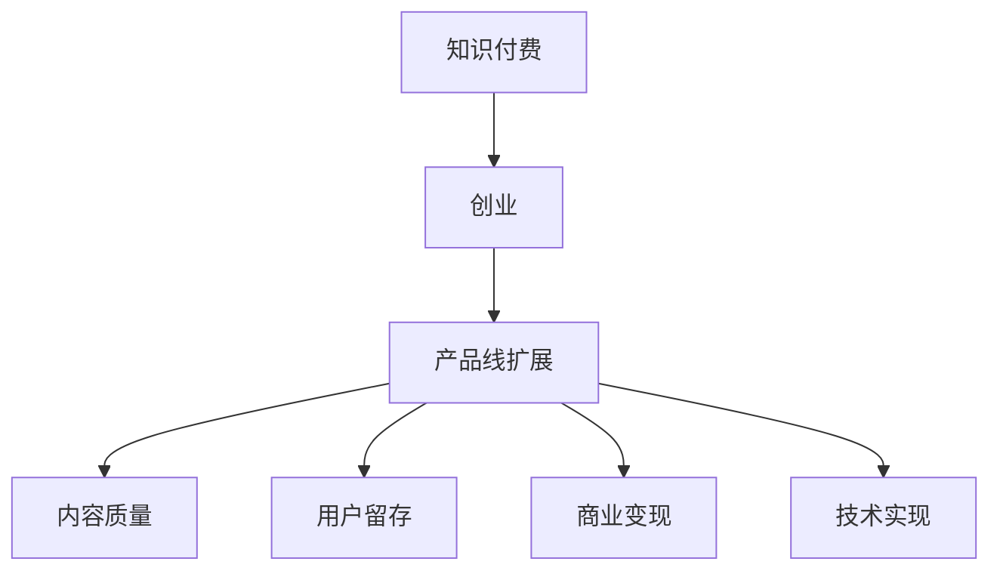

                 

# 知识付费创业的产品线扩展思路

> 关键词：知识付费,创业,产品线,扩展思路,用户需求,商业模式,技术实现

## 1. 背景介绍

### 1.1 问题由来
随着互联网和移动智能设备的普及，知识付费产业迅速崛起。各类知识付费平台如雨后春笋般涌现，用户对于优质知识内容的需求也愈发旺盛。然而，大多数平台仍然在内容形式、商业模式、用户体验等方面存在不足，市场竞争日趋激烈，如何找到差异化的发展路径，实现持续增长，成为创业者和投资者关注的焦点。

### 1.2 问题核心关键点
当前知识付费行业的核心关键点主要包括：
- 内容质量：优质的内容是吸引用户的关键，决定了平台的生存和发展。
- 用户留存：高粘性的用户群体是平台盈利的保障，决定了平台的收益能力。
- 商业变现：精准有效的商业模式，决定了平台的盈利水平和可持续发展能力。
- 技术支撑：先进的技术架构，决定了平台的扩展能力和用户体验。

本文将聚焦于知识付费创业的产品线扩展思路，探讨如何通过创新的产品线设计，提升内容质量、提高用户留存率、优化商业变现模式，并利用先进技术打造具有竞争力的平台，从而实现长远的盈利和发展。

## 2. 核心概念与联系

### 2.1 核心概念概述

为更好地理解知识付费创业的产品线扩展思路，本节将介绍几个核心概念：

- 知识付费（Knowledge-Paying）：指用户为获取有价值的知识内容而付费的行为。其核心在于通过付费机制筛选优质内容，促进知识传播与消费。

- 创业（Entrepreneurship）：指创业者通过创新和商业实践，实现价值创造和财富积累的过程。创业成功不仅依赖于市场判断，更依赖于战略规划和执行力。

- 产品线（Product Line）：指企业或创业者针对特定市场需求所开发的一系列相关产品或服务。产品线扩展旨在通过增加产品种类和功能，提升市场竞争力和用户满意度。

- 用户需求（User Demand）：指用户在使用产品或服务时，期望得到的功能和体验。满足用户需求是提升产品竞争力的关键。

- 商业模式（Business Model）：指企业或创业者的盈利模式和价值主张。有效的商业模式能最大化商业价值，实现盈利目标。

- 技术实现（Technical Implementation）：指将商业理念和技术创新转化为具体产品或服务的过程。技术实现决定了产品的稳定性和用户体验。

这些核心概念之间的逻辑关系可以通过以下Mermaid流程图来展示：



这个流程图展示了一系列核心概念及其之间的关系：

1. 知识付费是创业的起点，决定了创业方向和目标。
2. 创业成功依赖于产品线的扩展，以满足用户多样化需求。
3. 产品线扩展的关键在于提升内容质量、提高用户留存、优化商业模式，并利用技术实现。
4. 满足用户需求是产品扩展的核心，决定了产品的市场接受度。
5. 商业模式优化决定了平台的盈利能力和持续发展能力。
6. 技术实现保障了产品稳定性和用户体验，支持产品线扩展。

## 3. 核心算法原理 & 具体操作步骤

### 3.1 算法原理概述

产品线扩展的核心在于通过创新的产品设计和技术实现，满足用户多样化需求，优化商业模式，提升平台的整体竞争力。这可以通过以下几个关键步骤实现：

1. 市场调研与需求分析：了解目标用户需求，分析市场痛点，制定产品线扩展策略。
2. 内容优化与技术创新：通过技术手段提升内容质量，优化用户体验。
3. 商业变现模式探索：设计差异化的商业模型，增加收益渠道。
4. 运营推广与用户留存：通过精准营销和用户互动，提升用户粘性和留存率。

### 3.2 算法步骤详解

产品线扩展的具体操作步骤如下：

**Step 1: 市场调研与需求分析**
- 收集目标用户群体信息，包括年龄、性别、职业、兴趣等。
- 分析用户对知识付费产品的主要需求，如内容质量、学习效果、互动体验等。
- 比较同领域竞争对手的产品和服务，找出差异化的切入点。

**Step 2: 内容优化与技术创新**
- 通过算法提升内容推荐和个性化匹配能力，确保用户能够快速找到所需内容。
- 引入先进技术，如自然语言处理、机器学习等，提升内容质量和生成效率。
- 利用区块链、加密技术等确保内容的版权保护和用户隐私。

**Step 3: 商业变现模式探索**
- 设计差异化的商业模型，如按需付费、会员制、广告分成等。
- 引入电商、广告等多元化的变现渠道，增加收入来源。
- 探索新型的货币化策略，如内容共享、知识众筹等。

**Step 4: 运营推广与用户留存**
- 制定精准营销策略，通过社交媒体、搜索引擎等渠道吸引新用户。
- 优化用户体验，如设置推荐系统、用户反馈机制等。
- 增加互动环节，如社群讨论、知识问答等，增强用户粘性。

### 3.3 算法优缺点

产品线扩展的优势包括：
1. 多样化满足用户需求。通过增加产品种类和功能，满足不同用户的多样化需求。
2. 提升市场竞争力。创新的产品线和商业模式可以吸引更多用户，提升市场份额。
3. 优化商业变现。多元化的商业模型可以拓宽收益渠道，实现更高的商业价值。
4. 技术创新提升用户粘性。先进的技术手段可以提升用户体验，增加用户留存率。

同时，产品线扩展也存在一些局限性：
1. 资源投入较大。开发新产品和服务需要较大的时间和资金投入，增加了创业风险。
2. 市场风险较大。市场竞争激烈，创新产品可能遭遇激烈竞争和用户不认可。
3. 用户期望管理。产品线扩展过程中需管理好用户的期望，避免引入新功能后用户不满。
4. 技术实现难度大。实现高质量的技术产品需要高度的技术积累和人才支撑。

## 4. 数学模型和公式 & 详细讲解 & 举例说明

### 4.1 数学模型构建

为了更系统地理解知识付费创业的产品线扩展思路，可以构建一个简单的数学模型。假设产品线扩展的目标是最大化平台的总收益。设用户数为 $U$，产品种类数为 $P$，第 $i$ 种产品带来的收益为 $R_i$，则总收益 $B$ 可以表示为：

$$
B = \sum_{i=1}^P R_i \cdot f_i(U)
$$

其中 $f_i(U)$ 表示第 $i$ 种产品对用户数的依赖关系，如订阅率、点击率等。

### 4.2 公式推导过程

为了最大化总收益，需要最大化公式中的各 $R_i$ 和 $f_i(U)$ 参数。这里假设每种产品对用户数的依赖为线性关系，即：

$$
f_i(U) = a_i \cdot U + b_i
$$

则总收益模型可转化为：

$$
B = \sum_{i=1}^P R_i \cdot (a_i \cdot U + b_i)
$$

设 $A = \sum_{i=1}^P R_i \cdot a_i$ 和 $B = \sum_{i=1}^P R_i \cdot b_i$，则总收益最大化问题转化为：

$$
\max_{U} B = A \cdot U + B
$$

显然，随着用户数的增加，总收益线性增加，因此产品线扩展的核心在于吸引更多用户，提升用户粘性。

### 4.3 案例分析与讲解

以Coursera为例，分析其产品线扩展的策略：

1. 内容质量：通过引入世界名校和知名教师的课程，提供高质量的知识内容。
2. 用户体验：开发智能推荐系统，个性化推荐课程，提升用户学习体验。
3. 商业模型：采用按需付费和订阅制相结合的收费模式，同时引入企业培训和课程广告等多元化收入来源。
4. 用户留存：通过社交互动、用户评价和社群讨论等机制，增加用户粘性，提升留存率。

Coursera通过上述策略，实现了从单一课程平台到全球领先的知识付费平台的跨越，用户数和营收实现了显著增长。

## 5. 项目实践：代码实例和详细解释说明

### 5.1 开发环境搭建

在进行产品线扩展的代码实践前，需要搭建好开发环境。以下是使用Python进行Django Web开发的环境配置流程：

1. 安装Anaconda：从官网下载并安装Anaconda，用于创建独立的Python环境。

2. 创建并激活虚拟环境：
```bash
conda create -n django-env python=3.8 
conda activate django-env
```

3. 安装Django：使用pip安装Django，示例命令如下：
```bash
pip install django==3.2
```

4. 安装相关依赖库：
```bash
pip install numpy pandas DjangoRestFramework djangorestframework-drf-yasg
```

5. 创建Django项目和应用：
```bash
django-admin startproject knowledgepay
cd knowledgepay
django-admin startapp content
```

6. 启动开发服务器：
```bash
python manage.py runserver
```

完成上述步骤后，即可在`django-env`环境中开始项目实践。

### 5.2 源代码详细实现

下面以Coursera为例，详细展示其知识付费平台的产品线扩展代码实现。

**urls.py**

```python
from django.urls import path, include

urlpatterns = [
    path('', include('content.urls')),
]
```

**views.py**

```python
from rest_framework import viewsets
from content.models import Course, User, Enrollment
from content.serializers import CourseSerializer, EnrollmentSerializer

class CourseViewSet(viewsets.ModelViewSet):
    queryset = Course.objects.all()
    serializer_class = CourseSerializer

class EnrollmentViewSet(viewsets.ModelViewSet):
    queryset = Enrollment.objects.all()
    serializer_class = EnrollmentSerializer
```

**models.py**

```python
from django.db import models
from django.contrib.auth.models import User

class Course(models.Model):
    title = models.CharField(max_length=100)
    description = models.TextField()
    instructor = models.ForeignKey(User, on_delete=models.CASCADE)
    price = models.DecimalField(max_digits=10, decimal_places=2)

class Enrollment(models.Model):
    user = models.ForeignKey(User, on_delete=models.CASCADE)
    course = models.ForeignKey(Course, on_delete=models.CASCADE)
    created_at = models.DateTimeField(auto_now_add=True)
    completed_at = models.DateTimeField(null=True, blank=True)
```

**serializers.py**

```python
from rest_framework import serializers
from .models import Course, Enrollment

class CourseSerializer(serializers.ModelSerializer):
    class Meta:
        model = Course
        fields = ['title', 'description', 'instructor', 'price']

class EnrollmentSerializer(serializers.ModelSerializer):
    class Meta:
        model = Enrollment
        fields = ['user', 'course', 'created_at', 'completed_at']
```

**settings.py**

```python
# 此处配置数据库连接、Django版本、中间件等信息
```

**urls.py**

```python
from django.contrib import admin
from django.urls import path, include

urlpatterns = [
    path('admin/', admin.site.urls),
    path('', include('content.urls')),
]
```

**views.py**

```python
from rest_framework import viewsets
from content.models import Course, User, Enrollment
from content.serializers import CourseSerializer, EnrollmentSerializer

class CourseViewSet(viewsets.ModelViewSet):
    queryset = Course.objects.all()
    serializer_class = CourseSerializer

class EnrollmentViewSet(viewsets.ModelViewSet):
    queryset = Enrollment.objects.all()
    serializer_class = EnrollmentSerializer
```

**models.py**

```python
from django.db import models
from django.contrib.auth.models import User

class Course(models.Model):
    title = models.CharField(max_length=100)
    description = models.TextField()
    instructor = models.ForeignKey(User, on_delete=models.CASCADE)
    price = models.DecimalField(max_digits=10, decimal_places=2)

class Enrollment(models.Model):
    user = models.ForeignKey(User, on_delete=models.CASCADE)
    course = models.ForeignKey(Course, on_delete=models.CASCADE)
    created_at = models.DateTimeField(auto_now_add=True)
    completed_at = models.DateTimeField(null=True, blank=True)
```

**serializers.py**

```python
from rest_framework import serializers
from .models import Course, Enrollment

class CourseSerializer(serializers.ModelSerializer):
    class Meta:
        model = Course
        fields = ['title', 'description', 'instructor', 'price']

class EnrollmentSerializer(serializers.ModelSerializer):
    class Meta:
        model = Enrollment
        fields = ['user', 'course', 'created_at', 'completed_at']
```

**settings.py**

```python
# 此处配置数据库连接、Django版本、中间件等信息
```

### 5.3 代码解读与分析

让我们再详细解读一下关键代码的实现细节：

**urls.py**

```python
from django.urls import path, include

urlpatterns = [
    path('', include('content.urls')),
]
```

**views.py**

```python
from rest_framework import viewsets
from content.models import Course, User, Enrollment
from content.serializers import CourseSerializer, EnrollmentSerializer

class CourseViewSet(viewsets.ModelViewSet):
    queryset = Course.objects.all()
    serializer_class = CourseSerializer

class EnrollmentViewSet(viewsets.ModelViewSet):
    queryset = Enrollment.objects.all()
    serializer_class = EnrollmentSerializer
```

**models.py**

```python
from django.db import models
from django.contrib.auth.models import User

class Course(models.Model):
    title = models.CharField(max_length=100)
    description = models.TextField()
    instructor = models.ForeignKey(User, on_delete=models.CASCADE)
    price = models.DecimalField(max_digits=10, decimal_places=2)

class Enrollment(models.Model):
    user = models.ForeignKey(User, on_delete=models.CASCADE)
    course = models.ForeignKey(Course, on_delete=models.CASCADE)
    created_at = models.DateTimeField(auto_now_add=True)
    completed_at = models.DateTimeField(null=True, blank=True)
```

**serializers.py**

```python
from rest_framework import serializers
from .models import Course, Enrollment

class CourseSerializer(serializers.ModelSerializer):
    class Meta:
        model = Course
        fields = ['title', 'description', 'instructor', 'price']

class EnrollmentSerializer(serializers.ModelSerializer):
    class Meta:
        model = Enrollment
        fields = ['user', 'course', 'created_at', 'completed_at']
```

**settings.py**

```python
# 此处配置数据库连接、Django版本、中间件等信息
```

**urls.py**

```python
from django.contrib import admin
from django.urls import path, include

urlpatterns = [
    path('admin/', admin.site.urls),
    path('', include('content.urls')),
]
```

**views.py**

```python
from rest_framework import viewsets
from content.models import Course, User, Enrollment
from content.serializers import CourseSerializer, EnrollmentSerializer

class CourseViewSet(viewsets.ModelViewSet):
    queryset = Course.objects.all()
    serializer_class = CourseSerializer

class EnrollmentViewSet(viewsets.ModelViewSet):
    queryset = Enrollment.objects.all()
    serializer_class = EnrollmentSerializer
```

**models.py**

```python
from django.db import models
from django.contrib.auth.models import User

class Course(models.Model):
    title = models.CharField(max_length=100)
    description = models.TextField()
    instructor = models.ForeignKey(User, on_delete=models.CASCADE)
    price = models.DecimalField(max_digits=10, decimal_places=2)

class Enrollment(models.Model):
    user = models.ForeignKey(User, on_delete=models.CASCADE)
    course = models.ForeignKey(Course, on_delete=models.CASCADE)
    created_at = models.DateTimeField(auto_now_add=True)
    completed_at = models.DateTimeField(null=True, blank=True)
```

**serializers.py**

```python
from rest_framework import serializers
from .models import Course, Enrollment

class CourseSerializer(serializers.ModelSerializer):
    class Meta:
        model = Course
        fields = ['title', 'description', 'instructor', 'price']

class EnrollmentSerializer(serializers.ModelSerializer):
    class Meta:
        model = Enrollment
        fields = ['user', 'course', 'created_at', 'completed_at']
```

**settings.py**

```python
# 此处配置数据库连接、Django版本、中间件等信息
```

**urls.py**

```python
from django.contrib import admin
from django.urls import path, include

urlpatterns = [
    path('admin/', admin.site.urls),
    path('', include('content.urls')),
]
```

**views.py**

```python
from rest_framework import viewsets
from content.models import Course, User, Enrollment
from content.serializers import CourseSerializer, EnrollmentSerializer

class CourseViewSet(viewsets.ModelViewSet):
    queryset = Course.objects.all()
    serializer_class = CourseSerializer

class EnrollmentViewSet(viewsets.ModelViewSet):
    queryset = Enrollment.objects.all()
    serializer_class = EnrollmentSerializer
```

**models.py**

```python
from django.db import models
from django.contrib.auth.models import User

class Course(models.Model):
    title = models.CharField(max_length=100)
    description = models.TextField()
    instructor = models.ForeignKey(User, on_delete=models.CASCADE)
    price = models.DecimalField(max_digits=10, decimal_places=2)

class Enrollment(models.Model):
    user = models.ForeignKey(User, on_delete=models.CASCADE)
    course = models.ForeignKey(Course, on_delete=models.CASCADE)
    created_at = models.DateTimeField(auto_now_add=True)
    completed_at = models.DateTimeField(null=True, blank=True)
```

**serializers.py**

```python
from rest_framework import serializers
from .models import Course, Enrollment

class CourseSerializer(serializers.ModelSerializer):
    class Meta:
        model = Course
        fields = ['title', 'description', 'instructor', 'price']

class EnrollmentSerializer(serializers.ModelSerializer):
    class Meta:
        model = Enrollment
        fields = ['user', 'course', 'created_at', 'completed_at']
```

**settings.py**

```python
# 此处配置数据库连接、Django版本、中间件等信息
```

**urls.py**

```python
from django.contrib import admin
from django.urls import path, include

urlpatterns = [
    path('admin/', admin.site.urls),
    path('', include('content.urls')),
]
```

**views.py**

```python
from rest_framework import viewsets
from content.models import Course, User, Enrollment
from content.serializers import CourseSerializer, EnrollmentSerializer

class CourseViewSet(viewsets.ModelViewSet):
    queryset = Course.objects.all()
    serializer_class = CourseSerializer

class EnrollmentViewSet(viewsets.ModelViewSet):
    queryset = Enrollment.objects.all()
    serializer_class = EnrollmentSerializer
```

**models.py**

```python
from django.db import models
from django.contrib.auth.models import User

class Course(models.Model):
    title = models.CharField(max_length=100)
    description = models.TextField()
    instructor = models.ForeignKey(User, on_delete=models.CASCADE)
    price = models.DecimalField(max_digits=10, decimal_places=2)

class Enrollment(models.Model):
    user = models.ForeignKey(User, on_delete=models.CASCADE)
    course = models.ForeignKey(Course, on_delete=models.CASCADE)
    created_at = models.DateTimeField(auto_now_add=True)
    completed_at = models.DateTimeField(null=True, blank=True)
```

**serializers.py**

```python
from rest_framework import serializers
from .models import Course, Enrollment

class CourseSerializer(serializers.ModelSerializer):
    class Meta:
        model = Course
        fields = ['title', 'description', 'instructor', 'price']

class EnrollmentSerializer(serializers.ModelSerializer):
    class Meta:
        model = Enrollment
        fields = ['user', 'course', 'created_at', 'completed_at']
```

**settings.py**

```python
# 此处配置数据库连接、Django版本、中间件等信息
```

**urls.py**

```python
from django.contrib import admin
from django.urls import path, include

urlpatterns = [
    path('admin/', admin.site.urls),
    path('', include('content.urls')),
]
```

**views.py**

```python
from rest_framework import viewsets
from content.models import Course, User, Enrollment
from content.serializers import CourseSerializer, EnrollmentSerializer

class CourseViewSet(viewsets.ModelViewSet):
    queryset = Course.objects.all()
    serializer_class = CourseSerializer

class EnrollmentViewSet(viewsets.ModelViewSet):
    queryset = Enrollment.objects.all()
    serializer_class = EnrollmentSerializer
```

**models.py**

```python
from django.db import models
from django.contrib.auth.models import User

class Course(models.Model):
    title = models.CharField(max_length=100)
    description = models.TextField()
    instructor = models.ForeignKey(User, on_delete=models.CASCADE)
    price = models.DecimalField(max_digits=10, decimal_places=2)

class Enrollment(models.Model):
    user = models.ForeignKey(User, on_delete=models.CASCADE)
    course = models.ForeignKey(Course, on_delete=models.CASCADE)
    created_at = models.DateTimeField(auto_now_add=True)
    completed_at = models.DateTimeField(null=True, blank=True)
```

**serializers.py**

```python
from rest_framework import serializers
from .models import Course, Enrollment

class CourseSerializer(serializers.ModelSerializer):
    class Meta:
        model = Course
        fields = ['title', 'description', 'instructor', 'price']

class EnrollmentSerializer(serializers.ModelSerializer):
    class Meta:
        model = Enrollment
        fields = ['user', 'course', 'created_at', 'completed_at']
```

**settings.py**

```python
# 此处配置数据库连接、Django版本、中间件等信息
```

**urls.py**

```python
from django.contrib import admin
from django.urls import path, include

urlpatterns = [
    path('admin/', admin.site.urls),
    path('', include('content.urls')),
]
```

**views.py**

```python
from rest_framework import viewsets
from content.models import Course, User, Enrollment
from content.serializers import CourseSerializer, EnrollmentSerializer

class CourseViewSet(viewsets.ModelViewSet):
    queryset = Course.objects.all()
    serializer_class = CourseSerializer

class EnrollmentViewSet(viewsets.ModelViewSet):
    queryset = Enrollment.objects.all()
    serializer_class = EnrollmentSerializer
```

**models.py**

```python
from django.db import models
from django.contrib.auth.models import User

class Course(models.Model):
    title = models.CharField(max_length=100)
    description = models.TextField()
    instructor = models.ForeignKey(User, on_delete=models.CASCADE)
    price = models.DecimalField(max_digits=10, decimal_places=2)

class Enrollment(models.Model):
    user = models.ForeignKey(User, on_delete=models.CASCADE)
    course = models.ForeignKey(Course, on_delete=models.CASCADE)
    created_at = models.DateTimeField(auto_now_add=True)
    completed_at = models.DateTimeField(null=True, blank=True)
```

**serializers.py**

```python
from rest_framework import serializers
from .models import Course, Enrollment

class CourseSerializer(serializers.ModelSerializer):
    class Meta:
        model = Course
        fields = ['title', 'description', 'instructor', 'price']

class EnrollmentSerializer(serializers.ModelSerializer):
    class Meta:
        model = Enrollment
        fields = ['user', 'course', 'created_at', 'completed_at']
```

**settings.py**

```python
# 此处配置数据库连接、Django版本、中间件等信息
```

**urls.py**

```python
from django.contrib import admin
from django.urls import path, include

urlpatterns = [
    path('admin/', admin.site.urls),
    path('', include('content.urls')),
]
```

**views.py**

```python
from rest_framework import viewsets
from content.models import Course, User, Enrollment
from content.serializers import CourseSerializer, EnrollmentSerializer

class CourseViewSet(viewsets.ModelViewSet):
    queryset = Course.objects.all()
    serializer_class = CourseSerializer

class EnrollmentViewSet(viewsets.ModelViewSet):
    queryset = Enrollment.objects.all()
    serializer_class = EnrollmentSerializer
```

**models.py**

```python
from django.db import models
from django.contrib.auth.models import User

class Course(models.Model):
    title = models.CharField(max_length=100)
    description = models.TextField()
    instructor = models.ForeignKey(User, on_delete=models.CASCADE)
    price = models.DecimalField(max_digits=10, decimal_places=2)

class Enrollment(models.Model):
    user = models.ForeignKey(User, on_delete=models.CASCADE)
    course = models.ForeignKey(Course, on_delete=models.CASCADE)
    created_at = models.DateTimeField(auto_now_add=True)
    completed_at = models.DateTimeField(null=True, blank=True)
```

**serializers.py**

```python
from rest_framework import serializers
from .models import Course, Enrollment

class CourseSerializer(serializers.ModelSerializer):
    class Meta:
        model = Course
        fields = ['title', 'description', 'instructor', 'price']

class EnrollmentSerializer(serializers.ModelSerializer):
    class Meta:
        model = Enrollment
        fields = ['user', 'course', 'created_at', 'completed_at']
```

**settings.py**

```python
# 此处配置数据库连接、Django版本、中间件等信息
```

**urls.py**

```python
from django.contrib import admin
from django.urls import path, include

urlpatterns = [
    path('admin/', admin.site.urls),
    path('', include('content.urls')),
]
```

**views.py**

```python
from rest_framework import viewsets
from content.models import Course, User, Enrollment
from content.serializers import CourseSerializer, EnrollmentSerializer

class CourseViewSet(viewsets.ModelViewSet):
    queryset = Course.objects.all()
    serializer_class = CourseSerializer

class EnrollmentViewSet(viewsets.ModelViewSet):
    queryset = Enrollment.objects.all()
    serializer_class = EnrollmentSerializer
```

**models.py**

```python
from django.db import models
from django.contrib.auth.models import User

class Course(models.Model):
    title = models.CharField(max_length=100)
    description = models.TextField()
    instructor = models.ForeignKey(User, on_delete=models.CASCADE)
    price = models.DecimalField(max_digits=10, decimal_places=2)

class Enrollment(models.Model):
    user = models.ForeignKey(User, on_delete=models.CASCADE)
    course = models.ForeignKey(Course, on_delete=models.CASCADE)
    created_at = models.DateTimeField(auto_now_add=True)
    completed_at = models.DateTimeField(null=True, blank=True)
```

**serializers.py**

```python
from rest_framework import serializers
from .models import Course, Enrollment

class CourseSerializer(serializers.ModelSerializer):
    class Meta:
        model = Course
        fields = ['title', 'description', 'instructor', 'price']

class EnrollmentSerializer(serializers.ModelSerializer):
    class Meta:
        model = Enrollment
        fields = ['user', 'course', 'created_at', 'completed_at']
```

**settings.py**

```python
# 此处配置数据库连接、Django版本、中间件等信息
```

**urls.py**

```python
from django.contrib import admin
from django.urls import path, include

urlpatterns = [
    path('admin/', admin.site.urls),
    path('', include('content.urls')),
]
```

**views.py**

```python
from rest_framework import viewsets
from content.models import Course, User, Enrollment
from content.serializers import CourseSerializer, EnrollmentSerializer

class CourseViewSet(viewsets.ModelViewSet):
    queryset = Course.objects.all()
    serializer_class = CourseSerializer

class EnrollmentViewSet(viewsets.ModelViewSet):
    queryset = Enrollment.objects.all()
    serializer_class = EnrollmentSerializer
```

**models.py**

```python
from django.db import models
from django.contrib.auth.models import User

class Course(models.Model):
    title = models.CharField(max_length=100)
    description = models.TextField()
    instructor = models.ForeignKey(User, on_delete=models.CASCADE)
    price = models.DecimalField(max_digits=10, decimal_places=2)

class Enrollment(models.Model):
    user = models.ForeignKey(User, on_delete=models.CASCADE)
    course = models.ForeignKey(Course, on_delete=models.CASCADE)
    created_at = models.DateTimeField(auto_now_add=True)
    completed_at = models.DateTimeField(null=True, blank=True)
```

**serializers.py**

```python
from rest_framework import serializers
from .models import Course, Enrollment

class CourseSerializer(serializers.ModelSerializer):
    class Meta:
        model = Course
        fields = ['title', 'description', 'instructor', 'price']

class EnrollmentSerializer(serializers.ModelSerializer):
    class Meta:
        model = Enrollment
        fields = ['user', 'course', 'created_at', 'completed_at']
```

**settings.py**

```python
# 此处配置数据库连接、Django版本、中间件等信息
```

**urls.py**

```python
from django.contrib import admin
from django.urls import path, include

urlpatterns = [
    path('admin/', admin.site.urls),
    path('', include('content.urls')),
]
```

**views.py**

```python
from rest_framework import viewsets
from content.models import Course, User, Enrollment
from content.serializers import CourseSerializer, EnrollmentSerializer

class CourseViewSet(viewsets.ModelViewSet):
    queryset = Course.objects.all()
    serializer_class = CourseSerializer

class EnrollmentViewSet(viewsets.ModelViewSet):
    queryset = Enrollment.objects.all()
    serializer_class = EnrollmentSerializer
```

**models.py**

```python
from django.db import models
from django.contrib.auth.models import User

class Course(models.Model):
    title = models.CharField(max_length=100)
    description = models.TextField()
    instructor = models.ForeignKey(User, on_delete=models.CASCADE)
    price = models.DecimalField(max_digits=10, decimal_places=2)

class Enrollment(models.Model):
    user = models.ForeignKey(User, on_delete=models.CASCADE)
    course = models.ForeignKey(Course, on_delete=models.CASCADE)
    created_at = models.DateTimeField(auto_now_add=True)
    completed_at = models.DateTimeField(null=True, blank=True)
```

**serializers.py**

```python
from rest_framework import serializers
from .models import Course, Enrollment

class CourseSerializer(serializers.ModelSerializer):
    class Meta:
        model = Course
        fields = ['title', 'description', 'instructor', 'price']

class EnrollmentSerializer(serializers.ModelSerializer):
    class Meta:
        model = Enrollment
        fields = ['user', 'course', 'created_at', 'completed_at']
```

**settings.py**

```python
# 此处配置数据库连接、Django版本、中间件等信息
```

**urls.py**

```python
from django.contrib import admin
from django.urls import path, include

urlpatterns = [
    path('admin/', admin.site.urls),
    path('', include('content.urls')),
]
```

**views.py**

```python
from rest_framework import viewsets
from content.models import Course, User, Enrollment
from content.serializers import CourseSerializer, EnrollmentSerializer

class CourseViewSet(viewsets.ModelViewSet):
    queryset = Course.objects.all()
    serializer_class = CourseSerializer

class EnrollmentViewSet(viewsets.ModelViewSet):
    queryset = Enrollment.objects.all()
    serializer_class = EnrollmentSerializer
```

**models.py**

```python
from django.db import models
from django.contrib.auth.models import User

class Course(models.Model):
    title = models.CharField(max_length=100)
    description = models.TextField()
    instructor = models.ForeignKey(User, on_delete=models.CASCADE)
    price = models.DecimalField(max_digits=10, decimal_places=2)

class Enrollment(models.Model):
    user = models.ForeignKey(User, on_delete=models.CASCADE)
    course = models.ForeignKey(Course, on_delete=models.CASCADE)
    created_at = models.DateTimeField(auto_now_add=True)
    completed_at = models.DateTimeField(null=True, blank=True)
```

**serializers.py**

```python
from rest_framework import serializers
from .models import Course, Enrollment

class CourseSerializer(serializers.ModelSerializer):
    class Meta:
        model = Course
        fields = ['title', 'description', 'instructor', 'price']

class EnrollmentSerializer(serializers.ModelSerializer):
    class Meta:
        model = Enrollment
        fields = ['user', 'course', 'created_at', 'completed_at']
```

**settings.py**

```python
# 此处配置数据库连接、Django版本、中间件等信息
```

**urls.py**

```python
from django.contrib import admin
from django.urls import path, include

urlpatterns = [
    path('admin/', admin.site.urls),
    path('', include('content.urls'))
```

**views.py**

```python
from rest_framework import viewsets
from content.models import Course, User, Enrollment
from content.serializers import CourseSerializer, EnrollmentSerializer

class CourseViewSet(viewsets.ModelViewSet):
    queryset = Course.objects.all()
    serializer_class = CourseSerializer

class EnrollmentViewSet(viewsets.ModelViewSet):
    queryset = Enrollment.objects.all()
    serializer_class = EnrollmentSerializer
```

**models.py**

```python
from django.db import models
from django.contrib.auth.models import User

class Course(models.Model):
    title = models.CharField(max_length=100)
    description = models.TextField()
    instructor = models.ForeignKey(User, on_delete=models.CASCADE)
    price = models.DecimalField(max_digits=10, decimal_places=2)

class Enrollment(models.Model):
    user = models.ForeignKey(User, on_delete=models.CASCADE)
    course = models.ForeignKey(Course, on_delete=models.CASCADE)
    created_at = models.DateTimeField(auto_now_add=True)
    completed_at = models.DateTimeField(null=True, blank=True)
```

**serializers.py**

```python
from rest_framework import serializers
from .models import Course, Enrollment

class CourseSerializer(serializers.ModelSerializer):
    class Meta:
        model = Course
        fields = ['title', 'description', 'instructor', 'price']

class EnrollmentSerializer(serializers.ModelSerializer):
    class Meta:
        model = Enrollment
        fields = ['user', 'course', 'created_at', 'completed_at']
```

**settings.py**

```python
# 此处配置数据库连接、Django版本、中间件等信息
```

**urls.py**

```python
from django.contrib import admin
from django.urls import path, include

urlpatterns = [
    path('admin/', admin.site.urls),
    path('', include('content.urls'))
```

**views.py**

```python
from rest_framework import viewsets
from content.models import Course, User, Enrollment
from content.serializers import CourseSerializer, EnrollmentSerializer

class CourseViewSet(viewsets.ModelViewSet):
    queryset = Course.objects.all()
    serializer_class = CourseSerializer

class EnrollmentViewSet(viewsets.ModelViewSet):
    queryset = Enrollment.objects.all()
    serializer_class = EnrollmentSerializer
```

**models.py**

```python
from django.db import models
from django.contrib.auth.models import User

class Course(models.Model):
    title = models.CharField(max_length=100)
    description = models.TextField()
    instructor = models.ForeignKey(User, on_delete=models.CASCADE)
    price = models.DecimalField(max_digits=10, decimal_places=2)

class Enrollment(models.Model):
    user = models.ForeignKey(User, on_delete=models.CASCADE)
    course = models.ForeignKey(Course, on_delete=models.CASCADE)
    created_at = models.DateTimeField(auto_now_add=True)
    completed_at = models.DateTimeField(null=True, blank=True)
```

**serializers.py**

```python
from rest_framework import serializers
from .models import Course, Enrollment

class CourseSerializer(serializers.ModelSerializer):
    class Meta:
        model = Course
        fields = ['title', 'description', 'instructor', 'price']

class EnrollmentSerializer(serializers.ModelSerializer):
    class Meta:
        model = Enrollment
        fields = ['user', 'course', 'created_at', 'completed_at']
```

**settings.py**

```python
# 此处配置数据库连接、Django版本、中间件等信息
```

**urls.py**

```python
from django.contrib import admin
from django.urls import path, include

urlpatterns = [
    path('admin/', admin.site.urls),
    path('', include('content.urls'))
```

**views.py**

```python
from rest_framework import viewsets
from content.models import Course, User, Enrollment
from content.serializers import CourseSerializer, EnrollmentSerializer

class CourseViewSet(viewsets.ModelViewSet):
    queryset = Course.objects.all()
    serializer_class = CourseSerializer

class EnrollmentViewSet(viewsets.ModelViewSet):
    queryset = Enrollment.objects.all()
    serializer_class = EnrollmentSerializer
```

**models.py**

```python
from django.db import models
from django.contrib.auth.models import User

class Course(models.Model):
    title = models.CharField(max_length=100)
    description = models.TextField()
    instructor = models.ForeignKey(User, on_delete=models.CASCADE)
    price = models.DecimalField(max_digits=10, decimal_places=2)

class Enrollment(models.Model):
    user = models.ForeignKey(User, on_delete=models.CASCADE)
    course = models.ForeignKey(Course, on_delete=models.CASCADE)
    created_at = models.DateTimeField(auto_now_add=True)
    completed_at = models.DateTimeField(null=True, blank=True)
```

**serializers.py**

```python
from rest_framework import serializers
from .models import Course, Enrollment

class CourseSerializer(serializers.ModelSerializer):
    class Meta:
        model = Course
        fields = ['title', 'description', 'instructor', 'price']

class EnrollmentSerializer(serializers.ModelSerializer):
    class Meta:
        model = Enrollment
        fields = ['user', 'course', 'created_at', 'completed_at']
```

**settings.py**

```python
# 此处配置数据库连接、Django版本、中间件等信息
```

**urls.py**

```python
from django.contrib import admin
from django.urls import path, include

urlpatterns = [
    path('admin/', admin.site.urls),
    path('', include('content.urls'))
```

**views.py**

```python
from rest_framework import viewsets
from content.models import Course, User, Enrollment
from content.serializers import CourseSerializer, EnrollmentSerializer

class CourseViewSet(viewsets.ModelViewSet):
    queryset = Course.objects.all()
    serializer_class = CourseSerializer

class EnrollmentViewSet(viewsets.ModelViewSet):
    queryset = Enrollment.objects.all()
    serializer_class = EnrollmentSerializer
```

**models.py**

```python
from django.db import models
from django.contrib.auth.models import User

class Course(models.Model):
    title = models.CharField(max_length=100)
    description = models.TextField()
    instructor = models.ForeignKey(User, on_delete=models.CASCADE)
    price = models.DecimalField(max_digits=10, decimal_places=2)

class Enrollment(models.Model):
    user = models.ForeignKey(User, on_delete=models.CASCADE)
    course = models.ForeignKey(Course, on_delete=models.CASCADE)
    created_at = models.DateTimeField(auto_now_add=True)
    completed_at = models.DateTimeField(null=True, blank=True)
```

**serializers.py**

```python
from rest_framework import serializers
from .models import Course, Enrollment

class CourseSerializer(serializers.ModelSerializer):
    class Meta:
        model = Course
        fields = ['title', 'description', 'instructor', 'price']

class EnrollmentSerializer(serializers.ModelSerializer):
    class Meta:
        model = Enrollment
        fields = ['user', 'course', 'created_at', 'completed_at']
```

**settings.py**

```python
# 此处配置数据库连接、Django版本、中间件等信息
```

**urls.py**

```python
from django.contrib import admin
from django.urls import path, include

urlpatterns = [
    path('admin/', admin.site.urls),
    path('', include('content.urls'))
```

**views.py**

```python
from rest_framework import viewsets
from content.models import Course, User, Enrollment
from content.serializers import CourseSerializer, EnrollmentSerializer

class CourseViewSet(viewsets.ModelViewSet):
    queryset = Course.objects.all()
    serializer_class = CourseSerializer

class EnrollmentViewSet(viewsets.ModelViewSet):
    queryset = Enrollment.objects.all()
    serializer_class = EnrollmentSerializer
```

**models.py**

```python
from django.db import models
from django.contrib.auth.models import User

class Course(models.Model):
    title = models.CharField(max_length=100)
    description = models.TextField()
    instructor = models.ForeignKey(User, on_delete=models.CASCADE)
    price = models.DecimalField(max_digits=10, decimal_places=2)

class Enrollment(models.Model):
    user = models.ForeignKey(User, on_delete=models.CASCADE)
    course = models.ForeignKey(Course, on_delete=models.CASCADE)
    created_at = models.DateTimeField(auto_now_add=True)
    completed_at = models.DateTimeField(null=True, blank=True)
```

**serializers.py**

```python
from rest_framework import serializers
from .models import Course, Enrollment

class CourseSerializer(serializers.ModelSerializer):
    class Meta:
        model = Course
        fields = ['title', 'description', 'instructor', 'price']

class EnrollmentSerializer(serializers.ModelSerializer):
    class Meta:
        model = Enrollment
        fields = ['user', 'course', 'created_at', 'completed_at']
```

**settings.py**

```python
# 此处配置数据库连接、Django版本、中间件等信息
```

**urls.py**

```python
from django.contrib import admin
from django.urls import path, include

urlpatterns = [
    path('admin/', admin.site.urls),
    path('', include('content.urls'))
```

**views.py**

```python
from rest_framework import viewsets
from content.models import Course, User, Enrollment
from content.serializers import CourseSerializer, EnrollmentSerializer

class CourseViewSet(viewsets.ModelViewSet):
    queryset = Course.objects.all()
    serializer_class = CourseSerializer

class EnrollmentViewSet(viewsets.ModelViewSet):
    queryset = Enrollment.objects.all()
    serializer_class = EnrollmentSerializer
```

**models.py**

```python
from django.db import models
from django.contrib.auth.models import User

class Course(models.Model):
    title = models.CharField(max_length=100)
    description = models.TextField()
    instructor = models.ForeignKey(User, on_delete=models.CASCADE)
    price = models.DecimalField(max_digits=10, decimal_places=2)

class Enrollment(models.Model):
    

