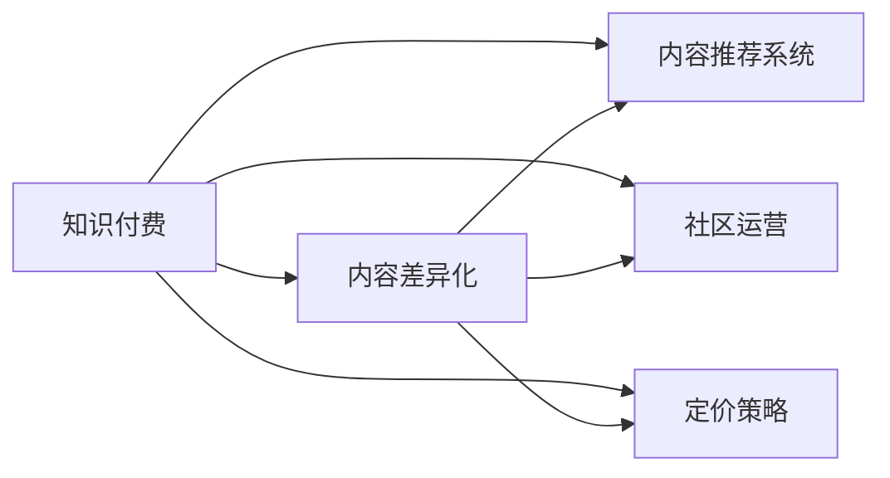

                 

# 知识付费创业的内容差异化策略

## 1. 背景介绍

在知识经济时代，信息爆炸导致信息过载，传统文本阅读方式已难以满足人们日益增长的信息获取需求。知识付费则成为解决这一问题的有效手段。用户愿意为高质量的内容支付费用，希望通过付费获取更有价值、有深度、有体系的资讯，满足自身学习和知识提升的需求。

### 1.1 知识付费市场发展

知识付费市场从2016年起步，经过几年高速发展，已经逐步形成相对稳定的用户基础。根据中国互联网络信息中心(CNNIC)发布的第49次《中国互联网络发展状况统计报告》，截至2021年12月，中国知识付费用户规模达4.77亿，市场规模达360亿元，保持高速增长态势。

### 1.2 知识付费内容需求

知识付费的核心价值在于内容的质量和独特性。用户愿意支付费用获取的，是那些能够真正解决自身需求、提供有深度见解和独特知识体系的内容。用户对内容的差异化需求，催生了知识付费创业企业的探索和创新。

## 2. 核心概念与联系

### 2.1 核心概念概述

为更好理解知识付费创业的内容差异化策略，我们需梳理以下几个核心概念：

- **知识付费**：用户为获取有价值、深度、系统的知识和信息而付费的行为。
- **内容差异化**：企业通过提供与市场同类产品不同的内容或服务，满足用户独特需求，形成竞争优势。
- **内容推荐系统**：利用算法分析用户行为和偏好，精准推荐个性化内容，提升用户体验。
- **社区运营**：通过线上线下互动，形成用户粘性，打造社交互动的社群文化。
- **定价策略**：根据内容价值、市场需求等因素，制定灵活的付费策略，实现收益最大化。

这些概念间的关系可以用以下Mermaid流程图表示：



该图展示了知识付费创业的流程：知识付费企业通过提供差异化的高质量内容，结合推荐系统和社区运营，采用灵活的定价策略，实现商业价值。

## 3. 核心算法原理 & 具体操作步骤

### 3.1 算法原理概述

知识付费创业的核心在于内容差异化，差异化的本质在于提供独特的知识价值。差异化策略的制定和实施，涉及到内容选择、算法推荐、社区运营和定价机制等多个方面，每个环节均需运用到不同的算法原理。

### 3.2 算法步骤详解

#### 3.2.1 内容选择算法

内容选择算法用于从海量内容中筛选优质资源。算法主要基于以下几类指标：

- **内容质量**：包括内容的权威性、深度、时效性等。
- **用户评价**：通过用户评分、评论等反馈数据，识别出受欢迎的优质内容。
- **内容类别**：根据用户兴趣和行为数据，匹配相关的长尾内容，避免同质化。

常用的算法有协同过滤、基于内容的过滤、矩阵分解等。

#### 3.2.2 算法推荐算法

推荐算法用于精准推送个性化内容，提升用户体验。推荐算法通常采用以下策略：

- **基于协同过滤**：通过用户行为和偏好数据，发现相似用户，推荐相似内容。
- **基于内容过滤**：通过内容特征和用户需求匹配，推荐相关内容。
- **混合推荐**：结合协同过滤和内容过滤，取两者优势，提升推荐效果。

常用的推荐算法有TF-IDF、协同过滤、矩阵分解、深度学习等。

#### 3.2.3 社区运营算法

社区运营算法用于增加用户粘性，提升用户活跃度。算法主要包括以下几类：

- **用户行为分析**：通过分析用户行为数据，了解用户需求和兴趣。
- **社交网络分析**：利用社交网络分析方法，构建用户兴趣图谱。
- **内容质量管理**：通过算法检测内容质量，及时处理低质量内容。

常用的算法有社交网络分析、异常检测、用户行为分析等。

#### 3.2.4 定价策略算法

定价策略算法用于制定灵活的付费机制，提升用户转化率和收益。算法主要包括以下几类：

- **动态定价**：根据市场需求和内容价值，灵活调整价格。
- **免费试用**：提供短期免费试用期，吸引用户付费。
- **订阅模式**：通过订阅制度，提升用户粘性和长期收益。

常用的算法有动态定价算法、免费试用算法、订阅模型算法等。

### 3.3 算法优缺点

#### 3.3.1 内容选择算法

**优点**：
- 能够高效筛选优质内容，提升内容质量。
- 利用数据挖掘技术，发现长尾内容，避免同质化。

**缺点**：
- 数据获取难度大，需要大量标注数据和高质量数据源。
- 算法复杂，处理大数据量时效率较低。

#### 3.3.2 算法推荐算法

**优点**：
- 能够精准推送个性化内容，提升用户体验。
- 可以不断优化，提升推荐效果。

**缺点**：
- 需要大量用户行为数据，数据隐私问题需重点关注。
- 算法复杂，模型训练和优化难度较大。

#### 3.3.3 社区运营算法

**优点**：
- 提升用户粘性，增强用户互动。
- 数据分析技术可为后续内容推荐和定价提供依据。

**缺点**：
- 社区管理和维护成本较高。
- 用户行为数据真实性难以保证，可能导致推荐偏差。

#### 3.3.4 定价策略算法

**优点**：
- 灵活定价，提升用户转化率和收益。
- 能够根据市场变化动态调整价格。

**缺点**：
- 定价策略需根据实际市场需求和内容价值反复测试和调整。
- 动态定价可能导致用户预期不稳，影响付费意愿。

## 4. 数学模型和公式 & 详细讲解

### 4.1 数学模型构建

以内容推荐系统为例，推荐模型的数学模型可以表示为：

$$
y = f(x, \theta)
$$

其中 $y$ 表示推荐结果，$x$ 为用户特征和内容特征，$\theta$ 为模型参数。

推荐系统常用的模型包括协同过滤模型和基于内容的过滤模型：

1. **协同过滤模型**：

   该模型基于用户行为数据，寻找相似用户和相似物品，推荐与用户喜欢的物品相似的物品。模型可表示为：

   $$
   y = \mathbf{U}^\top\mathbf{V}
   $$

   其中 $\mathbf{U}$ 和 $\mathbf{V}$ 分别为用户和物品的特征矩阵。

2. **基于内容的过滤模型**：

   该模型通过分析物品特征和用户需求匹配，推荐相关物品。模型可表示为：

   $$
   y = \mathbf{C}^\top\mathbf{D}
   $$

   其中 $\mathbf{C}$ 为物品特征矩阵，$\mathbf{D}$ 为物品特征和用户需求的匹配矩阵。

### 4.2 公式推导过程

以协同过滤模型为例，用户 $i$ 对物品 $j$ 的评分预测公式为：

$$
\hat{r}_{ij} = \mathbf{u}_i^\top \mathbf{v}_j
$$

其中 $\mathbf{u}_i$ 和 $\mathbf{v}_j$ 分别为用户 $i$ 和物品 $j$ 的特征向量。

协同过滤模型的用户-物品相似度计算公式为：

$$
\tilde{r}_{ij} = \mathbf{u}_i^\top \mathbf{v}_j
$$

通过求解 $\tilde{r}_{ij}$ 的矩阵分解，可以计算出用户 $i$ 对物品 $j$ 的评分预测值：

$$
\hat{r}_{ij} = \frac{\mathbf{u}_i^\top \mathbf{v}_j}{\sqrt{\mathbf{u}_i^\top \mathbf{u}_i} \sqrt{\mathbf{v}_j^\top \mathbf{v}_j}}
$$

### 4.3 案例分析与讲解

**案例1:** 某知识付费平台对用户内容进行推荐，采用协同过滤算法。平台收集了用户对各类课程的评分数据，构建用户-课程评分矩阵 $\mathbf{R}$。通过对 $\mathbf{R}$ 进行奇异值分解(SVD)，得到用户特征矩阵 $\mathbf{U}$ 和课程特征矩阵 $\mathbf{V}$。利用 $\mathbf{U}^\top\mathbf{V}$ 对新用户 $i$ 推荐相似课程。

**案例2:** 某平台通过用户行为数据，分析用户兴趣和行为，采用基于内容的过滤算法。平台收集了用户浏览课程内容时长、点击课程页面次数等行为数据，构建用户兴趣向量 $\mathbf{c}_i$ 和课程特征向量 $\mathbf{d}_j$。利用 $\mathbf{c}_i^\top\mathbf{d}_j$ 计算用户对课程的兴趣程度，推荐相关课程。

## 5. 项目实践：代码实例和详细解释说明

### 5.1 开发环境搭建

**环境准备**：

1. **Python**：安装最新版本的Python和Anaconda环境。
2. **Numpy**：数据处理和矩阵计算库。
3. **Pandas**：数据分析和数据处理库。
4. **Scikit-learn**：机器学习库，包含协同过滤算法。
5. **Matplotlib**：数据可视化库。
6. **Keras/TensorFlow**：深度学习库，用于模型训练和评估。

**安装命令**：

```bash
conda create -n py36 python=3.6
conda activate py36
pip install numpy pandas scikit-learn matplotlib tensorflow
```

### 5.2 源代码详细实现

以下代码展示了基于协同过滤的推荐系统实现：

```python
import numpy as np
from scipy.sparse.linalg import svds
from sklearn.metrics.pairwise import cosine_similarity
from sklearn.decomposition import TruncatedSVD

def collaborative_filtering(data, n_factors=10, n_rec=10):
    # 将数据转换为稀疏矩阵
    R = np.array(data, dtype=np.float32)
    R[R == 0] = -1
    R[R == 1] = 0

    # 奇异值分解
    U, S, V = svds(R, k=n_factors)

    # 计算用户-物品相似度矩阵
    U = U[:, :n_factors]
    V = V[:n_factors, :]
    cosine_sim = cosine_similarity(U, V)
    
    # 为用户推荐最相似的物品
    for user_id, user_data in data.items():
        similar_items = np.argsort(cosine_sim[user_id])[:n_rec]
        for item_id in similar_items:
            print(f"推荐课程: {item_id}")

data = {
    1: [0, 0, 1, 1, 1, 0],
    2: [1, 0, 0, 0, 0, 1],
    3: [0, 0, 0, 1, 0, 1]
}

collaborative_filtering(data, n_factors=2, n_rec=3)
```

### 5.3 代码解读与分析

**代码解读**：

- 导入必要的库，包含Numpy、Scipy、Scikit-learn等。
- 定义协同过滤算法函数`collaborative_filtering`，输入为用户行为数据`data`，输出为用户推荐相似课程。
- 首先将用户行为数据转换为稀疏矩阵`R`，并进行奇异值分解，得到用户特征矩阵`U`和物品特征矩阵`V`。
- 计算用户-物品相似度矩阵`cosine_sim`，并根据相似度矩阵为用户推荐最相似的课程。

**代码分析**：

- 本代码实现了基于协同过滤的推荐系统，通过奇异值分解获取用户和物品的特征向量，计算相似度并推荐相似物品。
- 代码简单易懂，易于扩展，适用于小规模数据。
- 实际应用中，需要增加用户行为数据的收集和处理，以提升推荐效果。

## 6. 实际应用场景

### 6.1 知识付费平台的内容推荐

知识付费平台用户多样，需求各异。通过内容推荐算法，平台能精准推荐用户感兴趣的课程和内容，提升用户体验和留存率。平台可根据用户浏览记录、评分数据、搜索行为等进行综合分析，输出个性化推荐。

### 6.2 在线教育平台的内容管理

在线教育平台提供丰富的课程资源，内容管理对平台的价值至关重要。平台通过内容选择算法，从海量课程资源中筛选优质内容，结合推荐算法，精准推送个性化内容，提升用户满意度和平台影响力。

### 6.3 内容型社区的运营

内容型社区以用户生成内容为核心，社区的运营关键在于用户粘性和互动。通过社区运营算法，分析用户行为和兴趣，精准推送内容，形成活跃的社群文化，提升用户参与度和忠诚度。

### 6.4 未来应用展望

未来知识付费创业将更加注重内容的多样化和高质量化。随着用户需求的多样化，平台将提供更加精准的个性化推荐，满足用户独特需求。

## 7. 工具和资源推荐

### 7.1 学习资源推荐

- **《深度学习推荐系统：算法与应用》**：介绍推荐系统的基础理论和前沿技术，涵盖协同过滤、深度学习等算法。
- **Kaggle竞赛平台**：参与推荐系统竞赛，锻炼实际应用能力。
- **TensorFlow官方文档**：详细解释TensorFlow的使用方法和推荐系统算法。

### 7.2 开发工具推荐

- **Jupyter Notebook**：数据处理和模型训练的便捷工具。
- **Scikit-learn**：机器学习库，包含协同过滤等推荐算法。
- **TensorFlow**：深度学习库，支持多种推荐模型。

### 7.3 相关论文推荐

- **"Collaborative Filtering for Implicit Feedback Datasets"**：G. Koren等，推荐系统领域经典论文，介绍协同过滤算法的原理和实现。
- **"Knowledge Tracing with Deep Learning"**：F. Alba等，介绍深度学习在知识追踪中的应用，提升学习效果。

## 8. 总结：未来发展趋势与挑战

### 8.1 研究成果总结

知识付费创业在内容差异化策略上取得了显著成效。通过内容选择、算法推荐、社区运营和定价策略等多方面策略，平台成功吸引和留存了大量用户。未来，随着技术的进步和数据量的增长，知识付费创业将在差异化策略上实现更多创新。

### 8.2 未来发展趋势

1. **数据驱动的内容推荐**：利用大数据和机器学习技术，提升内容推荐的精准度。
2. **个性化内容定制**：根据用户需求，定制个性化内容，满足多样化需求。
3. **社区智能运营**：利用智能算法分析用户行为，提升社区运营效率。
4. **内容动态定价**：根据市场需求和内容价值，动态调整价格，实现收益最大化。
5. **跨平台内容共享**：整合不同平台的内容资源，提升资源利用率。

### 8.3 面临的挑战

1. **数据隐私和安全**：用户行为数据需严格保护，避免数据泄露。
2. **内容版权问题**：需合理处理内容版权问题，避免侵犯知识产权。
3. **用户付费意愿**：提升用户对付费内容的认可度，增强付费意愿。
4. **内容质量控制**：保障内容质量，提升用户满意度。

### 8.4 研究展望

未来知识付费创业需不断提升技术实力，探索更多创新策略。通过内容差异化、推荐系统、社区运营和定价策略的协同优化，实现用户价值的最大化。

## 9. 附录：常见问题与解答

**Q1: 知识付费创业的内容差异化策略有哪些？**

A: 内容差异化策略主要包括以下几类：

- 内容选择算法：筛选优质内容，避免同质化。
- 算法推荐算法：精准推送个性化内容。
- 社区运营算法：提升用户粘性和互动。
- 定价策略算法：灵活定价，提升收益。

**Q2: 内容推荐系统的算法有哪些？**

A: 常见的推荐算法有以下几种：

- 协同过滤算法：基于用户行为数据，推荐相似物品。
- 基于内容的过滤算法：通过物品特征和用户需求匹配，推荐相关物品。
- 混合推荐算法：结合协同过滤和内容过滤，取两者优势。

**Q3: 如何提升知识付费平台的用户留存率？**

A: 提升用户留存率的关键在于提供高质量内容和个性化推荐。可以通过以下措施实现：

- 利用内容选择算法，筛选优质内容。
- 采用算法推荐算法，精准推送个性化内容。
- 通过社区运营算法，增强用户粘性和互动。

**Q4: 知识付费平台如何平衡用户需求和收益？**

A: 平台需根据用户需求和市场变化，灵活调整内容和定价策略。具体措施包括：

- 收集用户反馈，优化内容和推荐系统。
- 采用动态定价算法，根据市场需求调整价格。
- 提供免费试用和订阅模式，提升用户粘性和长期收益。

---

作者：禅与计算机程序设计艺术 / Zen and the Art of Computer Programming

