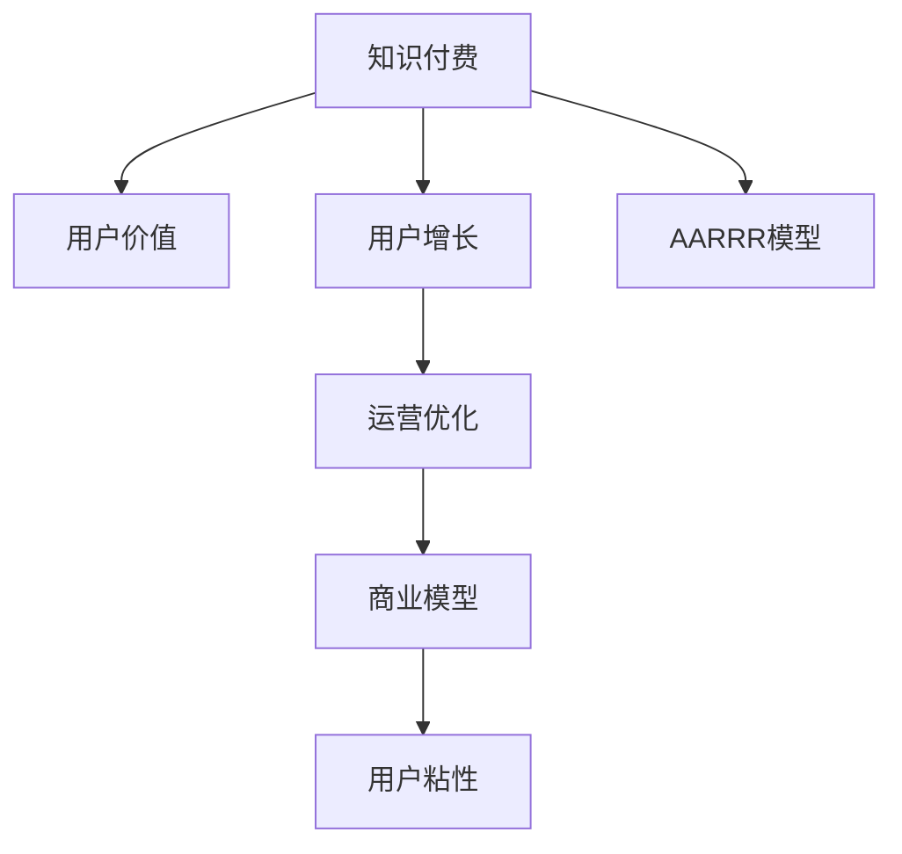

                 

# 知识付费创业的用户价值 Maximization

> 关键词：知识付费,创业,用户价值,增长策略,运营优化

## 1. 背景介绍

### 1.1 问题由来

随着互联网技术的飞速发展，知识付费成为了一个新兴的市场。越来越多的用户愿意为高质量的内容付费，这表明人们对知识的渴望以及对信息筛选效率的提升有着迫切的需求。然而，尽管市场潜力巨大，但许多知识付费平台的创业项目却面临着用户流失率高、用户粘性差、盈利模式不明确等诸多挑战。

### 1.2 问题核心关键点

知识付费创业的核心在于如何最大化用户价值，从而实现可持续增长。这包括了如何吸引用户、提高用户留存、挖掘用户价值以及将用户价值转化为商业价值。

## 2. 核心概念与联系

### 2.1 核心概念概述

为了更好地理解知识付费创业的用户价值最大化，本节将介绍几个密切相关的核心概念：

- **知识付费**：用户为获取特定知识、技能、信息或服务支付费用的模式。包括线上线下多种形式，如订阅、单次购买、按需服务等。
- **用户价值**：用户通过使用产品或服务所获得的收益，包括功能价值、情感价值、社交价值等。
- **用户增长**：通过营销、转化、留存等策略增加用户数量和提高用户活跃度的过程。
- **运营优化**：对产品、服务、流程等进行持续改进和优化，以提升用户体验和业务效率。
- **商业模型**：产品或服务的盈利方式，如广告、订阅、商品销售等。
- **用户粘性**：用户对产品或服务的依赖程度和复购率。
- **AARRR模型**：Acquisition（获取）、Activation（激活）、Retention（留存）、Revenue（收益）、Refer（推荐），用于描述用户增长和运营策略。

这些核心概念之间的逻辑关系可以通过以下Mermaid流程图来展示：



这个流程图展示了一些核心概念的相互关联：

1. 知识付费平台提供内容或服务，满足用户需求，从而提升用户价值。
2. 用户增长策略吸引新用户，同时优化用户体验，提升用户留存和转化率。
3. 运营优化通过持续改进产品和服务，进一步提高用户粘性。
4. 商业模型探索盈利方式，实现业务的可持续运营和增长。

## 3. 核心算法原理 & 具体操作步骤
### 3.1 算法原理概述

用户价值最大化可以通过AARRR模型进行全面分析。AARRR模型从用户生命周期的不同阶段出发，通过数据驱动和算法优化，实现用户价值的最大化。

**Acquisition（获取）阶段**：通过市场推广、搜索引擎优化、社交媒体营销等手段，吸引潜在用户注册或下载使用。

**Activation（激活）阶段**：通过首次登陆引导、个性化推荐、免费试用等方式，激发用户首次使用产品，并进行首次付费。

**Retention（留存）阶段**：通过持续提供优质内容和互动体验，以及个性化服务和增值功能，提升用户满意度和复购率。

**Revenue（收益）阶段**：通过订阅模式、单次付费模式、广告模式等多种收益形式，实现业务的盈利。

**Refer（推荐）阶段**：通过用户推荐、奖励机制、社交分享等方式，增加新用户，实现用户增长的良性循环。

### 3.2 算法步骤详解

基于AARRR模型的用户价值最大化，一般包括以下几个关键步骤：

**Step 1: 数据收集与分析**

- 收集用户行为数据，包括注册、登录、浏览、购买、评价等行为。
- 对数据进行清洗和预处理，提取关键特征，如用户活跃度、付费频率、满意评分等。

**Step 2: 用户细分与画像构建**

- 根据用户行为数据进行用户细分，如按地域、年龄、性别、兴趣等分类。
- 构建用户画像，形成不同群体的特征描述，用于指导个性化推荐和服务优化。

**Step 3: 用户获取与激活**

- 制定吸引新用户的策略，如SEO优化、社交媒体广告、推荐引擎等。
- 设计首次登陆引导流程，提供优质内容和功能，促进首次付费。

**Step 4: 用户留存与互动**

- 定期推送个性化推荐内容，增强用户粘性。
- 优化用户体验，增加互动元素，如社区论坛、实时客服等。

**Step 5: 用户收益与推荐**

- 设计合理的订阅模式和付费模式，增加用户长期价值。
- 引入推荐引擎和奖励机制，激励用户主动推荐新用户。

**Step 6: 数据分析与持续优化**

- 实时监控关键指标，如用户留存率、复购率、ARPU等。
- 基于数据分析结果，持续优化产品和服务，提升用户价值。

### 3.3 算法优缺点

基于AARRR模型的用户价值最大化方法具有以下优点：

1. **全面性**：覆盖了用户生命周期的各个阶段，提供全面的用户价值分析视角。
2. **数据驱动**：通过数据驱动的算法优化，精准预测和提升用户价值。
3. **可操作性强**：每个阶段都有具体的操作策略，易于实施和调整。

同时，该方法也存在一些局限性：

1. **复杂度较高**：需要收集和处理大量用户数据，对技术要求较高。
2. **成本投入大**：各个阶段的优化策略需要大量的市场推广、内容生产和运营维护成本。
3. **用户多样性**：不同用户群体的需求和行为差异较大，难以统一优化。
4. **短期效果有限**：某些策略可能需要较长时间才能见效，难以快速提升用户价值。

尽管存在这些局限性，但就目前而言，AARRR模型仍是最广泛应用的用户价值最大化范式。未来相关研究的重点在于如何进一步降低用户获取和留存的成本，提升用户粘性和转化率，同时兼顾数据隐私和用户权益。

### 3.4 算法应用领域

基于用户价值最大化的AARRR模型在多个领域都得到了应用，例如：

- **在线教育**：通过个性化推荐和互动学习，提升用户学习效果和粘性。
- **在线医疗**：提供定制化医疗咨询和健康管理服务，提升用户满意度和忠诚度。
- **金融科技**：提供精准金融产品和个性化理财建议，增加用户理财收益和粘性。
- **健身运动**：通过个性化训练计划和社区互动，提升用户健身效果和粘性。
- **旅游服务**：提供个性化旅游建议和目的地推荐，增加用户预订率。

除了上述这些经典应用外，AARRR模型也被创新性地应用到更多场景中，如智慧城市、智能家居、在线零售等，为不同领域的企业带来了价值提升和用户体验的改善。

## 4. 数学模型和公式 & 详细讲解 & 举例说明

### 4.1 数学模型构建

本节将使用数学语言对知识付费平台的用户价值最大化进行更加严格的刻画。

假设知识付费平台的目标用户数为 $U$，用户增长率为 $\lambda$，激活率为 $\alpha$，留存率为 $\beta$，付费率为 $\gamma$，推荐率为 $\delta$。则AARRR模型中的各个阶段可以表示为：

- 用户获取：$U_{\text{Acquisition}} = U_0 \times (1 + \lambda) \times (1 - \lambda)$
- 用户激活：$U_{\text{Activation}} = U_{\text{Acquisition}} \times \alpha$
- 用户留存：$U_{\text{Retention}} = U_{\text{Activation}} \times \beta$
- 用户收益：$U_{\text{Revenue}} = U_{\text{Retention}} \times \gamma$
- 用户推荐：$U_{\text{Refer}} = U_{\text{Retention}} \times \delta$

其中，$U_0$ 表示初始用户数，$\lambda$、$\alpha$、$\beta$、$\gamma$、$\delta$ 分别为各个阶段的概率参数。

### 4.2 公式推导过程

以下我们以在线教育平台为例，推导AARRR模型的用户价值最大化公式。

假设在线教育平台提供个性化视频课程，用户可以按月订阅或购买单次课程。平台的目标是最大化用户订阅数 $N$ 和总收益 $R$。

- 用户获取：假设平台每月获得 $N_{\text{Acquisition}}$ 的新用户。
- 用户激活：假设每名新用户在首次登陆后，有 $\alpha$ 的概率进行首次付费。
- 用户留存：假设每名付费用户在每月的留存率为 $\beta$。
- 用户收益：假设每名订阅用户在每月的收益为 $P$。

则平台的总收益 $R$ 可以表示为：

$$
R = \sum_{i=1}^N \alpha^i \beta^{i-1} P
$$

其中，$N = N_{\text{Acquisition}} \times \alpha \times \beta^{i-1}$。

将总收益表达式对时间 $t$ 求导，得：

$$
\frac{dR}{dt} = N_{\text{Acquisition}} \alpha \beta^{i-1} P + N_{\text{Acquisition}} \alpha \beta^i P - N_{\text{Acquisition}} \alpha \beta^i P
$$

令 $\frac{dR}{dt} = 0$，解得 $i = 1$ 时收益最大。

即，平台需要最大化每月新用户 $N_{\text{Acquisition}}$，同时通过优化激活率 $\alpha$、留存率 $\beta$ 和付费率 $\gamma$ 来最大化总收益 $R$。

### 4.3 案例分析与讲解

以下通过一个具体的案例，分析AARRR模型在在线教育平台的应用。

假设某在线教育平台，每月活跃用户数为1000人，用户增长率为5%，激活率为10%，每月订阅率为20%，用户留存率为70%，每名用户每月收益为50元。

- 用户获取：每月新增用户数为 $1000 \times 5\% \times (1 - 5\%) = 45$。
- 用户激活：首次付费用户数为 $45 \times 10\% = 4.5$。
- 用户留存：次月订阅用户数为 $4.5 \times 20\% \times 70\% = 0.63$。
- 用户收益：每月总收益为 $0.63 \times 50 \times 12 = 324$ 元。

可以看到，通过优化各个阶段的概率参数，平台可以显著提升总收益。

## 5. 项目实践：代码实例和详细解释说明
### 5.1 开发环境搭建

在进行用户价值最大化实践前，我们需要准备好开发环境。以下是使用Python进行用户行为分析的环境配置流程：

1. 安装Anaconda：从官网下载并安装Anaconda，用于创建独立的Python环境。

2. 创建并激活虚拟环境：
```bash
conda create -n user_value_env python=3.8 
conda activate user_value_env
```

3. 安装相关包：
```bash
pip install pandas numpy matplotlib seaborn sklearn
```

完成上述步骤后，即可在`user_value_env`环境中开始用户价值最大化的实践。

### 5.2 源代码详细实现

下面我们以用户行为分析为例，给出使用Python进行AARRR模型用户价值最大化的代码实现。

首先，定义AARRR模型中的各个参数：

```python
import numpy as np

# 初始用户数
U_0 = 1000
# 用户增长率
lambda_ = 0.05
# 用户激活率
alpha = 0.10
# 用户留存率
beta = 0.70
# 用户付费率
gamma = 0.20
# 用户收益
P = 50
```

然后，计算各个阶段的用户数和收益：

```python
# 用户获取
N_Acquisition = U_0 * (1 + lambda_) * (1 - lambda_)
# 用户激活
N_Activation = N_Acquisition * alpha
# 用户留存
N_Retention = N_Activation * beta
# 用户收益
R = N_Retention * gamma * P
```

最后，展示计算结果：

```python
print(f"用户获取：{N_Acquisition}")
print(f"用户激活：{N_Activation}")
print(f"用户留存：{N_Retention}")
print(f"用户收益：{R}")
```

以上就是使用Python进行用户价值最大化分析的完整代码实现。可以看到，AARRR模型通过简单的数学公式，可以直观地计算出各个阶段的用户数和收益，为平台的优化策略提供数据支撑。

### 5.3 代码解读与分析

让我们再详细解读一下关键代码的实现细节：

**用户获取计算**：
- 通过用户增长率和用户流失率计算每月新增用户数 $N_{\text{Acquisition}}$。

**用户激活计算**：
- 根据用户增长率和用户激活率，计算首次付费用户数 $N_{\text{Activation}}$。

**用户留存计算**：
- 根据首次付费用户数和用户留存率，计算次月订阅用户数 $N_{\text{Retention}}$。

**用户收益计算**：
- 根据次月订阅用户数和每名用户收益，计算每月总收益 $R$。

可以看到，AARRR模型中的每个阶段都有明确的数据计算方式，可以方便地进行优化和调整。

## 6. 实际应用场景
### 6.1 在线教育平台

在线教育平台通过个性化课程推荐和互动学习，大幅提升用户学习效果和粘性。在实际应用中，平台可以利用AARRR模型，对用户获取、激活、留存、收益和推荐等各个阶段进行全面的数据分析和优化。

- **用户获取**：通过SEO优化、社交媒体广告、推荐引擎等手段，吸引新用户注册和试用。
- **用户激活**：通过首次登陆引导、个性化推荐、免费试用等方式，激发用户首次付费。
- **用户留存**：定期推送个性化推荐内容，增加互动元素，提升用户满意度和复购率。
- **用户收益**：通过订阅模式、单次付费模式、增值服务等，实现持续盈利。
- **用户推荐**：引入推荐引擎和奖励机制，激励用户主动推荐新用户，增加新用户来源。

通过AARRR模型的应用，在线教育平台可以有效地提升用户价值，实现业务的可持续发展。

### 6.2 在线医疗服务

在线医疗服务通过提供定制化医疗咨询和健康管理服务，提升用户满意度和忠诚度。平台可以利用AARRR模型，对用户获取、激活、留存、收益和推荐等各个阶段进行全面的数据分析和优化。

- **用户获取**：通过搜索引擎优化、社交媒体广告、医疗咨询渠道等手段，吸引新用户注册和试用。
- **用户激活**：通过首次登陆引导、个性化推荐、免费试用等方式，激发用户首次付费。
- **用户留存**：定期推送个性化健康管理服务，增加互动元素，提升用户满意度和复购率。
- **用户收益**：通过订阅模式、单次付费模式、增值服务等，实现持续盈利。
- **用户推荐**：引入推荐引擎和奖励机制，激励用户主动推荐新用户，增加新用户来源。

通过AARRR模型的应用，在线医疗平台可以有效地提升用户价值，实现业务的可持续发展。

### 6.3 金融科技服务

金融科技服务通过提供精准金融产品和个性化理财建议，增加用户理财收益和粘性。平台可以利用AARRR模型，对用户获取、激活、留存、收益和推荐等各个阶段进行全面的数据分析和优化。

- **用户获取**：通过搜索引擎优化、社交媒体广告、理财知识普及等手段，吸引新用户注册和试用。
- **用户激活**：通过首次登陆引导、个性化理财建议、免费试用等方式，激发用户首次付费。
- **用户留存**：定期推送个性化理财方案，增加互动元素，提升用户满意度和复购率。
- **用户收益**：通过订阅模式、单次付费模式、增值服务等，实现持续盈利。
- **用户推荐**：引入推荐引擎和奖励机制，激励用户主动推荐新用户，增加新用户来源。

通过AARRR模型的应用，金融科技平台可以有效地提升用户价值，实现业务的可持续发展。

### 6.4 未来应用展望

随着AARRR模型的不断发展和优化，其应用场景将更加广泛，价值最大化也将更加深入。未来，AARRR模型将结合更多前沿技术，如人工智能、大数据、区块链等，为用户提供更全面、更个性化的服务，推动各个行业的数字化转型和升级。

## 7. 工具和资源推荐
### 7.1 学习资源推荐

为了帮助开发者系统掌握用户价值最大化的理论基础和实践技巧，这里推荐一些优质的学习资源：

1. **《增长黑客》**：这本书详细介绍了用户增长策略的全流程，从用户获取、激活、留存到推荐等各个阶段都有详细的案例分析。
2. **《A/B测试：科学与艺术》**：这本书讲述了A/B测试在产品优化中的重要应用，通过数据分析和实验设计，提升用户体验和业务效果。
3. **《数据科学与商业智能》**：这门课程由知名数据科学家授课，涵盖数据收集、处理、分析等全流程，适合对数据科学感兴趣的读者。
4. **《Google Analytics》**：Google提供的免费数据分析工具，可以实时监控用户行为，提供丰富的用户洞察和优化建议。
5. **《Python数据分析》**：这门课程由Kaggle专家授课，涵盖数据清洗、可视化、机器学习等全流程，适合Python开发者。

通过对这些资源的学习实践，相信你一定能够快速掌握用户价值最大化的精髓，并用于解决实际的商业问题。

### 7.2 开发工具推荐

高效的开发离不开优秀的工具支持。以下是几款用于用户价值最大化开发的常用工具：

1. **Google Analytics**：Google提供的免费数据分析工具，可以实时监控用户行为，提供丰富的用户洞察和优化建议。
2. **Mixpanel**：提供用户行为分析、A/B测试、用户路径分析等功能，帮助开发者深入理解用户行为和需求。
3. **Tableau**：数据可视化工具，可以生成美观、易懂的图表和报表，帮助开发者进行数据探索和决策支持。
4. **Kaggle**：数据科学竞赛平台，提供丰富的数据集和机器学习资源，适合数据科学家和工程师进行学习和实验。
5. **PyTorch**：基于Python的开源深度学习框架，灵活动态的计算图，适合快速迭代研究。

合理利用这些工具，可以显著提升用户价值最大化的开发效率，加快创新迭代的步伐。

### 7.3 相关论文推荐

用户价值最大化技术的发展源于学界的持续研究。以下是几篇奠基性的相关论文，推荐阅读：

1. **《增长黑客》**：这本书详细介绍了用户增长策略的全流程，从用户获取、激活、留存到推荐等各个阶段都有详细的案例分析。
2. **《A/B测试：科学与艺术》**：这本书讲述了A/B测试在产品优化中的重要应用，通过数据分析和实验设计，提升用户体验和业务效果。
3. **《数据科学与商业智能》**：这门课程由知名数据科学家授课，涵盖数据收集、处理、分析等全流程，适合对数据科学感兴趣的读者。
4. **《Google Analytics》**：Google提供的免费数据分析工具，可以实时监控用户行为，提供丰富的用户洞察和优化建议。
5. **《Python数据分析》**：这门课程由Kaggle专家授课，涵盖数据清洗、可视化、机器学习等全流程，适合Python开发者。

这些论文代表了大模型微调技术的发展脉络。通过学习这些前沿成果，可以帮助研究者把握学科前进方向，激发更多的创新灵感。

## 8. 总结：未来发展趋势与挑战
### 8.1 总结

本文对基于AARRR模型的用户价值最大化进行了全面系统的介绍。首先阐述了用户价值最大化的研究背景和意义，明确了AARRR模型在用户获取、激活、留存、收益和推荐等各个阶段的重要性。其次，从原理到实践，详细讲解了AARRR模型的数学原理和关键步骤，给出了用户价值最大化任务开发的完整代码实例。同时，本文还广泛探讨了AARRR模型在在线教育、在线医疗、金融科技等多个领域的应用前景，展示了AARRR模型的巨大潜力。

通过本文的系统梳理，可以看到，AARRR模型正在成为用户价值最大化的重要范式，极大地拓展了用户获取、激活、留存、收益和推荐等各个环节的优化空间，催生了更多的落地场景。受益于AARRR模型的强大分析能力，各行业的用户价值最大化将得到进一步提升，为数字经济的发展注入新的动力。

### 8.2 未来发展趋势

展望未来，AARRR模型的应用将更加广泛和深入，呈现以下几个发展趋势：

1. **数据驱动**：通过大数据和机器学习技术，对用户行为进行更深入的分析和预测，实现更精准的用户价值优化。
2. **人工智能**：引入人工智能技术，如深度学习、自然语言处理等，提升用户体验和个性化推荐效果。
3. **区块链**：结合区块链技术，提升数据安全和用户隐私保护，构建可信的用户价值最大化的生态系统。
4. **跨平台协同**：通过跨平台的数据和功能整合，实现统一的用户体验和优化策略。
5. **用户体验优化**：更加注重用户体验的优化，提升用户满意度和忠诚度，实现长期价值提升。

这些趋势将进一步推动AARRR模型的应用和发展，带来更多的业务创新和用户价值最大化。

### 8.3 面临的挑战

尽管AARRR模型在用户价值最大化中发挥了重要作用，但在实施过程中仍面临一些挑战：

1. **数据隐私和安全**：在收集和分析用户数据时，需要严格遵守数据隐私法规，保护用户隐私。
2. **用户个性化需求**：不同用户的需求和行为差异较大，难以统一优化。
3. **成本投入高**：用户价值最大化的优化策略需要大量的市场推广、内容生产和运营维护成本。
4. **短期效果有限**：某些优化策略可能需要较长时间才能见效，难以快速提升用户价值。
5. **技术复杂度高**：需要结合多种技术手段，如数据分析、机器学习、人工智能等，进行复杂的模型构建和优化。

尽管存在这些挑战，但通过技术创新和实践优化，AARRR模型仍然有望在未来的应用中实现更高效的用户价值最大化。

### 8.4 研究展望

面对AARRR模型所面临的挑战，未来的研究需要在以下几个方面寻求新的突破：

1. **数据隐私保护**：引入隐私保护技术和匿名化方法，确保用户数据的安全性和隐私性。
2. **个性化需求满足**：通过用户画像和推荐系统，提供更加个性化的服务和产品。
3. **成本控制优化**：优化用户获取和留存策略，降低运营成本。
4. **技术融合创新**：结合更多前沿技术，如区块链、人工智能等，提升用户价值最大化效果。
5. **用户体验提升**：更加注重用户体验的优化，提升用户满意度和忠诚度。

这些研究方向的探索，必将引领AARRR模型向更高的台阶发展，为用户价值最大化提供更全面、更高效的解决方案。

## 9. 附录：常见问题与解答
----------------------------------------------------------------

**Q1：如何选择合适的用户价值最大化策略？**

A: 用户价值最大化的策略需要根据具体的业务场景和用户需求来选择。一般来说，可以通过数据分析和实验设计，评估不同策略的效果，选择最优方案。常用的策略包括用户获取、激活、留存、收益和推荐等。

**Q2：用户价值最大化是否适用于所有行业？**

A: 用户价值最大化的方法适用于大多数行业，尤其是面向用户提供服务的领域。但不同行业的需求和特点不同，需要结合具体的业务场景进行调整和优化。

**Q3：用户价值最大化需要多长时间才能见效？**

A: 用户价值最大化的优化策略通常需要较长时间才能见效。但可以通过持续监控和优化，逐步提升用户价值。在初期阶段，需要结合市场推广、内容生产和运营维护等策略，快速吸引和留住用户。

**Q4：用户价值最大化是否需要大量数据？**

A: 用户价值最大化需要大量的用户行为数据进行分析和优化。但可以通过数据收集、清洗和预处理，优化数据质量和可用性。在数据量较小的情况下，可以通过小样本实验和迭代优化，逐步提升用户价值。

**Q5：用户价值最大化是否需要高成本？**

A: 用户价值最大化的优化策略通常需要较高的成本投入，包括市场推广、内容生产和运营维护等。但可以通过精细化运营和数据驱动策略，降低成本。此外，也可以结合人工智能和机器学习技术，提升效率和效果。

---

作者：禅与计算机程序设计艺术 / Zen and the Art of Computer Programming

