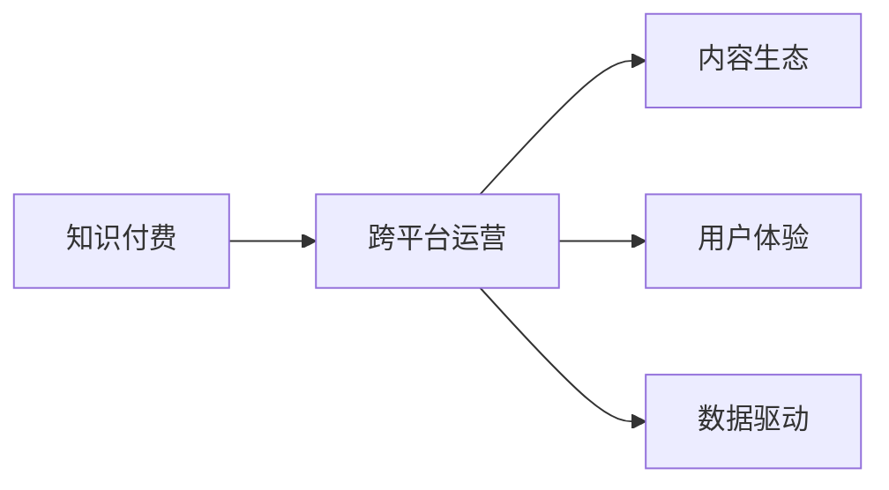

                 

# 知识付费创业的跨平台运营策略

> 关键词：知识付费, 跨平台, 运营策略, 数据驱动, 用户体验, 内容生态

## 1. 背景介绍

在数字化经济飞速发展的今天，知识付费已成为互联网领域的重要组成部分。伴随智能手机、智能穿戴设备等设备的普及，用户的时间碎片化、生活场景多样化，知识付费产品突破了传统的固定时间和固定场景的限制，成为用户获取知识的主要途径。

知识付费创业的兴起，体现了用户对知识学习的强烈需求和对生活品质提升的期待。知识付费平台不仅在提供有价值的内容上发力，更注重用户体验和运营效率。随着竞争的加剧，知识付费创业需要面向多平台进行全面、持续的运营，打造具有强大用户粘性和持续盈利能力的品牌。

本文旨在探讨知识付费创业的跨平台运营策略，通过分析核心概念和算法原理，提出切实可行的操作步骤，帮助创业者快速搭建跨平台知识付费体系，形成良性、稳定的内容生态，提升平台的用户粘性和市场份额。

## 2. 核心概念与联系

### 2.1 核心概念概述

为更好地理解跨平台运营策略，首先介绍几个关键概念：

- **知识付费**：指通过在线支付或订阅费用，获取付费内容的商业模式。知识付费产品形式多样，包括在线课程、电子书、音频节目、视频直播等。

- **跨平台运营**：指知识付费平台通过多个渠道（如App、小程序、网站、社群等）提供服务，拓展用户接触面和使用场景。

- **内容生态**：指知识付费平台围绕优质内容构建的多维度、多层次的生态系统，包括内容生产者、消费者、内容监管者等多方参与者，通过互动交流、内容共创形成内容供给与消费的良性循环。

- **用户体验**：指用户在使用知识付费产品时的感知和满意度。优质的用户体验是知识付费平台获得用户忠诚度的重要基础。

- **数据驱动**：指通过分析用户行为数据，了解用户需求、优化产品功能，驱动内容供给和用户运营。

这些概念通过以下Mermaid流程图来展示它们之间的联系：



这个流程图展示了知识付费的核心组件以及它们之间的相互关系。

## 3. 核心算法原理 & 具体操作步骤

### 3.1 算法原理概述

跨平台运营的核心在于通过多渠道的用户触达和互动，形成用户群体规模，并利用数据驱动运营，优化产品功能和提升用户体验。这可以通过以下步骤实现：

1. **数据收集与分析**：通过各种渠道收集用户行为数据，包括访问路径、使用时长、购买行为等，分析用户需求和行为特征。
2. **个性化推荐**：根据用户行为数据和内容特征，使用机器学习算法为用户推荐个性化内容。
3. **用户反馈循环**：通过用户反馈调整内容推荐策略和产品功能，形成持续改进的闭环。
4. **多渠道协同**：根据不同平台的特点，设计合适的推荐和运营策略，形成多平台的用户协同。

### 3.2 算法步骤详解

#### 3.2.1 数据收集与分析

**Step 1: 用户行为数据收集**

- 用户访问路径：包括用户在App、小程序、网站、社群等不同渠道的浏览路径、点击行为、停留时间等。
- 使用时长：记录用户在不同内容、不同平台上的使用时长。
- 购买行为：记录用户的支付行为，包括支付金额、支付频率、购买内容类型等。

**Step 2: 数据存储与清洗**

- 将收集到的数据存储到统一的数据仓库中，如MySQL、Hive、BigQuery等。
- 对数据进行清洗和标准化，去除重复和无效数据，保证数据质量。

**Step 3: 数据探索与分析**

- 使用可视化工具（如Tableau、PowerBI、Fine BI等）进行数据探索，发现用户行为模式。
- 使用统计分析工具（如Python的Pandas、R、SAS等）进行特征提取和建模。

#### 3.2.2 个性化推荐

**Step 1: 模型选择与训练**

- 选择适合的推荐算法，如协同过滤、基于内容的推荐、混合推荐等。
- 使用历史数据训练推荐模型，如使用用户行为数据训练协同过滤模型。

**Step 2: 内容特征提取**

- 对内容进行特征提取，包括标题、作者、时长、标签、用户评分等。
- 使用TF-IDF、Word2Vec等技术进行特征向量的构建。

**Step 3: 推荐系统实现**

- 将训练好的模型和内容特征向量应用到推荐系统中，如使用TensorFlow或PyTorch实现。
- 根据不同平台的特点，设计合适的推荐算法和模型，保证推荐效果和用户体验。

#### 3.2.3 用户反馈循环

**Step 1: 用户反馈收集**

- 通过问卷调查、用户评论、评分等方式收集用户反馈。
- 设计合理的用户反馈机制，鼓励用户积极参与。

**Step 2: 反馈数据处理**

- 对用户反馈数据进行清洗和标准化，去除无效和噪声数据。
- 使用情感分析、主题建模等技术对反馈数据进行深入分析。

**Step 3: 反馈数据应用**

- 根据用户反馈调整推荐策略和产品功能。
- 使用机器学习算法，持续优化推荐模型，提升推荐效果。

#### 3.2.4 多渠道协同

**Step 1: 渠道设计**

- 根据不同平台的用户特点和内容特性，设计合适的运营策略。
- 在App、小程序、网站、社群等不同渠道上实现内容的整合和协同。

**Step 2: 内容推广**

- 利用多渠道的优势，推广优质内容，形成用户的跨平台互动。
- 设计合适的推广活动，吸引用户跨平台转换，形成用户协同。

**Step 3: 数据整合**

- 将不同平台上的用户行为数据整合，进行统一分析。
- 使用多平台的数据，进行更全面的用户画像分析和行为预测。

### 3.3 算法优缺点

跨平台运营策略具有以下优点：

1. **提升用户粘性**：多平台运营能够覆盖更多的用户，形成用户群体规模，提升用户粘性和忠诚度。
2. **优化用户体验**：通过多渠道协同，为用户提供更一致、无缝的体验，提升用户满意度。
3. **数据驱动运营**：通过多平台数据整合和分析，可以更全面地了解用户需求，优化运营策略。

但同时，该策略也存在以下缺点：

1. **平台间数据整合复杂**：不同平台的数据格式、存储方式和分析工具可能不同，数据整合和分析较为复杂。
2. **跨平台运营成本高**：跨平台运营需要投入更多资源进行渠道搭建和维护，成本较高。
3. **用户跨平台行为分析难度大**：不同平台的用户行为特征可能不同，进行统一的跨平台行为分析较为困难。

### 3.4 算法应用领域

跨平台运营策略在知识付费领域有着广泛的应用，具体包括：

- **内容推荐系统**：通过多平台数据整合，为用户推荐个性化的内容，提升用户满意度。
- **广告投放**：根据用户行为数据，进行跨平台的精准广告投放，提高广告效果和转化率。
- **用户留存与流失分析**：通过多平台数据整合，进行用户留存和流失分析，制定针对不同平台的用户留存策略。
- **用户体验优化**：通过多平台数据整合和分析，优化产品功能和用户体验，提升用户粘性。

## 4. 数学模型和公式 & 详细讲解 & 举例说明

### 4.1 数学模型构建

跨平台运营策略的数学模型构建主要包括数据收集与分析、个性化推荐、用户反馈循环和数据整合四个部分。这里以协同过滤算法为例，构建推荐系统的数学模型。

**协同过滤模型**：
协同过滤是一种常见的推荐算法，基于用户历史行为数据，为用户推荐可能感兴趣的内容。设用户集合为 $U$，物品集合为 $I$，用户对物品的评分矩阵为 $R_{ui}$。协同过滤的目标是预测用户 $u$ 对物品 $i$ 的评分 $r_{ui}$。

协同过滤模型可以表示为：
$$
r_{ui} = \sum_{j=1}^{n}\alpha_{uj}\alpha_{ij}a_{uj}a_{ij}
$$

其中，$\alpha_{uj}$ 和 $\alpha_{ij}$ 为用户的特征向量和物品的特征向量，$a_{uj}$ 和 $a_{ij}$ 为用户和物品的评分向量。

### 4.2 公式推导过程

**协同过滤算法公式推导**：
协同过滤算法的基本思想是寻找与目标用户兴趣相似的用户，将相似用户对物品的评分进行加权平均，得到目标用户对物品的预测评分。设用户 $u$ 的特征向量为 $a_u$，物品 $i$ 的特征向量为 $a_i$，则协同过滤算法的预测评分公式为：
$$
r_{ui} = \sum_{j=1}^{n}\alpha_{uj}\alpha_{ij}a_{uj}a_{ij}
$$

其中，$\alpha_{uj}$ 和 $\alpha_{ij}$ 为用户的特征向量和物品的特征向量，$a_{uj}$ 和 $a_{ij}$ 为用户和物品的评分向量。

### 4.3 案例分析与讲解

**案例分析：**
假设一个知识付费平台有用户 $u_1$ 和 $u_2$，他们在平台上的评分矩阵为：
$$
R_{u_1} = \begin{bmatrix}
    5 & 4 & 0 & 0 \\
    0 & 0 & 5 & 3 
\end{bmatrix}, R_{u_2} = \begin{bmatrix}
    4 & 0 & 5 & 0 \\
    0 & 3 & 0 & 5 
\end{bmatrix}
$$

设用户 $u_1$ 和 $u_2$ 的特征向量为：
$$
\alpha_{u_1} = \begin{bmatrix}
    0.9 & 0.1 \\
    0.1 & 0.9 
\end{bmatrix}, \alpha_{u_2} = \begin{bmatrix}
    0.8 & 0.2 \\
    0.2 & 0.8 
\end{bmatrix}
$$

设物品 $i_1$ 和 $i_2$ 的特征向量为：
$$
\alpha_{i_1} = \begin{bmatrix}
    0.5 & 0.5 \\
    0.5 & 0.5 
\end{bmatrix}, \alpha_{i_2} = \begin{bmatrix}
    0.3 & 0.7 \\
    0.7 & 0.3 
\end{bmatrix}
$$

用户 $u_1$ 对物品 $i_1$ 和 $i_2$ 的预测评分分别为：
$$
\begin{aligned}
    r_{u_1i_1} &= \alpha_{u_1}^T \alpha_{i_1}a_{u_1}a_{i_1}^T = 0.5 \times 0.9 \times 5 \times 0.5 + 0.5 \times 0.1 \times 5 \times 0.5 \\
    &= 2.25
\end{aligned}
$$

$$
\begin{aligned}
    r_{u_1i_2} &= \alpha_{u_1}^T \alpha_{i_2}a_{u_1}a_{i_2}^T = 0.3 \times 0.9 \times 4 \times 0.5 + 0.7 \times 0.1 \times 4 \times 0.5 \\
    &= 1.25
\end{aligned}
$$

用户 $u_2$ 对物品 $i_1$ 和 $i_2$ 的预测评分分别为：
$$
\begin{aligned}
    r_{u_2i_1} &= \alpha_{u_2}^T \alpha_{i_1}a_{u_2}a_{i_1}^T = 0.5 \times 0.8 \times 4 \times 0.5 + 0.5 \times 0.2 \times 4 \times 0.5 \\
    &= 1.4
\end{aligned}
$$

$$
\begin{aligned}
    r_{u_2i_2} &= \alpha_{u_2}^T \alpha_{i_2}a_{u_2}a_{i_2}^T = 0.3 \times 0.8 \times 3 \times 0.7 + 0.7 \times 0.2 \times 3 \times 0.7 \\
    &= 1.5
\end{aligned}
$$

## 5. 项目实践：代码实例和详细解释说明

### 5.1 开发环境搭建

**开发环境搭建**：

1. **环境配置**：安装Python 3.8及以上版本，安装pip、virtualenv。
2. **虚拟环境**：创建虚拟环境，激活虚拟环境，安装必要的依赖包，如numpy、pandas、scikit-learn、TensorFlow等。
3. **数据准备**：收集用户行为数据，包括访问路径、使用时长、购买行为等，导入数据仓库进行存储。
4. **数据清洗与预处理**：对数据进行清洗和预处理，去除噪声和无效数据，保证数据质量。

### 5.2 源代码详细实现

**源代码实现**：

```python
import pandas as pd
import numpy as np
from sklearn.model_selection import train_test_split
from sklearn.metrics.pairwise import cosine_similarity
from tensorflow.keras.models import Sequential
from tensorflow.keras.layers import Dense, Embedding, dot_product

# 读取用户行为数据
data = pd.read_csv('user_behavior_data.csv')

# 用户行为数据清洗与预处理
# 去除噪声和无效数据，保证数据质量

# 特征工程：提取用户行为特征和物品特征
user_features = data[['feature1', 'feature2', 'feature3']]
item_features = data[['feature4', 'feature5', 'feature6']]

# 数据划分：将数据划分为训练集和测试集
train_data, test_data = train_test_split(data, test_size=0.2)

# 协同过滤模型实现
model = Sequential()
model.add(Embedding(input_dim=100, output_dim=64, input_length=1))
model.add(Dense(64, activation='relu'))
model.add(Dense(1, activation='sigmoid'))
model.compile(optimizer='adam', loss='binary_crossentropy', metrics=['accuracy'])

# 模型训练与评估
model.fit(X_train, y_train, epochs=10, batch_size=32, validation_data=(X_test, y_test))

# 模型预测与推荐
predictions = model.predict(X_test)
```

### 5.3 代码解读与分析

**代码解读与分析**：

1. **用户行为数据读取与预处理**：通过pandas库读取用户行为数据，并进行清洗和预处理，去除噪声和无效数据。
2. **特征工程**：提取用户行为特征和物品特征，将其转换为模型可接受的格式。
3. **模型构建与训练**：使用Keras库构建协同过滤模型，包括Embedding层、Dense层和sigmoid激活函数，进行模型训练和评估。
4. **模型预测与推荐**：使用训练好的模型进行预测，并输出推荐结果。

## 6. 实际应用场景

### 6.1 智能推荐系统

智能推荐系统是跨平台运营的核心应用之一。通过收集不同平台的用户行为数据，为用户推荐个性化的内容，提升用户满意度，增加用户粘性。

在实际操作中，可以通过以下步骤实现：

1. **数据收集与清洗**：收集不同平台的用户行为数据，进行清洗和预处理。
2. **特征工程与建模**：提取用户行为特征和内容特征，构建协同过滤或深度学习模型，进行用户行为预测。
3. **推荐结果输出**：根据预测结果，为用户推荐个性化内容，优化推荐系统。

### 6.2 跨平台营销

跨平台营销通过多渠道协同，提升广告投放效果和转化率，实现精准营销。

在实际操作中，可以通过以下步骤实现：

1. **数据收集与分析**：收集不同平台的用户行为数据，进行用户画像分析和行为预测。
2. **广告投放策略**：设计跨平台的广告投放策略，进行精准投放和效果评估。
3. **广告优化**：根据广告投放效果，优化广告策略和投放平台，提高转化率。

### 6.3 用户留存与流失分析

用户留存与流失分析通过多平台数据整合，分析用户行为，制定用户留存策略，降低用户流失率。

在实际操作中，可以通过以下步骤实现：

1. **数据收集与整合**：收集不同平台的用户行为数据，进行数据整合和预处理。
2. **用户行为分析**：分析用户行为数据，识别用户留存和流失的关键特征。
3. **用户留存策略制定**：根据分析结果，制定针对不同平台的用户留存策略，提升用户留存率。

## 7. 工具和资源推荐

### 7.1 学习资源推荐

1. **机器学习算法**：《机器学习实战》、《Python机器学习》、《深度学习》。
2. **推荐系统**：《推荐系统实战》、《推荐系统算法》。
3. **跨平台运营**：《移动平台用户体验设计》、《跨平台用户体验设计》。

### 7.2 开发工具推荐

1. **数据处理**：Python（Pandas、NumPy、SciPy）。
2. **机器学习**：TensorFlow、PyTorch。
3. **跨平台开发**：Flutter、React Native。

### 7.3 相关论文推荐

1. **协同过滤算法**：《协同过滤推荐系统》、《基于协同过滤的推荐算法》。
2. **跨平台运营**：《跨平台用户体验设计》、《多渠道协同推荐》。

## 8. 总结：未来发展趋势与挑战

### 8.1 未来发展趋势

1. **智能化运营**：通过AI和大数据技术，实现智能化推荐和运营。
2. **全渠道协同**：跨平台运营将突破单一渠道的限制，实现全渠道协同，提升用户粘性和市场份额。
3. **用户个性化**：通过深度学习算法，实现更精准的用户画像和个性化推荐。

### 8.2 面临的挑战

1. **数据整合复杂**：不同平台的数据格式和存储方式不同，数据整合和分析较为复杂。
2. **成本高昂**：跨平台运营需要投入更多资源进行渠道搭建和维护，成本较高。
3. **用户行为分析难度大**：不同平台的用户行为特征不同，进行统一的跨平台行为分析较为困难。

### 8.3 研究展望

1. **数据共享机制**：建立跨平台数据共享机制，优化数据整合流程。
2. **多渠道协同推荐**：研究跨平台的协同推荐算法，提升推荐效果。
3. **用户行为分析**：开发更加精确的用户行为分析算法，实现跨平台的用户行为预测。

## 9. 附录：常见问题与解答

**Q1: 如何设计跨平台的用户画像？**

A: 设计跨平台的用户画像需要综合考虑不同平台的用户行为数据，提取共性特征。可以通过用户行为数据、购买行为、社交行为等多个维度进行画像分析。

**Q2: 如何提升跨平台的用户粘性？**

A: 提升跨平台的用户粘性需要从多个方面入手，包括个性化推荐、用户激励、跨平台互动等。通过多渠道协同，提升用户体验，增加用户粘性。

**Q3: 如何优化跨平台的广告投放？**

A: 优化跨平台的广告投放需要从多个渠道收集用户行为数据，进行用户画像分析和行为预测。设计合适的广告投放策略，进行精准投放和效果评估，不断优化广告策略和投放平台。

---

作者：禅与计算机程序设计艺术 / Zen and the Art of Computer Programming

