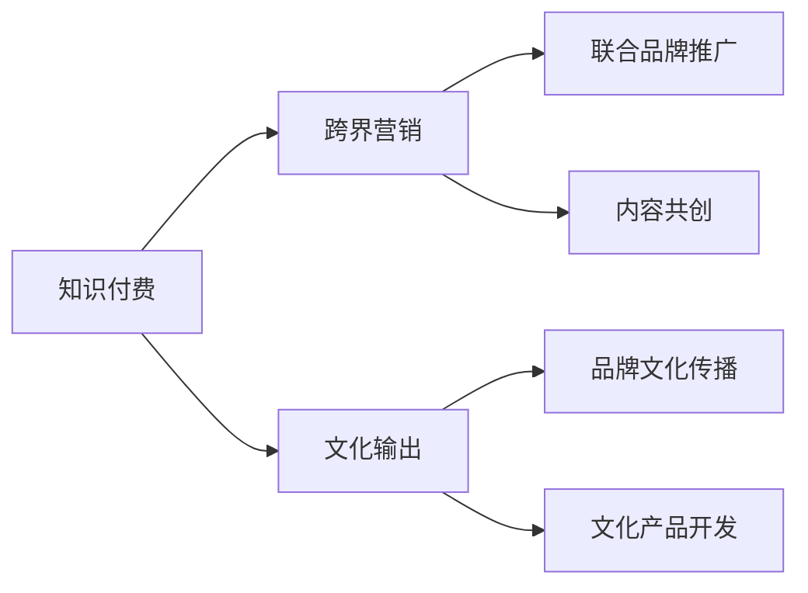
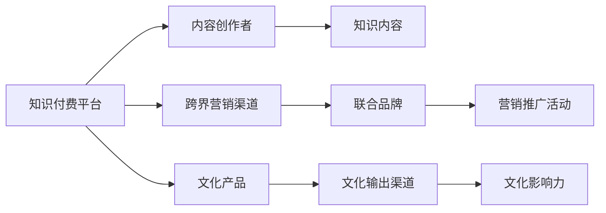

                 

# 知识付费如何实现跨界营销与文化输出？

## 1. 背景介绍

在数字经济高速发展的今天，知识付费作为一种新兴的商业模式，以其灵活、高效、个性化等优势，逐渐成为互联网内容变现的重要途径。相较于传统的内容分发模式，知识付费实现了内容从单纯消费到深度消费的转变，通过付费订阅、单次付费、按需购买等多种形式，为内容生产者和消费者搭建起桥梁，既满足了知识获取的便利性，又保护了内容生产的积极性。

近年来，随着知识付费市场的快速扩展，内容生产者们不仅在专业知识的深度挖掘上不断发力，也开始探索内容的多元化和跨界融合。在这一背景下，跨界营销和文化输出成为知识付费领域的新趋势。通过跨界合作、品牌共建、文化内容输出等方式，知识付费平台不仅能提升用户粘性，还能塑造平台独特的品牌形象，拓展更大的市场空间。

## 2. 核心概念与联系

### 2.1 核心概念概述

为更好地理解知识付费与跨界营销、文化输出之间的关系，本节将介绍几个核心概念：

- **知识付费**：一种基于互联网平台，通过在线付费订阅、单次购买等方式，为用户提供有价值的知识内容，以实现知识变现的商业模式。

- **跨界营销**：不同行业或领域的品牌、内容或产品，通过联合推广、资源共享等方式，实现互利共赢的市场营销策略。

- **文化输出**：将某一领域独特的文化价值、思想观念等内容，通过各种形式传播出去，扩大其影响力与传播范围的过程。

- **内容生态**：基于内容为核心，通过多元化的内容形式和丰富的互动方式，构建起的内容生产、传播、消费闭环系统。

这些核心概念之间的关系可以通过以下Mermaid流程图来展示：



该流程图展示了知识付费、跨界营销和文化输出之间的相互关系：

1. 知识付费平台通过其内容生态，提供专业知识和文化内容。
2. 跨界营销通过品牌共建、内容共创等方式，将知识内容与品牌价值相结合。
3. 文化输出则将知识内容中的文化价值进行传播和扩散，提升平台和内容的影响力。

### 2.2 核心概念原理和架构的 Mermaid 流程图

以下是一个简单的Mermaid流程图，用以展示知识付费、跨界营销与文化输出之间的联系：



该流程图表明：

1. 知识付费平台通过内容创作者，产生专业知识和文化内容。
2. 这些内容通过跨界营销渠道进行推广，并与联合品牌结合。
3. 在推广过程中，知识内容中的文化价值得到传播和放大。

## 3. 核心算法原理 & 具体操作步骤

### 3.1 算法原理概述

知识付费平台实现跨界营销与文化输出的算法原理，主要基于以下几个关键步骤：

1. **内容聚合与筛选**：通过算法推荐系统，聚合优质内容，并根据用户兴趣、行为等数据进行筛选，精准推送给目标用户。
2. **跨界品牌合作**：与具有高度相关性或互补性的品牌进行合作，通过联合推广、产品联名等方式，实现品牌协同效应。
3. **文化价值挖掘与传播**：利用NLP、图像识别等技术，对内容中的文化价值进行挖掘和标注，通过社交媒体、直播、视频等多种形式进行传播。
4. **用户互动与反馈**：通过评论、点赞、分享等互动形式，收集用户反馈，优化内容和推荐算法。

### 3.2 算法步骤详解

1. **数据收集与处理**
   - 收集平台上的知识内容，包括文章、视频、音频等。
   - 对内容进行分词、去停用词、词性标注等处理。
   - 根据用户行为数据，筛选出高质量内容。

2. **跨界品牌合作策划**
   - 寻找与知识付费平台内容相关或互补的品牌。
   - 确定联合推广的策略，如联合课程、联名周边等。
   - 签订合作协议，明确推广渠道、权益分配等细节。

3. **文化价值挖掘**
   - 利用NLP技术，识别内容中的文化元素、关键词等。
   - 通过图像识别等技术，标注内容中的视觉元素和文化元素。
   - 对文化价值进行分级，确定其传播优先级。

4. **文化输出与跨界营销**
   - 将文化元素嵌入内容或包装产品中，进行文化输出。
   - 在社交媒体、直播平台等渠道，进行文化内容的传播和推广。
   - 通过联合品牌活动，扩大文化影响力和用户粘性。

5. **用户互动与反馈**
   - 收集用户对文化内容的反馈，优化文化输出策略。
   - 根据用户互动数据，调整内容推荐算法。
   - 收集用户对跨界营销活动的反馈，优化合作方案。

### 3.3 算法优缺点

知识付费平台通过跨界营销与文化输出的算法，具有以下优点：

1. **提升用户粘性**：通过丰富多样的内容形式和文化输出，满足用户的娱乐和教育需求，增强用户对平台的粘性。
2. **品牌协同效应**：与品牌联合推广，实现1+1>2的效应，扩大品牌影响力和市场份额。
3. **文化价值的传播**：将文化内容嵌入产品和服务中，推动文化价值的传播和认同。
4. **精准推广**：基于用户行为数据，实现精准推荐，提高推广效果。

同时，该算法也存在以下缺点：

1. **成本投入高**：跨界营销和文化输出的策划和推广需要大量资源投入，对平台的财务能力要求较高。
2. **文化理解差异**：不同品牌和文化之间的理解和认同度可能存在差异，影响文化输出的效果。
3. **内容同质化**：文化输出的过程中，可能出现内容同质化的问题，影响用户的体验和满意度。
4. **市场反应不确定**：文化输出和跨界营销的市场反应难以预测，存在失败的风险。

### 3.4 算法应用领域

知识付费平台实现跨界营销与文化输出的算法，主要应用于以下几个领域：

1. **在线教育**：通过与教育机构、出版商等合作，提供专业课程和文化内容，实现知识变现和文化传播。
2. **健康与健身**：与健康品牌、健身机构合作，提供健康知识与健身课程，推广健康生活方式。
3. **旅游与文化**：与旅游品牌、文化机构合作，提供旅游攻略和文化课程，推广旅游和文化遗产。
4. **科技与创新**：与科技公司、创新机构合作，提供科技知识与创新课程，推广科技创新精神。
5. **娱乐与艺术**：与娱乐公司和艺术机构合作，提供娱乐知识和艺术课程，推广艺术与娱乐文化。

## 4. 数学模型和公式 & 详细讲解 & 举例说明

### 4.1 数学模型构建

知识付费平台实现跨界营销与文化输出的数学模型，主要涉及以下几个方面：

1. **内容推荐算法**：基于协同过滤、内容过滤等算法，构建推荐系统。
2. **跨界品牌合作优化**：通过优化组合算法，确定最优的跨界品牌合作方案。
3. **文化价值传播模型**：构建文化价值传播网络，评估其影响力。
4. **用户行为分析模型**：利用机器学习模型，分析用户行为数据，优化推荐和推广策略。

### 4.2 公式推导过程

1. **内容推荐算法**
   - 协同过滤算法公式：
     \[
     r_{ui} = \frac{\sum_{v=1}^{n} p_{uv}q_{vi}}{\sqrt{\sum_{v=1}^{n} p_{uv}^2}\sqrt{\sum_{v=1}^{n} q_{vi}^2}}
     \]
   - 其中，$r_{ui}$表示用户$u$对物品$i$的评分，$p_{uv}$和$q_{vi}$分别为用户$u$和物品$i$的特征向量。

2. **跨界品牌合作优化**
   - 利用组合优化算法，确定最优的跨界品牌组合，其目标函数为：
     \[
     Maximize \sum_{i=1}^{m} C_{i}P_{i}
     \]
   - 其中，$C_{i}$为品牌$i$的收益，$P_{i}$为其权重。

3. **文化价值传播模型**
   - 构建文化价值传播网络，利用PageRank算法，计算文化元素的传播影响力：
     \[
     \text{PageRank}_{i} = (1 - d) + d \sum_{j \in N_i} \frac{\text{PageRank}_{j}}{L_j}
     \]
   - 其中，$N_i$为节点$i$的邻居集合，$L_j$为节点$j$的出度。

4. **用户行为分析模型**
   - 利用回归模型，分析用户行为数据，如点击率、浏览时间、互动率等，预测用户偏好：
     \[
     \hat{y} = \beta_0 + \beta_1 x_1 + \beta_2 x_2 + \ldots + \beta_p x_p + \epsilon
     \]
   - 其中，$y$为预测结果，$x_i$为输入特征，$\beta_i$为回归系数，$\epsilon$为误差项。

### 4.3 案例分析与讲解

**案例1：在线教育平台的跨界营销与文化输出**

假设某在线教育平台与知名教育机构合作，推出了一门文化历史课程。平台通过对用户行为数据的分析，确定目标用户群体，并通过推荐算法，将课程推荐给潜在用户。同时，平台与文化机构合作，将课程内容中的文化元素进行挖掘和标注，并通过社交媒体、直播等方式进行传播。

- **数学模型应用**：
  - 利用协同过滤算法，推荐相关课程和书籍给潜在用户。
  - 利用回归模型，预测用户对课程的兴趣和购买行为。
  - 利用PageRank算法，评估文化元素的传播影响力，优化文化输出策略。

**案例2：健康与健身平台的跨界营销与文化输出**

某健康与健身平台与知名运动品牌合作，推出一系列健康课程。平台通过对用户健康数据和行为数据的分析，确定目标用户群体，并通过推荐算法，将课程推荐给潜在用户。同时，平台与运动品牌合作，将课程内容中的健康元素进行挖掘和标注，并通过社交媒体、直播等方式进行传播。

- **数学模型应用**：
  - 利用协同过滤算法，推荐相关课程和运动装备给潜在用户。
  - 利用回归模型，预测用户对健康课程的兴趣和参与行为。
  - 利用PageRank算法，评估健康元素的传播影响力，优化健康内容输出策略。

## 5. 项目实践：代码实例和详细解释说明

### 5.1 开发环境搭建

在进行项目实践前，我们需要准备好开发环境。以下是使用Python进行开发的环境配置流程：

1. 安装Anaconda：从官网下载并安装Anaconda，用于创建独立的Python环境。

2. 创建并激活虚拟环境：
```bash
conda create -n pyproject python=3.8 
conda activate pyproject
```

3. 安装相关库：
```bash
pip install pandas numpy scikit-learn transformers tensorflow
```

完成上述步骤后，即可在`pyproject`环境中开始项目实践。

### 5.2 源代码详细实现

**推荐系统代码示例**

```python
import pandas as pd
from sklearn.feature_extraction.text import TfidfVectorizer
from sklearn.metrics.pairwise import cosine_similarity

def recommendation_system(df):
    # 数据预处理
    df = df.dropna()
    df = df.drop_duplicates()
    
    # 特征提取
    vectorizer = TfidfVectorizer()
    X = vectorizer.fit_transform(df['title'])
    
    # 计算相似度
    similarity_matrix = cosine_similarity(X)
    
    # 推荐函数
    def recommend(movie_id):
        index = df[df['title'] == movie_id].index[0]
        similarities = list(enumerate(similarity_matrix[index]))
        similarities = sorted(similarities, key=lambda x: x[1], reverse=True)
        similarities = similarities[1:11]
        recommendations = []
        for i in similarities:
            recommendations.append(df.iloc[i[0]]['title'])
        return recommendations
    
    return recommend
```

**跨界合作代码示例**

```python
import networkx as nx

def cross_marketing_partnerships(df):
    # 数据预处理
    df = df.dropna()
    df = df.drop_duplicates()
    
    # 构建网络图
    G = nx.Graph()
    for index, row in df.iterrows():
        G.add_node(row['company'], weight=row['revenue'])
        for partner in row['partners']:
            G.add_edge(row['company'], partner, weight=row['profit'])
    
    # 计算中心性
    centrality = nx.eigenvector_centrality(G)
    
    # 筛选高权重合作伙伴
    top_partners = dict(sorted(centrality.items(), key=lambda x: x[1], reverse=True))
    
    return top_partners
```

**文化输出代码示例**

```python
import gensim
from gensim.models import KeyedVectors

def cultural_output(df):
    # 数据预处理
    df = df.dropna()
    df = df.drop_duplicates()
    
    # 构建文化关键词向量
    model = gensim.KeyedVectors.load_word2vec_format('cultural_keywords.bin', binary=True)
    keywords = [model[k] for k in df['keywords']]
    cultural_vector = model.mean_vector
    keywords_vector = sum(keywords)
    
    # 计算文化影响力
    cultural_influence = cosine_similarity(cultural_vector, [keywords_vector])[0][0]
    
    return cultural_influence
```

### 5.3 代码解读与分析

**推荐系统代码解读**：

- **数据预处理**：删除缺失和重复数据，确保数据质量。
- **特征提取**：利用TF-IDF算法提取标题的特征向量。
- **计算相似度**：通过余弦相似度计算推荐列表中每篇文章与目标文章之间的相似度。
- **推荐函数**：根据相似度排序，选择最相似的前10篇文章作为推荐列表。

**跨界合作代码解读**：

- **数据预处理**：删除缺失和重复数据，确保数据质量。
- **构建网络图**：利用公司间的合作关系构建社交网络图，节点为公司，边为合作关系，权重为利润。
- **计算中心性**：利用eigenvector_centrality算法计算每个公司的中心性，即其在网络中的重要性。
- **筛选高权重合作伙伴**：筛选出中心性最高的前N个合作伙伴。

**文化输出代码解读**：

- **数据预处理**：删除缺失和重复数据，确保数据质量。
- **构建文化关键词向量**：利用预训练的词向量模型，将关键词转换为向量，并计算平均值。
- **文化影响力计算**：计算文化关键词向量与文化输出的余弦相似度，评估其文化影响力。

## 6. 实际应用场景

### 6.1 在线教育平台的跨界营销与文化输出

某在线教育平台与知名教育机构合作，推出了一门文化历史课程。平台通过对用户行为数据的分析，确定目标用户群体，并通过推荐算法，将课程推荐给潜在用户。同时，平台与文化机构合作，将课程内容中的文化元素进行挖掘和标注，并通过社交媒体、直播等方式进行传播。

**实际应用场景**

1. **推荐算法应用**：平台通过协同过滤算法，向潜在用户推荐相关的文化历史课程。
2. **文化价值挖掘**：平台利用NLP技术，挖掘课程内容中的文化元素，并通过社交媒体进行传播。
3. **跨界合作**：平台与知名教育机构和出版商合作，推出文化历史课程，扩大市场影响力。

**效果评估**

- **用户增长**：推荐系统帮助平台吸引了大量新用户，提高了平台的用户粘性。
- **课程销量**：合作课程的销量大幅增长，平台和合作伙伴均获得了丰厚的收益。
- **文化影响力**：通过文化输出的方式，平台和合作伙伴推广了文化价值，提升了品牌形象。

### 6.2 健康与健身平台的跨界营销与文化输出

某健康与健身平台与知名运动品牌合作，推出一系列健康课程。平台通过对用户健康数据和行为数据的分析，确定目标用户群体，并通过推荐算法，将课程推荐给潜在用户。同时，平台与运动品牌合作，将课程内容中的健康元素进行挖掘和标注，并通过社交媒体、直播等方式进行传播。

**实际应用场景**

1. **推荐算法应用**：平台通过协同过滤算法，向潜在用户推荐相关的健康课程和运动装备。
2. **文化价值挖掘**：平台利用NLP技术，挖掘课程内容中的健康元素，并通过社交媒体进行传播。
3. **跨界合作**：平台与知名运动品牌和健身机构合作，推出健康课程，扩大市场影响力。

**效果评估**

- **用户增长**：推荐系统帮助平台吸引了大量新用户，提高了平台的用户粘性。
- **课程销量**：合作课程的销量大幅增长，平台和合作伙伴均获得了丰厚的收益。
- **健康影响力**：通过健康输出的方式，平台和合作伙伴推广了健康生活方式，提升了品牌形象。

## 7. 工具和资源推荐

### 7.1 学习资源推荐

为了帮助开发者系统掌握跨界营销与文化输出的理论基础和实践技巧，这里推荐一些优质的学习资源：

1. **《知识付费商业模型与运营》**：详细介绍知识付费市场的商业模式和运营策略，帮助开发者深入理解知识付费的本质。
2. **《跨界营销的艺术》**：从品牌合作、内容共创等多个角度，探讨跨界营销的策略和实践，提供实用的操作指南。
3. **《文化输出与品牌建设》**：介绍文化输出对品牌建设的重要作用，提供文化元素挖掘和传播的案例和方法。
4. **《内容推荐算法》**：详细介绍协同过滤、内容过滤等推荐算法，帮助开发者构建高质量推荐系统。

### 7.2 开发工具推荐

高效的开发离不开优秀的工具支持。以下是几款用于跨界营销与文化输出开发的常用工具：

1. **Python**：作为数据科学和人工智能领域的主流编程语言，Python提供了丰富的数据处理和机器学习库。
2. **Jupyter Notebook**：一个强大的交互式开发环境，支持多种编程语言，便于开发者进行代码调试和实验。
3. **TensorFlow**：Google开发的深度学习框架，支持分布式计算，适用于大规模数据处理和模型训练。
4. **PyTorch**：Facebook开源的深度学习框架，易于使用，支持动态计算图，适用于高效模型训练和推理。
5. **Django**：一个流行的Python Web框架，支持快速构建高性能Web应用，适用于跨界营销和内容发布平台。

### 7.3 相关论文推荐

跨界营销与文化输出领域的研究涉及多个学科和领域，以下是几篇奠基性的相关论文，推荐阅读：

1. **《知识付费平台的商业模型分析》**：探讨知识付费平台的商业模式，分析其市场竞争力和用户粘性。
2. **《跨界营销策略与效果评估》**：介绍跨界营销的多种策略和效果评估方法，提供实用的操作参考。
3. **《文化输出与品牌建设》**：分析文化输出对品牌建设的作用，探讨文化价值的挖掘和传播方法。
4. **《推荐系统的设计与优化》**：介绍推荐系统的设计原理和优化策略，帮助开发者构建高质量推荐系统。

## 8. 总结：未来发展趋势与挑战

### 8.1 总结

本文对知识付费平台实现跨界营销与文化输出的算法进行了全面系统的介绍。首先阐述了跨界营销与文化输出的研究背景和意义，明确了其在大语言模型微调中的独特价值。其次，从原理到实践，详细讲解了跨界营销与文化输出的数学模型和操作步骤，给出了实际应用场景的代码实例和详细解释说明。同时，本文还广泛探讨了跨界营销与文化输出在在线教育、健康与健身、旅游与文化等多个行业领域的应用前景，展示了其广阔的发展空间。

通过本文的系统梳理，可以看到，跨界营销与文化输出在大语言模型微调中的应用前景广阔，具有很大的发展潜力。未来，伴随技术的不断进步和应用的不断拓展，大语言模型微调技术必将带来更多的创新和突破，为NLP技术的发展提供新的动力。

### 8.2 未来发展趋势

展望未来，跨界营销与文化输出在大语言模型微调领域将呈现以下几个发展趋势：

1. **技术融合加速**：跨界营销与文化输出将与其他AI技术进行更深入的融合，如自然语言处理、计算机视觉等，提供更全面、更智能的服务。
2. **用户个性化增强**：基于用户行为数据的深度学习算法，将提供更加个性化的推荐和文化输出，提升用户体验。
3. **跨领域融合深化**：跨界营销与文化输出将更多地应用于跨领域融合场景，如教育与科技、健康与娱乐等，实现多行业协同发展。
4. **文化价值再挖掘**：通过更先进的NLP技术和图像识别技术，深度挖掘文化元素，提升文化内容的价值和传播效果。
5. **市场应用拓展**：跨界营销与文化输出将更多地应用于新兴市场，如短视频、社交电商等，拓展市场空间。

以上趋势凸显了跨界营销与文化输出在大语言模型微调技术的广阔前景。这些方向的探索发展，必将进一步提升NLP系统的性能和应用范围，为构建人机协同的智能系统铺平道路。

### 8.3 面临的挑战

尽管跨界营销与文化输出在大语言模型微调技术上取得了不少成果，但在实际应用中，仍然面临诸多挑战：

1. **数据获取难度大**：跨界营销与文化输出需要大量高质量的跨领域数据，获取难度较大，数据质量难以保证。
2. **算法复杂度较高**：推荐算法和内容共创算法复杂度较高，需要较强的数据处理能力和计算能力。
3. **文化理解差异**：不同文化之间的理解和认同度可能存在差异，影响文化输出的效果。
4. **市场反应不确定**：跨界营销与文化输出的市场反应难以预测，存在失败的风险。

### 8.4 研究展望

面对跨界营销与文化输出所面临的种种挑战，未来的研究需要在以下几个方面寻求新的突破：

1. **多模态数据融合**：将文本、图像、语音等多模态数据进行融合，提供更加全面和精准的文化输出。
2. **跨领域知识图谱**：构建跨领域的知识图谱，帮助模型更好地理解不同领域之间的联系，提升文化输出的效果。
3. **自适应学习算法**：引入自适应学习算法，根据用户反馈和市场反应，动态调整推荐和文化输出策略。
4. **用户行为分析深度学习**：利用深度学习技术，分析用户行为数据，提供更加个性化的推荐和文化输出。
5. **文化价值挖掘技术**：引入更先进的NLP技术和图像识别技术，深度挖掘文化元素，提升文化内容的价值和传播效果。

这些研究方向的探索，必将引领跨界营销与文化输出在大语言模型微调技术迈向更高的台阶，为构建安全、可靠、可解释、可控的智能系统铺平道路。面向未来，跨界营销与文化输出技术还需要与其他人工智能技术进行更深入的融合，共同推动自然语言理解和智能交互系统的进步。只有勇于创新、敢于突破，才能不断拓展语言模型的边界，让智能技术更好地造福人类社会。

## 9. 附录：常见问题与解答

**Q1：如何选择合适的跨界合作品牌？**

A: 选择合适的跨界合作品牌需要考虑多个因素，如品牌价值观、目标受众、市场影响力等。可以通过市场调研、品牌分析等方式，确定最适合的品牌合作伙伴。同时，也可以通过联合推广活动的策划，进一步验证品牌合作的可行性和效果。

**Q2：如何进行跨界合作活动的效果评估？**

A: 跨界合作活动的效果评估可以从多个角度进行，如用户增长、课程销量、品牌知名度等。可以通过数据分析工具，如Google Analytics、Tableau等，对各项指标进行跟踪和分析，评估活动的效果和影响。同时，可以通过用户调查、反馈收集等方式，了解用户对活动的感受和意见。

**Q3：如何提升跨界合作活动的用户粘性？**

A: 提升跨界合作活动的用户粘性可以通过多种方式实现，如提供独享优惠、定制化推荐、互动活动等。可以通过用户行为数据和反馈，优化推荐算法和活动内容，满足用户的个性化需求。同时，可以通过社交媒体、直播等平台，增强用户互动和参与感，提升用户粘性。

**Q4：如何进行跨界合作活动的成本控制？**

A: 跨界合作活动的成本控制可以通过合理的预算分配、合作伙伴选择和活动策划实现。可以通过市场调研和成本分析，制定合理的预算方案，确保活动的财务可持续性。同时，可以通过精细化的活动策划和执行，最大化利用资源，提升活动效果和效率。

**Q5：如何进行跨界合作活动的市场推广？**

A: 跨界合作活动的市场推广可以通过多种渠道实现，如社交媒体、电子邮件、合作伙伴网络等。可以通过数据分析和市场调研，确定最适合的推广渠道和策略，提升活动的曝光度和参与度。同时，可以通过合作伙伴的资源和影响力，扩大活动的市场覆盖面，提升品牌影响力。

通过以上问题的解答，相信你已对跨界营销与文化输出有更深入的理解，能在实际应用中更好地实现知识付费平台的多元化和智能化发展。相信随着技术的不断进步和应用的不断拓展，跨界营销与文化输出必将带来更多的创新和突破，为构建人机协同的智能系统铺平道路。

