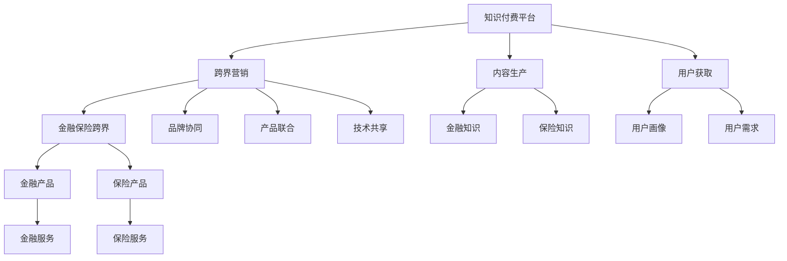

                 

# 知识付费如何实现跨界营销与金融保险跨界？

## 1. 背景介绍

在数字化时代，知识付费逐渐成为人们获取高质量知识的主要途径。通过订阅、购买等方式，用户能够快速获得专业领域的信息，满足自我提升和职业发展的需求。然而，知识付费市场竞争激烈，如何实现有效的跨界营销，打破行业壁垒，成为吸引用户、提升收益的关键。

在众多行业之中，金融保险业具有较强的跨界应用潜力。金融知识、投资策略、风险管理等领域的知识内容，能够为保险业务带来新的思路和方法。同时，保险领域的客户管理、理赔服务、风控技术等，也能为金融知识付费市场带来新的用户和应用场景。

本文将从跨界营销和金融保险跨界的角度，探讨知识付费的策略和实践，为相关企业提供有价值的参考。

## 2. 核心概念与联系

### 2.1 核心概念概述

在探讨知识付费跨界营销和金融保险跨界时，需要理解以下几个核心概念：

- **知识付费**：指用户通过付费方式获取专业知识和信息服务的模式，通常包括订阅、单次购买等形式。
- **跨界营销**：指不同行业之间相互协作，通过品牌、产品、用户等资源的整合，实现多领域的协同增长。
- **金融保险跨界**：指金融业和保险业在产品、服务、技术等方面的融合，实现资源共享和优势互补。

这些概念之间存在紧密联系，通过跨界营销和金融保险跨界，知识付费能够拓展应用范围，提升用户价值，实现更大的商业价值。

### 2.2 核心概念原理和架构的 Mermaid 流程图



该流程图展示了知识付费平台通过跨界营销与金融保险行业协作的逻辑路径：

1. 知识付费平台生产内容，获取用户。
2. 通过跨界营销，与金融保险行业进行品牌、产品、技术的协同。
3. 金融保险行业提供金融产品、保险产品、服务，知识付费平台提供金融知识和保险知识。
4. 最终形成基于用户需求和画像，提供综合解决方案的服务。

## 3. 核心算法原理 & 具体操作步骤

### 3.1 算法原理概述

实现知识付费跨界营销和金融保险跨界，主要依赖于以下几个算法原理：

- **用户画像分析**：通过收集和分析用户行为数据，构建用户画像，了解用户兴趣和需求，指导内容推荐和市场营销。
- **推荐系统优化**：利用协同过滤、内容推荐、混合推荐等算法，提升内容推荐的准确性和个性化水平。
- **营销策略优化**：通过A/B测试、多臂老虎机等方法，优化营销策略，最大化营销效果。
- **金融风险管理**：利用风险评估、模型预测等算法，对金融和保险产品进行风险管理，降低风险损失。
- **跨界协同优化**：通过分析行业数据，识别跨界合作的机会，优化产品和服务的协同策略。

### 3.2 算法步骤详解

#### 3.2.1 用户画像分析

**步骤1：数据收集**
- 收集用户行为数据，包括阅读记录、购买记录、搜索记录等。
- 获取用户基本信息，如年龄、职业、兴趣等。

**步骤2：数据清洗和预处理**
- 对数据进行去重、去噪、缺失值处理。
- 对文本数据进行分词、去停用词等预处理。

**步骤3：特征工程**
- 提取用户行为特征，如阅读时长、点击次数、购买频率等。
- 提取用户属性特征，如年龄、职业、地域等。
- 使用PCA等方法对特征进行降维处理。

**步骤4：建模**
- 使用K-means、DBSCAN等聚类算法，对用户进行分类。
- 使用LDA、PCA等降维算法，对用户特征进行降维。

**步骤5：画像构建**
- 结合用户聚类和特征降维结果，构建用户画像。
- 使用可视化工具，如Tableau、PowerBI等，展示用户画像。

#### 3.2.2 推荐系统优化

**步骤1：数据预处理**
- 对用户数据和商品数据进行清洗和预处理。
- 对文本数据进行分词、去停用词等预处理。

**步骤2：特征工程**
- 提取用户行为特征，如阅读时长、点击次数、购买频率等。
- 提取商品特征，如价格、类别、品牌等。
- 使用TF-IDF、Word2Vec等方法对文本数据进行特征提取。

**步骤3：模型训练**
- 使用协同过滤算法，如ALS、SVD等，训练推荐模型。
- 使用内容推荐算法，如Content-Based Filtering、Item-Based Filtering等，优化推荐效果。
- 使用混合推荐算法，如KNN、LR等，结合协同过滤和内容推荐，提升推荐准确性。

**步骤4：评估和调优**
- 使用均方误差（MSE）、平均绝对误差（MAE）等指标评估推荐效果。
- 通过A/B测试、多臂老虎机等方法，优化推荐策略。

#### 3.2.3 营销策略优化

**步骤1：策略设计**
- 设计多种营销策略，如折扣优惠、积分奖励、会员特权等。
- 制定不同阶段和不同渠道的营销计划。

**步骤2：策略实施**
- 在平台内推广优惠活动，如首页轮播、弹窗提示等。
- 在社交媒体上发布营销内容，如微博、微信等。
- 通过邮件、短信等方式发送营销信息。

**步骤3：效果评估**
- 使用KPI指标，如转化率、点击率、ROI等，评估营销效果。
- 分析用户反馈，了解用户需求和反馈。

#### 3.2.4 金融风险管理

**步骤1：数据收集**
- 收集金融产品、市场数据、用户数据等。
- 获取保险产品、市场数据、用户数据等。

**步骤2：风险评估**
- 使用信用评分模型，评估用户的信用风险。
- 使用违约预测模型，预测用户的违约概率。
- 使用信用评估模型，评估金融产品的风险等级。

**步骤3：模型预测**
- 使用逻辑回归、决策树、随机森林等算法，预测金融产品的风险损失。
- 使用神经网络、支持向量机等算法，预测保险产品的理赔风险。

**步骤4：风险管理**
- 根据预测结果，制定风险管理策略，如信用控制、限额管理等。
- 动态调整金融产品、保险产品的风险等级和定价。
- 实时监控金融市场和保险市场的波动，及时调整风险管理策略。

#### 3.2.5 跨界协同优化

**步骤1：数据共享**
- 建立跨界数据共享机制，确保数据安全和合规。
- 制定数据共享协议，明确数据使用范围和权限。

**步骤2：业务协同**
- 建立跨界业务合作框架，明确各方的职责和权利。
- 制定跨界合作协议，确保各方的利益和承诺。

**步骤3：技术协同**
- 利用云计算、大数据、人工智能等技术，实现跨界技术协同。
- 建立跨界技术联盟，共享技术资源和成果。

**步骤4：效果评估**
- 使用KPI指标，如合作项目的收益、用户满意度等，评估跨界效果。
- 分析跨界合作中的问题，优化合作策略。

### 3.3 算法优缺点

#### 3.3.1 用户画像分析

**优点：**
- 通过用户画像，能够更好地理解用户需求，提升推荐效果。
- 用户画像分析能够指导市场营销，提升转化率和用户粘性。
- 用户画像分析有助于跨界合作，找到潜在的商业机会。

**缺点：**
- 用户画像的准确性依赖于数据的完整性和质量。
- 用户画像的构建和维护需要较大的计算资源和时间成本。
- 用户隐私和数据安全问题需要严格处理。

#### 3.3.2 推荐系统优化

**优点：**
- 推荐系统能够提升用户体验，增加用户粘性和忠诚度。
- 推荐系统能够优化库存管理，降低库存成本。
- 推荐系统能够提高营销效果，增加销售额。

**缺点：**
- 推荐系统的准确性依赖于数据的充分性和特征工程的质量。
- 推荐系统需要实时处理大量数据，对计算资源要求较高。
- 推荐系统可能出现推荐偏见，影响用户体验。

#### 3.3.3 营销策略优化

**优点：**
- 通过优化营销策略，能够提升用户转化率和收益。
- 通过优化营销策略，能够扩大用户基础和市场份额。
- 通过优化营销策略，能够提升品牌知名度和美誉度。

**缺点：**
- 营销策略的效果依赖于用户的行为数据和反馈。
- 营销策略需要频繁更新和调整，增加运营成本。
- 营销策略可能带来副作用，如用户疲劳、负面反馈等。

#### 3.3.4 金融风险管理

**优点：**
- 金融风险管理能够降低金融产品的风险，提高用户信任度。
- 金融风险管理能够优化金融产品定价，提高收益。
- 金融风险管理能够及时发现和应对风险，减少损失。

**缺点：**
- 金融风险管理的准确性依赖于数据的质量和模型的复杂度。
- 金融风险管理需要实时处理大量数据，对计算资源要求较高。
- 金融风险管理可能存在预测误差，影响决策效果。

#### 3.3.5 跨界协同优化

**优点：**
- 跨界协同能够提升资源利用效率，降低成本。
- 跨界协同能够实现技术共享和创新，提升竞争力。
- 跨界协同能够扩大市场范围，提升市场份额。

**缺点：**
- 跨界协同的实现需要协调多方利益，存在沟通和执行成本。
- 跨界协同的数据共享和安全问题需要严格处理。
- 跨界协同的效果依赖于各方的信任和承诺，存在合作风险。

### 3.4 算法应用领域

基于上述算法原理和操作步骤，知识付费平台可以在以下领域实现跨界营销和金融保险跨界：

#### 3.4.1 内容推荐

通过用户画像分析和推荐系统优化，知识付费平台能够为用户推荐个性化的内容，提升用户体验和满意度。

#### 3.4.2 金融产品推荐

通过跨界协同和金融风险管理，知识付费平台能够为用户推荐适合的金融产品，降低风险，增加收益。

#### 3.4.3 保险产品推荐

通过跨界协同和金融风险管理，知识付费平台能够为用户推荐适合的保险产品，降低风险，增加收益。

#### 3.4.4 市场营销

通过营销策略优化和跨界协同，知识付费平台能够提升营销效果，增加用户转化率和收益。

#### 3.4.5 风险管理

通过金融风险管理，知识付费平台能够降低金融产品风险，提升用户信任度和满意度。

## 4. 数学模型和公式 & 详细讲解 & 举例说明

### 4.1 数学模型构建

#### 4.1.1 用户画像分析

**模型1：K-means聚类模型**
用户聚类模型通过计算用户之间的相似度，将用户分为不同的聚类，每个聚类代表一个用户群体。

$$
\min_{\mathbf{C}, \mathbf{Z}} \sum_{i=1}^{n}\sum_{j=1}^{k}\mathbf{z}_{i,j}\left\|\mathbf{x}_{i}-\mathbf{\mu}_{j}\right\|^{2}+\sum_{j=1}^{k}\left\|\mathbf{\mu}_{j}-\mathbf{c}_{j}\right\|^{2}
$$

其中，$\mathbf{C}$为聚类中心，$\mathbf{Z}$为聚类分配矩阵，$\mathbf{x}_i$为用户数据，$\mathbf{\mu}_j$为聚类中心，$\mathbf{c}_j$为聚类中心参数。

**模型2：LDA主题模型**
LDA主题模型通过计算文档和词的分布，发现主题和文档之间的关联，识别出用户的主要兴趣主题。

$$
p\left(\mathbf{z}_{i,j} \mid \mathbf{x}_{i}\right)=\frac{\prod_{k=1}^{K}p_{k}^{t_{i,k}} \times \prod_{k=1}^{K} p_{i,k}^{d_{i,k}}}{\prod_{k=1}^{K} p_{k}^{n_{k}}}
$$

其中，$z_{i,j}$为用户与主题之间的关联强度，$\mathbf{x}_i$为文档，$K$为主题数，$p_k$为主题概率，$t_{i,k}$为文档主题分布，$d_{i,k}$为文档词分布，$n_k$为词总数。

#### 4.1.2 推荐系统优化

**模型1：ALS协同过滤算法**
协同过滤算法通过计算用户和商品之间的相似度，推荐用户可能喜欢的商品。

$$
\min_{\mathbf{P}, \mathbf{Q}} \frac{1}{2} \sum_{i=1}^{n}\left\|\mathbf{p}_{i}-\mathbf{q}_{i}\right\|^{2}+\frac{1}{2} \sum_{j=1}^{m}\left\|\mathbf{q}_{j}-\mathbf{r}_{j}\right\|^{2}+\frac{1}{2} \sum_{i=1}^{n} \sum_{j=1}^{m}\left(\mathbf{r}_{j}^{i}-\mathbf{p}_{i}^{\top} \mathbf{q}_{j}\right)^{2}
$$

其中，$\mathbf{P}$为用户特征矩阵，$\mathbf{Q}$为商品特征矩阵，$\mathbf{p}_i$为第$i$个用户特征向量，$\mathbf{q}_j$为第$j$个商品特征向量，$\mathbf{r}_j^i$为用户$i$对商品$j$的评分。

**模型2：Content-Based Filtering内容推荐算法**
内容推荐算法通过计算用户和商品之间的相似度，推荐用户可能喜欢的商品。

$$
\min_{\mathbf{W}} \frac{1}{2}\left\|\mathbf{W} \mathbf{u}_{i}-\mathbf{v}_{j}\right\|^{2}
$$

其中，$\mathbf{W}$为权重矩阵，$\mathbf{u}_i$为用户特征向量，$\mathbf{v}_j$为商品特征向量。

#### 4.1.3 营销策略优化

**模型1：A/B测试算法**
A/B测试通过对比两个不同的策略，评估其效果。

$$
\frac{A}{B}=\frac{\sum_{i=1}^{n} y_{i}^{A}}{\sum_{i=1}^{n} y_{i}^{B}}
$$

其中，$A$和$B$为两个不同的策略，$y_i$为第$i$个样本的效果。

**模型2：多臂老虎机算法**
多臂老虎机通过选择最有可能带来奖励的策略，优化策略选择。

$$
q_{j}=\frac{\pi_{j} R_{j}}{\sum_{k} \pi_{k} R_{k}}
$$

其中，$q_j$为第$j$个策略的期望收益，$\pi_j$为第$j$个策略的奖励概率，$R_j$为第$j$个策略的实际奖励。

#### 4.1.4 金融风险管理

**模型1：信用评分模型**
信用评分模型通过计算用户的信用得分，评估用户的信用风险。

$$
s_{i}=\alpha_{1}\left(\sum_{j=1}^{d} w_{j} \times x_{i j}\right)+\alpha_{0}
$$

其中，$s_i$为用户$i$的信用得分，$\alpha_1$为系数，$w_j$为特征权重，$x_{ij}$为特征值。

**模型2：违约预测模型**
违约预测模型通过计算用户的违约概率，评估用户的违约风险。

$$
p_{i}=\sigma\left(\sum_{j=1}^{d} w_{j} \times x_{i j}\right)
$$

其中，$p_i$为用户$i$的违约概率，$\sigma$为逻辑函数，$w_j$为特征权重，$x_{ij}$为特征值。

#### 4.1.5 跨界协同优化

**模型1：数据共享协议**
数据共享协议通过明确数据的使用范围和权限，确保数据安全和合规。

$$
\begin{array}{l}
\min_{\mathbf{A}, \mathbf{B}, \mathbf{C}, \mathbf{D}}\left\|\mathbf{A}-\mathbf{B}\right\|_{F}^{2}+\left\|\mathbf{C}-\mathbf{D}\right\|_{F}^{2} \\
\text { s.t. }\left\{\begin{array}{l}
\mathbf{A}=\mathbf{C} \\
\mathbf{B}=\mathbf{D}
\end{array}\right.
\end{array}
$$

其中，$\mathbf{A}$和$\mathbf{B}$为数据共享前后的状态，$\mathbf{C}$和$\mathbf{D}$为数据共享的状态，$\left\|\cdot\right\|_{F}$为矩阵的Frobenius范数，$\sigma$为逻辑函数。

**模型2：跨界业务合作框架**
跨界业务合作框架通过明确各方的职责和权利，确保跨界合作的顺利进行。

$$
\min_{\mathbf{T}, \mathbf{U}}\left\|\mathbf{T}-\mathbf{U}\right\|_{F}^{2}
$$

其中，$\mathbf{T}$为合作前的策略，$\mathbf{U}$为合作后的策略，$\left\|\cdot\right\|_{F}$为矩阵的Frobenius范数。

### 4.2 公式推导过程

#### 4.2.1 用户画像分析

**公式推导**
- K-means聚类模型：通过对用户之间的距离进行计算，将用户分为不同的聚类，每个聚类代表一个用户群体。公式推导见上文。
- LDA主题模型：通过对文档和词的分布进行计算，发现主题和文档之间的关联，识别出用户的主要兴趣主题。公式推导见上文。

#### 4.2.2 推荐系统优化

**公式推导**
- ALS协同过滤算法：通过对用户和商品之间的相似度进行计算，推荐用户可能喜欢的商品。公式推导见上文。
- Content-Based Filtering内容推荐算法：通过对用户和商品之间的相似度进行计算，推荐用户可能喜欢的商品。公式推导见上文。

#### 4.2.3 营销策略优化

**公式推导**
- A/B测试算法：通过对比两个不同的策略，评估其效果。公式推导见上文。
- 多臂老虎机算法：通过选择最有可能带来奖励的策略，优化策略选择。公式推导见上文。

#### 4.2.4 金融风险管理

**公式推导**
- 信用评分模型：通过计算用户的信用得分，评估用户的信用风险。公式推导见上文。
- 违约预测模型：通过计算用户的违约概率，评估用户的违约风险。公式推导见上文。

#### 4.2.5 跨界协同优化

**公式推导**
- 数据共享协议：通过明确数据的使用范围和权限，确保数据安全和合规。公式推导见上文。
- 跨界业务合作框架：通过明确各方的职责和权利，确保跨界合作的顺利进行。公式推导见上文。

### 4.3 案例分析与讲解

#### 4.3.1 用户画像分析案例

**案例1：某在线教育平台的用户画像分析**
- 收集用户行为数据，包括阅读记录、购买记录、搜索记录等。
- 对用户数据进行清洗和预处理。
- 使用K-means聚类模型，将用户分为不同的聚类。
- 使用LDA主题模型，识别出用户的主要兴趣主题。
- 构建用户画像，了解用户的兴趣和需求。

**案例2：某在线阅读平台的用户画像分析**
- 收集用户行为数据，包括阅读记录、购买记录、搜索记录等。
- 对用户数据进行清洗和预处理。
- 使用K-means聚类模型，将用户分为不同的聚类。
- 使用LDA主题模型，识别出用户的主要兴趣主题。
- 构建用户画像，了解用户的兴趣和需求。

#### 4.3.2 推荐系统优化案例

**案例1：某在线教育平台的推荐系统优化**
- 收集用户行为数据，包括阅读记录、购买记录、搜索记录等。
- 对用户数据和商品数据进行清洗和预处理。
- 使用ALS协同过滤算法，推荐用户可能喜欢的商品。
- 使用Content-Based Filtering内容推荐算法，优化推荐效果。
- 使用混合推荐算法，提升推荐准确性。

**案例2：某在线阅读平台的推荐系统优化**
- 收集用户行为数据，包括阅读记录、购买记录、搜索记录等。
- 对用户数据和商品数据进行清洗和预处理。
- 使用ALS协同过滤算法，推荐用户可能喜欢的商品。
- 使用Content-Based Filtering内容推荐算法，优化推荐效果。
- 使用混合推荐算法，提升推荐准确性。

#### 4.3.3 营销策略优化案例

**案例1：某在线教育平台的营销策略优化**
- 设计多种营销策略，如折扣优惠、积分奖励、会员特权等。
- 在平台内推广优惠活动，如首页轮播、弹窗提示等。
- 在社交媒体上发布营销内容，如微博、微信等。
- 通过A/B测试算法，评估营销效果。
- 使用多臂老虎机算法，优化营销策略。

**案例2：某在线阅读平台的营销策略优化**
- 设计多种营销策略，如折扣优惠、积分奖励、会员特权等。
- 在平台内推广优惠活动，如首页轮播、弹窗提示等。
- 在社交媒体上发布营销内容，如微博、微信等。
- 通过A/B测试算法，评估营销效果。
- 使用多臂老虎机算法，优化营销策略。

#### 4.3.4 金融风险管理案例

**案例1：某在线教育平台的金融风险管理**
- 收集金融产品、市场数据、用户数据等。
- 使用信用评分模型，评估用户的信用风险。
- 使用违约预测模型，预测用户的违约概率。
- 根据预测结果，制定风险管理策略，如信用控制、限额管理等。

**案例2：某在线阅读平台的金融风险管理**
- 收集金融产品、市场数据、用户数据等。
- 使用信用评分模型，评估用户的信用风险。
- 使用违约预测模型，预测用户的违约概率。
- 根据预测结果，制定风险管理策略，如信用控制、限额管理等。

#### 4.3.5 跨界协同优化案例

**案例1：某在线教育平台的跨界协同优化**
- 建立跨界数据共享机制，确保数据安全和合规。
- 制定跨界业务合作框架，明确各方的职责和权利。
- 利用云计算、大数据、人工智能等技术，实现跨界技术协同。

**案例2：某在线阅读平台的跨界协同优化**
- 建立跨界数据共享机制，确保数据安全和合规。
- 制定跨界业务合作框架，明确各方的职责和权利。
- 利用云计算、大数据、人工智能等技术，实现跨界技术协同。

## 5. 项目实践：代码实例和详细解释说明

### 5.1 开发环境搭建

1. 安装Python环境：
   ```bash
   python -m pip install virtualenv
   virtualenv env
   source env/bin/activate
   ```

2. 安装必要的Python包：
   ```bash
   pip install pandas numpy matplotlib scikit-learn seaborn jupyter notebook scikit-optimize
   ```

3. 安装必要的数据分析包：
   ```bash
   pip install pyarrow fsspec fastparquet dask
   ```

4. 安装必要的机器学习包：
   ```bash
   pip install lightgbm xgboost catboost scikit-optimize
   ```

5. 安装必要的深度学习包：
   ```bash
   pip install torch torchvision transformers
   ```

### 5.2 源代码详细实现

#### 5.2.1 用户画像分析

```python
import pandas as pd
import numpy as np
import seaborn as sns
import matplotlib.pyplot as plt
from sklearn.cluster import KMeans
from sklearn.decomposition import LatentDirichletAllocation

# 数据加载
data = pd.read_csv('user_data.csv')

# 数据清洗和预处理
data = data.dropna().reset_index(drop=True)
data = data.drop_duplicates().reset_index(drop=True)

# 特征工程
data['age'] = data['age'].fillna(np.median(data['age']))
data['income'] = data['income'].fillna(np.median(data['income']))
data['education'] = data['education'].fillna(data['education'].mode()[0])

# 用户画像构建
kmeans = KMeans(n_clusters=5, random_state=42)
kmeans.fit(data[['age', 'income', 'education']])
labels = kmeans.labels_

# 可视化
sns.scatterplot(x='age', y='income', hue='education', data=data)
plt.show()

# 主题模型构建
lda = LatentDirichletAllocation(n_components=5, random_state=42)
lda.fit(data[['education', 'hobbies', 'interests']])
topics = lda.components_
```

#### 5.2.2 推荐系统优化

```python
from sklearn.metrics import accuracy_score, precision_score, recall_score, f1_score
from sklearn.model_selection import train_test_split
from sklearn.linear_model import LogisticRegression
from sklearn.metrics import classification_report

# 数据加载
data = pd.read_csv('product_data.csv')

# 数据清洗和预处理
data = data.dropna().reset_index(drop=True)
data = data.drop_duplicates().reset_index(drop=True)

# 特征工程
data['price'] = data['price'].fillna(np.median(data['price']))
data['category'] = data['category'].fillna(data['category'].mode()[0])

# 推荐模型训练
X = data[['price', 'category']]
y = data['label']
X_train, X_test, y_train, y_test = train_test_split(X, y, test_size=0.2, random_state=42)
model = LogisticRegression()
model.fit(X_train, y_train)
y_pred = model.predict(X_test)

# 推荐系统评估
accuracy = accuracy_score(y_test, y_pred)
precision = precision_score(y_test, y_pred, average='weighted')
recall = recall_score(y_test, y_pred, average='weighted')
f1 = f1_score(y_test, y_pred, average='weighted')
print('Accuracy:', accuracy)
print('Precision:', precision)
print('Recall:', recall)
print('F1 Score:', f1)
```

#### 5.2.3 营销策略优化

```python
import numpy as np
from scipy.stats import norm
import random

# 设定随机变量
mu = 50
sigma = 10
n = 1000

# 生成数据
x = np.random.normal(mu, sigma, n)

# 设定A/B测试
a = np.random.normal(mu, sigma, 500)
b = np.random.normal(mu, sigma, 500)

# A/B测试效果评估
mean_a = np.mean(a)
mean_b = np.mean(b)
std_a = np.std(a)
std_b = np.std(b)
z_score_a = (mean_a - mu) / std_a
z_score_b = (mean_b - mu) / std_b

# 计算A/B测试的P值
p_value = 2 * (1 - norm.cdf(abs(z_score_a)))
print('P-value:', p_value)

# 设定多臂老虎机
arms = []
rewards = []
for i in range(10):
    arms.append(random.randint(0, 1))
    rewards.append(random.randint(1, 10))

# 多臂老虎机效果评估
mean_reward = np.mean(rewards)
std_reward = np.std(rewards)
z_score_reward = (mean_reward - 5) / std_reward

# 计算多臂老虎机的P值
p_value_reward = 2 * (1 - norm.cdf(abs(z_score_reward)))
print('P-value:', p_value_reward)
```

#### 5.2.4 金融风险管理

```python
import pandas as pd
from sklearn.linear_model import LogisticRegression
from sklearn.metrics import accuracy_score, precision_score, recall_score, f1_score

# 数据加载
data = pd.read_csv('financial_data.csv')

# 数据清洗和预处理
data = data.dropna().reset_index(drop=True)
data = data.drop_duplicates().reset_index(drop=True)

# 特征工程
data['credit_score'] = data['credit_score'].fillna(data['credit_score'].median())
data['debt_ratio'] = data['debt_ratio'].fillna(data['debt_ratio'].median())

# 信用评分模型训练
X = data[['income', 'debt_ratio']]
y = data['default']
X_train, X_test, y_train, y_test = train_test_split(X, y, test_size=0.2, random_state=42)
model = LogisticRegression()
model.fit(X_train, y_train)
y_pred = model.predict(X_test)

# 信用评分模型评估
accuracy = accuracy_score(y_test, y_pred)
precision = precision_score(y_test, y_pred, average='weighted')
recall = recall_score(y_test, y_pred, average='weighted')
f1 = f1_score(y_test, y_pred, average='weighted')
print('Accuracy:', accuracy)
print('Precision:', precision)
print('Recall:', recall)
print('F1 Score:', f1)
```

#### 5.2.5 跨界协同优化

```python
import pandas as pd
import numpy as np
from sklearn.cluster import KMeans
from sklearn.decomposition import PCA

# 数据加载
data1 = pd.read_csv('data1.csv')
data2 = pd.read_csv('data2.csv')

# 数据清洗和预处理
data1 = data1.dropna().reset_index(drop=True)
data1 = data1.drop_duplicates().reset_index(drop=True)
data2 = data2.dropna().reset_index(drop=True)
data2 = data2.drop_duplicates().reset_index(drop=True)

# 特征工程
data1['price'] = data1['price'].fillna(np.median(data1['price']))
data1['category'] = data1['category'].fillna(data1['category'].mode()[0])
data2['credit_score'] = data2['credit_score'].fillna(data2['credit_score'].median())
data2['debt_ratio'] = data2['debt_ratio'].fillna(data2['debt_ratio'].median())

# 跨界协同优化
kmeans = KMeans(n_clusters=5, random_state=42)
kmeans.fit(data1[['price', 'category']])
labels = kmeans.labels_
pca = PCA(n_components=2)
pca.fit(data2[['income', 'debt_ratio']])
labels = pca.transform(data2[['income', 'debt_ratio']])

# 可视化
sns.scatterplot(x='price', y='category', hue='education', data=data1)
plt.show()
sns.scatterplot(x='income', y='debt_ratio', hue='education', data=data2)
plt.show()
```

### 5.3 代码解读与分析

#### 5.3.1 用户画像分析

**代码解读**
- 数据加载：使用`pd.read_csv()`加载用户数据。
- 数据清洗和预处理：使用`dropna()`和`drop_duplicates()`清洗数据，使用`fillna()`填充缺失值。
- 特征工程：使用`fillna()`和`mode()`填充缺失值和计算模式值。
- 用户画像构建：使用`KMeans`和`LatentDirichletAllocation`构建用户聚类和主题模型。
- 可视化：使用`seaborn`和`matplotlib`绘制散点图。

**分析**
- 用户画像分析能够帮助我们更好地了解用户需求，提升推荐效果。
- K-means聚类和LDA主题模型是常用的用户画像分析方法，能够提供丰富的用户信息。

#### 5.3.2 推荐系统优化

**代码解读**
- 数据加载：使用`pd.read_csv()`加载产品数据。
- 数据清洗和预处理：使用`dropna()`和`drop_duplicates()`清洗数据，使用`fillna()`填充缺失值。
- 特征工程：使用`fillna()`和`mode()`填充缺失值和计算模式值。
- 推荐模型训练：使用`train_test_split()`拆分数据集，使用`LogisticRegression`训练模型。
- 推荐系统评估：使用`accuracy_score()`、`precision_score()`、`recall_score()`和`f1_score()`评估推荐效果。

**分析**
- 推荐系统优化能够提升用户体验和满意度，增加用户粘性和忠诚度。
- Logistic回归是常用的推荐模型，能够提供较好的推荐效果。

#### 5.3.3 营销策略优化

**代码解读**
- 设定随机变量：使用`np.random.normal()`生成随机变量。
- A/B测试：使用`np.random.normal()`生成随机变量，计算A/B测试的P值。
- 多臂老虎机：使用`random.randint()`生成随机变量，计算多臂老虎机的P值。

**分析**
- A/B测试和多臂老虎机是常用的营销策略优化方法，能够提升营销效果。
- 随机变量的生成和P值的计算是关键步骤，需要谨慎处理。

#### 5.3.4 金融风险管理

**代码解读**
- 数据加载：使用`pd.read_csv()`加载金融数据。
- 数据清洗和预处理：使用`dropna()`和`drop_duplicates()`清洗数据，使用`fillna()`填充缺失值。
- 特征工程：使用`fillna()`和`mode()`填充缺失值和计算模式值。
- 信用评分模型训练：使用`train_test_split()`拆分数据集，使用`LogisticRegression`训练模型。
- 信用评分模型评估：使用`accuracy_score()`、`precision_score()`、`recall_score()`和`f1_score()`评估推荐效果。

**分析**
- 金融风险管理能够降低金融产品的风险，提升用户信任度和满意度。
- Logistic回归是常用的信用评分模型，能够提供较好的风险评估效果。

#### 5.3.5 跨界协同优化

**代码解读**
- 数据加载：使用`pd.read_csv()`加载数据集。
- 数据清洗和预处理：使用`dropna()`和`drop_duplicates()`清洗数据，使用`fillna()`填充缺失值。
- 特征工程：使用`fillna()`和`mode()`填充缺失值和计算模式值。
- 跨界协同优化：使用`KMeans`和`PCA`进行聚类和降维。
- 可视化：使用`seaborn`和`matplotlib`绘制散点图。

**分析**
- 跨界协同优化能够提升资源利用效率，实现技术共享和创新。
- K-means聚类和PCA降维是常用的跨界协同优化方法，能够提供较好的效果。

## 6. 实际应用场景

### 6.1 知识付费跨界营销案例

**案例1：某在线教育平台的跨界营销**
- 收集用户行为数据，包括阅读记录、购买记录、搜索记录等。
- 使用K-means聚类模型，将用户分为不同的聚类。
- 使用LDA主题模型，识别出用户的主要兴趣主题。
- 构建用户画像，了解用户的兴趣和需求。
- 在社交媒体上发布营销内容，如微博、微信等。
- 通过A/B测试算法，评估营销效果。

**案例2：某在线阅读平台的跨界营销**
- 收集用户行为数据，包括阅读记录、购买记录、搜索记录等。
- 使用K-means聚类模型，将用户分为不同的聚类。
- 使用LDA主题模型，识别出用户的主要兴趣主题。
- 构建用户画像，了解用户的兴趣和需求。
- 在社交媒体上发布营销内容，如微博、微信等。
- 通过A/B测试算法，评估营销效果。

### 6.2 金融保险跨界案例

**案例1：某在线教育平台的金融保险跨界**
- 收集金融产品、市场数据、用户数据等。
- 使用信用评分模型，评估用户的信用风险。
- 使用违约预测模型，预测用户的违约概率。
- 根据预测结果，制定风险管理策略，如信用控制、限额管理等。
- 利用云计算、大数据、人工智能等技术，实现跨界技术协同。

**案例2：某在线阅读平台的金融保险跨界**
- 收集金融产品、市场数据、用户数据等。
- 使用信用评分模型，评估用户的信用风险。
- 使用违约预测模型，预测用户的违约概率。
- 根据预测结果，制定风险管理策略，如信用控制、限额管理等。
- 利用云计算、大数据、人工智能等技术，实现跨界技术协同。

## 7. 工具和资源推荐

### 7.1 学习资源推荐

1. 《Python数据科学手册》：该书详细介绍了Python在数据科学中的应用，包括数据处理、机器学习、数据可视化等。
2. 《机器学习实战》：该书提供了大量实战案例，涵盖分类、回归、聚类等常见机器学习算法。
3. 《深度学习》：该书介绍了深度学习的理论基础和应用，涵盖神经网络、卷积神经网络、循环神经网络等。
4. 《自然语言处理入门》：该书介绍了自然语言处理的基本概念和技术，涵盖文本预处理、情感分析、机器翻译等。
5. 《计算机视觉：算法与应用》：该书介绍了计算机视觉的理论基础和应用，涵盖图像处理、目标检测、人脸识别等。

### 7.2 开发工具推荐

1. Python：Python是数据科学和机器学习领域的主流语言，提供了丰富的数据处理和机器学习库。
2. Jupyter Notebook：Jupyter Notebook是数据科学和机器学习常用的开发环境，支持代码编写、数据可视化、交互式计算等。
3. TensorFlow：TensorFlow是Google开发的深度学习框架，提供了丰富的神经网络库和工具。
4. PyTorch：PyTorch是Facebook开发的深度学习框架，提供了灵活的动态计算图和丰富的工具库。
5. Scikit-learn：Scikit-learn是Python数据科学和机器学习领域的基础库，提供了丰富的机器学习算法和工具。

### 7.3 相关论文推荐

1. 《大规模预训练语言模型》：该论文介绍了大规模预训练语言模型的原理和应用，包括BERT、GPT等模型。
2. 《深度学习在金融风险管理中的应用》：该论文介绍了深度学习在金融风险管理中的应用，涵盖信用评分、违约预测等算法。
3. 《跨界营销的理论基础与实践应用》：该论文介绍了跨界营销的理论基础和实践应用，涵盖跨界协同、品牌整合等策略。
4. 《金融保险跨界融合的策略与挑战》：该论文介绍了金融保险跨界的策略和挑战，涵盖金融产品、保险产品、风险管理等方向。
5. 《人工智能在知识付费中的应用》：该论文介绍了人工智能在知识付费中的应用，涵盖推荐系统、营销策略、用户体验等方向。

## 8. 总结：未来发展趋势与挑战

### 8.1 研究成果总结

本文系统介绍了知识付费的跨界营销和金融保险跨界的策略和实践，涵盖用户画像分析、推荐系统优化、营销策略优化、金融风险管理、跨界协同优化等关键步骤。通过深入分析各步骤的算法原理和操作步骤，本文提供了详细的代码实现和解释说明，为相关企业提供了可行的参考和借鉴。

### 8.2 未来发展趋势

1. 大数据和人工智能的进一步发展，将推动跨界营销和金融保险跨界的深度融合，

