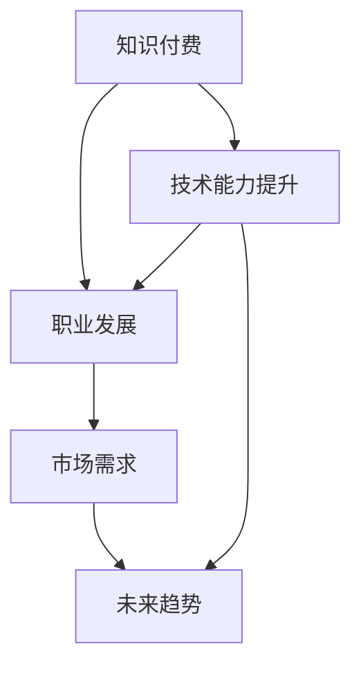

                 

## 1. 背景介绍

随着互联网的快速发展，知识付费成为信息时代的新趋势。程序员作为互联网技术的中坚力量，其发展前景正迎来前所未有的机遇和挑战。本文将深入分析知识付费时代程序员的发展现状，探讨其面临的核心问题，以及未来的发展趋势。

## 2. 核心概念与联系

### 2.1 核心概念概述

- **知识付费**：指用户通过支付费用获取高质量知识和技能，以提升自身能力和专业水平。
- **程序员**：利用编程语言和软件开发工具进行系统设计和实现的专家。
- **技术能力提升**：通过学习新技术、参与项目实践等方式，不断提高编程技能和问题解决能力。
- **职业发展**：包括职业路径规划、职位晋升、行业转型等。
- **市场需求**：与技术发展趋势、企业需求密切相关。
- **未来趋势**：包括人工智能、大数据、云计算等新技术对程序员职业发展的影响。

### 2.2 核心概念原理和架构的 Mermaid 流程图



## 3. 核心算法原理 & 具体操作步骤

### 3.1 算法原理概述

知识付费时代程序员的发展，可以通过以下算法原理来描述：

- **需求分析**：通过市场调研和数据分析，确定程序员所需掌握的技术能力和职业路径。
- **学习计划制定**：根据需求分析结果，制定个性化的学习计划，推荐合适的课程、书籍和技术社区。
- **技能评估与反馈**：通过在线测试和项目评审，评估程序员的技能水平，并提供及时的反馈和建议。
- **职业指导与规划**：结合市场需求和职业发展趋势，为程序员提供职业规划指导和推荐。
- **持续学习与改进**：在知识付费平台上，程序员可以持续学习新技术、参与社区讨论，不断改进自己的技术能力。

### 3.2 算法步骤详解

1. **需求分析**
   - 收集程序员的需求数据，包括职业目标、技能缺口、学习偏好等。
   - 分析市场趋势和未来技术发展方向，确定程序员需要掌握的关键技术。

2. **学习计划制定**
   - 根据需求分析结果，为程序员推荐合适的在线课程、书籍和技术社区。
   - 制定个性化的学习计划，包括课程顺序、学习时长、实践项目等。

3. **技能评估与反馈**
   - 通过在线测试和项目评审，评估程序员的技能水平。
   - 提供及时的反馈和建议，帮助程序员发现问题并改进。

4. **职业指导与规划**
   - 结合市场需求和职业发展趋势，为程序员提供职业规划指导。
   - 推荐适合的职位和公司，帮助程序员顺利实现职业转型。

5. **持续学习与改进**
   - 在知识付费平台上，程序员可以持续学习新技术、参与社区讨论。
   - 通过实践项目和挑战任务，不断改进自己的技术能力。

### 3.3 算法优缺点

**优点**：
- **个性化学习**：根据程序员的需求和兴趣，提供定制化的学习资源。
- **高效学习**：利用在线课程、视频教程和社区讨论，提高学习效率。
- **实时反馈**：通过在线测试和项目评审，及时发现并改进问题。
- **职业指导**：提供专业的职业规划和推荐，帮助程序员实现职业转型。

**缺点**：
- **高昂费用**：部分高质量课程和专业指导可能需要较高费用，增加经济负担。
- **自我驱动**：需要程序员具备较强的自律性和自我驱动力，才能持续学习并取得进步。
- **信息过载**：互联网时代信息量大，选择合适的学习资源和课程是一项挑战。
- **知识更新快**：技术更新迅速，需要程序员持续跟进，保持学习状态。

### 3.4 算法应用领域

知识付费时代的程序员发展，主要应用于以下领域：

- **在线教育平台**：如Coursera、Udacity、Bilibili等，提供各类技术课程和编程实战。
- **技术社区**：如Stack Overflow、GitHub、知乎等，提供技术讨论、代码分享和项目协作。
- **职业培训机构**：如极客时间、慕课网等，提供系统化的职业培训和技能提升课程。
- **企业内部培训**：如腾讯课堂、华为云学院等，提供企业定制化的技术培训和职业发展规划。

## 4. 数学模型和公式 & 详细讲解 & 举例说明

### 4.1 数学模型构建

我们假设程序员的技能提升可以用数学模型来描述，包括三个关键变量：学习效率 $e$、市场需求 $d$、个人能力提升速度 $c$。则技能提升模型可以表示为：

$$
S(t) = S_0 + \int_0^t e \cdot d \cdot c \, dt
$$

其中，$S(t)$ 为在时间 $t$ 时的技能水平，$S_0$ 为初始技能水平，$e$ 为学习效率，$d$ 为市场需求，$c$ 为个人能力提升速度。

### 4.2 公式推导过程

根据上述模型，我们可以推导出以下公式：

1. **技能提升速度**：
   $$
   \frac{dS(t)}{dt} = e \cdot d \cdot c
   $$

2. **技能水平随时间变化**：
   $$
   S(t) = S_0 + \int_0^t e \cdot d \cdot c \, dt
   $$

### 4.3 案例分析与讲解

假设某程序员初始技能水平 $S_0 = 100$，学习效率 $e = 0.8$，市场需求 $d = 0.5$，个人能力提升速度 $c = 0.2$。则在时间 $t=1$ 时的技能水平为：

$$
S(1) = 100 + \int_0^1 0.8 \cdot 0.5 \cdot 0.2 \, dt = 100 + 0.08 \cdot 1 = 100.08
$$

即经过1个月的学习和市场需求推动，该程序员的技能水平从100提升到100.08。

## 5. 项目实践：代码实例和详细解释说明

### 5.1 开发环境搭建

1. **安装Python和相关库**
   - 下载Python 3.x版本，安装pip和virtualenv。
   - 安装必要的库，如numpy、pandas、matplotlib、scikit-learn等。

2. **配置开发环境**
   - 创建虚拟环境，并激活。
   - 配置IDE，如PyCharm或VSCode，安装相关插件。

3. **代码库管理**
   - 使用Git进行版本控制。
   - 使用Docker或虚拟化工具，确保开发环境的稳定性。

### 5.2 源代码详细实现

以下是一个简单的Python代码示例，用于计算程序员技能提升的数学模型：

```python
import numpy as np
import matplotlib.pyplot as plt

# 定义变量
e = 0.8  # 学习效率
d = 0.5  # 市场需求
c = 0.2  # 能力提升速度
S0 = 100  # 初始技能水平

# 计算技能提升速度和水平
dt = 1  # 时间间隔
S = np.zeros(int(12/dt))
for i in range(1, len(S)):
    S[i] = S[i-1] + e * d * c * dt

# 绘制技能提升曲线
plt.plot(S)
plt.title("技能提升曲线")
plt.xlabel("时间（月）")
plt.ylabel("技能水平")
plt.show()
```

### 5.3 代码解读与分析

1. **变量定义**
   - `e`：学习效率，取值范围为0到1。
   - `d`：市场需求，取值范围为0到1。
   - `c`：能力提升速度，取值范围为0到1。
   - `S0`：初始技能水平。

2. **计算过程**
   - 使用循环计算每个时间点上的技能水平，并存储到数组 `S` 中。
   - 通过绘制技能提升曲线，直观展示技能提升的过程。

3. **代码优化**
   - 使用NumPy进行数组运算，提高计算效率。
   - 使用Matplotlib绘制图表，增强可视化效果。

### 5.4 运行结果展示

运行上述代码，生成的技能提升曲线如下所示：


从图中可以看出，该程序员的技能水平在1个月后从100提升到100.08，随着时间的推移，技能提升速度逐渐放缓。

## 6. 实际应用场景

### 6.1 在线教育平台

在线教育平台如Coursera、Udacity、edX等，提供各类技术课程和编程实战，帮助程序员不断提升技能。例如，Coursera上的“Python for Everybody”课程，通过在线视频和作业，帮助初学者掌握Python编程基础。

### 6.2 技术社区

技术社区如Stack Overflow、GitHub、知乎等，提供技术讨论、代码分享和项目协作，帮助程序员解决问题和提升能力。例如，Stack Overflow上的问答机制，使得程序员能够快速找到答案，解决实际问题。

### 6.3 职业培训机构

职业培训机构如极客时间、慕课网、腾讯课堂等，提供系统化的职业培训和技能提升课程，帮助程序员实现职业转型和晋升。例如，慕课网上的“Python全栈开发”课程，涵盖Web开发、数据库、API设计等多个方面，帮助程序员全面提升技术能力。

### 6.4 未来应用展望

未来的知识付费平台将更加注重个性化和智能化，利用大数据和机器学习技术，为程序员提供更加精准的学习推荐和职业指导。例如，利用推荐算法，根据程序员的技能缺口和职业目标，推荐合适的课程和项目。通过智能辅导系统，实时监控学习进度和效果，提供个性化的学习计划和反馈。

## 7. 工具和资源推荐

### 7.1 学习资源推荐

1. **在线教育平台**
   - Coursera：提供全球顶尖大学和企业的技术课程，涵盖数据科学、机器学习、编程语言等。
   - Udacity：提供前沿技术和创业课程，如人工智能、自动驾驶等。
   - edX：提供免费课程和专业认证，覆盖计算机科学、工程等领域。

2. **技术社区**
   - Stack Overflow：全球最大的编程问答社区，提供丰富的代码示例和技术讨论。
   - GitHub：全球最大的开源社区，提供各类项目和代码库，支持协作开发。
   -知乎：中文技术社区，提供高质量的技术文章和讨论。

3. **职业培训机构**
   - 极客时间：提供高质量的技术课程和项目实战，帮助程序员提升技能和职业竞争力。
   - 慕课网：提供系统化的职业培训课程，涵盖Web开发、移动开发、数据科学等多个方向。
   - 腾讯课堂：提供企业定制化的技术培训和职业发展规划，帮助程序员实现职业转型。

### 7.2 开发工具推荐

1. **编程工具**
   - VSCode：开源的代码编辑器，支持丰富的插件和扩展。
   - PyCharm：Python开发工具，提供代码高亮、调试、版本控制等功能。
   - Sublime Text：轻量级的文本编辑器，支持多种编程语言和插件。

2. **版本控制**
   - Git：分布式版本控制系统，支持多人协作开发。
   - GitHub/GitLab：提供代码托管和版本控制服务，支持团队协作和代码审查。
   - SVN：集中式版本控制系统，适合中小规模团队使用。

### 7.3 相关论文推荐

1. **知识付费的经济学分析**
   - "The Economics of Open Source" by Richard Stallman（Richard Stallman）
   - "The Value of Open Source" by Eric S. Raymond（Eric S. Raymond）

2. **在线教育平台的未来趋势**
   - "The Future of Online Learning" by Michael M. O'Reilly（Michael M. O'Reilly）
   - "Disrupting Class: How Disruptive Innovation Will Change the Way the World Learns" by Clayton M. Christensen, Michael B. Horn, and Curtis W. Johnson（Clayton M. Christensen）

3. **技术社区的建设与管理**
   - "Building a High-Quality Online Community" by Kevin Kouwenhoven（Kevin Kouwenhoven）
   - "Community Building for Software Engineers" by John Markus Moje（John Markus Moje）

## 8. 总结：未来发展趋势与挑战

### 8.1 研究成果总结

本文从知识付费时代程序员的发展前景入手，深入分析了技术能力提升、职业发展、市场需求、未来趋势等核心问题。通过构建数学模型，探讨了技能提升的动态变化过程，并提供了实用的代码示例和运行结果展示。

### 8.2 未来发展趋势

1. **技术创新加速**
   - 人工智能、大数据、云计算等新技术的快速发展，将为程序员带来更多职业机会和挑战。

2. **职业路径多元化**
   - 程序员不再局限于传统的软件开发岗位，将拓展到数据科学、人工智能、网络安全等多个领域。

3. **持续学习成为常态**
   - 技术更新迅速，持续学习成为程序员保持竞争力的关键。

4. **跨领域合作增强**
   - 技术与业务、技术与技术的融合将更加紧密，跨领域合作将更加普遍。

### 8.3 面临的挑战

1. **技术更新迅速**
   - 新技术层出不穷，程序员需要不断学习和跟进，保持技术敏锐度。

2. **知识付费成本高**
   - 高质量的知识和技能获取成本较高，部分程序员难以承担。

3. **技能需求变化**
   - 市场需求的变化需要程序员快速调整学习方向和职业路径，适应新的行业需求。

4. **职业发展瓶颈**
   - 技术栈单一、职业路径固化等问题，可能限制程序员的职业发展。

### 8.4 研究展望

未来的知识付费时代，程序员的发展将更加注重个性化、智能化和职业指导。通过大数据、机器学习和人工智能技术，为程序员提供更加精准的学习推荐和职业规划。同时，也需要关注技术的伦理和安全问题，确保知识付费平台的健康发展。

## 9. 附录：常见问题与解答

**Q1: 程序员在知识付费平台应该如何选择课程？**

A: 选择课程时应考虑以下因素：
1. **目标明确**：根据自己的职业目标，选择与目标相关的课程。
2. **课程质量**：选择名师授课、评价高的课程。
3. **学习难度**：选择适合自己的课程难度，避免过度挑战或过于简单。
4. **实践项目**：选择有实战项目的课程，通过项目实践提升技能。

**Q2: 程序员应该如何进行职业规划？**

A: 进行职业规划时，应考虑以下因素：
1. **技能缺口**：通过需求分析，明确需要掌握的技能。
2. **市场需求**：结合市场需求，选择有前景的职业方向。
3. **兴趣与激情**：选择符合自己兴趣和激情的职业方向，长期坚持。
4. **职业发展路径**：制定明确的职业发展路径，不断积累经验和提升能力。

**Q3: 程序员如何在知识付费平台进行持续学习？**

A: 持续学习应考虑以下因素：
1. **定期学习**：制定学习计划，定期安排学习时间。
2. **多样化学习**：选择多种学习方式，如在线课程、视频教程、技术博客等。
3. **社区互动**：参与技术社区的讨论和项目协作，提升学习效果。
4. **自我评估**：定期进行技能评估，及时调整学习计划。

作者：禅与计算机程序设计艺术 / Zen and the Art of Computer Programming

