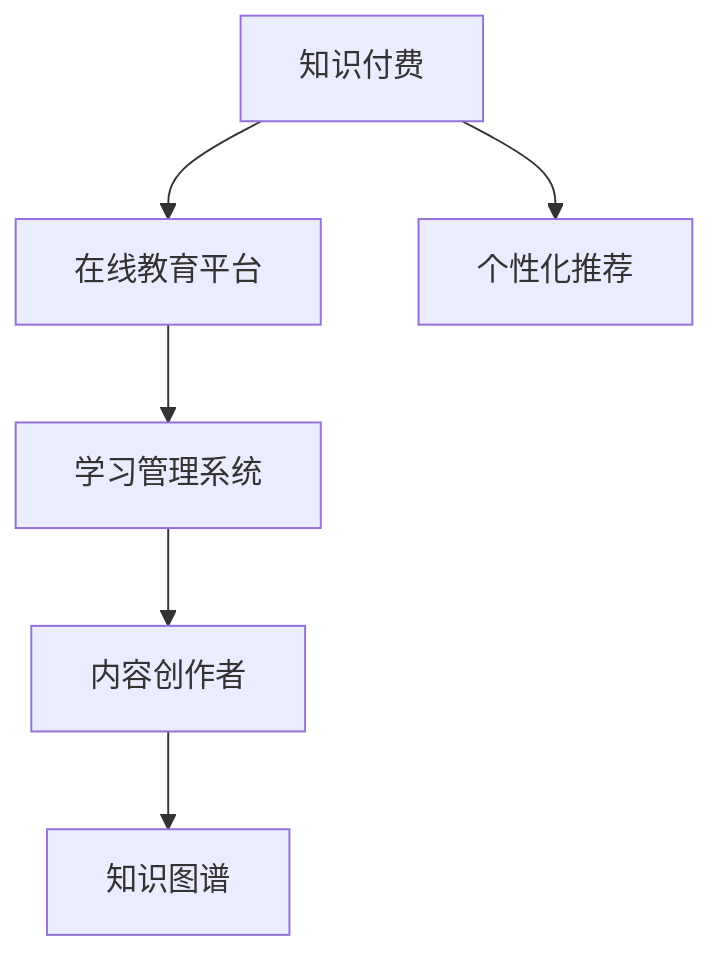

                 

# 知识付费让程序员告别996的生活

## 1. 背景介绍

在当今互联网行业中，程序员被誉为“最辛苦的职业之一”，许多从业人员不得不面临长时间的工作压力，甚至出现“996”的工作模式（即早9点到晚9点工作，每周工作6天）。然而，这种高强度的工作方式不仅损害了程序员的健康，也导致了行业的恶性竞争。面对这一问题，知识付费成为了一种可能的解决方案。

### 1.1 问题由来

随着互联网技术的发展和互联网行业的繁荣，程序员的薪酬与工作压力之间的不匹配成为日益凸显的问题。高薪吸引大量人才进入行业，但技术更新迭代的速度和竞争的激烈程度使得从业者需要不断学习和提升，以保持自身的市场竞争力。由此，程序员不仅面临高强度的工作任务，还要承担长时间学习负担，形成了恶性循环。

### 1.2 问题核心关键点

知识付费的兴起源于在线教育和内容创作市场的崛起，它以课程、文章、讲座等形式，为从业人员提供有价值的知识和技能。这一现象不仅仅局限于程序员群体，而是所有希望通过学习提升自身竞争力的从业者都可能受益。

- **学习和提升**：知识付费平台提供大量高质量的在线课程和内容，使得人们可以通过碎片时间进行自学，提升技能。
- **时间管理**：知识付费使得学习和工作可以更好地协调，不必因为长时间的学习而牺牲正常的工作和生活。
- **个性化学习**：平台能够根据个人需求推荐课程，帮助从业者高效地规划学习路线，避免盲目自学。

## 2. 核心概念与联系

### 2.1 核心概念概述

为更好地理解知识付费对程序员的影响，本节将介绍几个密切相关的核心概念：

- **知识付费**：指通过付费购买知识内容，包括在线课程、电子书、工具使用教程等，以提高自身知识和技能水平。
- **在线教育平台**：如Coursera、Udemy、Bilibili等，提供大量优质的在线课程和教学资源。
- **学习管理系统(LMS)**：支持在线学习的系统，提供课程安排、作业提交、成绩管理等功能。
- **内容创作者**：通过内容创作获得收入的个体，包括技术博主、课程讲师等。
- **知识图谱**：以图形化的方式表示知识点之间的联系，帮助学习者更好地理解和应用知识。
- **个性化推荐**：通过算法分析用户的学习行为，推荐符合用户兴趣和需求的内容。

这些核心概念之间的逻辑关系可以通过以下Mermaid流程图来展示：



这个流程图展示出知识付费的各组成环节及其相互关系：

1. 知识付费平台为学习者提供各类资源。
2. LMS系统辅助学习者进行学习管理。
3. 内容创作者生产高质量的课程和文章。
4. 知识图谱帮助学习者理解知识点间的关系。
5. 个性化推荐系统提升学习体验。

这些环节共同构成了知识付费的学习生态，使得学习者能够高效地获取、理解和应用知识。

## 3. 核心算法原理 & 具体操作步骤
### 3.1 算法原理概述

知识付费的核心算法原理主要是利用推荐系统（Recommendation System）和个性化学习管理，帮助学习者发现并高效利用优质内容。推荐系统通过学习用户行为数据，预测用户对不同课程或内容的相关度，从而推荐最符合用户兴趣和需求的内容。个性化学习管理系统则通过用户行为和反馈信息，调整学习计划，提升学习效果。

### 3.2 算法步骤详解

知识付费的实现步骤主要包括：

1. **用户注册和信息收集**：用户通过注册获取个性化学习推荐。平台收集用户基本信息、学习偏好等，为后续推荐和计划制定提供依据。

2. **内容提供与检索**：内容创作者上传课程或文章，平台提供检索功能，供用户查找相关内容。

3. **学习行为记录**：平台记录用户的学习行为，包括观看时间、做题正确率、笔记数量等。

4. **推荐模型训练**：基于用户行为数据，训练推荐模型，预测用户对不同内容的兴趣。

5. **个性化推荐**：推荐模型输出推荐结果，平台将推荐内容展示给用户。

6. **学习进度与反馈**：用户在学习过程中，平台根据进度和反馈调整推荐策略，实时更新学习计划。

7. **付费与课程评价**：用户通过平台购买课程或内容，并可以对其进行评价，帮助平台改进推荐系统。

### 3.3 算法优缺点

知识付费平台通过算法优化，实现了高效的内容推荐和个性化学习管理，具有以下优点：

1. **高效学习**：通过推荐系统，用户可以发现优质内容，节省筛选时间，提高学习效率。
2. **个性化定制**：根据用户兴趣和需求定制学习计划，提升学习体验。
3. **实时反馈**：平台根据用户反馈实时调整推荐策略，不断提升推荐准确度。

同时，知识付费平台也存在一定的局限性：

1. **内容质量参差不齐**：市场上存在大量质量较低的课程，用户难以辨别优质内容。
2. **价格高昂**：部分高质量课程和平台服务费用较高，可能对经济有限制的用户不友好。
3. **平台依赖性**：过分依赖推荐系统可能导致用户缺乏自主筛选能力。

### 3.4 算法应用领域

知识付费技术广泛应用于教育培训、技术学习、职业技能提升等多个领域，特别是在程序员群体中得到广泛应用。例如：

- **技术培训**：许多编程语言、框架、工具的最新技术和技巧，都可以在知识付费平台上找到相关的课程和文章。
- **项目实战**：通过视频教程，程序员可以跟随项目步骤实践，提高项目经验。
- **职业规划**：平台提供的职业路径分析和技能评估，帮助程序员制定职业发展计划。

## 4. 数学模型和公式 & 详细讲解 & 举例说明
### 4.1 数学模型构建

知识付费平台的核心模型基于协同过滤（Collaborative Filtering）和内容推荐（Content-Based Recommendation）两种方法。协同过滤模型通过分析用户的行为数据和相似性，预测用户对未接触内容的兴趣。内容推荐模型则基于内容的属性和特征，为用户推荐相关的课程和文章。

### 4.2 公式推导过程

协同过滤模型可以通过用户-物品评分矩阵 $R$ 来表示。假设用户 $u$ 对 $i$ 个物品的评分矩阵为 $R_{ui}$，协同过滤模型将用户 $u$ 和物品 $i$ 的相似度 $s(u, i)$ 作为推荐依据，推导公式如下：

$$
s(u, i) = \frac{\sum_{j \in N(u)} \frac{R_{ui} \times R_{uj}}{\sqrt{ \sum_{i'} R_{uj} \times R_{uj'} + \epsilon}} \times \frac{\sqrt{\sum_{j'} R_{ji'} \times R_{j'i} + \epsilon}}{\sqrt{ \sum_{j'} R_{uj'} \times R_{uj} + \epsilon}}
$$

其中，$N(u)$ 表示与用户 $u$ 相似的其他用户集合，$\epsilon$ 为避免分母为0的常数，通常取 $10^{-8}$。

内容推荐模型则通过物品属性 $f_i$ 和用户属性 $g_u$，以及两者之间的权重 $w_{iu}$ 和 $w_{iu}$，进行推荐：

$$
\widehat{R_{ui}} = \sum_{i'} w_{iu} f_{i'} \times g_u + b
$$

其中，$f_i$ 和 $g_u$ 分别表示物品和用户特征向量，$w_{iu}$ 和 $b$ 为模型参数。

### 4.3 案例分析与讲解

以一个程序员通过知识付费平台学习新技术为例：

1. **注册账号**：程序员通过注册平台账号，填写基本信息。
2. **课程浏览**：程序员浏览平台上的课程列表，根据标题和简介选择感兴趣的课程。
3. **学习跟踪**：程序员开始学习课程，平台记录观看时长、做题正确率、笔记数量等。
4. **推荐系统**：平台根据程序员的浏览和观看数据，推荐相关的文章、课程和书籍。
5. **课程评价**：程序员在学习过程中，对课程进行评价，帮助平台改进推荐模型。
6. **持续学习**：程序员不断学习新的课程和技能，平台根据学习行为调整推荐策略。

## 5. 项目实践：代码实例和详细解释说明
### 5.1 开发环境搭建

在进行知识付费项目开发前，我们需要准备好开发环境。以下是使用Python进行Flask开发的环境配置流程：

1. 安装Anaconda：从官网下载并安装Anaconda，用于创建独立的Python环境。

2. 创建并激活虚拟环境：
```bash
conda create -n flask-env python=3.7 
conda activate flask-env
```

3. 安装Flask：
```bash
pip install flask
```

4. 安装Flask-RESTful、Flask-SQLAlchemy等插件：
```bash
pip install flask-restful flask-sqlalchemy
```

5. 安装Flask-Login、Flask-WTF等认证和表单验证插件：
```bash
pip install flask-login flask-wtf
```

6. 安装Flask-User、Flask-Mail等用户管理和邮件通知插件：
```bash
pip install flask-user flask-mail
```

完成上述步骤后，即可在`flask-env`环境中开始项目开发。

### 5.2 源代码详细实现

以下是一个简单的知识付费平台Flask应用示例：

```python
from flask import Flask, render_template, request, redirect, url_for
from flask_sqlalchemy import SQLAlchemy
from flask_login import LoginManager, UserMixin, login_user, logout_user, login_required
from flask_mail import Mail, Message
from flask_user import UserMixin, UserManager, login_required
from werkzeug.security import generate_password_hash, check_password_hash

app = Flask(__name__)
app.config['SQLALCHEMY_DATABASE_URI'] = 'sqlite:////tmp/test.db'
app.config['SECRET_KEY'] = 'super-secret'
app.config['MAIL_SERVER'] = 'smtp.gmail.com'
app.config['MAIL_PORT'] = 465
app.config['MAIL_USERNAME'] = 'your-email'
app.config['MAIL_PASSWORD'] = 'your-password'
app.config['MAIL_USE_TLS'] = False
app.config['MAIL_USE_SSL'] = True

db = SQLAlchemy(app)
login_manager = LoginManager()
login_manager.init_app(app)
login_manager.login_view = 'login'
login_manager.login_message_category = 'info'

mail = Mail(app)

class User(UserMixin, db.Model):
    id = db.Column(db.Integer, primary_key=True)
    email = db.Column(db.String(255), unique=True, nullable=False)
    password = db.Column(db.String(255), nullable=False)

    def set_password(self, password):
        self.password = generate_password_hash(password)

    def check_password(self, password):
        return check_password_hash(self.password, password)

user_manager = UserManager(app, db, User, login_view='login')

@app.route('/')
@login_required
def index():
    courses = Course.query.all()
    return render_template('index.html', courses=courses)

@app.route('/course/<int:id>')
@login_required
def course(id):
    course = Course.query.get(id)
    return render_template('course.html', course=course)

@app.route('/login', methods=['GET', 'POST'])
def login():
    if request.method == 'POST':
        email = request.form['email']
        password = request.form['password']
        user = User.query.filter_by(email=email).first()
        if user and user.check_password(password):
            login_user(user, remember=True)
            return redirect(url_for('index'))
    return render_template('login.html')

@app.route('/logout')
@login_required
def logout():
    logout_user()
    return redirect(url_for('index'))

@app.route('/signup', methods=['GET', 'POST'])
def signup():
    if request.method == 'POST':
        email = request.form['email']
        password = request.form['password']
        user = User(email=email, password=password)
        db.session.add(user)
        db.session.commit()
        login_user(user, remember=True)
        return redirect(url_for('index'))
    return render_template('signup.html')

@app.route('/mail')
@login_required
def send_mail():
    msg = Message('Test Message', sender=app.config['MAIL_USERNAME'], recipients=['test@example.com'])
    msg.body = 'This is a test message.'
    mail.send(msg)
    return redirect(url_for('index'))

@app.route('/admin')
@login_required
def admin():
    return redirect(url_for('admin_dashboard'))

if __name__ == '__main__':
    app.run(debug=True)
```

### 5.3 代码解读与分析

让我们再详细解读一下关键代码的实现细节：

**User类**：
- `id` 属性：用户ID。
- `email` 属性：用户邮箱，用于注册和登录。
- `password` 属性：用户密码，用于认证。
- `set_password` 方法：将明文密码加密存储。
- `check_password` 方法：验证密码是否匹配。

**login_manager配置**：
- `login_view` 属性：指定登录视图名。
- `login_message_category` 属性：登录失败消息的分类。

**Mail配置**：
- `MAIL_SERVER`、`MAIL_PORT`、`MAIL_USERNAME`、`MAIL_PASSWORD` 属性：SMTP服务器和认证信息。
- `MAIL_USE_TLS`、`MAIL_USE_SSL` 属性：是否使用SSL加密。

**UserManager配置**：
- `user_manager` 实例：管理用户。
- `login_user`、`logout_user`、`login_required` 装饰器：处理用户登录、登出和认证。

**路由配置**：
- `index` 路由：显示首页，包含所有课程。
- `course` 路由：显示具体课程详情。
- `login` 路由：处理登录请求。
- `logout` 路由：处理登出请求。
- `signup` 路由：处理注册请求。
- `send_mail` 路由：发送邮件测试。
- `admin` 路由：显示管理员页面。

通过以上代码，可以看出Flask框架结合SQLAlchemy、Flask-Login、Flask-Mail等插件，可以高效实现知识付费平台的核心功能。

### 5.4 运行结果展示

启动Flask应用，在浏览器中访问 `http://localhost:5000`，可以访问知识付费平台的主页，并进行用户注册、登录、浏览课程等操作。在用户登录后，可以通过点击导航栏上的“我的课程”链接，查看自己已购买的课程。在用户注册时，可以通过邮箱验证功能，进行邮箱认证。

## 6. 实际应用场景

### 6.1 在线教育平台

知识付费平台最直接的用途就是在线教育，尤其是对于需要快速提升特定技能的程序员。在线教育平台提供了丰富的课程资源，包括编程语言、框架、算法、数据结构、测试驱动开发等，满足程序员的多样化需求。

### 6.2 职业规划与培训

知识付费平台还能帮助程序员进行职业规划。通过了解行业趋势、技术栈、岗位需求等信息，程序员可以制定合适的学习计划，快速提升自己的市场竞争力。

### 6.3 技术交流与社区

知识付费平台上的内容创作者和用户可以进行技术交流，分享经验和资源。这种社区化的交流方式，可以帮助程序员解决实际问题，扩大职业圈子。

### 6.4 未来应用展望

随着知识付费平台的不断发展和完善，未来将出现更多新的应用场景：

- **虚拟导师**：通过AI技术，知识付费平台可以提供虚拟导师服务，帮助用户解答技术问题。
- **智能推荐系统**：引入机器学习技术，提升推荐系统的准确度和用户体验。
- **协作开发工具**：提供代码管理、版本控制、任务分配等功能，提升团队协作效率。
- **游戏化学习**：引入游戏化元素，提升学习的趣味性和参与度。

知识付费平台的应用范围将会越来越广泛，成为程序员学习和发展的得力助手。

## 7. 工具和资源推荐
### 7.1 学习资源推荐

为了帮助程序员系统掌握知识付费技术，以下是一些优质的学习资源：

1. Coursera：提供大量在线课程，涵盖计算机科学、数据科学、人工智能等多个领域。
2. Udemy：提供广泛的编程、设计、商业等多个方向的课程，课程内容实用性强。
3. edX：提供免费的在线课程，涵盖计算机科学、工程、商业等众多领域。
4. Codecademy：提供互动式的编程课程，适合零基础入门。
5. Khan Academy：提供免费的在线课程，涵盖数学、科学、计算机科学等多个领域。

这些资源可以帮助程序员在业余时间进行自学和提升，逐步成为技术领域的专家。

### 7.2 开发工具推荐

高效的开发离不开优秀的工具支持。以下是几款常用的知识付费开发工具：

1. Flask：轻量级的Python Web框架，适合快速搭建Web应用。
2. Django：全功能的Python Web框架，适用于复杂项目开发。
3. PyTorch：深度学习框架，适用于开发推荐系统等AI应用。
4. TensorFlow：广泛使用的深度学习框架，支持多种编程语言和硬件。
5. Jupyter Notebook：交互式的开发环境，支持Python等编程语言。

合理利用这些工具，可以显著提升知识付费平台开发的效率，加快创新迭代的步伐。

### 7.3 相关论文推荐

知识付费平台的兴起与技术发展密切相关，以下是几篇相关论文，推荐阅读：

1. "Collaborative Filtering for E-commerce Recommendation"（电子商务推荐系统的协同过滤）
2. "Content-Based Recommendation Systems: Survey and Experiments"（基于内容的推荐系统综述与实验）
3. "Deep Learning for Recommender Systems: A Survey and New Perspectives"（深度学习在推荐系统中的应用综述与新视角）
4. "Personalized Learning through Machine Learning"（通过机器学习实现个性化学习）
5. "Recommender Systems: Mining User Preferences for Enhanced Experiences"（推荐系统：提升用户体验的偏好挖掘）

这些论文代表了大规模推荐系统的发展脉络，涵盖协同过滤、内容推荐、深度学习等前沿技术，能够帮助程序员深入理解知识付费平台的推荐逻辑。

## 8. 总结：未来发展趋势与挑战
### 8.1 总结

本文对知识付费技术进行了全面系统的介绍。首先阐述了知识付费对程序员的影响和作用，明确了其在时间管理、个性化学习等方面的价值。其次，从原理到实践，详细讲解了知识付费的核心算法和具体操作步骤，给出了开发实践的完整代码实例。同时，本文还广泛探讨了知识付费在在线教育、职业规划、技术交流等诸多领域的实际应用前景，展示了知识付费技术的巨大潜力。此外，本文精选了学习资源、开发工具和相关论文，力求为程序员提供全方位的技术指引。

通过本文的系统梳理，可以看到，知识付费平台在程序员学习和职业发展中扮演着越来越重要的角色。知识付费技术以其高效、个性化、实时的特点，极大地提升了程序员的学习效率和职业竞争力。未来，伴随技术的持续演进，知识付费必将成为推动程序员成长和行业发展的关键工具。

### 8.2 未来发展趋势

展望未来，知识付费技术将呈现以下几个发展趋势：

1. **个性化定制**：随着AI和机器学习技术的发展，知识付费平台将更加智能，能够根据用户的学习行为和反馈，提供更加个性化和精准的学习推荐。
2. **多平台融合**：知识付费平台将与其他在线教育和社交平台融合，形成一体化的学习生态。
3. **虚拟现实和增强现实**：引入VR/AR技术，提升学习的沉浸感和互动性。
4. **跨媒体内容**：知识付费平台将不仅仅局限于文本和视频内容，还将扩展到音频、图像、代码等多种媒体形式。
5. **社交互动**：通过社交功能，知识付费平台可以增强用户之间的交流和合作，形成学习社区。
6. **AI导师**：通过引入AI技术，知识付费平台可以提供智能导师服务，解答用户的技术问题，提供指导和建议。

这些趋势凸显了知识付费技术的广阔前景，未来必将在更多领域得到应用，成为推动人类认知智能发展的重要工具。

### 8.3 面临的挑战

尽管知识付费技术已经取得了显著进展，但在迈向更加智能化、普适化应用的过程中，它仍面临着诸多挑战：

1. **内容质量问题**：市场上的课程和文章质量参差不齐，如何筛选优质内容，保障用户的学习效果，仍是重大挑战。
2. **平台信任问题**：知识付费平台的安全性和隐私保护问题，如数据泄露、恶意内容等，需要进一步加强。
3. **用户依赖性**：过度依赖平台推荐，用户缺乏自主学习和筛选的能力，可能影响自主学习能力的提升。
4. **平台可持续发展**：知识付费平台的商业模式如何平衡成本和收益，保证平台的长期可持续发展，仍需探索。
5. **技术普及性**：如何降低知识付费的技术门槛，使其更易于普及，是知识付费平台推广的关键。

### 8.4 研究展望

面对知识付费技术所面临的挑战，未来的研究需要在以下几个方面寻求新的突破：

1. **内容筛选和质量控制**：开发更加智能的内容筛选算法，提升内容质量，保障用户学习效果。
2. **平台信任和安全**：引入区块链、加密技术等手段，提升平台的安全性和隐私保护。
3. **用户自主学习**：通过游戏化元素、社交互动等手段，提升用户的自主学习能力和意愿。
4. **平台商业模式**：探索更加可持续的平台商业模式，平衡用户需求和平台收益。
5. **技术普及与推广**：开发更加易用的知识付费平台，降低技术门槛，推广知识付费的理念和方法。

这些研究方向的探索，必将引领知识付费技术迈向更高的台阶，为程序员的学习和职业发展提供更高效、便捷的支持。

## 9. 附录：常见问题与解答

**Q1：如何选择合适的知识付费平台？**

A: 选择知识付费平台时，应考虑以下几个因素：
- 平台提供的课程是否满足自己的需求。
- 课程质量是否过硬，是否有用户评价和反馈。
- 平台是否有完善的认证和反馈机制。
- 平台是否有良好的用户界面和交互体验。
- 平台的收费是否合理，是否有免费试用期。

**Q2：如何高效利用知识付费平台？**

A: 高效利用知识付费平台的方法包括：
- 制定学习计划，规划好每日或每周的学习时间。
- 选择高质量的课程和文章，提升学习效果。
- 结合视频、文档、代码等多种形式，多渠道学习。
- 积极参与平台上的讨论和交流，扩展学习资源。
- 定期回顾和总结学习内容，巩固知识。

**Q3：如何避免知识付费平台的诈骗和陷阱？**

A: 避免知识付费平台诈骗和陷阱的方法包括：
- 选择知名平台，并查看用户评价和反馈。
- 确认课程或平台的合法性和资质。
- 注意课程价格和退款政策，避免被骗。
- 了解平台的售后服务和支持机制，及时解决问题。
- 不要轻易分享个人敏感信息，保障隐私安全。

通过本文的系统梳理，可以看到，知识付费技术在程序员的学习和职业发展中扮演着越来越重要的角色。知识付费平台以其高效、个性化、实时的特点，极大地提升了程序员的学习效率和职业竞争力。未来，伴随技术的持续演进，知识付费必将成为推动程序员成长和行业发展的关键工具。知识付费技术将成为推动人类认知智能发展的重要工具。

---

作者：禅与计算机程序设计艺术 / Zen and the Art of Computer Programming

