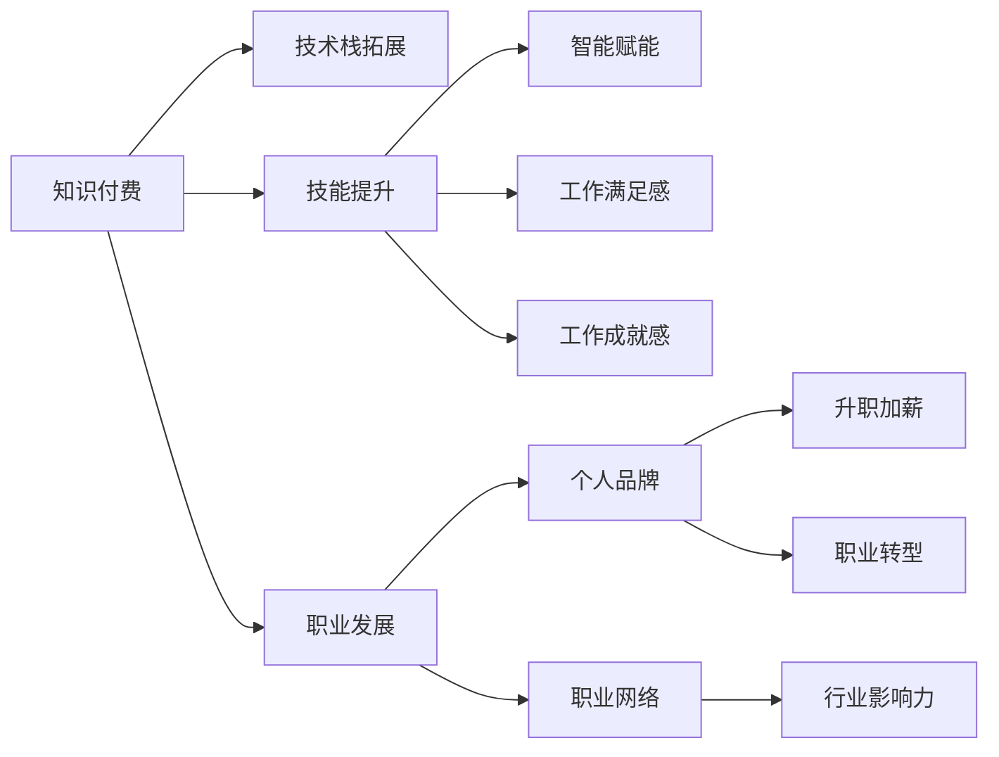

                 

## 1. 背景介绍

在过去的几年里，互联网技术的迅猛发展和全球疫情的影响，让知识付费模式迅速崛起，为程序员这一高需求、高技术要求的群体提供了全新的职业发展机会。程序员通过付费获取高质量的技术内容，不仅可以迅速提升自身技能，实现职业理想，还能在多元化技能训练中走向更广阔的职业道路。

### 1.1 程序员职业发展需求

随着科技的不断进步和互联网公司的迅猛发展，程序员的职场竞争力逐渐成为企业最关注的因素之一。高需求的程序员通常具备广泛的技术栈，不仅精通前端、后端开发，还掌握数据分析、机器学习、人工智能等前沿技术，成为企业竞相争抢的人才。

### 1.2 知识付费模式兴起

知识付费模式的兴起，让程序员可以通过购买课程、订阅博客、参加在线讲座等方式，获取高质量的学习资源。特别是在线编程平台和专业课程中，不仅有传统的代码实现教学，还有前沿技术教程、项目实战经验分享等。这些资源为程序员提供了一个多渠道、全覆盖的学习平台，让他们能够不断提升自身能力。

## 2. 核心概念与联系

### 2.1 核心概念概述

1. **知识付费**：知识付费是指通过付费形式获取专业知识和技术内容，主要包括在线课程、视频教程、电子书、论文等。知识付费帮助学习者提升自身技能，拓展职业道路。

2. **程序员职业理想**：程序员职业理想是每个编程人员的追求，主要包括技能提升、职业发展、工作满足感、工作成就感等方面。

3. **技术栈拓展**：技术栈指编程人员掌握的各种编程语言和技术框架的组合。通过知识付费获取更多技术资源，程序员能够拓展技术栈，提升自身竞争力。

4. **终身学习**：终身学习是指程序员不断学习和适应新技术、新知识的过程。在知识付费的帮助下，程序员能够更高效地进行终身学习。

5. **智能赋能**：智能赋能指的是通过技术手段提升个体和组织的智能水平，在知识付费模式下，程序员通过学习先进技术，提升自身智能能力，实现自我赋能。

### 2.2 核心概念联系

知识付费通过提供高质量的学习资源，帮助程序员获取最新技术知识，拓展技术栈，提升自身竞争力，从而实现职业理想。而程序员通过持续学习和不断提升，能在职业道路上持续发展，实现自我赋能。

下面通过一个Mermaid流程图来进一步阐述这些核心概念的联系：



该图展示了知识付费与程序员职业理想之间的内在联系：通过付费获取知识，程序员能够拓展技术栈、提升技能，进而实现职业发展，产生满足感和成就感。同时，随着技能提升，程序员能够提升个人品牌和行业影响力，促进职业转型，实现更高的薪资和更好的工作环境。

## 3. 核心算法原理 & 具体操作步骤

### 3.1 算法原理概述

知识付费平台通常使用推荐算法，根据用户的兴趣、行为数据，智能推送个性化内容。这种算法原理包括以下几个关键点：

1. **协同过滤**：根据用户历史行为，推荐与用户兴趣相似的课程。
2. **内容召回**：基于关键词、标签等特征，从内容库中检索与用户兴趣相关的课程。
3. **协同聚类**：将用户划分为兴趣相似的群体，推荐群体中受欢迎的课程。

### 3.2 算法步骤详解

以下是知识付费平台中推荐算法的基本步骤：

1. **用户行为数据采集**：记录用户的课程浏览、购买、学习进度等行为数据。
2. **特征提取**：从用户行为数据中提取关键特征，如浏览时长、购买金额、课程评分等。
3. **相似度计算**：计算用户与课程之间的相似度，使用余弦相似度或皮尔逊相关系数等方法。
4. **协同过滤**：根据用户历史行为数据，推荐用户可能感兴趣的课程。
5. **内容召回**：根据课程标签、关键词等信息，检索相关课程。
6. **协同聚类**：根据用户兴趣划分群体，推荐群体中受欢迎的课程。
7. **排序优化**：根据课程评分、用户反馈等数据，对推荐结果进行排序优化。

### 3.3 算法优缺点

知识付费平台中的推荐算法具有以下优点：

1. **高效个性化推荐**：通过个性化推荐，用户可以迅速找到感兴趣的内容，提升学习效率。
2. **动态调整**：推荐算法能够根据用户行为动态调整，适应用户兴趣的变化。
3. **多维度信息融合**：融合多种信息维度，提升推荐的全面性。

但同时，这些算法也存在一些缺点：

1. **数据隐私问题**：用户行为数据可能被泄露，带来隐私风险。
2. **推荐偏差**：如果用户历史行为数据不足，推荐算法可能存在偏差。
3. **冷启动问题**：新用户刚注册时，推荐算法无法提供个性化推荐。
4. **推荐系统的性能瓶颈**：大规模用户行为数据的处理和推荐算法模型的训练，对计算资源要求较高。

### 3.4 算法应用领域

知识付费平台在多个领域都有广泛应用，包括但不限于：

1. **在线编程平台**：如LeetCode、HackerRank、CoderPad等，提供编程题目的在线练习和高质量的教学内容。
2. **技术博客和社区**：如Stack Overflow、Medium、CSDN等，提供技术文章和社区交流。
3. **视频和课程平台**：如Coursera、Udacity、Pluralsight等，提供高质量的课程和视频教程。
4. **电子书和文档平台**：如GitHub、Gitee、CodePen等，提供技术文档和开源代码。

## 4. 数学模型和公式 & 详细讲解 & 举例说明

### 4.1 数学模型构建

知识付费平台中的推荐算法通常使用协同过滤、内容召回和协同聚类等多种数学模型，以实现个性化推荐。以下是其中一种协同过滤推荐模型的数学模型构建：

1. **用户-物品评分矩阵**：
   $$
   R = \{r_{ui}\}_{i=1}^{n}, u \in U, i \in I
   $$
   其中 $r_{ui}$ 表示用户 $u$ 对物品 $i$ 的评分。

2. **用户和物品向量表示**：
   $$
   \begin{aligned}
   \mathbf{u} &= \{\mathbf{u}_1, \mathbf{u}_2, \ldots, \mathbf{u}_n\} \\
   \mathbf{v} &= \{\mathbf{v}_1, \mathbf{v}_2, \ldots, \mathbf{v}_m\}
   \end{aligned}
   $$
   其中 $\mathbf{u}_i$ 和 $\mathbf{v}_i$ 分别表示用户和物品的向量表示。

3. **用户和物品相似度**：
   $$
   \begin{aligned}
   s_u &= \{\mathbf{u}_1 \cdot \mathbf{u}_2, \mathbf{u}_1 \cdot \mathbf{u}_3, \ldots, \mathbf{u}_1 \cdot \mathbf{u}_n\} \\
   s_i &= \{\mathbf{v}_1 \cdot \mathbf{v}_2, \mathbf{v}_1 \cdot \mathbf{v}_3, \ldots, \mathbf{v}_1 \cdot \mathbf{v}_m\}
   \end{aligned}
   $$

### 4.2 公式推导过程

协同过滤推荐算法的公式推导过程如下：

1. **余弦相似度计算**：
   $$
   \begin{aligned}
   s_u &= \cos(\theta) = \frac{\mathbf{u}_1 \cdot \mathbf{v}_1}{\|\mathbf{u}_1\| \cdot \|\mathbf{v}_1\|} \\
   &= \frac{\sum_{j=1}^n r_{uj} v_{ij}}{\sqrt{\sum_{j=1}^n r_{uj}^2} \cdot \sqrt{\sum_{j=1}^n v_{ij}^2}}
   \end{aligned}
   $$

2. **物品推荐**：
   $$
   \hat{r}_{ui} = s_u r_{iu}
   $$

### 4.3 案例分析与讲解

假设一个程序员用户 $u$ 对物品 $i$ 的评分为 $r_{ui}$，协同过滤算法通过计算 $u$ 和物品 $i$ 的相似度 $s_u$，预测 $u$ 对物品 $j$ 的评分 $\hat{r}_{uj}$，从而推荐物品 $j$。

例如，某编程用户对特定语言课程的评分为4星，协同过滤算法计算该用户与课程的相似度 $s_u$，并根据相似度对其他课程进行排序推荐。推荐算法可以用于推荐新语言课程、新编程框架等，帮助用户快速掌握新技能。

## 5. 项目实践：代码实例和详细解释说明

### 5.1 开发环境搭建

知识付费平台的开发环境搭建包括多个方面：

1. **服务器配置**：选择合适的云服务器或本地服务器，配置适合的硬件资源，如CPU、内存、存储等。
2. **数据库搭建**：搭建MySQL、PostgreSQL等关系型数据库，用于存储用户行为数据和课程信息。
3. **前端框架**：使用React、Vue.js等前端框架，实现用户界面和交互功能。
4. **后端服务**：使用Node.js、Python等后端语言，实现推荐算法和API接口。
5. **缓存系统**：使用Redis等缓存系统，提高数据访问效率。

### 5.2 源代码详细实现

以下是一个简单的知识付费平台推荐系统实现的代码示例：

```python
from sklearn.neighbors import NearestNeighbors
import pandas as pd
import numpy as np

# 用户-物品评分矩阵
R = np.array([[4, 2, 0, 1],
              [0, 5, 3, 5],
              [2, 0, 3, 0],
              [0, 0, 4, 1]])

# 计算用户相似度
U = R.dot(R.T)
S_u = np.sqrt(np.diag(U))
U /= S_u.reshape(-1, 1) * S_u

# 计算物品相似度
V = R.T.dot(R)
S_i = np.sqrt(np.diag(V))
V /= S_i.reshape(1, -1) * S_i

# 推荐新课程
new_course = [1, 0, 1, 2]
similarity = np.dot(U, V)
max_similarity = np.max(similarity[new_course])
top_3_courses = np.argsort(similarity[new_course])[::-1][:3]
```

### 5.3 代码解读与分析

1. **评分矩阵构建**：
   用户-物品评分矩阵 $R$ 表示用户对物品的评分。例如，用户 $u$ 对物品 $i$ 的评分为4星，记为 $r_{ui}$。

2. **用户相似度计算**：
   利用余弦相似度计算用户之间的相似度，得到相似度矩阵 $U$。

3. **物品相似度计算**：
   利用余弦相似度计算物品之间的相似度，得到相似度矩阵 $V$。

4. **推荐新课程**：
   根据相似度矩阵，计算新课程与用户之间的相似度，推荐用户可能感兴趣的新课程。

## 6. 实际应用场景

### 6.1 程序员职业发展

知识付费平台为程序员提供了多种职业发展的路径：

1. **技能提升**：通过学习新技术、新框架，不断提升自身技能。
2. **职业转型**：通过学习跨领域知识，实现职业转型，如从Web开发转至人工智能、大数据等领域。
3. **职业规划**：通过学习职业规划课程，提升职业竞争力。
4. **技术交流**：通过社区、博客、论坛等平台，与同行交流技术经验，拓展职业网络。

### 6.2 技术学习路径

知识付费平台为程序员提供多种学习路径：

1. **深度学习**：通过视频课程、论文解析等，学习深度学习算法和框架。
2. **前端开发**：通过在线编程平台，练习编程题目，提升前端开发能力。
3. **大数据**：通过学习Hadoop、Spark等技术，掌握大数据处理能力。
4. **人工智能**：通过学习TensorFlow、PyTorch等框架，进行模型训练和预测。

### 6.3 未来应用展望

未来，知识付费平台将继续拓展应用场景，涵盖更多技术领域：

1. **区块链**：通过区块链课程，培养程序员区块链开发能力。
2. **量子计算**：通过量子计算课程，提升程序员在量子计算领域的竞争力。
3. **物联网**：通过物联网课程，帮助程序员掌握物联网开发技术。
4. **游戏开发**：通过游戏开发课程，培养程序员游戏开发能力。

## 7. 工具和资源推荐

### 7.1 学习资源推荐

以下是一些优秀的学习资源，帮助程序员掌握知识付费模式：

1. **Coursera**：提供高质量的课程和专业认证，涵盖多种技术领域。
2. **Udacity**：提供纳米学位课程，涵盖前沿技术如机器学习、人工智能等。
3. **edX**：提供开放课程，涵盖多种学科和技术。
4. **Medium**：提供大量技术文章和博客，帮助程序员学习最新技术。
5. **Stack Overflow**：提供技术交流平台，帮助程序员解决编程问题。

### 7.2 开发工具推荐

以下是一些常用的开发工具，帮助程序员高效开发知识付费平台：

1. **Visual Studio Code**：流行的代码编辑器，支持多种编程语言和插件。
2. **Git**：版本控制工具，帮助程序员管理代码变更。
3. **JIRA**：项目管理工具，帮助程序员跟踪任务进度和代码变更。
4. **Postman**：API测试工具，帮助程序员测试API接口。
5. **Grafana**：监控工具，帮助程序员实时监控系统状态和性能。

### 7.3 相关论文推荐

以下是一些前沿的研究论文，帮助程序员了解知识付费模式：

1. **"Designing a Recommendation System for an Online Educational Platform"**：探讨了推荐系统在在线教育平台中的应用。
2. **"Deep Learning Recommendation Systems: A Survey"**：总结了深度学习在推荐系统中的应用。
3. **"Interactive Learning Analytics: Methods and Approaches"**：介绍了学习分析技术在知识付费平台中的应用。
4. **"Fine-Grained Personalization in Online Education"**：探讨了细粒度的个性化推荐技术。
5. **"Adaptive Learning Pathways in E-Learning"**：介绍了自适应学习路径在在线教育中的应用。

## 8. 总结：未来发展趋势与挑战

### 8.1 研究成果总结

知识付费平台作为程序员职业发展的重要工具，已经展示了其强大的功能和潜力。在推荐算法、个性化学习路径、技术学习路径等方面，知识付费平台已经取得了显著成果，帮助程序员不断提升自身技能，实现职业理想。

### 8.2 未来发展趋势

未来，知识付费平台将继续在以下方面发展：

1. **个性化推荐系统**：通过更智能的推荐算法，提供更个性化、精准的学习路径。
2. **自适应学习平台**：根据用户的学习进度和反馈，实时调整学习内容。
3. **社区互动**：增强社区互动功能，促进用户之间的交流和协作。
4. **混合学习模式**：结合线上线下学习，提供更加灵活的学习方式。
5. **多媒体融合**：结合视频、音频、图文等多种形式，提供更丰富的学习体验。

### 8.3 面临的挑战

尽管知识付费平台取得了显著成果，但也面临诸多挑战：

1. **数据隐私问题**：如何保护用户数据隐私，避免数据泄露。
2. **推荐系统偏差**：如何减少推荐系统中的偏差，提升推荐的公平性。
3. **用户留存率**：如何提高用户留存率，降低用户流失率。
4. **内容质量控制**：如何保证课程内容的质量，提升用户体验。
5. **个性化需求**：如何更好地满足个性化需求，提供多样化的学习内容。

### 8.4 研究展望

未来，知识付费平台需要在以下方面进行更深入的研究：

1. **推荐系统优化**：研究更加高效、公平的推荐算法。
2. **用户行为分析**：深入分析用户行为数据，提升用户留存率。
3. **内容生成技术**：研究内容生成技术，提升课程质量。
4. **学习路径设计**：研究个性化学习路径设计，提升学习效率。
5. **社区互动优化**：优化社区互动功能，增强用户参与感。

## 9. 附录：常见问题与解答

**Q1: 知识付费平台如何保证课程质量？**

A: 知识付费平台通过多种方式保证课程质量，包括：
1. **专家审核**：邀请行业专家审核课程内容，确保课程的专业性和准确性。
2. **用户评价**：用户可以对课程进行评分和评价，平台根据评价反馈优化课程。
3. **持续更新**：定期更新课程内容，确保其与最新技术同步。
4. **认证机制**：平台提供课程认证，认证通过者可证明其具备相应技能。

**Q2: 程序员如何选择合适的学习路径？**

A: 程序员可以根据自身职业发展需求和兴趣选择学习路径，具体如下：
1. **技能提升**：根据自身技术栈需求，选择相应技术的学习路径。
2. **职业转型**：选择与目标职业领域相关的课程，逐步学习相关技术。
3. **技术栈拓展**：选择相关技术栈的课程，逐步掌握新技能。
4. **项目实战**：通过项目实战课程，提升项目实践能力。

**Q3: 知识付费平台如何处理数据隐私问题？**

A: 知识付费平台通过以下方式处理数据隐私问题：
1. **数据匿名化**：对用户行为数据进行匿名化处理，保护用户隐私。
2. **访问控制**：设置严格的访问控制，确保只有授权人员可以访问用户数据。
3. **加密传输**：使用加密技术传输用户数据，防止数据泄露。
4. **合规性审查**：定期进行合规性审查，确保平台符合相关法律法规。

通过以上知识付费平台的发展和应用，程序员能够在不断学习和成长中实现职业理想，迈向更高的职业高度。未来，随着知识付费模式的不断创新和优化，程序员将更加轻松地掌握前沿技术，不断拓展自身职业道路。

