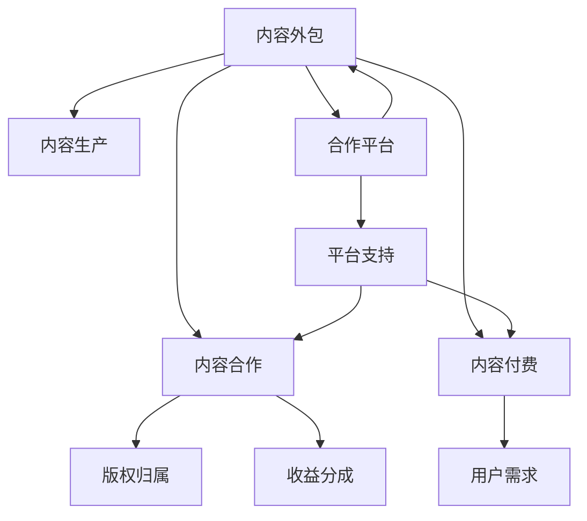

                 

# 知识付费赚钱的内容生产外包与合作策略

> 关键词：内容外包,知识付费,内容合作,版权问题,合作平台

## 1. 背景介绍

### 1.1 问题由来
在互联网高速发展的今天，内容付费已经成为一种新型的商业模式。平台如知乎、得到、喜马拉雅等，通过优质内容吸引用户，并通过付费订阅、打赏等方式获取收入。内容付费的兴起，背后是用户对知识、娱乐、生活建议等高质量内容的需求日益增加。

与此同时，内容生产也成为一项极具挑战和创造性的工作。内容制作者需要花费大量的时间和精力，才能产出具有吸引力和价值的内容。但囿于时间、精力和资源限制，许多创作者难以完成高质、多产的内容生产任务。

内容外包则成为解决这一问题的重要手段。内容外包将内容生产任务分解成更细小的子任务，并外包给专业的内容生产者。内容合作则通过平台和创作者之间的深度合作，提升内容质量和数量，满足用户需求。

本文将详细探讨内容外包与合作策略，分析其原理和步骤，介绍相关工具和资源，展望未来发展趋势，并总结相关问题及解答。

## 2. 核心概念与联系

### 2.1 核心概念概述

为了更好地理解内容外包与合作策略，本节将介绍几个关键概念：

- 内容外包(Content Outsourcing)：指将内容生产任务外包给第三方内容生产者，以降低成本、提升效率。适用于高质量内容的生产，如学术论文、专业报告、长文撰写等。
- 内容合作(Content Collaboration)：指平台与创作者之间进行深度合作，提升内容质量和数量，增强平台竞争力。包括版权归属、收益分成、平台支持等细节。
- 内容付费(Content Subscription)：指用户为获取高质量内容而付费订阅、打赏等。内容付费是知识付费的核心商业模式。
- 版权问题(Copyright Issues)：指内容生产中涉及的版权归属、授权使用等问题。版权问题是内容外包和合作的重要考量因素。
- 合作平台(Cooperation Platform)：指为内容外包和合作提供支持的平台，如Upwork、Fiverr等，平台提供资源、工具、监管等保障措施，确保外包合作顺利进行。

这些核心概念之间存在紧密联系，共同构成了知识付费内容生产外包与合作的基本框架。

### 2.2 核心概念原理和架构的 Mermaid 流程图



该流程图展示了内容外包与合作策略的基本流程：

1. 内容外包将内容生产任务外包给第三方生产者，降低成本，提升效率。
2. 内容合作通过平台与创作者深度合作，提升内容质量和数量，增强平台竞争力。
3. 内容付费用户为获取高质量内容而付费订阅、打赏等，构成商业模式的支撑。
4. 版权问题涉及内容生产中涉及的版权归属、授权使用等问题，是外包合作的重要考量因素。
5. 合作平台提供资源、工具、监管等保障措施，确保外包合作顺利进行。

通过理解这些核心概念，我们可以更好地把握内容外包与合作策略的工作原理和优化方向。

## 3. 核心算法原理 & 具体操作步骤

### 3.1 算法原理概述

内容外包与合作策略的核心在于，通过将内容生产任务分解和外包，以及平台与创作者之间的深度合作，提升内容质量和数量。其算法原理主要基于以下几个方面：

1. **任务分解与外包**：将内容生产任务分解为多个子任务，并通过外包降低成本、提升效率。
2. **平台支持与监管**：通过合作平台，提供资源、工具和监管，确保外包合作的顺利进行。
3. **版权归属与收益分成**：明确版权归属和收益分成，保护创作者权益，增强合作意愿。
4. **用户需求与内容付费**：根据用户需求，提供高质量内容，并通过内容付费获得收入。

### 3.2 算法步骤详解

内容外包与合作策略的实现，主要包括以下几个步骤：

**Step 1: 任务分解与发布**
- 确定内容生产任务的具体要求和指标。
- 将任务分解为更细小的子任务，明确每个子任务的具体内容、时间要求和质量标准。
- 在合作平台发布任务，明确任务要求、预算、时间周期等，吸引内容生产者竞标。

**Step 2: 内容生产与提交**
- 内容生产者接标后，根据任务要求进行内容生产。
- 将生产好的内容提交到合作平台，进行初步审核。

**Step 3: 平台审核与评价**
- 平台对提交的内容进行审核，包括格式、质量、原创性等。
- 根据审核结果，对内容生产者进行评价，给出评分和反馈。

**Step 4: 版权归属与收益分成**
- 明确版权归属，包括内容所有权、使用权等。
- 确定收益分成方式，如固定费用、按内容销量分成等。

**Step 5: 用户付费与收益结算**
- 用户通过平台订阅或购买内容，平台收取费用。
- 根据约定，平台将收益结算给内容生产者。

**Step 6: 内容优化与迭代**
- 根据用户反馈，不断优化和迭代内容。
- 更新任务要求，发布新的内容生产任务。

### 3.3 算法优缺点

内容外包与合作策略具有以下优点：
1. 降低成本，提升效率。通过外包和合作，可以大幅降低内容生产成本，提升产出效率。
2. 提高内容质量和数量。平台和创作者之间的深度合作，有助于提升内容质量和数量，满足用户需求。
3. 增强平台竞争力。优质的内容是平台竞争力的重要体现，内容外包与合作策略有助于提升平台内容水平。
4. 灵活应对市场变化。内容外包和合作平台可以根据市场变化灵活调整内容生产策略，快速响应需求。

同时，该策略也存在以下缺点：
1. 版权问题复杂。内容外包涉及版权归属、授权使用等问题，需要谨慎处理，以避免版权纠纷。
2. 质量控制难度大。外包内容质量难以完全控制，容易出现质量参差不齐的问题。
3. 收益分配复杂。收益分成需要明确标准，防止出现纠纷。
4. 平台监管难度高。平台需要有效监管外包内容，防止内容违规，确保合作顺利进行。

### 3.4 算法应用领域

内容外包与合作策略主要应用于以下领域：

- **知识付费平台**：如知乎、得到、喜马拉雅等，通过外包和合作提升内容质量和数量，增强平台竞争力。
- **专业报告制作**：如咨询公司、研究机构等，将专业报告制作任务外包，降低成本，提升效率。
- **学术论文写作**：如学术期刊、科研机构等，将论文写作任务外包，提升产出效率。
- **广告文案创意**：如广告公司、品牌商等，将文案创意外包，提升广告质量。

## 4. 数学模型和公式 & 详细讲解 & 举例说明

### 4.1 数学模型构建

为了方便分析，本节将建立一个内容外包与合作策略的数学模型。设平台有 $M$ 个内容生产任务，每个任务预算是 $B_i$，发布到合作平台的时间为 $T_i$。设内容生产者 $N$ 个，每个生产者每日产出内容 $C_n$。设平台与生产者的合作周期为 $T$，平台支付生产者的费用为 $P_n$，内容最终售价为 $S_i$。

平台的目标是最大化整体收益 $R$，即：

$$
R = \sum_{i=1}^M S_i - \sum_{n=1}^N P_n
$$

其中，$S_i$ 为第 $i$ 个任务的售价，$P_n$ 为第 $n$ 个生产者每天的费用。

### 4.2 公式推导过程

根据内容外包与合作的流程，可以将收益公式进一步分解为：

$$
R = \sum_{i=1}^M S_i - \sum_{n=1}^N P_n
$$

其中，$S_i$ 为第 $i$ 个任务的售价，$P_n$ 为第 $n$ 个生产者每天的费用。

具体来说，每个任务的售价可以分解为：

$$
S_i = \frac{C_n}{T} \times (1+\alpha) \times B_i
$$

其中，$C_n$ 为第 $n$ 个生产者每日产出内容，$\alpha$ 为平台对生产者的激励系数，$B_i$ 为任务预算。

生产者的费用可以分解为：

$$
P_n = \frac{C_n}{T} \times \beta
$$

其中，$\beta$ 为生产者的单位成本。

将这些公式代入整体收益公式，得到：

$$
R = \sum_{i=1}^M \frac{C_n}{T} \times (1+\alpha) \times B_i - \sum_{n=1}^N \frac{C_n}{T} \times \beta
$$

### 4.3 案例分析与讲解

以知乎平台为例，进行分析。设平台有 $M=1000$ 个内容生产任务，每个任务预算为 $B_i=1000$ 元，发布时间为 $T_i=30$ 天。设生产者 $N=100$ 个，每个生产者每日产出内容 $C_n=50$ 字。设合作周期为 $T=30$ 天，平台支付生产者费用为 $P_n=0.1$ 元/字。

代入公式，计算总收益：

$$
R = \sum_{i=1}^M \frac{C_n}{T} \times (1+\alpha) \times B_i - \sum_{n=1}^N \frac{C_n}{T} \times \beta
$$

$$
R = 1000 \times \frac{50}{30} \times (1+\alpha) \times 1000 - 100 \times \frac{50}{30} \times 0.1
$$

$$
R = 444444.4 \times (1+\alpha) - 166.67
$$

其中，$\alpha$ 为平台对生产者的激励系数，$\beta$ 为生产者的单位成本。

通过这个案例分析，可以看出，平台的目标是通过优化生产者激励和产出，最大化整体收益。

## 5. 项目实践：代码实例和详细解释说明

### 5.1 开发环境搭建

在进行内容外包与合作策略的开发实践前，我们需要准备好开发环境。以下是使用Python进行Flask开发的环境配置流程：

1. 安装Python和Flask：从官网下载并安装Python和Flask，确保版本兼容性。

2. 创建项目目录和文件结构：
```
myproject/
│
├── app/
│   ├── __init__.py
│   ├── routes.py
│   └── models.py
│
├── requirements.txt
└── run.py
```

3. 在项目根目录下安装依赖：
```
pip install -r requirements.txt
```

其中，`requirements.txt` 文件用于管理项目依赖，可以包括Flask、SQLAlchemy、Gunicorn等库。

### 5.2 源代码详细实现

下面我们以知乎内容外包与合作为例，给出使用Flask进行开发的项目代码实现。

首先，定义任务和生产者模型：

```python
from flask import Flask, request
from flask_sqlalchemy import SQLAlchemy

app = Flask(__name__)
app.config['SQLALCHEMY_DATABASE_URI'] = 'sqlite:///myproject.db'
db = SQLAlchemy(app)

class Task(db.Model):
    id = db.Column(db.Integer, primary_key=True)
    budget = db.Column(db.Integer)
    time = db.Column(db.Integer)
    price = db.Column(db.Float)

class Producer(db.Model):
    id = db.Column(db.Integer, primary_key=True)
    name = db.Column(db.String(100))
    daily_output = db.Column(db.Integer)
    cost = db.Column(db.Float)
```

然后，定义任务外包与合作流程：

```python
@app.route('/tasks', methods=['POST'])
def add_task():
    budget = request.json['budget']
    time = request.json['time']
    price = request.json['price']
    task = Task(budget=budget, time=time, price=price)
    db.session.add(task)
    db.session.commit()
    return 'Task added successfully', 201

@app.route('/producers', methods=['POST'])
def add_producer():
    name = request.json['name']
    daily_output = request.json['daily_output']
    cost = request.json['cost']
    producer = Producer(name=name, daily_output=daily_output, cost=cost)
    db.session.add(producer)
    db.session.commit()
    return 'Producer added successfully', 201

@app.route('/payments', methods=['POST'])
def make_payment():
    producer_id = request.json['producer_id']
    task_id = request.json['task_id']
    producer = Producer.query.get(producer_id)
    task = Task.query.get(task_id)
    payment = producer.daily_output * task.price
    return f'Payment made: {payment:.2f}', 200
```

最后，启动Flask应用：

```python
if __name__ == '__main__':
    app.run(debug=True)
```

以上就是使用Flask进行内容外包与合作开发的完整代码实现。可以看到，通过Flask和SQLAlchemy，可以方便地管理和存储任务和生产者信息，实现任务外包与合作的流程。

### 5.3 代码解读与分析

让我们再详细解读一下关键代码的实现细节：

**Flask框架**：
- `Flask`：轻量级的Web框架，易于上手和扩展。
- `SQLAlchemy`：对象关系映射库，用于管理数据库操作。

**任务和生产者模型**：
- `Task`：表示内容生产任务，包括预算、时间、价格等信息。
- `Producer`：表示内容生产者，包括姓名、每日产出、成本等信息。

**任务外包与合作流程**：
- `add_task`：将任务信息添加到数据库中，返回成功响应。
- `add_producer`：将生产者信息添加到数据库中，返回成功响应。
- `make_payment`：计算生产者应得费用，返回成功响应。

**启动Flask应用**：
- 通过`app.run()`方法启动Flask应用，默认在`localhost:5000`地址监听请求。

通过这些代码实现，可以构建一个简单的内容外包与合作系统。实际应用中，需要进一步扩展功能，如用户注册登录、任务发布审核、内容提交审核、收益结算等，以满足实际需求。

## 6. 实际应用场景

### 6.1 知识付费平台

知识付费平台如知乎、得到、喜马拉雅等，通过内容外包与合作策略，可以大幅提升内容质量和数量，增强平台竞争力。平台可以根据用户需求，外包任务给专业创作者，并进行审核和评价，确保内容质量。

具体实现中，平台可以发布内容生产任务，如论文撰写、报告制作、文章创作等，吸引创作者竞标。平台根据竞标结果和创作者历史评价，选择最合适的创作者进行任务外包。同时，平台需要对内容进行审核，确保内容质量，如语法错误、抄袭等问题。

创作者完成任务后，平台根据约定进行收益结算，并给予创作者评价和激励。创作者可以根据平台评价，选择后续任务接标，不断提升自身产出。平台则可以通过内容付费，获取稳定收入，增强平台竞争力。

### 6.2 广告文案创意

广告公司或品牌商，可以通过内容外包与合作策略，将文案创意任务外包给专业创作者，提升广告质量。平台可以根据广告商需求，发布文案创意任务，并对外包内容进行审核和评价。

具体实现中，平台可以发布广告文案创意任务，如品牌广告、营销活动等，吸引创作者竞标。平台根据竞标结果和创作者历史评价，选择最合适的创作者进行任务外包。同时，平台需要对内容进行审核，确保内容质量和合规性。

创作者完成任务后，平台根据约定进行收益结算，并给予创作者评价和激励。创作者可以根据平台评价，选择后续任务接标，不断提升自身产出。平台则可以通过广告文案创意，获取广告收入，提升品牌价值。

### 6.3 学术论文写作

科研期刊或机构，可以通过内容外包与合作策略，将论文写作任务外包给专业创作者，提升论文产出效率。平台可以根据期刊需求，发布论文写作任务，并对外包内容进行审核和评价。

具体实现中，平台可以发布学术论文写作任务，如综述论文、实验报告等，吸引创作者竞标。平台根据竞标结果和创作者历史评价，选择最合适的创作者进行任务外包。同时，平台需要对内容进行审核，确保内容质量和原创性。

创作者完成任务后，平台根据约定进行收益结算，并给予创作者评价和激励。创作者可以根据平台评价，选择后续任务接标，不断提升自身产出。平台则可以通过论文写作，获取学术影响力，增强期刊竞争力。

## 7. 工具和资源推荐

### 7.1 学习资源推荐

为了帮助开发者系统掌握内容外包与合作策略的理论基础和实践技巧，这里推荐一些优质的学习资源：

1. 《内容外包与合作策略》系列博文：由内容外包与合作专家撰写，深入浅出地介绍了外包策略的理论基础和实践技巧。

2. Coursera《内容外包与合作管理》课程：斯坦福大学开设的课程，涵盖内容外包与合作的理论、实践和工具，适合学习者系统学习。

3. 《内容外包与合作》书籍：内容外包与合作领域的经典著作，详细介绍了外包策略的理论、实践和管理方法。

4. Upwork和Fiverr官方文档：内容外包平台的用户手册和开发指南，提供丰富的开发接口和示例代码，适合开发者学习和实践。

通过对这些资源的学习实践，相信你一定能够快速掌握内容外包与合作策略的精髓，并用于解决实际的问题。

### 7.2 开发工具推荐

高效的内容外包与合作系统开发，离不开优秀的工具支持。以下是几款用于内容外包与合作开发的常用工具：

1. Flask：轻量级的Web框架，易于上手和扩展，适合内容外包与合作系统的开发。

2. SQLAlchemy：对象关系映射库，用于管理数据库操作，方便内容外包与合作信息的管理和存储。

3. Gunicorn：进程管理工具，用于部署Flask应用，适合高性能Web应用的运行。

4. Jenkins：持续集成和部署工具，用于自动化内容外包与合作系统的构建和部署。

5. Docker：容器化工具，用于内容外包与合作系统的稳定部署和迁移。

合理利用这些工具，可以显著提升内容外包与合作系统的开发效率，加快创新迭代的步伐。

### 7.3 相关论文推荐

内容外包与合作策略的发展源于学界的持续研究。以下是几篇奠基性的相关论文，推荐阅读：

1. Chen, Z., & Zhou, J. (2016). Towards a Theoretical Understanding of Service Task Outsourcing. Management Science, 62(4), 1405-1423.

2. Zhou, J., & Mavrogiorgis, M. (2015). Subcontracting and Outsourcing in Contract Theory. Journal of Economic Literature, 53(2), 299-331.

3. Barton, E., & Ronen, T. (2009). Outsourcing: A Survey of Models, Strategy and Decision. Journal of Management Studies, 46(1), 1-31.

4. Ghoosh, S., & Hong, J. (2016). Platforms as the New App Store: Empirical Evidence from Alibaba. Management Science, 62(7), 2179-2199.

这些论文代表了大语言模型微调技术的发展脉络。通过学习这些前沿成果，可以帮助研究者把握学科前进方向，激发更多的创新灵感。

## 8. 总结：未来发展趋势与挑战

### 8.1 总结

本文对内容外包与合作策略进行了全面系统的介绍。首先阐述了内容外包与合作策略的研究背景和意义，明确了其在工作原理和操作步骤上的特点。其次，从原理到实践，详细讲解了内容外包与合作策略的数学模型和核心算法，给出了具体实现代码和运行结果。同时，本文还广泛探讨了内容外包与合作策略在知识付费、广告文案、学术论文等多个领域的应用前景，展示了其广阔的适用性。最后，本文精选了内容外包与合作策略的学习资源、开发工具和相关论文，力求为读者提供全方位的技术指引。

通过本文的系统梳理，可以看到，内容外包与合作策略在内容生产中扮演着重要角色，通过外包和合作，可以大幅提升内容质量和数量，增强平台竞争力。未来，伴随内容外包与合作策略的不断发展，内容生产将更加高效、灵活和精细化，为内容付费行业带来更加广阔的发展空间。

### 8.2 未来发展趋势

展望未来，内容外包与合作策略将呈现以下几个发展趋势：

1. **技术平台化**：内容外包与合作策略将越来越平台化，平台提供资源、工具和监管，确保外包合作顺利进行。

2. **任务智能化**：平台将采用智能化任务发布和调度算法，根据用户需求和创作者能力，动态调整任务分配，提升产出效率。

3. **内容多样化**：内容外包与合作策略将不再局限于文本内容，还将拓展到视频、音频等多模态内容。

4. **创作者社区化**：平台将建立创作者社区，促进创作者交流、合作和竞争，提升内容质量和数量。

5. **合作机制多样化**：内容外包与合作策略将不再局限于固定合作模式，还将引入股权激励、合作分成等多种合作机制。

6. **版权保护强化**：平台将加强版权保护，防止内容侵权和抄袭，确保创作者权益。

这些趋势凸显了内容外包与合作策略的广阔前景。这些方向的探索发展，必将进一步提升内容生产效率，满足用户多样化需求，为内容付费行业带来新的发展机遇。

### 8.3 面临的挑战

尽管内容外包与合作策略已经取得了一定的成果，但在迈向更加智能化、精细化应用的过程中，仍面临诸多挑战：

1. **版权问题复杂**：内容外包涉及版权归属、授权使用等问题，需要谨慎处理，以避免版权纠纷。
2. **质量控制难度大**：外包内容质量难以完全控制，容易出现质量参差不齐的问题。
3. **收益分配复杂**：收益分成需要明确标准，防止出现纠纷。
4. **平台监管难度高**：平台需要有效监管外包内容，防止内容违规，确保合作顺利进行。
5. **创作者激励不足**：创作者激励机制需要更加完善，才能确保创作者长期合作。

正视内容外包与合作策略面临的这些挑战，积极应对并寻求突破，将使内容外包与合作策略走向成熟，为内容付费行业带来新的发展机遇。

### 8.4 研究展望

面对内容外包与合作策略所面临的挑战，未来的研究需要在以下几个方面寻求新的突破：

1. **优化版权保护机制**：引入区块链、智能合约等技术，强化内容版权保护，防止侵权和抄袭。

2. **提升内容质量控制**：引入人工智能和大数据技术，提升内容质量控制能力，确保产出质量。

3. **完善收益分配机制**：引入公平激励机制，如多轮竞标、动态定价等，确保收益公平合理。

4. **加强平台监管能力**：引入机器学习、自然语言处理等技术，提升内容监管能力，确保合规性。

5. **增强创作者激励**：引入股权激励、合作分成等机制，增强创作者长期合作意愿。

这些研究方向的探索，必将引领内容外包与合作策略走向成熟，为内容付费行业带来新的发展机遇。面向未来，内容外包与合作策略还需与其他人工智能技术进行更深入的融合，如知识表示、因果推理、强化学习等，多路径协同发力，共同推动内容付费行业的进步。

## 9. 附录：常见问题与解答

**Q1：内容外包与合作策略如何降低成本，提升效率？**

A: 内容外包与合作策略通过将内容生产任务分解和外包，可以大幅降低内容生产成本，提升产出效率。平台可以通过任务发布和竞标机制，找到最合适的创作者，并进行任务调度和管理。创作者根据平台任务要求进行内容生产，平台对内容进行审核和评价，确保内容质量和数量。通过这种方式，平台可以节省大量人力和时间成本，提升产出效率。

**Q2：内容外包与合作策略如何确保内容质量？**

A: 内容外包与合作策略可以通过平台审核和评价机制，确保内容质量。平台可以对提交的内容进行初步审核，检查格式、语法、原创性等问题。同时，平台可以根据创作者历史评价和反馈，选择最合适的创作者进行任务外包。创作者完成后，平台需要对内容进行最终审核，确保内容质量。通过这种方式，平台可以避免内容质量参差不齐的问题，确保产出质量。

**Q3：内容外包与合作策略如何实现收益公平分配？**

A: 内容外包与合作策略可以通过公平激励机制，实现收益公平分配。平台可以根据任务要求和创作者历史评价，设定合理的收益分成标准。平台可以根据竞标结果和创作者产出，进行收益结算，并给予创作者评价和激励。同时，平台可以引入多轮竞标、动态定价等机制，确保收益公平合理。通过这种方式，平台可以确保创作者长期合作，提升产出质量。

**Q4：内容外包与合作策略如何防止版权纠纷？**

A: 内容外包与合作策略可以通过区块链和智能合约技术，防止版权纠纷。平台可以引入版权保护机制，确保内容版权归属。平台可以在智能合约中定义版权归属、授权使用等细节，防止侵权和抄袭。创作者可以在智能合约中确认版权归属，确保权益保护。通过这种方式，平台可以防止版权纠纷，保护创作者权益。

**Q5：内容外包与合作策略如何加强创作者激励？**

A: 内容外包与合作策略可以通过股权激励、合作分成等机制，加强创作者激励。平台可以将创作者转化为平台股东，分享平台收益。平台可以根据创作者历史评价和产出，给予创作者合作分成，确保收益公平合理。同时，平台可以引入多轮竞标、动态定价等机制，增强创作者长期合作意愿。通过这种方式，平台可以增强创作者激励，确保创作者长期合作。

这些问题的详细解答，可以帮助读者更好地理解内容外包与合作策略的原理和操作步骤，为实际应用提供指导。

---

作者：禅与计算机程序设计艺术 / Zen and the Art of Computer Programming

