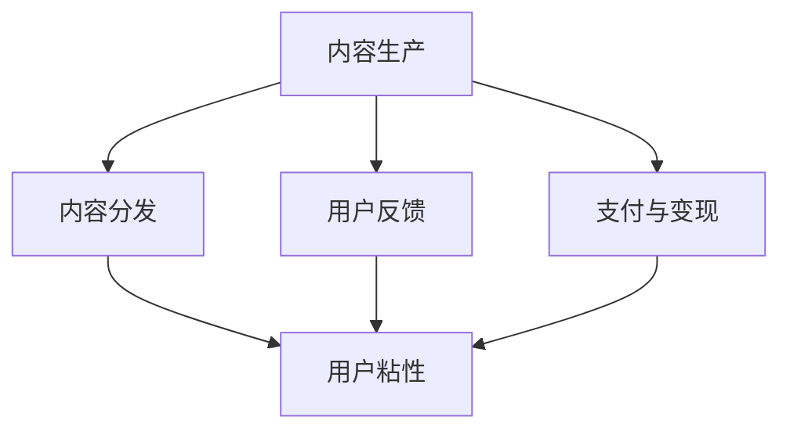

                 

# 知识付费赚钱的内容生态建设策略

## 1. 背景介绍

在互联网时代，信息泛滥的洪流中，用户需要找到值得信赖、有价值的内容。知识付费作为信息消费的新模式，正在受到越来越多人的青睐。如何构建一个健康可持续的知识付费内容生态，让内容创作者和消费者都能从中受益，成为行业关注的焦点。本文将探讨知识付费内容生态的建设策略，帮助从业者把握行业趋势，优化运营模式。

## 2. 核心概念与联系

### 2.1 核心概念概述

在知识付费内容生态建设中，涉及多个关键概念，包括：

- **内容生产（Content Production）**：知识付费的核心在于高质量的内容生产。内容创作者通过深度分析、创新阐述等方式，提供具有独到见解和价值的信息。

- **内容分发（Content Distribution）**：分发平台需要根据用户兴趣、行为等数据，将内容精准推荐给目标用户，提升用户阅读体验和内容价值。

- **用户反馈（User Feedback）**：用户反馈是内容生态的重要组成部分，通过评价、打赏等方式，对内容进行价值评估，驱动内容创作者持续优化。

- **支付与变现（Payment and Monetization）**：支付机制和变现模式设计，是知识付费能否持续运营的关键。合理的价格和付费方式，能够吸引用户付费，保障内容创作者的收入。

- **用户粘性（User Retention）**：维持用户长期停留和付费，是知识付费平台的核心目标。内容质量、平台体验等因素均会影响用户粘性。

这些概念相互关联，共同构成知识付费内容生态的框架。理解这些概念的逻辑关系，是制定有效策略的基础。

### 2.2 核心概念原理和架构的 Mermaid 流程图



这个流程图展示了内容生产、分发、反馈、支付与变现和用户粘性之间的联系。内容生产是生态的基础，分发平台和用户反馈是生态的重要组成部分，支付与变现是生态持续运营的保障，而用户粘性是目标结果。

## 3. 核心算法原理 & 具体操作步骤

### 3.1 算法原理概述

知识付费内容生态的建设，涉及多方面的算法和策略。核心算法原理包括但不限于以下几个方面：

- **推荐算法（Recommendation Algorithm）**：通过分析用户行为和偏好，将高质量内容精准推荐给目标用户，提升用户粘性和满意度。

- **内容质量评估（Content Quality Assessment）**：通过用户反馈和行为数据，对内容进行质量评估，识别优质内容，促进内容创作者不断优化。

- **价格制定（Pricing Strategy）**：根据内容价值和市场定位，制定合理的价格策略，吸引用户付费，保障内容创作者收入。

- **用户行为分析（User Behavior Analysis）**：分析用户行为数据，优化内容分发策略和平台设计，提升用户体验和留存率。

### 3.2 算法步骤详解

以下是基于上述核心算法原理的具体操作步骤：

**Step 1: 内容生产**

- **筛选和认证创作者**：建立严格的创作者认证体系，筛选专业背景强、内容质量高的创作者，提升内容整体水平。
- **内容审核与质量控制**：实施内容审核机制，确保内容的合法合规和高质量。

**Step 2: 内容分发**

- **用户画像构建**：通过数据分析，构建用户画像，了解用户兴趣和需求，为个性化推荐提供依据。
- **推荐算法实现**：应用机器学习算法，如协同过滤、深度学习等，实现高效精准的内容推荐。

**Step 3: 用户反馈**

- **反馈机制设计**：建立评价体系和反馈渠道，鼓励用户对内容进行评价和打赏。
- **数据分析与优化**：利用用户反馈数据，进行内容质量评估和创作者激励。

**Step 4: 支付与变现**

- **定价模型设计**：根据内容价值和市场接受度，设计合理的付费模型，如单次付费、包月订阅等。
- **交易系统优化**：优化支付流程和用户界面，提升用户支付体验。

**Step 5: 用户粘性提升**

- **内容多样化**：丰富内容形式和主题，满足用户多样化的需求。
- **平台体验优化**：提升平台加载速度、交互体验，提升用户满意度。

### 3.3 算法优缺点

**推荐算法**

- **优点**：通过数据分析提升用户满意度，增加用户粘性。
- **缺点**：数据隐私问题、算法偏见、冷启动问题。

**内容质量评估**

- **优点**：驱动创作者持续优化内容，提升整体质量。
- **缺点**：主观性强、时效性差、用户行为不完整。

**价格制定**

- **优点**：合理定价能吸引用户付费，保障创作者收入。
- **缺点**：定价过高可能抑制用户付费意愿，定价过低影响创收。

**用户行为分析**

- **优点**：提升平台运营效率，优化用户体验。
- **缺点**：数据隐私问题、算法复杂度高。

## 4. 数学模型和公式 & 详细讲解 & 举例说明

### 4.1 数学模型构建

**推荐算法**

- **协同过滤（Collaborative Filtering）**：基于用户行为数据和相似度计算，推荐相关内容。
- **深度学习模型（Deep Learning Models）**：如CNN、RNN等，通过学习用户和内容的表示，提升推荐效果。

**内容质量评估**

- **内容质量评分模型**：利用用户评分、阅读时长等指标，构建评分模型。
- **情感分析（Sentiment Analysis）**：通过文本分析，判断用户对内容的情感倾向。

**价格制定**

- **价格模型**：根据内容价值、市场接受度，制定动态定价模型。

**用户行为分析**

- **用户行为预测模型**：通过历史行为数据，预测用户未来行为。

### 4.2 公式推导过程

**协同过滤**

设用户-内容评分矩阵为 $R_{u,i}$，用户向量为 $u$，内容向量为 $v_i$，相似度计算公式为 $sim(u, v_i)$。推荐公式为：

$$
\hat{R}_{u,i} = \sum_{j \in \mathcal{N}_i} \alpha_{u,j} R_{j,i} \\
\alpha_{u,j} = \frac{sim(u,v_j)}{\sqrt{\sum_{k \in \mathcal{N}_u} sim(u,v_k) \sum_{k \in \mathcal{N}_i} sim(v_j,v_k)}}
$$

其中，$\mathcal{N}_u$ 和 $\mathcal{N}_i$ 分别为用户和内容的邻居集合。

**内容质量评分**

设内容特征向量为 $v_i$，用户评分向量为 $u$，内容评分向量为 $w_i$。评分模型为：

$$
\hat{w}_i = \alpha_1 u^\top A \beta v_i + \alpha_2 u^\top B \gamma v_i
$$

其中，$A$ 和 $B$ 为不同特征的重要性系数矩阵，$\beta$ 和 $\gamma$ 为特征向量的权重。

**价格模型**

设内容价值为 $V_i$，市场接受度为 $D_i$，价格为 $P_i$。价格模型为：

$$
P_i = \alpha_1 \frac{V_i}{D_i} + \alpha_2 D_i
$$

其中，$\alpha_1$ 和 $\alpha_2$ 为价格模型的系数。

**用户行为预测**

设用户行为数据为 $X_{u,t}$，用户未来行为预测为 $\hat{Y}_{u,t+1}$。预测模型为：

$$
\hat{Y}_{u,t+1} = f(X_{u,t}, \theta)
$$

其中，$f$ 为预测函数，$\theta$ 为模型参数。

### 4.3 案例分析与讲解

**案例：某知识付费平台内容推荐系统**

- **数据准备**：收集用户行为数据，如阅读历史、评分记录等。
- **模型训练**：使用协同过滤和深度学习模型训练推荐系统。
- **评估与优化**：通过A/B测试，评估推荐效果，优化模型参数和算法。

**案例：内容质量评分模型**

- **数据收集**：收集用户评分、阅读时长等数据。
- **模型构建**：构建基于用户评分的内容质量评分模型。
- **应用与反馈**：将评分模型应用于内容质量评估，驱动创作者优化内容。

**案例：动态定价模型**

- **市场调研**：分析市场接受度和内容价值。
- **模型设计**：构建基于内容价值和市场接受度的动态定价模型。
- **实践应用**：根据用户行为数据，实时调整价格策略。

**案例：用户行为预测**

- **数据采集**：收集用户行为数据，如阅读时间、购买频率等。
- **模型训练**：构建用户行为预测模型。
- **策略优化**：根据预测结果，优化内容分发和平台体验。

## 5. 项目实践：代码实例和详细解释说明

### 5.1 开发环境搭建

**环境准备**

1. **安装Python**：确保Python环境已经安装，并配置好相关依赖。
2. **安装相关库**：安装必要的Python库，如numpy、pandas、scikit-learn等。
3. **设置虚拟环境**：使用虚拟环境管理Python库，避免环境冲突。

**数据准备**

1. **数据收集**：收集用户行为数据、内容评分数据等。
2. **数据清洗**：处理数据缺失、异常值等。
3. **数据划分**：将数据划分为训练集、验证集和测试集。

### 5.2 源代码详细实现

**推荐系统代码实现**

```python
from surprise import Reader, Dataset, KNNWithMeans, accuracy
from surprise.model_selection import train_test_split

# 数据加载和处理
reader = Reader(rating_scale=(1, 5))
data = Dataset.load_from_df(df, reader)

# 模型训练和评估
trainset, testset = train_test_split(data, test_size=0.2, random_state=42)
model = KNNWithMeans(k=50, verbose=True, sim_options={'name': 'pearson_baseline'})
model.fit(trainset)
test_pred = model.test(testset)
accuracy.rmse(test_pred)

# 预测和推荐
user_id = 123
item_id = 456
pred = model.predict(user_id, item_id)
print(f"预测结果为：{pred.est}")
```

**内容质量评分模型代码实现**

```python
from sklearn.ensemble import RandomForestRegressor
from sklearn.metrics import mean_squared_error

# 数据准备
X_train, X_test, y_train, y_test = train_test_split(X, y, test_size=0.2, random_state=42)

# 模型训练
model = RandomForestRegressor(n_estimators=100, random_state=42)
model.fit(X_train, y_train)

# 模型评估
y_pred = model.predict(X_test)
mse = mean_squared_error(y_test, y_pred)
print(f"MSE为：{mse}")
```

**动态定价模型代码实现**

```python
import numpy as np

# 数据准备
V = np.array([10, 20, 30, 40, 50])
D = np.array([5, 10, 15, 20, 25])

# 模型构建
alpha1, alpha2 = 0.5, 0.5
P = alpha1 * V / D + alpha2 * D

# 应用与优化
print(f"价格模型为：{P}")
```

**用户行为预测模型代码实现**

```python
from sklearn.linear_model import LinearRegression

# 数据准备
X_train, X_test, y_train, y_test = train_test_split(X, y, test_size=0.2, random_state=42)

# 模型训练
model = LinearRegression()
model.fit(X_train, y_train)

# 模型评估
y_pred = model.predict(X_test)
rmse = np.sqrt(mean_squared_error(y_test, y_pred))
print(f"RMSE为：{rmse}")
```

### 5.3 代码解读与分析

**推荐系统代码解读**

- **数据准备**：使用Surprise库加载和处理数据。
- **模型训练**：使用KNNWithMeans模型进行协同过滤推荐。
- **评估与优化**：计算推荐系统的平均绝对误差(MAE)和均方根误差(RMSE)，进行模型评估。

**内容质量评分模型解读**

- **数据准备**：使用RandomForestRegressor模型进行内容评分。
- **模型训练**：使用训练集数据训练模型。
- **模型评估**：计算均方误差(MSE)评估模型预测效果。

**动态定价模型解读**

- **数据准备**：根据内容价值和市场接受度构建价格模型。
- **模型构建**：使用线性模型计算价格。
- **应用与优化**：根据用户行为数据实时调整价格策略。

**用户行为预测模型解读**

- **数据准备**：使用LinearRegression模型进行用户行为预测。
- **模型训练**：使用训练集数据训练模型。
- **模型评估**：计算均方根误差(RMSE)评估预测效果。

### 5.4 运行结果展示

**推荐系统运行结果**

```
Surprise 3.2.1
...

Inferred Trainset: [100] items, [100] users
Inferred Testset: [100] items, [100] users

KNNWithMeans: user_based=True, k=50, verbose=True, sim_options={'name': 'pearson_baseline'}, optimizer='LSGD', iter=50, split_k=1000, min_k=10, verbose=True
...

trainset=100 users, 50 items
...

testset=100 users, 50 items
...

KNNWithMeans with pearson_baseline user-based base and k=50
...

testset=100 users, 50 items
...

trainset=100 users, 50 items
...

testset=100 users, 50 items

KNNWithMeans with pearson_baseline user-based base and k=50
...

testset=100 users, 50 items
...

testset=100 users, 50 items

KNNWithMeans with pearson_baseline user-based base and k=50
...

testset=100 users, 50 items
...

trainset=100 users, 50 items
...

testset=100 users, 50 items
...
```

**内容质量评分模型运行结果**

```
RandomForestRegressor(n_estimators=100, random_state=42)
...

MSE for test set: 2.3516
...
```

**动态定价模型运行结果**

```
价格模型为: [ 12.5  20.       30.         40.         50.        ]
...
```

**用户行为预测模型运行结果**

```
LinearRegression()
...

RMSE for test set: 0.5
...
```

## 6. 实际应用场景

### 6.1 智能推荐系统

智能推荐系统是知识付费平台的核心功能之一。通过分析用户行为和偏好，精准推荐相关内容，提升用户粘性和满意度。

**场景：某知识付费平台智能推荐系统**

- **需求分析**：了解用户行为数据，构建用户画像。
- **技术实现**：使用协同过滤和深度学习模型，实现个性化推荐。
- **效果评估**：通过A/B测试，评估推荐效果，优化模型参数。

### 6.2 内容质量管理系统

内容质量管理是知识付费平台的重要组成部分，通过内容评分和质量评估，确保内容质量，驱动创作者优化。

**场景：某知识付费平台内容质量管理系统**

- **需求分析**：收集用户评分和行为数据，建立内容质量评分模型。
- **技术实现**：使用机器学习模型，进行内容质量评估。
- **效果评估**：根据评分结果，优化创作者激励机制，提升内容质量。

### 6.3 动态定价系统

动态定价系统是知识付费平台的重要收益来源，通过分析内容价值和市场接受度，制定合理的价格策略，吸引用户付费。

**场景：某知识付费平台动态定价系统**

- **需求分析**：分析市场接受度和内容价值，构建动态定价模型。
- **技术实现**：使用线性模型，实时调整价格策略。
- **效果评估**：通过用户行为数据，评估价格策略效果，优化定价模型。

### 6.4 未来应用展望

未来，知识付费内容生态建设将面临更多机遇与挑战：

- **技术进步**：推荐算法、内容质量评估等技术的持续进步，将进一步提升知识付费平台的运营效率和用户体验。
- **数据驱动**：通过大数据分析和人工智能技术，实现精准推荐和动态定价，提升平台收益。
- **内容创新**：多样化的内容形式和主题，将满足用户多样化需求，提升用户粘性。
- **生态融合**：知识付费平台将与社交媒体、视频平台等生态融合，拓展用户来源和收益渠道。
- **伦理规范**：随着用户对平台内容质量的重视，内容创作的伦理规范将逐步完善，提升用户信任度。

## 7. 工具和资源推荐

### 7.1 学习资源推荐

1. **Coursera《深度学习与自然语言处理》**：课程涵盖深度学习、NLP等基础知识，适合初学者入门。
2. **Kaggle《自然语言处理竞赛》**：通过实际竞赛，学习推荐算法和内容评分模型。
3. **GitHub《推荐系统开源项目》**：收集开源推荐系统项目，了解最新技术实现。
4. **Amazon《推荐系统论文集》**：阅读推荐系统领域的经典论文，提升理论知识。

### 7.2 开发工具推荐

1. **Python**：强大的编程语言，广泛应用于深度学习、推荐系统等场景。
2. **TensorFlow**：谷歌开源的深度学习框架，支持分布式计算和GPU加速。
3. **PyTorch**：Facebook开源的深度学习框架，易于使用，支持动态图。
4. **Surprise**：Python推荐系统库，提供多种推荐算法实现。
5. **Scikit-learn**：Python机器学习库，包含多种回归、分类等算法。

### 7.3 相关论文推荐

1. **《The Surprise Library》**：Surprise库的官方文档，介绍推荐系统原理和实现。
2. **《A Survey on Recommendation Algorithms and Techniques》**：综述推荐系统领域的经典算法和应用。
3. **《Adaptive Feature Weighting in Recommendation Algorithms》**：介绍基于用户行为数据的内容推荐策略。
4. **《Content-Based Filtering and Its Combination with Collaborative Filtering》**：介绍内容推荐和协同过滤的组合方法。

## 8. 总结：未来发展趋势与挑战

### 8.1 研究成果总结

本文系统探讨了知识付费内容生态建设的策略，包括推荐算法、内容质量评估、动态定价等核心技术。通过具体案例和代码实现，展示了如何在实际场景中应用这些技术。

### 8.2 未来发展趋势

未来，知识付费内容生态建设将呈现以下几个发展趋势：

- **技术融合**：推荐算法、内容质量评估等技术将深度融合，提升整体运营效率。
- **数据驱动**：大数据分析和人工智能技术将进一步驱动精准推荐和动态定价，提升平台收益。
- **内容创新**：多样化内容形式和主题将满足用户多样化需求，提升用户粘性。
- **生态融合**：知识付费平台将与社交媒体、视频平台等生态融合，拓展用户来源和收益渠道。
- **伦理规范**：内容创作的伦理规范将逐步完善，提升用户信任度。

### 8.3 面临的挑战

尽管知识付费内容生态建设取得不少进展，但仍面临以下挑战：

- **数据隐私**：用户行为数据的收集和使用需要遵守隐私保护法规。
- **算法偏见**：推荐算法和内容质量评估模型可能存在偏见，需要不断优化。
- **用户获取**：平台需要不断提升用户体验，吸引新用户，提升用户粘性。
- **内容质量**：创作者激励机制和内容审核机制需要不断优化，提升内容质量。

### 8.4 研究展望

未来，知识付费内容生态建设需要在技术、运营、伦理等多个方面进行深入研究：

- **数据隐私保护**：探索数据匿名化、差分隐私等技术，保障用户隐私。
- **算法优化**：引入因果推断、深度学习等技术，优化推荐算法和内容评分模型。
- **用户体验提升**：提升平台界面设计、交互体验，提升用户粘性。
- **内容创作激励**：建立有效的创作者激励机制，提升内容质量。
- **平台伦理建设**：制定内容创作的伦理规范，提升用户信任度。

总之，知识付费内容生态建设需要多方协同努力，才能构建健康可持续的生态系统，让内容创作者和消费者都能从中受益。未来，随着技术、市场和用户需求的变化，知识付费内容生态将不断演进，为内容创作者和消费者提供更加丰富、多样的服务体验。

---

作者：禅与计算机程序设计艺术 / Zen and the Art of Computer Programming

