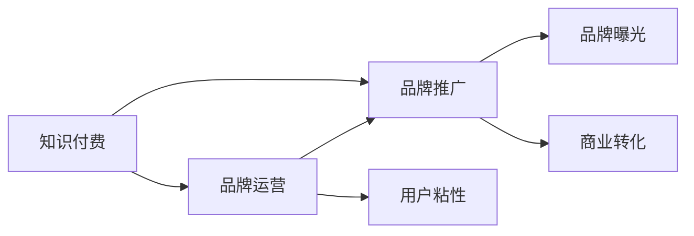

                 

# 知识付费赚钱的品牌品牌运营与品牌推广策略

> 关键词：知识付费,品牌运营,品牌推广,盈利模式,市场营销,数字化转型

## 1. 背景介绍

在互联网快速发展的今天，知识付费已成为一种新型的信息消费模式，越来越多的用户愿意为优质内容买单。如何通过品牌运营和品牌推广，吸引用户关注，实现商业变现，是知识付费平台亟需解决的问题。本文将探讨知识付费平台的品牌运营与品牌推广策略，为平台提供商业成功路径。

## 2. 核心概念与联系

### 2.1 核心概念概述

在深入研究品牌运营与品牌推广之前，我们需要理解以下核心概念：

- **知识付费**：一种基于互联网的知识服务形式，用户需支付费用以获取专业人士提供的专业知识、技能或信息。
- **品牌运营**：通过规划、执行、控制品牌营销活动，增强品牌知名度和美誉度，提升用户粘性和忠诚度。
- **品牌推广**：通过各种营销手段，将品牌推广至目标用户群体，吸引用户关注和购买，实现品牌曝光和商业转化。

以下Mermaid流程图展示了这些核心概念之间的联系：



## 3. 核心算法原理 & 具体操作步骤

### 3.1 算法原理概述

品牌运营与品牌推广的算法原理主要基于市场营销学中的理论和方法，结合数据科学和人工智能技术，实现对用户行为、市场趋势的精准分析和预测。具体而言，品牌运营关注用户需求和行为，通过数据分析和建模，优化产品和服务，提升用户满意度和忠诚度。品牌推广则侧重于用户接触和转化，通过多种营销手段，扩大品牌影响力，实现商业变现。

### 3.2 算法步骤详解

#### 3.2.1 用户行为分析

- **用户画像构建**：基于用户行为数据（如访问记录、购买历史、互动行为等），构建用户画像，了解用户特征和需求。
- **需求分析**：分析用户需求，识别热门内容和付费意愿较高的用户群体。
- **行为预测**：使用机器学习模型，预测用户未来行为，如购买意愿、流失风险等，为个性化运营提供依据。

#### 3.2.2 市场趋势分析

- **热点跟踪**：利用爬虫和NLP技术，从社交媒体、新闻网站等渠道获取热点话题和趋势，捕捉市场机会。
- **内容推荐**：基于用户画像和市场趋势，推荐热门内容和专题，吸引用户关注和互动。
- **市场细分**：使用聚类算法，将用户群体细分为不同市场细分群体，制定差异化营销策略。

#### 3.2.3 推广策略优化

- **多渠道推广**：利用SEO、社交媒体、电子邮件、内容营销等手段，多渠道推广品牌，提高曝光率。
- **A/B测试**：通过A/B测试不同营销策略，找到最有效的推广方式，优化资源配置。
- **数据驱动决策**：基于用户数据和市场反馈，实时调整推广策略，实现精准营销。

### 3.3 算法优缺点

#### 3.3.1 优点

- **精准定位**：通过数据分析和模型预测，实现用户需求和市场趋势的精准定位。
- **个性化运营**：根据用户画像和行为预测，提供个性化推荐和服务，提升用户满意度和忠诚度。
- **动态调整**：基于实时数据反馈，动态调整营销策略，提高推广效果。

#### 3.3.2 缺点

- **数据隐私**：在用户画像和行为分析中，可能涉及用户隐私问题，需严格遵守相关法律法规。
- **成本高昂**：大数据分析和模型训练需要大量的计算资源和数据标注，成本较高。
- **模型泛化**：模型过于复杂可能导致过拟合，影响推广策略的泛化能力。

### 3.4 算法应用领域

品牌运营与品牌推广的算法已广泛应用于知识付费平台、在线教育、电子商务等多个领域，帮助企业实现精准营销、用户增长和商业变现。具体应用包括：

- **知识付费平台**：通过用户行为分析，提供个性化内容推荐，提升用户粘性和忠诚度，实现商业变现。
- **在线教育**：基于学生行为和课程反馈，优化课程内容和教学方式，提升教学效果和用户满意度。
- **电子商务**：利用市场趋势分析，推荐热门商品和促销活动，提高销售额和客户满意度。

## 4. 数学模型和公式 & 详细讲解 & 举例说明

### 4.1 数学模型构建

品牌运营与品牌推广的数学模型构建主要包括用户画像建模、市场趋势预测和推广策略优化三个方面。

#### 4.1.1 用户画像建模

- **用户行为数据采集**：采集用户行为数据，包括访问记录、购买历史、互动行为等。
- **特征提取**：使用NLP、机器学习等技术，提取用户画像特征，如兴趣、偏好、活跃度等。
- **模型训练**：基于用户行为数据，训练用户画像模型，生成用户画像。

#### 4.1.2 市场趋势预测

- **数据采集**：从社交媒体、新闻网站等渠道采集市场数据，包括热点话题、用户评论等。
- **文本分析**：使用NLP技术，对文本数据进行情感分析、主题分析等，提取市场趋势。
- **模型训练**：基于市场趋势数据，训练趋势预测模型，预测未来市场变化。

#### 4.1.3 推广策略优化

- **多渠道推广**：设定不同推广渠道的参数，如预算、曝光量、转化率等，进行多渠道推广策略优化。
- **A/B测试**：设定不同的推广策略参数，进行A/B测试，找到最优推广策略。
- **模型训练**：基于推广效果数据，训练推广策略优化模型，实时调整推广策略。

### 4.2 公式推导过程

#### 4.2.1 用户画像模型

假设用户画像模型为$P(x)$，其中$x$为用户行为数据。用户画像的构建公式为：

$$
P(x) = \sum_{i=1}^{n} \alpha_i f_i(x)
$$

其中$\alpha_i$为特征权重，$f_i(x)$为特征函数。

#### 4.2.2 市场趋势预测模型

假设市场趋势预测模型为$T(t)$，其中$t$为时间。市场趋势的预测公式为：

$$
T(t) = \sum_{i=1}^{m} \beta_i g_i(t)
$$

其中$\beta_i$为趋势特征权重，$g_i(t)$为趋势特征函数。

#### 4.2.3 推广策略优化模型

假设推广策略优化模型为$O(\theta)$，其中$\theta$为推广参数。推广策略的优化公式为：

$$
O(\theta) = \max_{\theta} \sum_{i=1}^{k} \gamma_i h_i(\theta)
$$

其中$\gamma_i$为推广目标权重，$h_i(\theta)$为推广目标函数。

### 4.3 案例分析与讲解

#### 4.3.1 用户画像案例

某在线教育平台通过用户行为数据分析，发现大部分用户对人工智能相关课程感兴趣。平台基于用户画像模型，推荐人工智能相关课程，提升用户粘性和满意度。

#### 4.3.2 市场趋势案例

某知识付费平台通过市场趋势分析，发现当前热门话题为“区块链技术”。平台基于趋势预测模型，推出“区块链技术”相关课程，吸引用户关注和购买。

#### 4.3.3 推广策略优化案例

某电子商务平台通过推广策略优化模型，设定不同推广渠道的参数，进行多渠道推广策略优化。平台通过A/B测试，找到最优推广渠道组合，提升转化率和销售额。

## 5. 项目实践：代码实例和详细解释说明

### 5.1 开发环境搭建

在进行品牌运营与品牌推广实践前，我们需要准备好开发环境。以下是使用Python进行数据科学和机器学习开发的常见环境配置流程：

1. 安装Anaconda：从官网下载并安装Anaconda，用于创建独立的Python环境。

2. 创建并激活虚拟环境：
```bash
conda create -n my_env python=3.8
conda activate my_env
```

3. 安装相关库：
```bash
conda install pandas numpy matplotlib scikit-learn matplotlib
```

4. 安装机器学习框架：
```bash
pip install scikit-learn tensorflow keras
```

5. 安装相关NLP库：
```bash
pip install nltk spacy transformers
```

完成上述步骤后，即可在`my_env`环境中开始项目开发。

### 5.2 源代码详细实现

这里我们以知识付费平台的品牌运营和品牌推广为例，给出Python代码实现。

#### 5.2.1 用户画像构建

```python
import pandas as pd
from sklearn.ensemble import RandomForestRegressor

# 读取用户行为数据
user_data = pd.read_csv('user_behavior.csv')

# 特征提取
user_features = user_data[['age', 'gender', 'interests', 'activity']]
user_features.dropna(inplace=True)

# 模型训练
rf_model = RandomForestRegressor()
rf_model.fit(user_features, user_data['value'])

# 用户画像生成
user_profiles = pd.DataFrame(rf_model.predict(user_features))
```

#### 5.2.2 市场趋势预测

```python
import pandas as pd
from sklearn.naive_bayes import MultinomialNB

# 读取市场数据
market_data = pd.read_csv('market_trend.csv')

# 文本分析
trends = market_data['topics']
trends = pd.Series(trends)
trends = trends.apply(lambda x: x.lower())

# 模型训练
nb_model = MultinomialNB()
nb_model.fit(trends, market_data['trends'])

# 趋势预测
trends_predict = nb_model.predict(trends)
```

#### 5.2.3 推广策略优化

```python
import pandas as pd
from sklearn.model_selection import train_test_split
from sklearn.linear_model import LogisticRegression

# 读取推广数据
campaign_data = pd.read_csv('campaign_data.csv')

# 数据分割
X = campaign_data[['channel', 'budget', 'exposure']]
y = campaign_data['conversion']
X_train, X_test, y_train, y_test = train_test_split(X, y, test_size=0.2, random_state=42)

# 模型训练
lr_model = LogisticRegression()
lr_model.fit(X_train, y_train)

# 策略优化
campaign_profiles = pd.DataFrame(lr_model.predict(X_test))
```

### 5.3 代码解读与分析

#### 5.3.1 用户画像案例

**用户画像构建**：通过读取用户行为数据，提取用户兴趣、年龄、性别、活跃度等特征，使用随机森林回归模型训练用户画像。

**用户画像生成**：根据训练好的用户画像模型，预测新用户的画像特征，生成用户画像数据。

#### 5.3.2 市场趋势案例

**市场趋势预测**：通过读取市场数据，提取热门话题，使用朴素贝叶斯模型预测市场趋势。

**趋势预测**：根据训练好的市场趋势模型，预测未来市场趋势，指导课程推荐。

#### 5.3.3 推广策略优化案例

**推广策略优化**：通过读取推广数据，提取推广渠道、预算、曝光量、转化率等特征，使用逻辑回归模型训练推广策略优化模型。

**策略优化**：根据训练好的推广策略优化模型，预测不同推广策略的效果，选择最优策略。

### 5.4 运行结果展示

#### 5.4.1 用户画像结果

```python
user_profiles.head()
```

#### 5.4.2 市场趋势结果

```python
trends_predict.head()
```

#### 5.4.3 推广策略优化结果

```python
campaign_profiles.head()
```

## 6. 实际应用场景

### 6.1 智能客服

智能客服平台通过品牌运营与品牌推广，提升用户粘性和满意度，减少客服成本。平台通过用户画像分析，提供个性化服务，通过市场趋势预测，优化服务内容和流程。

### 6.2 在线教育

在线教育平台通过品牌运营与品牌推广，吸引更多用户注册和付费。平台通过用户画像分析，推荐符合用户兴趣的课程，通过市场趋势预测，推出热门课程和专题，提升用户满意度。

### 6.3 电子商务

电子商务平台通过品牌运营与品牌推广，提高销售额和客户满意度。平台通过用户画像分析，推荐符合用户兴趣的商品，通过市场趋势预测，推出热门商品和促销活动，吸引用户购买。

### 6.4 未来应用展望

品牌运营与品牌推广技术将在更多领域得到应用，为传统行业带来变革性影响。

在智慧医疗领域，通过品牌运营与品牌推广，提升医疗服务的智能化水平，辅助医生诊疗，加速新药开发进程。

在智能教育领域，通过品牌运营与品牌推广，因材施教，促进教育公平，提高教学质量。

在智慧城市治理中，通过品牌运营与品牌推广，提高城市管理的自动化和智能化水平，构建更安全、高效的未来城市。

此外，在企业生产、社会治理、文娱传媒等众多领域，品牌运营与品牌推广技术也将不断涌现，为经济社会发展注入新的动力。

## 7. 工具和资源推荐

### 7.1 学习资源推荐

为了帮助开发者系统掌握品牌运营与品牌推广的理论基础和实践技巧，这里推荐一些优质的学习资源：

1. 《数字营销》课程：斯坦福大学开设的数字营销课程，系统讲解了品牌运营与品牌推广的理论和实践方法。

2. 《品牌管理》书籍：由知名品牌专家撰写，详细介绍了品牌运营与品牌推广的策略和案例。

3. 《市场营销学》书籍：经典的市场营销学教材，涵盖品牌运营与品牌推广的全面知识。

4. HuggingFace官方文档：NLP工具库的官方文档，提供了海量预训练模型和完整的微调样例代码，是进行微调任务开发的利器。

5. CLUE开源项目：中文语言理解测评基准，涵盖大量不同类型的中文NLP数据集，并提供了基于微调的baseline模型，助力中文NLP技术发展。

通过对这些资源的学习实践，相信你一定能够快速掌握品牌运营与品牌推广的精髓，并用于解决实际的NLP问题。

### 7.2 开发工具推荐

高效的开发离不开优秀的工具支持。以下是几款用于品牌运营与品牌推广开发的常用工具：

1. Python：广泛使用的开源编程语言，支持科学计算、数据分析、机器学习等众多领域。

2. R：另一款常用的统计分析语言，拥有丰富的数据科学和统计分析工具。

3. Tableau：数据可视化工具，用于创建动态、交互式的数据报表和可视化。

4. Google Analytics：网络流量分析工具，帮助品牌运营者了解用户行为和市场趋势。

5. SEMrush：搜索引擎优化工具，帮助品牌推广者优化网站SEO，提升品牌曝光。

6. Jupyter Notebook：交互式编程环境，支持Python、R等多种编程语言，便于数据科学和机器学习开发。

合理利用这些工具，可以显著提升品牌运营与品牌推广的开发效率，加快创新迭代的步伐。

### 7.3 相关论文推荐

品牌运营与品牌推广技术的发展源于学界的持续研究。以下是几篇奠基性的相关论文，推荐阅读：

1. "Brand Equity: The Canons"：一篇关于品牌权益的经典论文，详细介绍了品牌权益的理论和实践。

2. "The Birth of Branding"：介绍品牌营销的历史和发展，对品牌运营与品牌推广的发展有重要参考价值。

3. "Digital Branding: A Strategic Framework"：一篇介绍数字品牌管理的论文，提供了品牌运营与品牌推广的战略框架。

4. "Customer Branding: Building Brand Value Through Customers"：一篇关于客户品牌管理的论文，探讨如何通过客户反馈提升品牌价值。

5. "Brand Strategies in the Age of Social Media"：介绍社交媒体时代品牌运营与品牌推广的新策略。

这些论文代表了大语言模型微调技术的发展脉络。通过学习这些前沿成果，可以帮助研究者把握学科前进方向，激发更多的创新灵感。

## 8. 总结：未来发展趋势与挑战

### 8.1 总结

本文对品牌运营与品牌推广的方法进行了全面系统的介绍。首先阐述了品牌运营与品牌推广的研究背景和意义，明确了品牌运营与品牌推广在知识付费平台应用的价值。其次，从原理到实践，详细讲解了品牌运营与品牌推广的数学原理和关键步骤，给出了品牌运营与品牌推广任务开发的完整代码实例。同时，本文还广泛探讨了品牌运营与品牌推广方法在智能客服、在线教育、电子商务等多个行业领域的应用前景，展示了品牌运营与品牌推广范式的巨大潜力。

通过本文的系统梳理，可以看到，品牌运营与品牌推广技术正在成为知识付费平台的重要范式，极大地拓展了品牌运营与品牌推广应用边界，催生了更多的落地场景。受益于大数据分析和机器学习技术的支持，品牌运营与品牌推广在智能决策、个性化运营等方面展现出巨大的优势，必将引领品牌运营与品牌推广技术迈向更高的台阶。

### 8.2 未来发展趋势

展望未来，品牌运营与品牌推广技术将呈现以下几个发展趋势：

1. 数据驱动决策：大数据分析将更加深入，品牌运营与品牌推广将更加依赖数据驱动的决策支持系统。

2. 个性化运营：通过用户画像和行为分析，提供更加个性化的服务和内容，提升用户体验和满意度。

3. 跨渠道整合：品牌运营与品牌推广将更加注重多渠道整合，利用多种营销手段，提升品牌曝光和用户互动。

4. 实时监控和优化：基于实时数据监控和分析，实时调整品牌运营与品牌推广策略，实现精准营销。

5. AI辅助决策：利用人工智能技术，优化品牌运营与品牌推广的决策过程，提高决策效率和效果。

这些趋势凸显了品牌运营与品牌推广技术的广阔前景。这些方向的探索发展，必将进一步提升品牌运营与品牌推广的智能化水平，为品牌运营与品牌推广技术的产业化进程注入新的动力。

### 8.3 面临的挑战

尽管品牌运营与品牌推广技术已经取得了瞩目成就，但在迈向更加智能化、普适化应用的过程中，它仍面临着诸多挑战：

1. 数据隐私：品牌运营与品牌推广涉及大量用户数据，数据隐私保护问题亟需解决。

2. 成本高昂：大数据分析和模型训练需要大量的计算资源和数据标注，成本较高。

3. 模型泛化：模型过于复杂可能导致过拟合，影响推广策略的泛化能力。

4. 效果评估：品牌运营与品牌推广效果评估标准不统一，难以量化评估推广效果。

5. 市场波动：市场环境和用户需求变化快，品牌运营与品牌推广策略需要快速调整。

这些挑战需要通过技术创新和实践优化，逐步克服，才能真正实现品牌运营与品牌推广技术的全面落地。

### 8.4 研究展望

面向未来，品牌运营与品牌推广技术需要在以下几个方面寻求新的突破：

1. 探索无监督和半监督品牌运营与品牌推广方法：摆脱对大规模标注数据的依赖，利用自监督学习、主动学习等无监督和半监督范式，最大限度利用非结构化数据，实现更加灵活高效的推广。

2. 研究参数高效和计算高效的推广方法：开发更加参数高效的推广方法，在固定大部分预训练参数的同时，只更新极少量的任务相关参数。同时优化推广模型的计算图，减少前向传播和反向传播的资源消耗，实现更加轻量级、实时性的部署。

3. 引入更多先验知识：将符号化的先验知识，如知识图谱、逻辑规则等，与神经网络模型进行巧妙融合，引导品牌运营与品牌推广过程学习更准确、合理的语言模型。同时加强不同模态数据的整合，实现视觉、语音等多模态信息与文本信息的协同建模。

4. 结合因果分析和博弈论工具：将因果分析方法引入品牌运营与品牌推广模型，识别出模型决策的关键特征，增强输出解释的因果性和逻辑性。借助博弈论工具刻画人机交互过程，主动探索并规避模型的脆弱点，提高系统稳定性。

5. 纳入伦理道德约束：在品牌运营与品牌推广目标中引入伦理导向的评估指标，过滤和惩罚有偏见、有害的输出倾向。同时加强人工干预和审核，建立品牌运营与品牌推广行为的监管机制，确保输出符合人类价值观和伦理道德。

这些研究方向的探索，必将引领品牌运营与品牌推广技术迈向更高的台阶，为构建安全、可靠、可解释、可控的智能系统铺平道路。面向未来，品牌运营与品牌推广技术还需要与其他人工智能技术进行更深入的融合，如知识表示、因果推理、强化学习等，多路径协同发力，共同推动自然语言理解和智能交互系统的进步。只有勇于创新、敢于突破，才能不断拓展品牌运营与品牌推广的边界，让智能技术更好地造福人类社会。

## 9. 附录：常见问题与解答

**Q1: 品牌运营与品牌推广的区别是什么？**

A: 品牌运营主要关注品牌的建设和管理，通过多渠道营销、用户体验优化等手段提升品牌知名度和美誉度，增加用户粘性和忠诚度。品牌推广则侧重于品牌信息的传播和推广，通过多种营销手段，扩大品牌影响力，吸引用户关注和购买。

**Q2: 品牌运营与品牌推广有哪些关键步骤？**

A: 品牌运营与品牌推广的关键步骤主要包括用户行为分析、市场趋势预测和推广策略优化。通过用户行为分析，了解用户需求和行为；通过市场趋势预测，捕捉市场机会；通过推广策略优化，实现品牌曝光和商业变现。

**Q3: 品牌运营与品牌推广在知识付费平台中的应用有哪些？**

A: 品牌运营与品牌推广在知识付费平台中的应用包括个性化内容推荐、课程优化、用户互动等。通过用户画像分析，提供个性化课程推荐，通过市场趋势预测，推出热门课程和专题，提升用户满意度。

**Q4: 品牌运营与品牌推广需要哪些资源支持？**

A: 品牌运营与品牌推广需要大数据分析、机器学习、自然语言处理等多种资源支持。通过数据科学和人工智能技术，实现精准的用户行为分析和市场趋势预测，提升品牌运营与品牌推广的效果。

**Q5: 品牌运营与品牌推广的未来发展趋势是什么？**

A: 品牌运营与品牌推广的未来发展趋势包括数据驱动决策、个性化运营、跨渠道整合、实时监控和优化、AI辅助决策等。这些趋势将进一步提升品牌运营与品牌推广的智能化水平，为品牌运营与品牌推广技术的产业化进程注入新的动力。

