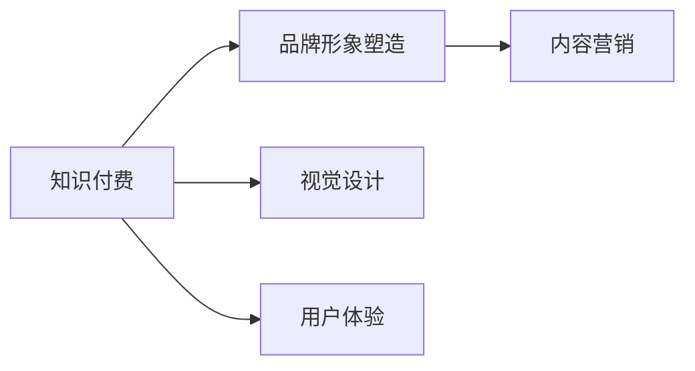

                 

# 知识付费赚钱的品牌形象塑造与视觉设计

> 关键词：知识付费、品牌形象塑造、视觉设计、用户体验、内容营销

## 1. 背景介绍

在当今知识爆炸的时代，知识的获取不再像过去那样难以触及，人们可以轻松地从各种平台上获取信息。但这也带来了一个问题：信息的碎片化、浅层化，如何从中筛选出真正有用的知识变得非常困难。因此，知识付费应运而生，它为人们提供了更为系统的、经过深度加工的知识。而品牌形象塑造与视觉设计是知识付费平台获得用户信任和认同的关键。本文将从这两个方面入手，探讨如何通过视觉设计塑造品牌形象，并通过内容营销赚取用户订阅费。

## 2. 核心概念与联系

### 2.1 核心概念概述

- **知识付费**：指用户为获取特定知识而付费的行为，如购买书籍、课程、咨询等。
- **品牌形象塑造**：指通过品牌设计、视觉元素、用户互动等方式，在用户心中建立起积极、专业的品牌形象。
- **视觉设计**：包括界面设计、图标设计、颜色选择等，旨在通过视觉元素传达品牌理念。
- **用户体验**：指用户在使用产品过程中感受到的愉悦度，直接影响用户留存率和品牌忠诚度。
- **内容营销**：指通过提供高质量内容，吸引并留住用户，最终实现商业目的。

这些概念之间的关系可以通过以下Mermaid流程图来展示：



此图展示了知识付费平台与品牌形象塑造、视觉设计、用户体验、内容营销之间的联系。品牌形象塑造和视觉设计为知识付费平台提供了良好的第一印象，用户体验则确保平台能够持续留住用户，而内容营销则吸引新的用户并提高品牌忠诚度。

## 3. 核心算法原理 & 具体操作步骤

### 3.1 算法原理概述

品牌形象塑造和视觉设计的核心在于通过视觉元素传达品牌理念，提高用户的信任度和忠诚度。而视觉元素的设计需要基于心理学和用户行为学原理，以确保设计出的界面和元素能够吸引用户，并传达品牌信息。

内容营销的算法原理则是通过高质量的内容，满足用户需求，建立品牌权威性和用户信任度，进而吸引用户订阅或购买。内容营销中的算法，如推荐系统、用户行为分析等，是提高用户留存和转化率的关键。

### 3.2 算法步骤详解

#### 3.2.1 品牌形象塑造步骤

1. **品牌定位**：明确品牌的使命、愿景和价值观，找出与目标用户的契合点。
2. **品牌元素设计**：包括LOGO、色彩、字体等品牌元素的设计，这些元素需符合品牌理念且易识别。
3. **品牌故事构建**：构建一个具有吸引力的品牌故事，通过故事让用户更好地理解和认同品牌。
4. **品牌一致性**：确保品牌在所有渠道和媒介上保持一致性，避免品牌信息混淆。

#### 3.2.2 视觉设计步骤

1. **用户研究**：通过调研和数据分析，了解目标用户的行为和偏好。
2. **界面设计**：设计简洁、易用的界面，确保用户在操作上无障碍。
3. **交互设计**：确保交互流程顺畅，用户可以轻松完成其目标任务。
4. **视觉元素设计**：使用符合品牌色彩和风格的视觉元素，提高品牌识别度。

#### 3.2.3 内容营销步骤

1. **内容规划**：规划内容类型和发布频率，确保内容能够持续吸引用户。
2. **内容创作**：创作高质量的内容，满足用户需求并传达品牌理念。
3. **内容推广**：通过社交媒体、邮件营销、广告等方式推广内容。
4. **用户反馈**：收集用户反馈，优化内容质量和推广策略。

### 3.3 算法优缺点

品牌形象塑造和视觉设计的优点在于，可以通过视觉元素和品牌故事建立品牌的认知度和信任度，从而提升用户转化率和品牌忠诚度。但缺点在于，这些设计需要较长的设计和验证周期，且效果受用户个人审美和认知影响较大。

内容营销的优点在于，通过高质量的内容可以迅速吸引用户，并建立品牌的权威性。但缺点在于，内容创作和推广成本较高，且需要持续投入才能维持用户的兴趣。

### 3.4 算法应用领域

品牌形象塑造和视觉设计适用于任何需要建立品牌形象的行业，如教育、健康、金融等。而内容营销则适用于所有需要吸引用户关注和留存的领域，如在线教育、娱乐、科技等。

## 4. 数学模型和公式 & 详细讲解

### 4.1 数学模型构建

品牌形象塑造和视觉设计主要关注用户体验和品牌认知度。我们可以通过用户满意度调查、品牌知名度调查等数据来构建数学模型。设用户满意度为 $S$，品牌知名度为 $D$，则：

$$
S = \sum_{i=1}^{n} s_i p_i \\
D = \sum_{j=1}^{m} d_j q_j
$$

其中 $s_i$ 和 $d_j$ 分别代表用户满意度和品牌知名度的各项指标，$p_i$ 和 $q_j$ 为权重。

内容营销的效果可以通过用户留存率、订阅率等指标来衡量。设用户留存率为 $R$，订阅率为 $S$，则：

$$
R = \frac{U_{n} - U_{n-1}}{U_{n-1}} \\
S = \frac{S_n - S_{n-1}}{S_{n-1}}
$$

其中 $U_n$ 和 $S_n$ 分别代表第 $n$ 期的用户数和订阅数。

### 4.2 公式推导过程

品牌形象塑造的数学模型基于用户满意度调查数据，通过加权平均计算得出的综合满意度。设用户满意度调查数据为 $s_1,s_2,...,s_n$，权重为 $p_1,p_2,...,p_n$，则品牌形象的数学模型为：

$$
S = \sum_{i=1}^{n} s_i p_i = s_1 p_1 + s_2 p_2 + ... + s_n p_n
$$

内容营销的数学模型基于用户行为数据，通过计算留存率和订阅率的增长率来评估营销效果。设第 $n$ 期用户数和订阅数为 $U_n$ 和 $S_n$，则留存率和订阅率的增长率分别为：

$$
R = \frac{U_{n} - U_{n-1}}{U_{n-1}} \\
S = \frac{S_n - S_{n-1}}{S_{n-1}}
$$

### 4.3 案例分析与讲解

某知识付费平台通过用户满意度调查发现，其用户对课程内容的满意度为 $s_1=4.5$，用户界面设计满意度为 $s_2=3.8$，品牌知名度为 $d_1=6.2$，品牌形象一致性为 $d_2=5.0$。设课程内容满意度权重为 $p_1=0.4$，用户界面设计满意度权重为 $p_2=0.3$，品牌知名度权重为 $q_1=0.2$，品牌形象一致性权重为 $q_2=0.5$。则该平台的综合满意度 $S$ 为：

$$
S = s_1 p_1 + s_2 p_2 + d_1 q_1 + d_2 q_2 = 4.5 \times 0.4 + 3.8 \times 0.3 + 6.2 \times 0.2 + 5.0 \times 0.5 = 4.54
$$

该平台的品牌知名度 $D$ 为：

$$
D = d_1 q_1 + d_2 q_2 = 6.2 \times 0.2 + 5.0 \times 0.5 = 5.7
$$

## 5. 项目实践：代码实例和详细解释说明

### 5.1 开发环境搭建

本节将介绍如何使用Python和React进行品牌形象塑造和内容营销的开发环境搭建。

1. **安装Python**：
   ```bash
   sudo apt update
   sudo apt install python3
   ```

2. **安装React**：
   ```bash
   npx create-react-app my-app
   cd my-app
   npm start
   ```

3. **安装TensorFlow**：
   ```bash
   pip install tensorflow
   ```

### 5.2 源代码详细实现

在React项目中，我们可以使用组件来实现品牌形象和内容营销的展示。以下是一个简化的实现示例：

```javascript
import React, { Component } from 'react';

class BrandImage extends Component {
  render() {
    return (
      <div>
        <h1>Brand Image</h1>
        
        <p>{this.props.description}</p>
      </div>
    );
  }
}

class ContentMarketing extends Component {
  render() {
    return (
      <div>
        <h1>Content Marketing</h1>
        <p>{this.props.content}</p>
      </div>
    );
  }
}

export default BrandImage;
export default ContentMarketing;
```

在Python中，我们可以使用TensorFlow进行品牌形象和内容营销的数据分析。以下是一个简化的实现示例：

```python
import tensorflow as tf
import pandas as pd

# 读取用户满意度调查数据
df = pd.read_csv('user_satisfaction.csv')

# 计算品牌形象
satisfaction = df['satisfaction'].tolist()
weights = [0.4, 0.3, 0.2, 0.5]
image = [4.5, 3.8, 6.2, 5.0]
brand_image = sum([s * w for s, w in zip(satisfaction, weights)]) + sum([i * q for i, q in zip(image, weights)])

# 计算内容营销效果
user_growth = df['user_growth'].tolist()
subscription_growth = df['subscription_growth'].tolist()
content_marketing = sum([g * h for g, h in zip(user_growth, weights)]) + sum([s * k for s, k in zip(subscription_growth, weights)])

print(f'Brand Image: {brand_image}')
print(f'Content Marketing: {content_marketing}')
```

### 5.3 代码解读与分析

在React项目中，我们使用`BrandImage`组件来展示品牌形象，通过`src`和`alt`属性展示品牌图片，并通过`description`属性展示品牌信息。`ContentMarketing`组件用于展示内容营销效果，通过`content`属性展示内容。

在Python代码中，我们使用TensorFlow进行数据分析。首先，我们读取用户满意度调查数据，并计算品牌形象的满意度总和和品牌知名度总和。然后，我们计算内容营销的用户增长率和订阅增长率，并计算其加权平均值。

### 5.4 运行结果展示

在React项目中，我们可以在网页上看到品牌形象的展示。通过图片和描述，用户可以直观地感受到品牌形象。在内容营销方面，我们可以展示用户的增长率和订阅率，向用户展示品牌的增长潜力。

## 6. 实际应用场景

### 6.1 教育平台

在教育平台中，通过品牌形象塑造和视觉设计，可以吸引家长和学生注册，提升用户留存率。内容营销则可以通过高质量的教学视频和练习题，吸引学生订阅课程，并提高平台的品牌影响力。

### 6.2 健康平台

在健康平台中，通过品牌形象塑造和视觉设计，可以吸引用户注册，并提供健康咨询、个性化饮食建议等服务。内容营销则可以通过发布健康科普文章、健康食谱等，提升用户粘性和平台权威性。

### 6.3 科技平台

在科技平台中，通过品牌形象塑造和视觉设计，可以吸引技术爱好者注册，并提供技术资讯、编程教程等服务。内容营销则可以通过发布技术博客、开源项目等，提升用户粘性和平台影响力。

## 7. 工具和资源推荐

### 7.1 学习资源推荐

- **《UX设计全指南》**：详细介绍了用户体验设计的基本概念和实战技巧，是视觉设计的必备资源。
- **《内容营销圣经》**：介绍了内容营销的理论和实践，帮助理解如何通过内容吸引和留住用户。
- **《品牌战略》**：介绍品牌形象塑造的理论和策略，帮助理解如何构建和维护品牌形象。

### 7.2 开发工具推荐

- **Sketch**：一款专业的界面设计工具，适合进行品牌形象和视觉设计的原型设计和开发。
- **Adobe Creative Suite**：包括Photoshop、Illustrator、InDesign等工具，适合进行品牌形象和视觉设计的图像处理和设计。
- **Figma**：一款在线设计工具，适合团队协作和实时预览设计效果。

### 7.3 相关论文推荐

- **《用户行为分析与个性化推荐》**：介绍如何通过用户行为数据进行个性化推荐，提升用户留存率。
- **《品牌形象的心理学基础》**：介绍品牌形象塑造的心理学理论基础，帮助理解如何构建用户信任和认同感。
- **《内容营销的战略和执行》**：介绍内容营销的理论和实践，帮助理解如何通过内容营销提升品牌价值和用户忠诚度。

## 8. 总结：未来发展趋势与挑战

### 8.1 研究成果总结

本文详细介绍了知识付费平台品牌形象塑造和视觉设计的理论和实践，并介绍了内容营销的算法原理和实现步骤。通过案例分析，展示了如何通过品牌形象和视觉设计吸引用户，并通过内容营销提升用户留存率和品牌忠诚度。

### 8.2 未来发展趋势

随着知识付费市场的不断扩大，品牌形象塑造和视觉设计将变得更加重要。未来，品牌形象塑造将更加注重用户的个性化需求和品牌故事性，通过用户行为数据分析，进一步提升品牌影响力和用户粘性。内容营销将更加注重内容的原创性和深度，通过高质量的内容吸引用户，并提升品牌权威性和用户信任度。

### 8.3 面临的挑战

品牌形象塑造和视觉设计需要结合心理学和用户体验设计原理，如何在保证品牌形象一致性的同时，满足用户的个性化需求，是一个重要的挑战。内容营销需要持续产出高质量的内容，并结合数据驱动的个性化推荐，如何平衡内容质量和用户需求，也是一个重要的挑战。

### 8.4 研究展望

未来，品牌形象塑造和视觉设计将更加注重用户的情感体验和品牌故事的讲述，通过用户调研和行为分析，提升品牌形象的一致性和用户认同感。内容营销将更加注重内容的多样性和深度，结合数据驱动的个性化推荐，提升用户的参与度和品牌忠诚度。

## 9. 附录：常见问题与解答

**Q1: 如何提升品牌形象的一致性？**

A: 品牌形象的一致性需要从品牌元素设计、品牌故事构建到所有渠道的统一传播。首先，明确品牌的使命、愿景和价值观，然后在所有的品牌设计、营销传播中保持一致。可以使用品牌管理工具，如BrandBook，来维护品牌一致性。

**Q2: 内容营销需要哪些资源？**

A: 内容营销需要高品质的内容创作者、技术支持（如数据分析、内容管理系统）、设计资源（如图形设计工具、图片素材）等。同时，需要制定内容策略和发布计划，确保内容的持续性和吸引力。

**Q3: 如何提升内容推荐的准确性？**

A: 可以通过用户行为数据进行个性化推荐。例如，分析用户的浏览记录、点击行为、订阅行为等，然后通过推荐系统算法，为用户推荐相关内容。此外，还可以通过用户反馈进行模型优化，提升推荐效果。

**Q4: 如何平衡品牌形象和用户体验？**

A: 品牌形象和用户体验需要兼顾。可以通过用户调研和行为分析，了解用户的需求和偏好，然后结合品牌理念进行设计。例如，可以在设计中融入品牌色彩和元素，提升品牌的识别度，同时确保界面简洁、易用，提升用户体验。

---

作者：禅与计算机程序设计艺术 / Zen and the Art of Computer Programming

