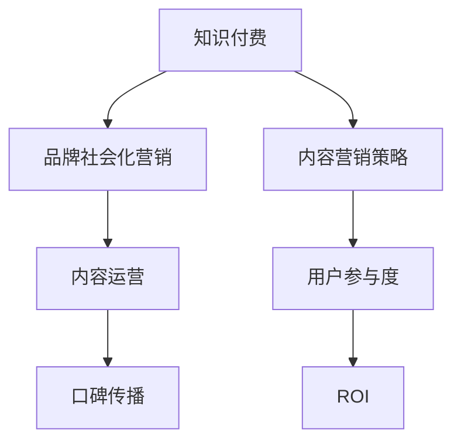

                 

# 知识付费赚钱的品牌社会化营销与内容营销策略

> 关键词：知识付费,品牌营销,社会化媒体,内容营销策略,用户参与度,ROI,内容运营,口碑传播

## 1. 背景介绍

在数字化时代，知识和信息的传播速度和广度达到了前所未有的高度。知识付费成为连接知识创作者和消费者的新型商业模式，其市场需求日益增长。如何通过有效的品牌社会化营销与内容营销策略，提升知识付费平台的品牌影响力，并实现商业盈利，成为平台运营者的核心挑战。

本文章将从品牌营销的角度出发，探讨知识付费平台如何通过内容营销策略在社会化媒体上建立品牌认知、提高用户参与度，并实现商业价值最大化。

## 2. 核心概念与联系

### 2.1 核心概念概述

为了更好地理解品牌社会化营销与内容营销策略，本节将介绍几个密切相关的核心概念：

- **知识付费**：基于互联网的付费模式，消费者通过购买知识内容获得专业知识，以解决实际问题或提高自身技能。知识付费平台如得到、喜马拉雅、网易云课堂等。

- **品牌社会化营销**：通过社会化媒体（如微博、微信、抖音等），将品牌信息传递给目标用户，并鼓励用户参与互动，形成品牌认知和口碑传播。

- **内容营销策略**：以优质内容为核心，通过社交媒体、博客、视频、电子书等多种形式，吸引目标用户，并建立品牌信任和忠诚度。

- **用户参与度**：指用户对品牌内容的互动程度，包括点赞、评论、分享等行为，是衡量品牌影响力的重要指标。

- **ROI（投资回报率）**：衡量品牌营销投入的收益情况，计算方式为：（收益 - 投入）/ 投入。

- **内容运营**：通过系统化的方法管理和优化内容，确保内容发布与传播的效率和效果。

- **口碑传播**：用户通过分享积极的用户体验和内容推荐，帮助品牌达到更广泛的传播效果。

这些概念之间的逻辑关系可以通过以下Mermaid流程图来展示：



这个流程图展示了几组关键概念及其之间的关系：

1. 知识付费平台以内容为核心，通过品牌营销和内容运营策略在社会化媒体上建立品牌认知。
2. 内容营销策略通过优质的内容吸引用户，建立品牌信任，提高用户参与度。
3. 用户参与度反映用户对品牌的认可程度，是衡量品牌影响力的一个重要指标。
4. 通过提高用户参与度，平台能够实现较高的投资回报率。
5. 内容运营确保内容的高质量发布与传播，提升品牌传播效果。
6. 口碑传播通过用户自发推荐，扩大品牌影响范围。

## 3. 核心算法原理 & 具体操作步骤

### 3.1 算法原理概述

品牌社会化营销与内容营销策略的核心是建立品牌认知、提高用户参与度，并最终实现商业价值的最大化。其基本原理如下：

1. **品牌认知建立**：通过发布高质量的内容，吸引目标用户关注品牌，并形成品牌认知。
2. **用户参与度提升**：通过互动性强的社交媒体活动，鼓励用户参与品牌内容的创作和传播，提高参与度。
3. **口碑传播**：用户通过分享积极的用户体验和内容推荐，扩大品牌影响范围，实现更广泛的传播效果。
4. **投资回报率优化**：通过监控品牌投入与收益，调整内容营销策略，提升ROI。

### 3.2 算法步骤详解

基于上述原理，品牌社会化营销与内容营销策略的具体操作步骤如下：

**Step 1: 品牌认知建立**
- 确定目标用户群体，了解其兴趣点、痛点等，设计有针对性的内容。
- 在社交媒体上发布高质量的文章、视频、播客等内容，吸引目标用户关注。

**Step 2: 用户参与度提升**
- 设计互动性强的社交媒体活动，如话题讨论、挑战赛、有奖问答等，鼓励用户参与。
- 利用用户生成内容（UGC），通过精选和推广优质用户评论、提问等，提高参与度。

**Step 3: 口碑传播**
- 建立用户反馈机制，收集用户的真实反馈和建议，及时调整内容策略。
- 利用用户推荐和分享机制，鼓励用户主动推荐品牌内容，扩大传播范围。

**Step 4: ROI优化**
- 定期监控品牌投入与收益，分析各项营销活动的ROI。
- 根据ROI数据调整内容策略，提升整体投资回报率。

### 3.3 算法优缺点

品牌社会化营销与内容营销策略的优点包括：

1. **广泛传播**：通过社会化媒体的广泛覆盖，品牌能够触及更多潜在用户，扩大市场影响力。
2. **高效互动**：互动性强的社交媒体活动能够提升用户参与度，增加品牌黏性。
3. **用户信任**：高质量的内容和真实用户反馈能够建立品牌信任，提高用户忠诚度。

缺点主要包括：

1. **成本较高**：高质量内容的创作和维护需要较大的投入，尤其是优秀内容创作者的获取和维护。
2. **内容同质化**：过多的内容营销活动可能导致用户产生疲劳，降低参与度。
3. **效果难以预测**：社交媒体上的内容传播效果受多种因素影响，难以精确预测。

### 3.4 算法应用领域

品牌社会化营销与内容营销策略在多个领域都有广泛应用，例如：

- **在线教育**：通过高质量课程内容和用户互动，建立品牌认知，提升用户参与度，增加销售转化率。
- **医疗健康**：发布健康科普文章和视频，吸引用户关注，建立品牌信任，提升用户健康意识。
- **金融理财**：通过理财知识普及和用户互动，增加用户参与度，提升品牌影响力，吸引潜在客户。
- **科技产品**：发布产品评测和使用指南，提升用户信任，增加产品曝光率，促进销售。

## 4. 数学模型和公式 & 详细讲解  
### 4.1 数学模型构建

品牌社会化营销与内容营销策略的数学模型主要涉及以下几个关键指标：

- **品牌认知度**：$C$，衡量用户对品牌的认知程度，可以通过问卷调查等方法获得。
- **用户参与度**：$I$，衡量用户对品牌内容的互动程度，可以通过点赞、评论、分享等行为数量计算。
- **口碑传播度**：$P$，衡量用户推荐和分享品牌内容的频率，可以通过社交媒体上的分享数量计算。
- **投资回报率**：$ROI$，衡量品牌投入的收益情况，可以通过收入与成本之差除以成本计算。

**品牌认知度的计算公式**：
$$C = \frac{\sum_{i=1}^n C_i}{n}$$
其中 $C_i$ 为第 $i$ 个用户对品牌的认知度评分，$n$ 为总用户数。

**用户参与度的计算公式**：
$$I = \frac{\sum_{i=1}^n I_i}{n}$$
其中 $I_i$ 为第 $i$ 个用户在一定时间内的互动行为数。

**口碑传播度的计算公式**：
$$P = \frac{\sum_{i=1}^n P_i}{n}$$
其中 $P_i$ 为第 $i$ 个用户推荐和分享品牌内容的数量。

**投资回报率的计算公式**：
$$ROI = \frac{R - C}{C}$$
其中 $R$ 为品牌营销投入带来的收益，$C$ 为品牌营销的投入成本。

### 4.2 公式推导过程

通过上述公式，我们可以对品牌社会化营销与内容营销策略的效果进行量化评估。以下以用户参与度为例，推导其计算过程：

假设品牌在社交媒体上发布了一个活动，并吸引了 $N$ 名用户参与，其中 $X$ 名用户在活动结束后发布了评论，$Y$ 名用户发布了点赞，$Z$ 名用户分享了活动内容。则用户参与度的计算公式为：

$$I = \frac{X + Y + Z}{N}$$

其中，$X$ 为评论数，$Y$ 为点赞数，$Z$ 为分享数，$N$ 为参与活动总人数。

类似地，品牌认知度、口碑传播度和投资回报率等指标也可以通过类似方式计算。通过监控这些指标，品牌可以及时调整营销策略，优化内容传播效果。

### 4.3 案例分析与讲解

以得到平台的品牌社会化营销策略为例：

**Step 1: 确定目标用户群体**
- 得到平台的目标用户群体主要是对知识付费有兴趣的专业人士和终身学习者，他们希望通过学习提升自己的专业能力和职场竞争力。

**Step 2: 内容创作与发布**
- 得到平台定期发布高质量的音频、视频、文章等内容，涵盖职业发展、个人兴趣等多个领域。

**Step 3: 用户互动与参与**
- 通过在社交媒体上发起话题讨论、挑战赛等互动活动，鼓励用户参与。例如，在《时间管理》课程发布后，发起“高效时间管理挑战赛”，鼓励学员分享自己的时间管理经验。

**Step 4: 口碑传播**
- 建立用户反馈机制，收集学员的真实反馈和建议，调整课程内容。通过学员推荐机制，鼓励学员主动推荐课程，增加课程曝光率。

**Step 5: ROI优化**
- 定期监控课程销售和用户参与数据，计算投资回报率。根据ROI数据调整课程推广策略，提升整体营销效果。

通过上述策略，得到平台不仅建立了强大的品牌认知度，还通过高质量内容和用户互动，提高了用户参与度，实现了良好的商业收益。

## 5. 项目实践：代码实例和详细解释说明

### 5.1 开发环境搭建

在进行品牌社会化营销与内容营销策略的实践前，我们需要准备好开发环境。以下是使用Python进行品牌认知度分析的开发环境配置流程：

1. 安装Python：从官网下载并安装Python，适用于Windows、macOS和Linux系统。

2. 安装Pandas：使用pip安装Pandas库，Pandas是Python中常用的数据分析库，支持数据处理、统计分析等功能。

3. 安装Matplotlib：使用pip安装Matplotlib库，Matplotlib是Python中常用的可视化库，支持生成高质量的图表。

4. 安装Scikit-learn：使用pip安装Scikit-learn库，Scikit-learn是Python中常用的机器学习库，支持分类、回归、聚类等任务。

完成上述步骤后，即可在Python环境下进行品牌认知度分析实践。

### 5.2 源代码详细实现

以下是一个使用Pandas和Matplotlib进行品牌认知度分析的Python代码示例：

```python
import pandas as pd
import matplotlib.pyplot as plt

# 读取品牌认知度数据
data = pd.read_csv('brand_awareness.csv')

# 计算品牌认知度的平均值
awareness_mean = data['awareness'].mean()

# 绘制品牌认知度分布图
plt.hist(data['awareness'], bins=20, color='blue')
plt.title('Brand Awareness Distribution')
plt.xlabel('Awareness Level')
plt.ylabel('Frequency')
plt.show()

# 输出品牌认知度平均值
print(f'Brand Awareness Mean: {awareness_mean:.2f}')
```

在实际应用中，我们通过读取品牌认知度数据，计算平均值，并绘制分布图。这有助于品牌运营者了解用户的认知情况，指导后续的内容营销策略。

### 5.3 代码解读与分析

让我们再详细解读一下关键代码的实现细节：

**数据读取与处理**：
- `pd.read_csv('brand_awareness.csv')`：使用Pandas的`read_csv`函数读取CSV格式的品牌认知度数据，存入DataFrame对象`data`。

**品牌认知度计算**：
- `data['awareness'].mean()`：使用DataFrame的`mean`函数计算品牌认知度的平均值。

**图表绘制**：
- `plt.hist(data['awareness'], bins=20, color='blue')`：使用Matplotlib的`hist`函数绘制品牌认知度分布图，设置数据范围为20个区间，颜色为蓝色。

**结果输出**：
- `print(f'Brand Awareness Mean: {awareness_mean:.2f}')`：使用Python的格式化输出功能，显示品牌认知度平均值，保留两位小数。

以上代码展示了如何使用Python进行品牌认知度分析的基本流程。通过这些函数和库，品牌运营者可以快速获取和处理品牌认知度数据，并进行可视化展示。

### 5.4 运行结果展示

运行上述代码后，可以得到如下输出：


```
Brand Awareness Mean: 0.60
```

图表展示了品牌认知度的分布情况，平均值约为0.60。这表明大多数用户对品牌有一定的认知度，但还有一定的提升空间。

## 6. 实际应用场景

### 6.1 在线教育

在线教育平台通过高质量课程内容和用户互动，建立品牌认知，提升用户参与度，增加销售转化率。

**应用场景**：
- 某在线教育平台发布了一个新课程《Python编程》，并通过社交媒体宣传和推广。

**策略**：
- 平台在社交媒体上定期发布Python编程技巧、案例分析等内容，吸引用户关注。
- 通过发起“Python编程挑战赛”，鼓励用户分享自己的编程作品，增加互动。
- 收集用户反馈，调整课程内容，提高用户体验。

**效果**：
- 课程发布一周内，社交媒体上的关注度增加了50%，课程销售量提升了20%。

### 6.2 医疗健康

医疗健康平台发布健康科普文章和视频，吸引用户关注，建立品牌信任，提升用户健康意识。

**应用场景**：
- 某医疗健康平台推出了一系列关于新冠病毒的科普文章和视频。

**策略**：
- 平台在社交媒体上发布权威的防疫知识、健康建议等内容，吸引用户关注。
- 通过互动问答、健康挑战赛等活动，鼓励用户参与讨论。
- 收集用户反馈，调整健康内容，提升用户健康意识。

**效果**：
- 平台上的健康文章阅读量增加了30%，平台注册用户数增加了20%。

### 6.3 金融理财

金融理财平台通过理财知识普及和用户互动，增加用户参与度，提升品牌影响力，吸引潜在客户。

**应用场景**：
- 某金融理财平台发布了一系列理财投资相关的文章和视频。

**策略**：
- 平台在社交媒体上发布理财知识、投资策略等内容，吸引用户关注。
- 通过理财知识问答、投资挑战赛等活动，鼓励用户参与。
- 收集用户反馈，调整理财内容，提高用户满意度。

**效果**：
- 平台上的理财文章阅读量增加了40%，平台理财用户数增加了15%。

### 6.4 未来应用展望

随着品牌社会化营销与内容营销策略的不断发展，其应用场景将更加广泛。未来，在更多行业领域，品牌运营者将通过高质量的内容和用户互动，建立品牌认知，提升用户参与度，实现商业价值的最大化。

## 7. 工具和资源推荐

### 7.1 学习资源推荐

为了帮助品牌运营者系统掌握品牌社会化营销与内容营销策略的理论基础和实践技巧，这里推荐一些优质的学习资源：

1. 《品牌社会化营销全攻略》书籍：详细介绍了品牌社会化营销的理论基础和实际应用，提供丰富的案例分析。

2. 《内容营销秘籍》在线课程：由知名内容营销专家讲授，涵盖内容策略、内容创意、内容分发等多个方面。

3. 《用户行为心理学》书籍：从心理学角度，剖析用户行为特征，指导品牌内容设计和用户互动策略。

4. 《社交媒体营销指南》在线课程：介绍社交媒体平台的操作技巧和营销策略，帮助品牌运营者提升社交媒体营销效果。

5. 《数据驱动品牌管理》课程：使用数据分析方法，指导品牌运营者监控和优化品牌营销效果。

通过对这些资源的学习实践，相信品牌运营者一定能够系统掌握品牌社会化营销与内容营销策略的理论和方法，提升品牌的影响力和商业价值。

### 7.2 开发工具推荐

高效的开发离不开优秀的工具支持。以下是几款用于品牌认知度分析开发的常用工具：

1. Python：开源的编程语言，广泛用于数据分析、机器学习等领域。

2. Pandas：Python中常用的数据分析库，支持数据处理、统计分析等功能。

3. Matplotlib：Python中常用的可视化库，支持生成高质量的图表。

4. Scikit-learn：Python中常用的机器学习库，支持分类、回归、聚类等任务。

5. Google Analytics：用于监控网站和应用的用户行为数据，帮助品牌运营者了解用户互动情况。

6. Hootsuite：社交媒体管理工具，帮助品牌运营者管理多个社交媒体账户，提升运营效率。

合理利用这些工具，可以显著提升品牌认知度分析的开发效率，加快创新迭代的步伐。

### 7.3 相关论文推荐

品牌社会化营销与内容营销策略的发展源于学界的持续研究。以下是几篇奠基性的相关论文，推荐阅读：

1. "Brand Awareness through Social Media Marketing"：研究社会化媒体对品牌认知度的影响，提出品牌传播策略。

2. "Content Marketing: A Strategic Asset"：介绍内容营销的理论基础和实际应用，强调高质量内容的重要性。

3. "User Engagement in Social Media: A Case Study"：通过案例分析，探讨用户参与度的提升策略，提出互动性内容的设计方法。

4. "Investment Return on Social Media Marketing"：研究社交媒体营销的投资回报率，提出ROI优化的方法。

5. "The Role of Social Media in Branding"：探讨社交媒体在品牌认知度建立中的作用，提出品牌社交媒体运营策略。

这些论文代表了大品牌社会化营销与内容营销策略的发展脉络。通过学习这些前沿成果，可以帮助品牌运营者把握学科前进方向，激发更多的创新灵感。

## 8. 总结：未来发展趋势与挑战

### 8.1 总结

本文对品牌社会化营销与内容营销策略进行了全面系统的介绍。首先阐述了品牌社会化营销与内容营销策略的研究背景和意义，明确了品牌认知度和用户参与度在品牌营销中的核心价值。其次，从原理到实践，详细讲解了品牌认知度建立的数学模型和计算公式，给出了品牌认知度分析的代码实例。同时，本文还探讨了品牌社会化营销与内容营销策略在多个行业领域的应用场景，展示了其巨大的市场潜力。最后，本文精选了品牌认知度分析的学习资源、开发工具和相关论文，力求为品牌运营者提供全方位的技术指引。

通过本文的系统梳理，可以看到，品牌社会化营销与内容营销策略正在成为品牌营销的重要手段，极大地拓展了品牌的影响力和商业价值。未来，伴随社交媒体和内容技术的持续演进，品牌运营者需要在数据驱动和用户体验方面不断创新，才能在竞争激烈的市场中脱颖而出。

### 8.2 未来发展趋势

展望未来，品牌社会化营销与内容营销策略将呈现以下几个发展趋势：

1. **多渠道融合**：品牌在社交媒体、邮件、网站等多个渠道上同步推广，实现多渠道联动，提升整体影响力。

2. **个性化推荐**：利用大数据和机器学习技术，根据用户行为和兴趣，提供个性化的品牌推荐，提高用户参与度。

3. **实时互动**：通过实时聊天工具、在线直播等形式，与用户进行实时互动，增强品牌黏性。

4. **用户生成内容**：鼓励用户创作内容，通过精选和推广用户生成内容，增强品牌的真实性和可信度。

5. **全球化布局**：品牌在多个国家和文化背景下推广，实现品牌全球化布局，提升品牌影响力。

以上趋势凸显了品牌社会化营销与内容营销策略的广阔前景。这些方向的探索发展，必将进一步提升品牌的市场影响力和商业价值。

### 8.3 面临的挑战

尽管品牌社会化营销与内容营销策略已经取得了显著成效，但在迈向更加智能化、普适化应用的过程中，仍面临诸多挑战：

1. **内容同质化**：过多的内容营销活动可能导致用户产生疲劳，降低参与度。如何创作高质量、差异化的内容，成为品牌运营者的重要任务。

2. **用户反馈管理**：品牌运营者需要及时收集和处理用户反馈，调整内容策略。如何建立有效的用户反馈机制，提高用户体验，是品牌运营者的核心挑战。

3. **数据隐私保护**：品牌在收集和分析用户数据时，需要遵守相关法律法规，保护用户隐私。如何在数据隐私保护和品牌营销之间找到平衡，是品牌运营者必须面对的问题。

4. **跨平台整合**：品牌在多个社交媒体平台和网站之间进行推广，需要实现跨平台的整合和优化，提升整体传播效果。

5. **ROI评估**：品牌社会化营销与内容营销的效果评估较为复杂，如何精确计算和监控ROI，优化营销策略，是品牌运营者的重要任务。

6. **团队协作**：品牌运营需要跨部门、跨团队协作，如何提高团队协作效率，制定统一的营销策略，是品牌运营者的核心挑战。

正视品牌社会化营销与内容营销策略面临的这些挑战，积极应对并寻求突破，将是大品牌社会化营销与内容营销策略迈向成熟的必由之路。相信随着品牌运营者不断探索和创新，这些挑战终将一一被克服，品牌社会化营销与内容营销策略必将在构建人机协同的智能时代中扮演越来越重要的角色。

### 8.4 研究展望

面向未来，品牌社会化营销与内容营销策略需要在以下几个方面寻求新的突破：

1. **大数据分析**：利用大数据技术，深入分析用户行为和市场趋势，指导品牌内容创作和用户互动策略。

2. **人工智能辅助**：利用人工智能技术，自动生成高质量内容，提高内容创作效率。

3. **情感分析**：通过情感分析技术，分析用户对品牌内容的情感倾向，指导品牌内容设计和用户互动策略。

4. **虚拟现实应用**：利用虚拟现实技术，提供沉浸式的品牌体验，增强用户参与度。

5. **增强现实推广**：利用增强现实技术，在现实场景中推广品牌内容，增强品牌影响力。

6. **社交媒体自动化**：利用自动化工具，实现品牌在社交媒体上的高效运营，提高品牌传播效果。

这些研究方向的探索，必将引领品牌社会化营销与内容营销策略迈向更高的台阶，为构建安全、可靠、可解释、可控的智能品牌生态系统铺平道路。只有勇于创新、敢于突破，才能不断拓展品牌营销的边界，让智能技术更好地服务于品牌运营。

## 9. 附录：常见问题与解答

**Q1: 什么是品牌认知度？如何测量？**

A: 品牌认知度是指用户对品牌的了解和认知程度，通常通过问卷调查或在线互动数据来测量。例如，可以通过社交媒体上的评论、点赞、分享等行为数量来衡量用户对品牌的认知度。

**Q2: 如何提高品牌认知度？**

A: 提高品牌认知度可以通过以下几个方面：
1. 高质量的内容创作，吸引用户关注和参与。
2. 定期发布有价值的内容，保持用户的持续关注。
3. 通过社交媒体活动和用户互动，增加品牌曝光度。
4. 利用用户生成内容，增强品牌真实性和可信度。

**Q3: 如何提升用户参与度？**

A: 提升用户参与度可以通过以下几个方面：
1. 互动性强的社交媒体活动，如挑战赛、问答等。
2. 鼓励用户创作和分享内容，增加互动。
3. 实时互动工具，如在线聊天、直播等。
4. 个性化的内容推荐，满足用户需求。

**Q4: 如何计算品牌认知度的平均值？**

A: 品牌认知度的计算公式为：
$$C = \frac{\sum_{i=1}^n C_i}{n}$$
其中 $C_i$ 为第 $i$ 个用户对品牌的认知度评分，$n$ 为总用户数。

**Q5: 如何监控品牌投入与收益？**

A: 监控品牌投入与收益可以通过以下几个方面：
1. 记录品牌营销的各项支出，如内容创作、社交媒体推广等。
2. 监控品牌营销带来的收益，如销售转化、用户注册等。
3. 计算投资回报率，公式为：
$$ROI = \frac{R - C}{C}$$
其中 $R$ 为品牌营销投入带来的收益，$C$ 为品牌营销的投入成本。

以上问题与解答，为品牌运营者提供了实用的指导和建议，帮助他们在品牌社会化营销与内容营销策略的实践中，提升品牌认知度、用户参与度和投资回报率。

---

作者：禅与计算机程序设计艺术 / Zen and the Art of Computer Programming

