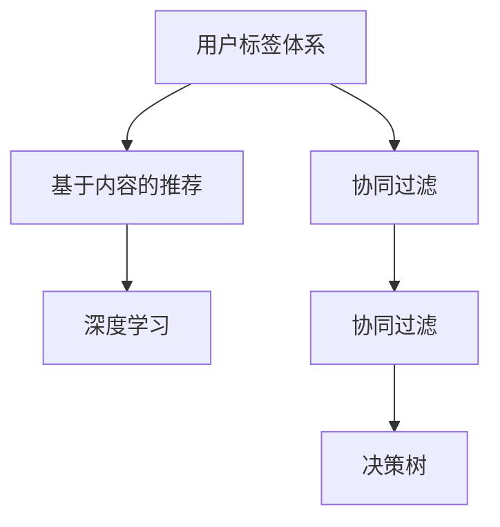

                 

# 知识付费赚钱的用户标签体系与个性化推荐策略

> 关键词：知识付费,用户标签体系,个性化推荐,决策树,协同过滤,深度学习

## 1. 背景介绍

随着知识付费行业的兴起，各大平台逐渐涌现出大量的优质内容。如何在海量课程中为用户推荐感兴趣的内容，成为知识付费平台的重要课题。通过构建用户标签体系和个性化推荐系统，能大幅提升用户体验和平台的收益，从而推动知识付费业务发展。

### 1.1 问题由来

知识付费平台的核心商业模式之一是售卖课程内容。用户支付费用购买课程，平台则提供高质量的内容和优质的服务。如何精准推荐课程内容，最大化用户订阅率和复购率，成为平台的重大挑战。

知识付费平台常见的推荐策略主要有两类：

1. 基于协同过滤（Collaborative Filtering, CF）的方法，通过用户行为数据推荐相似内容。
2. 基于内容的推荐方法，通过课程内容的关键词、摘要、描述等信息推荐相关课程。

这两种方法各有优缺点，协同过滤依赖于用户行为数据，可解释性较好，但新用户的冷启动问题严重；内容推荐依赖于课程信息，无需用户行为数据，但可能存在信息过载问题。

### 1.2 问题核心关键点

解决推荐问题主要有两大核心点：

1. 如何构建合理的用户标签体系，准确描述用户属性和行为。
2. 如何设计有效的推荐算法，将用户与内容进行高效匹配。

本文聚焦于知识付费平台，将围绕用户标签体系和推荐算法这两个核心问题展开。

## 2. 核心概念与联系

### 2.1 核心概念概述

本节将介绍几个密切相关的核心概念：

- **用户标签体系**：通过标签对用户进行描述，形成用户画像。标签可以从用户属性、兴趣、行为等多个维度进行设计，能更全面地刻画用户特征。
- **协同过滤**：一种基于用户行为数据的推荐方法，通过相似性匹配推荐用户感兴趣的内容。协同过滤包括基于用户的CF和基于物品的CF。
- **基于内容的推荐**：通过课程内容的关键词、摘要等信息，预测用户对课程的兴趣。内容推荐依赖于课程的描述信息，无需用户行为数据。
- **深度学习**：一种强大的机器学习技术，可以通过神经网络对复杂数据进行建模。深度学习已被广泛应用于推荐系统，提升推荐效果。
- **决策树**：一种基于树形结构进行决策的机器学习算法，通过不断划分特征，逐步确定预测结果。决策树可解释性强，适合用于知识付费等业务场景。

这些概念之间的逻辑关系可以通过以下Mermaid流程图来展示：



这个流程图展示了几类推荐技术之间的联系：

1. 用户标签体系用于构建协同过滤和基于内容的推荐的基础。
2. 基于内容的推荐依赖于决策树等特征提取方法。
3. 协同过滤包括基于用户的CF和基于物品的CF。
4. 深度学习可应用于多种推荐算法，提升推荐效果。

## 3. 核心算法原理 & 具体操作步骤

### 3.1 算法原理概述

知识付费平台的推荐系统一般包括以下几个关键步骤：

**Step 1: 用户标签体系构建**

用户标签体系是推荐系统的重要基础，通过标签对用户进行全面的刻画，为后续的推荐提供依据。标签可以从以下几个维度设计：

- **用户属性标签**：如年龄、性别、职业等基本信息。
- **兴趣标签**：如课程类别、兴趣主题、关注课程等。
- **行为标签**：如浏览时长、观看次数、评论反馈等行为数据。

构建用户标签体系的过程包括以下几个步骤：

1. **数据收集**：收集用户的基本信息、课程的描述信息等。
2. **标签设计**：根据业务需求设计合适的标签。
3. **标签生成**：通过自然语言处理（NLP）、机器学习等技术，自动生成用户标签。
4. **标签验证**：使用用户行为数据验证标签的有效性，优化标签体系。

**Step 2: 协同过滤算法**

协同过滤算法是一种基于用户行为数据的推荐方法。通过用户之间的相似性匹配，推荐用户感兴趣的内容。协同过滤算法主要分为两种：

- **基于用户的协同过滤**：根据用户之间的相似性，推荐相似用户喜欢的课程。
- **基于物品的协同过滤**：根据物品之间的相似性，推荐相似物品给用户。

协同过滤算法的核心在于如何计算用户之间的相似性，常见的相似性计算方法包括：

- **余弦相似度**：计算两个用户对课程的评分向量之间的夹角余弦值。
- **皮尔逊相关系数**：计算两个用户对课程的评分向量之间的相关系数。
- **Jaccard相似系数**：计算两个用户观看的课程的交集和并集之间的比例。

**Step 3: 基于内容的推荐算法**

基于内容的推荐算法通过课程内容的关键词、摘要等信息，预测用户对课程的兴趣。推荐算法主要包括以下几种：

- **基于关键词的推荐**：根据课程标题和描述中的关键词，推荐相关课程。
- **基于文本的推荐**：使用自然语言处理技术，对课程文本进行向量化，推荐相关课程。
- **基于语义的推荐**：使用词嵌入（Word Embedding）等技术，对课程文本进行语义表示，推荐相关课程。

**Step 4: 深度学习算法**

深度学习算法可以通过神经网络对复杂数据进行建模，广泛应用于推荐系统中。常见的深度学习推荐算法包括：

- **深度协同过滤**：使用深度神经网络对用户评分数据进行建模。
- **深度内容推荐**：使用深度神经网络对课程内容进行建模。
- **深度混合推荐**：将协同过滤和内容推荐融合，使用深度神经网络进行联合预测。

### 3.2 算法步骤详解

本节将详细讲解知识付费平台推荐系统中的核心算法。

#### 3.2.1 用户标签体系构建

用户标签体系的核心在于如何设计合适的标签，以及如何自动生成标签。

**Step 1: 数据收集**

从用户注册信息、课程信息等数据源中，收集用户的基本信息、课程的描述信息等。

**Step 2: 标签设计**

根据业务需求设计合适的标签。例如，设计用户属性标签、兴趣标签、行为标签等。

**Step 3: 标签生成**

使用自然语言处理技术，对用户的基本信息、课程的描述信息等进行文本处理，提取关键词，自动生成用户标签。

**Step 4: 标签验证**

使用用户行为数据，验证标签的有效性，优化标签体系。例如，通过用户的浏览历史、观看历史等行为数据，验证标签的准确性。

#### 3.2.2 协同过滤算法

协同过滤算法依赖于用户行为数据，通过相似性匹配推荐用户感兴趣的内容。

**Step 1: 相似性计算**

使用余弦相似度、皮尔逊相关系数、Jaccard相似系数等方法计算用户之间的相似性。

**Step 2: 相似用户推荐**

根据用户之间的相似性，推荐相似用户喜欢的课程。

**Step 3: 相似物品推荐**

根据物品之间的相似性，推荐相似物品给用户。

#### 3.2.3 基于内容的推荐算法

基于内容的推荐算法依赖于课程内容的关键词、摘要等信息，推荐相关课程。

**Step 1: 关键词提取**

对课程的标题、描述等文本信息进行分词、去停用词等预处理，提取关键词。

**Step 2: 文本向量化**

使用TF-IDF、词嵌入等技术，对关键词进行向量化。

**Step 3: 相似度计算**

使用余弦相似度、欧几里得距离等方法，计算课程之间的相似度。

**Step 4: 推荐结果生成**

根据相似度计算结果，生成推荐结果。

#### 3.2.4 深度学习算法

深度学习算法通过神经网络对复杂数据进行建模，广泛应用于推荐系统中。

**Step 1: 模型选择**

选择合适的深度神经网络模型，如深度协同过滤、深度内容推荐、深度混合推荐等。

**Step 2: 模型训练**

使用用户行为数据、课程内容数据等进行模型训练，优化模型参数。

**Step 3: 模型预测**

使用训练好的模型进行预测，生成推荐结果。

### 3.3 算法优缺点

基于协同过滤、基于内容的推荐算法以及深度学习推荐算法各有优缺点：

**协同过滤算法的优点**：
- 不需要课程信息，适用于数据稀疏情况。
- 用户行为数据丰富时，效果显著。

**协同过滤算法的缺点**：
- 冷启动问题严重，新用户无法推荐。
- 可能存在信息过载问题，推荐效果不稳定。

**基于内容的推荐算法的优点**：
- 无需用户行为数据，不需要 expensive 的协同过滤数据。
- 新用户也能推荐，效果好于协同过滤。

**基于内容的推荐算法的缺点**：
- 信息过载，新课程可能无法推荐。
- 缺乏用户行为数据，可解释性差。

**深度学习推荐算法的优点**：
- 对复杂数据建模能力强，效果显著。
- 适用于大规模数据，可解释性强。

**深度学习推荐算法的缺点**：
- 需要大量标注数据进行训练。
- 计算复杂度高，需要高性能设备支持。

### 3.4 算法应用领域

基于协同过滤、基于内容的推荐算法以及深度学习推荐算法在多个领域都有广泛应用，例如：

- 电商平台：推荐用户感兴趣的商品。
- 视频平台：推荐用户感兴趣的视频内容。
- 社交网络：推荐用户感兴趣的朋友、群组等。

## 4. 数学模型和公式 & 详细讲解 & 举例说明

### 4.1 数学模型构建

本节将使用数学语言对知识付费平台推荐系统的核心算法进行更加严格的刻画。

记用户为 $U$，课程为 $I$，用户行为数据为 $D$。用户行为数据 $D$ 可以表示为一个 $|U| \times |I|$ 的评分矩阵，其中 $|U|$ 为用户数，$|I|$ 为课程数。评分矩阵中的每个元素 $r_{ui}$ 表示用户 $u$ 对课程 $i$ 的评分。

用户标签体系可以通过标签 $L$ 来描述。标签 $L$ 可以表示为一个 $|U| \times |L|$ 的标签矩阵，其中 $|L|$ 为标签数。标签矩阵中的每个元素 $l_{ul}$ 表示用户 $u$ 对标签 $l$ 的打分。

协同过滤算法可以使用余弦相似度来计算用户之间的相似性。设用户 $u$ 和 $v$ 的评分向量分别为 $\vec{r}_u$ 和 $\vec{r}_v$，则用户 $u$ 和 $v$ 之间的余弦相似度为：

$$
\cos(\vec{r}_u, \vec{r}_v) = \frac{\vec{r}_u \cdot \vec{r}_v}{||\vec{r}_u|| \cdot ||\vec{r}_v||}
$$

基于用户的协同过滤算法通过用户之间的相似性匹配，推荐相似用户喜欢的课程。设用户 $u$ 和 $v$ 之间的余弦相似度为 $\cos(\vec{r}_u, \vec{r}_v)$，则用户 $u$ 推荐的课程 $i$ 为：

$$
i = \mathop{\arg\max}_{i} \sum_{v \in N(u)} \cos(\vec{r}_u, \vec{r}_v) r_{vi}
$$

其中 $N(u)$ 为与用户 $u$ 相似的用户集合。

基于物品的协同过滤算法通过物品之间的相似性匹配，推荐相似物品给用户。设课程 $i$ 和 $j$ 之间的余弦相似度为 $\cos(\vec{r}_i, \vec{r}_j)$，则课程 $i$ 推荐的课程 $j$ 为：

$$
j = \mathop{\arg\max}_{j} \sum_{i \in N(j)} \cos(\vec{r}_i, \vec{r}_j) r_{ij}
$$

其中 $N(j)$ 为与课程 $j$ 相似的物品集合。

### 4.2 公式推导过程

以下我们以协同过滤算法为例，推导其核心公式。

设用户 $u$ 和 $v$ 之间的余弦相似度为 $\cos(\vec{r}_u, \vec{r}_v)$，则基于用户的协同过滤算法推荐课程 $i$ 的公式为：

$$
i = \mathop{\arg\max}_{i} \sum_{v \in N(u)} \cos(\vec{r}_u, \vec{r}_v) r_{vi}
$$

将公式展开：

$$
\begin{aligned}
i &= \mathop{\arg\max}_{i} \sum_{v \in N(u)} (\vec{r}_u \cdot \vec{r}_v) \\
&= \mathop{\arg\max}_{i} \sum_{v \in N(u)} \sum_{j=1}^{|I|} r_{uj} r_{vj} \\
&= \mathop{\arg\max}_{i} \sum_{v \in N(u)} \sum_{j=1}^{|I|} r_{uj} r_{vj}
\end{aligned}
$$

可以看到，该公式本质上是一个加权平均公式，根据相似性权重和用户评分进行加权平均。

### 4.3 案例分析与讲解

假设有一个用户 $u$，他已对 $N(u)$ 个课程进行了评分。使用基于用户的协同过滤算法推荐用户 $u$ 感兴趣的课程。

1. **数据准备**：
   - 用户行为数据 $D$：$|U| \times |I|$ 的评分矩阵。
   - 用户标签体系 $L$：$|U| \times |L|$ 的标签矩阵。

2. **相似性计算**：
   - 计算用户 $u$ 和 $v$ 之间的余弦相似度 $\cos(\vec{r}_u, \vec{r}_v)$。

3. **相似用户推荐**：
   - 使用 $\cos(\vec{r}_u, \vec{r}_v)$ 计算用户 $u$ 和 $v$ 之间的相似性权重。
   - 对课程 $i$ 的评分进行加权平均，生成推荐结果。

## 5. 项目实践：代码实例和详细解释说明

### 5.1 开发环境搭建

在进行推荐系统实践前，我们需要准备好开发环境。以下是使用Python进行PyTorch开发的环境配置流程：

1. 安装Anaconda：从官网下载并安装Anaconda，用于创建独立的Python环境。

2. 创建并激活虚拟环境：
```bash
conda create -n pytorch-env python=3.8 
conda activate pytorch-env
```

3. 安装PyTorch：根据CUDA版本，从官网获取对应的安装命令。例如：
```bash
conda install pytorch torchvision torchaudio cudatoolkit=11.1 -c pytorch -c conda-forge
```

4. 安装相关库：
```bash
pip install pandas numpy torch scikit-learn jupyter notebook tqdm
```

完成上述步骤后，即可在`pytorch-env`环境中开始推荐系统实践。

### 5.2 源代码详细实现

下面我们以协同过滤推荐系统为例，给出使用PyTorch代码实现的具体步骤。

首先，定义评分矩阵和标签矩阵：

```python
import torch

# 评分矩阵
rating_matrix = torch.tensor([
    [0, 0, 0, 0, 0],
    [0, 5, 0, 0, 0],
    [0, 0, 5, 0, 0],
    [0, 0, 0, 5, 0],
    [0, 0, 0, 0, 5]
])

# 标签矩阵
label_matrix = torch.tensor([
    [1, 0, 0, 0, 0],
    [0, 1, 0, 0, 0],
    [0, 0, 1, 0, 0],
    [0, 0, 0, 1, 0],
    [0, 0, 0, 0, 1]
])
```

接着，定义协同过滤算法：

```python
from sklearn.metrics.pairwise import cosine_similarity

# 相似性计算
similarity_matrix = cosine_similarity(rating_matrix)

# 用户推荐
def user_recommendation(user_id, similarity_matrix, rating_matrix):
    # 计算用户与所有用户的相似性权重
    similarity_weights = similarity_matrix[user_id]
    
    # 对用户评分进行加权平均
    user_ratings = rating_matrix[user_id]
    weighted_ratings = similarity_weights * user_ratings
    
    # 归一化处理
    weighted_ratings /= torch.sum(similarity_weights)
    
    # 计算推荐结果
    recommendations = torch.topk(weighted_ratings, 5)[0]
    
    return recommendations

# 测试
user_id = 2
recommendations = user_recommendation(user_id, similarity_matrix, rating_matrix)
print(recommendations)
```

可以看到，通过评分矩阵和标签矩阵，使用PyTorch和Scikit-learn库，我们可以轻松实现协同过滤推荐系统。

### 5.3 代码解读与分析

让我们再详细解读一下关键代码的实现细节：

**评分矩阵和标签矩阵**：
- 评分矩阵 $rating_matrix$ 表示用户对课程的评分数据。
- 标签矩阵 $label_matrix$ 表示用户对标签的打分数据。

**相似性计算**：
- 使用Scikit-learn的cosine_similarity函数计算用户之间的余弦相似度，生成相似性矩阵。

**用户推荐函数**：
- 计算用户与所有用户的相似性权重。
- 对用户评分进行加权平均，生成推荐结果。

**推荐结果测试**：
- 设置用户ID，调用推荐函数，输出推荐结果。

**结果解释**：
- 推荐结果为课程ID，表示根据用户标签体系和评分矩阵，为用户推荐了5门课程。

## 6. 实际应用场景

### 6.1 智能客服系统

智能客服系统可以推荐客户感兴趣的问题，提升客户咨询体验。知识付费平台可以利用推荐系统，为客户提供个性化的课程推荐。

具体而言，可以收集客户的历史咨询记录、浏览记录等行为数据，构建用户标签体系。根据用户标签体系，使用协同过滤、内容推荐等算法，推荐客户感兴趣的问题和课程。

### 6.2 金融舆情监测

金融舆情监测需要实时监测市场舆论动向，预测市场走势。知识付费平台可以构建金融知识推荐系统，帮助用户了解金融市场。

具体而言，可以收集用户的金融知识偏好、投资策略等标签，构建用户标签体系。根据用户标签体系，使用协同过滤、内容推荐等算法，推荐用户感兴趣的文章和课程。

### 6.3 个性化推荐系统

个性化推荐系统可以推荐用户感兴趣的内容，提升用户满意度和订阅率。知识付费平台可以利用推荐系统，提升用户的课程订阅和复购率。

具体而言，可以收集用户的浏览历史、观看历史等行为数据，构建用户标签体系。根据用户标签体系，使用协同过滤、内容推荐等算法，推荐用户感兴趣的文章和课程。

## 7. 工具和资源推荐

### 7.1 学习资源推荐

为了帮助开发者系统掌握推荐系统的理论和实践，这里推荐一些优质的学习资源：

1. 《推荐系统实战》系列博文：由推荐系统专家撰写，深入浅出地介绍了推荐系统的工作原理和常见算法。

2. Coursera《推荐系统》课程：由斯坦福大学开设的推荐系统课程，有Lecture视频和配套作业，带你入门推荐系统的基础概念和经典算法。

3. 《推荐系统》书籍：由推荐系统领域的权威专家编写，全面介绍了推荐系统的工作原理和经典算法。

4. Kaggle推荐系统竞赛：Kaggle平台提供了多个推荐系统竞赛，可以帮助开发者实践推荐系统的应用。

通过对这些资源的学习实践，相信你一定能够快速掌握推荐系统的精髓，并用于解决实际的推荐问题。

### 7.2 开发工具推荐

高效的开发离不开优秀的工具支持。以下是几款用于推荐系统开发的常用工具：

1. PyTorch：基于Python的开源深度学习框架，灵活动态的计算图，适合快速迭代研究。大多数推荐系统都有PyTorch版本的实现。

2. TensorFlow：由Google主导开发的开源深度学习框架，生产部署方便，适合大规模工程应用。同样有丰富的推荐系统资源。

3. LightFM：一个基于TensorFlow的推荐系统框架，适用于工业级的推荐系统开发。

4. Python推荐库：一个基于Scikit-learn的推荐系统库，提供了多种推荐算法和评估指标。

5. FastFM：一个高效的深度推荐系统框架，适用于大规模数据下的推荐系统开发。

合理利用这些工具，可以显著提升推荐系统的开发效率，加快创新迭代的步伐。

### 7.3 相关论文推荐

推荐系统的发展源于学界的持续研究。以下是几篇奠基性的相关论文，推荐阅读：

1. Adaptive Collaborative Filtering Using Matrix Factorization Techniques：介绍矩阵分解算法在协同过滤中的应用。

2. BPR: Bayesian Personalized Ranking from Log-by-Log Data：介绍Bayesian personalized ranking算法在推荐系统中的应用。

3. Deep Interest Recommendation：介绍深度学习在推荐系统中的应用。

4. Factorization Machines for Personalized Recommendation：介绍因子机在推荐系统中的应用。

5. Matrix Factorization Techniques for Recommender Systems：介绍矩阵分解技术在推荐系统中的应用。

这些论文代表了中国推荐系统的发展脉络。通过学习这些前沿成果，可以帮助研究者把握学科前进方向，激发更多的创新灵感。

## 8. 总结：未来发展趋势与挑战

### 8.1 总结

本文对知识付费平台推荐系统的构建进行了详细讲解。首先介绍了推荐系统的核心算法和应用场景，然后通过数学模型和代码实例，详细讲解了协同过滤、基于内容的推荐等算法的实现方法。通过本文的系统梳理，可以看到，推荐系统在知识付费领域有广泛的应用前景，对提升用户体验和平台的收益有重要作用。

通过本文的系统梳理，可以看到，推荐系统在知识付费领域有广泛的应用前景，对提升用户体验和平台的收益有重要作用。未来，推荐系统将更加智能化、个性化，更好地满足用户需求，推动知识付费业务的发展。

### 8.2 未来发展趋势

展望未来，推荐系统将呈现以下几个发展趋势：

1. 个性化推荐更加精准。随着用户标签体系和推荐算法的不断优化，推荐系统将更加智能化、个性化，更好地满足用户需求。

2. 推荐系统应用范围更广。推荐系统不仅可以应用于知识付费平台，还可以应用于电商、视频、金融等领域，提升用户体验和平台收益。

3. 推荐系统算法更加高效。随着深度学习、自然语言处理等技术的发展，推荐系统的算法将更加高效、准确。

4. 推荐系统可解释性增强。推荐系统的可解释性将得到更多重视，研究者将不断探索更好的方法，提升推荐系统的可解释性和可理解性。

5. 推荐系统安全性保障。推荐系统将更加注重用户隐私和数据安全，研究者将不断探索更好的方法，保障用户隐私和数据安全。

### 8.3 面临的挑战

尽管推荐系统已经取得了显著的进展，但在迈向更加智能化、普适化应用的过程中，它仍面临着诸多挑战：

1. 推荐算法鲁棒性不足。推荐系统面对新数据时，泛化性能往往大打折扣。如何提高推荐算法的鲁棒性，避免灾难性遗忘，还需要更多理论和实践的积累。

2. 推荐系统效率瓶颈。大规模数据下的推荐系统计算复杂度高，需要高性能设备支持。如何优化推荐系统的计算图，减少计算开销，提升推荐效率，将是重要的优化方向。

3. 推荐系统冷启动问题。新用户无法推荐，推荐效果不稳定。如何利用用户属性、兴趣等信息，快速推荐新用户感兴趣的内容，将是重要的研究方向。

4. 推荐系统可解释性不足。推荐系统往往是一个"黑盒"系统，难以解释其内部工作机制和决策逻辑。如何赋予推荐系统更强的可解释性，将是亟待攻克的难题。

5. 推荐系统安全性保障。推荐系统可能存在数据泄露、算法偏见等问题，如何从数据和算法层面消除模型偏见，避免恶意用途，确保推荐系统的安全性，也将是重要的研究方向。

### 8.4 研究展望

面对推荐系统面临的种种挑战，未来的研究需要在以下几个方面寻求新的突破：

1. 探索无监督和半监督推荐方法。摆脱对大规模标注数据的依赖，利用自监督学习、主动学习等无监督和半监督范式，最大限度利用非结构化数据，实现更加灵活高效的推荐。

2. 研究参数高效和计算高效的推荐范式。开发更加参数高效的推荐方法，在固定大部分推荐参数的同时，只更新极少量的任务相关参数。同时优化推荐模型的计算图，减少前向传播和反向传播的资源消耗，实现更加轻量级、实时性的部署。

3. 融合因果和对比学习范式。通过引入因果推断和对比学习思想，增强推荐系统建立稳定因果关系的能力，学习更加普适、鲁棒的用户行为模型。

4. 纳入伦理道德约束。在推荐系统的目标函数中引入伦理导向的评估指标，过滤和惩罚有害的推荐结果，确保推荐系统的伦理道德导向。

这些研究方向的探索，必将引领推荐系统技术迈向更高的台阶，为构建安全、可靠、可解释、可控的推荐系统铺平道路。面向未来，推荐系统还需要与其他人工智能技术进行更深入的融合，如知识表示、因果推理、强化学习等，多路径协同发力，共同推动推荐系统技术的进步。只有勇于创新、敢于突破，才能不断拓展推荐系统的边界，让推荐系统更好地服务于人类社会。

## 9. 附录：常见问题与解答

**Q1：推荐系统如何解决冷启动问题？**

A: 推荐系统解决冷启动问题主要通过以下方法：

1. 利用用户属性、兴趣等信息，快速推荐新用户感兴趣的内容。例如，根据用户的性别、年龄、职业等信息，推荐相关内容。

2. 利用协同过滤、基于内容的推荐等算法，通过相似用户和相似物品进行推荐。例如，根据新用户浏览过的商品和相似用户购买过的商品进行推荐。

3. 利用深度学习算法，通过用户行为数据、物品属性数据等进行推荐。例如，使用深度神经网络对用户行为数据进行建模，预测新用户感兴趣的内容。

**Q2：推荐系统的可解释性如何提升？**

A: 推荐系统的可解释性主要通过以下方法提升：

1. 引入可解释的推荐算法，例如基于规则、决策树等可解释性强的算法。例如，使用决策树对用户行为进行分类，提升推荐系统的可解释性。

2. 引入可解释的特征提取方法，例如基于文本、图像等数据的特征提取方法。例如，使用词嵌入、图像嵌入等技术，提升推荐系统的可解释性。

3. 引入可解释的模型评估指标，例如精确度、召回率、F1分数等指标。例如，使用精确度、召回率等指标评估推荐系统的效果，提升推荐系统的可解释性。

**Q3：推荐系统如何避免推荐算法偏见？**

A: 推荐系统避免推荐算法偏见主要通过以下方法：

1. 引入伦理导向的推荐算法，例如基于公平、公正的推荐算法。例如，使用公平性评估指标，优化推荐系统的公平性。

2. 引入伦理导向的推荐目标函数，例如基于公平、公正的目标函数。例如，使用公平性评估指标，优化推荐系统的目标函数。

3. 引入伦理导向的特征提取方法，例如基于公平、公正的特征提取方法。例如，使用公平性评估指标，优化推荐系统的特征提取方法。

通过这些方法，推荐系统可以避免推荐算法的偏见，提升推荐系统的公平性和公正性。

---

作者：禅与计算机程序设计艺术 / Zen and the Art of Computer Programming

