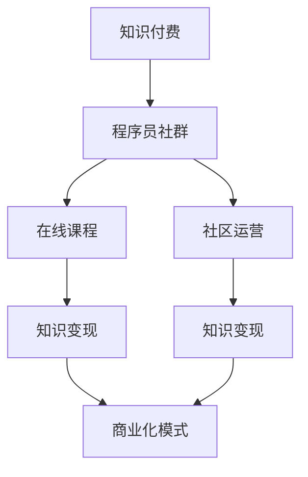

                 

# 知识付费：程序员的社群变现

> 关键词：知识付费, 程序员社群, 社群变现, 在线课程, 社区运营, 商业化模式

## 1. 背景介绍

### 1.1 问题由来

近年来，随着互联网技术的发展和教育水平的提高，人们对知识的渴求愈发强烈。在知识付费的大潮下，越来越多的人开始通过在线学习、课程订阅、付费问答等方式获取知识。而程序员作为一个具备高技术含量的职业群体，其知识分享与获取需求尤为突出。这不仅提升了程序员自身的竞争力，也推动了科技知识的普及和传播。

### 1.2 问题核心关键点

程序员社群的知识变现，是指程序员群体如何通过社群平台，分享其专业知识和经验，从中获得经济回报的过程。这不仅仅是知识传播的问题，更是一种商业模式的探索，涉及到技术、商业、运营等多个层面。

### 1.3 问题研究意义

研究程序员社群的知识变现模式，对于推动技术知识的下沉和传播、提升程序员的职业技能和市场价值、探索知识变现的商业模式、加速科技教育的产业化进程具有重要意义：

1. **推动技术知识下沉**：通过知识付费，程序员可以将高精尖的技术知识更广泛地传播给行业内的初学者，降低技术学习的门槛，加速技术知识的普及。
2. **提升职业价值**：知识变现可以激励程序员不断提升自己的专业技能，拓展知识面，从而提升其市场竞争力。
3. **探索商业模式**：知识付费平台为程序员提供了新的收入渠道，激发了社群成员的创业热情，推动了技术教育市场的发展。
4. **加速产业化**：知识付费模式促使科技教育由传统线下转移到线上，为技术知识的传播和应用提供了新的平台和渠道。

## 2. 核心概念与联系

### 2.1 核心概念概述

为更好地理解程序员社群的知识变现模式，本节将介绍几个关键概念：

- **知识付费**：通过订阅、付费问答等方式，消费者为获取知识资源支付费用的模式。
- **程序员社群**：由具有相同职业身份、技术背景、兴趣爱好的程序员组成的交流平台。
- **知识变现**：将专业知识、经验技能转化为经济收入的过程。
- **在线课程**：通过视频、图文、直播等形式，在线分享系统性知识的教学方式。
- **社区运营**：通过管理、维护社群环境，吸引成员参与，增强用户粘性的过程。
- **商业化模式**：将社群知识分享与市场运作结合，实现商业模式可持续发展的策略。

这些概念之间的逻辑关系可以通过以下Mermaid流程图来展示：



这个流程图展示了几类关键概念及其之间的关系：

1. **知识付费与程序员社群**：知识付费为程序员社群提供了变现的途径。
2. **在线课程与知识变现**：在线课程是知识变现的重要方式之一。
3. **社区运营与知识变现**：有效的社区运营可以提升知识变现的效率和质量。
4. **商业化模式**：商业化模式是知识变现的终极目标。

## 3. 核心算法原理 & 具体操作步骤

### 3.1 算法原理概述

程序员社群的知识变现，本质上是一种基于内容的商业模式。其核心思想是，通过系统性地分享和传播编程知识和技能，为社群成员提供有价值的学习资源和经验，从而获得经济回报。

形式化地，假设有一个程序员社群 $G$，社区内有 $N$ 名成员，每位成员具有特定的专业技能和经验。社区通过在线课程、技术讨论、案例分析等方式，向会员提供知识服务。社区的运营者 $M$ 负责课程开发、内容维护、会员管理等工作。知识变现的过程可以表示为：

$$
\text{收入} = f(\text{会员数} \times \text{课程价格} \times \text{课程质量} \times \text{运营效率})
$$

其中 $f$ 表示收入函数，各参数的具体值由社区运营者决定。

### 3.2 算法步骤详解

程序员社群的知识变现主要包括以下几个关键步骤：

**Step 1: 确定知识服务内容**

- 根据社区成员的兴趣和技术需求，确定知识服务的核心内容，如编程语言、框架、工具、算法等。
- 设计课程大纲，明确课程目标、教学内容、考核标准等。
- 选择合适的技术平台（如Coursera、Udemy、Bilibili等）进行课程发布。

**Step 2: 进行课程开发和推广**

- 招募具备相应技术能力的开发者进行课程开发，确保课程的实用性和可操作性。
- 利用社区资源，通过社交媒体、邮件、论坛等方式推广课程，吸引潜在学员。
- 提供课程试听、试学等优惠活动，降低学员的决策门槛。

**Step 3: 运营和维护社群**

- 定期更新课程内容，确保知识的最新性。
- 建立社群交流平台，如论坛、微信群、QQ群等，鼓励会员互动，分享经验。
- 收集会员反馈，不断改进课程和运营策略。

**Step 4: 收费与分成**

- 根据课程难度、内容深度和市场定价，设置合理的课程价格。
- 对课程销售收入进行分配，可以采用平台抽成、课程开发者分成、社区运营者收益等不同模式。
- 设置会员权益，如免费课程、专属答疑、优先参与新课等，增加会员粘性。

### 3.3 算法优缺点

程序员社群的知识变现模式具有以下优点：

1. **高效传播**：在线课程和社区平台可以快速传播知识，覆盖面广，效率高。
2. **灵活性高**：课程内容可以根据市场需求和会员反馈进行灵活调整，快速迭代。
3. **收益直接**：知识付费模式使得收入与课程质量直接挂钩，激励开发者持续提升课程质量。
4. **会员粘性强**：通过社群运营增强会员归属感，形成稳定的用户群体。

同时，该模式也存在一些局限性：

1. **门槛较高**：对于课程开发者和运营者的技术和管理能力要求较高。
2. **平台依赖性强**：过度依赖第三方平台可能影响收益分成和运营效率。
3. **市场竞争激烈**：知识付费市场竞争激烈，课程内容需不断创新才能脱颖而出。
4. **版权问题**：课程内容涉及大量代码和技术方案，版权保护需予以重视。
5. **质量控制难**：在线课程质量参差不齐，需要建立有效的质量控制机制。

尽管存在这些局限性，但就目前而言，知识变现模式已成为程序员社群的重要发展方向。未来相关研究的重点在于如何进一步降低运营门槛，提高课程质量，构建完善的版权保护机制，以及探索更多元化的盈利模式。

### 3.4 算法应用领域

程序员社群的知识变现模式，已在多个领域得到了成功应用：

- **技术培训**：如Java编程、前端开发、人工智能等课程的在线教学。
- **项目咨询**：提供技术方案、项目开发、问题解决等服务，收取咨询费用。
- **产品研发**：为初创公司提供技术支持，解决产品开发中的难题。
- **社区支持**：通过社区广告、赞助、会员费等方式获得收入，支持社群的持续运营。
- **职业转型**：为职业转型者提供系统的学习路径，提升其在新的职业领域中的竞争力。

除了上述这些经典应用外，知识变现模式还被创新性地应用于更多场景中，如技术讲座、技术书籍、技术博客等，为程序员提供更多元化的知识服务。

## 4. 数学模型和公式 & 详细讲解 & 举例说明

### 4.1 数学模型构建

本节将使用数学语言对程序员社群的知识变现过程进行更加严格的刻画。

假设程序员社群 $G$ 有 $N$ 名会员，课程价格为 $P$，课程数量为 $K$，课程平均质量为 $Q$，社区运营效率为 $E$。则知识变现的收入模型可以表示为：

$$
I = N \times P \times Q \times E
$$

其中 $I$ 表示总收入，$N$ 表示会员数，$P$ 表示课程价格，$Q$ 表示课程质量，$E$ 表示运营效率。

### 4.2 公式推导过程

以下我们以技术培训课程为例，推导知识变现的收入公式。

假设社区内共有 $N$ 名会员，每位会员订阅了一门价格为 $P$ 的课程，课程质量为 $Q$，运营效率为 $E$。则课程总收入为：

$$
I = N \times P
$$

课程质量 $Q$ 可以通过学员的评价和反馈得到，通常用满意度评分来表示。运营效率 $E$ 可以通过社区的活跃度、课程更新频率、学员参与度等指标来衡量。

将公式 $I = N \times P \times Q \times E$ 展开，可以得到：

$$
I = N \times P \times \frac{\sum_{i=1}^{K}R_i}{K} \times \frac{\sum_{i=1}^{T}A_i}{T}
$$

其中 $R_i$ 表示第 $i$ 门课程的满意度评分，$A_i$ 表示第 $i$ 门课程的活跃度评分，$T$ 表示课程总数。

### 4.3 案例分析与讲解

某程序员社群有 100 名会员，每名会员订阅了一门价格为 99 元的Java编程课程，课程质量评分为 4.5（满分 5），运营效率评分为 4.2（满分 5）。则该社群的知识变现收入为：

$$
I = 100 \times 99 \times 4.5 \times 4.2 \approx 169920
$$

即每月知识变现收入约为 16.99 万元。

## 5. 项目实践：代码实例和详细解释说明

### 5.1 开发环境搭建

在进行知识变现实践前，我们需要准备好开发环境。以下是使用Python进行Django开发的Web应用环境配置流程：

1. 安装Python：从官网下载并安装Python，确保版本为3.7以上。
2. 安装Django：通过pip安装Django，并创建一个新项目。
3. 安装Flask：通过pip安装Flask，用于开发API接口。
4. 安装第三方库：安装相关库，如SQLAlchemy、Jinja2、Gunicorn等。

完成上述步骤后，即可在项目环境中开始知识变现平台的开发。

### 5.2 源代码详细实现

以下是使用Django和Flask开发知识变现平台的核心代码实现。

**models.py**

```python
from django.db import models
from django.contrib.auth.models import User

class Member(models.Model):
    user = models.OneToOneField(User, on_delete=models.CASCADE)
    name = models.CharField(max_length=50)
    email = models.EmailField(unique=True)
    subscription_status = models.BooleanField(default=False)
    subscription_price = models.DecimalField(max_digits=10, decimal_places=2)

class Course(models.Model):
    name = models.CharField(max_length=100)
    description = models.TextField()
    price = models.DecimalField(max_digits=10, decimal_places=2)
    created_at = models.DateTimeField(auto_now_add=True)
    updated_at = models.DateTimeField(auto_now=True)
    enrolled_members = models.ManyToManyField(Member, related_name='courses')
```

**views.py**

```python
from django.shortcuts import render, redirect
from django.http import HttpResponse
from .models import Member, Course

def home(request):
    members = Member.objects.all()
    courses = Course.objects.all()
    return render(request, 'home.html', {'members': members, 'courses': courses})

def enroll(request, course_id):
    course = Course.objects.get(id=course_id)
    member = request.user.member
    if member.subscription_status:
        enroll_info = {'status': 'enrolled', 'price': course.price}
    else:
        enroll_info = {'status': 'not_enrolled', 'price': course.price}
    return render(request, 'enroll.html', {'enroll_info': enroll_info})

def enroll_success(request, course_id):
    course = Course.objects.get(id=course_id)
    member = request.user.member
    member.enrolled_members.add(course)
    return redirect('home')
```

**urls.py**

```python
from django.urls import path
from . import views

urlpatterns = [
    path('', views.home, name='home'),
    path('courses/<int:course_id>/enroll', views.enroll, name='enroll'),
    path('courses/<int:course_id>/enroll/success', views.enroll_success, name='enroll_success'),
]
```

**home.html**

```html
<h1>Welcome to the Knowledge Sharing Community!</h1>
<ul>

    <li>{{ member.name }} has {{ member.subscription_status }} with price {{ member.subscription_price }}</li>

</ul>
<h2>Courses Available</h2>
<ul>

    <li>{{ course.name }} - Price: {{ course.price }}</li>
    <a href="">Enroll</a>

</ul>
```

**enroll.html**

```html
<h1>Enroll in {{ course.name }} - Price: {{ course.price }}</h1>
<p>Enrollment Status: {{ enroll_info['status'] }}</p>
<p>Enrollment Price: {{ enroll_info['price'] }}</p>
```

**enroll_success.html**

```html
<h1>Enrollment Successful!</h1>
<p>You have enrolled in {{ course.name }}</p>
<a href="">Go Back</a>
```

**settings.py**

```python
DATABASES = {
    'default': {
        'ENGINE': 'django.db.backends.sqlite3',
        'NAME': BASE_DIR / 'db.sqlite3',
    }
}
```

通过上述代码，可以实现基本的知识变现功能，包括会员注册、课程订阅、课程查看等。

### 5.3 代码解读与分析

**models.py**

- `Member` 模型：表示社区成员，关联用户模型，记录会员姓名、邮箱、订阅状态和订阅价格。
- `Course` 模型：表示课程，记录课程名称、描述、价格等基本信息，以及与会员的关联关系。

**views.py**

- `home` 函数：显示所有会员和课程信息，供管理员查看。
- `enroll` 函数：显示课程详情页面，供会员选择是否订阅。
- `enroll_success` 函数：处理订阅成功后的重定向，更新会员订阅状态。

**urls.py**

- 定义了 home、enroll、enroll_success 三个路由。

**home.html**

- 显示所有会员和课程信息，供管理员查看。

**enroll.html**

- 显示课程详情页面，供会员选择是否订阅。

**enroll_success.html**

- 处理订阅成功后的重定向，更新会员订阅状态。

**settings.py**

- Django项目的配置文件，定义数据库连接信息。

## 6. 实际应用场景

### 6.1 程序员社群的建立

建立程序员社群的第一步是确定社群的目标和定位。根据社区成员的技术背景和需求，选择合适的领域进行聚焦。例如，可以聚焦于特定编程语言、框架、技术栈等。

### 6.2 课程设计与开发

课程设计与开发是知识变现的关键环节。课程内容需要具备实用性和可操作性，能够真正解决会员的技术问题。课程设计可以从以下几个方面考虑：

- **课程结构**：分为理论讲解和实践练习两部分，确保学员能够系统地掌握知识。
- **案例分析**：结合实际项目案例，展示课程内容的实际应用场景。
- **互动交流**：设置论坛、微信群等交流平台，鼓励会员讨论、提问和分享。
- **作业与测试**：设计作业和测试题目，检验学员的学习效果。

### 6.3 社群运营

社群运营是知识变现的重要环节，需要从以下几个方面进行：

- **活动策划**：定期举办技术分享、项目案例分析等活动，增加会员的参与感和互动性。
- **内容更新**：定期更新课程内容和社群资源，确保知识的最新性和适用性。
- **用户管理**：通过积分、会员等级等方式，激励会员积极参与社群活动。
- **广告推广**：通过社交媒体、搜索引擎等渠道，宣传社群和课程，吸引更多潜在会员。

## 7. 工具和资源推荐

### 7.1 学习资源推荐

为了帮助开发者系统掌握知识变现的理论基础和实践技巧，这里推荐一些优质的学习资源：

1. **《知识变现：程序员社群经营指南》**：全面介绍知识变现模式，包括课程设计、社群运营、商业模式等各个方面，是入门的经典教材。
2. **Coursera和Udemy课程**：两大知识付费平台提供大量高质量课程，涵盖编程、人工智能、数据科学等多个领域，是学习和分享知识的优质资源。
3. **Kaggle竞赛**：通过参与编程竞赛，积累实战经验，提升技术能力。Kaggle社区也提供了丰富的数据集和模型，供开发者学习和分享。
4. **GitHub开源项目**：通过阅读和贡献开源项目，学习编程技术和项目管理经验，提升自身价值。

通过学习这些资源，相信你一定能够快速掌握知识变现的精髓，并用于解决实际的社区运营问题。

### 7.2 开发工具推荐

高效的开发离不开优秀的工具支持。以下是几款用于知识变现开发的常用工具：

1. **Django和Flask**：Django是一个全功能的Web框架，适合快速开发Web应用；Flask则是一个轻量级的Web框架，适合构建API接口。
2. **GitHub和GitLab**：提供代码托管和协作功能，方便开发者版本控制和团队协作。
3. **Docker和Kubernetes**：通过容器化技术，确保应用的稳定性和可移植性，方便部署和管理。
4. **Jupyter Notebook**：支持交互式编程和数据可视化，适合数据科学和机器学习项目开发。
5. **Visual Studio Code**：一个强大的IDE，支持多种编程语言和插件扩展，提高开发效率。

合理利用这些工具，可以显著提升知识变现任务的开发效率，加快创新迭代的步伐。

### 7.3 相关论文推荐

知识变现领域的研究涉及多个学科，以下是几篇奠基性的相关论文，推荐阅读：

1. **《知识变现模式的构建与优化》**：探讨了知识变现的商业模式、运营策略和效果评估方法。
2. **《程序员社群的社交网络和知识共享》**：通过社交网络分析，研究了程序员社群的知识共享行为和社区结构。
3. **《基于机器学习的知识推荐系统》**：研究了如何通过机器学习技术，为用户推荐合适的知识资源。
4. **《知识付费平台的用户行为分析》**：通过数据分析，揭示了用户行为对知识变现的影响和优化建议。

这些论文代表了大数据、社交网络、人工智能等领域对知识变现的研究方向，为构建知识变现平台提供了理论支持。

## 8. 总结：未来发展趋势与挑战

### 8.1 总结

本文对程序员社群的知识变现模式进行了全面系统的介绍。首先阐述了知识变现模式的研究背景和意义，明确了知识变现在拓展程序员社区影响、提升成员职业价值、探索商业化模式等方面的重要意义。其次，从原理到实践，详细讲解了知识变现的数学模型和操作步骤，给出了知识变现平台开发的完整代码实例。同时，本文还广泛探讨了知识变现模式在社群建立、课程设计与开发、社群运营等多个环节的应用前景，展示了知识变现范式的巨大潜力。此外，本文精选了知识变现技术的各类学习资源，力求为读者提供全方位的技术指引。

通过本文的系统梳理，可以看到，知识变现模式正在成为程序员社群的重要发展方向，极大地拓展了程序员社区的影响力，为科技教育市场带来了新的机遇。未来，伴随知识变现模式的持续演进，相信程序员社群的知识分享将更加广泛，技术教育也将更深入人心。

### 8.2 未来发展趋势

展望未来，知识变现模式将呈现以下几个发展趋势：

1. **课程内容多元化**：课程内容将更加丰富多样，涵盖编程、数据科学、人工智能等多个领域，满足不同成员的需求。
2. **运营方式数字化**：通过AI和大数据分析，优化课程推荐、会员管理等环节，提升运营效率。
3. **社区互动智能化**：利用自然语言处理技术，实现智能问答、内容推荐等，提高社区互动的智能化水平。
4. **知识变现全球化**：知识变现不再局限于本地市场，通过在线平台，向全球成员提供知识服务。
5. **跨界合作增强**：与其他技术、教育、媒体等领域的合作，拓展知识变现的市场空间。

以上趋势凸显了知识变现模式的广阔前景。这些方向的探索发展，必将进一步提升知识变现的商业价值和社会效益。

### 8.3 面临的挑战

尽管知识变现模式已经取得了初步成功，但在迈向更加智能化、普适化应用的过程中，它仍面临着诸多挑战：

1. **课程质量控制**：课程内容需要不断更新迭代，确保与最新技术同步，提高课程质量。
2. **用户黏性提升**：如何提高用户参与度和忠诚度，防止会员流失，是社群运营的重要课题。
3. **市场竞争加剧**：知识变现市场竞争激烈，需要不断创新课程和服务，才能吸引更多学员。
4. **技术门槛降低**：降低课程开发的门槛，使得更多人能够参与知识变现，需要技术和管理的持续优化。
5. **知识产权保护**：保护课程内容不被侵权，维护开发者和会员的合法权益，是知识变现中的重要问题。

尽管存在这些挑战，但知识变现模式仍是大数据、人工智能等技术落地应用的重要方向。未来相关研究的重点在于如何进一步降低运营成本，提高课程质量，增强社区互动，以及探索更多元化的盈利模式。

### 8.4 研究展望

面对知识变现所面临的种种挑战，未来的研究需要在以下几个方面寻求新的突破：

1. **课程内容个性化**：根据会员的学习历史和兴趣，推荐个性化的课程内容，提高学习效果。
2. **技术驱动运营**：引入AI和大数据分析技术，优化课程推荐、会员管理等运营环节，提升运营效率。
3. **社区互动智能化**：利用自然语言处理技术，实现智能问答、内容推荐等，提高社区互动的智能化水平。
4. **跨界合作拓展**：与其他技术、教育、媒体等领域的合作，拓展知识变现的市场空间。

这些研究方向的探索，必将引领知识变现技术迈向更高的台阶，为构建知识变现平台提供更多的理论支持和实践指导。面向未来，知识变现模式还需要与其他人工智能技术进行更深入的融合，如知识表示、因果推理、强化学习等，多路径协同发力，共同推动知识变现技术的进步。只有勇于创新、敢于突破，才能不断拓展知识变现的边界，让知识分享更好地服务于社会。

## 9. 附录：常见问题与解答

**Q1：知识变现的盈利模式有哪些？**

A: 知识变现的盈利模式主要包括以下几种：

1. **订阅制**：通过课程订阅，收取固定费用，提供持续的知识服务。
2. **按需购买**：学员根据自身需求，单独购买特定课程或内容，支付单次费用。
3. **会员制**：提供不同等级的会员服务，如高级会员、超级会员等，享受更多权益和优惠。
4. **广告分成**：通过社区广告和商业合作，收取广告费用，实现盈利。
5. **增值服务**：提供专家咨询、项目合作、技术支持等增值服务，获取额外收益。

不同的盈利模式需要根据社区特点和会员需求进行选择。

**Q2：如何提高知识变现社区的会员黏性？**

A: 提高知识变现社区的会员黏性，可以从以下几个方面进行：

1. **提供优质课程**：确保课程内容实用、新颖，满足会员的学习需求。
2. **加强社区互动**：建立论坛、微信群等交流平台，鼓励会员讨论、提问和分享。
3. **激励机制设计**：通过积分、会员等级等方式，激励会员积极参与社群活动。
4. **定期活动策划**：举办技术分享、项目案例分析等活动，增加会员的参与感和归属感。
5. **个性化推荐**：利用大数据和AI技术，为会员推荐个性化的课程和学习资源。

通过这些措施，可以提升会员的参与度和忠诚度，形成稳定的用户群体。

**Q3：知识变现社区的课程质量如何控制？**

A: 知识变现社区的课程质量控制，主要通过以下几个环节：

1. **课程开发者资质审核**：确保开发者具备相应的技术能力和教学经验。
2. **课程内容审查**：建立严格的课程内容审查机制，确保课程内容的正确性和实用性。
3. **学员反馈收集**：通过学员评价和反馈，了解课程效果，及时改进课程内容。
4. **质量评估指标**：引入满意度和完成率等评估指标，衡量课程质量。
5. **持续更新迭代**：定期更新课程内容和资料，保持课程内容的最新性。

通过这些措施，可以确保课程质量的高标准，提升知识变现社区的声誉和会员信任度。

**Q4：知识变现社区如何抵御市场竞争？**

A: 知识变现社区抵御市场竞争，可以从以下几个方面进行：

1. **差异化定位**：根据社区的特点和需求，选择差异化的知识服务领域，避免直接竞争。
2. **课程内容创新**：不断推出高质量、前沿的课程内容，满足会员的个性化需求。
3. **技术优势提升**：引入AI和大数据分析技术，优化课程推荐、会员管理等环节，提升运营效率。
4. **多元合作拓展**：与其他技术、教育、媒体等领域的合作，拓展知识变现的市场空间。
5. **品牌建设和推广**：通过社区建设和品牌推广，提升社区的知名度和吸引力。

通过这些措施，可以在竞争激烈的知识变现市场中保持领先地位，吸引更多的学员和合作伙伴。

**Q5：知识变现社区如何保护知识产权？**

A: 知识变现社区保护知识产权，主要通过以下几个方面：

1. **课程内容版权登记**：将课程内容进行版权登记，确保内容的原创性和权益保护。
2. **内容发布许可**：明确课程内容的发布许可，限制未经授权的复制和传播。
3. **反盗版技术应用**：采用技术手段，如水印、加密等，防止课程内容的非法复制。
4. **用户行为规范**：制定严格的社区行为规范，明确版权保护的条款和责任。
5. **法律援助和维权**：建立法律援助机制，为知识产权保护提供支持和保障。

通过这些措施，可以保护社区内课程内容的知识产权，维护开发者和会员的合法权益。

---

作者：禅与计算机程序设计艺术 / Zen and the Art of Computer Programming

