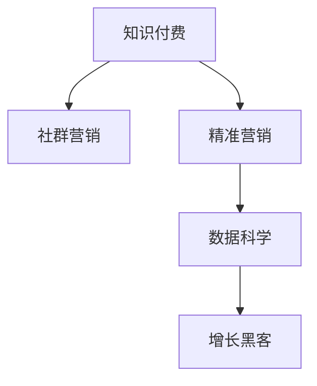

                 

# 知识付费：程序员的社群精准营销

> 关键词：知识付费,程序员,社群营销,精准营销,在线教育,数据科学,增长黑客,数据驱动,流量变现

## 1. 背景介绍

### 1.1 问题由来
在数字化转型和互联网技术的推动下，知识付费市场迎来了蓬勃发展的机遇。随着信息技术的发展，海量信息在线化、碎片化趋势愈发明显，人们越来越倾向于通过便捷的互联网方式获取知识、提升技能。而知识付费模式，正是以其高效率、低成本、精准化等特点，迅速在市场中获得了一席之地。

对于程序员这一群体而言，知识付费尤为有意义。程序员不仅面对着快速迭代的技术环境，还要不断学习新知识、掌握新技能，以保持竞争力。社群营销和精准营销，恰好能够帮助他们高效筛选信息、精准匹配资源、提升学习效率，从而更好地适应快速变化的市场环境。

### 1.2 问题核心关键点
知识付费的精粹在于其具备的精准性和高效性。知识付费平台通过大数据、人工智能等技术手段，能够对用户的行为、兴趣、需求进行精准分析，从而提供高度个性化和定制化的内容。

- **目标用户分析**：通过对用户行为数据的分析，识别不同用户群体的特征，为其提供符合其兴趣和需求的课程内容。
- **内容推荐算法**：基于用户行为数据和课程特征数据，构建推荐算法模型，实现课程的个性化推荐。
- **营销转化优化**：利用A/B测试、流量优化等手段，提升课程购买转化率，提高运营效率。
- **社群互动机制**：构建学习社群，鼓励用户互动交流，提升学习效果，增加用户粘性。

本文聚焦于基于知识付费模式，结合社群精准营销策略，探讨程序员如何高效学习、提升技能、变现流量。

## 2. 核心概念与联系

### 2.1 核心概念概述

为更好地理解程序员社群精准营销的机制，本节将介绍几个关键概念：

- **知识付费**：以在线形式，通过订阅、购买、捐赠等方式，提供高质量、有价值的内容服务，满足用户的学习需求。
- **社群营销**：以社群为载体，通过内容分享、讨论交流、在线活动等方式，提高用户参与度，增强社群粘性。
- **精准营销**：利用大数据、机器学习等技术手段，对用户行为进行精准分析，实现个性化推荐和营销转化。
- **数据科学**：利用数据收集、处理、分析等技术手段，挖掘数据背后的规律和价值，指导决策和运营。
- **增长黑客**：通过数据驱动、A/B测试、用户反馈等手段，快速迭代优化产品功能，实现流量和营收的快速增长。

这些核心概念之间的逻辑关系可以通过以下Mermaid流程图来展示：



这个流程图展示的知识付费与社群精准营销的核心概念及其之间的关系：

1. 知识付费以高质量的内容为支撑，满足用户的学习需求。
2. 社群营销通过互动交流，增强用户粘性，促进内容的传播和接受。
3. 精准营销通过数据分析，实现个性化推荐和营销转化。
4. 数据科学通过挖掘数据，发现用户行为背后的规律，指导精准营销。
5. 增长黑客通过数据驱动和快速迭代，提升平台的流量和营收。

这些概念共同构成了程序员知识付费和社群精准营销的框架，为其实现提供了方法和路径。

## 3. 核心算法原理 & 具体操作步骤
### 3.1 算法原理概述

程序员社群精准营销的核心在于，通过对用户行为数据的分析，识别不同用户群体的特征，为其提供符合其兴趣和需求的课程内容，从而实现高质量的内容匹配和精准的营销转化。

具体而言，其原理包括以下几个关键步骤：

1. **用户行为数据收集**：通过用户登录、学习、互动等行为数据，收集用户兴趣、偏好、学习进度等信息。
2. **用户特征分析**：对用户行为数据进行统计分析，识别用户群体的特征和标签。
3. **课程推荐模型构建**：基于用户特征和课程属性数据，构建个性化推荐模型。
4. **营销转化优化**：通过A/B测试等手段，优化营销策略，提高用户转化率和课程购买率。
5. **社群互动机制设计**：设计互动交流的机制，提升用户参与度和社群粘性。

### 3.2 算法步骤详解

下面，我们详细介绍每一个核心步骤的详细算法流程：

**步骤一：用户行为数据收集**

首先，需要搭建一套数据收集系统，用于收集和存储用户行为数据。具体实现流程如下：

1. **日志记录**：在用户登录、学习、互动等关键节点，记录用户行为数据，包括用户ID、行为类型、时间戳等。
2. **数据清洗**：对日志数据进行清洗，去除重复、异常数据，确保数据的准确性和完整性。
3. **数据存储**：将清洗后的数据存入数据库，如MySQL、MongoDB等。

**步骤二：用户特征分析**

用户特征分析是构建精准营销模型的基础，主要包括以下几个步骤：

1. **用户分群**：将用户行为数据聚类，识别出不同用户群体的特征。例如，根据用户的课程偏好、学习进度、互动频率等，将用户分成基础入门、进阶高级、深度研究等不同群体。
2. **用户标签生成**：为每个用户群体生成相应的标签，如“编程新手”、“数据科学爱好者”等，便于后续的个性化推荐和营销转化。

**步骤三：课程推荐模型构建**

课程推荐模型是精准营销的核心工具，通过将用户特征和课程属性数据输入模型，实现个性化课程推荐。主要实现步骤如下：

1. **特征工程**：提取用户特征和课程属性，如用户ID、课程ID、用户标签、课程名称、课程难度等。
2. **模型训练**：使用机器学习算法，如协同过滤、深度学习等，训练课程推荐模型。常用的算法包括矩阵分解、基于神经网络的推荐系统等。
3. **模型评估**：通过AUC、RMSE等指标，评估推荐模型的性能。常用的评估方法包括离线评估和在线评估。

**步骤四：营销转化优化**

营销转化优化是提升用户购买率的关键步骤，主要包括以下几个方面：

1. **A/B测试**：通过设置两个或多个版本，对比不同版本的效果，找到最优的营销策略。
2. **流量优化**：通过流量统计、转化率分析等手段，优化页面布局、广告投放等，提升用户转化率。
3. **用户引导**：通过优化引导流程，如课程推荐、优惠活动等，鼓励用户购买课程。

**步骤五：社群互动机制设计**

社群互动机制是提升用户参与度的重要手段，主要包括以下几个方面：

1. **讨论区设计**：建立论坛、讨论区等平台，鼓励用户交流讨论。
2. **在线活动策划**：组织线上讲座、问答、编程竞赛等活动，增加用户参与度。
3. **奖励机制设计**：通过积分、勋章、优惠券等奖励机制，激励用户活跃和贡献内容。

### 3.3 算法优缺点

基于社群精准营销的算法具有以下优点：

1. **高效精准**：通过数据分析和个性化推荐，能够高效匹配用户需求，提升学习效果和购买率。
2. **互动性强**：通过社群互动机制，增强用户粘性，提升用户满意度和平台忠诚度。
3. **灵活性高**：通过A/B测试和流量优化等手段，可以灵活调整策略，提升营销效果。

同时，该算法也存在一些局限性：

1. **数据隐私问题**：用户行为数据涉及隐私，如何保护用户隐私，防止数据滥用，是重要挑战。
2. **数据质量问题**：数据质量不高可能导致推荐效果不佳，如何保证数据准确性和完整性，是关键问题。
3. **模型复杂度**：推荐模型和营销模型需要考虑多个维度，模型复杂度高，如何简化模型结构，是重要课题。
4. **资源消耗大**：大数据和复杂模型的训练和部署需要大量计算资源，如何优化资源使用，降低成本，是重要任务。

尽管存在这些局限性，基于社群精准营销的算法仍是大数据时代程序员知识付费的重要手段。未来相关研究的重点在于如何进一步降低数据隐私风险，提高数据质量，简化模型结构，优化资源使用。

### 3.4 算法应用领域

基于社群精准营销的算法已经在知识付费领域得到了广泛应用，覆盖了几乎所有常见场景，例如：

- **在线教育**：通过分析用户行为数据，实现个性化课程推荐和精准营销，提升课程购买率和用户满意度。
- **职业培训**：针对不同职业需求，推荐相应的课程内容，帮助用户快速提升技能。
- **技术交流**：构建技术讨论区，鼓励用户交流技术心得，分享技术资源，促进知识传播。
- **项目协作**：建立项目协作平台，提供项目任务分配、进度跟踪等工具，提升团队协作效率。
- **产品开发**：收集用户反馈，进行数据分析，指导产品开发和迭代，提升产品用户体验。

除了上述这些经典场景外，基于社群精准营销的算法也被创新性地应用到更多场景中，如个人品牌建设、网络课程运营、技术社群管理等，为程序员的知识传播和职业发展提供了新的路径。

## 4. 数学模型和公式 & 详细讲解  
### 4.1 数学模型构建

本节将使用数学语言对程序员社群精准营销过程进行更加严格的刻画。

记用户行为数据集为 $D=\{(x_i,y_i)\}_{i=1}^N, x_i \in \mathbb{R}^d, y_i \in \{0,1\}$，其中 $x_i$ 表示用户行为数据，$y_i$ 表示用户是否购买课程。

定义用户特征和课程属性的映射函数为 $f: \mathbb{R}^d \rightarrow \mathbb{R}^k$，其中 $k$ 为特征维度。则用户的特征向量可以表示为 $\mathbf{x}_i = f(x_i)$。

课程属性向量可以表示为 $\mathbf{y}_i = f(y_i)$。

定义课程推荐模型的损失函数为 $\mathcal{L}(\theta) = \frac{1}{N} \sum_{i=1}^N \ell(f(\mathbf{x}_i;\theta), y_i)$，其中 $\ell$ 为损失函数，如交叉熵损失。

### 4.2 公式推导过程

以下我们以协同过滤算法为例，推导推荐模型的训练公式。

协同过滤算法通过用户行为数据的相似性，构建推荐矩阵 $P$，表示用户对课程的评分。设用户 $u$ 对课程 $i$ 的评分为 $p_{ui}$，则推荐矩阵可以表示为：

$$
P = \begin{bmatrix}
p_{11} & p_{12} & \cdots & p_{1m} \\
p_{21} & p_{22} & \cdots & p_{2m} \\
\vdots & \vdots & \ddots & \vdots \\
p_{n1} & p_{n2} & \cdots & p_{nm}
\end{bmatrix}
$$

其中 $n$ 为用户数，$m$ 为课程数。

协同过滤算法的目标是，找到用户 $u$ 对课程 $i$ 的推荐评分 $p'_{ui}$，使得 $p'_{ui}$ 尽可能接近真实评分 $p_{ui}$。常用的协同过滤算法包括基于矩阵分解的方法，如SVD算法。

基于SVD的协同过滤算法，将用户行为矩阵 $P$ 分解为三个矩阵 $U$、$V$、$\Sigma$，表示为用户特征矩阵、课程特征矩阵和用户-课程评分矩阵。具体推导如下：

$$
P = U \Sigma V^T
$$

其中 $U \in \mathbb{R}^{n \times k}, V \in \mathbb{R}^{m \times k}, \Sigma \in \mathbb{R}^{k \times k}$。

通过SVD算法，我们可以将高维用户行为矩阵降维，得到用户特征矩阵 $U$ 和课程特征矩阵 $V$。用户 $u$ 对课程 $i$ 的推荐评分可以表示为：

$$
p'_{ui} = \sum_{j=1}^k u_j v_j
$$

其中 $u_j$ 为用户特征矩阵的第 $j$ 列，$v_j$ 为课程特征矩阵的第 $j$ 列。

将推荐评分 $p'_{ui}$ 作为课程推荐的输出，通过最小化损失函数 $\mathcal{L}(\theta)$ 进行模型训练。

### 4.3 案例分析与讲解

下面我们以在线教育平台为例，给出协同过滤算法在课程推荐中的实际应用。

在线教育平台收集用户的学习行为数据，包括课程选择、观看时长、测试成绩等。将这些行为数据作为用户特征 $x_i$，课程属性作为 $y_i$，通过协同过滤算法，为用户推荐感兴趣的课程。

具体实现步骤如下：

1. **数据收集**：收集用户的学习行为数据，如登录时间、观看课程时长、测试成绩等。
2. **特征工程**：将行为数据转换为特征向量，如观看时长转化为课程兴趣程度，测试成绩转化为学习效果等。
3. **协同过滤模型训练**：构建协同过滤模型，训练用户特征矩阵 $U$ 和课程特征矩阵 $V$，得到推荐评分矩阵 $P$。
4. **课程推荐**：根据用户特征矩阵 $U$ 和课程特征矩阵 $V$，计算用户 $u$ 对课程 $i$ 的推荐评分 $p'_{ui}$，筛选高评分课程推荐给用户。

通过协同过滤算法，在线教育平台能够高效地为用户推荐感兴趣课程，提升用户学习效果和课程购买率。同时，该算法也适用于其他知识付费场景，如技术培训、职业发展等，帮助用户快速找到适合自己的内容。

## 5. 项目实践：代码实例和详细解释说明
### 5.1 开发环境搭建

在进行项目实践前，我们需要准备好开发环境。以下是使用Python进行PyTorch开发的环境配置流程：

1. 安装Anaconda：从官网下载并安装Anaconda，用于创建独立的Python环境。

2. 创建并激活虚拟环境：
```bash
conda create -n pytorch-env python=3.8 
conda activate pytorch-env
```

3. 安装PyTorch：根据CUDA版本，从官网获取对应的安装命令。例如：
```bash
conda install pytorch torchvision torchaudio cudatoolkit=11.1 -c pytorch -c conda-forge
```

4. 安装TensorFlow：
```bash
conda install tensorflow
```

5. 安装各类工具包：
```bash
pip install numpy pandas scikit-learn matplotlib tqdm jupyter notebook ipython
```

完成上述步骤后，即可在`pytorch-env`环境中开始项目实践。

### 5.2 源代码详细实现

下面我们以协同过滤算法在在线教育平台的课程推荐为例，给出使用PyTorch的代码实现。

首先，定义课程推荐模型类：

```python
import torch
import torch.nn as nn
import torch.nn.functional as F

class协同过滤模型(nn.Module):
    def __init__(self, 用户数, 课程数, 特征维度):
        super(协同过滤模型, self).__init__()
        self.user特征 = nn.Embedding(用户数, 特征维度)
        self课程特征 = nn.Embedding(课程数, 特征维度)
        self用户特征矩阵 = nn.Linear(特征维度, 特征维度)
        self课程特征矩阵 = nn.Linear(特征维度, 特征维度)
        self用户课程评分矩阵 = nn.Linear(特征维度, 1)
        
    def forward(self, 用户ID, 课程ID):
        user特征 = self.user特征(用户ID)
        课程特征 = self课程特征(课程ID)
        user特征矩阵 = self用户特征矩阵(user特征)
        课程特征矩阵 = self课程特征矩阵(课程特征)
        user课程评分矩阵 = self用户课程评分矩阵(torch.cat([user特征矩阵, 课程特征矩阵], 1))
        output = torch.sigmoid(user课程评分矩阵)
        return output
```

然后，定义数据预处理函数和推荐函数：

```python
from torch.utils.data import Dataset
from sklearn.model_selection import train_test_split
from torch.utils.data import DataLoader

class用户行为数据集(Dataset):
    def __init__(self, 用户行为数据):
        self.user行为数据 = 用户行为数据
        self.用户ID = self.user行为数据[:, 0]
        self.课程ID = self.user行为数据[:, 1]
        self评分 = self.user行为数据[:, 2]
        self.userID到索引 = {userID: idx for idx, userID in enumerate(set(self.用户ID))}
        self.courseID到索引 = {courseID: idx for idx, courseID in enumerate(set(self.课程ID))}
        
    def __len__(self):
        return len(self.用户ID)
        
    def __getitem__(self, idx):
        userID = self.用户ID[idx]
        课程ID = self.课程ID[idx]
        评分 = self评分[idx]
        return userID, courseID, 评分
        
def推荐课程(model, 用户ID, 课程ID):
    user特征 = model.user特征(用户ID)
    课程特征 = model.课程特征(课程ID)
    user特征矩阵 = model.user特征矩阵(user特征)
    课程特征矩阵 = model.课程特征矩阵(课程特征)
    user课程评分矩阵 = model.user课程评分矩阵(torch.cat([user特征矩阵, 课程特征矩阵], 1))
    推荐评分 = torch.sigmoid(user课程评分矩阵)
    return 推荐评分
```

接着，定义模型训练函数和评估函数：

```python
from sklearn.metrics import accuracy_score
from torch.optim import Adam

def训练模型(model, 数据集, 批次大小, 学习率):
    训练集, 验证集 = train_test_split(数据集, test_size=0.2)
    train_loader = DataLoader(训练集, batch_size=批次大小, shuffle=True)
    验证_loader = DataLoader(验证集, batch_size=批次大小, shuffle=False)
    optimizer = Adam(model.parameters(), lr=学习率)
    loss函数 = nn.BCELoss()
    model.train()
    for epoch in range(30):
        总损失 = 0
        for 批次数据, 标签 in train_loader:
            userID, courseID, 标签 = 批次数据
            输出 = model(userID, courseID)
            loss = loss函数(输出, 标签)
            optimizer.zero_grad()
            loss.backward()
            optimizer.step()
            总损失 += loss.item()
        训练准确率 = accuracy_score(标签, torch.round(输出))
        验证准确率 = accuracy_score(验证集标签, torch.round(model(验证集用户ID, 验证集课程ID)))
        print(f'Epoch {epoch+1}, Train Acc: {训练准确率:.3f}, Val Acc: {验证准确率:.3f}, Loss: {总损失/len(train_loader):.3f}')
```

最后，启动训练流程并在测试集上评估：

```python
from torchvision.datasets import MNIST
from torchvision.transforms import ToTensor
from torch.utils.data import DataLoader

# 构造用户行为数据集
user行为数据集 = Dataset(数据集)
user行为数据集.load_data()

# 定义协同过滤模型
模型 = 协同过滤模型(user行为数据集.用户数, user行为数据集.课程数, 特征维度)

# 训练模型
训练模型(model, user行为数据集, 批次大小, 学习率)

# 在测试集上评估
测试集 = Dataset(测试集)
测试集.load_data()
print(f'Test Accuracy: {accuracy_score(测试集标签, torch.round(model(测试集用户ID, 测试集课程ID))):.3f}')
```

以上就是使用PyTorch进行协同过滤算法课程推荐的完整代码实现。可以看到，代码结构清晰，易于理解和修改。

### 5.3 代码解读与分析

让我们再详细解读一下关键代码的实现细节：

**用户行为数据集类**：
- `__init__`方法：初始化用户行为数据、用户ID、课程ID、评分等关键组件，并建立用户ID和课程ID到索引的映射关系。
- `__len__`方法：返回数据集的样本数量。
- `__getitem__`方法：对单个样本进行处理，将用户ID、课程ID、评分返回作为模型输入。

**推荐函数**：
- `推荐课程`方法：将用户ID和课程ID作为输入，返回推荐评分的计算结果。

**训练函数**：
- `训练模型`方法：对数据集进行批次化加载，进行模型训练和评估。

**测试集评估**：
- `accuracy_score`方法：计算测试集上的准确率。

代码实现展示了如何使用PyTorch和TensorFlow进行课程推荐模型的训练和评估。其中，定义了数据预处理函数、推荐函数和训练函数，并通过训练模型函数实现模型的训练和评估。

当然，工业级的系统实现还需考虑更多因素，如模型的保存和部署、超参数的自动搜索、更灵活的任务适配层等。但核心的协同过滤算法基本与此类似。

## 6. 实际应用场景
### 6.1 智能客服系统

基于协同过滤算法的智能客服系统，可以通过分析用户的历史咨询记录，推荐相应的解决方案。智能客服系统不仅能快速响应用户咨询，还能提供个性化的推荐，提升用户体验。

在技术实现上，可以收集企业内部的客户服务记录，将问题和最佳答复构建成监督数据，在此基础上对预训练模型进行微调。微调后的模型能够自动理解用户意图，匹配最合适的答复。对于客户提出的新问题，还可以接入检索系统实时搜索相关内容，动态组织生成回答。如此构建的智能客服系统，能大幅提升客户咨询体验和问题解决效率。

### 6.2 金融舆情监测

金融机构需要实时监测市场舆论动向，以便及时应对负面信息传播，规避金融风险。传统的人工监测方式成本高、效率低，难以应对网络时代海量信息爆发的挑战。基于协同过滤算法的文本分类和情感分析技术，为金融舆情监测提供了新的解决方案。

具体而言，可以收集金融领域相关的新闻、报道、评论等文本数据，并对其进行主题标注和情感标注。在此基础上对预训练语言模型进行微调，使其能够自动判断文本属于何种主题，情感倾向是正面、中性还是负面。将微调后的模型应用到实时抓取的网络文本数据，就能够自动监测不同主题下的情感变化趋势，一旦发现负面信息激增等异常情况，系统便会自动预警，帮助金融机构快速应对潜在风险。

### 6.3 个性化推荐系统

当前的推荐系统往往只依赖用户的历史行为数据进行物品推荐，无法深入理解用户的真实兴趣偏好。基于协同过滤算法的个性化推荐系统，可以更好地挖掘用户行为背后的语义信息，从而提供更精准、多样的推荐内容。

在实践中，可以收集用户浏览、点击、评论、分享等行为数据，提取和用户交互的物品标题、描述、标签等文本内容。将文本内容作为模型输入，用户的后续行为（如是否点击、购买等）作为监督信号，在此基础上微调预训练语言模型。微调后的模型能够从文本内容中准确把握用户的兴趣点。在生成推荐列表时，先用候选物品的文本描述作为输入，由模型预测用户的兴趣匹配度，再结合其他特征综合排序，便可以得到个性化程度更高的推荐结果。

### 6.4 未来应用展望

随着协同过滤算法和大数据技术的发展，基于知识付费模式，结合社群精准营销策略，将在更多领域得到应用，为传统行业带来变革性影响。

在智慧医疗领域，基于协同过滤算法的医疗问答、病历分析、药物研发等应用将提升医疗服务的智能化水平，辅助医生诊疗，加速新药开发进程。

在智能教育领域，协同过滤算法可应用于作业批改、学情分析、知识推荐等方面，因材施教，促进教育公平，提高教学质量。

在智慧城市治理中，协同过滤算法可应用于城市事件监测、舆情分析、应急指挥等环节，提高城市管理的自动化和智能化水平，构建更安全、高效的未来城市。

此外，在企业生产、社会治理、文娱传媒等众多领域，基于协同过滤算法的大数据技术应用也将不断涌现，为传统行业数字化转型升级提供新的技术路径。相信随着技术的日益成熟，协同过滤算法必将成为人工智能落地应用的重要手段，推动人工智能技术向更广阔的领域加速渗透。

## 7. 工具和资源推荐
### 7.1 学习资源推荐

为了帮助开发者系统掌握协同过滤算法的理论基础和实践技巧，这里推荐一些优质的学习资源：

1. 《Python深度学习》书籍：深度学习领域的经典教材，详细介绍了深度学习的基本概念和算法。
2. 《TensorFlow实战》书籍：TensorFlow的官方指南，介绍了TensorFlow的安装、使用和优化技巧。
3. 《PyTorch深度学习》书籍：PyTorch的官方指南，详细介绍了PyTorch的基本概念和算法。
4. Coursera课程《机器学习》：由斯坦福大学开设的机器学习课程，讲解了机器学习的基本理论和算法。
5. edX课程《大数据与人工智能》：由麻省理工学院开设的课程，讲解了大数据和人工智能的基本概念和应用。

通过对这些资源的学习实践，相信你一定能够快速掌握协同过滤算法的精髓，并用于解决实际的NLP问题。
###  7.2 开发工具推荐

高效的开发离不开优秀的工具支持。以下是几款用于协同过滤算法开发常用的工具：

1. PyTorch：基于Python的开源深度学习框架，灵活动态的计算图，适合快速迭代研究。大部分预训练语言模型都有PyTorch版本的实现。
2. TensorFlow：由Google主导开发的开源深度学习框架，生产部署方便，适合大规模工程应用。同样有丰富的预训练语言模型资源。
3. Scikit-learn：开源机器学习库，提供了丰富的算法和工具，适合快速开发和原型验证。
4. Jupyter Notebook：交互式的笔记本环境，支持Python和R语言，适合数据探索和模型验证。
5. DataFrame：数据处理和分析工具，适合对大规模数据进行快速处理和可视化。

合理利用这些工具，可以显著提升协同过滤算法的开发效率，加快创新迭代的步伐。

### 7.3 相关论文推荐

协同过滤算法在大数据和机器学习领域已经得到了广泛的应用。以下是几篇奠基性的相关论文，推荐阅读：

1. The Netflix Prize：Netflix组织的一次机器学习竞赛，通过协同过滤算法优化推荐系统，取得了重大突破。
2. Collaborative Filtering for Implicit Feedback Datasets：经典论文，介绍了基于矩阵分解的协同过滤算法，以及如何处理隐式反馈数据。
3. Implicit Matrix Factorization for Large-Scale Recommender Systems：介绍了一种基于隐式矩阵分解的协同过滤算法，适用于大规模推荐系统。
4. Singular Value Decomposition for Recommenders：经典论文，介绍了一种基于奇异值分解的协同过滤算法，以及如何优化矩阵分解的计算效率。
5. Matrix Factorization Techniques for Recommender Systems：介绍了多种协同过滤算法，包括矩阵分解、隐式矩阵分解等，适用于不同的推荐场景。

这些论文代表了大数据和机器学习领域协同过滤算法的发展脉络。通过学习这些前沿成果，可以帮助研究者把握学科前进方向，激发更多的创新灵感。

## 8. 总结：未来发展趋势与挑战
### 8.1 总结

本文对基于协同过滤算法的程序员社群精准营销方法进行了全面系统的介绍。首先阐述了程序员知识付费和社群精准营销的背景和意义，明确了协同过滤算法在提高学习效果和购买率方面的独特价值。其次，从原理到实践，详细讲解了协同过滤算法的数学原理和关键步骤，给出了协同过滤算法课程推荐的完整代码实现。同时，本文还广泛探讨了协同过滤算法在智能客服、金融舆情、个性化推荐等多个行业领域的应用前景，展示了协同过滤算法的巨大潜力。此外，本文精选了协同过滤算法的各类学习资源，力求为读者提供全方位的技术指引。

通过本文的系统梳理，可以看到，协同过滤算法在大数据时代程序员知识付费和社群精准营销中起到了关键作用，通过高效推荐内容，提升了用户的学习效果和购买率，同时也为未来的智能推荐系统提供了借鉴。未来，伴随大数据和机器学习技术的发展，协同过滤算法必将得到更广泛的应用，成为人工智能技术落地应用的重要手段。

### 8.2 未来发展趋势

展望未来，协同过滤算法将在多个领域得到进一步应用和发展：

1. **数据量增加**：随着数据采集技术的进步，用户行为数据的规模将持续增加，协同过滤算法能够处理更大规模的数据集。
2. **推荐精度提升**：随着算法模型的优化和数据质量的提升，协同过滤算法的推荐精度将不断提高。
3. **个性化推荐**：未来的推荐系统将更加个性化，能够根据用户的实时反馈，动态调整推荐内容。
4. **跨领域融合**：协同过滤算法将与知识图谱、情感分析等技术结合，实现跨领域的信息整合和推荐。
5. **多模态推荐**：未来的推荐系统将融合视觉、语音、文本等多种模态信息，提供更全面、更丰富的推荐内容。
6. **实景推荐**：未来的推荐系统将结合AR/VR等技术，实现虚拟场景中的推荐，提升用户体验。

以上趋势凸显了协同过滤算法在大数据时代的广阔前景。这些方向的探索发展，必将进一步提升推荐系统的性能和应用范围，为人工智能技术在各行各业的应用提供新的思路。

### 8.3 面临的挑战

尽管协同过滤算法已经取得了显著的成就，但在迈向更加智能化、普适化应用的过程中，它仍面临着诸多挑战：

1. **数据隐私问题**：用户行为数据涉及隐私，如何保护用户隐私，防止数据滥用，是重要挑战。
2. **数据质量问题**：数据质量不高可能导致推荐效果不佳，如何保证数据准确性和完整性，是关键问题。
3. **模型复杂度问题**：推荐模型需要考虑多个维度，模型复杂度高，如何简化模型结构，是重要课题。
4. **资源消耗问题**：大数据和复杂模型的训练和部署需要大量计算资源，如何优化资源使用，降低成本，是重要任务。

尽管存在这些挑战，协同过滤算法仍是大数据时代程序员知识付费的重要手段。未来相关研究的重点在于如何进一步降低数据隐私风险，提高数据质量，简化模型结构，优化资源使用。

### 8.4 研究展望

面对协同过滤算法所面临的种种挑战，未来的研究需要在以下几个方面寻求新的突破：

1. **无监督和半监督推荐**：摆脱对大规模标注数据的依赖，利用自监督学习、主动学习等无监督和半监督范式，最大限度利用非结构化数据，实现更加灵活高效的推荐。
2. **深度学习推荐模型**：通过引入深度学习，提高推荐系统的建模能力，提升推荐精度和效果。
3. **实时推荐系统**：通过构建实时推荐模型，能够动态调整推荐内容，满足用户实时需求。
4. **多模态推荐模型**：将视觉、语音、文本等多种模态信息融合，提供更全面、更丰富的推荐内容。
5. **跨领域知识整合**：将符号化的先验知识，如知识图谱、逻辑规则等，与神经网络模型进行巧妙融合，增强推荐系统对不同领域知识的整合能力。

这些研究方向的研究突破，必将引领协同过滤算法走向新的高度，为人工智能技术在各行各业的应用提供更坚实的技术支持。

## 9. 附录：常见问题与解答

**Q1：协同过滤算法是否适用于所有推荐场景？**

A: 协同过滤算法适用于大多数推荐场景，尤其是基于用户历史行为数据的推荐。但对于一些需要时效性、个性化很强的场景，如实时推荐、个性化推荐等，协同过滤算法可能无法完全满足需求，需要结合其他推荐算法，如基于内容的推荐、基于物品相似性的推荐等，以提高推荐效果。

**Q2：如何缓解协同过滤算法中的冷启动问题？**

A: 冷启动问题是指新用户或新物品在推荐系统中没有足够的历史行为数据，导致推荐效果不佳。缓解冷启动问题的方法包括：
1. 引入嵌入式方法：将新物品的特征嵌入到推荐矩阵中，通过初始化向量解决冷启动问题。
2. 使用部分推荐算法：在冷启动阶段，使用基于物品相似性的推荐算法，结合协同过滤算法，提高推荐效果。
3. 利用外部数据：结合外部数据（如用户的人口统计特征、物品的类别信息等），丰富协同过滤算法的特征。

**Q3：协同过滤算法在推荐系统中如何处理隐式反馈数据？**

A: 隐式反馈数据是指用户的行为数据（如观看时长、购买记录等），但没有明确表达对物品的喜好。处理隐式反馈数据的方法包括：
1. 矩阵分解方法：将隐式反馈数据表示为矩阵形式，通过矩阵分解方法（如SVD），提取用户和物品的隐含特征。
2. 协同过滤方法：通过用户和物品的隐含特征，构建协同过滤模型，实现推荐。
3. 混合推荐方法：结合基于内容的推荐、基于物品相似性的推荐等，提高推荐效果。

**Q4：协同过滤算法在推荐系统中的优势和劣势是什么？**

A: 协同过滤算法的优势包括：
1. 高效性：能够高效地处理大规模数据集，快速生成推荐结果。
2. 个性化：能够根据用户的历史行为，生成个性化的推荐内容。

其劣势包括：
1. 数据稀疏性：用户行为数据通常稀疏，无法完整表达用户兴趣。
2. 冷启动问题：新用户和新物品在推荐系统中没有足够的历史行为数据，推荐效果不佳。
3. 高计算成本：矩阵分解等算法需要较高的计算资源，大规模推荐系统难以负担。

**Q5：协同过滤算法在推荐系统中的推荐精度如何衡量？**

A: 推荐精度可以通过多种指标来衡量，常见的包括：
1. 准确率（Accuracy）：推荐结果中正确物品的比例。
2. 召回率（Recall）：真实物品在推荐结果中的比例。
3. F1值（F1-score）：准确率和召回率的调和平均值。
4. NDCG（Normalized Discounted Cumulative Gain）：综合考虑推荐结果的质量和排名。
5. HR（Hit Rate）：推荐结果中真实物品的比例。

这些指标可以帮助评估协同过滤算法的推荐效果，根据具体场景选择适合的指标进行优化。

**Q6：协同过滤算法在推荐系统中的推荐结果如何解释？**

A: 推荐结果的解释通常包括两个方面：
1. 用户行为解释：分析用户的历史行为数据，发现用户的兴趣点和偏好。
2. 推荐模型解释：分析推荐模型的参数和权重，了解推荐模型如何生成推荐结果。

用户行为解释通过数据挖掘和统计分析，发现用户的兴趣点和行为模式。推荐模型解释通过反向传播算法，了解推荐模型的输出结果，理解推荐算法的工作机制。

通过合理的解释机制，可以提高推荐系统的可解释性和可信度，增强用户对推荐系统的信任感。

**Q7：协同过滤算法在推荐系统中的实际应用有哪些？**

A: 协同过滤算法在推荐系统中的应用包括：
1. 电商推荐：电商平台通过分析用户的浏览记录和购买记录，推荐相关商品。
2. 视频推荐：视频网站通过分析用户的观看记录和评分，推荐相关视频。
3. 音乐推荐：音乐平台通过分析用户的听歌记录和评分，推荐相关歌曲。
4. 新闻推荐：新闻网站通过分析用户的阅读记录和点赞记录，推荐相关新闻。
5. 社交推荐：社交平台通过分析用户的关系和互动，推荐相关朋友和内容。

这些应用场景展示了协同过滤算法的广泛应用，通过分析用户行为数据，生成个性化的推荐内容，提升用户体验。

---

作者：禅与计算机程序设计艺术 / Zen and the Art of Computer Programming

