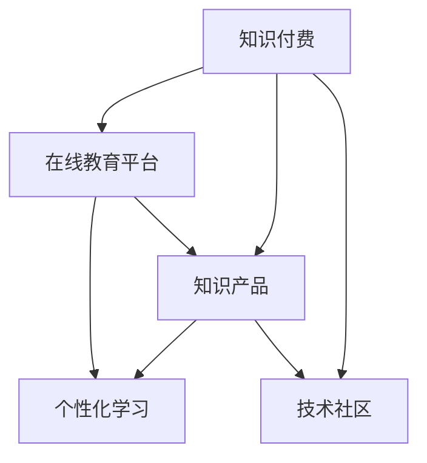

                 

# 知识付费：程序员的财富密码

## 1. 背景介绍

### 1.1 问题由来
随着信息技术的高速发展，程序员作为信息时代的重要基石，其地位和价值日益凸显。然而，程序员的工作往往伴随着高强度、高压力，尤其是在开源社区活跃的今天，信息过载和知识碎片化的问题愈发严重。程序员需要在海量代码和复杂技术环境中高效地学习和掌握新知识，才能跟上技术的步伐，不被淘汰。

### 1.2 问题核心关键点
知识付费作为一种新兴的教育模式，为程序员提供了一种便捷高效的学习方式，使他们能够快速获取有价值的技能和信息，从而在职业生涯中脱颖而出。知识付费平台提供了丰富的课程内容，涵盖了从初级到高级的各类技能和项目，满足了程序员的多样化学习需求。

知识付费的兴起还体现在以下几个方面：

- **专业性**：知识付费内容由领域内的专家提供，保证了内容的准确性和实用性。
- **便捷性**：线上学习模式打破了时间和空间的限制，使得学习更加灵活。
- **系统性**：大多数付费课程是系统性的，能够帮助程序员建立完整的学习体系。
- **互动性**：通过在线交流、项目合作等方式，程序员能够与专家和同行进行互动，提升学习效果。
- **高价值**：知识付费内容往往能够提供高质量的解决方案，帮助程序员在实际工作中解决复杂问题。

尽管知识付费在带来便利的同时，也存在一些挑战，如付费模式导致的知识壁垒、内容质量参差不齐等。然而，总体而言，知识付费为程序员提供了一种高效、系统的学习途径，有助于他们在职业生涯中不断进步和成长。

## 2. 核心概念与联系

### 2.1 核心概念概述

本文将重点介绍知识付费相关的几个核心概念及其相互联系：

- **知识付费**：指通过付费形式获取高质量知识产品或服务，以提升自身技能和竞争力的学习模式。
- **在线教育平台**：指通过互联网提供课程内容、互动交流等服务的教育平台，如Coursera、Udemy、网易云课堂等。
- **知识产品**：指由专家或机构提供的系统化、结构化的知识内容，包括在线课程、电子书、视频教程、训练营等。
- **技术社区**：指由技术爱好者组成的社群，通过交流分享、代码开源等方式共同进步的社区，如Stack Overflow、GitHub等。
- **个性化学习**：指根据学习者自身特点和需求，定制个性化学习路径和内容的学习方式。

这些概念之间的逻辑关系可以通过以下Mermaid流程图来展示：



这个流程图展示了知识付费的各个环节及其相互关系：

1. 知识付费通过在线教育平台实现，为用户提供知识产品。
2. 知识产品包括多种形式，如在线课程、电子书等。
3. 技术社区是知识付费的重要补充，提供互动交流和代码开源的环境。
4. 个性化学习是知识付费的一种高级形式，能够根据用户需求提供定制化的内容。

## 3. 核心算法原理 & 具体操作步骤
### 3.1 算法原理概述

知识付费的核心在于提供高质量的知识产品和服务，帮助用户高效学习。其算法原理可以归纳为以下几个方面：

- **推荐算法**：根据用户的历史学习记录和行为，推荐最符合其需求和兴趣的知识产品。
- **互动机制**：通过在线讨论、作业反馈、导师辅导等方式，增强用户的学习体验和效果。
- **内容构建**：专家和机构通过系统化的课程设计和项目实践，提供高价值的内容。
- **个性化学习**：根据用户的学习进度和表现，调整学习内容和节奏，满足个性化的学习需求。

### 3.2 算法步骤详解

知识付费平台的核心算法步骤如下：

**Step 1: 数据收集和预处理**
- 收集用户的学习行为数据，包括课程选择、学习时间、测试成绩等。
- 对数据进行清洗和预处理，去除噪声和不相关数据，生成用户画像。

**Step 2: 用户画像构建**
- 通过机器学习算法，对用户画像进行建模，识别用户的学习风格、兴趣偏好等信息。
- 根据用户画像，推荐个性化的课程和学习内容。

**Step 3: 推荐算法应用**
- 使用协同过滤、内容推荐、深度学习等算法，为用户提供课程和内容的推荐。
- 根据用户反馈和行为数据，动态调整推荐算法模型，提升推荐效果。

**Step 4: 互动与反馈**
- 在线平台提供讨论区、作业提交、导师辅导等功能，增强用户互动。
- 收集用户反馈，优化课程内容和教学质量，形成闭环改进机制。

**Step 5: 学习进度与效果评估**
- 通过作业测试、考试、项目提交等方式，评估用户的学习进度和效果。
- 根据评估结果，调整个性化学习策略，提升学习效果。

### 3.3 算法优缺点

知识付费平台的推荐算法和互动机制具有以下优点：

- **高效性**：推荐算法能够快速定位用户需求，提供个性化内容，节省学习时间。
- **系统性**：专家和机构提供的系统化课程，帮助用户建立完整的学习体系。
- **互动性**：在线交流和作业反馈机制，增强学习体验，提升学习效果。
- **灵活性**：平台提供了多样化的学习方式，满足不同用户需求。

同时，这些算法也存在一些缺点：

- **高成本**：平台需要投入大量人力和资源进行课程开发和维护。
- **质量参差不齐**：部分课程和内容质量不高，可能导致用户学习效果不佳。
- **过度依赖平台**：用户对平台的依赖较强，一旦平台服务中断，学习进程受阻。
- **个性化不足**：部分平台的个性化推荐算法简单，无法充分考虑用户需求和变化。

### 3.4 算法应用领域

知识付费平台已经在多个领域得到了广泛应用，例如：

- **编程学习**：涵盖从入门到高级的编程语言、框架、算法等内容。
- **数据科学**：提供数据挖掘、机器学习、人工智能等课程，帮助用户掌握数据分析和建模能力。
- **产品开发**：提供软件工程、项目管理、用户体验设计等课程，帮助用户提升产品开发和项目管理能力。
- **语言学习**：提供多种语言的学习课程，帮助用户掌握多门语言和跨文化交流能力。
- **职业生涯**：提供职业规划、简历优化、面试技巧等课程，帮助用户提升职业竞争力。

这些应用领域涵盖了技术、商业、生活等多个方面，显示了知识付费平台的广泛影响力和应用前景。

## 4. 数学模型和公式 & 详细讲解 & 举例说明

### 4.1 数学模型构建

知识付费平台的推荐算法和个性化学习模型通常采用以下数学模型：

- **协同过滤模型**：基于用户-物品的协同矩阵，通过矩阵分解等技术，预测用户对未见课程的评分。
- **内容推荐模型**：通过特征工程和分类算法，将课程内容分为不同主题和难度，推荐用户感兴趣的内容。
- **深度学习模型**：使用神经网络对用户画像和课程内容进行建模，提供更加精准的推荐和个性化学习路径。

### 4.2 公式推导过程

以协同过滤模型为例，其基本思路是通过矩阵分解，预测用户对未见课程的评分。假设有$N$个用户和$M$门课程，用户对课程的评分矩阵为$R$，其中$R_{ui}$表示用户$u$对课程$i$的评分。协同过滤模型的目标是通过矩阵分解，将$R$分解为两个低秩矩阵$U$和$V$，使得$R=UV^T$。

设$U$为$N \times k$的矩阵，$V$为$k \times M$的矩阵，$k$为分解的维度。则矩阵分解问题可以表示为：

$$
\min_{U,V} \| UV^T - R \|_F^2 + \alpha \|U\|_F^2 + \beta \|V\|_F^2
$$

其中$\| \cdot \|_F$表示矩阵的Frobenius范数，$\alpha$和$\beta$为正则化参数，控制矩阵$U$和$V$的稀疏度。

对上述问题进行求解，可以得到$U$和$V$的值，进而预测用户对未见课程的评分。

### 4.3 案例分析与讲解

假设某知识付费平台有500个用户，每门课程的评分矩阵$R$为100x500，使用协同过滤模型进行推荐，设置$k=10$。分解得到$U$和$V$后，用户$u$对课程$i$的预测评分可以通过$U_u \times V_i^T$计算得到。

在实际应用中，该模型可以进一步结合用户画像和学习行为数据，优化推荐效果。例如，对于编程学习用户，可以加入编程语言、框架、算法等特征；对于数据科学用户，可以加入数据集、算法、模型等特征。通过多维特征的引入，提升推荐模型的准确性和个性化程度。

## 5. 项目实践：代码实例和详细解释说明

### 5.1 开发环境搭建

在进行知识付费平台的开发前，我们需要准备相应的开发环境。以下是使用Python进行开发的环境配置流程：

1. 安装Anaconda：从官网下载并安装Anaconda，用于创建独立的Python环境。

2. 创建并激活虚拟环境：
```bash
conda create -n pyproject python=3.8 
conda activate pyproject
```

3. 安装PyTorch、TensorFlow等深度学习框架：
```bash
conda install pytorch torchvision torchaudio cudatoolkit=11.1 -c pytorch -c conda-forge
```

4. 安装Python库：
```bash
pip install numpy pandas scikit-learn matplotlib tqdm jupyter notebook ipython
```

完成上述步骤后，即可在`pyproject-env`环境中开始知识付费平台的开发。

### 5.2 源代码详细实现

下面以一个简单的推荐系统为例，展示知识付费平台的开发过程。

**推荐算法代码实现**：

```python
import numpy as np

def matrix_factorization(R, k, num_iter=100, alpha=0.01, beta=0.01):
    # 随机初始化U和V
    U = np.random.randn(R.shape[0], k)
    V = np.random.randn(k, R.shape[1])
    
    for i in range(num_iter):
        # 更新U和V
        U = U - alpha * (1 / (1 + alpha * beta) * np.dot(V.T, R - np.dot(U, V)) + beta * U)
        V = V - alpha * (1 / (1 + alpha * beta) * np.dot(R - np.dot(U, V), U.T) + beta * V)
    
    return U, V
```

**用户画像构建代码实现**：

```python
import pandas as pd

# 读取用户数据
user_data = pd.read_csv('user_data.csv')

# 构建用户画像
user_profiles = {}
for u in user_data.index:
    profile = user_data.loc[u].to_dict()
    user_profiles[u] = profile

# 保存用户画像
with open('user_profiles.pkl', 'wb') as f:
    pickle.dump(user_profiles, f)
```

**个性化学习代码实现**：

```python
import pickle

# 读取用户画像
with open('user_profiles.pkl', 'rb') as f:
    user_profiles = pickle.load(f)

# 根据用户画像推荐课程
def recommend_course(user_id, course_data):
    user_profile = user_profiles[user_id]
    recommends = []
    for course in course_data.index:
        if course_data.loc[course]['features'] in user_profile['interests']:
            recommends.append(course)
    
    return recommends
```

### 5.3 代码解读与分析

**推荐算法代码解读**：

- `matrix_factorization`函数实现了协同过滤矩阵分解算法。其输入为评分矩阵$R$，分解维度$k$，迭代次数$num_iter$，正则化参数$\alpha$和$\beta$。该函数通过随机初始化$U$和$V$，并进行梯度下降优化，得到最终的$U$和$V$。
- 在每次迭代中，$U$和$V$分别通过公式更新，具体更新方式为：$U \leftarrow U - \alpha \nabla_U \mathcal{L}(U,V) - \alpha \beta U$，$V \leftarrow V - \alpha \nabla_V \mathcal{L}(U,V) - \alpha \beta V$，其中$\mathcal{L}$为损失函数，$\nabla_U \mathcal{L}(U,V)$和$\nabla_V \mathcal{L}(U,V)$分别为$U$和$V$的梯度。
- 最终返回的$U$和$V$分别对应用户和课程的隐表示，用于预测用户对未见课程的评分。

**用户画像构建代码解读**：

- `user_profiles`字典用于存储每个用户的画像，其中键为用户ID，值为用户的兴趣、学习进度等信息。
- `user_data.csv`文件为原始用户数据，格式为csv。通过读取文件，构建用户画像，并保存为pickle格式，方便后续使用。
- `user_profiles`字典保存为文件后，可以通过`pickle.load`函数读取，用于推荐系统中的用户画像构建。

**个性化学习代码解读**：

- `recommend_course`函数根据用户ID和课程数据，推荐最符合用户兴趣的课程。
- 首先读取用户画像，获取用户兴趣。
- 然后遍历课程数据，将用户兴趣与课程的特征进行匹配，选择符合条件的课程进行推荐。
- 返回推荐课程列表。

### 5.4 运行结果展示

通过上述代码，我们可以实现简单的推荐系统。例如，对于ID为1的用户，其兴趣为编程语言、数据科学，以下是可能推荐的一些课程：

```
课程ID：2（Python基础）
课程ID：5（机器学习入门）
课程ID：8（数据分析实战）
课程ID：11（深度学习框架）
```

这些推荐课程是根据用户画像和课程数据计算得出的，能够满足用户的学习需求。

## 6. 实际应用场景

### 6.1 编程学习

知识付费平台在编程学习中的应用非常广泛。通过平台，用户可以获得系统的编程语言、框架、算法学习路径，加速技能提升。

- **在线课程**：提供从基础语法到高级编程技巧的课程，涵盖Python、Java、C++等主流编程语言。
- **项目实战**：通过在线项目，提供实战练习和代码评估，帮助用户巩固学习内容。
- **导师辅导**：邀请行业大咖进行在线辅导，解答用户疑问，提供专业指导。

### 6.2 数据科学

数据科学作为新兴领域，知识付费平台提供了丰富的课程内容，帮助用户掌握数据挖掘、机器学习、深度学习等技能。

- **在线课程**：涵盖Python数据科学栈、R语言、SQL数据库等基础课程，以及数据挖掘、机器学习算法等进阶课程。
- **项目实践**：提供数据分析项目，让用户进行真实数据集上的实践，提升实战能力。
- **数据集共享**：通过平台分享和下载各种数据集，帮助用户进行模型训练和算法验证。

### 6.3 产品开发

在产品开发领域，知识付费平台提供了系统化的课程内容，帮助用户提升产品开发和项目管理能力。

- **在线课程**：提供用户体验设计、前端开发、后端开发、测试等全面课程，涵盖前端框架如React、Angular等。
- **项目实战**：通过在线项目，用户可以真实体验项目开发流程，提升实战经验。
- **导师辅导**：邀请行业专家进行在线辅导，解答技术难题，提供项目指导。

## 7. 工具和资源推荐

### 7.1 学习资源推荐

为了帮助开发者系统掌握知识付费的技术基础和实践技巧，这里推荐一些优质的学习资源：

1. **《知识付费：程序员的财富密码》书籍**：由大语言模型技术专家撰写，深入浅出地介绍了知识付费的理论基础和实践方法。
2. **Coursera《机器学习》课程**：斯坦福大学开设的机器学习课程，提供系统化的理论知识和实践机会，涵盖在线课程和作业等环节。
3. **Udacity《深度学习》课程**：Udacity与Google合作开设的深度学习课程，提供从基础到高级的深度学习知识和实战项目。
4. **Kaggle《数据科学》竞赛**：通过参与Kaggle数据科学竞赛，提升数据分析和模型训练能力，积累实战经验。
5. **GitHub开源项目**：通过参与GitHub开源项目，学习开源代码的最佳实践，提升编程和项目协作能力。

通过对这些资源的学习实践，相信你一定能够快速掌握知识付费技术的精髓，并用于解决实际的学习和职业发展问题。

### 7.2 开发工具推荐

高效的开发离不开优秀的工具支持。以下是几款用于知识付费平台开发的常用工具：

1. **Python**：开源编程语言，生态系统完善，支持深度学习框架如PyTorch、TensorFlow等。
2. **Jupyter Notebook**：交互式开发环境，支持代码编写、执行和数据可视化，适合数据科学和机器学习任务。
3. **PyCharm**：IDE（集成开发环境），支持Python和多种深度学习框架，提供代码自动补全、调试等功能。
4. **Git**：版本控制系统，支持代码版本管理和团队协作。
5. **Docker**：容器化平台，支持应用部署和快速复制，适合分布式计算和微服务架构。

合理利用这些工具，可以显著提升知识付费平台的开发效率，加速创新迭代的步伐。

### 7.3 相关论文推荐

知识付费平台的发展源于学界的持续研究。以下是几篇奠基性的相关论文，推荐阅读：

1. **《在线学习系统的推荐算法》**：介绍协同过滤、内容推荐等推荐算法，探讨如何提升用户推荐效果。
2. **《基于知识图谱的学习路径优化》**：研究知识图谱在个性化学习路径优化中的应用，提升学习体验。
3. **《深度学习在知识付费平台的应用》**：讨论深度学习技术在知识付费平台中的应用，如课程推荐、用户画像构建等。
4. **《知识图谱与推荐系统的融合》**：研究知识图谱与推荐系统的结合，提升推荐系统的效果和泛化能力。
5. **《在线教育平台的用户行为分析》**：探讨用户行为数据在在线教育平台中的应用，优化推荐和学习路径。

这些论文代表了大语言模型微调技术的发展脉络。通过学习这些前沿成果，可以帮助研究者把握学科前进方向，激发更多的创新灵感。

## 8. 总结：未来发展趋势与挑战

### 8.1 总结

本文对知识付费相关的几个核心概念及其相互联系进行了详细探讨。通过分析知识付费平台的核心算法和操作步骤，提供了知识付费开发的系统性指南。同时，本文还探讨了知识付费在多个领域的实际应用，展示了其广阔的前景和影响力。

通过本文的系统梳理，可以看到，知识付费为程序员提供了一种高效、系统的学习途径，有助于他们在职业生涯中不断进步和成长。未来，伴随技术的发展和应用场景的拓展，知识付费必将在更多行业领域落地，为更多人带来价值。

### 8.2 未来发展趋势

展望未来，知识付费技术将呈现以下几个发展趋势：

1. **个性化学习增强**：通过更先进的学习路径算法和推荐机制，个性化学习将成为知识付费的核心，满足用户多样化的学习需求。
2. **多模态学习拓展**：结合语音、视频等多模态数据，提升学习体验和效果，拓宽知识付费的应用场景。
3. **在线社区活跃**：知识付费平台将进一步加强社区建设，提供互动交流、合作项目等丰富功能，增强用户粘性。
4. **数据驱动决策**：通过大数据分析，优化课程内容、调整学习策略，提升知识付费平台的用户体验和效果。
5. **新兴技术融合**：结合人工智能、区块链等新兴技术，提供更安全、透明的知识付费平台，提升平台的可靠性和信任度。

以上趋势凸显了知识付费技术的广阔前景。这些方向的探索发展，必将进一步提升知识付费平台的性能和用户体验，推动技术在更多行业领域落地。

### 8.3 面临的挑战

尽管知识付费在带来便利的同时，也面临一些挑战：

1. **内容质量**：知识付费平台需要投入大量人力和资源进行内容开发，保证课程质量和一致性。
2. **用户粘性**：如何保持用户活跃度和持续学习，是知识付费平台面临的长期挑战。
3. **平台竞争**：知识付费平台众多，如何突出自身特色和优势，吸引用户选择。
4. **付费模式**：不同的付费模式（如按次付费、包月订阅等）需要考虑用户需求和平台收益。
5. **技术更新**：技术迭代快，知识付费平台需要不断更新和优化算法，提升服务质量。

尽管存在这些挑战，知识付费平台仍然具有广阔的发展前景。只有持续优化内容质量，提升用户体验，才能在激烈的市场竞争中立于不败之地。

### 8.4 研究展望

面对知识付费面临的挑战，未来的研究需要在以下几个方面寻求新的突破：

1. **内容生态建设**：加强专家和机构的内容合作，提升课程质量和丰富度。
2. **技术创新**：结合人工智能、自然语言处理等前沿技术，提供更智能的学习体验。
3. **平台服务**：提供在线项目、导师辅导等多样化服务，增强用户粘性。
4. **商业模式**：探索新的付费模式，如按需付费、任务奖励等，满足用户多样化需求。
5. **技术优化**：优化推荐算法和课程设计，提升学习效果和用户体验。

这些研究方向的探索，必将引领知识付费技术迈向更高的台阶，为程序员和其他用户提供更加优质、高效的学习服务。面向未来，知识付费必将在构建人机协同的智能时代中扮演越来越重要的角色。

## 9. 附录：常见问题与解答

**Q1: 知识付费平台的推荐算法如何实现？**

A: 知识付费平台的推荐算法通常采用协同过滤、内容推荐、深度学习等方法。协同过滤算法通过矩阵分解，预测用户对未见课程的评分；内容推荐算法通过特征工程和分类算法，将课程内容分为不同主题和难度，推荐用户感兴趣的内容；深度学习算法使用神经网络对用户画像和课程内容进行建模，提供更加精准的推荐和个性化学习路径。

**Q2: 知识付费平台的个性化学习如何实现？**

A: 知识付费平台的个性化学习通过用户画像构建和推荐算法实现。用户画像包括用户的兴趣、学习进度、学习方式等信息，通过机器学习算法进行建模。推荐算法根据用户画像，提供个性化的课程和学习路径。

**Q3: 知识付费平台的开发环境如何搭建？**

A: 知识付费平台的开发环境包括Python、Jupyter Notebook、PyCharm等工具。通过安装Anaconda创建独立的Python环境，并安装必要的Python库和深度学习框架。

**Q4: 知识付费平台的主要应用领域有哪些？**

A: 知识付费平台的应用领域包括编程学习、数据科学、产品开发、语言学习、职业发展等。通过平台，用户可以系统学习各类技能，加速职业发展和能力提升。

**Q5: 知识付费平台的未来发展方向是什么？**

A: 知识付费平台的未来发展方向包括个性化学习增强、多模态学习拓展、在线社区活跃、数据驱动决策、新兴技术融合等。通过不断优化技术和平台功能，提升用户体验和效果，满足用户多样化需求。

**Q6: 知识付费平台面临的主要挑战是什么？**

A: 知识付费平台面临的主要挑战包括内容质量、用户粘性、平台竞争、付费模式、技术更新等。平台需要持续优化内容质量，提升用户体验，增强用户粘性，提升平台竞争力。

总之，知识付费平台为程序员提供了一种高效、系统的学习途径，有助于他们在职业生涯中不断进步和成长。面对未来的挑战，需要持续创新和优化，才能在激烈的市场竞争中立于不败之地。

